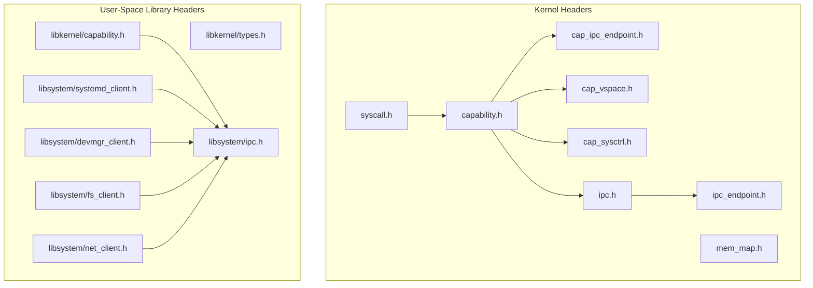
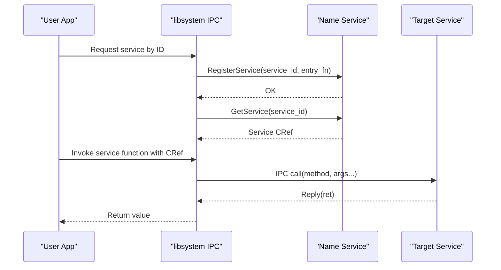
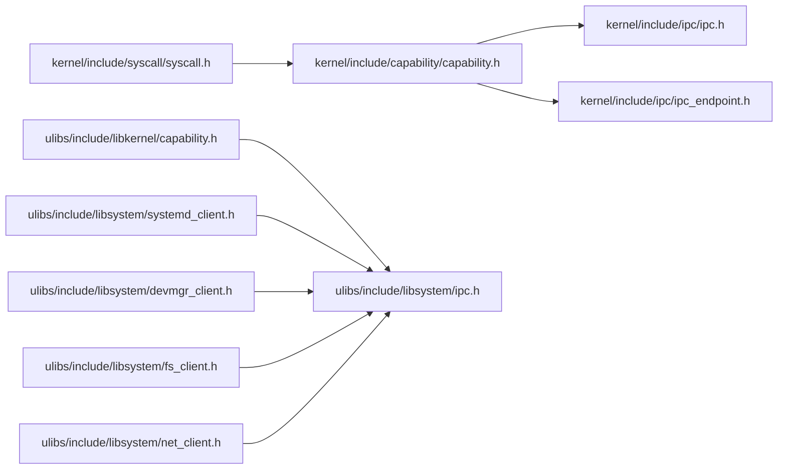

# API Reference

<cite>
**Referenced Files in This Document**
- [syscall.h](file://kernel/include/syscall/syscall.h)
- [capability.h](file://kernel/include/capability/capability.h)
- [cap_ipc_endpoint.h](file://kernel/include/capability/cap_ipc_endpoint.h)
- [cap_vspace.h](file://kernel/include/capability/cap_vspace.h)
- [cap_sysctrl.h](file://kernel/include/capability/cap_sysctrl.h)
- [ipc.h](file://kernel/include/ipc/ipc.h)
- [ipc_endpoint.h](file://kernel/include/ipc/ipc_endpoint.h)
- [types.h](file://ulibs/include/libkernel/types.h)
- [capability.h](file://ulibs/include/libkernel/capability.h)
- [ipc.h](file://ulibs/include/libsystem/ipc.h)
- [systemd_client.h](file://ulibs/include/libsystem/systemd_client.h)
- [devmgr_client.h](file://ulibs/include/libsystem/devmgr_client.h)
- [fs_client.h](file://ulibs/include/libsystem/fs_client.h)
- [net_client.h](file://ulibs/include/libsystem/net_client.h)
- [mem_map.h](file://kernel/include/mm/mem_map.h)
</cite>

## Table of Contents
1. [Introduction](#introduction)
2. [Project Structure](#project-structure)
3. [Core Components](#core-components)
4. [Architecture Overview](#architecture-overview)
5. [Detailed Component Analysis](#detailed-component-analysis)
6. [Dependency Analysis](#dependency-analysis)
7. [Performance Considerations](#performance-considerations)
8. [Troubleshooting Guide](#troubleshooting-guide)
9. [Conclusion](#conclusion)
10. [Appendices](#appendices)

## Introduction
This API Reference documents the public interfaces of TranquilOS for kernel module developers, user-space service implementers, and application authors. It covers:
- Kernel APIs for system call dispatch and capability-based invocation
- Capability APIs for object creation, rights management, and method dispatch
- IPC APIs for endpoint-based messaging and replies
- Memory management APIs for boot-time memory regions
- User-space library APIs for service clients and inter-process communication helpers

It also outlines error codes, exception handling, and performance characteristics inferred from the codebase.

## Project Structure
The API surface spans three primary areas:
- Kernel headers define system call entry points, capability dispatch, and IPC primitives
- User-space library headers define capability method enums, capability references, and service client APIs
- System service client headers define typed service functions and client operation tables

**Diagram sources**
- [syscall.h](file://kernel/include/syscall/syscall.h#L1-L8)
- [capability.h](file://kernel/include/capability/capability.h#L1-L26)
- [cap_ipc_endpoint.h](file://kernel/include/capability/cap_ipc_endpoint.h#L1-L12)
- [cap_vspace.h](file://kernel/include/capability/cap_vspace.h#L1-L12)
- [cap_sysctrl.h](file://kernel/include/capability/cap_sysctrl.h#L1-L12)
- [ipc.h](file://kernel/include/ipc/ipc.h#L1-L13)
- [ipc_endpoint.h](file://kernel/include/ipc/ipc_endpoint.h#L1-L25)
- [mem_map.h](file://kernel/include/mm/mem_map.h#L1-L29)
- [types.h](file://ulibs/include/libkernel/types.h#L1-L76)
- [capability.h](file://ulibs/include/libkernel/capability.h#L1-L141)
- [ipc.h](file://ulibs/include/libsystem/ipc.h#L1-L73)
- [systemd_client.h](file://ulibs/include/libsystem/systemd_client.h#L1-L84)
- [devmgr_client.h](file://ulibs/include/libsystem/devmgr_client.h#L1-L43)
- [fs_client.h](file://ulibs/include/libsystem/fs_client.h#L1-L47)
- [net_client.h](file://ulibs/include/libsystem/net_client.h#L1-L31)

**Section sources**
- [syscall.h](file://kernel/include/syscall/syscall.h#L1-L8)
- [capability.h](file://kernel/include/capability/capability.h#L1-L26)
- [ipc_endpoint.h](file://kernel/include/ipc/ipc_endpoint.h#L1-L25)
- [capability.h](file://ulibs/include/libkernel/capability.h#L1-L141)
- [ipc.h](file://ulibs/include/libsystem/ipc.h#L1-L73)

## Core Components
This section summarizes the principal APIs and their roles.

- Kernel System Call Dispatch
  - Entry point: syscall_process(execute_context_s *ctx)
  - Purpose: Route system calls into the kernel execution context

- Capability System
  - Capability header defines object type, rights, and reserved fields
  - Physical address field stores backing object location
  - Dispatch functions per capability type: cap_call_dispatch, cap_call_return
  - Method enums enumerate capability-specific operations

- IPC Endpoint System
  - Endpoint structure holds execution context, scheduling context, entry point, and stack pointer
  - Blocking and wake-up helpers for waiting contexts
  - Kernel IPC entry points: ipc_call_with_args, ipc_reply_with_ret

- Memory Management
  - Boot-time memory regions descriptor with type, start, end, and name
  - Accessor: boot_mm_get_regions()

- User-Space Library Interfaces
  - Capability method enums and capability reference union
  - Service client structs and function tables for systemd, devmgr, filesystem, and network services
  - IPC helpers for registering and retrieving named services

**Section sources**
- [syscall.h](file://kernel/include/syscall/syscall.h#L1-L8)
- [capability.h](file://kernel/include/capability/capability.h#L1-L26)
- [ipc_endpoint.h](file://kernel/include/ipc/ipc_endpoint.h#L1-L25)
- [ipc.h](file://kernel/include/ipc/ipc.h#L1-L13)
- [mem_map.h](file://kernel/include/mm/mem_map.h#L1-L29)
- [capability.h](file://ulibs/include/libkernel/capability.h#L1-L141)
- [ipc.h](file://ulibs/include/libsystem/ipc.h#L1-L73)
- [systemd_client.h](file://ulibs/include/libsystem/systemd_client.h#L1-L84)
- [devmgr_client.h](file://ulibs/include/libsystem/devmgr_client.h#L1-L43)
- [fs_client.h](file://ulibs/include/libsystem/fs_client.h#L1-L47)
- [net_client.h](file://ulibs/include/libsystem/net_client.h#L1-L31)

## Architecture Overview
The kernel exposes capability-based system calls and IPC endpoints. User-space clients use capability references and method enums to invoke operations via the capability call interface. System services expose endpoints registered under named service IDs.

**Diagram sources**
- [ipc.h](file://ulibs/include/libsystem/ipc.h#L52-L70)
- [ipc.h](file://kernel/include/ipc/ipc.h#L9-L12)

## Detailed Component Analysis

### Kernel System Call API
- Function: syscall_process(execute_context_s *ctx)
  - Purpose: Process a system call within the provided execution context
  - Parameters:
    - ctx: pointer to execute_context_s representing current CPU context
  - Returns: none (NORETURN implied by kernel flow)
  - Notes: This is the entry point for kernel-side system call handling

**Section sources**
- [syscall.h](file://kernel/include/syscall/syscall.h#L6-L6)

### Capability API
- Types and Structures
  - capability_header_s: fields for object type, rights, and reserved bits
  - capability_s: capability header plus physical address
  - capability_ref_t: union with cnode_id and slot_idx for capability addressing

- Methods and Rights
  - Capability types include XContext, SContext, VSpace, CNode, Console, SysCtrl, Self, IpcEndPoint, UpcallEndPoint
  - Method enums enumerate per-object operations (e.g., create, destroy, set, schedule)
  - Rights constants per capability type define allowed operations

- Dispatch Functions
  - cap_call_dispatch(execute_context_s *ctx): dispatch capability call
  - cap_call_return(execute_context_s *ctx, uint64_t ret_value): return from capability call

- Usage Notes
  - Use capability references to target specific capabilities
  - Combine capability methods with rights to control access

**Section sources**
- [capability.h](file://kernel/include/capability/capability.h#L11-L25)
- [capability.h](file://kernel/include/capability/capability.h#L22-L24)
- [capability.h](file://ulibs/include/libkernel/capability.h#L6-L41)
- [capability.h](file://ulibs/include/libkernel/capability.h#L44-L50)
- [capability.h](file://ulibs/include/libkernel/capability.h#L52-L139)

### IPC Endpoint API
- Endpoint Structure
  - ipc_endpoint_s fields:
    - entry_xctx: execution context bound to endpoint
    - scontext: scheduling context
    - entry_point, stack_pointer: execution state
    - caller_sctx: caller scheduling context
    - wait_sctx_list: list of waiting scheduling contexts

- Functions
  - ipc_endpoint_init(ep, sctx, xctx): initialize endpoint with scheduling and execution contexts
  - ipc_endpoint_block_scontext(ep, sctx): block a scheduling context on endpoint
  - ipc_endpoint_wakeup_waiting_scontexts(ep): wake all waiting contexts

- Kernel IPC Entry Points
  - ipc_call_with_args(ep_cref, ep, current_xctx): initiate IPC call
  - ipc_reply_with_ret(current_xctx, ret): reply to IPC call

- Usage Notes
  - Endpoints coordinate blocking and wake-up for synchronous IPC
  - Use capability references to target endpoint capabilities

**Section sources**
- [ipc_endpoint.h](file://kernel/include/ipc/ipc_endpoint.h#L8-L24)
- [ipc_endpoint.h](file://kernel/include/ipc/ipc_endpoint.h#L19-L23)
- [ipc.h](file://kernel/include/ipc/ipc.h#L9-L12)

### Capability-Based Endpoint Methods
- IpcEndPoint Methods
  - Rights: create, destroy
  - Dispatch: cap_IpcEndPoint_dispatch(ctx, method)

- Virtual Space Methods
  - Rights: create, destroy
  - Dispatch: cap_VSpace_dispatch(ctx, method)

- System Control Methods
  - Rights: create, destroy
  - Dispatch: cap_SysCtrl_dispatch(ctx, method)

**Section sources**
- [cap_ipc_endpoint.h](file://kernel/include/capability/cap_ipc_endpoint.h#L7-L11)
- [cap_vspace.h](file://kernel/include/capability/cap_vspace.h#L7-L11)
- [cap_sysctrl.h](file://kernel/include/capability/cap_sysctrl.h#L7-L11)

### Memory Management API
- Boot Memory Regions
  - mem_type_t: MEMORY_TEXT, MEMORY_RODATA, MEMORY_RWDATA
  - mem_region_s: describes a single region with type, start, end, name
  - mem_regions_s: array-like container with region_count and regions[]
  - boot_mm_get_regions(): returns pointer to boot-time memory regions

- Usage Notes
  - Use for introspection of initial memory layout during early boot

**Section sources**
- [mem_map.h](file://kernel/include/mm/mem_map.h#L7-L25)

### User-Space Library API: Service Clients and IPC Helpers
- IPC Helpers
  - Service IDs: NAME, SYSTEMD, DEVMGR, FS, NET
  - sys_register_service(service_id, entry_fn): register a service handler
  - sys_get_service(service_id): resolve a service CRef by ID
  - Constants: IPC_NAME_SERVICE_ENDPOINT_CREF

- Systemd Client
  - Functions: alloc_shm, get_shm, free_shm, get_mem_total, get_mem_free, get_proc_count, get_thread_count, register_upcall, page_fault, process_self_exit
  - Client struct: systemd_client_s with systemd_cref and ops table

- Devmgr Client
  - Functions: submit_shm_surface, get_cpio_addr
  - Client struct: devmgr_client_s with devmgr_cref and ops table

- Filesystem Client
  - Functions: open, read, write, close
  - Client struct: fs_client_s with fs_cref and ops table

- Network Client
  - Functions: send, recv, get_mac
  - Client struct: net_client_s with net_cref and ops table

- Usage Notes
  - Resolve service CRefs via sys_get_service before invoking client functions
  - Use capability method enums and CRefs to call into kernel services

**Section sources**
- [ipc.h](file://ulibs/include/libsystem/ipc.h#L11-L34)
- [ipc.h](file://ulibs/include/libsystem/ipc.h#L52-L70)
- [systemd_client.h](file://ulibs/include/libsystem/systemd_client.h#L7-L52)
- [systemd_client.h](file://ulibs/include/libsystem/systemd_client.h#L77-L84)
- [devmgr_client.h](file://ulibs/include/libsystem/devmgr_client.h#L7-L27)
- [devmgr_client.h](file://ulibs/include/libsystem/devmgr_client.h#L36-L43)
- [fs_client.h](file://ulibs/include/libsystem/fs_client.h#L7-L27)
- [fs_client.h](file://ulibs/include/libsystem/fs_client.h#L40-L47)
- [net_client.h](file://ulibs/include/libsystem/net_client.h#L7-L11)
- [net_client.h](file://ulibs/include/libsystem/net_client.h#L23-L31)

### Capability Method Enums and Reference Model
- Capability Reference
  - capability_ref_t: union with cnode_id and slot_idx for addressing
  - CNODE_CURRENT_CREF constant for current cnode

- Method Enums
  - CNode, Console, Futex, SContext, SysCtrl, Self, Timer, VSpace, XContext, IpcEndPoint, UpcallEndPoint
  - Each enum group defines a set of methods (e.g., create, destroy, init, call, reply)

- Usage Notes
  - Use capability references to target specific kernel objects
  - Select methods from the appropriate enum for the object type

**Section sources**
- [capability.h](file://ulibs/include/libkernel/capability.h#L4-L50)
- [capability.h](file://ulibs/include/libkernel/capability.h#L52-L139)

### Map Result Codes (Memory Mapping)
- Enum map_result_t enumerates mapping outcomes including success and various failure categories keyed by level and cause
- Utility: map_result_to_string(result) converts codes to human-readable strings

**Section sources**
- [types.h](file://ulibs/include/libkernel/types.h#L4-L74)

## Dependency Analysis
The following diagram shows key dependencies among headers:

**Diagram sources**
- [capability.h](file://kernel/include/capability/capability.h#L1-L26)
- [ipc.h](file://kernel/include/ipc/ipc.h#L1-L13)
- [ipc_endpoint.h](file://kernel/include/ipc/ipc_endpoint.h#L1-L25)
- [syscall.h](file://kernel/include/syscall/syscall.h#L1-L8)
- [capability.h](file://ulibs/include/libkernel/capability.h#L1-L141)
- [ipc.h](file://ulibs/include/libsystem/ipc.h#L1-L73)
- [systemd_client.h](file://ulibs/include/libsystem/systemd_client.h#L1-L84)
- [devmgr_client.h](file://ulibs/include/libsystem/devmgr_client.h#L1-L43)
- [fs_client.h](file://ulibs/include/libsystem/fs_client.h#L1-L47)
- [net_client.h](file://ulibs/include/libsystem/net_client.h#L1-L31)

**Section sources**
- [capability.h](file://kernel/include/capability/capability.h#L1-L26)
- [ipc.h](file://kernel/include/ipc/ipc.h#L1-L13)
- [ipc_endpoint.h](file://kernel/include/ipc/ipc_endpoint.h#L1-L25)
- [syscall.h](file://kernel/include/syscall/syscall.h#L1-L8)
- [capability.h](file://ulibs/include/libkernel/capability.h#L1-L141)
- [ipc.h](file://ulibs/include/libsystem/ipc.h#L1-L73)
- [systemd_client.h](file://ulibs/include/libsystem/systemd_client.h#L1-L84)
- [devmgr_client.h](file://ulibs/include/libsystem/devmgr_client.h#L1-L43)
- [fs_client.h](file://ulibs/include/libsystem/fs_client.h#L1-L47)
- [net_client.h](file://ulibs/include/libsystem/net_client.h#L1-L31)

## Performance Considerations
- Capability dispatch overhead is minimal and intended to be lightweight for frequent kernel interactions
- IPC endpoints support blocking and wake-up semantics; avoid long blocking periods to maintain responsiveness
- Memory mapping results provide granular diagnostics for mapping failures; prefer batched operations where feasible
- Service resolution via sys_get_service includes retries; cache resolved CRefs to reduce repeated lookups

[No sources needed since this section provides general guidance]

## Troubleshooting Guide
- Capability Reference Issues
  - Ensure capability_ref_t fields are correctly populated (cnode_id, slot_idx)
  - Verify capability rights match the intended operation

- IPC Endpoint Deadlocks
  - Confirm that every ipc_call_with_args has a corresponding ipc_reply_with_ret
  - Use ipc_endpoint_block_scontext and ipc_endpoint_wakeup_waiting_scontexts appropriately

- Service Resolution Failures
  - sys_get_service may return the name service CRef until the target service registers; implement retry logic as shown in the helper

- Memory Mapping Failures
  - Inspect map_result_t codes to diagnose invalid entries, null pointers, or already-mapped pages

**Section sources**
- [ipc_endpoint.h](file://kernel/include/ipc/ipc_endpoint.h#L19-L23)
- [ipc.h](file://kernel/include/ipc/ipc.h#L9-L12)
- [ipc.h](file://ulibs/include/libsystem/ipc.h#L61-L70)
- [types.h](file://ulibs/include/libkernel/types.h#L4-L74)

## Conclusion
This API reference consolidates the kernel’s capability and IPC interfaces, the memory management boot regions API, and the user-space service client interfaces. By leveraging capability references, method enums, and IPC helpers, developers can implement robust kernel modules, system services, and user applications within the TranquilOS framework.

[No sources needed since this section summarizes without analyzing specific files]

## Appendices

### Appendix A: API Versioning, Backward Compatibility, and Deprecation
- No explicit version macros or deprecation markers were identified in the referenced headers
- Recommendations:
  - Introduce semantic versioning macros in public headers
  - Add static assertions or compile-time checks for ABI compatibility
  - Use deprecation attributes for removed APIs and provide migration paths

[No sources needed since this section provides general guidance]

### Appendix B: Error Codes and Exception Handling
- Map result codes for memory mapping are defined in map_result_t with a helper to convert to string
- IPC and capability calls rely on return values; ensure callers check and propagate errors appropriately
- System call and capability dispatch are designed to handle exceptional conditions internally; user-space should validate inputs and handle negative return codes

**Section sources**
- [types.h](file://ulibs/include/libkernel/types.h#L4-L74)