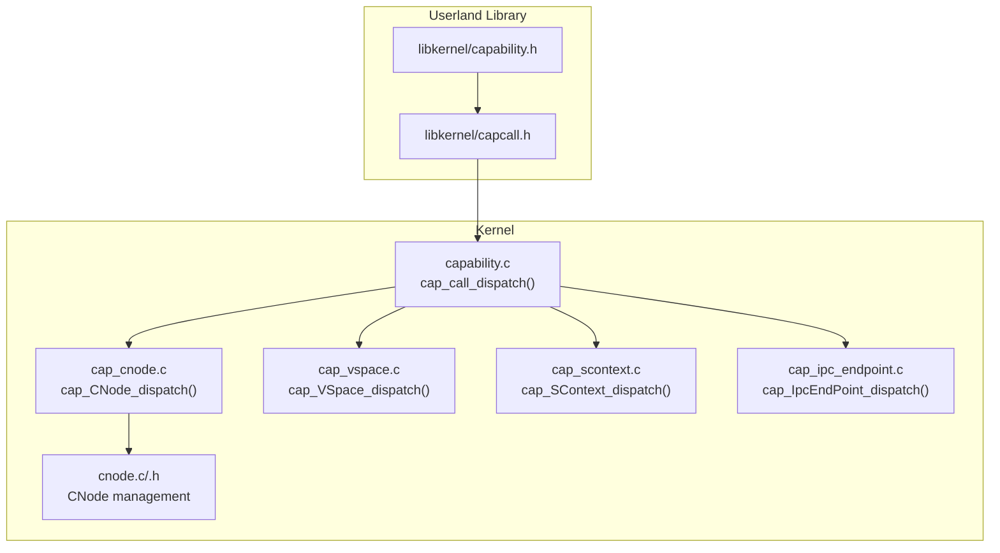
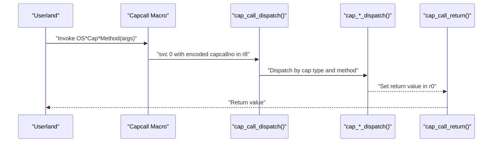
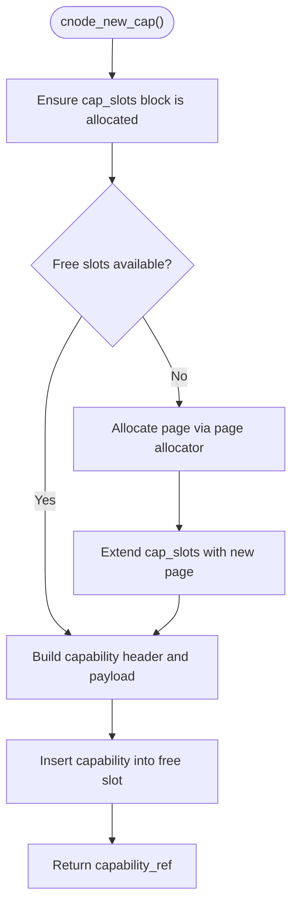
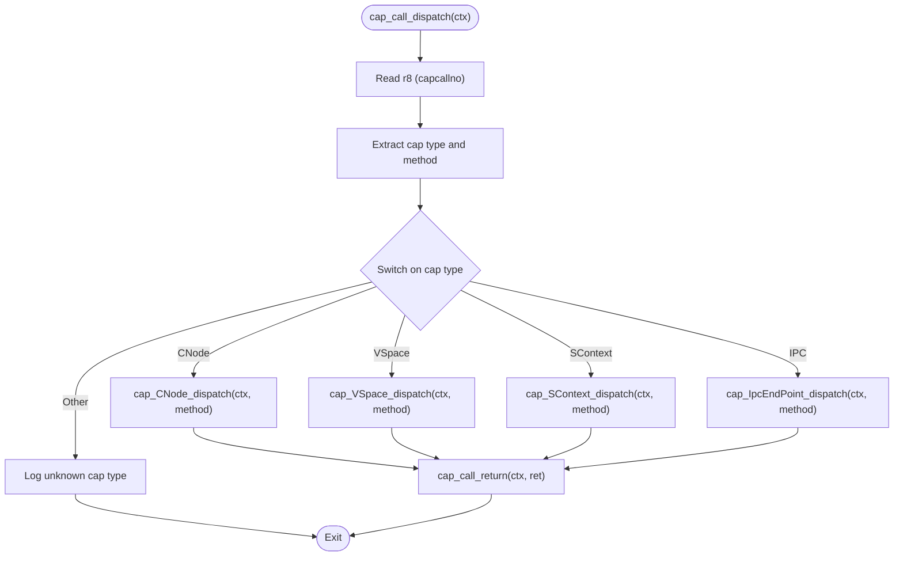
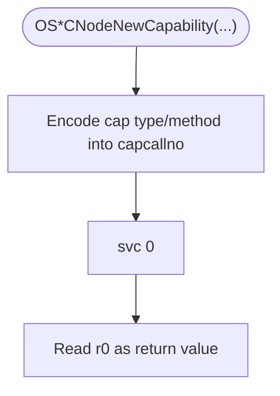
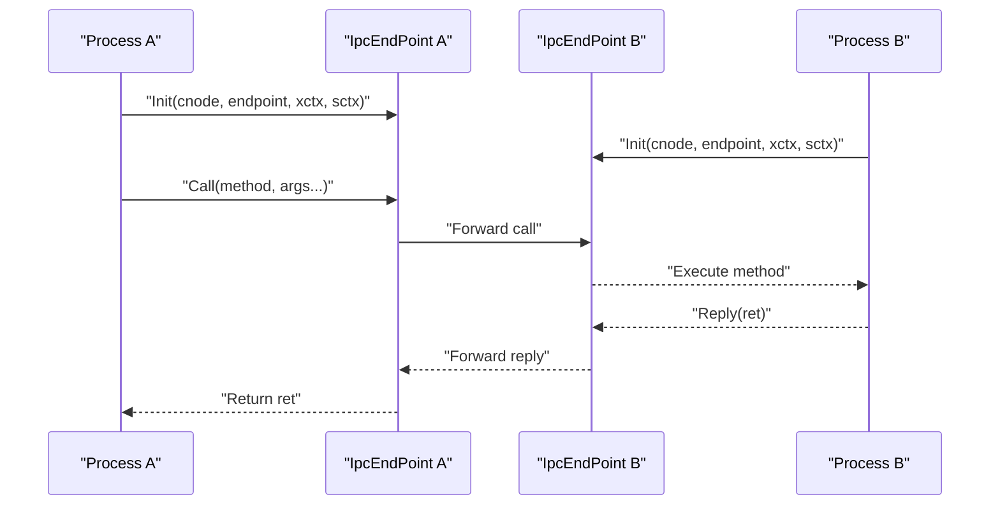
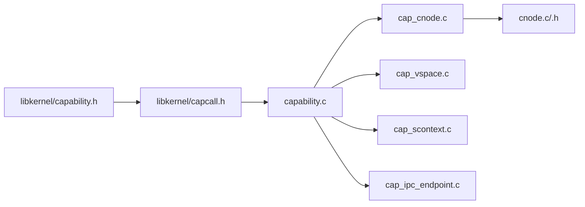

# Capability APIs

<cite>
**Referenced Files in This Document**
- [capability.c](file://kernel/capability/capability.c)
- [capability.h](file://kernel/include/capability/capability.h)
- [cnode.c](file://kernel/capability/cnode.c)
- [cnode.h](file://kernel/include/capability/cnode.h)
- [capability.h](file://ulibs/include/libkernel/capability.h)
- [capcall.h](file://ulibs/include/libkernel/capcall.h)
- [cap_cnode.c](file://kernel/capability/cap_cnode.c)
- [cap_ipc_endpoint.c](file://kernel/capability/cap_ipc_endpoint.c)
- [cap_scontext.c](file://kernel/capability/cap_scontext.c)
- [cap_vspace.c](file://kernel/capability/cap_vspace.c)
- [cap_ipc_endpoint.h](file://kernel/include/capability/cap_ipc_endpoint.h)
- [cap_scontext.h](file://kernel/include/capability/cap_scontext.h)
- [cap_vspace.h](file://kernel/include/capability/cap_vspace.h)
- [ipc.h](file://kernel/include/ipc/ipc.h)
</cite>

## Table of Contents
1. [Introduction](#introduction)
2. [Project Structure](#project-structure)
3. [Core Components](#core-components)
4. [Architecture Overview](#architecture-overview)
5. [Detailed Component Analysis](#detailed-component-analysis)
6. [Dependency Analysis](#dependency-analysis)
7. [Performance Considerations](#performance-considerations)
8. [Troubleshooting Guide](#troubleshooting-guide)
9. [Conclusion](#conclusion)
10. [Appendices](#appendices)

## Introduction
This document describes the capability-based security system of TranquilOS. It focuses on capability creation, destruction, and manipulation interfaces; CNode management; capability dispatch mechanisms; and permission system APIs. It also documents the capcall macro system used by userland libraries to invoke kernel capabilities, along with practical examples of capability-based programming patterns, rights management, and secure IPC communication. Security considerations and best practices are included to guide safe usage of capabilities.

## Project Structure
The capability subsystem spans kernel-side capability dispatchers, capability nodes (CNodes), and userland macros that encode capability calls. The kernel exposes capability dispatchers per object type; the CNode manages capability slots; and userland provides a set of macros to construct capability calls and invoke them via a supervisor call.

**Diagram sources**
- [capability.c](file://kernel/capability/capability.c#L14-L58)
- [cap_cnode.c](file://kernel/capability/cap_cnode.c#L163-L184)
- [cap_vspace.c](file://kernel/capability/cap_vspace.c#L213-L243)
- [cap_scontext.c](file://kernel/capability/cap_scontext.c#L420-L462)
- [cap_ipc_endpoint.c](file://kernel/capability/cap_ipc_endpoint.c#L124-L145)
- [cnode.c](file://kernel/capability/cnode.c#L9-L95)
- [capability.h](file://ulibs/include/libkernel/capability.h#L1-L141)
- [capcall.h](file://ulibs/include/libkernel/capcall.h#L1-L177)

**Section sources**
- [capability.c](file://kernel/capability/capability.c#L1-L58)
- [capability.h](file://kernel/include/capability/capability.h#L1-L26)
- [capability.h](file://ulibs/include/libkernel/capability.h#L1-L141)
- [capcall.h](file://ulibs/include/libkernel/capcall.h#L1-L177)

## Core Components
- Capability header and layout: Defines the capability structure with type, rights, and physical address payload.
- Capability dispatch: Central dispatcher decodes the capability number and routes to the appropriate capability object’s method handler.
- CNode: Capability node that stores capability references and manages capability slots.
- Capcall macros: Userland macros that encode capability calls and issue supervisor calls.

Key definitions and interfaces:
- Capability header and structure: [capability.h](file://kernel/include/capability/capability.h#L11-L20)
- Dispatch entry points: [capability.c](file://kernel/capability/capability.c#L14-L58)
- CNode APIs: [cnode.h](file://kernel/include/capability/cnode.h#L11-L26), [cnode.c](file://kernel/capability/cnode.c#L9-L95)
- Capability object types and method enums: [capability.h](file://ulibs/include/libkernel/capability.h#L6-L139)
- Capcall macro system: [capcall.h](file://ulibs/include/libkernel/capcall.h#L13-L177)

**Section sources**
- [capability.h](file://kernel/include/capability/capability.h#L11-L26)
- [capability.c](file://kernel/capability/capability.c#L14-L58)
- [cnode.h](file://kernel/include/capability/cnode.h#L11-L26)
- [cnode.c](file://kernel/capability/cnode.c#L9-L95)
- [capability.h](file://ulibs/include/libkernel/capability.h#L6-L139)
- [capcall.h](file://ulibs/include/libkernel/capcall.h#L13-L177)

## Architecture Overview
The capability call flow:
1. Userland constructs a capability call using capcall macros.
2. The macro encodes the capability type and method into a 32-bit capability number and passes it via a dedicated register.
3. The kernel’s capability dispatcher reads the capability number, extracts the capability type and method, and dispatches to the corresponding capability object.
4. The capability object performs the requested operation and returns a value via a designated register.

**Diagram sources**
- [capcall.h](file://ulibs/include/libkernel/capcall.h#L15-L27)
- [capability.c](file://kernel/capability/capability.c#L14-L58)

**Section sources**
- [capability.c](file://kernel/capability/capability.c#L14-L58)
- [capcall.h](file://ulibs/include/libkernel/capcall.h#L15-L27)

## Detailed Component Analysis

### Capability Header and Rights Model
- Capability header fields:
  - type: 8 bits indicating the kernel object type.
  - rights: 32 bits representing capability rights bitmask.
  - reserved: 24 bits reserved for future use.
- Physical address payload: The capability carries a physical address pointing to the kernel object instance.

Rights model:
- Rights are represented as bitmasks per capability type. Examples include:
  - IPC endpoint rights: [cap_ipc_endpoint.h](file://kernel/include/capability/cap_ipc_endpoint.h#L7-L8)
  - SContext rights: [cap_scontext.h](file://kernel/include/capability/cap_scontext.h#L7-L8)
  - Virtual space rights: [cap_vspace.h](file://kernel/include/capability/cap_vspace.h#L7-L8)

Security note:
- Permission checks are currently marked as TODO in the dispatcher. Implement access control based on the rights field and capability provenance before exposing to production.

**Section sources**
- [capability.h](file://kernel/include/capability/capability.h#L9-L20)
- [capability.h](file://kernel/include/capability/capability.h#L11-L20)
- [cap_ipc_endpoint.h](file://kernel/include/capability/cap_ipc_endpoint.h#L7-L8)
- [cap_scontext.h](file://kernel/include/capability/cap_scontext.h#L7-L8)
- [cap_vspace.h](file://kernel/include/capability/cap_vspace.h#L7-L8)

### CNode Management APIs
CNode acts as a capability container with indexed slots. It supports initialization, extension, and capability creation.

- Initialization:
  - cnode_init(node, id, addr): Initializes a CNode with a given ID and backing page.
- Extension:
  - cnode_extend(node, paddr): Extends the CNode’s storage by allocating and linking a new page.
- Capability creation:
  - cnode_new_cap(node, type, rights, paddr): Allocates a free slot, fills in capability metadata, and returns a capability reference.
- Retrieval:
  - cnode_get_cap(node, cref): Retrieves a capability by index.
  - cnode_get(sctx, cnode_ref): Resolves a CNode reference to a capability_node_s pointer.
- ID generation:
  - cnode_gen_id(): Generates a new CNode ID.

**Diagram sources**
- [cnode.c](file://kernel/capability/cnode.c#L23-L59)

**Section sources**
- [cnode.h](file://kernel/include/capability/cnode.h#L11-L26)
- [cnode.c](file://kernel/capability/cnode.c#L9-L95)

### Capability Dispatch Mechanism
The kernel decodes the capability number from a dedicated register, extracts the capability type and method, and dispatches to the appropriate capability object.

- Capability number encoding:
  - Bits 31..24: capability type
  - Bits 23..16: method index
  - Bit 31: call mask
- Dispatch logic:
  - cap_call_dispatch(ctx): Reads r8, extracts type/method, and branches to the matching cap_*_dispatch.
  - cap_call_return(ctx, ret_value): Writes the return value into r0.

**Diagram sources**
- [capability.c](file://kernel/capability/capability.c#L14-L58)

**Section sources**
- [capability.c](file://kernel/capability/capability.c#L14-L58)

### Permission System APIs
- Rights constants:
  - CAP_RIGHT_ALL: All rights enabled.
- Rights per capability type:
  - IPC endpoint rights: [cap_ipc_endpoint.h](file://kernel/include/capability/cap_ipc_endpoint.h#L7-L8)
  - SContext rights: [cap_scontext.h](file://kernel/include/capability/cap_scontext.h#L7-L8)
  - Virtual space rights: [cap_vspace.h](file://kernel/include/capability/cap_vspace.h#L7-L8)
- TODO: Implement permission checks in the dispatcher and capability handlers before allowing operations.

Security considerations:
- Enforce rights checks before performing sensitive operations (e.g., mapping pages, scheduling, IPC).
- Validate capability references and ensure callers possess the necessary rights.

**Section sources**
- [capability.h](file://kernel/include/capability/capability.h#L9-L9)
- [cap_ipc_endpoint.h](file://kernel/include/capability/cap_ipc_endpoint.h#L7-L8)
- [cap_scontext.h](file://kernel/include/capability/cap_scontext.h#L7-L8)
- [cap_vspace.h](file://kernel/include/capability/cap_vspace.h#L7-L8)
- [capability.c](file://kernel/capability/capability.c#L20-L20)

### Capcall Macro System
The capcall macros encode capability calls and issue supervisor calls. They define OS*Cap*Method wrappers that:
- Encode the capability type and method into a 32-bit number.
- Pass arguments via registers.
- Issue svc 0 and return the result.

Examples of generated wrappers:
- SysCtrl getters and updates: [capcall.h](file://ulibs/include/libkernel/capcall.h#L128-L134)
- Self operations: [capcall.h](file://ulibs/include/libkernel/capcall.h#L136-L138)
- VSpace operations: [capcall.h](file://ulibs/include/libkernel/capcall.h#L140-L145)
- CNode operations: [capcall.h](file://ulibs/include/libkernel/capcall.h#L147-L149)
- SContext operations: [capcall.h](file://ulibs/include/libkernel/capcall.h#L151-L160)
- XContext init: [capcall.h](file://ulibs/include/libkernel/capcall.h#L162-L162)
- Console print: [capcall.h](file://ulibs/include/libkernel/capcall.h#L164-L164)
- IPC endpoint init/call/reply: [capcall.h](file://ulibs/include/libkernel/capcall.h#L166-L172)
- Upcall endpoint init/reply: [capcall.h](file://ulibs/include/libkernel/capcall.h#L174-L175)

**Diagram sources**
- [capcall.h](file://ulibs/include/libkernel/capcall.h#L15-L27)

**Section sources**
- [capcall.h](file://ulibs/include/libkernel/capcall.h#L13-L177)

### Capability Types and Methods

#### CNode
- Methods:
  - Create: Initialize a new CNode.
  - NewCapability: Create a new capability in the node.
  - Prepare: Initialize a target CNode with a page.
  - Extend: Extend a target CNode with a page.
  - Destroy: Remove a CNode.
- Implementation: [cap_cnode.c](file://kernel/capability/cap_cnode.c#L163-L184)
- Userland methods: [capability.h](file://ulibs/include/libkernel/capability.h#L52-L58)

#### Virtual Space (VSpace)
- Methods:
  - Create: Create a virtual address space.
  - Prepare: Prepare a page table for the address space.
  - TryMapPage: Attempt to map a single page.
  - TryMapRange: Attempt to map a range.
  - Extend: Extend the page table.
  - UnMapPage: Unmap a single page.
  - UnMapRange: Unmap a range.
  - Destroy: Destroy the address space.
- Implementation: [cap_vspace.c](file://kernel/capability/cap_vspace.c#L213-L243)
- Userland methods: [capability.h](file://ulibs/include/libkernel/capability.h#L109-L118)

#### Schedule Context (SContext)
- Methods:
  - Create: Create a schedule context.
  - Destroy: Destroy a schedule context.
  - SetCNode: Bind a CNode to a schedule context.
  - SetCNodeCurrent: Bind the current CNode to a schedule context.
  - SetVSpace: Bind a VSpace to a schedule context.
  - SetVSpaceCurrent: Bind the current VSpace to a schedule context.
  - SetXContext: Bind an XContext to a schedule context.
  - SetName: Set a human-readable name.
  - SetPid: Set a PID.
  - SetUpcall: Bind an Upcall Endpoint for asynchronous callbacks.
  - Schedule: Add to the global scheduler.
  - ScheduleOn: Add to the scheduler with CPU affinity.
- Implementation: [cap_scontext.c](file://kernel/capability/cap_scontext.c#L420-L462)
- Userland methods: [capability.h](file://ulibs/include/libkernel/capability.h#L72-L85)

#### IPC Endpoint
- Methods:
  - Create: Create an IPC endpoint.
  - Init: Initialize an endpoint with an XContext and SContext.
  - Call: Invoke a remote method via IPC.
  - Reply: Reply to an incoming IPC call.
  - Destroy: Destroy the endpoint.
- Implementation: [cap_ipc_endpoint.c](file://kernel/capability/cap_ipc_endpoint.c#L124-L145)
- Userland methods: [capability.h](file://ulibs/include/libkernel/capability.h#L126-L132)

#### Upcall Endpoint
- Methods:
  - Create: Create an upcall endpoint.
  - Init: Initialize an upcall endpoint with an XContext and SContext.
  - Reply: Reply to an upcall.
  - Destroy: Destroy the endpoint.
- Implementation: [cap_ipc_endpoint.c](file://kernel/capability/cap_ipc_endpoint.c#L124-L145)
- Userland methods: [capability.h](file://ulibs/include/libkernel/capability.h#L134-L139)

**Section sources**
- [cap_cnode.c](file://kernel/capability/cap_cnode.c#L163-L184)
- [cap_vspace.c](file://kernel/capability/cap_vspace.c#L213-L243)
- [cap_scontext.c](file://kernel/capability/cap_scontext.c#L420-L462)
- [cap_ipc_endpoint.c](file://kernel/capability/cap_ipc_endpoint.c#L124-L145)
- [capability.h](file://ulibs/include/libkernel/capability.h#L52-L139)

### Secure IPC Communication
IPC endpoints enable capability-based inter-process communication. The typical flow:
1. Create an IPC endpoint capability in a CNode.
2. Initialize the endpoint with an XContext and SContext.
3. Call remote methods via the endpoint.
4. Reply to incoming calls from the other side.

**Diagram sources**
- [cap_ipc_endpoint.c](file://kernel/capability/cap_ipc_endpoint.c#L16-L119)
- [ipc.h](file://kernel/include/ipc/ipc.h#L9-L12)
- [capcall.h](file://ulibs/include/libkernel/capcall.h#L166-L172)

**Section sources**
- [cap_ipc_endpoint.c](file://kernel/capability/cap_ipc_endpoint.c#L16-L119)
- [ipc.h](file://kernel/include/ipc/ipc.h#L9-L12)
- [capcall.h](file://ulibs/include/libkernel/capcall.h#L166-L172)

### Capability-Based Programming Patterns
- Capability creation pattern:
  - Allocate a capability slot in a CNode.
  - Fill in type, rights, and physical address.
  - Pass the capability reference to other contexts.
- Rights management pattern:
  - Grant minimal rights required for a capability.
  - Revoke or replace capabilities when privileges change.
- Secure IPC pattern:
  - Bind XContext and SContext to endpoints during init.
  - Use Call/Reply to exchange messages safely.
- Rights verification pattern:
  - Implement permission checks in capability handlers before performing operations.

[No sources needed since this section synthesizes patterns without analyzing specific files]

## Dependency Analysis
The capability subsystem exhibits clear separation of concerns:
- Userland library defines capability types and method enums.
- Capcall macros encode calls and invoke the kernel.
- Kernel dispatchers route calls to capability-specific handlers.
- Capability handlers operate on kernel objects (CNode, VSpace, SContext, IPC).

**Diagram sources**
- [capability.h](file://ulibs/include/libkernel/capability.h#L6-L139)
- [capcall.h](file://ulibs/include/libkernel/capcall.h#L13-L177)
- [capability.c](file://kernel/capability/capability.c#L14-L58)
- [cap_cnode.c](file://kernel/capability/cap_cnode.c#L163-L184)
- [cap_vspace.c](file://kernel/capability/cap_vspace.c#L213-L243)
- [cap_scontext.c](file://kernel/capability/cap_scontext.c#L420-L462)
- [cap_ipc_endpoint.c](file://kernel/capability/cap_ipc_endpoint.c#L124-L145)
- [cnode.c](file://kernel/capability/cnode.c#L9-L95)

**Section sources**
- [capability.c](file://kernel/capability/capability.c#L14-L58)
- [capcall.h](file://ulibs/include/libkernel/capcall.h#L13-L177)
- [capability.h](file://ulibs/include/libkernel/capability.h#L6-L139)

## Performance Considerations
- Minimize capability dereferencing overhead by caching frequently accessed capabilities in local contexts.
- Batch capability operations (e.g., multiple capability creations) to reduce page allocation churn.
- Keep capability counts reasonable to avoid long walks in CNode slot tables.
- Use rights to prevent unnecessary work by early rejection of unauthorized operations.

[No sources needed since this section provides general guidance]

## Troubleshooting Guide
Common issues and remedies:
- Unknown capability type:
  - Symptom: Dispatcher logs an “unknown cap type” error.
  - Action: Verify the capability type enumeration and ensure the handler is implemented.
  - Reference: [capability.c](file://kernel/capability/capability.c#L50-L52)
- Null capability node:
  - Symptom: Panic or error when resolving a CNode reference.
  - Action: Ensure the CNode is prepared or extended before use.
  - References: [cnode.c](file://kernel/capability/cnode.c#L66-L90), [cap_cnode.c](file://kernel/capability/cap_cnode.c#L93-L126)
- Free slots exhausted:
  - Symptom: Failure to insert a capability.
  - Action: Extend the CNode with additional pages.
  - Reference: [cnode.c](file://kernel/capability/cnode.c#L42-L48)
- Permission denied:
  - Symptom: Operation fails due to insufficient rights.
  - Action: Adjust rights or implement permission checks.
  - References: [capability.c](file://kernel/capability/capability.c#L20-L20), [cap_ipc_endpoint.h](file://kernel/include/capability/cap_ipc_endpoint.h#L7-L8)

**Section sources**
- [capability.c](file://kernel/capability/capability.c#L20-L52)
- [cnode.c](file://kernel/capability/cnode.c#L42-L90)
- [cap_cnode.c](file://kernel/capability/cap_cnode.c#L93-L126)
- [cap_ipc_endpoint.h](file://kernel/include/capability/cap_ipc_endpoint.h#L7-L8)

## Conclusion
TranquilOS implements a capability-based security model with a clear separation between userland capcall macros and kernel capability dispatchers. The CNode serves as the central capability container, while specialized handlers manage object lifecycles and operations. Rights management remains a TODO and must be implemented to enforce access control. By following the documented patterns and best practices, developers can build secure, modular systems using capabilities.

[No sources needed since this section summarizes without analyzing specific files]

## Appendices

### Capability Types Reference
- XContext: Execution context for threads.
- SContext: Schedule context for scheduling and upcalls.
- VSpace: Virtual address space for memory management.
- CNode: Capability node for capability containers.
- Console: Console output capability.
- SysCtrl: System control capability.
- Self: Self-control capability (yield, sleep, caller PID).
- IpcEndPoint: IPC endpoint for inter-process communication.
- UpcallEndPoint: Endpoint for asynchronous upcalls.

**Section sources**
- [capability.h](file://ulibs/include/libkernel/capability.h#L6-L18)

### Method Definitions Reference
- CNode: Create, NewCapability, Prepare, Extend, Destroy
- VSpace: Create, Prepare, TryMapPage, TryMapRange, Extend, UnMapPage, UnMapRange, Destroy
- SContext: Create, Destroy, SetCNode, SetCNodeCurrent, SetVSpace, SetVSpaceCurrent, SetXContext, SetName, SetPid, SetUpcall, Schedule, ScheduleOn
- IPC Endpoint: Create, Init, Call, Reply, Destroy
- Upcall Endpoint: Create, Init, Reply, Destroy

**Section sources**
- [capability.h](file://ulibs/include/libkernel/capability.h#L52-L139)