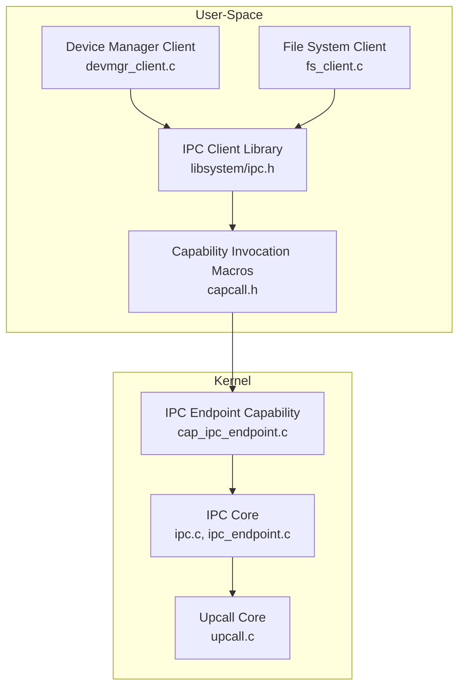
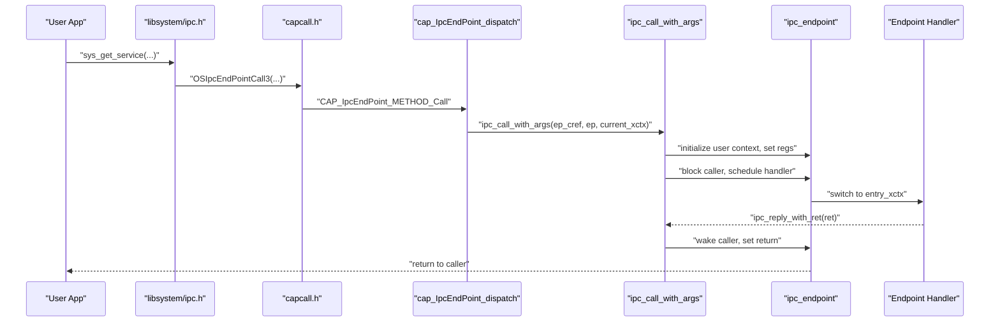
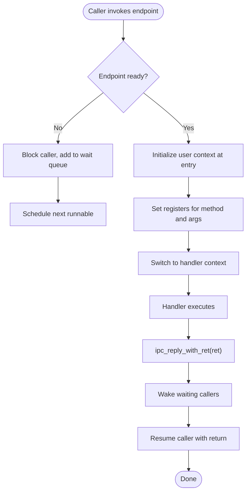
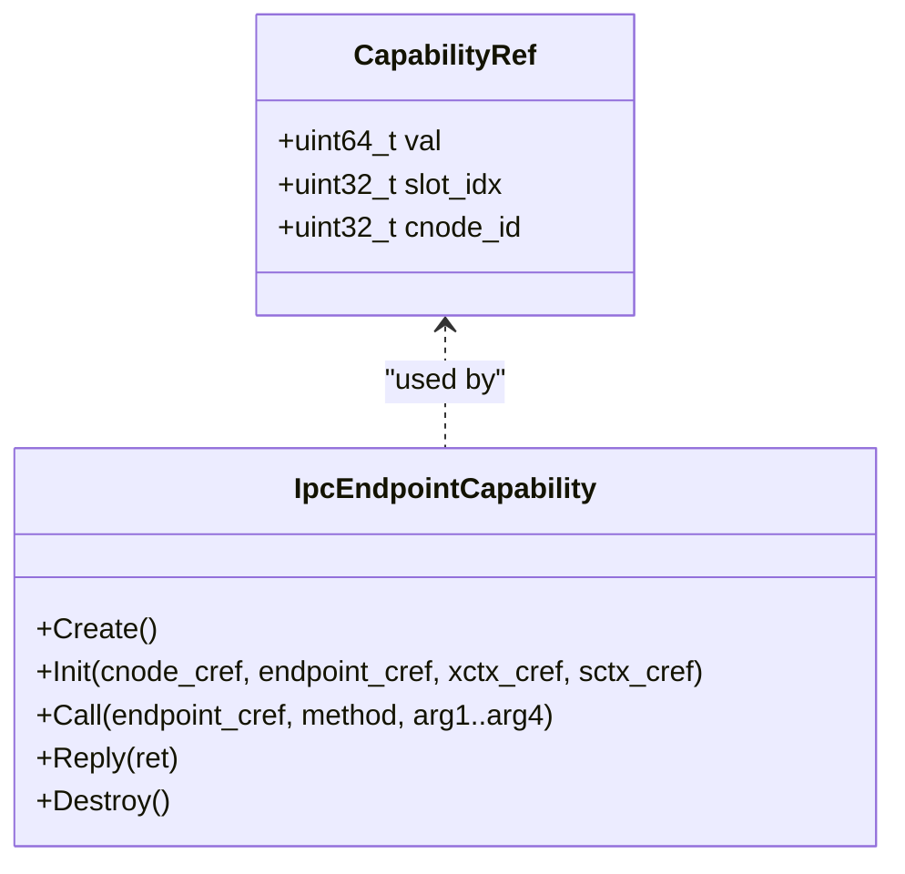
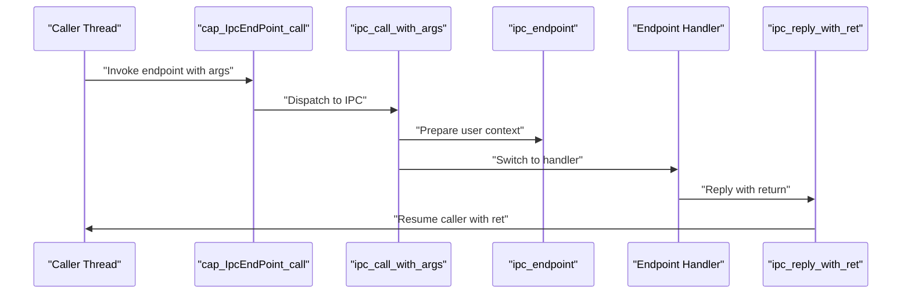
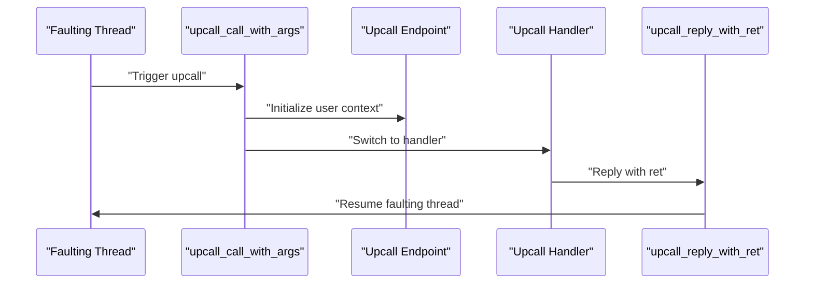
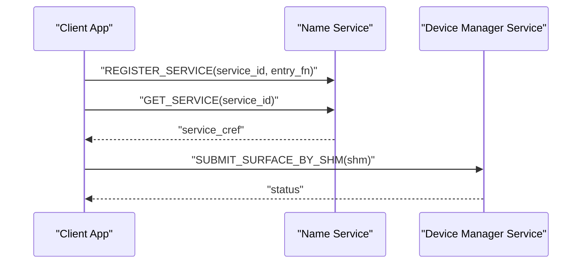
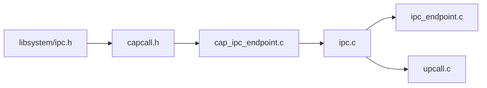
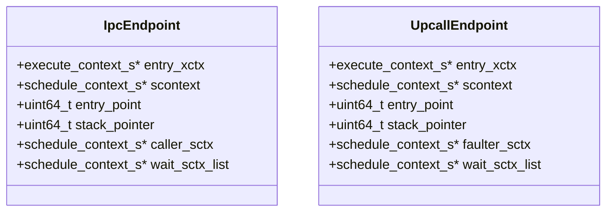

# IPC APIs

<cite>
**Referenced Files in This Document**
- [ipc.h](file://kernel/include/ipc/ipc.h)
- [ipc_endpoint.h](file://kernel/include/ipc/ipc_endpoint.h)
- [ipc.c](file://kernel/ipc/ipc.c)
- [ipc_endpoint.c](file://kernel/ipc/ipc_endpoint.c)
- [cap_ipc_endpoint.h](file://kernel/include/capability/cap_ipc_endpoint.h)
- [cap_ipc_endpoint.c](file://kernel/capability/cap_ipc_endpoint.c)
- [upcall_endpoint.h](file://kernel/include/upcall/upcall_endpoint.h)
- [upcall.c](file://kernel/upcall/upcall.c)
- [cap_upcall_endpoint.h](file://kernel/include/capability/cap_upcall_endpoint.h)
- [capcall.h](file://ulibs/include/libkernel/capcall.h)
- [capability.h](file://ulibs/include/libkernel/capability.h)
- [ipc.h](file://ulibs/include/libsystem/ipc.h)
- [devmgr_client.c](file://ulibs/libsystem/devmgr_client.c)
- [fs_client.c](file://ulibs/libsystem/fs_client.c)
- [service.h](file://kernel/systemd/include/service.h)
</cite>

## Table of Contents
1. [Introduction](#introduction)
2. [Project Structure](#project-structure)
3. [Core Components](#core-components)
4. [Architecture Overview](#architecture-overview)
5. [Detailed Component Analysis](#detailed-component-analysis)
6. [Dependency Analysis](#dependency-analysis)
7. [Performance Considerations](#performance-considerations)
8. [Troubleshooting Guide](#troubleshooting-guide)
9. [Conclusion](#conclusion)
10. [Appendices](#appendices)

## Introduction
This document describes the IPC APIs of the TranquilOS kernel and user-space libraries. It covers endpoint creation and initialization, synchronous message passing, reply semantics, and upcall mechanisms for asynchronous notifications. It also documents endpoint management capabilities, capability-based invocation conventions, message argument handling, and practical usage patterns across user-space services. Guidance on serialization, buffer management, and performance optimization is included.

## Project Structure
The IPC system spans kernel headers and implementations, capability dispatchers, and user-space client libraries:
- Kernel IPC primitives and scheduling: [ipc.h](file://kernel/include/ipc/ipc.h), [ipc_endpoint.h](file://kernel/include/ipc/ipc_endpoint.h), [ipc.c](file://kernel/ipc/ipc.c), [ipc_endpoint.c](file://kernel/ipc/ipc_endpoint.c)
- Capability-based IPC endpoint management: [cap_ipc_endpoint.h](file://kernel/include/capability/cap_ipc_endpoint.h), [cap_ipc_endpoint.c](file://kernel/capability/cap_ipc_endpoint.c)
- Upcall mechanism for asynchronous notifications: [upcall_endpoint.h](file://kernel/include/upcall/upcall_endpoint.h), [upcall.c](file://kernel/upcall/upcall.c)
- User-space IPC client library and helpers: [capcall.h](file://ulibs/include/libkernel/capcall.h), [capability.h](file://ulibs/include/libkernel/capability.h), [ipc.h](file://ulibs/include/libsystem/ipc.h)
- Example clients: [devmgr_client.c](file://ulibs/libsystem/devmgr_client.c), [fs_client.c](file://ulibs/libsystem/fs_client.c)
- System service initialization hook: [service.h](file://kernel/systemd/include/service.h)

**Diagram sources**
- [ipc.c](file://kernel/ipc/ipc.c#L1-L114)
- [ipc_endpoint.c](file://kernel/ipc/ipc_endpoint.c#L1-L82)
- [cap_ipc_endpoint.c](file://kernel/capability/cap_ipc_endpoint.c#L1-L145)
- [upcall.c](file://kernel/upcall/upcall.c#L1-L95)
- [ipc.h](file://ulibs/include/libsystem/ipc.h#L1-L73)
- [capcall.h](file://ulibs/include/libkernel/capcall.h#L164-L177)
- [devmgr_client.c](file://ulibs/libsystem/devmgr_client.c#L1-L25)
- [fs_client.c](file://ulibs/libsystem/fs_client.c#L1-L45)

**Section sources**
- [ipc.h](file://kernel/include/ipc/ipc.h#L1-L13)
- [ipc_endpoint.h](file://kernel/include/ipc/ipc_endpoint.h#L1-L25)
- [cap_ipc_endpoint.h](file://kernel/include/capability/cap_ipc_endpoint.h#L1-L12)
- [upcall_endpoint.h](file://kernel/include/upcall/upcall_endpoint.h#L1-L25)
- [ipc.h](file://ulibs/include/libsystem/ipc.h#L1-L73)
- [capcall.h](file://ulibs/include/libkernel/capcall.h#L164-L177)

## Core Components
- IPC endpoint model: An endpoint holds entry contexts, entry points, and a wait queue for callers. It links to a schedule context and maintains the caller’s context during blocking.
- IPC call path: Caller invokes a capability-backed endpoint, which initializes a user context at the endpoint entry, passes arguments via registers, blocks the caller, and schedules the endpoint handler.
- IPC reply path: The endpoint handler replies by setting the caller’s return value and resuming it.
- Upcall endpoint model: Similar to IPC endpoints but used for asynchronous notifications. The faulting context is blocked until the upcall handler replies.
- Capability invocation: User-space macros define capability methods for endpoint creation, initialization, invocation, and reply. Kernel capability dispatchers implement these methods.

Key APIs and data structures:
- Kernel IPC: [ipc_call_with_args](file://kernel/include/ipc/ipc.h#L9), [ipc_reply_with_ret](file://kernel/include/ipc/ipc.h#L11)
- IPC endpoint lifecycle: [ipc_endpoint_init](file://kernel/include/ipc/ipc_endpoint.h#L19), [ipc_endpoint_block_scontext](file://kernel/include/ipc/ipc_endpoint.h#L21), [ipc_endpoint_wakeup_waiting_scontexts](file://kernel/include/ipc/ipc_endpoint.h#L23)
- Capability methods: [cap_IpcEndPoint_dispatch](file://kernel/include/capability/cap_ipc_endpoint.h#L10), [cap_IpcEndPoint_METHOD_*](file://ulibs/include/libkernel/capability.h#L126-L132)
- Upcall: [upcall_call_with_args](file://kernel/include/upcall/upcall_endpoint.h#L8), [upcall_reply_with_ret](file://kernel/include/upcall/upcall_endpoint.h#L11)

**Section sources**
- [ipc.h](file://kernel/include/ipc/ipc.h#L1-L13)
- [ipc_endpoint.h](file://kernel/include/ipc/ipc_endpoint.h#L1-L25)
- [cap_ipc_endpoint.h](file://kernel/include/capability/cap_ipc_endpoint.h#L1-L12)
- [capability.h](file://ulibs/include/libkernel/capability.h#L126-L139)

## Architecture Overview
The IPC architecture separates concerns between capability invocation, endpoint management, and execution context switching:
- User-space constructs capability invocations using macros.
- Kernel capability dispatcher resolves method and locates capabilities in the caller’s capability node.
- Endpoint initialization binds an execute context and schedule context to an endpoint.
- IPC call transfers control to the endpoint entry with arguments in registers and blocks the caller.
- IPC reply restores the caller’s return value and resumes it.
- Upcall provides asynchronous notification from kernel to user handlers.

**Diagram sources**
- [ipc.h](file://ulibs/include/libsystem/ipc.h#L61-L70)
- [capcall.h](file://ulibs/include/libkernel/capcall.h#L164-L172)
- [cap_ipc_endpoint.c](file://kernel/capability/cap_ipc_endpoint.c#L70-L104)
- [ipc.c](file://kernel/ipc/ipc.c#L9-L76)
- [ipc_endpoint.c](file://kernel/ipc/ipc_endpoint.c#L7-L25)

**Section sources**
- [cap_ipc_endpoint.c](file://kernel/capability/cap_ipc_endpoint.c#L1-L145)
- [ipc.c](file://kernel/ipc/ipc.c#L1-L114)
- [ipc_endpoint.c](file://kernel/ipc/ipc_endpoint.c#L1-L82)

## Detailed Component Analysis

### IPC Endpoint Management
- Creation and initialization: The capability dispatcher supports creating and initializing endpoints with associated execute and schedule contexts.
- Blocking and wake-up: When the endpoint handler is not ready, the caller is moved to a wait queue and scheduled out; wake-up resumes waiting contexts.
- Argument passing: Arguments are passed via registers to the endpoint entry context.

**Diagram sources**
- [ipc_endpoint.c](file://kernel/ipc/ipc_endpoint.c#L27-L49)
- [ipc.c](file://kernel/ipc/ipc.c#L9-L76)
- [ipc.c](file://kernel/ipc/ipc.c#L78-L114)

**Section sources**
- [cap_ipc_endpoint.c](file://kernel/capability/cap_ipc_endpoint.c#L9-L68)
- [ipc_endpoint.c](file://kernel/ipc/ipc_endpoint.c#L1-L82)
- [ipc.c](file://kernel/ipc/ipc.c#L1-L114)

### Capability-Based Invocation Conventions
- Capability references: A 64-bit reference encodes a capability node ID and slot index.
- Method dispatch: Methods include create, init, call, reply, destroy for IPC endpoints.
- Macro-based invocation: User-space macros generate capability calls with up to six arguments.

**Diagram sources**
- [capability.h](file://ulibs/include/libkernel/capability.h#L44-L50)
- [capability.h](file://ulibs/include/libkernel/capability.h#L126-L139)
- [capcall.h](file://ulibs/include/libkernel/capcall.h#L164-L172)

**Section sources**
- [capability.h](file://ulibs/include/libkernel/capability.h#L1-L141)
- [capcall.h](file://ulibs/include/libkernel/capcall.h#L164-L177)

### Message Passing and Reply Semantics
- Caller-side: The capability call sets registers for method and arguments, then blocks until the handler replies.
- Handler-side: The handler reads arguments from registers, performs work, and replies with a return value.
- Return propagation: The reply routine writes the return into the caller’s context and resumes it.

**Diagram sources**
- [cap_ipc_endpoint.c](file://kernel/capability/cap_ipc_endpoint.c#L70-L104)
- [ipc.c](file://kernel/ipc/ipc.c#L9-L76)
- [ipc.c](file://kernel/ipc/ipc.c#L78-L114)

**Section sources**
- [cap_ipc_endpoint.c](file://kernel/capability/cap_ipc_endpoint.c#L70-L119)
- [ipc.c](file://kernel/ipc/ipc.c#L1-L114)

### Upcall Mechanisms
- Purpose: Asynchronous notifications from kernel to user handlers.
- Flow: Faulting context is blocked; upcall handler runs and replies to resume the faulting context.
- Blocking states: Distinct from IPC blocking states to differentiate semantics.

**Diagram sources**
- [upcall.c](file://kernel/upcall/upcall.c#L8-L52)
- [upcall.c](file://kernel/upcall/upcall.c#L54-L95)
- [upcall_endpoint.h](file://kernel/include/upcall/upcall_endpoint.h#L8-L17)

**Section sources**
- [upcall_endpoint.h](file://kernel/include/upcall/upcall_endpoint.h#L1-L25)
- [upcall.c](file://kernel/upcall/upcall.c#L1-L95)

### User-Space IPC Usage Patterns
- Service discovery: Obtain a service endpoint capability via the name service.
- Client wrappers: Clients encapsulate capability calls for domain-specific operations.
- Buffer management: Clients allocate shared buffers via the system service and pass buffer identifiers to services.

**Diagram sources**
- [ipc.h](file://ulibs/include/libsystem/ipc.h#L53-L70)
- [devmgr_client.c](file://ulibs/libsystem/devmgr_client.c#L5-L11)

**Section sources**
- [ipc.h](file://ulibs/include/libsystem/ipc.h#L1-L73)
- [devmgr_client.c](file://ulibs/libsystem/devmgr_client.c#L1-L25)
- [fs_client.c](file://ulibs/libsystem/fs_client.c#L1-L45)

## Dependency Analysis
- User-space depends on capability invocation macros and IPC client helpers.
- Capability dispatchers depend on kernel IPC primitives and endpoint structures.
- IPC primitives depend on scheduler and context switching facilities.

**Diagram sources**
- [capcall.h](file://ulibs/include/libkernel/capcall.h#L164-L177)
- [cap_ipc_endpoint.c](file://kernel/capability/cap_ipc_endpoint.c#L1-L145)
- [ipc.c](file://kernel/ipc/ipc.c#L1-L114)
- [ipc_endpoint.c](file://kernel/ipc/ipc_endpoint.c#L1-L82)
- [upcall.c](file://kernel/upcall/upcall.c#L1-L95)

**Section sources**
- [capcall.h](file://ulibs/include/libkernel/capcall.h#L164-L177)
- [capability.h](file://ulibs/include/libkernel/capability.h#L1-L141)
- [cap_ipc_endpoint.c](file://kernel/capability/cap_ipc_endpoint.c#L1-L145)
- [ipc.c](file://kernel/ipc/ipc.c#L1-L114)

## Performance Considerations
- Minimize cross-context switches: Batch operations and reuse endpoints to reduce scheduling overhead.
- Efficient argument passing: Use registers for small fixed-size arguments; pass larger payloads via shared buffers identified by handles.
- Shared memory patterns: Allocate shared memory via the system service and pass buffer identifiers to avoid large copies.
- Avoid contention: Design endpoints to be single-threaded or use internal synchronization to prevent queue buildup.
- Wake-up costs: Keep wake-up paths short; avoid unnecessary scheduler updates by batching wake-ups.

[No sources needed since this section provides general guidance]

## Troubleshooting Guide
Common issues and remedies:
- Endpoint not ready: Ensure the endpoint handler is initialized and scheduled before invoking calls.
- Caller not resumed: Verify that replies are issued with appropriate return values and that wake-up routines are executed.
- Capability lookup failures: Confirm capability references are valid and belong to the current capability node.
- Upcall not resuming: Ensure the upcall handler replies with a non-zero return to resume the faulting context.

**Section sources**
- [ipc_endpoint.c](file://kernel/ipc/ipc_endpoint.c#L51-L82)
- [ipc.c](file://kernel/ipc/ipc.c#L78-L114)
- [upcall.c](file://kernel/upcall/upcall.c#L54-L95)

## Conclusion
TranquilOS provides a capability-based IPC system with explicit endpoint management, synchronous call/reply semantics, and asynchronous upcalls. User-space clients leverage macros and helper libraries to discover services, manage shared buffers, and perform domain-specific operations. Following the patterns documented here ensures robust, efficient IPC communication across services.

[No sources needed since this section summarizes without analyzing specific files]

## Appendices

### IPC Endpoint Data Model

**Diagram sources**
- [ipc_endpoint.h](file://kernel/include/ipc/ipc_endpoint.h#L8-L17)
- [upcall_endpoint.h](file://kernel/include/upcall/upcall_endpoint.h#L8-L17)

### Capability Method Reference
- IPC endpoint methods: Create, Init, Call, Reply, Destroy
- Upcall endpoint methods: Create, Init, Reply, Destroy

**Section sources**
- [capability.h](file://ulibs/include/libkernel/capability.h#L126-L139)
- [cap_upcall_endpoint.h](file://kernel/include/capability/cap_upcall_endpoint.h#L1-L12)

### Example Client Usage
- Device manager client: Submit shared-memory surfaces and query CPIO addresses via capability calls.
- File system client: Open, read, write, and close files using shared buffers allocated via the system service.

**Section sources**
- [devmgr_client.c](file://ulibs/libsystem/devmgr_client.c#L1-L25)
- [fs_client.c](file://ulibs/libsystem/fs_client.c#L1-L45)