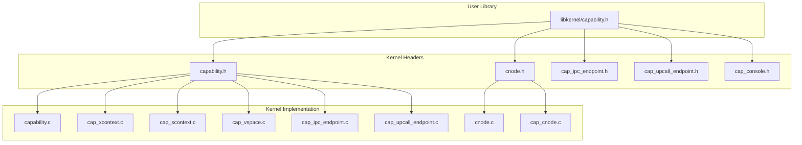
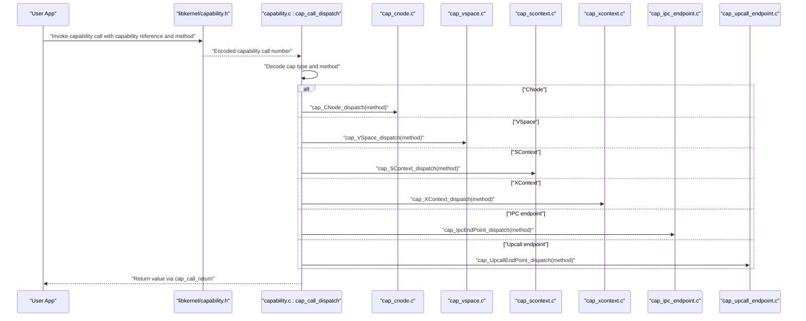
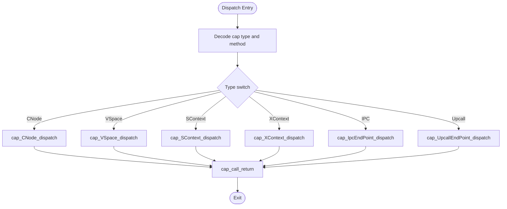
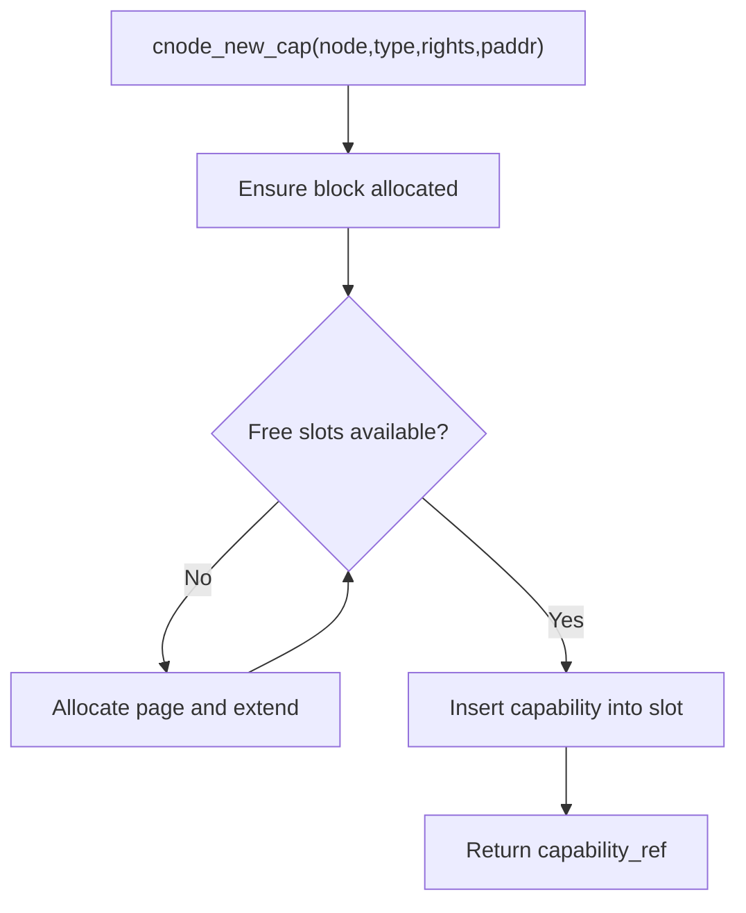
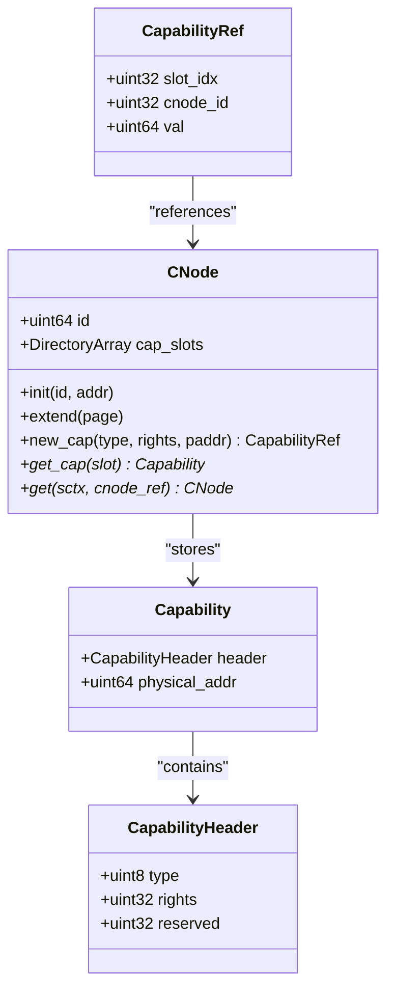
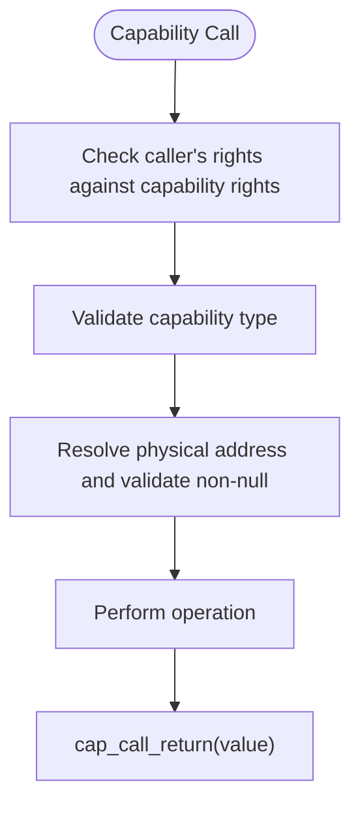
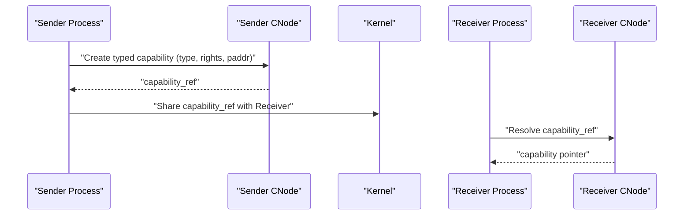
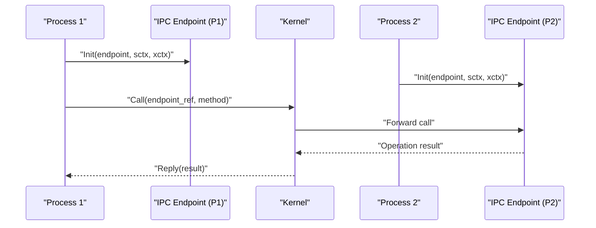
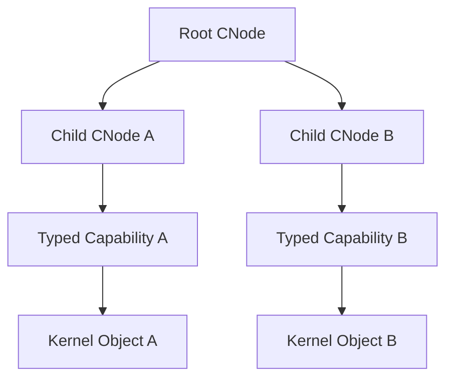
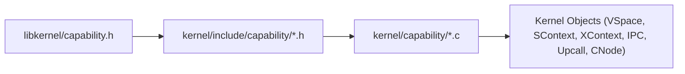

# Capability APIs

<cite>
**Referenced Files in This Document**
- [capability.h](file://kernel/include/capability/capability.h)
- [capability.c](file://kernel/capability/capability.c)
- [cnode.h](file://kernel/include/capability/cnode.h)
- [cnode.c](file://kernel/capability/cnode.c)
- [cap_cnode.c](file://kernel/capability/cap_cnode.c)
- [capability.h](file://ulibs/include/libkernel/capability.h)
- [cap_xcontext.c](file://kernel/capability/cap_xcontext.c)
- [cap_scontext.c](file://kernel/capability/cap_scontext.c)
- [cap_vspace.c](file://kernel/capability/cap_vspace.c)
- [cap_ipc_endpoint.c](file://kernel/capability/cap_ipc_endpoint.c)
- [cap_upcall_endpoint.c](file://kernel/capability/cap_upcall_endpoint.c)
- [cap_ipc_endpoint.h](file://kernel/include/capability/cap_ipc_endpoint.h)
- [cap_upcall_endpoint.h](file://kernel/include/capability/cap_upcall_endpoint.h)
- [cap_console.h](file://kernel/include/capability/cap_console.h)
</cite>

## Table of Contents
1. [Introduction](#introduction)
2. [Project Structure](#project-structure)
3. [Core Components](#core-components)
4. [Architecture Overview](#architecture-overview)
5. [Detailed Component Analysis](#detailed-component-analysis)
6. [Dependency Analysis](#dependency-analysis)
7. [Performance Considerations](#performance-considerations)
8. [Troubleshooting Guide](#troubleshooting-guide)
9. [Conclusion](#conclusion)

## Introduction
This document describes the capability-based security system of the TranquilOS kernel. It focuses on capability header structure, capability creation and destruction mechanisms, CNode management APIs, capability dispatch, rights management, permission checks, validation processes, and practical examples of capability-based IPC and capability passing between processes. It also covers capability object types, capability inheritance via capability references, and security boundary enforcement.

## Project Structure
The capability subsystem spans kernel headers, capability dispatchers, and capability-specific implementations. The userland library defines capability object types and method enumerations used by applications to invoke kernel capabilities.

**Diagram sources**
- [capability.h](file://kernel/include/capability/capability.h#L1-L26)
- [capability.c](file://kernel/capability/capability.c#L1-L58)
- [cnode.h](file://kernel/include/capability/cnode.h#L1-L29)
- [cnode.c](file://kernel/capability/cnode.c#L1-L95)
- [cap_cnode.c](file://kernel/capability/cap_cnode.c#L1-L184)
- [capability.h](file://ulibs/include/libkernel/capability.h#L1-L141)
- [cap_xcontext.c](file://kernel/capability/cap_xcontext.c#L1-L68)
- [cap_scontext.c](file://kernel/capability/cap_scontext.c#L1-L462)
- [cap_vspace.c](file://kernel/capability/cap_vspace.c#L1-L243)
- [cap_ipc_endpoint.c](file://kernel/capability/cap_ipc_endpoint.c#L1-L145)
- [cap_upcall_endpoint.c](file://kernel/capability/cap_upcall_endpoint.c#L1-L110)
- [cap_ipc_endpoint.h](file://kernel/include/capability/cap_ipc_endpoint.h#L1-L12)
- [cap_upcall_endpoint.h](file://kernel/include/capability/cap_upcall_endpoint.h#L1-L12)
- [cap_console.h](file://kernel/include/capability/cap_console.h#L1-L12)

**Section sources**
- [capability.h](file://kernel/include/capability/capability.h#L1-L26)
- [capability.c](file://kernel/capability/capability.c#L1-L58)
- [cnode.h](file://kernel/include/capability/cnode.h#L1-L29)
- [cnode.c](file://kernel/capability/cnode.c#L1-L95)
- [capability.h](file://ulibs/include/libkernel/capability.h#L1-L141)

## Core Components
- Capability header and structure
  - The capability header encodes object type, rights bitmap, and reserved bits. The capability object embeds the header plus a physical address pointing to the kernel object instance.
  - Rights constants are defined for convenience.

- Capability dispatch mechanism
  - The dispatcher decodes the capability call number to extract capability type and method, then routes to the appropriate capability’s dispatch routine. Permission checks are currently marked as TODO.

- CNode (capability node)
  - A capability container backed by a dynamic array of slots. It supports initialization, extension, creating typed capabilities, and retrieving capabilities by index.

- Capability object types and methods
  - The user library enumerates kernel object types and capability methods for each object type (e.g., CNode, XContext, SContext, VSpace, IPC endpoint, upcall endpoint, Console).

**Section sources**
- [capability.h](file://kernel/include/capability/capability.h#L9-L21)
- [capability.c](file://kernel/capability/capability.c#L14-L58)
- [cnode.h](file://kernel/include/capability/cnode.h#L11-L14)
- [cnode.c](file://kernel/capability/cnode.c#L9-L95)
- [capability.h](file://ulibs/include/libkernel/capability.h#L6-L18)
- [capability.h](file://ulibs/include/libkernel/capability.h#L52-L139)

## Architecture Overview
The capability system organizes kernel resources into typed capabilities stored in CNodes. Processes own a root CNode and can create child CNodes and typed capabilities. Capabilities carry rights and point to kernel objects. Dispatch routes capability calls to specialized handlers.

**Diagram sources**
- [capability.c](file://kernel/capability/capability.c#L14-L58)
- [cap_cnode.c](file://kernel/capability/cap_cnode.c#L163-L184)
- [cap_vspace.c](file://kernel/capability/cap_vspace.c#L213-L243)
- [cap_scontext.c](file://kernel/capability/cap_scontext.c#L420-L462)
- [cap_xcontext.c](file://kernel/capability/cap_xcontext.c#L53-L68)
- [cap_ipc_endpoint.c](file://kernel/capability/cap_ipc_endpoint.c#L124-L145)
- [cap_upcall_endpoint.c](file://kernel/capability/cap_upcall_endpoint.c#L92-L110)

## Detailed Component Analysis

### Capability Header and Dispatch
- Capability header layout
  - Fields: type (8 bits), rights (32 bits), reserved (24 bits). Packed to minimize footprint.
- Dispatch logic
  - Extracts capability type and method from the capability call number.
  - Routes to the corresponding capability handler.
  - Returns values via a dedicated return helper.

**Diagram sources**
- [capability.c](file://kernel/capability/capability.c#L14-L58)

**Section sources**
- [capability.h](file://kernel/include/capability/capability.h#L9-L21)
- [capability.c](file://kernel/capability/capability.c#L14-L58)

### CNode Management APIs
- Initialization and extension
  - Initialize a CNode with an ID and backing storage.
  - Extend capacity by allocating and attaching pages.
- Creating typed capabilities
  - Allocate a capability slot, fill header (type, rights, physical address), and return a capability reference.
- Retrieving capabilities
  - Resolve a capability reference to a capability pointer within a CNode.
- Resolving target CNodes
  - Given a CNode reference, locate the target CNode capability and dereference its physical address.

**Diagram sources**
- [cnode.c](file://kernel/capability/cnode.c#L23-L59)

**Section sources**
- [cnode.h](file://kernel/include/capability/cnode.h#L11-L26)
- [cnode.c](file://kernel/capability/cnode.c#L9-L95)

### Capability Creation and Destruction Functions
- CNode
  - Create: allocate and initialize a new CNode.
  - NewCapability: create a typed capability in a target CNode with given rights and physical address.
  - Prepare: initialize a target CNode with a provided page.
  - Extend: attach additional pages to a target CNode.
  - Destroy: placeholder for cleanup.
- XContext
  - Create: allocate and initialize an executable context.
  - Init: bind entry, stack pointer, and capability references to initialize the context.
  - Destroy: placeholder for cleanup.
- SContext
  - Create: allocate and initialize a scheduling context.
  - SetCNode/SetCNodeCurrent: bind a CNode to the scheduling context.
  - SetXContext/SetVSpace/SetVSpaceCurrent: bind executable and virtual address space contexts.
  - SetUpcall: bind an upcall endpoint.
  - Schedule/ScheduleOn: add to scheduler with optional affinity.
  - SetName/SetPid: configure metadata.
  - Destroy: placeholder for cleanup.
- VSpace
  - Create: allocate and initialize a virtual address space.
  - Prepare: prepare a page table for the address space.
  - TryMapPage/TryMapRange: map physical pages into the address space.
  - UnMapPage/UnMapRange: unmap pages from the address space.
  - Extend: extend the address space with a new page table page.
  - Destroy: placeholder for cleanup.
- IPC Endpoint
  - Create: allocate and initialize an IPC endpoint.
  - Init: bind an SContext and XContext to the endpoint.
  - Call: forward a capability call to the endpoint.
  - Reply: return a result to the caller.
  - Destroy: placeholder for cleanup.
- Upcall Endpoint
  - Create: allocate and initialize an upcall endpoint.
  - Init: bind an SContext and XContext to the endpoint.
  - Reply: return a result to the upcaller.
  - Destroy: placeholder for cleanup.

**Diagram sources**
- [capability.h](file://kernel/include/capability/capability.h#L11-L21)
- [cnode.h](file://kernel/include/capability/cnode.h#L11-L14)
- [cnode.c](file://kernel/capability/cnode.c#L23-L64)

**Section sources**
- [cap_cnode.c](file://kernel/capability/cap_cnode.c#L13-L184)
- [cap_xcontext.c](file://kernel/capability/cap_xcontext.c#L9-L68)
- [cap_scontext.c](file://kernel/capability/cap_scontext.c#L12-L462)
- [cap_vspace.c](file://kernel/capability/cap_vspace.c#L8-L243)
- [cap_ipc_endpoint.c](file://kernel/capability/cap_ipc_endpoint.c#L9-L145)
- [cap_upcall_endpoint.c](file://kernel/capability/cap_upcall_endpoint.c#L12-L110)

### Capability Rights Management and Validation
- Rights model
  - Each capability carries a rights bitmap. Rights constants are defined per capability type in kernel headers.
- Validation and permission checks
  - Capability dispatch currently contains a TODO for permission checks. Handlers validate capability types and dereference physical addresses before operating on kernel objects.

**Diagram sources**
- [capability.c](file://kernel/capability/capability.c#L20-L21)
- [cap_ipc_endpoint.h](file://kernel/include/capability/cap_ipc_endpoint.h#L7-L8)
- [cap_upcall_endpoint.h](file://kernel/include/capability/cap_upcall_endpoint.h#L7-L8)
- [cap_console.h](file://kernel/include/capability/cap_console.h#L7-L8)

**Section sources**
- [capability.c](file://kernel/capability/capability.c#L20-L21)
- [cap_ipc_endpoint.h](file://kernel/include/capability/cap_ipc_endpoint.h#L7-L8)
- [cap_upcall_endpoint.h](file://kernel/include/capability/cap_upcall_endpoint.h#L7-L8)
- [cap_console.h](file://kernel/include/capability/cap_console.h#L7-L8)

### Capability Passing Between Processes
- Capability references
  - A capability reference encodes the target CNode ID and slot index. The special constant indicates the current CNode.
- Passing semantics
  - To pass a capability to another process, create a typed capability in the sender’s CNode and share the capability reference. The receiver resolves the reference to access the capability.

**Diagram sources**
- [capability.h](file://ulibs/include/libkernel/capability.h#L4-L50)
- [cnode.c](file://kernel/capability/cnode.c#L66-L90)

**Section sources**
- [capability.h](file://ulibs/include/libkernel/capability.h#L4-L50)
- [cnode.c](file://kernel/capability/cnode.c#L66-L90)

### Capability-Based IPC Examples
- Endpoint setup
  - Create an IPC endpoint capability and initialize it with an SContext and XContext.
- Invocation
  - Call the endpoint with a capability reference and method; the kernel forwards the call to the endpoint handler.
- Reply
  - Return a result via the endpoint’s reply mechanism.

**Diagram sources**
- [cap_ipc_endpoint.c](file://kernel/capability/cap_ipc_endpoint.c#L16-L104)

**Section sources**
- [cap_ipc_endpoint.c](file://kernel/capability/cap_ipc_endpoint.c#L16-L104)

### Capability Inheritance and Security Boundaries
- Inheritance via CNodes
  - Child CNodes inherit capabilities from parent CNodes. Capability references encode the originating CNode ID, enabling secure delegation.
- Security boundaries
  - Handlers validate capability types and dereference physical addresses. Permission checks are TODO and should enforce rights before operations.

**Diagram sources**
- [cnode.c](file://kernel/capability/cnode.c#L66-L90)
- [capability.c](file://kernel/capability/capability.c#L20-L21)

**Section sources**
- [cnode.c](file://kernel/capability/cnode.c#L66-L90)
- [capability.c](file://kernel/capability/capability.c#L20-L21)

## Dependency Analysis
The capability subsystem exhibits clear layering:
- User library defines object types and method enums.
- Kernel headers define capability structures and rights.
- Kernel implementations implement dispatch and capability-specific logic.
- Capability references bridge userland and kernel.

**Diagram sources**
- [capability.h](file://ulibs/include/libkernel/capability.h#L1-L141)
- [capability.h](file://kernel/include/capability/capability.h#L1-L26)
- [capability.c](file://kernel/capability/capability.c#L1-L58)
- [cnode.c](file://kernel/capability/cnode.c#L1-L95)

**Section sources**
- [capability.h](file://ulibs/include/libkernel/capability.h#L1-L141)
- [capability.h](file://kernel/include/capability/capability.h#L1-L26)
- [capability.c](file://kernel/capability/capability.c#L1-L58)
- [cnode.c](file://kernel/capability/cnode.c#L1-L95)

## Performance Considerations
- Slot allocation and extension
  - Extending CNodes allocates pages; batching allocations and reusing pages can reduce overhead.
- Capability lookup
  - Capability references are compact; resolving references is O(1) per slot.
- Dispatch overhead
  - Dispatch is a simple switch; keep method counts minimal to maintain branch predictability.

## Troubleshooting Guide
- Unknown capability type
  - The dispatcher logs an error when encountering an unsupported capability type.
- Null capability or CNode
  - Handlers panic when capabilities or CNodes are null; ensure proper initialization and capability creation before use.
- Free slots exhausted
  - Creating capabilities fails if no free slots; extend the CNode before retrying.
- Permission checks TODO
  - Right now, permission checks are not enforced; implement rights verification in the dispatcher and handlers to prevent unauthorized operations.

**Section sources**
- [capability.c](file://kernel/capability/capability.c#L50-L53)
- [cnode.c](file://kernel/capability/cnode.c#L16-L21)
- [cap_scontext.c](file://kernel/capability/cap_scontext.c#L31-L41)
- [cap_vspace.c](file://kernel/capability/cap_vspace.c#L33-L40)
- [cap_ipc_endpoint.c](file://kernel/capability/cap_ipc_endpoint.c#L36-L43)
- [cap_upcall_endpoint.c](file://kernel/capability/cap_upcall_endpoint.c#L40-L47)

## Conclusion
TranquilOS implements a capability-based security model centered on typed capabilities stored in CNodes. The kernel provides robust dispatching, CNode management, and capability-specific operations for virtual memory, scheduling, execution contexts, IPC, and upcalls. Rights management and permission checks are under development and should be integrated to enforce fine-grained access control. Capability references enable secure inter-process capability passing, forming the basis for strong security boundaries.