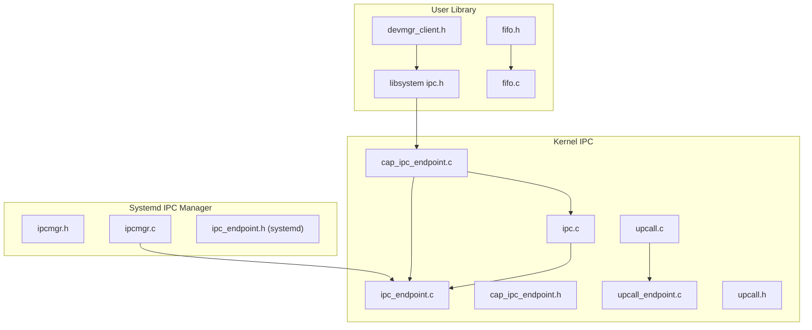
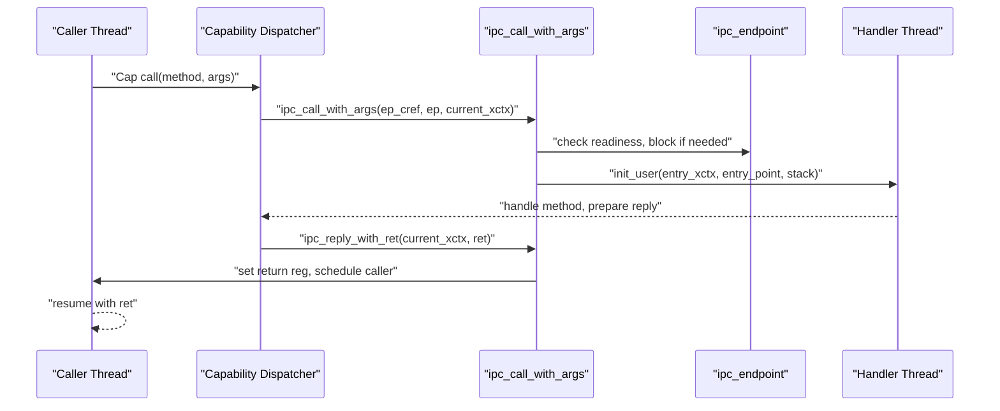
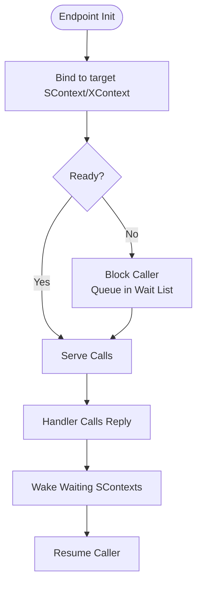
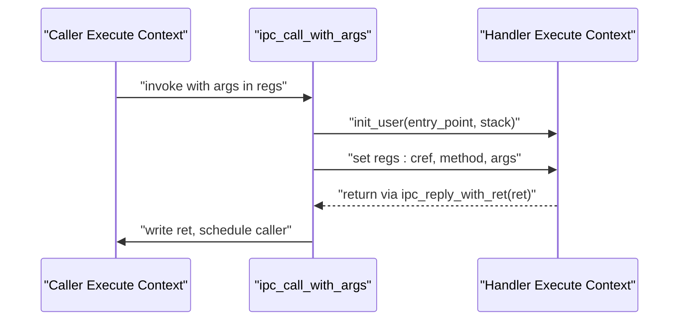
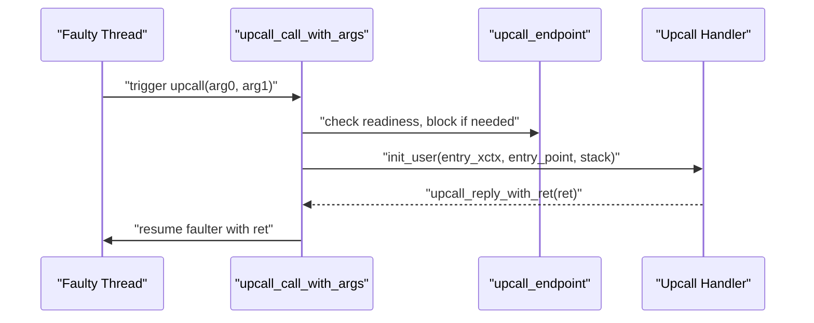
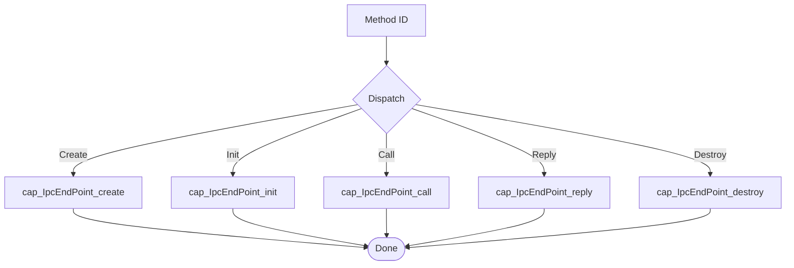
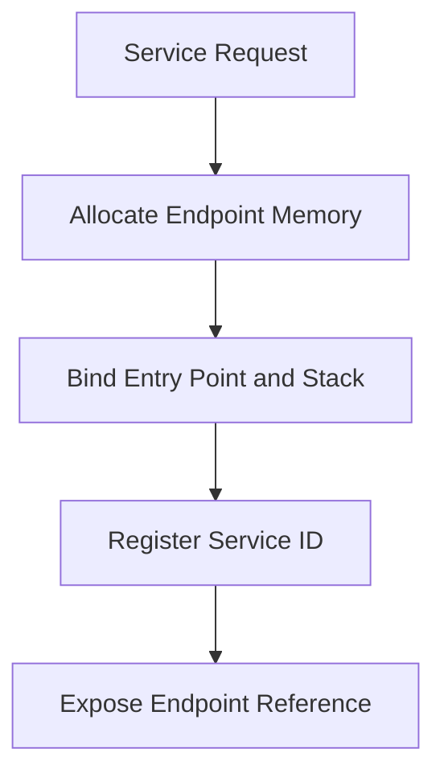
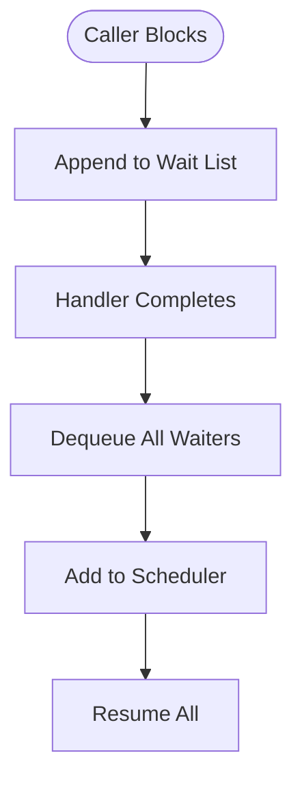
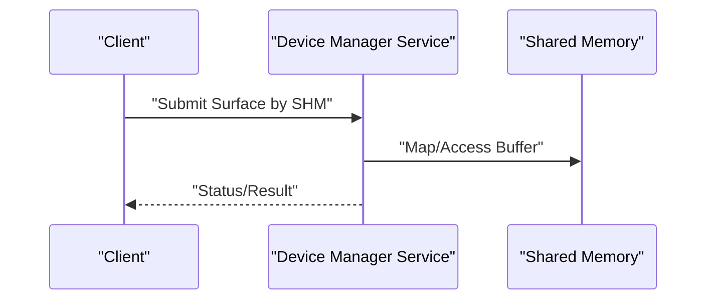
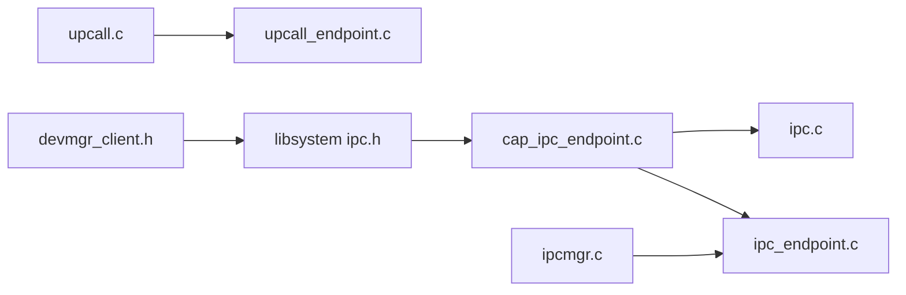

# Inter-Process Communication APIs

<cite>
**Referenced Files in This Document**
- [ipc.h](file://kernel/include/ipc/ipc.h)
- [ipc_endpoint.h](file://kernel/include/ipc/ipc_endpoint.h)
- [ipc.c](file://kernel/ipc/ipc.c)
- [ipc_endpoint.c](file://kernel/ipc/ipc_endpoint.c)
- [cap_ipc_endpoint.h](file://kernel/include/capability/cap_ipc_endpoint.h)
- [capability.h](file://kernel/include/capability/capability.h)
- [cap_ipc_endpoint.c](file://kernel/capability/cap_ipc_endpoint.c)
- [upcall_endpoint.h](file://kernel/include/upcall/upcall_endpoint.h)
- [upcall.h](file://kernel/include/upcall/upcall.h)
- [upcall.c](file://kernel/upcall/upcall.c)
- [upcall_endpoint.c](file://kernel/upcall/upcall_endpoint.c)
- [syscall.h](file://kernel/include/syscall/syscall.h)
- [ipcmgr.h](file://kernel/systemd/include/ipcmgr/ipcmgr.h)
- [ipcmgr.c](file://kernel/systemd/ipcmgr/ipcmgr.c)
- [ipc_endpoint.h](file://kernel/systemd/include/ipcmgr/ipc_endpoint.h)
- [ipc.h](file://ulibs/include/libsystem/ipc.h)
- [devmgr_client.h](file://ulibs/include/libsystem/devmgr_client.h)
- [fifo.h](file://ulibs/include/libalgorithm/fifo.h)
- [fifo.c](file://ulibs/libalgorithm/fifo.c)
</cite>

## Table of Contents
1. [Introduction](#introduction)
2. [Project Structure](#project-structure)
3. [Core Components](#core-components)
4. [Architecture Overview](#architecture-overview)
5. [Detailed Component Analysis](#detailed-component-analysis)
6. [Dependency Analysis](#dependency-analysis)
7. [Performance Considerations](#performance-considerations)
8. [Troubleshooting Guide](#troubleshooting-guide)
9. [Conclusion](#conclusion)
10. [Appendices](#appendices)

## Introduction
This document describes the Inter-Process Communication (IPC) subsystem of the TranquilOS kernel with a focus on capability-based messaging. It covers endpoint creation and lifecycle management, message passing interfaces, upcall mechanisms for event-driven communication, and capability-based operations. It also documents endpoint binding, message queuing, asynchronous communication patterns, and IPC performance optimization. Security aspects, message validation, and channel management are addressed alongside practical examples for process-to-process communication, shared memory IPC, and event-driven messaging.

## Project Structure
The IPC system spans kernel headers and implementations, capability dispatchers, upcall facilities, and user-space client libraries:
- Kernel IPC primitives and scheduling: ipc.h, ipc.c, ipc_endpoint.h, ipc_endpoint.c
- Capability-based endpoint operations: capability.h, cap_ipc_endpoint.h, cap_ipc_endpoint.c
- Upcall endpoints for event delivery: upcall_endpoint.h, upcall.h, upcall.c, upcall_endpoint.c
- System-level endpoint management: ipcmgr.h, ipcmgr.c, systemd include for IPC endpoints
- User-space IPC client APIs: ipc.h (libsystem), devmgr_client.h
- Utility queueing: fifo.h, fifo.c

**Diagram sources**
- [ipc.c](file://kernel/ipc/ipc.c#L1-L114)
- [ipc_endpoint.c](file://kernel/ipc/ipc_endpoint.c#L1-L82)
- [cap_ipc_endpoint.c](file://kernel/capability/cap_ipc_endpoint.c#L1-L145)
- [upcall_endpoint.c](file://kernel/upcall/upcall_endpoint.c#L1-L83)
- [upcall.c](file://kernel/upcall/upcall.c#L1-L95)
- [ipcmgr.h](file://kernel/systemd/include/ipcmgr/ipcmgr.h#L1-L15)
- [ipcmgr.c](file://kernel/systemd/ipcmgr/ipcmgr.c#L144-L182)
- [ipc_endpoint.h](file://kernel/systemd/include/ipcmgr/ipc_endpoint.h#L1-L20)
- [ipc.h](file://ulibs/include/libsystem/ipc.h#L1-L73)
- [devmgr_client.h](file://ulibs/include/libsystem/devmgr_client.h#L1-L43)
- [fifo.h](file://ulibs/include/libalgorithm/fifo.h#L1-L27)
- [fifo.c](file://ulibs/libalgorithm/fifo.c#L55-L98)

**Section sources**
- [ipc.h](file://kernel/include/ipc/ipc.h#L1-L13)
- [ipc_endpoint.h](file://kernel/include/ipc/ipc_endpoint.h#L1-L25)
- [cap_ipc_endpoint.h](file://kernel/include/capability/cap_ipc_endpoint.h#L1-L12)
- [capability.h](file://kernel/include/capability/capability.h#L1-L26)
- [upcall_endpoint.h](file://kernel/include/upcall/upcall_endpoint.h#L1-L25)
- [upcall.h](file://kernel/include/upcall/upcall.h#L1-L21)
- [ipcmgr.h](file://kernel/systemd/include/ipcmgr/ipcmgr.h#L1-L15)
- [ipc.h](file://ulibs/include/libsystem/ipc.h#L1-L73)
- [devmgr_client.h](file://ulibs/include/libsystem/devmgr_client.h#L1-L43)
- [fifo.h](file://ulibs/include/libalgorithm/fifo.h#L1-L27)

## Core Components
- IPC Endpoint: A kernel object linking a target execution context and schedule context, with entry point and stack pointer, and queues waiting contexts.
- IPC Call/Reply: Transitions between caller and handler via execute contexts, with blocking and wakeup semantics.
- Capability-based Endpoint Operations: Methods to create, initialize, call, reply, and destroy IPC endpoints via capability dispatch.
- Upcall Endpoint: Event-driven mechanism to deliver faults or notifications to a handler context, with blocking and wake semantics.
- Systemd IPC Manager: Allocates and binds endpoints for services, tracks endpoint memory, and exposes system-wide endpoints.
- User-space IPC Client: Provides helpers to register/get services and call endpoint methods.

Key responsibilities:
- Endpoint lifecycle: creation, initialization, binding to contexts, and destruction.
- Message passing: argument passing, return value propagation, and state transitions.
- Asynchronous patterns: blocking callers, queued waiters, and wakeups.
- Event-driven messaging: upcall endpoints for fault/notification delivery.
- Shared memory IPC: client APIs expose SHM-based surface submission.

**Section sources**
- [ipc_endpoint.h](file://kernel/include/ipc/ipc_endpoint.h#L8-L17)
- [ipc.c](file://kernel/ipc/ipc.c#L9-L76)
- [ipc_endpoint.c](file://kernel/ipc/ipc_endpoint.c#L7-L25)
- [cap_ipc_endpoint.h](file://kernel/include/capability/cap_ipc_endpoint.h#L7-L11)
- [capability.h](file://kernel/include/capability/capability.h#L11-L25)
- [cap_ipc_endpoint.c](file://kernel/capability/cap_ipc_endpoint.c#L9-L119)
- [upcall_endpoint.h](file://kernel/include/upcall/upcall_endpoint.h#L8-L17)
- [upcall.c](file://kernel/upcall/upcall.c#L8-L52)
- [upcall_endpoint.c](file://kernel/upcall/upcall_endpoint.c#L8-L26)
- [ipcmgr.c](file://kernel/systemd/ipcmgr/ipcmgr.c#L144-L182)
- [ipc.h](file://ulibs/include/libsystem/ipc.h#L52-L70)
- [devmgr_client.h](file://ulibs/include/libsystem/devmgr_client.h#L29-L39)

## Architecture Overview
The IPC architecture centers on capability-dispatched endpoint operations and context switching. A caller invokes an endpoint method via a capability, which routes to the kernel’s IPC dispatcher. The dispatcher switches to the handler’s execute context, sets arguments, and manages state transitions. Reply returns control to the caller with a return value.

**Diagram sources**
- [cap_ipc_endpoint.c](file://kernel/capability/cap_ipc_endpoint.c#L70-L104)
- [ipc.c](file://kernel/ipc/ipc.c#L9-L76)
- [ipc_endpoint.c](file://kernel/ipc/ipc_endpoint.c#L27-L49)
- [upcall.c](file://kernel/upcall/upcall.c#L54-L95)

**Section sources**
- [cap_ipc_endpoint.c](file://kernel/capability/cap_ipc_endpoint.c#L124-L145)
- [ipc.c](file://kernel/ipc/ipc.c#L9-L114)
- [ipc_endpoint.c](file://kernel/ipc/ipc_endpoint.c#L51-L82)

## Detailed Component Analysis

### IPC Endpoint Lifecycle and Management
- Creation and Initialization: The capability dispatcher supports creating and initializing endpoints, binding them to execute and schedule contexts, and capturing entry point and stack pointer.
- Binding: An endpoint is bound to a target schedule context and execute context so that incoming calls switch to the handler’s context.
- Blocking and Wakeup: When an endpoint is busy, callers are blocked and queued; handlers can wake waiting contexts upon completion.

**Diagram sources**
- [cap_ipc_endpoint.c](file://kernel/capability/cap_ipc_endpoint.c#L16-L68)
- [ipc_endpoint.c](file://kernel/ipc/ipc_endpoint.c#L7-L25)
- [ipc_endpoint.c](file://kernel/ipc/ipc_endpoint.c#L27-L49)
- [ipc_endpoint.c](file://kernel/ipc/ipc_endpoint.c#L51-L82)

**Section sources**
- [cap_ipc_endpoint.c](file://kernel/capability/cap_ipc_endpoint.c#L9-L68)
- [ipc_endpoint.c](file://kernel/ipc/ipc_endpoint.c#L7-L82)

### Message Passing Interfaces
- Argument Passing: Arguments are extracted from the caller’s execute context registers and passed to the handler’s execute context.
- Return Values: Handlers return values via a dedicated reply routine that resumes the caller and writes the return value into the caller’s context.
- Validation: Null checks guard against invalid endpoints, contexts, and scheduler state.

**Diagram sources**
- [ipc.c](file://kernel/ipc/ipc.c#L37-L53)
- [ipc.c](file://kernel/ipc/ipc.c#L78-L114)

**Section sources**
- [ipc.c](file://kernel/ipc/ipc.c#L9-L114)

### Upcall Mechanisms
Upcalls provide event-driven messaging to deliver faults or notifications:
- Invocation: The upcall routine initializes the handler context with arguments and blocks the current context.
- Fault Delivery: The handler context is recorded as the “faulter,” and the upcall endpoint maintains a wait list.
- Reply: On reply, the faulter is resumed with the return value.

**Diagram sources**
- [upcall.c](file://kernel/upcall/upcall.c#L8-L52)
- [upcall_endpoint.c](file://kernel/upcall/upcall_endpoint.c#L8-L26)
- [upcall.c](file://kernel/upcall/upcall.c#L54-L95)

**Section sources**
- [upcall_endpoint.h](file://kernel/include/upcall/upcall_endpoint.h#L8-L17)
- [upcall.c](file://kernel/upcall/upcall.c#L8-L95)
- [upcall_endpoint.c](file://kernel/upcall/upcall_endpoint.c#L8-L83)

### Capability-Based IPC Operations
Capability dispatch routes method calls to specific endpoint operations:
- Methods: Create, Init, Call, Reply, Destroy.
- Rights: Endpoint capabilities carry rights controlling creation and destruction.
- Dispatch: The capability dispatcher validates capability types and delegates to the appropriate handler.

**Diagram sources**
- [cap_ipc_endpoint.h](file://kernel/include/capability/cap_ipc_endpoint.h#L7-L11)
- [capability.h](file://kernel/include/capability/capability.h#L11-L25)
- [cap_ipc_endpoint.c](file://kernel/capability/cap_ipc_endpoint.c#L124-L145)

**Section sources**
- [cap_ipc_endpoint.h](file://kernel/include/capability/cap_ipc_endpoint.h#L7-L11)
- [capability.h](file://kernel/include/capability/capability.h#L11-L25)
- [cap_ipc_endpoint.c](file://kernel/capability/cap_ipc_endpoint.c#L124-L145)

### Endpoint Binding and Service Registration
Systemd manages service endpoints:
- Endpoint allocation and memory tracking
- Binding service IDs to entry points
- Exposing system-wide endpoints for clients

**Diagram sources**
- [ipcmgr.c](file://kernel/systemd/ipcmgr/ipcmgr.c#L156-L182)
- [ipcmgr.h](file://kernel/systemd/include/ipcmgr/ipcmgr.h#L6-L9)
- [ipc_endpoint.h](file://kernel/systemd/include/ipcmgr/ipc_endpoint.h#L8-L15)

**Section sources**
- [ipcmgr.c](file://kernel/systemd/ipcmgr/ipcmgr.c#L144-L182)
- [ipcmgr.h](file://kernel/systemd/include/ipcmgr/ipcmgr.h#L1-L15)
- [ipc_endpoint.h](file://kernel/systemd/include/ipcmgr/ipc_endpoint.h#L1-L20)

### Asynchronous Communication Patterns
- Queued Waiters: Endpoints maintain a list of waiting schedule contexts; wakeups resume all queued contexts.
- Scheduler Integration: Blocking and waking integrate with the scheduler manager and local scheduler.
- FIFO Queueing: Utility FIFO structures support queue operations for wait lists.

**Diagram sources**
- [ipc_endpoint.c](file://kernel/ipc/ipc_endpoint.c#L42-L49)
- [ipc_endpoint.c](file://kernel/ipc/ipc_endpoint.c#L67-L81)
- [upcall_endpoint.c](file://kernel/upcall/upcall_endpoint.c#L43-L49)
- [upcall_endpoint.c](file://kernel/upcall/upcall_endpoint.c#L68-L82)
- [fifo.h](file://ulibs/include/libalgorithm/fifo.h#L18-L27)
- [fifo.c](file://ulibs/libalgorithm/fifo.c#L55-L98)

**Section sources**
- [ipc_endpoint.c](file://kernel/ipc/ipc_endpoint.c#L27-L82)
- [upcall_endpoint.c](file://kernel/upcall/upcall_endpoint.c#L28-L83)
- [fifo.h](file://ulibs/include/libalgorithm/fifo.h#L1-L27)
- [fifo.c](file://ulibs/libalgorithm/fifo.c#L55-L98)

### Shared Memory IPC and Event-Driven Messaging
- Shared Memory Surface Submission: Device manager client exposes SHM-based surface submission for display.
- Event-Driven Messaging: Upcall endpoints deliver faults or notifications to handlers.

**Diagram sources**
- [devmgr_client.h](file://ulibs/include/libsystem/devmgr_client.h#L29-L39)

**Section sources**
- [devmgr_client.h](file://ulibs/include/libsystem/devmgr_client.h#L1-L43)
- [upcall.c](file://kernel/upcall/upcall.c#L54-L95)

## Dependency Analysis
The IPC subsystem exhibits clear layering:
- Capability layer depends on capability headers and cnode resolution.
- IPC layer depends on execute and schedule contexts and scheduler manager.
- Upcall layer mirrors IPC semantics for event delivery.
- Systemd IPC manager depends on memory manager and process manager to allocate and bind endpoints.
- User-space library depends on capability calls and service registry.

**Diagram sources**
- [cap_ipc_endpoint.c](file://kernel/capability/cap_ipc_endpoint.c#L1-L145)
- [ipc.c](file://kernel/ipc/ipc.c#L1-L114)
- [ipc_endpoint.c](file://kernel/ipc/ipc_endpoint.c#L1-L82)
- [upcall.c](file://kernel/upcall/upcall.c#L1-L95)
- [upcall_endpoint.c](file://kernel/upcall/upcall_endpoint.c#L1-L83)
- [ipcmgr.c](file://kernel/systemd/ipcmgr/ipcmgr.c#L144-L182)
- [ipc.h](file://ulibs/include/libsystem/ipc.h#L1-L73)
- [devmgr_client.h](file://ulibs/include/libsystem/devmgr_client.h#L1-L43)

**Section sources**
- [cap_ipc_endpoint.c](file://kernel/capability/cap_ipc_endpoint.c#L1-L145)
- [ipc.c](file://kernel/ipc/ipc.c#L1-L114)
- [upcall.c](file://kernel/upcall/upcall.c#L1-L95)
- [ipcmgr.c](file://kernel/systemd/ipcmgr/ipcmgr.c#L144-L182)
- [ipc.h](file://ulibs/include/libsystem/ipc.h#L1-L73)
- [devmgr_client.h](file://ulibs/include/libsystem/devmgr_client.h#L1-L43)

## Performance Considerations
- Minimize context switches: Batch wakeups by resuming all waiting contexts at once.
- Efficient queueing: Use linked-list append/remove operations for wait queues to avoid scanning overhead.
- Avoid redundant scheduler lookups: Cache scheduler manager and local scheduler pointers during a single operation.
- Reduce contention: Keep endpoint initialization and binding minimal to reduce lock-free critical sections.
- Upcall fast-path: Ensure upcall readiness check short-circuits quickly when the handler is ready.

[No sources needed since this section provides general guidance]

## Troubleshooting Guide
Common issues and diagnostics:
- Endpoint or context null: Panic paths indicate missing endpoint, schedule context, or execute context.
- Scheduler not initialized: Failures when retrieving scheduler manager or local scheduler cause panics.
- Endpoint not ready: Blocking callers when endpoint is busy; verify handler scheduling and wakeups.
- Upcall reply validation: Non-zero return values expected; zero indicates unexpected state.
- Capability type mismatch: Ensure endpoint and context capabilities match expected object types.

Remediation steps:
- Verify endpoint initialization and binding before invoking calls.
- Confirm handler execute context entry point and stack pointer are valid.
- Ensure scheduler is active and properly integrated.
- Check capability rights and cnode indexing for endpoint and context references.

**Section sources**
- [ipc.c](file://kernel/ipc/ipc.c#L10-L18)
- [ipc.c](file://kernel/ipc/ipc.c#L22-L34)
- [ipc_endpoint.c](file://kernel/ipc/ipc_endpoint.c#L8-L16)
- [upcall.c](file://kernel/upcall/upcall.c#L12-L25)
- [upcall.c](file://kernel/upcall/upcall.c#L83-L85)

## Conclusion
TranquilOS implements a capability-based IPC system with robust endpoint lifecycle management, efficient context switching, and event-driven upcalls. The design emphasizes explicit rights, validated capability dispatch, and integrated scheduler operations. Systemd’s IPC manager extends the model to service registration and endpoint allocation. Users can leverage the provided client APIs for process-to-process communication, shared memory IPC, and event-driven messaging while maintaining strong security boundaries and predictable performance.

[No sources needed since this section summarizes without analyzing specific files]

## Appendices

### API Definitions and Examples

- Process-to-Process Communication
  - Register a service via the name service endpoint and obtain a capability reference for subsequent calls.
  - Example reference paths:
    - [Service registration](file://ulibs/include/libsystem/ipc.h#L53-L59)
    - [Service lookup with retry](file://ulibs/include/libsystem/ipc.h#L61-L70)

- Shared Memory IPC
  - Submit surfaces using shared memory buffers via the device manager client.
  - Example reference paths:
    - [SHM surface submission](file://ulibs/include/libsystem/devmgr_client.h#L29-L39)

- Event-Driven Messaging
  - Trigger upcalls to deliver faults or notifications to a handler context.
  - Example reference paths:
    - [Upcall invocation](file://kernel/upcall/upcall.c#L8-L52)
    - [Upcall reply](file://kernel/upcall/upcall.c#L54-L95)

- Capability-Based Operations
  - Create, initialize, call, reply, and destroy endpoints via capability dispatch.
  - Example reference paths:
    - [Capability dispatch](file://kernel/capability/cap_ipc_endpoint.c#L124-L145)
    - [Rights constants](file://kernel/include/capability/cap_ipc_endpoint.h#L7-L8)

- Endpoint Binding and Management
  - Systemd allocates and binds endpoints for services, tracking memory and entry points.
  - Example reference paths:
    - [Endpoint allocation and binding](file://kernel/systemd/ipcmgr/ipcmgr.c#L156-L182)
    - [Systemd endpoint structure](file://kernel/systemd/include/ipcmgr/ipc_endpoint.h#L8-L15)

**Section sources**
- [ipc.h](file://ulibs/include/libsystem/ipc.h#L52-L70)
- [devmgr_client.h](file://ulibs/include/libsystem/devmgr_client.h#L29-L39)
- [cap_ipc_endpoint.c](file://kernel/capability/cap_ipc_endpoint.c#L124-L145)
- [cap_ipc_endpoint.h](file://kernel/include/capability/cap_ipc_endpoint.h#L7-L8)
- [ipcmgr.c](file://kernel/systemd/ipcmgr/ipcmgr.c#L156-L182)
- [ipc_endpoint.h](file://kernel/systemd/include/ipcmgr/ipc_endpoint.h#L8-L15)