# Interrupt Handling APIs

<cite>
**Referenced Files in This Document**
- [irq.h](file://kernel/include/interrupt/irq.h)
- [irq_mgr.h](file://kernel/include/interrupt/irq_mgr.h)
- [irq_device.h](file://kernel/include/interrupt/device/irq_device.h)
- [hal_interrupt.h](file://kernel/include/arch/generic/hal_interrupt.h)
- [interrupt.c](file://kernel/arch/arm64/interrupt.c)
- [irq_mgr.c](file://kernel/interrupt/irq_mgr.c)
- [gicv2.h](file://kernel/drivers/arm-gic/gicv2.h)
- [gicv3.h](file://kernel/drivers/arm-gic/gicv3.h)
- [pl011.c](file://kernel/drivers/arm-uart/pl011.c)
- [generic_timer.c](file://kernel/drivers/arm-timer/generic_timer.c)
- [interrupt.h (boot)](file://boot/include/arch/arm64/interrupt.h)
- [xcontext.c](file://kernel/context/xcontext.c)
- [scontext.c](file://kernel/context/scontext.c)
</cite>

## Table of Contents
1. [Introduction](#introduction)
2. [Project Structure](#project-structure)
3. [Core Components](#core-components)
4. [Architecture Overview](#architecture-overview)
5. [Detailed Component Analysis](#detailed-component-analysis)
6. [Dependency Analysis](#dependency-analysis)
7. [Performance Considerations](#performance-considerations)
8. [Troubleshooting Guide](#troubleshooting-guide)
9. [Conclusion](#conclusion)

## Introduction
This document describes the interrupt handling APIs in the TranquilOS kernel for ARM64. It covers IRQ registration and deregistration, handler installation, interrupt masking/unmasking, priority management, device-specific handling, controller interfaces, and context switching during interrupts. It also provides examples of custom handlers, chaining, performance optimization, security considerations, and stability safeguards.

## Project Structure
The interrupt subsystem is organized around a small set of core headers and a runtime manager:
- Public API headers define the IRQ model, manager interfaces, and device controller interfaces.
- The ARM64 HAL exposes CPU-local interrupt enable/disable and state APIs.
- Device drivers register IRQ handlers and configure the interrupt controller via the manager and device ops.
- Context switching integrates with the scheduler after handling.

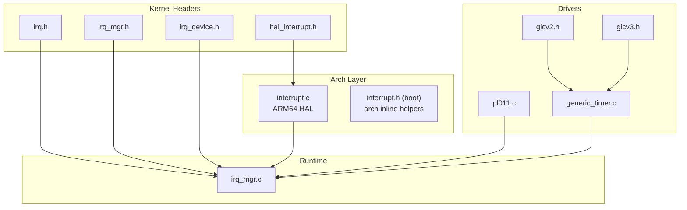

**Diagram sources**
- [irq.h](file://kernel/include/interrupt/irq.h#L1-L38)
- [irq_mgr.h](file://kernel/include/interrupt/irq_mgr.h#L1-L46)
- [irq_device.h](file://kernel/include/interrupt/device/irq_device.h#L1-L32)
- [hal_interrupt.h](file://kernel/include/arch/generic/hal_interrupt.h#L1-L30)
- [interrupt.c](file://kernel/arch/arm64/interrupt.c#L1-L66)
- [irq_mgr.c](file://kernel/interrupt/irq_mgr.c#L1-L142)
- [pl011.c](file://kernel/drivers/arm-uart/pl011.c#L1-L138)
- [generic_timer.c](file://kernel/drivers/arm-timer/generic_timer.c#L1-L284)
- [gicv2.h](file://kernel/drivers/arm-gic/gicv2.h#L1-L105)
- [gicv3.h](file://kernel/drivers/arm-gic/gicv3.h#L1-L147)
- [interrupt.h (boot)](file://boot/include/arch/arm64/interrupt.h#L1-L49)

**Section sources**
- [irq.h](file://kernel/include/interrupt/irq.h#L1-L38)
- [irq_mgr.h](file://kernel/include/interrupt/irq_mgr.h#L1-L46)
- [irq_device.h](file://kernel/include/interrupt/device/irq_device.h#L1-L32)
- [hal_interrupt.h](file://kernel/include/arch/generic/hal_interrupt.h#L1-L30)
- [interrupt.c](file://kernel/arch/arm64/interrupt.c#L1-L66)
- [irq_mgr.c](file://kernel/interrupt/irq_mgr.c#L1-L142)
- [pl011.c](file://kernel/drivers/arm-uart/pl011.c#L1-L138)
- [generic_timer.c](file://kernel/drivers/arm-timer/generic_timer.c#L1-L284)
- [gicv2.h](file://kernel/drivers/arm-gic/gicv2.h#L1-L105)
- [gicv3.h](file://kernel/drivers/arm-gic/gicv3.h#L1-L147)
- [interrupt.h (boot)](file://boot/include/arch/arm64/interrupt.h#L1-L49)

## Core Components
- IRQ descriptor: Holds interrupt number, name, linked-list node, handler function pointer, and handle mode.
- Local IRQ manager: Per-CPU registry of IRQ descriptors and device binding, plus operations to register/get IRQs, process IRQs, and bind devices.
- IRQ manager: Global manager exposing per-CPU local managers and initialization hooks.
- IRQ device: Abstraction for the interrupt controller with operations to enable/disable, set priority/target, ACK/EOI, and list register updates.
- HAL interrupt: CPU-local APIs to enable/disable specific interrupt classes and save/restore interrupt state.

Key types and enums:
- IRQ state enumeration for pending/active combinations.
- IRQ return type containing an end-of-interrupt flag.
- IRQ handle modes: synchronous or thread-based.
- HAL interrupt types: normal, fast, system error, debug.

**Section sources**
- [irq.h](file://kernel/include/interrupt/irq.h#L8-L36)
- [irq_mgr.h](file://kernel/include/interrupt/irq_mgr.h#L14-L41)
- [irq_device.h](file://kernel/include/interrupt/device/irq_device.h#L15-L31)
- [hal_interrupt.h](file://kernel/include/arch/generic/hal_interrupt.h#L7-L29)

## Architecture Overview
The interrupt pipeline:
1. Hardware raises an interrupt to the CPU.
2. The HAL saves/restores CPU interrupt state and enables/disables specific classes.
3. The local IRQ manager ACKs the interrupt via the device, locates the registered handler, invokes it, and issues EOI.
4. After handler completion, the scheduler selects the next context and switches execution.

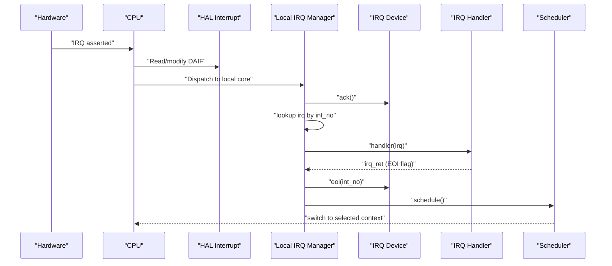

**Diagram sources**
- [irq_mgr.c](file://kernel/interrupt/irq_mgr.c#L49-L83)
- [irq_device.h](file://kernel/include/interrupt/device/irq_device.h#L15-L25)
- [hal_interrupt.h](file://kernel/include/arch/generic/hal_interrupt.h#L14-L29)

## Detailed Component Analysis

### IRQ Model and Handler Installation
- An IRQ descriptor encapsulates the interrupt number, human-readable name, linkage for a global list, a handler function pointer, and a handle mode.
- Handlers receive a pointer to the IRQ descriptor and return an IRQ return value with an end-of-interrupt bit.
- Registration appends the IRQ to a per-core list maintained by the local IRQ manager.

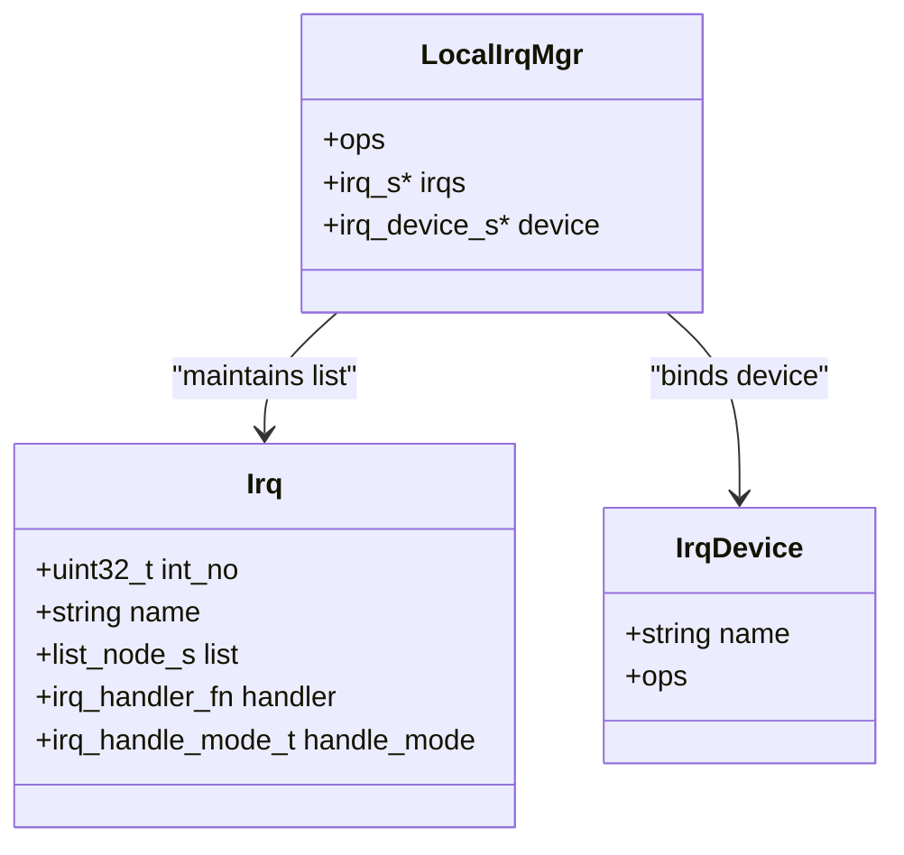

**Diagram sources**
- [irq.h](file://kernel/include/interrupt/irq.h#L28-L36)
- [irq_mgr.h](file://kernel/include/interrupt/irq_mgr.h#L23-L27)
- [irq_device.h](file://kernel/include/interrupt/device/irq_device.h#L27-L31)

**Section sources**
- [irq.h](file://kernel/include/interrupt/irq.h#L28-L36)
- [irq_mgr.c](file://kernel/interrupt/irq_mgr.c#L13-L28)

### Local IRQ Manager Operations
- Register IRQ: Validates inputs and appends to the per-core list.
- Get IRQ: Iterates the per-core list to find a matching interrupt number.
- Process IRQ: ACKs the interrupt via the device, looks up the handler, calls it, issues EOI, then schedules and switches contexts.
- Bind device: Stores a pointer to the IRQ device for ACK/EOI operations.

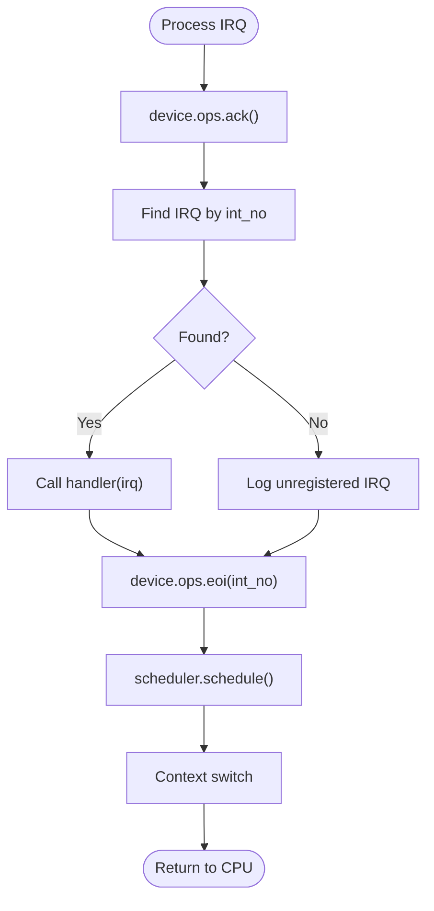

**Diagram sources**
- [irq_mgr.c](file://kernel/interrupt/irq_mgr.c#L49-L83)
- [irq_device.h](file://kernel/include/interrupt/device/irq_device.h#L22-L24)

**Section sources**
- [irq_mgr.c](file://kernel/interrupt/irq_mgr.c#L13-L28)
- [irq_mgr.c](file://kernel/interrupt/irq_mgr.c#L30-L47)
- [irq_mgr.c](file://kernel/interrupt/irq_mgr.c#L49-L83)
- [irq_mgr.c](file://kernel/interrupt/irq_mgr.c#L85-L103)

### IRQ Manager and Per-CPU Initialization
- The global IRQ manager initializes per-CPU local managers and exposes getters.
- Initialization binds operation pointers for register/get/process and device bind/get for the current CPU.

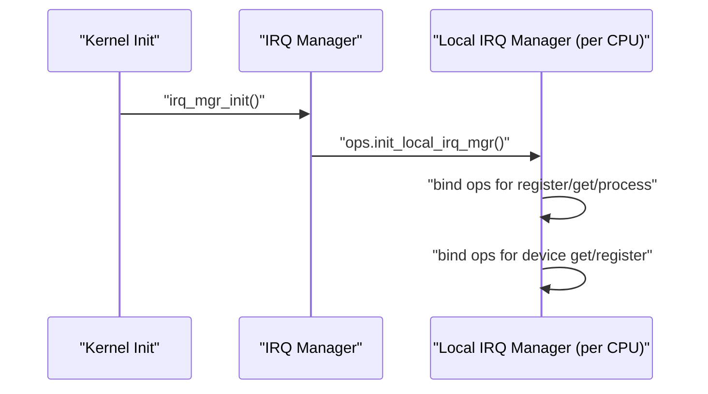

**Diagram sources**
- [irq_mgr.h](file://kernel/include/interrupt/irq_mgr.h#L30-L41)
- [irq_mgr.c](file://kernel/interrupt/irq_mgr.c#L105-L127)

**Section sources**
- [irq_mgr.h](file://kernel/include/interrupt/irq_mgr.h#L37-L41)
- [irq_mgr.c](file://kernel/interrupt/irq_mgr.c#L105-L127)

### Interrupt Controller Interfaces (GIC)
- The GICv2 and GICv3 headers define distributor, CPU interface, virtual interface, and register layouts.
- Drivers use the IRQ device operations to configure enable, priority, target, and list register updates.

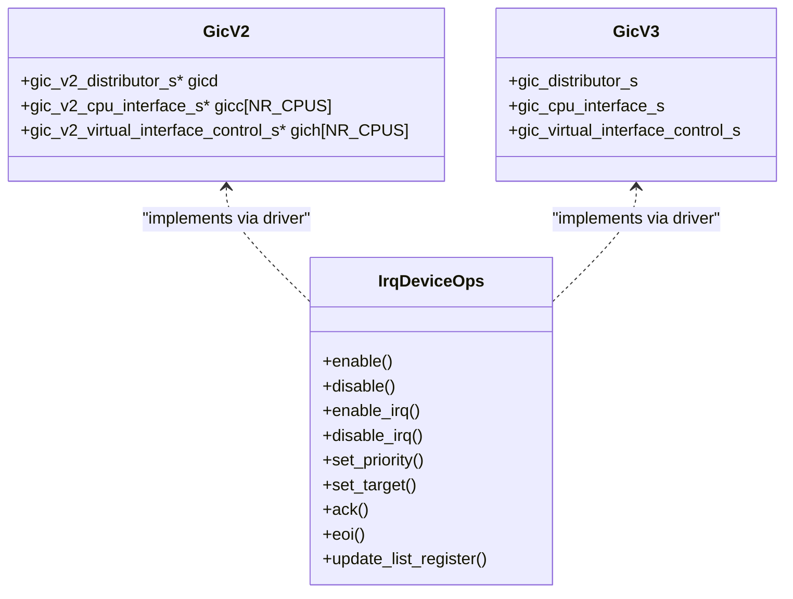

**Diagram sources**
- [gicv2.h](file://kernel/drivers/arm-gic/gicv2.h#L98-L105)
- [gicv3.h](file://kernel/drivers/arm-gic/gicv3.h#L65-L147)
- [irq_device.h](file://kernel/include/interrupt/device/irq_device.h#L15-L25)

**Section sources**
- [gicv2.h](file://kernel/drivers/arm-gic/gicv2.h#L15-L105)
- [gicv3.h](file://kernel/drivers/arm-gic/gicv3.h#L65-L147)
- [irq_device.h](file://kernel/include/interrupt/device/irq_device.h#L15-L25)

### CPU Interrupt Control (HAL)
- HAL provides enabling/disabling of normal, fast, system-error, and debug interrupt classes.
- It supports saving/restoring interrupt state and checking whether interrupts are enabled.

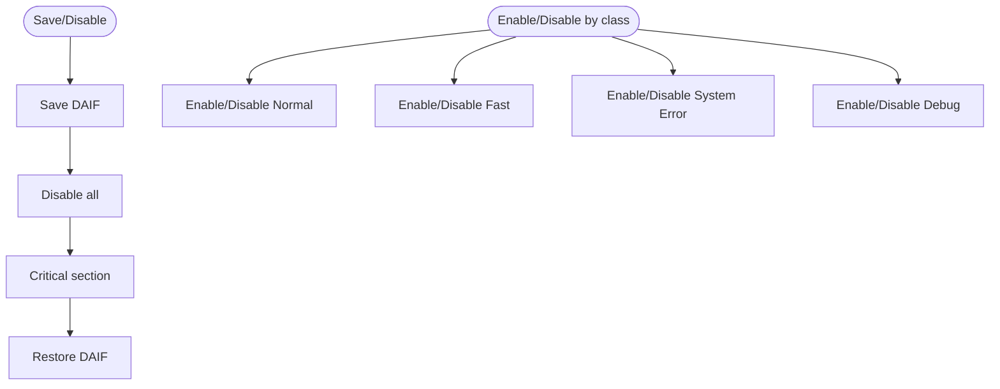

**Diagram sources**
- [hal_interrupt.h](file://kernel/include/arch/generic/hal_interrupt.h#L14-L29)
- [interrupt.c](file://kernel/arch/arm64/interrupt.c#L7-L66)

**Section sources**
- [hal_interrupt.h](file://kernel/include/arch/generic/hal_interrupt.h#L7-L29)
- [interrupt.c](file://kernel/arch/arm64/interrupt.c#L7-L66)
- [interrupt.h (boot)](file://boot/include/arch/arm64/interrupt.h#L16-L46)

### Device-Specific Interrupt Handling Examples

#### UART (PL011) Handler Registration
- A driver-provided handler logs the event and sets the end-of-interrupt flag.
- The driver registers the IRQ descriptor with the local IRQ manager during early initialization.

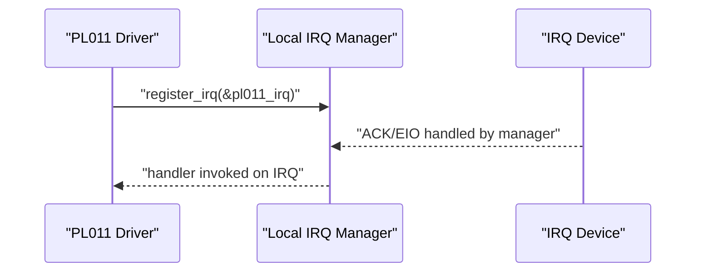

**Diagram sources**
- [pl011.c](file://kernel/drivers/arm-uart/pl011.c#L54-L71)
- [pl011.c](file://kernel/drivers/arm-uart/pl011.c#L73-L90)
- [irq_mgr.c](file://kernel/interrupt/irq_mgr.c#L49-L67)

**Section sources**
- [pl011.c](file://kernel/drivers/arm-uart/pl011.c#L54-L90)

#### Generic Timer Handler and Priority Management
- The timer driver configures the IRQ device to set priority and target, then enables the interrupt.
- The handler reads hardware time, converts to nanoseconds, and invokes the registered timer callback if present.

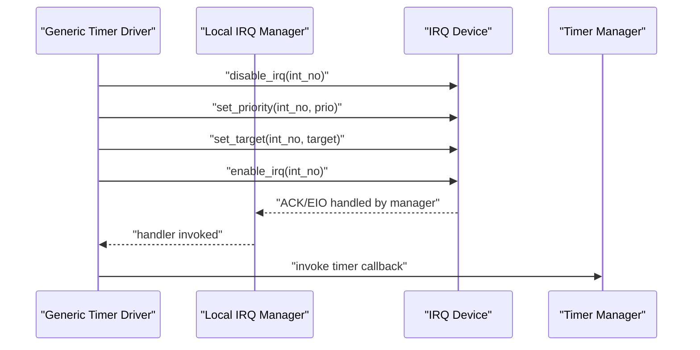

**Diagram sources**
- [generic_timer.c](file://kernel/drivers/arm-timer/generic_timer.c#L57-L97)
- [generic_timer.c](file://kernel/drivers/arm-timer/generic_timer.c#L198-L236)
- [irq_mgr.c](file://kernel/interrupt/irq_mgr.c#L49-L67)

**Section sources**
- [generic_timer.c](file://kernel/drivers/arm-timer/generic_timer.c#L57-L97)
- [generic_timer.c](file://kernel/drivers/arm-timer/generic_timer.c#L198-L236)

### Interrupt Context Switching
- After the handler returns and EOI is issued, the local scheduler is queried to select the next context.
- The system switches to either the selected schedule context or falls back to the saved user execute context.

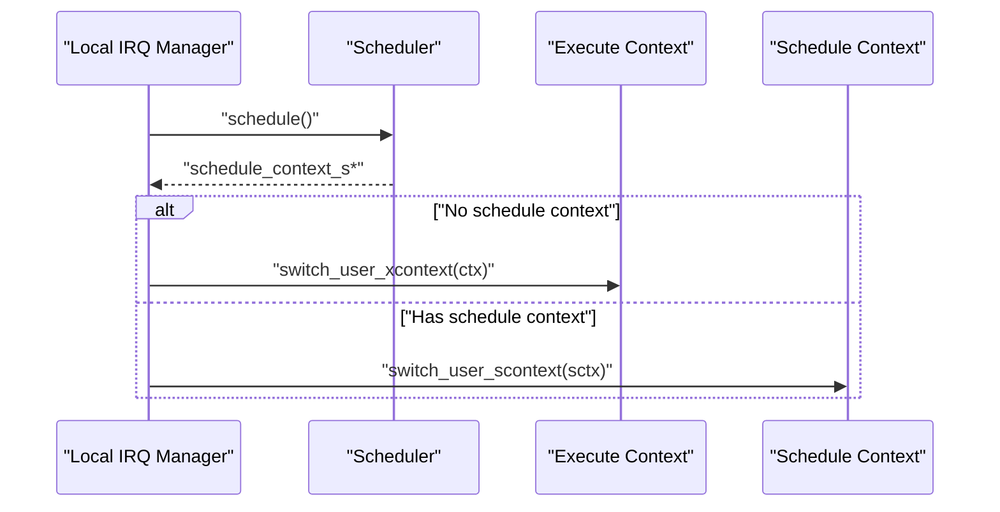

**Diagram sources**
- [irq_mgr.c](file://kernel/interrupt/irq_mgr.c#L69-L83)
- [xcontext.c](file://kernel/context/xcontext.c#L4-L7)
- [scontext.c](file://kernel/context/scontext.c#L32-L45)

**Section sources**
- [irq_mgr.c](file://kernel/interrupt/irq_mgr.c#L69-L83)
- [xcontext.c](file://kernel/context/xcontext.c#L4-L11)
- [scontext.c](file://kernel/context/scontext.c#L32-L45)

## Dependency Analysis
- IRQ manager depends on:
  - IRQ descriptor definitions
  - IRQ device interface
  - Scheduler for post-handler scheduling
  - HAL CPU for per-core selection
- HAL interrupt depends on architecture register accessors.
- Drivers depend on IRQ manager and device-specific controller headers.

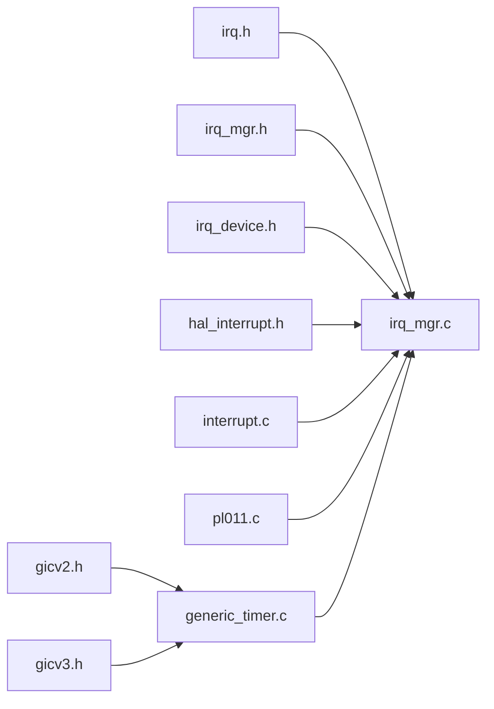

**Diagram sources**
- [irq.h](file://kernel/include/interrupt/irq.h#L1-L38)
- [irq_mgr.h](file://kernel/include/interrupt/irq_mgr.h#L1-L46)
- [irq_device.h](file://kernel/include/interrupt/device/irq_device.h#L1-L32)
- [hal_interrupt.h](file://kernel/include/arch/generic/hal_interrupt.h#L1-L30)
- [interrupt.c](file://kernel/arch/arm64/interrupt.c#L1-L66)
- [irq_mgr.c](file://kernel/interrupt/irq_mgr.c#L1-L142)
- [pl011.c](file://kernel/drivers/arm-uart/pl011.c#L1-L138)
- [generic_timer.c](file://kernel/drivers/arm-timer/generic_timer.c#L1-L284)
- [gicv2.h](file://kernel/drivers/arm-gic/gicv2.h#L1-L105)
- [gicv3.h](file://kernel/drivers/arm-gic/gicv3.h#L1-L147)

**Section sources**
- [irq_mgr.c](file://kernel/interrupt/irq_mgr.c#L1-L142)
- [pl011.c](file://kernel/drivers/arm-uart/pl011.c#L1-L138)
- [generic_timer.c](file://kernel/drivers/arm-timer/generic_timer.c#L1-L284)

## Performance Considerations
- Keep handlers minimal and delegate heavy work to threads or deferred processing when appropriate.
- Use priority and target programming to steer critical interrupts to the intended CPUs and reduce contention.
- Avoid long critical sections; prefer HAL save-and-disable for short durations.
- Ensure EOI is issued promptly to prevent interrupt starvation.
- Batch or defer non-critical logging in handlers to reduce latency.

[No sources needed since this section provides general guidance]

## Troubleshooting Guide
Common issues and checks:
- Unregistered IRQ: The manager logs an error when no handler is found for an interrupt number. Verify registration via the local IRQ manager.
- NULL manager/device: Initialization order matters; ensure the IRQ manager is initialized before drivers attempt to register IRQs or configure devices.
- Handler validation: Ensure handlers return a valid IRQ return value with the end-of-interrupt flag set when applicable.
- Stability: If panics occur during scheduling after interrupts, confirm the scheduler is initialized and reachable.

**Section sources**
- [irq_mgr.c](file://kernel/interrupt/irq_mgr.c#L55-L67)
- [irq_mgr.c](file://kernel/interrupt/irq_mgr.c#L69-L83)

## Conclusion
TranquilOS provides a clean separation between the IRQ model, the local per-CPU manager, and the interrupt controller abstraction. HAL APIs offer precise control over CPU interrupt classes, while device drivers configure controller-specific features. The manager ensures safe ACK/EOI handling and integrates with the scheduler for context switching. Following the examples and best practices here will help you implement robust, secure, and performant interrupt handling across devices.