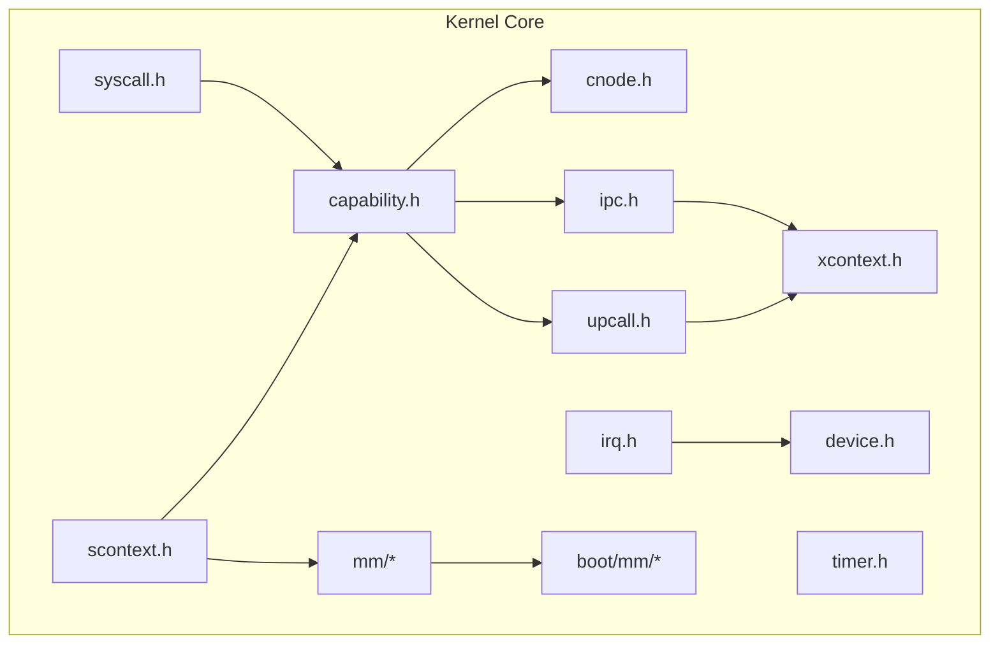
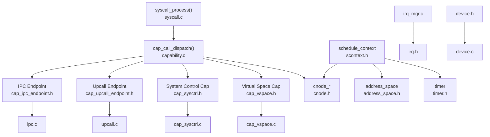
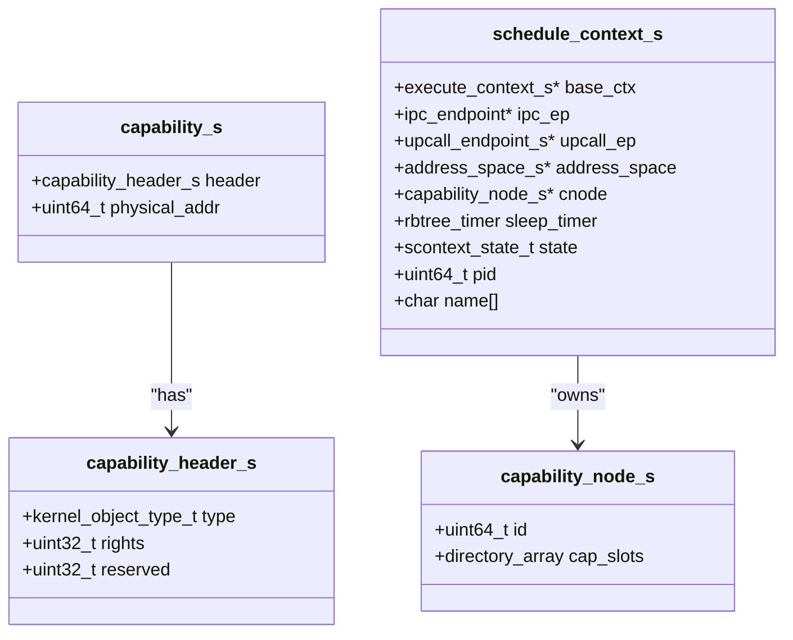
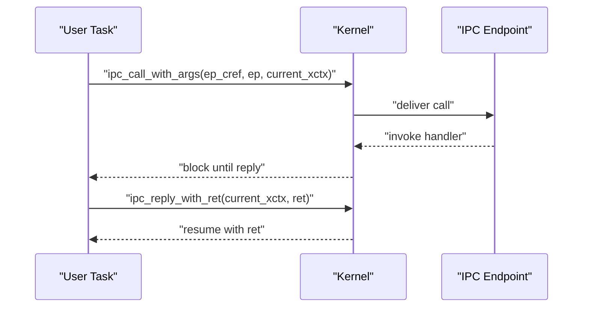
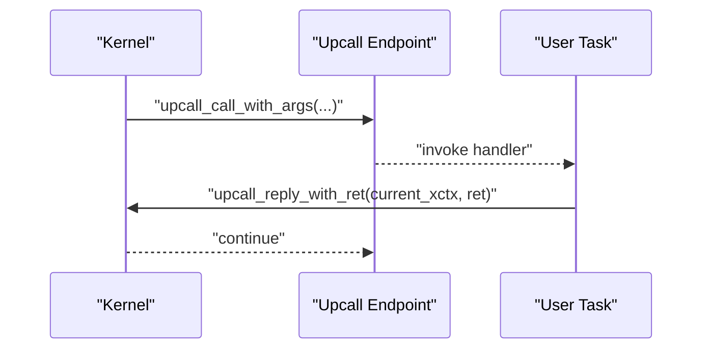
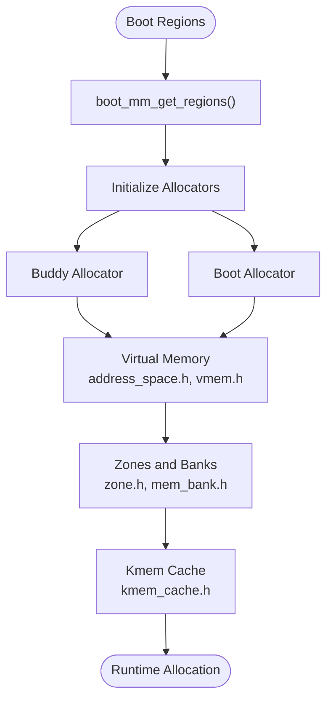
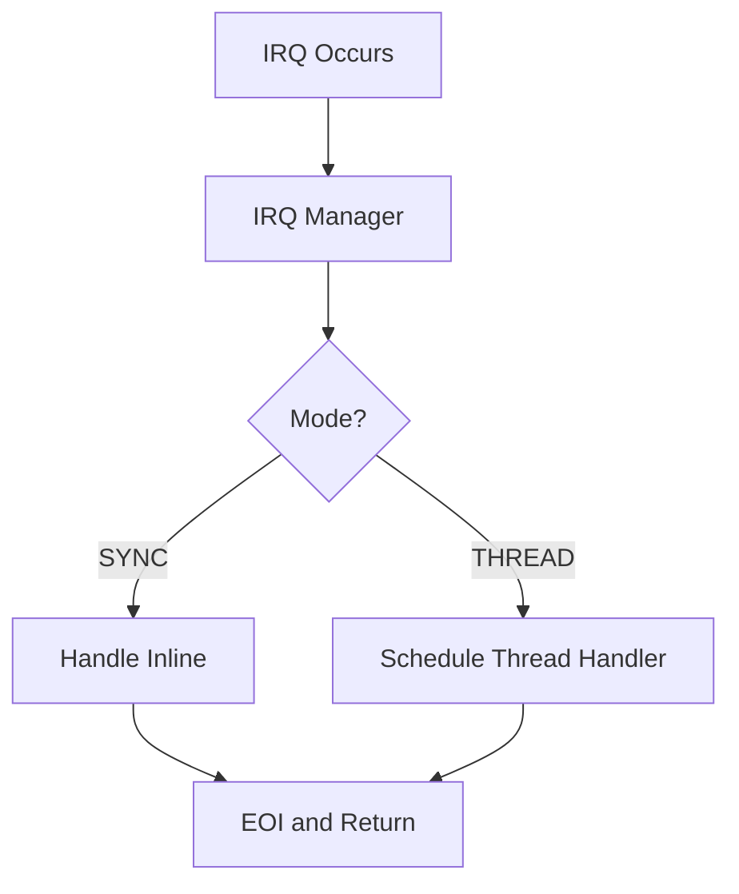
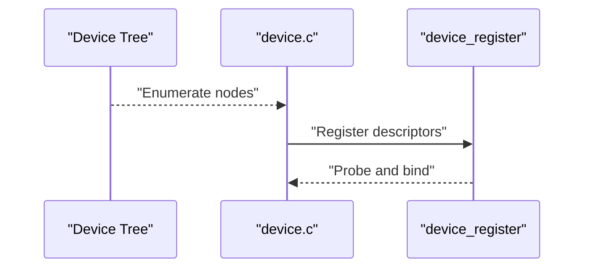
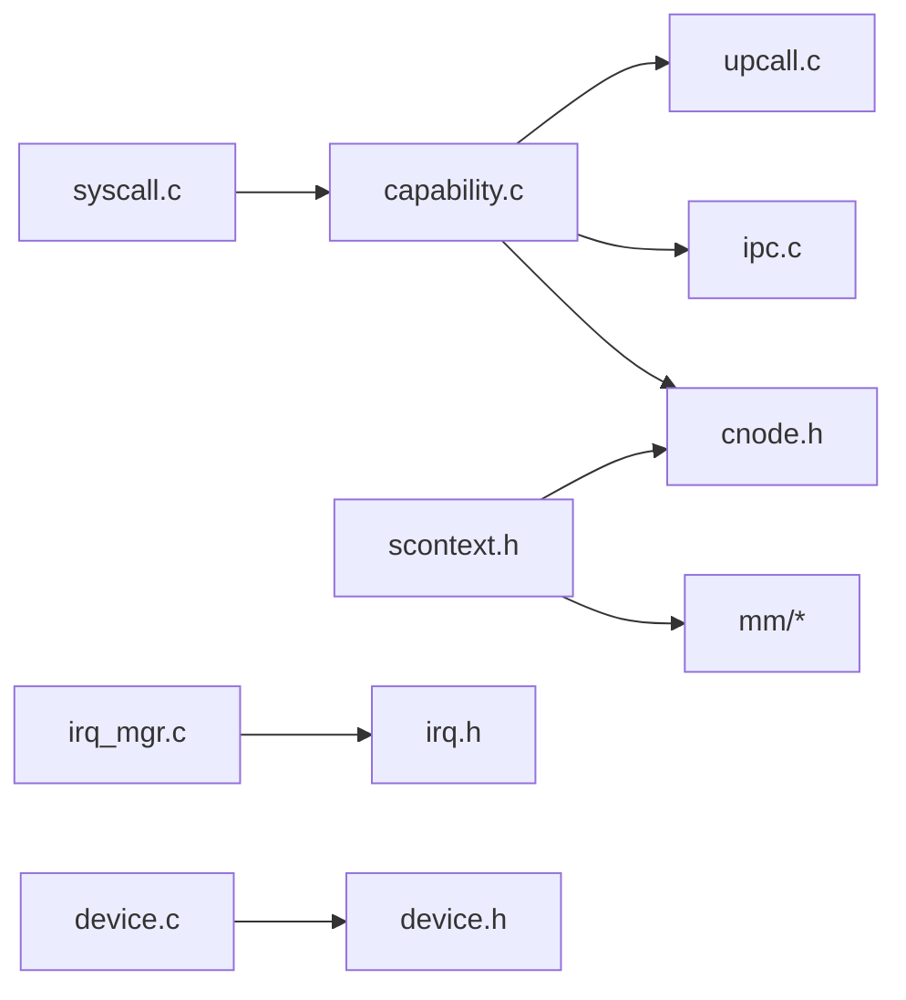

# Kernel APIs

<cite>
**Referenced Files in This Document**
- [syscall.h](file://kernel/include/syscall/syscall.h)
- [capability.h](file://kernel/include/capability/capability.h)
- [cnode.h](file://kernel/include/capability/cnode.h)
- [cap_sysctrl.h](file://kernel/include/capability/cap_sysctrl.h)
- [cap_vspace.h](file://kernel/include/capability/cap_vspace.h)
- [cap_ipc_endpoint.h](file://kernel/include/capability/cap_ipc_endpoint.h)
- [cap_upcall_endpoint.h](file://kernel/include/capability/cap_upcall_endpoint.h)
- [ipc.h](file://kernel/include/ipc/ipc.h)
- [upcall.h](file://kernel/include/upcall/upcall.h)
- [xcontext.h](file://kernel/include/xcontext/xcontext.h)
- [scontext.h](file://kernel/include/scontext/scontext.h)
- [timer.h](file://kernel/include/timer/timer.h)
- [irq.h](file://kernel/include/interrupt/irq.h)
- [device.h](file://kernel/include/device/device.h)
- [mem_map.h](file://kernel/include/mm/mem_map.h)
- [syscall.c](file://kernel/syscall/syscall.c)
- [capability.c](file://kernel/capability/capability.c)
- [cap_cnode.c](file://kernel/capability/cap_cnode.c)
- [cap_sysctrl.c](file://kernel/capability/cap_sysctrl.c)
- [cap_vspace.c](file://kernel/capability/cap_vspace.c)
- [cap_ipc_endpoint.c](file://kernel/capability/cap_ipc_endpoint.c)
- [cap_upcall_endpoint.c](file://kernel/capability/cap_upcall_endpoint.c)
- [ipc.c](file://kernel/ipc/ipc.c)
- [upcall.c](file://kernel/upcall/upcall.c)
- [irq_mgr.c](file://kernel/interrupt/irq_mgr.c)
- [device.c](file://kernel/device/device.c)
- [bootmm.c](file://boot/mm/bootmm.c)
- [mm_translation.c](file://boot/mm/mm_translation.c)
- [remap.c](file://boot/mm/remap.c)
- [bootmm.h](file://kernel/include/mm/bootmm.h)
- [mm.h](file://kernel/include/mm/mem_map.h)
- [page_allocator.h](file://kernel/include/mm/page_allocator.h)
- [buddy_page_allocator.h](file://kernel/include/mm/impl/buddy_page_allocator.h)
- [boot_page_allocator.h](file://kernel/include/mm/impl/boot_page_allocator.h)
- [buddy_page_allocator.c](file://kernel/mm/impl/buddy_page_allocator.c)
- [boot_page_allocator.c](file://kernel/mm/impl/boot_page_allocator.c)
- [address_space.h](file://kernel/include/mm/address_space.h)
- [vmem.h](file://kernel/include/mm/vmem.h)
- [page.h](file://kernel/include/mm/page.h)
- [page_struct_tbl.h](file://kernel/include/mm/page_struct_tbl.h)
- [sparse.h](file://kernel/include/mm/sparse.h)
- [zone.h](file://kernel/include/mm/zone.h)
- [mem_bank.h](file://kernel/include/mm/mem_bank.h)
- [mem_node.h](file://kernel/include/mm/mem_node.h)
- [mem_zone.h](file://kernel/include/mm/mem_zone.h)
- [kmem_cache.h](file://kernel/include/mm/kmem_cache.h)
- [capability.h](file://ulibs/include/libkernel/capability.h)
- [types.h](file://ulibs/include/libkernel/types.h)
- [capcall.h](file://ulibs/include/libkernel/capcall.h)
- [upcall.h](file://ulibs/include/libkernel/upcall.h)
- [ipc.h](file://ulibs/include/libsystem/ipc.h)
- [systemd_client.h](file://ulibs/include/libsystem/systemd_client.h)
- [devmgr_client.h](file://ulibs/include/libsystem/devmgr_client.h)
- [fs_client.h](file://ulibs/include/libsystem/fs_client.h)
- [net_client.h](file://ulibs/include/libsystem/net_client.h)
</cite>

## Table of Contents
1. [Introduction](#introduction)
2. [Project Structure](#project-structure)
3. [Core Components](#core-components)
4. [Architecture Overview](#architecture-overview)
5. [Detailed Component Analysis](#detailed-component-analysis)
6. [Dependency Analysis](#dependency-analysis)
7. [Performance Considerations](#performance-considerations)
8. [Troubleshooting Guide](#troubleshooting-guide)
9. [Conclusion](#conclusion)
10. [Appendices](#appendices)

## Introduction
This document describes the kernel APIs of the TranquilOS microkernel. It focuses on system call interfaces, capability-based APIs, memory management APIs, and interrupt handling APIs. It also covers capability dispatch mechanisms, inter-process communication (IPC) system calls, memory allocation interfaces, and hardware abstraction layer APIs. The goal is to provide function signatures, parameter descriptions, return values, error codes, and usage examples, along with kernel object types, capability rights management, and system call conventions. Finally, it outlines kernel module development and integration patterns.

## Project Structure
The kernel is organized around core subsystems:
- syscall: system call entry and dispatch
- capability: capability model, capability nodes, and capability-specific dispatchers
- ipc: inter-process communication endpoints and calls
- upcall: asynchronous kernel-to-user callbacks
- scontext/xcontext: execution and scheduling contexts
- timer: timers and sleep facilities
- interrupt: IRQ management and handlers
- device: device registration and initialization
- mm: memory management, page allocators, and virtual memory
- boot: early boot memory and translation
- arch: architecture-specific code (ARM64)
- systemd: higher-level services (process, memory, IPC managers)
- ulibs: userland libraries for kernel interfaces

**Diagram sources**
- [syscall.h](file://kernel/include/syscall/syscall.h#L1-L8)
- [capability.h](file://kernel/include/capability/capability.h#L1-L26)
- [cnode.h](file://kernel/include/capability/cnode.h#L1-L29)
- [ipc.h](file://kernel/include/ipc/ipc.h#L1-L13)
- [upcall.h](file://kernel/include/upcall/upcall.h#L1-L13)
- [xcontext.h](file://kernel/include/xcontext/xcontext.h#L1-L24)
- [scontext.h](file://kernel/include/scontext/scontext.h#L1-L50)
- [timer.h](file://kernel/include/timer/timer.h#L1-L57)
- [irq.h](file://kernel/include/interrupt/irq.h#L1-L38)
- [device.h](file://kernel/include/device/device.h#L1-L37)
- [mem_map.h](file://kernel/include/mm/mem_map.h#L1-L29)
- [bootmm.c](file://boot/mm/bootmm.c#L1-L200)

**Section sources**
- [syscall.h](file://kernel/include/syscall/syscall.h#L1-L8)
- [capability.h](file://kernel/include/capability/capability.h#L1-L26)
- [cnode.h](file://kernel/include/capability/cnode.h#L1-L29)
- [ipc.h](file://kernel/include/ipc/ipc.h#L1-L13)
- [upcall.h](file://kernel/include/upcall/upcall.h#L1-L13)
- [xcontext.h](file://kernel/include/xcontext/xcontext.h#L1-L24)
- [scontext.h](file://kernel/include/scontext/scontext.h#L1-L50)
- [timer.h](file://kernel/include/timer/timer.h#L1-L57)
- [irq.h](file://kernel/include/interrupt/irq.h#L1-L38)
- [device.h](file://kernel/include/device/device.h#L1-L37)
- [mem_map.h](file://kernel/include/mm/mem_map.h#L1-L29)

## Core Components
This section documents the primary kernel APIs and their roles.

- System Call Entry
  - Function: syscall_process(execute_context_s *ctx)
  - Purpose: Entry point for system call dispatch from user mode.
  - Parameters:
    - ctx: pointer to execute_context carrying CPU registers and caller context
  - Returns: none (NORETURN)
  - Notes: Implemented in syscall.c; sets up execution context and invokes dispatcher.

- Capability Model
  - capability_s: capability header with type, rights, and physical address.
  - Methods:
    - cap_call_dispatch(execute_context_s *ctx)
    - cap_call_return(execute_context_s *ctx, uint64_t ret_value)
  - Rights mask: CAP_RIGHT_ALL
  - References: capability.h

- Capability Nodes (Capability Directory)
  - capability_node_s: hierarchical capability container.
  - Methods:
    - cnode_init(node, id, addr)
    - cnode_extend(node, paddr)
    - cnode_new_cap(node, type, rights, paddr)
    - cnode_get_cap(node, cref)
    - cnode_get(sctx, cnode_ref)
    - cnode_gen_id()
  - References: cnode.h

- IPC System Calls
  - Functions:
    - ipc_call_with_args(ep_cref, ep, current_xctx) (NORETURN)
    - ipc_reply_with_ret(current_xctx, ret)
  - References: ipc.h

- Upcall System Calls
  - Functions:
    - upcall_call_with_args(upcall_ep, current_xctx, arg0, arg1) (NORETURN)
    - upcall_reply_with_ret(current_xctx, ret)
  - References: upcall.h

- Execution and Schedule Contexts
  - execute_context_s: holds architecture registers and IPC caller context.
  - schedule_context_s: per-task execution state, address space, capability node, timers, and state.
  - Methods:
    - xcontext_init(ctx, entry, sp)
    - xcontext_init_common_regs(ctx)
    - xcontext_dump(ctx)
    - scontext_init(scontext, xcontext)
    - scontext_nanosleep(scontext, nsec)
  - References: xcontext.h, scontext.h

- Timers and Sleep
  - timer_s: timer with hard/soft expiration, clock id, flags, name, wait scontext, and handler.
  - Methods:
    - timer_init(timer, name, callback)
    - timer_add(timer, clk_id, nsec)
  - References: timer.h

- Interrupts and IRQ Management
  - irq_s: interrupt descriptor with number, name, handler, and handle mode.
  - Types:
    - irq_state_t: INVALID, PENDING, ACTIVE, PENDING_ACTIVE
    - irq_handle_mode_t: SYNC, THREAD
  - Methods:
    - IRQ manager registration and handling
  - References: irq.h

- Device Abstraction
  - device_desc_s and device_s: device descriptors and registered devices.
  - Initialization macros:
    - early_device_init, early_device_percpu_init, key_device_init, key_device_percpu_init, normal_device_init
  - Methods:
    - device_register(desc)
    - device_get_property(node, name)
    - init_early_devices(), init_key_devices(), init_normal_devices()
  - References: device.h

- Memory Management Interfaces
  - Boot memory map:
    - mem_regions_s and mem_region_s describe memory types and regions.
    - boot_mm_get_regions()
  - Page allocators:
    - buddy_page_allocator.h, boot_page_allocator.h
    - buddy_page_allocator.c, boot_page_allocator.c
  - Virtual memory:
    - address_space.h, vmem.h, page.h, page_struct_tbl.h, sparse.h, zone.h, mem_bank.h, mem_node.h, mem_zone.h, kmem_cache.h
  - References: mem_map.h, page_allocator.h, buddy_page_allocator.h, boot_page_allocator.h

**Section sources**
- [syscall.h](file://kernel/include/syscall/syscall.h#L1-L8)
- [capability.h](file://kernel/include/capability/capability.h#L1-L26)
- [cnode.h](file://kernel/include/capability/cnode.h#L1-L29)
- [ipc.h](file://kernel/include/ipc/ipc.h#L1-L13)
- [upcall.h](file://kernel/include/upcall/upcall.h#L1-L13)
- [xcontext.h](file://kernel/include/xcontext/xcontext.h#L1-L24)
- [scontext.h](file://kernel/include/scontext/scontext.h#L1-L50)
- [timer.h](file://kernel/include/timer/timer.h#L1-L57)
- [irq.h](file://kernel/include/interrupt/irq.h#L1-L38)
- [device.h](file://kernel/include/device/device.h#L1-L37)
- [mem_map.h](file://kernel/include/mm/mem_map.h#L1-L29)

## Architecture Overview
The kernel follows a capability-based microkernel architecture with explicit IPC and upcalls. System calls enter via syscall_process, which routes to either capability dispatch or IPC/upcall handlers. Each task has a schedule_context bound to an address_space and a capability node (cnode). Memory management is layered: boot-time memory is described by boot_mm_get_regions; runtime allocation uses buddy or boot allocators. Interrupts are managed by an IRQ manager and can be handled synchronously or as threads. Devices are registered via device descriptors and initialized through ordered initcalls.

**Diagram sources**
- [syscall.h](file://kernel/include/syscall/syscall.h#L1-L8)
- [capability.h](file://kernel/include/capability/capability.h#L1-L26)
- [cnode.h](file://kernel/include/capability/cnode.h#L1-L29)
- [cap_sysctrl.h](file://kernel/include/capability/cap_sysctrl.h#L1-L12)
- [cap_vspace.h](file://kernel/include/capability/cap_vspace.h#L1-L12)
- [cap_ipc_endpoint.h](file://kernel/include/capability/cap_ipc_endpoint.h#L1-L12)
- [cap_upcall_endpoint.h](file://kernel/include/capability/cap_upcall_endpoint.h#L1-L12)
- [ipc.h](file://kernel/include/ipc/ipc.h#L1-L13)
- [upcall.h](file://kernel/include/upcall/upcall.h#L1-L13)
- [scontext.h](file://kernel/include/scontext/scontext.h#L1-L50)
- [timer.h](file://kernel/include/timer/timer.h#L1-L57)
- [irq.h](file://kernel/include/interrupt/irq.h#L1-L38)
- [device.h](file://kernel/include/device/device.h#L1-L37)

## Detailed Component Analysis

### System Call Interface
- Entry point
  - Function: syscall_process(execute_context_s *ctx)
  - Purpose: Dispatch user-mode requests to appropriate kernel handlers.
  - Parameters:
    - ctx: execute_context with saved registers and caller context
  - Returns: none (NORETURN)
  - Implementation: syscall.c

- Convention
  - Uses execute_context to pass arguments and return values across modes.
  - Integrates with capability and IPC pathways.

**Section sources**
- [syscall.h](file://kernel/include/syscall/syscall.h#L1-L8)
- [xcontext.h](file://kernel/include/xcontext/xcontext.h#L1-L24)

### Capability-Based APIs
- Capability Header and Dispatch
  - capability_s: header.type, header.rights, header.reserved, physical_addr
  - Methods:
    - cap_call_dispatch(execute_context_s *ctx)
    - cap_call_return(execute_context_s *ctx, uint64_t ret_value)
  - Rights mask: CAP_RIGHT_ALL

- Capability Nodes (Directory)
  - capability_node_s: id, directory array of slots
  - Methods:
    - cnode_init(node, id, addr)
    - cnode_extend(node, paddr)
    - cnode_new_cap(node, type, rights, paddr)
    - cnode_get_cap(node, cref)
    - cnode_get(sctx, cnode_ref)
    - cnode_gen_id()

- Capability Rights
  - Example rights constants:
    - CAP_SysCtrl_RIGHT_create, CAP_SysCtrl_RIGHT_destroy
    - CAP_CapVirtualSpace_RIGHT_create, CAP_CapVirtualSpace_RIGHT_destroy
    - CAP_IpcEndPoint_RIGHT_create, CAP_IpcEndPoint_RIGHT_destroy
    - CAP_UpcallEndPoint_RIGHT_create, CAP_UpcallEndPoint_RIGHT_destroy

- Dispatch Mechanism
  - cap_call_dispatch routes to capability-specific dispatchers:
    - cap_SysCtrl_dispatch
    - cap_VSpace_dispatch
    - cap_IpcEndPoint_dispatch
    - cap_UpcallEndPoint_dispatch

**Diagram sources**
- [capability.h](file://kernel/include/capability/capability.h#L1-L26)
- [cnode.h](file://kernel/include/capability/cnode.h#L1-L29)
- [scontext.h](file://kernel/include/scontext/scontext.h#L1-L50)

**Section sources**
- [capability.h](file://kernel/include/capability/capability.h#L1-L26)
- [cnode.h](file://kernel/include/capability/cnode.h#L1-L29)
- [cap_sysctrl.h](file://kernel/include/capability/cap_sysctrl.h#L1-L12)
- [cap_vspace.h](file://kernel/include/capability/cap_vspace.h#L1-L12)
- [cap_ipc_endpoint.h](file://kernel/include/capability/cap_ipc_endpoint.h#L1-L12)
- [cap_upcall_endpoint.h](file://kernel/include/capability/cap_upcall_endpoint.h#L1-L12)

### IPC System Calls
- IPC Call
  - Function: ipc_call_with_args(ep_cref, ep, current_xctx) (NORETURN)
  - Purpose: Invoke a remote endpoint with arguments; transitions caller into blocked IPC state.
  - Parameters:
    - ep_cref: endpoint capability reference
    - ep: endpoint object
    - current_xctx: caller’s execute_context
  - Returns: none (NORETURN)

- IPC Reply
  - Function: ipc_reply_with_ret(current_xctx, ret)
  - Purpose: Resume a previously blocked caller with return value.
  - Parameters:
    - current_xctx: blocked caller context
    - ret: return value to deliver

**Diagram sources**
- [ipc.h](file://kernel/include/ipc/ipc.h#L1-L13)
- [ipc.c](file://kernel/ipc/ipc.c#L1-L200)

**Section sources**
- [ipc.h](file://kernel/include/ipc/ipc.h#L1-L13)

### Upcall System Calls
- Upcall Call
  - Function: upcall_call_with_args(upcall_ep, current_xctx, arg0, arg1) (NORETURN)
  - Purpose: Trigger an asynchronous callback to userland; passes two arguments.
  - Parameters:
    - upcall_ep: upcall endpoint
    - current_xctx: current execute_context
    - arg0, arg1: arguments

- Upcall Reply
  - Function: upcall_reply_with_ret(current_xctx, ret)
  - Purpose: Complete an upcall and return value to kernel.
  - Parameters:
    - current_xctx: upcall context
    - ret: return value

**Diagram sources**
- [upcall.h](file://kernel/include/upcall/upcall.h#L1-L13)
- [upcall.c](file://kernel/upcall/upcall.c#L1-L200)

**Section sources**
- [upcall.h](file://kernel/include/upcall/upcall.h#L1-L13)

### Memory Management APIs
- Boot Memory Regions
  - mem_regions_s and mem_region_s define memory types and regions.
  - Function: boot_mm_get_regions()
  - Purpose: Retrieve initial memory map for boot-time allocation.

- Runtime Allocators
  - Buddy allocator:
    - Header: buddy_page_allocator.h
    - Implementation: buddy_page_allocator.c
  - Boot allocator:
    - Header: boot_page_allocator.h
    - Implementation: boot_page_allocator.c

- Virtual Memory and Zones
  - Headers: address_space.h, vmem.h, page.h, page_struct_tbl.h, sparse.h, zone.h, mem_bank.h, mem_node.h, mem_zone.h, kmem_cache.h
  - Purpose: Manage page tables, zones, and caches for dynamic allocation.

**Diagram sources**
- [mem_map.h](file://kernel/include/mm/mem_map.h#L1-L29)
- [buddy_page_allocator.h](file://kernel/include/mm/impl/buddy_page_allocator.h#L1-L200)
- [boot_page_allocator.h](file://kernel/include/mm/impl/boot_page_allocator.h#L1-L200)
- [address_space.h](file://kernel/include/mm/address_space.h#L1-L200)
- [vmem.h](file://kernel/include/mm/vmem.h#L1-L200)
- [zone.h](file://kernel/include/mm/zone.h#L1-L200)
- [kmem_cache.h](file://kernel/include/mm/kmem_cache.h#L1-L200)

**Section sources**
- [mem_map.h](file://kernel/include/mm/mem_map.h#L1-L29)
- [buddy_page_allocator.h](file://kernel/include/mm/impl/buddy_page_allocator.h#L1-L200)
- [boot_page_allocator.h](file://kernel/include/mm/impl/boot_page_allocator.h#L1-L200)

### Interrupt Handling APIs
- IRQ Descriptor
  - irq_s fields: int_no, name, handler, handle_mode
  - Modes: INTERRUPT_HANDLE_MODE_SYNC, INTERRUPT_HANDLE_MODE_THREAD
  - State: IRQ_STATE_INVALID, IRQ_STATE_PENDING, IRQ_STATE_ACTIVE, IRQ_STATE_PENDING_ACTIVE
  - Return type: irq_ret_t union with EOI bit

- IRQ Manager
  - Registration and handling via irq_mgr.c
  - Device integration via irq_device.h

**Diagram sources**
- [irq.h](file://kernel/include/interrupt/irq.h#L1-L38)
- [irq_mgr.c](file://kernel/interrupt/irq_mgr.c#L1-L200)

**Section sources**
- [irq.h](file://kernel/include/interrupt/irq.h#L1-L38)

### Hardware Abstraction Layer APIs
- Device Registration
  - device_desc_s: compatible string and probe function
  - device_s: registered device entries
  - Macros: early_device_init, early_device_percpu_init, key_device_init, key_device_percpu_init, normal_device_init
  - Functions: device_register, device_get_property, init_early_devices, init_key_devices, init_normal_devices

- Device Tree Integration
  - device_tree.h used by device.c for property retrieval

**Diagram sources**
- [device.h](file://kernel/include/device/device.h#L1-L37)
- [device.c](file://kernel/device/device.c#L1-L200)

**Section sources**
- [device.h](file://kernel/include/device/device.h#L1-L37)

### Kernel Object Types and Rights Management
- Kernel Object Types
  - Defined via capability_header_s.type in capability.h
  - Examples include system control, virtual space, IPC endpoint, upcall endpoint, and others.

- Rights Management
  - Rights bits are stored in capability_header_s.rights
  - Rights masks:
    - CAP_RIGHT_ALL
    - CAP_SysCtrl_RIGHT_create, CAP_SysCtrl_RIGHT_destroy
    - CAP_CapVirtualSpace_RIGHT_create, CAP_CapVirtualSpace_RIGHT_destroy
    - CAP_IpcEndPoint_RIGHT_create, CAP_IpcEndPoint_RIGHT_destroy
    - CAP_UpcallEndPoint_RIGHT_create, CAP_UpcallEndPoint_RIGHT_destroy

- Capability Dispatch
  - cap_call_dispatch routes to capability-specific dispatchers based on type and method.

**Section sources**
- [capability.h](file://kernel/include/capability/capability.h#L1-L26)
- [cap_sysctrl.h](file://kernel/include/capability/cap_sysctrl.h#L1-L12)
- [cap_vspace.h](file://kernel/include/capability/cap_vspace.h#L1-L12)
- [cap_ipc_endpoint.h](file://kernel/include/capability/cap_ipc_endpoint.h#L1-L12)
- [cap_upcall_endpoint.h](file://kernel/include/capability/cap_upcall_endpoint.h#L1-L12)

### System Call Conventions and Examples
- System Call Entry
  - syscall_process(execute_context_s *ctx) is the entry point invoked from assembly/trap entry.

- Capability Call Conventions
  - cap_call_dispatch(execute_context_s *ctx) expects method and capability references in ctx registers.
  - cap_call_return(ctx, ret_value) returns values to the caller.

- IPC Conventions
  - ipc_call_with_args blocks the caller until ipc_reply_with_ret resumes execution.
  - Upcalls use upcall_call_with_args and upcall_reply_with_ret.

- Example Usage Patterns
  - Creating a capability node and inserting capabilities:
    - cnode_init, cnode_extend, cnode_new_cap
  - Using IPC endpoints:
    - ipc_call_with_args(ep_cref, ep, current_xctx)
    - ipc_reply_with_ret(current_xctx, ret)
  - Using upcall endpoints:
    - upcall_call_with_args(upcall_ep, current_xctx, arg0, arg1)
    - upcall_reply_with_ret(current_xctx, ret)
  - Managing timers:
    - timer_init, timer_add, scontext_nanosleep

**Section sources**
- [syscall.h](file://kernel/include/syscall/syscall.h#L1-L8)
- [capability.h](file://kernel/include/capability/capability.h#L1-L26)
- [ipc.h](file://kernel/include/ipc/ipc.h#L1-L13)
- [upcall.h](file://kernel/include/upcall/upcall.h#L1-L13)
- [timer.h](file://kernel/include/timer/timer.h#L1-L57)

### Kernel Module Development and Integration Patterns
- Device Drivers
  - Implement device_desc_s with compatible string and do_probe function.
  - Register via device_register; use initcall macros for ordering.
  - Access properties via device_get_property.

- Capability Modules
  - Implement capability-specific dispatchers (e.g., cap_SysCtrl_dispatch, cap_VSpace_dispatch).
  - Use cnode_new_cap to expose new capabilities to tasks.

- IPC and Upcall Services
  - Create endpoints using capability rights and expose via cnode.
  - Implement handlers that call ipc_reply_with_ret or upcall_reply_with_ret.

- Memory Management
  - Use boot_mm_get_regions during early boot.
  - Initialize allocators and set up address spaces for new tasks.

- Integration Checklist
  - Define device descriptors and probe logic
  - Register devices with appropriate initcall level
  - Expose capabilities via cnode
  - Implement IPC/upcall handlers
  - Integrate with timers and scheduling

**Section sources**
- [device.h](file://kernel/include/device/device.h#L1-L37)
- [cnode.h](file://kernel/include/capability/cnode.h#L1-L29)
- [ipc.h](file://kernel/include/ipc/ipc.h#L1-L13)
- [upcall.h](file://kernel/include/upcall/upcall.h#L1-L13)
- [timer.h](file://kernel/include/timer/timer.h#L1-L57)

## Dependency Analysis
This section maps key dependencies among kernel components.

**Diagram sources**
- [syscall.c](file://kernel/syscall/syscall.c#L1-L200)
- [capability.c](file://kernel/capability/capability.c#L1-L200)
- [cnode.h](file://kernel/include/capability/cnode.h#L1-L29)
- [ipc.c](file://kernel/ipc/ipc.c#L1-L200)
- [upcall.c](file://kernel/upcall/upcall.c#L1-L200)
- [scontext.h](file://kernel/include/scontext/scontext.h#L1-L50)
- [irq_mgr.c](file://kernel/interrupt/irq_mgr.c#L1-L200)
- [irq.h](file://kernel/include/interrupt/irq.h#L1-L38)
- [device.c](file://kernel/device/device.c#L1-L200)
- [device.h](file://kernel/include/device/device.h#L1-L37)

**Section sources**
- [syscall.c](file://kernel/syscall/syscall.c#L1-L200)
- [capability.c](file://kernel/capability/capability.c#L1-L200)
- [cnode.h](file://kernel/include/capability/cnode.h#L1-L29)
- [ipc.c](file://kernel/ipc/ipc.c#L1-L200)
- [upcall.c](file://kernel/upcall/upcall.c#L1-L200)
- [scontext.h](file://kernel/include/scontext/scontext.h#L1-L50)
- [irq_mgr.c](file://kernel/interrupt/irq_mgr.c#L1-L200)
- [irq.h](file://kernel/include/interrupt/irq.h#L1-L38)
- [device.c](file://kernel/device/device.c#L1-L200)
- [device.h](file://kernel/include/device/device.h#L1-L37)

## Performance Considerations
- Capability dispatch overhead is minimized by direct routing and packed capability headers.
- IPC and upcall use blocking/resume patterns to avoid busy-waiting; ensure handlers are efficient.
- Timer containers support O(log n) operations via red-black trees; choose appropriate clock ids.
- IRQ synchronous handling reduces latency but must remain lightweight; delegate heavy work to threaded handlers.
- Memory allocators balance fragmentation and speed; prefer buddy allocator for large allocations and boot allocator for early stages.

## Troubleshooting Guide
- Capability Rights Issues
  - Symptoms: Access denied errors when invoking capability methods.
  - Actions: Verify rights bits in capability_header_s.rights; ensure cnode_new_cap grants required rights.

- IPC Deadlocks
  - Symptoms: Caller stuck indefinitely after ipc_call_with_args.
  - Actions: Ensure the receiver calls ipc_reply_with_ret; check endpoint references and method dispatch.

- Upcall Failures
  - Symptoms: Upcall not delivered or reply not received.
  - Actions: Confirm upcall endpoint validity and that upcall_reply_with_ret is called with correct context.

- Timer Problems
  - Symptoms: Sleeps not waking or timers not firing.
  - Actions: Validate timer_init and timer_add parameters; confirm clock id and expiration intervals.

- IRQ Handling
  - Symptoms: Interrupts not acknowledged or lost.
  - Actions: Check IRQ state transitions and EOI handling; verify handle mode selection.

**Section sources**
- [capability.h](file://kernel/include/capability/capability.h#L1-L26)
- [ipc.h](file://kernel/include/ipc/ipc.h#L1-L13)
- [upcall.h](file://kernel/include/upcall/upcall.h#L1-L13)
- [timer.h](file://kernel/include/timer/timer.h#L1-L57)
- [irq.h](file://kernel/include/interrupt/irq.h#L1-L38)

## Conclusion
TranquilOS provides a clean, capability-centric microkernel with explicit IPC and upcall mechanisms. System calls enter via syscall_process and are dispatched to capability, IPC, or upcall handlers. Memory management integrates boot-time regions with runtime allocators and virtual memory abstractions. Interrupts and devices are integrated through a structured IRQ manager and device registration framework. By following the documented APIs, rights management, and integration patterns, developers can implement robust kernel modules and services.

## Appendices
- Userland Libraries for Kernel Interfaces
  - libkernel: capability.h, types.h, capcall.h, upcall.h
  - libsystem: ipc.h, systemd_client.h, devmgr_client.h, fs_client.h, net_client.h

**Section sources**
- [capability.h](file://ulibs/include/libkernel/capability.h#L1-L200)
- [types.h](file://ulibs/include/libkernel/types.h#L1-L200)
- [capcall.h](file://ulibs/include/libkernel/capcall.h#L1-L200)
- [upcall.h](file://ulibs/include/libkernel/upcall.h#L1-L200)
- [ipc.h](file://ulibs/include/libsystem/ipc.h#L1-L200)
- [systemd_client.h](file://ulibs/include/libsystem/systemd_client.h#L1-L200)
- [devmgr_client.h](file://ulibs/include/libsystem/devmgr_client.h#L1-L200)
- [fs_client.h](file://ulibs/include/libsystem/fs_client.h#L1-L200)
- [net_client.h](file://ulibs/include/libsystem/net_client.h#L1-L200)