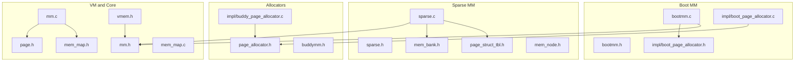
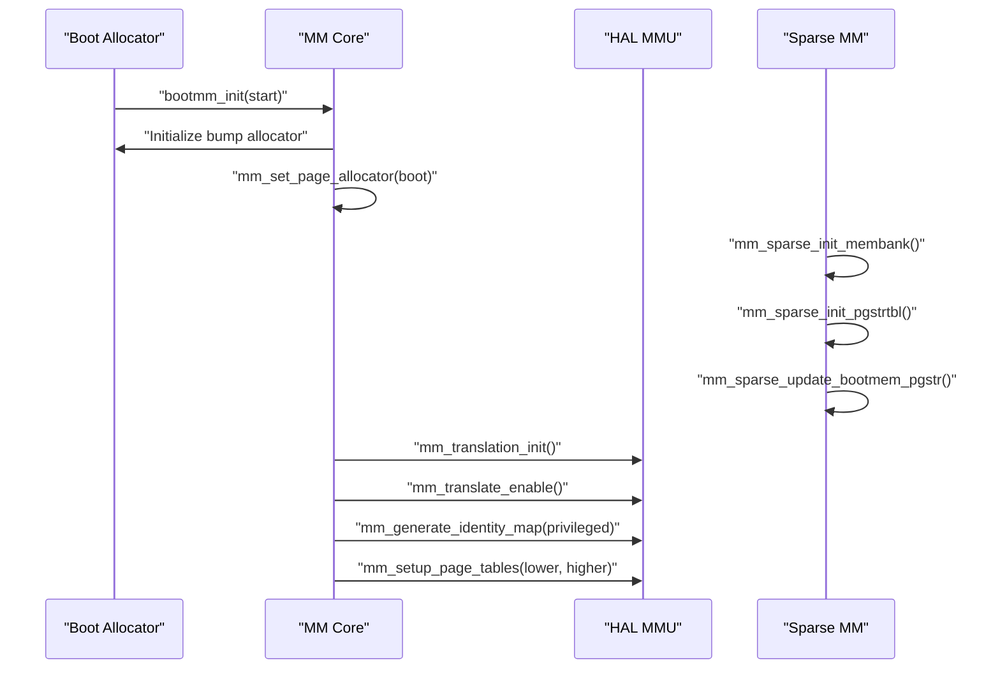
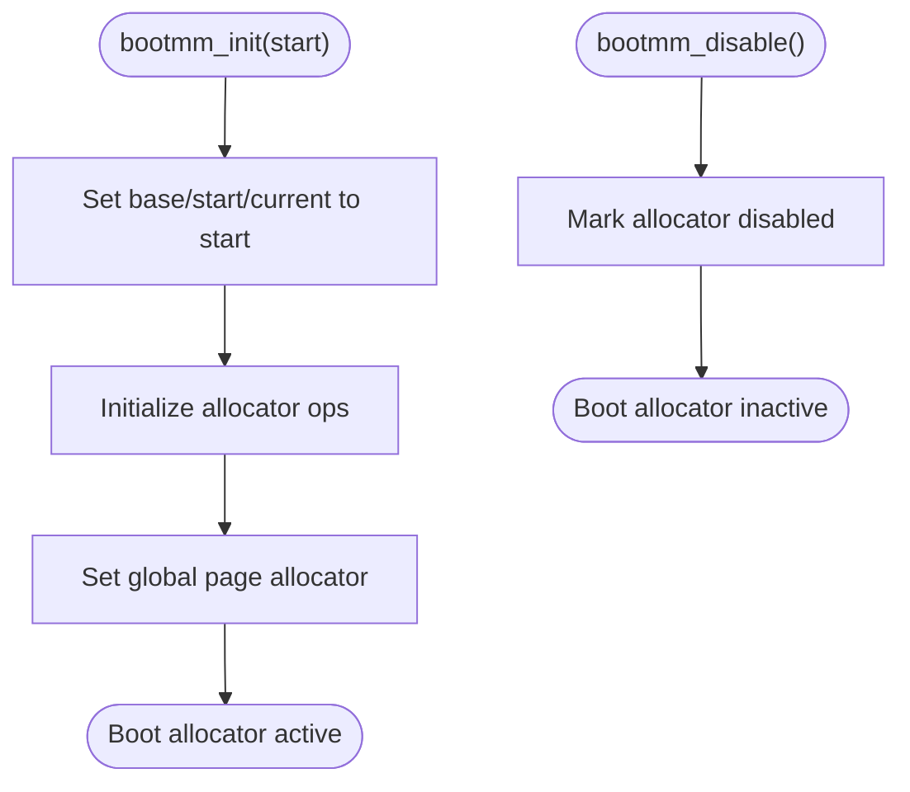
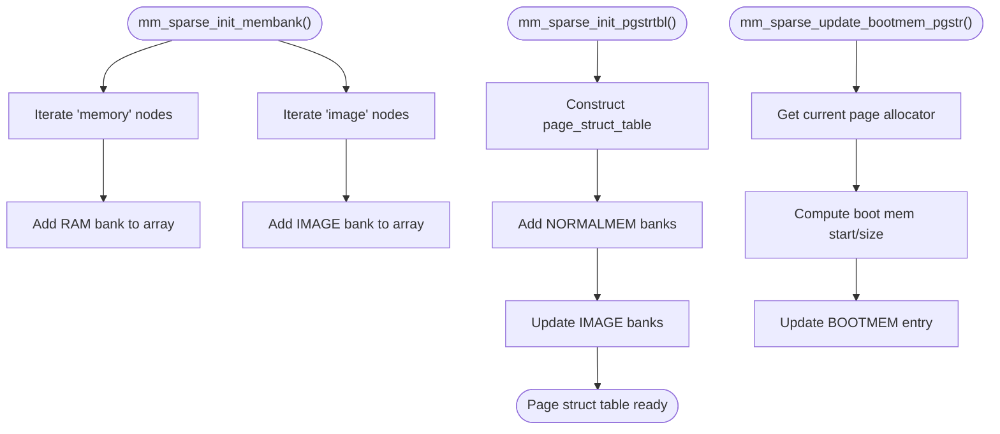
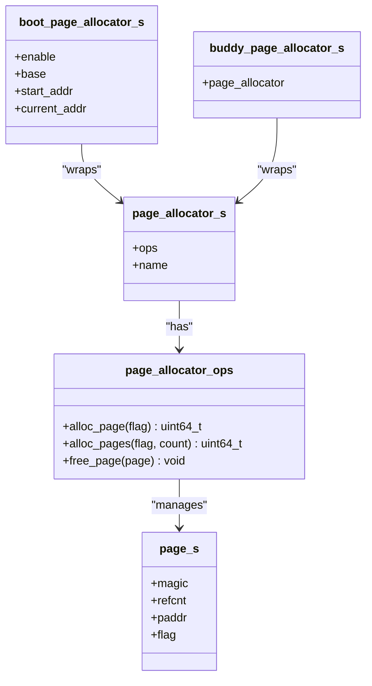
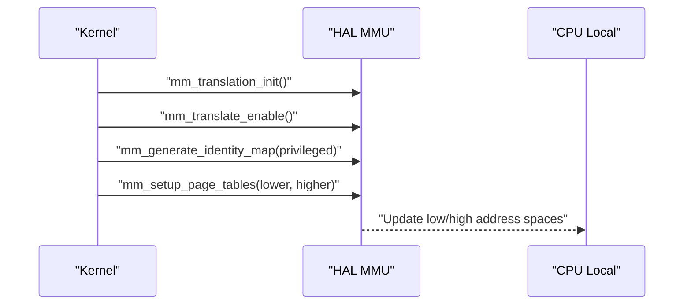
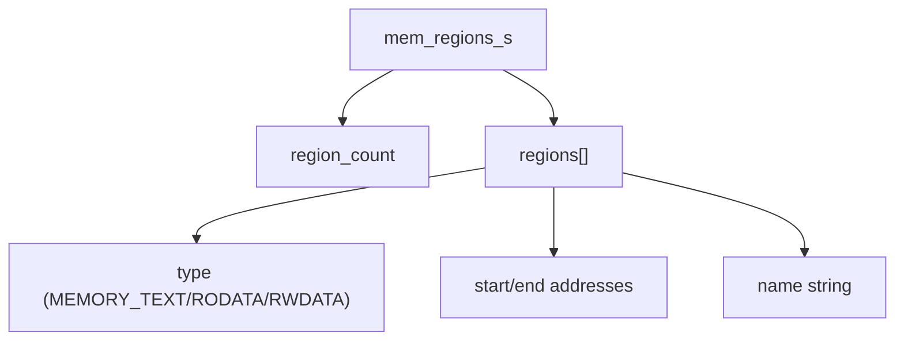
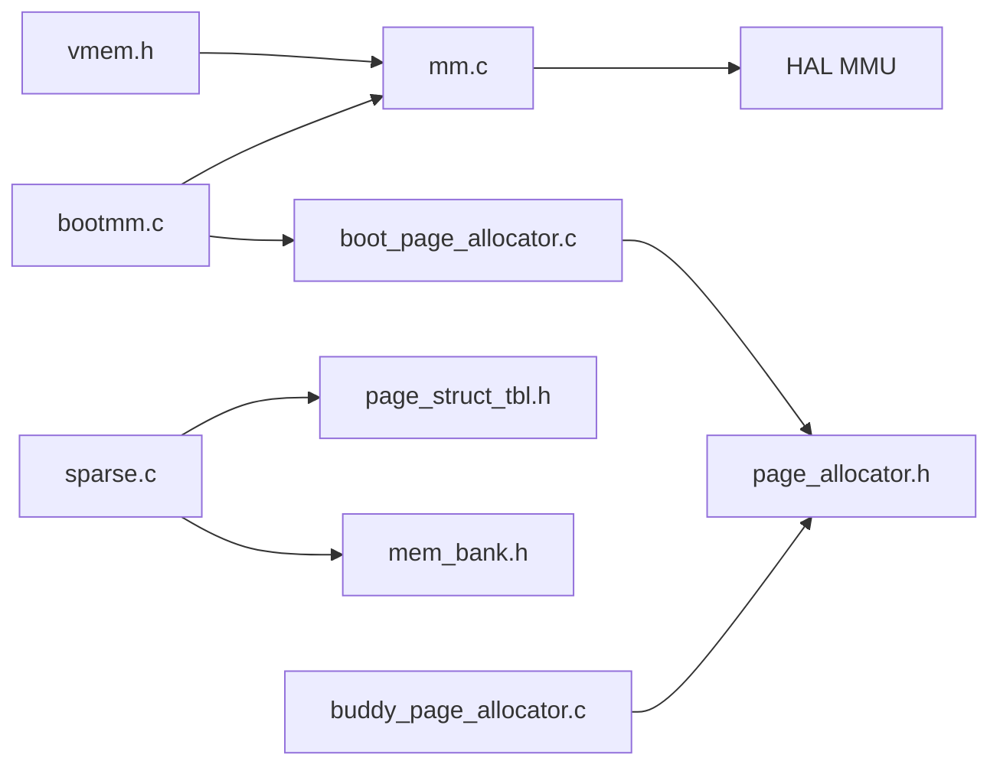

# Memory Management APIs

<cite>
**Referenced Files in This Document**
- [mem_map.h](file://kernel/include/mm/mem_map.h)
- [mem_map.c](file://kernel/mm/mem_map.c)
- [bootmm.h](file://kernel/include/mm/bootmm.h)
- [bootmm.c](file://kernel/mm/bootmm.c)
- [sparse.h](file://kernel/include/mm/sparse.h)
- [sparse.c](file://kernel/mm/sparse.c)
- [page_allocator.h](file://kernel/include/mm/page_allocator.h)
- [buddymm.h](file://kernel/include/mm/buddymm.h)
- [buddy_page_allocator.c](file://kernel/mm/impl/buddy_page_allocator.c)
- [boot_page_allocator.c](file://kernel/mm/impl/boot_page_allocator.c)
- [mm.h](file://kernel/include/mm/mm.h)
- [mm.c](file://kernel/mm/mm.c)
- [page.h](file://kernel/include/mm/page.h)
- [page_struct_tbl.h](file://kernel/include/mm/page_struct_tbl.h)
- [mem_bank.h](file://kernel/include/mm/mem_bank.h)
- [mem_node.h](file://kernel/include/mm/mem_node.h)
- [vmem.h](file://kernel/include/mm/vmem.h)
</cite>

## Table of Contents
1. [Introduction](#introduction)
2. [Project Structure](#project-structure)
3. [Core Components](#core-components)
4. [Architecture Overview](#architecture-overview)
5. [Detailed Component Analysis](#detailed-component-analysis)
6. [Dependency Analysis](#dependency-analysis)
7. [Performance Considerations](#performance-considerations)
8. [Troubleshooting Guide](#troubleshooting-guide)
9. [Conclusion](#conclusion)

## Introduction
This document describes the memory management APIs in the TranquilOS kernel, focusing on memory map operations, page allocation interfaces, buddy allocator APIs, boot memory management, virtual memory mapping, physical memory management, and sparse memory allocation. It also covers memory zones, page table manipulation, and practical patterns for memory protection, sharing, and deallocation.

## Project Structure
The memory subsystem spans several header and implementation files under kernel/include/mm and kernel/mm. Key areas include:
- Boot-time memory management and early page allocation
- Sparse memory initialization and memory bank tracking
- Page allocator abstractions and concrete allocators (boot and buddy)
- Virtual memory mapping and identity mapping helpers
- Page structures and page-to-physical-address bookkeeping

**Diagram sources**
- [bootmm.h](file://kernel/include/mm/bootmm.h#L1-L11)
- [bootmm.c](file://kernel/mm/bootmm.c#L1-L24)
- [sparse.h](file://kernel/include/mm/sparse.h#L1-L17)
- [sparse.c](file://kernel/mm/sparse.c#L1-L104)
- [page_allocator.h](file://kernel/include/mm/page_allocator.h#L1-L23)
- [buddymm.h](file://kernel/include/mm/buddymm.h#L1-L11)
- [buddy_page_allocator.c](file://kernel/mm/impl/buddy_page_allocator.c#L1-L27)
- [boot_page_allocator.c](file://kernel/mm/impl/boot_page_allocator.c#L1-L47)
- [mm.h](file://kernel/include/mm/mm.h#L1-L23)
- [mm.c](file://kernel/mm/mm.c#L1-L45)
- [page.h](file://kernel/include/mm/page.h#L1-L31)
- [vmem.h](file://kernel/include/mm/vmem.h#L1-L22)
- [mem_map.h](file://kernel/include/mm/mem_map.h#L1-L29)
- [mem_map.c](file://kernel/mm/mem_map.c#L1-L64)

**Section sources**
- [mm.h](file://kernel/include/mm/mm.h#L1-L23)
- [mm.c](file://kernel/mm/mm.c#L1-L45)
- [mem_map.h](file://kernel/include/mm/mem_map.h#L1-L29)
- [mem_map.c](file://kernel/mm/mem_map.c#L1-L64)
- [sparse.h](file://kernel/include/mm/sparse.h#L1-L17)
- [sparse.c](file://kernel/mm/sparse.c#L1-L104)
- [page_allocator.h](file://kernel/include/mm/page_allocator.h#L1-L23)
- [buddymm.h](file://kernel/include/mm/buddymm.h#L1-L11)
- [buddy_page_allocator.c](file://kernel/mm/impl/buddy_page_allocator.c#L1-L27)
- [boot_page_allocator.c](file://kernel/mm/impl/boot_page_allocator.c#L1-L47)
- [page.h](file://kernel/include/mm/page.h#L1-L31)
- [page_struct_tbl.h](file://kernel/include/mm/page_struct_tbl.h#L1-L47)
- [mem_bank.h](file://kernel/include/mm/mem_bank.h#L1-L21)
- [mem_node.h](file://kernel/include/mm/mem_node.h#L1-L21)
- [vmem.h](file://kernel/include/mm/vmem.h#L1-L22)

## Core Components
- Boot memory manager
  - Initializes a simple bump allocator for early boot allocations and switches the global page allocator to it during boot.
  - Provides disablement to prevent further allocations after transitioning to a permanent allocator.
  - Exposed via bootmm_init and bootmm_disable.

- Sparse memory subsystem
  - Discovers memory banks from device tree nodes and builds a page structure table to track memory regions by type.
  - Supports updating memory bank types (normal RAM, image, boot memory) and exposes helpers to query nodes and boot memory boundaries.

- Page allocator abstraction
  - Defines a uniform interface for allocating/freeing single pages or contiguous page blocks.
  - Implemented by boot and buddy allocators; the kernel stores a pointer to the active allocator globally.

- Buddy allocator API
  - Declared interface for a buddy allocator; implementation is present but marked as TODO in the current codebase.

- Virtual memory mapping
  - HAL-based helpers to enable/disable translation, initialize MMU, generate identity maps, and set user/kernel page tables.

- Page structures and flags
  - Defines page size constants, page flags (GFP masks), and the page structure with magic, reference count, and physical address.

- Memory map regions
  - Boot-time region descriptors for text, rodata, data, bss, and kernel stack, exposed for introspection.

**Section sources**
- [bootmm.h](file://kernel/include/mm/bootmm.h#L1-L11)
- [bootmm.c](file://kernel/mm/bootmm.c#L1-L24)
- [sparse.h](file://kernel/include/mm/sparse.h#L1-L17)
- [sparse.c](file://kernel/mm/sparse.c#L1-L104)
- [page_allocator.h](file://kernel/include/mm/page_allocator.h#L1-L23)
- [buddymm.h](file://kernel/include/mm/buddymm.h#L1-L11)
- [buddy_page_allocator.c](file://kernel/mm/impl/buddy_page_allocator.c#L1-L27)
- [mm.h](file://kernel/include/mm/mm.h#L1-L23)
- [mm.c](file://kernel/mm/mm.c#L1-L45)
- [page.h](file://kernel/include/mm/page.h#L1-L31)
- [mem_map.h](file://kernel/include/mm/mem_map.h#L1-L29)
- [mem_map.c](file://kernel/mm/mem_map.c#L1-L64)

## Architecture Overview
The memory management architecture centers around a global page allocator pointer that is initialized early by the boot allocator and later replaced by a production allocator (e.g., buddy). The sparse subsystem discovers physical memory and maintains a page structure table to manage memory regions. HAL wrappers provide low-level MMU control and identity mapping.

**Diagram sources**
- [bootmm.c](file://kernel/mm/bootmm.c#L13-L19)
- [mm.c](file://kernel/mm/mm.c#L29-L45)
- [sparse.c](file://kernel/mm/sparse.c#L52-L89)

## Detailed Component Analysis

### Boot Memory Manager
- Purpose: Provide a minimal bump allocator during early boot until a more capable allocator is ready.
- Key functions:
  - Initialize the boot allocator with a base address and wire it as the global page allocator.
  - Disable the boot allocator to prevent further allocations after handoff.
- Typical usage pattern:
  - Call bootmm_init at the start of the kernel with the desired base address.
  - After initializing sparse memory and page structures, replace the allocator with a production one and call bootmm_disable.

**Diagram sources**
- [bootmm.c](file://kernel/mm/bootmm.c#L13-L24)
- [boot_page_allocator.c](file://kernel/mm/impl/boot_page_allocator.c#L35-L47)

**Section sources**
- [bootmm.h](file://kernel/include/mm/bootmm.h#L7-L10)
- [bootmm.c](file://kernel/mm/bootmm.c#L13-L24)
- [boot_page_allocator.c](file://kernel/mm/impl/boot_page_allocator.c#L7-L33)

### Sparse Memory Allocation and Page Structure Table
- Purpose: Discover memory banks from device tree, maintain a page structure table, and update memory bank types.
- Key functions:
  - Initialize memory banks from device tree nodes.
  - Construct and populate the page structure table with normal RAM, image, and boot memory entries.
  - Compute the end of boot memory to inform subsequent updates.
- Data structures:
  - Memory bank descriptors with type, start, and size.
  - Page structure table with add/update operations and per-entry metadata.

**Diagram sources**
- [sparse.c](file://kernel/mm/sparse.c#L52-L89)
- [page_struct_tbl.h](file://kernel/include/mm/page_struct_tbl.h#L37-L41)
- [mem_bank.h](file://kernel/include/mm/mem_bank.h#L15-L19)

**Section sources**
- [sparse.h](file://kernel/include/mm/sparse.h#L8-L15)
- [sparse.c](file://kernel/mm/sparse.c#L26-L89)
- [page_struct_tbl.h](file://kernel/include/mm/page_struct_tbl.h#L7-L41)
- [mem_bank.h](file://kernel/include/mm/mem_bank.h#L8-L13)

### Page Allocator Abstraction and Implementations
- Abstraction:
  - Uniform interface for allocating/freeing pages and contiguous page blocks.
  - Implemented by boot and buddy allocators.
- Boot allocator:
  - Bump allocator that increments current address by page size multiplied by count.
  - No free operation; designed for temporary boot-time allocations.
- Buddy allocator:
  - Declared interface exists; implementation currently marked as TODO.

**Diagram sources**
- [page_allocator.h](file://kernel/include/mm/page_allocator.h#L12-L21)
- [boot_page_allocator.c](file://kernel/mm/impl/boot_page_allocator.c#L35-L47)
- [buddy_page_allocator.c](file://kernel/mm/impl/buddy_page_allocator.c#L21-L27)
- [page.h](file://kernel/include/mm/page.h#L23-L29)

**Section sources**
- [page_allocator.h](file://kernel/include/mm/page_allocator.h#L8-L21)
- [boot_page_allocator.c](file://kernel/mm/impl/boot_page_allocator.c#L7-L33)
- [buddy_page_allocator.c](file://kernel/mm/impl/buddy_page_allocator.c#L6-L19)
- [page.h](file://kernel/include/mm/page.h#L12-L29)

### Virtual Memory Mapping and Identity Mapping
- Purpose: Control MMU translation, generate identity mappings, and set user/kernel page tables.
- Functions:
  - Enable/disable translation.
  - Initialize MMU.
  - Generate identity map for privileged or unprivileged contexts.
  - Set user and kernel page tables and update CPU-local address spaces.

**Diagram sources**
- [mm.c](file://kernel/mm/mm.c#L29-L45)
- [mm.h](file://kernel/include/mm/mm.h#L12-L16)
- [vmem.h](file://kernel/include/mm/vmem.h#L12-L17)

**Section sources**
- [mm.h](file://kernel/include/mm/mm.h#L8-L21)
- [mm.c](file://kernel/mm/mm.c#L21-L45)
- [vmem.h](file://kernel/include/mm/vmem.h#L7-L17)

### Memory Regions and Boot-Time Segments
- Purpose: Describe kernel segments and stacks for introspection and diagnostics.
- Data:
  - Enumerated memory types (text, rodata, r/w data).
  - Region arrays with start/end addresses and names.
- Usage: Access via boot_mm_get_regions to enumerate boot-time memory segments.

**Diagram sources**
- [mem_map.h](file://kernel/include/mm/mem_map.h#L20-L23)
- [mem_map.c](file://kernel/mm/mem_map.c#L20-L60)

**Section sources**
- [mem_map.h](file://kernel/include/mm/mem_map.h#L7-L23)
- [mem_map.c](file://kernel/mm/mem_map.c#L20-L64)

## Dependency Analysis
- Global allocator pointer:
  - Managed by mm.c; set by bootmm.c and potentially replaced by a production allocator.
- HAL dependency:
  - mm.c depends on HAL for MMU operations; vmem.h defines the virtual memory abstraction used by HAL.
- Sparse subsystem:
  - Uses device tree iteration to discover memory banks and constructs the page structure table.
- Allocators:
  - Both boot and buddy allocators implement the page_allocator_ops interface.

**Diagram sources**
- [mm.c](file://kernel/mm/mm.c#L1-L45)
- [bootmm.c](file://kernel/mm/bootmm.c#L1-L24)
- [boot_page_allocator.c](file://kernel/mm/impl/boot_page_allocator.c#L1-L47)
- [sparse.c](file://kernel/mm/sparse.c#L1-L104)
- [page_struct_tbl.h](file://kernel/include/mm/page_struct_tbl.h#L1-L47)
- [mem_bank.h](file://kernel/include/mm/mem_bank.h#L1-L21)
- [buddy_page_allocator.c](file://kernel/mm/impl/buddy_page_allocator.c#L1-L27)
- [page_allocator.h](file://kernel/include/mm/page_allocator.h#L1-L23)
- [vmem.h](file://kernel/include/mm/vmem.h#L1-L22)

**Section sources**
- [mm.c](file://kernel/mm/mm.c#L10-L19)
- [bootmm.c](file://kernel/mm/bootmm.c#L13-L19)
- [sparse.c](file://kernel/mm/sparse.c#L75-L89)
- [page_allocator.h](file://kernel/include/mm/page_allocator.h#L12-L21)

## Performance Considerations
- Boot allocator:
  - O(1) allocation per page; suitable for early boot but not for fragmentation control.
- Buddy allocator:
  - Current implementation is a placeholder; actual performance characteristics depend on the final implementation.
- Page structure table:
  - Adding/updating memory banks is linear in the number of banks; keep device tree clean to minimize iterations.
- Translation setup:
  - Identity mapping and page table updates should be batched to reduce TLB pressure.

## Troubleshooting Guide
- Boot allocator disabled:
  - Attempting allocations after disabling the boot allocator will trigger a panic. Ensure bootmm_disable is called only after switching to a production allocator.
- No page allocator initialized:
  - Updating boot memory entries requires a page allocator; if none is set, a panic occurs. Initialize the allocator before invoking sparse update functions.
- Device tree parsing:
  - If memory banks are missing, verify device tree node types ("memory", "image") and properties. The sparse initializer relies on these to populate memory banks.

**Section sources**
- [boot_page_allocator.c](file://kernel/mm/impl/boot_page_allocator.c#L12-L14)
- [sparse.c](file://kernel/mm/sparse.c#L91-L96)

## Conclusion
TranquilOS provides a layered memory management system: a simple boot-time allocator, a HAL-driven MMU control layer, and a sparse subsystem for discovering and tracking physical memory. The page allocator abstraction enables swapping in a production allocator (e.g., buddy) later. While the buddy allocator implementation is pending, the existing interfaces and data structures support a clear migration path. The virtual memory helpers facilitate identity mapping and page table setup, while the page structure table and memory bank abstractions enable robust physical memory management across platforms.