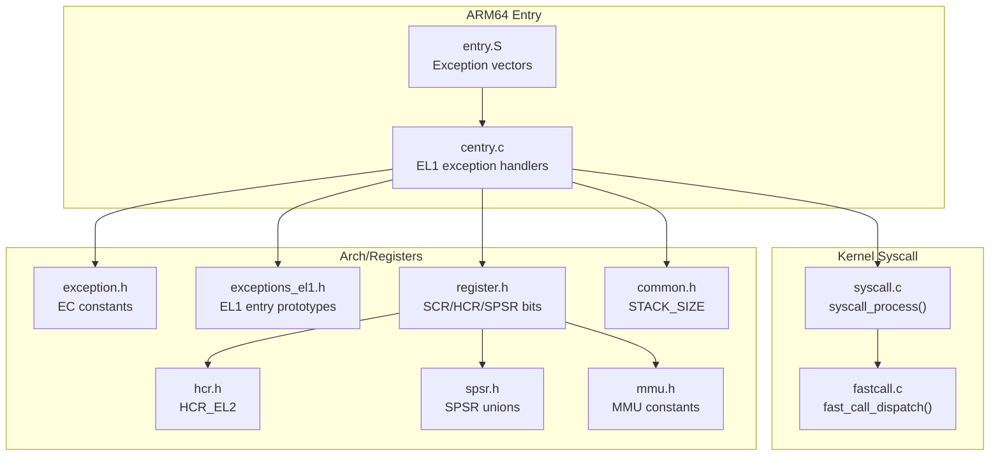
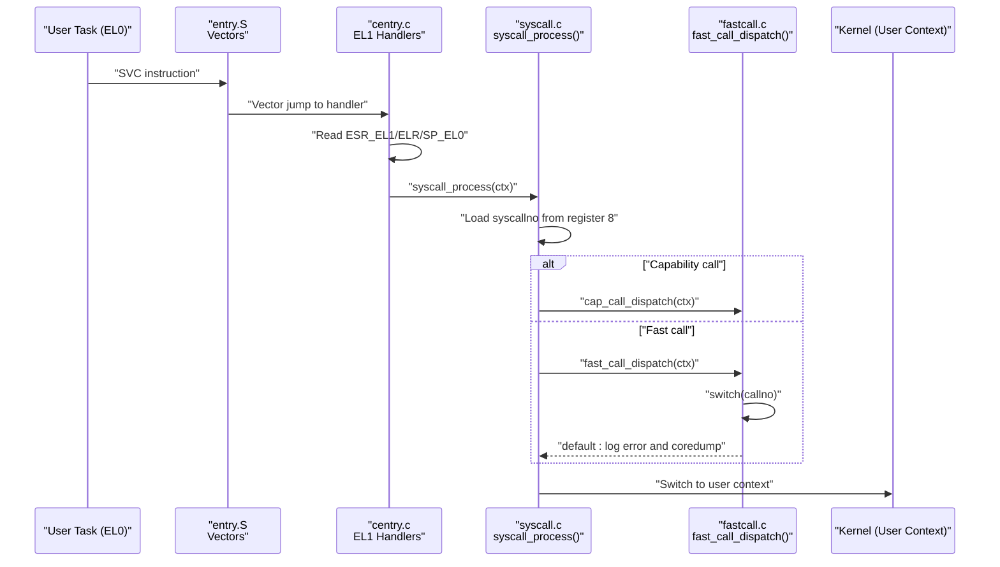
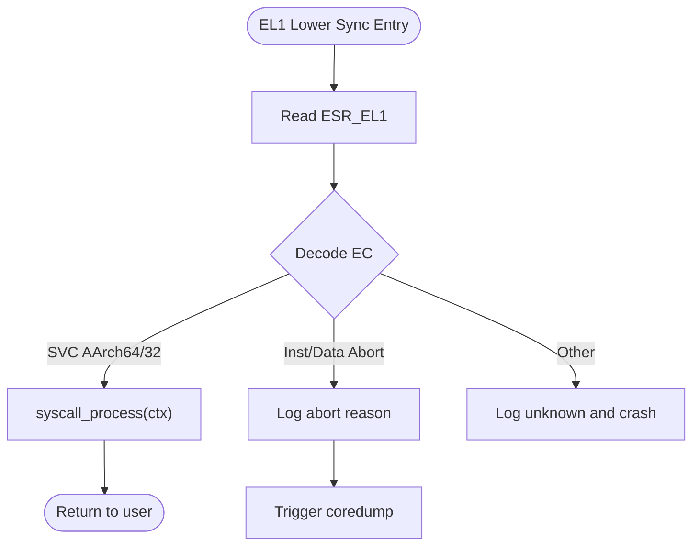
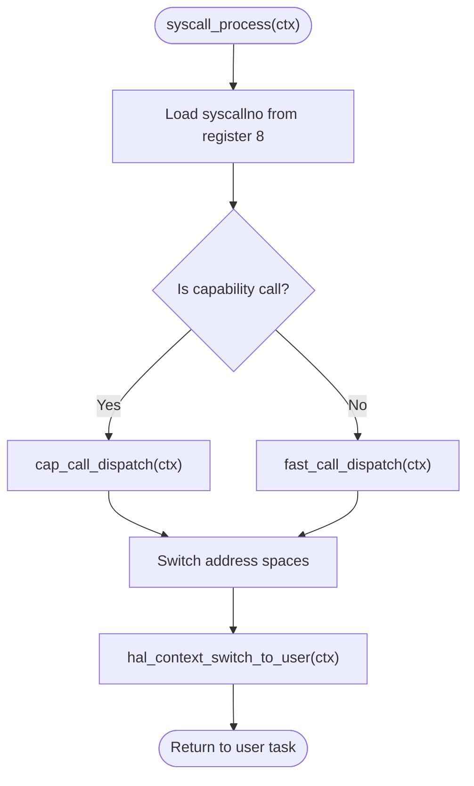
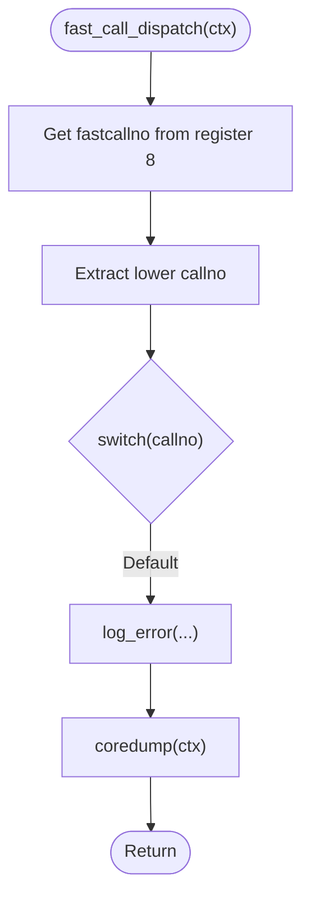
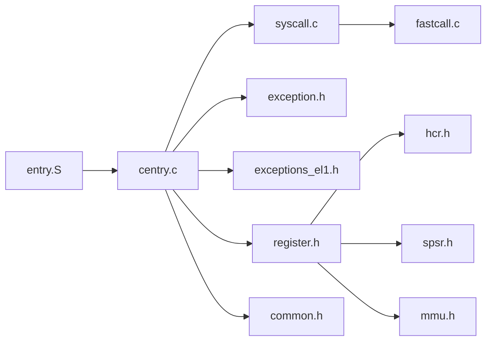

# System Call APIs

<cite>
**Referenced Files in This Document**
- [syscall.c](file://kernel/syscall/syscall.c)
- [fastcall.c](file://kernel/syscall/fastcall.c)
- [entry.S](file://kernel/arch/arm64/entry/entry.S)
- [centry.c](file://kernel/arch/arm64/entry/centry.c)
- [exception.h](file://kernel/include/arch/arm64/exception.h)
- [exceptions_el1.h](file://kernel/include/arch/arm64/exceptions_el1.h)
- [register.h](file://kernel/include/arch/arm64/register.h)
- [hcr.h](file://kernel/include/arch/arm64/registers/hcr.h)
- [spsr.h](file://kernel/include/arch/arm64/registers/spsr.h)
- [mmu.h](file://kernel/include/arch/arm64/mmu.h)
- [common.h](file://kernel/include/arch/arm64/common.h)
- [syscall.h](file://kernel/include/syscall.h)
</cite>

## Table of Contents
1. [Introduction](#introduction)
2. [Project Structure](#project-structure)
3. [Core Components](#core-components)
4. [Architecture Overview](#architecture-overview)
5. [Detailed Component Analysis](#detailed-component-analysis)
6. [Dependency Analysis](#dependency-analysis)
7. [Performance Considerations](#performance-considerations)
8. [Troubleshooting Guide](#troubleshooting-guide)
9. [Conclusion](#conclusion)

## Introduction
This document describes the user-kernel interface for system calls in the TranquilOS kernel on ARM64. It explains how system calls are invoked, dispatched, and handled, including parameter passing conventions, fast call mechanisms, and the dispatch tables used. It also covers security, validation, and optimization techniques relevant to the current implementation.

## Project Structure
The system call interface spans assembly entry points, C dispatchers, and exception handling. The key files are:
- Assembly entry and exception vectors: [entry.S](file://kernel/arch/arm64/entry/entry.S), [centry.c](file://kernel/arch/arm64/entry/centry.c)
- System call dispatcher: [syscall.c](file://kernel/syscall/syscall.c)
- Fast call dispatcher: [fastcall.c](file://kernel/syscall/fastcall.c)
- ARM64 exception and register definitions: [exception.h](file://kernel/include/arch/arm64/exception.h), [exceptions_el1.h](file://kernel/include/arch/arm64/exceptions_el1.h), [register.h](file://kernel/include/arch/arm64/register.h), [hcr.h](file://kernel/include/arch/arm64/registers/hcr.h), [spsr.h](file://kernel/include/arch/arm64/registers/spsr.h), [mmu.h](file://kernel/include/arch/arm64/mmu.h), [common.h](file://kernel/include/arch/arm64/common.h)
- Kernel syscall header: [syscall.h](file://kernel/include/syscall.h)

**Diagram sources**
- [entry.S](file://kernel/arch/arm64/entry/entry.S#L65-L108)
- [centry.c](file://kernel/arch/arm64/entry/centry.c#L113-L163)
- [syscall.c](file://kernel/syscall/syscall.c#L8-L20)
- [fastcall.c](file://kernel/syscall/fastcall.c#L6-L18)
- [exception.h](file://kernel/include/arch/arm64/exception.h#L4-L38)
- [exceptions_el1.h](file://kernel/include/arch/arm64/exceptions_el1.h#L4-L24)
- [register.h](file://kernel/include/arch/arm64/register.h#L11-L49)
- [hcr.h](file://kernel/include/arch/arm64/registers/hcr.h#L6-L72)
- [spsr.h](file://kernel/include/arch/arm64/registers/spsr.h#L6-L104)
- [mmu.h](file://kernel/include/arch/arm64/mmu.h#L7-L68)
- [common.h](file://kernel/include/arch/arm64/common.h#L4-L6)

**Section sources**
- [entry.S](file://kernel/arch/arm64/entry/entry.S#L65-L108)
- [centry.c](file://kernel/arch/arm64/entry/centry.c#L113-L163)
- [syscall.c](file://kernel/syscall/syscall.c#L8-L20)
- [fastcall.c](file://kernel/syscall/fastcall.c#L6-L18)
- [exception.h](file://kernel/include/arch/arm64/exception.h#L4-L38)
- [exceptions_el1.h](file://kernel/include/arch/arm64/exceptions_el1.h#L4-L24)
- [register.h](file://kernel/include/arch/arm64/register.h#L11-L49)
- [hcr.h](file://kernel/include/arch/arm64/registers/hcr.h#L6-L72)
- [spsr.h](file://kernel/include/arch/arm64/registers/spsr.h#L6-L104)
- [mmu.h](file://kernel/include/arch/arm64/mmu.h#L7-L68)
- [common.h](file://kernel/include/arch/arm64/common.h#L4-L6)
- [syscall.h](file://kernel/include/syscall.h#L1-L7)

## Core Components
- System call entry and dispatch
  - The kernel recognizes system calls via SVC exceptions from EL0/EL1 and routes them to the dispatcher.
  - The dispatcher reads the system call number from the appropriate register and branches to either capability-based calls or fast calls.
- Parameter passing conventions
  - Parameters are passed in registers according to the ARM64 AAPCS (argument registers x0-x5 for the first six integer/pointer args).
  - The system call number itself is accessed from the designated register in the dispatcher.
- Fast call mechanism
  - A dedicated fast call path is used for frequently executed calls. The current fast call dispatcher is a placeholder that logs and triggers a crash for unmatched calls.
- Dispatch tables
  - The fast call dispatcher uses a switch on the lower bits of the call number to select a handler. The current implementation does not define any fast call entries.

Key implementation references:
- System call dispatch entry: [syscall.c](file://kernel/syscall/syscall.c#L8-L20)
- Fast call dispatch: [fastcall.c](file://kernel/syscall/fastcall.c#L6-L18)
- SVC exception handling and dispatch trigger: [centry.c](file://kernel/arch/arm64/entry/centry.c#L147-L151)

Security and validation:
- On unknown fast calls, the kernel logs an error and triggers a crash dump to prevent undefined behavior.
- Instruction/Data aborts are logged with detailed reasons and lead to crash dumps.

**Section sources**
- [syscall.c](file://kernel/syscall/syscall.c#L8-L20)
- [fastcall.c](file://kernel/syscall/fastcall.c#L6-L18)
- [centry.c](file://kernel/arch/arm64/entry/centry.c#L147-L151)
- [exception.h](file://kernel/include/arch/arm64/exception.h#L39-L111)

## Architecture Overview
The system call flow begins in assembly, transitions through C handlers, and finally reaches the dispatcher. The following diagram maps the actual code paths.

**Diagram sources**
- [entry.S](file://kernel/arch/arm64/entry/entry.S#L65-L108)
- [centry.c](file://kernel/arch/arm64/entry/centry.c#L147-L151)
- [syscall.c](file://kernel/syscall/syscall.c#L8-L20)
- [fastcall.c](file://kernel/syscall/fastcall.c#L6-L18)

## Detailed Component Analysis

### System Call Entry and Exception Handling
- Exception vectors and entry macros save callee-saved registers and branch to C handlers.
- EL1 lower exception handlers decode the exception cause and handle SVC specially by invoking the syscall dispatcher.
- Instruction/Data aborts are decoded using fault status codes and logged; unknown causes trigger crash dumps.

**Diagram sources**
- [entry.S](file://kernel/arch/arm64/entry/entry.S#L65-L108)
- [centry.c](file://kernel/arch/arm64/entry/centry.c#L113-L163)
- [exception.h](file://kernel/include/arch/arm64/exception.h#L3-L38)

**Section sources**
- [entry.S](file://kernel/arch/arm64/entry/entry.S#L65-L108)
- [centry.c](file://kernel/arch/arm64/entry/centry.c#L113-L163)
- [exception.h](file://kernel/include/arch/arm64/exception.h#L3-L38)

### System Call Dispatcher
- Reads the system call number from the designated register and determines whether it is a capability call or a fast call.
- Switches to the target address space and performs a context switch to user mode.

**Diagram sources**
- [syscall.c](file://kernel/syscall/syscall.c#L8-L20)

**Section sources**
- [syscall.c](file://kernel/syscall/syscall.c#L8-L20)

### Fast Call Dispatcher
- Extracts the fast call number from the lower bits of the system call number.
- Current implementation only handles unknown calls by logging and triggering a crash dump.

**Diagram sources**
- [fastcall.c](file://kernel/syscall/fastcall.c#L6-L18)

**Section sources**
- [fastcall.c](file://kernel/syscall/fastcall.c#L6-L18)

### Parameter Passing Conventions
- ARM64 AAPCS argument registers: x0–x5 carry the first six arguments.
- The system call number is retrieved from the register used to pass the SVC immediate in the AAPCS-compliant ABI.
- The current dispatcher reads the system call number from the designated register and branches accordingly.

References:
- Dispatcher reads syscallno from register 8: [syscall.c](file://kernel/syscall/syscall.c#L9)
- Fast call dispatcher reads fastcallno from register 8: [fastcall.c](file://kernel/syscall/fastcall.c#L7)

**Section sources**
- [syscall.c](file://kernel/syscall/syscall.c#L9)
- [fastcall.c](file://kernel/syscall/fastcall.c#L7)

### Security, Validation, and Error Handling
- Capability vs fast call detection ensures that capability-based calls are routed to the capability subsystem, while others fall back to fast calls.
- Unknown fast calls are logged and result in a crash dump to prevent undefined behavior.
- Instruction/Data aborts are decoded and logged with detailed reasons; the kernel triggers a crash dump to preserve system integrity.

References:
- Capability vs fast call branching: [syscall.c](file://kernel/syscall/syscall.c#L10-L16)
- Unknown fast call handling: [fastcall.c](file://kernel/syscall/fastcall.c#L11-L14)
- Abort decoding and logging: [centry.c](file://kernel/arch/arm64/entry/centry.c#L53-L76)

**Section sources**
- [syscall.c](file://kernel/syscall/syscall.c#L10-L16)
- [fastcall.c](file://kernel/syscall/fastcall.c#L11-L14)
- [centry.c](file://kernel/arch/arm64/entry/centry.c#L53-L76)

### Performance Considerations
- Stack sizing: Per-CPU kernel stacks are sized to accommodate exception handling and system call processing.
- Minimal register save/restore in assembly vectors reduces overhead.
- Fast call path avoids unnecessary overhead for frequent calls when implemented.

References:
- Per-CPU stack size definition: [common.h](file://kernel/include/arch/arm64/common.h#L4)
- Register save macro in vectors: [entry.S](file://kernel/arch/arm64/entry/entry.S#L6-L23)

**Section sources**
- [common.h](file://kernel/include/arch/arm64/common.h#L4)
- [entry.S](file://kernel/arch/arm64/entry/entry.S#L6-L23)

## Dependency Analysis
The following diagram shows the primary dependencies among the system call components.

**Diagram sources**
- [entry.S](file://kernel/arch/arm64/entry/entry.S#L65-L108)
- [centry.c](file://kernel/arch/arm64/entry/centry.c#L113-L163)
- [syscall.c](file://kernel/syscall/syscall.c#L8-L20)
- [fastcall.c](file://kernel/syscall/fastcall.c#L6-L18)
- [exception.h](file://kernel/include/arch/arm64/exception.h#L4-L38)
- [exceptions_el1.h](file://kernel/include/arch/arm64/exceptions_el1.h#L4-L24)
- [register.h](file://kernel/include/arch/arm64/register.h#L11-L49)
- [hcr.h](file://kernel/include/arch/arm64/registers/hcr.h#L6-L72)
- [spsr.h](file://kernel/include/arch/arm64/registers/spsr.h#L6-L104)
- [mmu.h](file://kernel/include/arch/arm64/mmu.h#L7-L68)
- [common.h](file://kernel/include/arch/arm64/common.h#L4-L6)

**Section sources**
- [entry.S](file://kernel/arch/arm64/entry/entry.S#L65-L108)
- [centry.c](file://kernel/arch/arm64/entry/centry.c#L113-L163)
- [syscall.c](file://kernel/syscall/syscall.c#L8-L20)
- [fastcall.c](file://kernel/syscall/fastcall.c#L6-L18)
- [exception.h](file://kernel/include/arch/arm64/exception.h#L4-L38)
- [exceptions_el1.h](file://kernel/include/arch/arm64/exceptions_el1.h#L4-L24)
- [register.h](file://kernel/include/arch/arm64/register.h#L11-L49)
- [hcr.h](file://kernel/include/arch/arm64/registers/hcr.h#L6-L72)
- [spsr.h](file://kernel/include/arch/arm64/registers/spsr.h#L6-L104)
- [mmu.h](file://kernel/include/arch/arm64/mmu.h#L7-L68)
- [common.h](file://kernel/include/arch/arm64/common.h#L4-L6)

## Performance Considerations
- Keep fast call handlers minimal and avoid heavy operations in the hot path.
- Reuse per-CPU kernel stacks to reduce allocation overhead during exceptions.
- Ensure fast call dispatch tables are compact and switch-based for O(1) lookup.

[No sources needed since this section provides general guidance]

## Troubleshooting Guide
- SVC not recognized
  - Verify that the SVC exception is handled in the lower EL handler and that the dispatcher is invoked.
  - References: [centry.c](file://kernel/arch/arm64/entry/centry.c#L147-L151)
- Unknown fast call number
  - The dispatcher logs an error and triggers a crash dump. Add the missing fast call entry to the switch table.
  - References: [fastcall.c](file://kernel/syscall/fastcall.c#L11-L14)
- Instruction/Data aborts
  - Inspect the decoded fault status code and fault address; investigate memory mapping or permission issues.
  - References: [centry.c](file://kernel/arch/arm64/entry/centry.c#L53-L76), [exception.h](file://kernel/include/arch/arm64/exception.h#L39-L111)

**Section sources**
- [centry.c](file://kernel/arch/arm64/entry/centry.c#L147-L151)
- [fastcall.c](file://kernel/syscall/fastcall.c#L11-L14)
- [centry.c](file://kernel/arch/arm64/entry/centry.c#L53-L76)
- [exception.h](file://kernel/include/arch/arm64/exception.h#L39-L111)

## Conclusion
The current system call interface in TranquilOS provides a robust foundation for dispatching user requests from EL0/EL1. The SVC exception path is well-defined, and the dispatcher distinguishes between capability-based and fast calls. The fast call dispatcher currently acts as a placeholder and should be extended with concrete handlers. Security is enforced by logging and crashing on invalid inputs, and performance is aided by efficient assembly entry and per-CPU stack sizing.