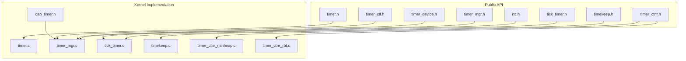
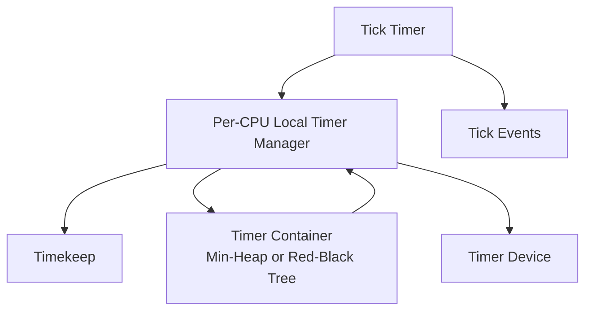
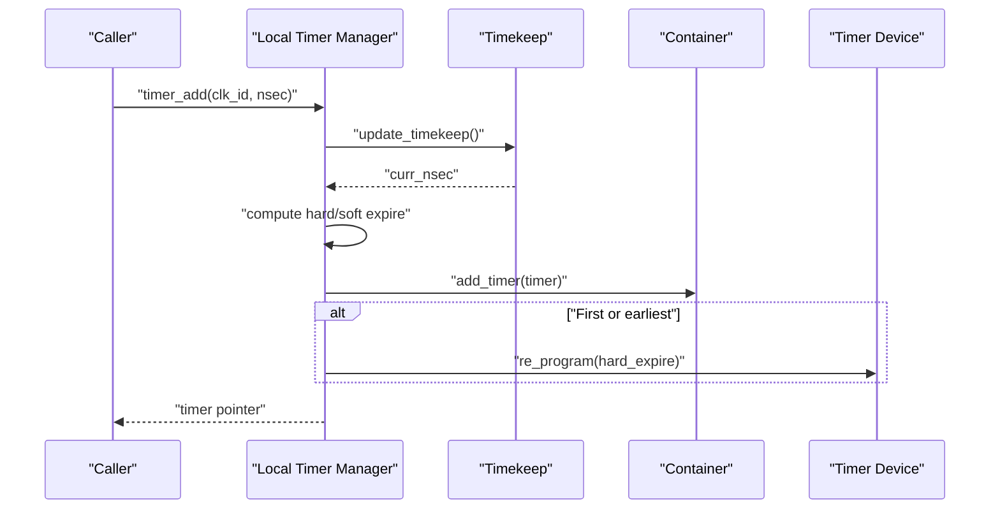
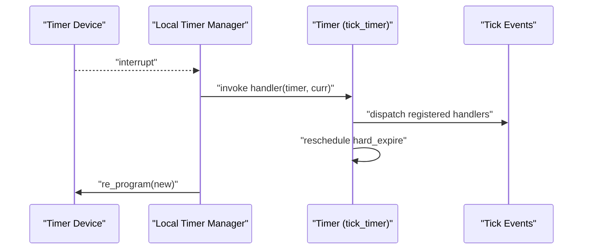
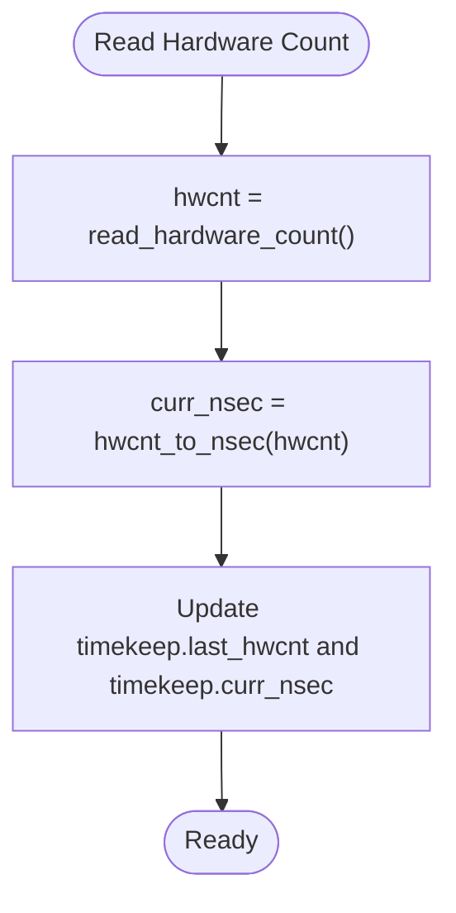
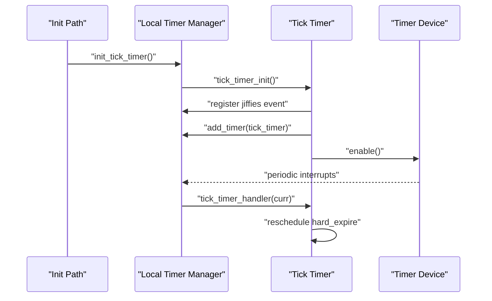
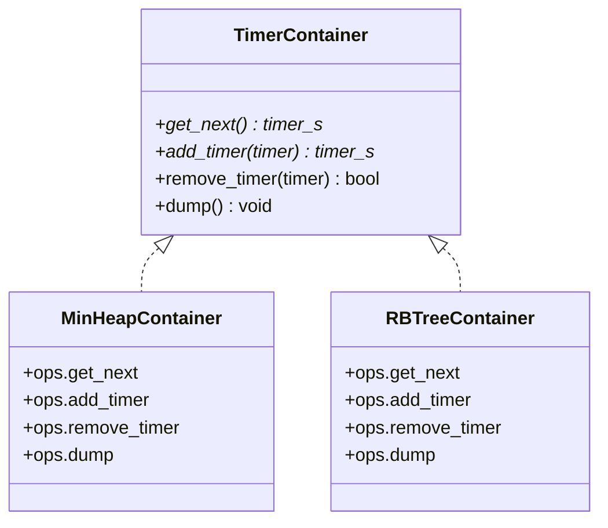
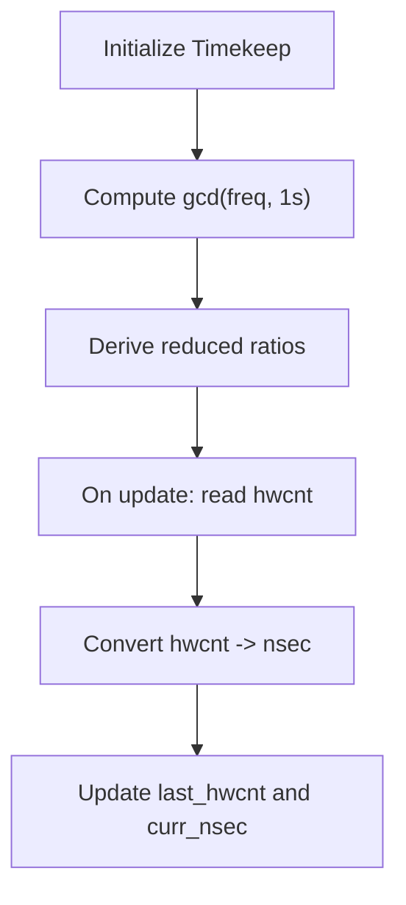
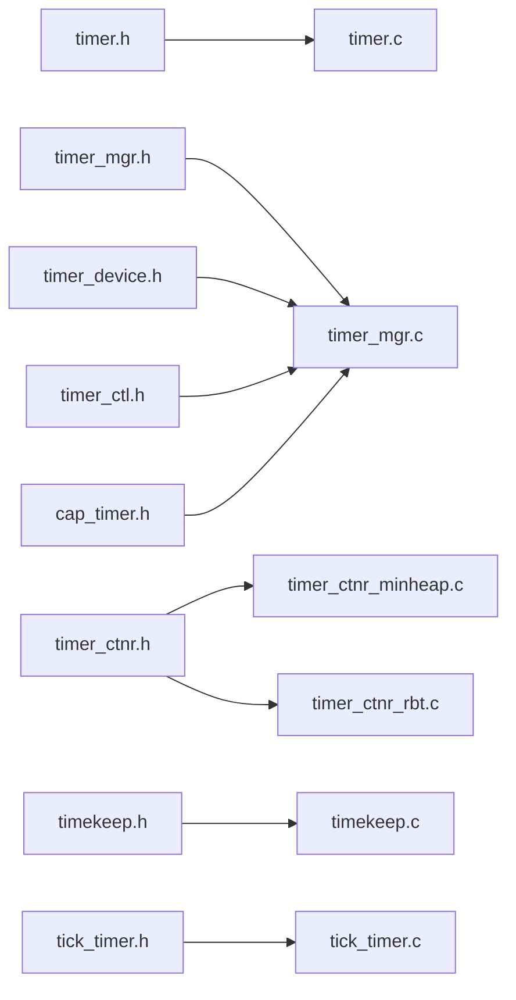

# Timer and Time APIs

<cite>
**Referenced Files in This Document**
- [timer.h](file://kernel/include/timer/timer.h)
- [timer_mgr.h](file://kernel/include/timer/timer_mgr.h)
- [tick_timer.h](file://kernel/include/timer/tick_timer.h)
- [timekeep.h](file://kernel/include/timer/timekeep.h)
- [timer_ctnr.h](file://kernel/include/timer/timer_ctnr.h)
- [timer_device.h](file://kernel/include/timer/device/timer_device.h)
- [timer_ctl.h](file://kernel/include/timer/device/timer_ctl.h)
- [rtc.h](file://kernel/include/timer/rtc.h)
- [timer.c](file://kernel/timer/timer.c)
- [timer_mgr.c](file://kernel/timer/timer_mgr.c)
- [tick_timer.c](file://kernel/timer/tick_timer.c)
- [timekeep.c](file://kernel/timer/timekeep.c)
- [timer_ctnr_minheap.c](file://kernel/timer/timer_ctnr_minheap.c)
- [timer_ctnr_rbt.c](file://kernel/timer/timer_ctnr_rbt.c)
- [cap_timer.h](file://kernel/include/capability/cap_timer.h)
</cite>

## Table of Contents
1. [Introduction](#introduction)
2. [Project Structure](#project-structure)
3. [Core Components](#core-components)
4. [Architecture Overview](#architecture-overview)
5. [Detailed Component Analysis](#detailed-component-analysis)
6. [Dependency Analysis](#dependency-analysis)
7. [Performance Considerations](#performance-considerations)
8. [Troubleshooting Guide](#troubleshooting-guide)
9. [Conclusion](#conclusion)
10. [Appendices](#appendices)

## Introduction
This document describes the timer and timekeeping subsystem of the TranquilOS kernel. It covers timer creation and management, timer callback registration, high-resolution timing interfaces, tick timer management, timer container operations, and time synchronization mechanisms. It also provides examples of periodic and one-shot timers, discusses timer precision and overflow handling, and outlines performance considerations.

## Project Structure
The timer and time subsystem is organized around several key modules:
- Core timer model and public API
- Local and global timer managers
- Tick timer and tick event dispatch
- Timekeeping with hardware frequency conversion
- Timer containers (min-heap and red-black tree)
- Timer device abstraction and registration
- Capability interface for user-mode timer operations

**Diagram sources**
- [timer.h](file://kernel/include/timer/timer.h#L1-L57)
- [timer_mgr.h](file://kernel/include/timer/timer_mgr.h#L1-L62)
- [timer_ctnr.h](file://kernel/include/timer/timer_ctnr.h#L1-L26)
- [timekeep.h](file://kernel/include/timer/timekeep.h#L1-L27)
- [tick_timer.h](file://kernel/include/timer/tick_timer.h#L1-L37)
- [timer_device.h](file://kernel/include/timer/device/timer_device.h#L1-L27)
- [timer_ctl.h](file://kernel/include/timer/device/timer_ctl.h#L1-L12)
- [rtc.h](file://kernel/include/timer/rtc.h#L1-L11)
- [timer.c](file://kernel/timer/timer.c#L1-L59)
- [timer_mgr.c](file://kernel/timer/timer_mgr.c#L1-L208)
- [tick_timer.c](file://kernel/timer/tick_timer.c#L1-L148)
- [timekeep.c](file://kernel/timer/timekeep.c#L1-L17)
- [timer_ctnr_minheap.c](file://kernel/timer/timer_ctnr_minheap.c#L1-L68)
- [timer_ctnr_rbt.c](file://kernel/timer/timer_ctnr_rbt.c#L1-L74)
- [cap_timer.h](file://kernel/include/capability/cap_timer.h#L1-L12)

**Section sources**
- [timer.h](file://kernel/include/timer/timer.h#L1-L57)
- [timer_mgr.h](file://kernel/include/timer/timer_mgr.h#L1-L62)
- [timer_ctnr.h](file://kernel/include/timer/timer_ctnr.h#L1-L26)
- [timekeep.h](file://kernel/include/timer/timekeep.h#L1-L27)
- [tick_timer.h](file://kernel/include/timer/tick_timer.h#L1-L37)
- [timer_device.h](file://kernel/include/timer/device/timer_device.h#L1-L27)
- [timer_ctl.h](file://kernel/include/timer/device/timer_ctl.h#L1-L12)
- [rtc.h](file://kernel/include/timer/rtc.h#L1-L11)

## Core Components
- Timer model: A timer holds absolute expiration timestamps (hard and soft), a clock identity, flags, optional wait context, and a callback handler. Creation and addition APIs initialize and enqueue timers into per-clock containers.
- Timer manager: Provides per-CPU local timer manager instances, container registration, and reprogramming of the underlying timer device.
- Tick timer: A periodic timer that drives tick events and updates timekeeping at a fixed rate.
- Timekeeping: Converts between hardware counts and nanoseconds using GCD-based arithmetic.
- Containers: Min-heap and red-black tree containers provide ordered insertion and retrieval of timers.
- Device abstraction: A uniform interface for hardware timer devices, enabling reprogramming and frequency queries.
- Capability interface: Exposes timer operations to user-mode via capability dispatch.

Key API entry points:
- Timer lifecycle: initialization and addition
- Manager operations: per-CPU manager access, container registration, reprogramming
- Tick operations: registration of tick events, jiffies access
- Timekeeping: conversions and initialization
- Device operations: registration and reprogramming

**Section sources**
- [timer.h](file://kernel/include/timer/timer.h#L23-L56)
- [timer.c](file://kernel/timer/timer.c#L5-L59)
- [timer_mgr.h](file://kernel/include/timer/timer_mgr.h#L22-L55)
- [timer_mgr.c](file://kernel/timer/timer_mgr.c#L164-L194)
- [tick_timer.h](file://kernel/include/timer/tick_timer.h#L15-L36)
- [tick_timer.c](file://kernel/timer/tick_timer.c#L109-L147)
- [timekeep.h](file://kernel/include/timer/timekeep.h#L9-L23)
- [timekeep.c](file://kernel/timer/timekeep.c#L13-L17)
- [timer_ctnr.h](file://kernel/include/timer/timer_ctnr.h#L8-L23)
- [timer_device.h](file://kernel/include/timer/device/timer_device.h#L9-L24)
- [cap_timer.h](file://kernel/include/capability/cap_timer.h#L7-L12)

## Architecture Overview
The timer subsystem integrates high-resolution timekeeping with a flexible containerized timer queue and a periodic tick mechanism. The local timer manager coordinates per-CPU containers and the underlying timer device, while the tick timer ensures periodic updates and event dispatch.

**Diagram sources**
- [timer_mgr.c](file://kernel/timer/timer_mgr.c#L164-L194)
- [tick_timer.c](file://kernel/timer/tick_timer.c#L109-L147)
- [timer_ctnr_minheap.c](file://kernel/timer/timer_ctnr_minheap.c#L54-L68)
- [timer_ctnr_rbt.c](file://kernel/timer/timer_ctnr_rbt.c#L60-L74)
- [timekeep.c](file://kernel/timer/timekeep.c#L13-L17)
- [timer_device.h](file://kernel/include/timer/device/timer_device.h#L9-L24)

## Detailed Component Analysis

### Timer Model and Lifecycle
- Initialization: Allocates and initializes a timer’s metadata, including expiration fields, clock ID, and handler.
- Addition: Computes absolute expiration from current time, assigns clock, and enqueues into the appropriate container. If the new timer becomes the earliest, reprograms the hardware device.

**Diagram sources**
- [timer.c](file://kernel/timer/timer.c#L28-L59)
- [timer_mgr.c](file://kernel/timer/timer_mgr.c#L4,62-L71)
- [timekeep.c](file://kernel/timer/timekeep.c#L13-L17)
- [timer_device.h](file://kernel/include/timer/device/timer_device.h#L14-L15)

**Section sources**
- [timer.h](file://kernel/include/timer/timer.h#L23-L56)
- [timer.c](file://kernel/timer/timer.c#L5-L59)

### Timer Callback Registration
- Each timer carries a handler function pointer invoked when the timer expires.
- The tick timer handler demonstrates a recurring timer pattern by rescheduling itself after processing tick events.

**Diagram sources**
- [tick_timer.c](file://kernel/timer/tick_timer.c#L77-L107)
- [timer_device.h](file://kernel/include/timer/device/timer_device.h#L9-L18)

**Section sources**
- [timer.h](file://kernel/include/timer/timer.h#L29-L49)
- [tick_timer.c](file://kernel/timer/tick_timer.c#L77-L107)

### High-Resolution Timing Interfaces
- Time units are represented in nanoseconds for precise comparisons.
- Conversion between hardware counts and nanoseconds uses GCD reduction to minimize rounding errors.
- Current time is read from the hardware device and cached in the timekeep structure.

**Diagram sources**
- [timekeep.c](file://kernel/timer/timekeep.c#L3-L11)
- [timer_mgr.c](file://kernel/timer/timer_mgr.c#L97-L113)

**Section sources**
- [timer.h](file://kernel/include/timer/timer.h#L23-L25)
- [timekeep.h](file://kernel/include/timer/timekeep.h#L6-L23)
- [timekeep.c](file://kernel/timer/timekeep.c#L13-L17)
- [timer_mgr.c](file://kernel/timer/timer_mgr.c#L97-L113)

### Tick Timer Management
- Tick timer runs on a fixed frequency (jiffies) and triggers a chain of tick events.
- It registers a jiffies event and reschedules itself to maintain periodicity.
- Per-CPU initialization sets up the tick timer and enables the underlying device.

**Diagram sources**
- [tick_timer.c](file://kernel/timer/tick_timer.c#L109-L147)
- [tick_timer.h](file://kernel/include/timer/tick_timer.h#L23-L36)
- [timer_device.h](file://kernel/include/timer/device/timer_device.h#L12-L17)

**Section sources**
- [tick_timer.h](file://kernel/include/timer/tick_timer.h#L8-L36)
- [tick_timer.c](file://kernel/timer/tick_timer.c#L23-L107)

### Timer Container Operations
- Min-heap container: O(log n) insertion and O(log n) removal; supports retrieving the earliest timer.
- Red-black tree container: O(log n) insertion and retrieval; maintains sorted order by expiration.
- Both expose the same container interface for adding, removing, and dumping timers.

**Diagram sources**
- [timer_ctnr.h](file://kernel/include/timer/timer_ctnr.h#L8-L23)
- [timer_ctnr_minheap.c](file://kernel/timer/timer_ctnr_minheap.c#L54-L68)
- [timer_ctnr_rbt.c](file://kernel/timer/timer_ctnr_rbt.c#L60-L74)

**Section sources**
- [timer_ctnr.h](file://kernel/include/timer/timer_ctnr.h#L1-L26)
- [timer_ctnr_minheap.c](file://kernel/timer/timer_ctnr_minheap.c#L1-L68)
- [timer_ctnr_rbt.c](file://kernel/timer/timer_ctnr_rbt.c#L1-L74)

### Time Synchronization Mechanisms
- Timekeeping initialization computes GCD of hardware frequency and nanoseconds-per-second to derive reduced ratios for accurate conversions.
- On each tick or explicit update, the manager reads hardware count and updates the current nanosecond time.

**Diagram sources**
- [timer_mgr.c](file://kernel/timer/timer_mgr.c#L115-L138)
- [timekeep.c](file://kernel/timer/timekeep.c#L3-L11)

**Section sources**
- [timer_mgr.c](file://kernel/timer/timer_mgr.c#L115-L138)
- [timekeep.c](file://kernel/timer/timekeep.c#L13-L17)

### Examples and Usage Patterns

- One-shot timer
  - Initialize a timer with a handler.
  - Add the timer for a relative delay from current time.
  - The manager schedules it in the appropriate container and reprograms the device if it is now earliest.

  Reference paths:
  - [timer.c](file://kernel/timer/timer.c#L28-L59)
  - [timer_mgr.c](file://kernel/timer/timer_mgr.c#L50-L71)

- Periodic timer (tick-based)
  - Register a tick event handler with the tick timer.
  - The tick timer handler reschedules itself after processing events.

  Reference paths:
  - [tick_timer.c](file://kernel/timer/tick_timer.c#L56-L107)

- Timer-based scheduling
  - Use the manager to add timers to the monotonic clock container.
  - The manager selects the earliest timer and programs the device accordingly.

  Reference paths:
  - [timer_mgr.c](file://kernel/timer/timer_mgr.c#L164-L194)
  - [timer_ctnr_rbt.c](file://kernel/timer/timer_ctnr_rbt.c#L60-L74)

**Section sources**
- [timer.c](file://kernel/timer/timer.c#L28-L59)
- [tick_timer.c](file://kernel/timer/tick_timer.c#L56-L107)
- [timer_mgr.c](file://kernel/timer/timer_mgr.c#L50-L71)

## Dependency Analysis
The timer subsystem exhibits layered dependencies:
- Public headers define the model and interfaces.
- Implementation files depend on containers, timekeeping, and device abstractions.
- The manager orchestrates containers and devices.
- Tick timer depends on the manager and device to enable periodic interrupts.

**Diagram sources**
- [timer.h](file://kernel/include/timer/timer.h#L1-L57)
- [timer_mgr.h](file://kernel/include/timer/timer_mgr.h#L1-L62)
- [timer_ctnr.h](file://kernel/include/timer/timer_ctnr.h#L1-L26)
- [timekeep.h](file://kernel/include/timer/timekeep.h#L1-L27)
- [tick_timer.h](file://kernel/include/timer/tick_timer.h#L1-L37)
- [timer_device.h](file://kernel/include/timer/device/timer_device.h#L1-L27)
- [timer_ctl.h](file://kernel/include/timer/device/timer_ctl.h#L1-L12)
- [cap_timer.h](file://kernel/include/capability/cap_timer.h#L1-L12)
- [timer.c](file://kernel/timer/timer.c#L1-L59)
- [timer_mgr.c](file://kernel/timer/timer_mgr.c#L1-L208)
- [tick_timer.c](file://kernel/timer/tick_timer.c#L1-L148)
- [timekeep.c](file://kernel/timer/timekeep.c#L1-L17)
- [timer_ctnr_minheap.c](file://kernel/timer/timer_ctnr_minheap.c#L1-L68)
- [timer_ctnr_rbt.c](file://kernel/timer/timer_ctnr_rbt.c#L1-L74)

**Section sources**
- [timer_mgr.c](file://kernel/timer/timer_mgr.c#L1-L208)
- [timer_device.h](file://kernel/include/timer/device/timer_device.h#L1-L27)

## Performance Considerations
- Container choice: Red-black tree and min-heap both offer logarithmic-time operations; selection may depend on memory layout and iteration needs.
- Reprogramming cost: The manager minimizes device reprogramming by only reprogramming when a new earliest timer is inserted or when the current earliest changes.
- Precision: GCD-based conversions reduce rounding drift; however, conversions remain approximate due to integer arithmetic.
- Tick frequency: The jiffies rate determines the granularity of periodic events; higher rates increase overhead.

[No sources needed since this section provides general guidance]

## Troubleshooting Guide
- Timer initialization failures: Ensure the timer pointer and handler are non-null during initialization.
- Adding timers fails: Verify the timer manager and local manager are initialized and the container exists for the chosen clock.
- No timer device: Re-program attempts require a valid timer device; check device registration and initialization.
- Tick events missing: Confirm tick events are registered and the tick timer is enabled; verify the device interrupt path.

**Section sources**
- [timer.c](file://kernel/timer/timer.c#L5-L26)
- [timer_mgr.c](file://kernel/timer/timer_mgr.c#L35-L48,84-L95)
- [tick_timer.c](file://kernel/timer/tick_timer.c#L109-L147)

## Conclusion
TranquilOS provides a robust, modular timer and timekeeping system. Timers are created with high-resolution precision, scheduled via flexible containers, and driven by a periodic tick mechanism. The design emphasizes correctness and performance through careful time conversions, minimal reprogramming, and per-CPU coordination.

[No sources needed since this section summarizes without analyzing specific files]

## Appendices

### API Definitions and Behaviors
- Timer creation and addition
  - Initialize a timer with a name and handler.
  - Add a timer with a relative delay; the manager computes absolute expiration and enqueues it.

  Reference paths:
  - [timer.c](file://kernel/timer/timer.c#L5-L26)
  - [timer.c](file://kernel/timer/timer.c#L28-L59)

- Tick timer operations
  - Register tick events and access jiffies.
  - Initialize the tick timer and enable the underlying device.

  Reference paths:
  - [tick_timer.c](file://kernel/timer/tick_timer.c#L48-L76)
  - [tick_timer.c](file://kernel/timer/tick_timer.c#L109-L147)

- Timekeeping conversions
  - Initialize timekeep operations and convert between hardware counts and nanoseconds.

  Reference paths:
  - [timekeep.c](file://kernel/timer/timekeep.c#L13-L17)
  - [timer_mgr.c](file://kernel/timer/timer_mgr.c#L97-L113)

- Capability interface
  - Timer capability rights and dispatch entry for user-mode operations.

  Reference paths:
  - [cap_timer.h](file://kernel/include/capability/cap_timer.h#L7-L12)

**Section sources**
- [timer.c](file://kernel/timer/timer.c#L5-L59)
- [tick_timer.c](file://kernel/timer/tick_timer.c#L48-L147)
- [timekeep.c](file://kernel/timer/timekeep.c#L13-L17)
- [cap_timer.h](file://kernel/include/capability/cap_timer.h#L7-L12)