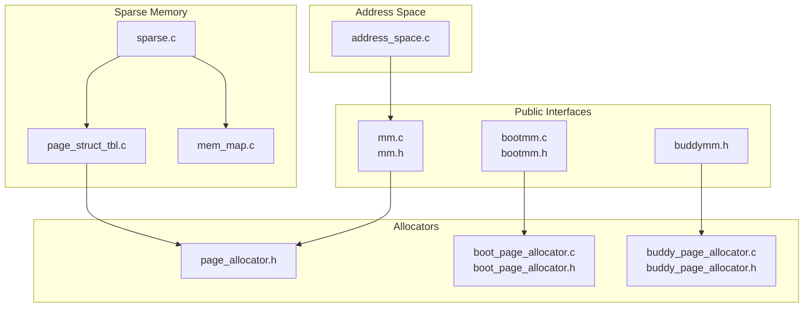
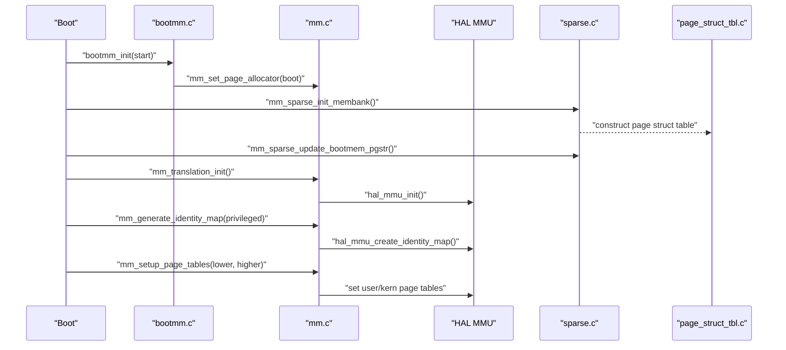
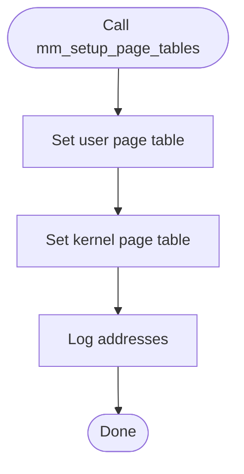
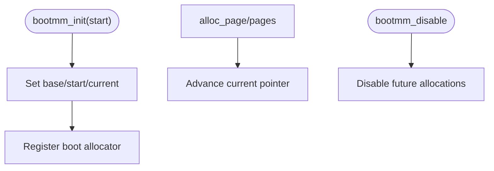
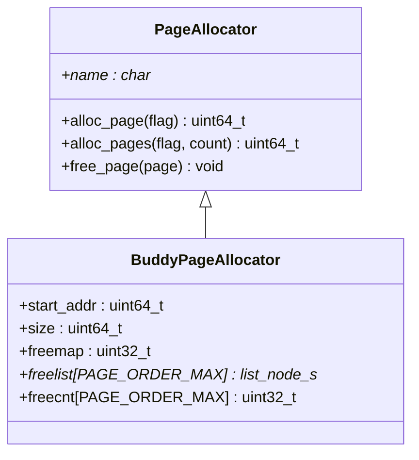
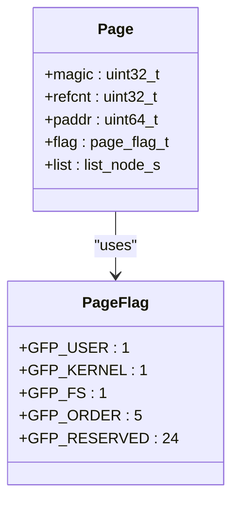
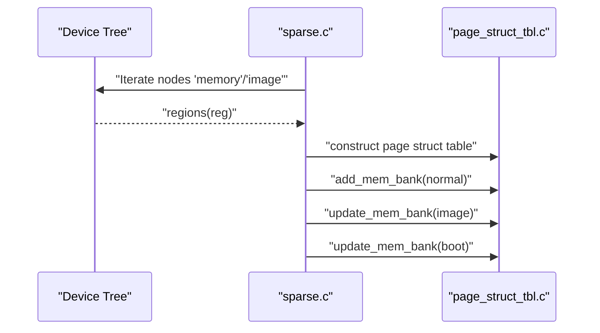
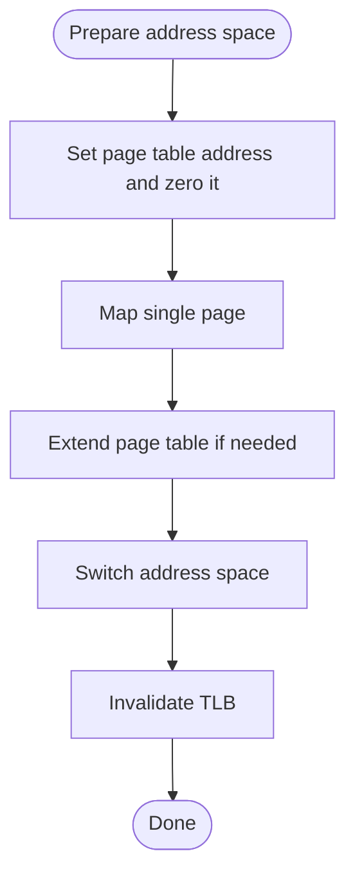
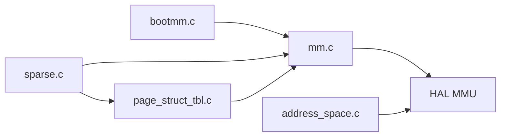

# Memory Management APIs

<cite>
**Referenced Files in This Document**
- [mm.h](file://kernel/include/mm/mm.h)
- [bootmm.h](file://kernel/include/mm/bootmm.h)
- [buddymm.h](file://kernel/include/mm/buddymm.h)
- [page_allocator.h](file://kernel/include/mm/page_allocator.h)
- [boot_page_allocator.h](file://kernel/include/mm/impl/boot_page_allocator.h)
- [buddy_page_allocator.h](file://kernel/include/mm/impl/buddy_page_allocator.h)
- [page.h](file://kernel/include/mm/page.h)
- [mm.c](file://kernel/mm/mm.c)
- [bootmm.c](file://kernel/mm/bootmm.c)
- [sparse.c](file://kernel/mm/sparse.c)
- [address_space.c](file://kernel/mm/address_space.c)
- [page_struct_tbl.c](file://kernel/mm/page_struct_tbl.c)
- [mem_map.c](file://kernel/mm/mem_map.c)
- [boot_page_allocator.c](file://kernel/mm/impl/boot_page_allocator.c)
- [buddy_page_allocator.c](file://kernel/mm/impl/buddy_page_allocator.c)
</cite>

## Table of Contents
1. [Introduction](#introduction)
2. [Project Structure](#project-structure)
3. [Core Components](#core-components)
4. [Architecture Overview](#architecture-overview)
5. [Detailed Component Analysis](#detailed-component-analysis)
6. [Dependency Analysis](#dependency-analysis)
7. [Performance Considerations](#performance-considerations)
8. [Troubleshooting Guide](#troubleshooting-guide)
9. [Conclusion](#conclusion)

## Introduction
This document describes the memory management APIs in TranquilOS, focusing on heap allocation, page management, and virtual memory mapping. It covers the boot-time memory allocator, the placeholder buddy allocator, sparse memory initialization, and address space management. It also outlines strategies for memory allocation, address space management, and protection mechanisms, along with debugging, fragmentation prevention, and performance optimization techniques.

## Project Structure
The memory management subsystem is organized around:
- Public interfaces for MMU control and allocator selection
- Boot-time memory allocator
- Sparse memory bank discovery and page structure table construction
- Address space preparation and mapping helpers
- Page structure table and page metadata
- Device Tree-based memory region enumeration

**Diagram sources**
- [mm.c](file://kernel/mm/mm.c#L1-L45)
- [bootmm.c](file://kernel/mm/bootmm.c#L1-L24)
- [sparse.c](file://kernel/mm/sparse.c#L1-L104)
- [page_struct_tbl.c](file://kernel/mm/page_struct_tbl.c#L1-L142)
- [address_space.c](file://kernel/mm/address_space.c#L1-L105)
- [page_allocator.h](file://kernel/include/mm/page_allocator.h#L1-L23)
- [boot_page_allocator.h](file://kernel/include/mm/impl/boot_page_allocator.h#L1-L17)
- [buddy_page_allocator.h](file://kernel/include/mm/impl/buddy_page_allocator.h#L1-L40)

**Section sources**
- [mm.c](file://kernel/mm/mm.c#L1-L45)
- [bootmm.c](file://kernel/mm/bootmm.c#L1-L24)
- [sparse.c](file://kernel/mm/sparse.c#L1-L104)
- [page_struct_tbl.c](file://kernel/mm/page_struct_tbl.c#L1-L142)
- [address_space.c](file://kernel/mm/address_space.c#L1-L105)
- [page_allocator.h](file://kernel/include/mm/page_allocator.h#L1-L23)
- [boot_page_allocator.h](file://kernel/include/mm/impl/boot_page_allocator.h#L1-L17)
- [buddy_page_allocator.h](file://kernel/include/mm/impl/buddy_page_allocator.h#L1-L40)

## Core Components
- MMU control and identity mapping
  - Enable/disable translation, initialize MMU, generate identity map, and set page tables for kernel and user spaces.
  - See [mm.c](file://kernel/mm/mm.c#L21-L45) and [mm.h](file://kernel/include/mm/mm.h#L8-L22).
- Boot memory manager
  - Initializes a simple bump-pointer allocator from a given start address and disables it after handover.
  - See [bootmm.c](file://kernel/mm/bootmm.c#L13-L24) and [bootmm.h](file://kernel/include/mm/bootmm.h#L7-L11).
- Buddy allocator placeholder
  - Exposes interface for a buddy allocator; allocation/free stubs are present but not implemented yet.
  - See [buddy_page_allocator.c](file://kernel/mm/impl/buddy_page_allocator.c#L6-L19) and [buddymm.h](file://kernel/include/mm/buddymm.h#L8-L10).
- Page allocator abstraction
  - Generic page allocator interface with alloc/free callbacks and a name.
  - See [page_allocator.h](file://kernel/include/mm/page_allocator.h#L12-L21).
- Page metadata and flags
  - Page structure with magic, reference count, physical address, and flags; page sizes are fixed at 4 KiB.
  - See [page.h](file://kernel/include/mm/page.h#L8-L31).
- Sparse memory and page structure table
  - Discovers memory banks via Device Tree, builds a radix-like page structure table, and updates regions for boot and image memory.
  - See [sparse.c](file://kernel/mm/sparse.c#L52-L104) and [page_struct_tbl.c](file://kernel/mm/page_struct_tbl.c#L125-L142).
- Address space management
  - Prepares page tables, switches between address spaces, and maps/unmaps pages.
  - See [address_space.c](file://kernel/mm/address_space.c#L51-L105).

**Section sources**
- [mm.c](file://kernel/mm/mm.c#L21-L45)
- [bootmm.c](file://kernel/mm/bootmm.c#L13-L24)
- [buddy_page_allocator.c](file://kernel/mm/impl/buddy_page_allocator.c#L6-L19)
- [page_allocator.h](file://kernel/include/mm/page_allocator.h#L12-L21)
- [page.h](file://kernel/include/mm/page.h#L8-L31)
- [sparse.c](file://kernel/mm/sparse.c#L52-L104)
- [page_struct_tbl.c](file://kernel/mm/page_struct_tbl.c#L125-L142)
- [address_space.c](file://kernel/mm/address_space.c#L51-L105)

## Architecture Overview
The memory management stack integrates boot-time allocation, sparse memory discovery, page structure tracking, and virtual memory mapping.

**Diagram sources**
- [bootmm.c](file://kernel/mm/bootmm.c#L13-L24)
- [mm.c](file://kernel/mm/mm.c#L29-L45)
- [sparse.c](file://kernel/mm/sparse.c#L52-L104)
- [page_struct_tbl.c](file://kernel/mm/page_struct_tbl.c#L125-L142)

## Detailed Component Analysis

### MMU Control and Identity Mapping
- Functions:
  - Disable/enable translation
  - Initialize MMU
  - Generate identity map
  - Set page tables for kernel and user spaces
- Behavior:
  - Delegates to HAL for MMU operations.
  - Logs page table addresses after setup.
- Example usage patterns:
  - After boot, generate an identity map and set page tables for kernel and user spaces.
  - Switch translation off during early boot or critical sections.

**Diagram sources**
- [mm.c](file://kernel/mm/mm.c#L37-L45)

**Section sources**
- [mm.c](file://kernel/mm/mm.c#L21-L45)
- [mm.h](file://kernel/include/mm/mm.h#L8-L22)

### Boot Memory Manager
- Purpose:
  - Provides a minimal bump-pointer allocator during boot.
  - Disables further allocations after handover.
- Key functions:
  - Initialize with a base address
  - Allocate single or multiple pages
  - Disable allocator
- Notes:
  - No free operation is implemented for boot memory.

**Diagram sources**
- [bootmm.c](file://kernel/mm/bootmm.c#L13-L24)
- [boot_page_allocator.c](file://kernel/mm/impl/boot_page_allocator.c#L7-L33)

**Section sources**
- [bootmm.c](file://kernel/mm/bootmm.c#L13-L24)
- [boot_page_allocator.c](file://kernel/mm/impl/boot_page_allocator.c#L7-L33)
- [boot_page_allocator.h](file://kernel/include/mm/impl/boot_page_allocator.h#L7-L13)

### Buddy Allocator Placeholder
- Purpose:
  - Expose a buddy allocator interface for later implementation.
- Current state:
  - Allocation/free stubs return zero or do nothing.
- Future work:
  - Implement coalescing, freelist management per order, and merging/splitting policies.

**Diagram sources**
- [page_allocator.h](file://kernel/include/mm/page_allocator.h#L12-L21)
- [buddy_page_allocator.h](file://kernel/include/mm/impl/buddy_page_allocator.h#L28-L36)

**Section sources**
- [buddy_page_allocator.c](file://kernel/mm/impl/buddy_page_allocator.c#L6-L19)
- [buddy_page_allocator.h](file://kernel/include/mm/impl/buddy_page_allocator.h#L8-L36)
- [buddymm.h](file://kernel/include/mm/buddymm.h#L8-L10)

### Page Metadata and Flags
- Page structure:
  - Magic number, reference count, physical address, flags, and list node for freelists.
- Flags:
  - GFP_USER, GFP_KERNEL, GFP_FS, GFP_ORDER, and reserved bits.
- Page size:
  - Fixed at 4 KiB.

**Diagram sources**
- [page.h](file://kernel/include/mm/page.h#L23-L29)

**Section sources**
- [page.h](file://kernel/include/mm/page.h#L8-L31)

### Sparse Memory Initialization and Page Structure Table
- Sparse memory:
  - Iterates Device Tree nodes labeled as "memory" and "image" to discover RAM and image regions.
  - Stores discovered banks and computes boot memory start.
- Page structure table:
  - Constructs a radix-like table to track page metadata across physical addresses.
  - Adds/updates memory banks for normal, boot, and image memory.
- Integration:
  - Updates the page structure table with boot memory after boot allocator initialization.

**Diagram sources**
- [sparse.c](file://kernel/mm/sparse.c#L26-L104)
- [page_struct_tbl.c](file://kernel/mm/page_struct_tbl.c#L104-L142)

**Section sources**
- [sparse.c](file://kernel/mm/sparse.c#L26-L104)
- [page_struct_tbl.c](file://kernel/mm/page_struct_tbl.c#L104-L142)

### Address Space Management
- Capabilities:
  - Prepare page tables
  - Switch between kernel and user address spaces
  - Map/unmap single pages and ranges
  - Invalidate TLBs on switch
- Notes:
  - Unmap operations are placeholders and return success.

**Diagram sources**
- [address_space.c](file://kernel/mm/address_space.c#L51-L105)

**Section sources**
- [address_space.c](file://kernel/mm/address_space.c#L9-L105)

## Dependency Analysis
- Allocator selection:
  - The global page allocator pointer is set during boot and used by sparse memory and page structure table construction.
- HAL integration:
  - MMU operations are delegated to HAL; address space mapping relies on HAL page table helpers.
- Device Tree dependency:
  - Sparse memory initialization depends on device tree iteration to discover memory banks.

**Diagram sources**
- [bootmm.c](file://kernel/mm/bootmm.c#L13-L24)
- [mm.c](file://kernel/mm/mm.c#L12-L19)
- [sparse.c](file://kernel/mm/sparse.c#L91-L104)
- [page_struct_tbl.c](file://kernel/mm/page_struct_tbl.c#L125-L142)
- [address_space.c](file://kernel/mm/address_space.c#L51-L105)

**Section sources**
- [mm.c](file://kernel/mm/mm.c#L12-L19)
- [sparse.c](file://kernel/mm/sparse.c#L91-L104)
- [page_struct_tbl.c](file://kernel/mm/page_struct_tbl.c#L125-L142)
- [address_space.c](file://kernel/mm/address_space.c#L51-L105)

## Performance Considerations
- Boot allocator:
  - Bump-pointer design ensures O(1) allocation and minimal overhead during early boot.
- Buddy allocator:
  - Once implemented, use per-order freelists to reduce search time; maintain compact freemap to accelerate locality.
- Page structure table:
  - Radix levels reduce lookup cost; pre-initialize arrays to avoid dynamic growth overhead.
- Address space switching:
  - Batch TLB invalidations and minimize unnecessary switches to reduce latency.
- Fragmentation prevention:
  - Prefer aligned allocations and reuse buddy orders to reduce internal fragmentation.
- Logging and debugging:
  - Keep logging levels appropriate for runtime performance; disable verbose logs in hot paths.

[No sources needed since this section provides general guidance]

## Troubleshooting Guide
- Translation not enabled:
  - Ensure MMU is initialized and page tables are set before enabling translation.
  - Verify identity map generation and page table addresses.
- No page allocator registered:
  - Confirm boot allocator is initialized and registered via the global allocator pointer.
- Address space errors:
  - Validate that page tables are prepared and not zero before mapping/unmapping.
- Sparse memory issues:
  - Check Device Tree node types and properties; ensure memory and image regions are discovered and added to the page structure table.
- Buddy allocator not functional:
  - Implementation is pending; stubs currently return zero or do nothing.

**Section sources**
- [mm.c](file://kernel/mm/mm.c#L29-L45)
- [bootmm.c](file://kernel/mm/bootmm.c#L13-L24)
- [address_space.c](file://kernel/mm/address_space.c#L51-L105)
- [sparse.c](file://kernel/mm/sparse.c#L52-L104)
- [buddy_page_allocator.c](file://kernel/mm/impl/buddy_page_allocator.c#L6-L19)

## Conclusion
TranquilOS provides a layered memory management architecture: a boot-time bump-pointer allocator, a placeholder buddy allocator, sparse memory discovery via Device Tree, a page structure table for metadata, and HAL-backed MMU control and address space management. While the buddy allocator is not yet implemented, the existing components establish a clear foundation for scalable heap allocation, robust virtual memory mapping, and efficient address space switching.