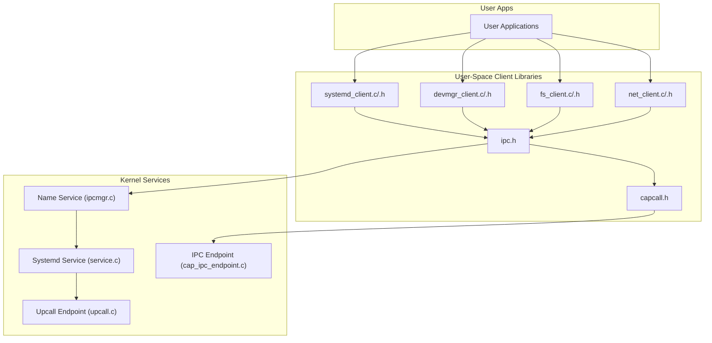
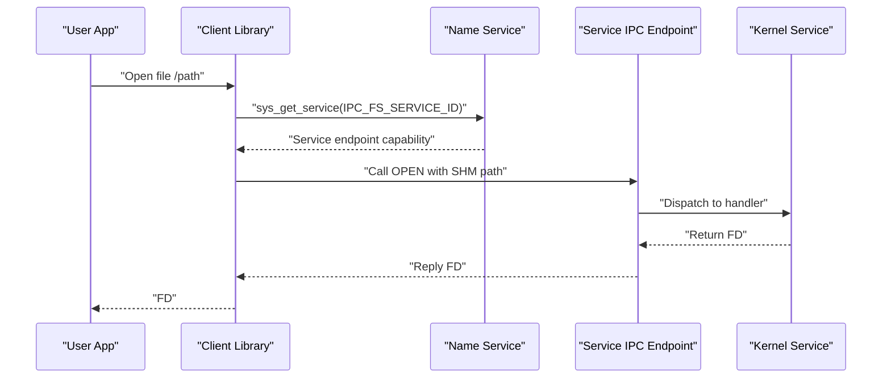
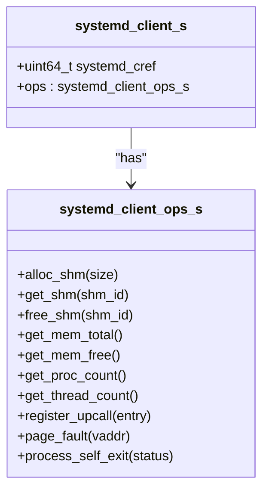
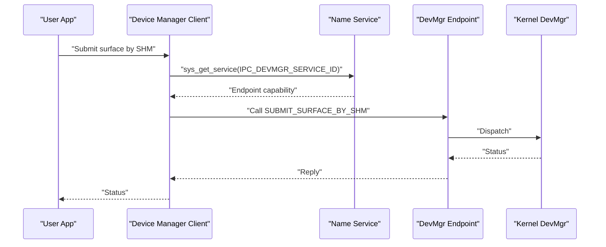
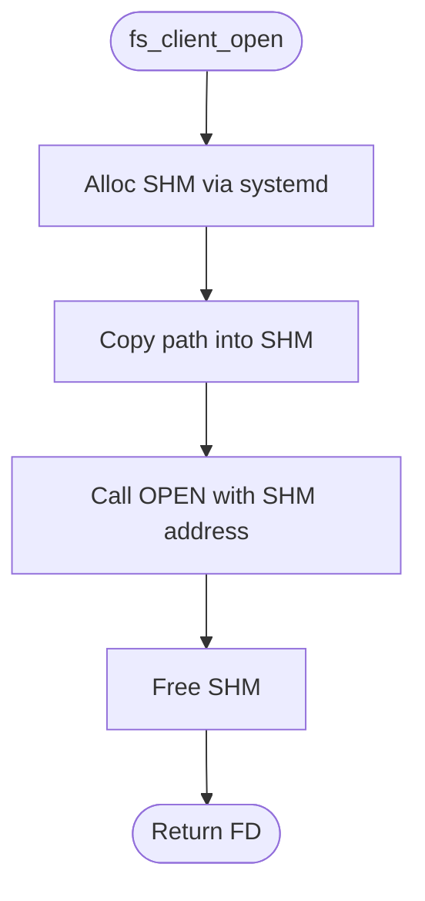
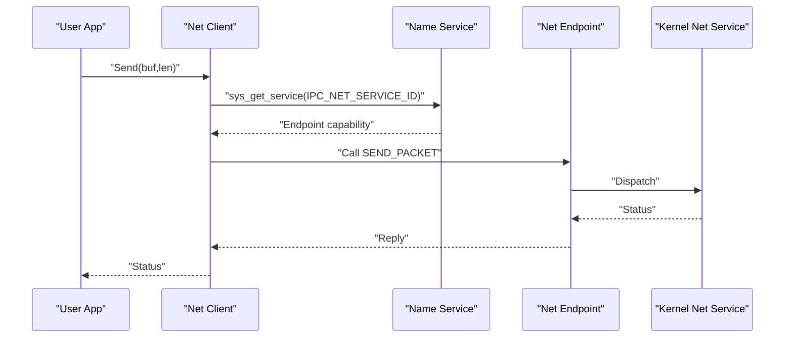
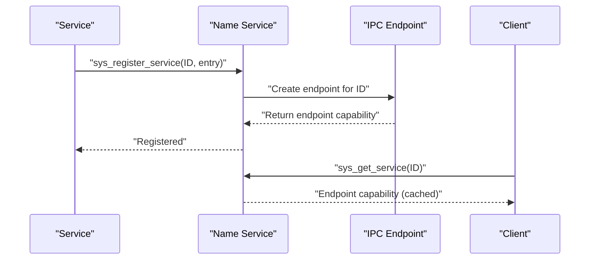
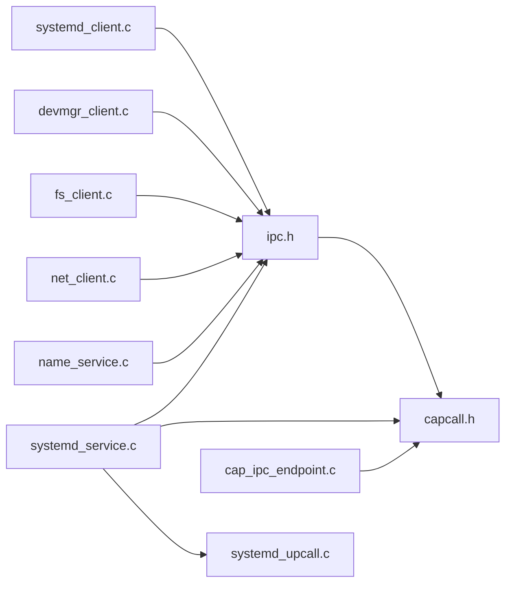

# User-Space APIs

<cite>
**Referenced Files in This Document**
- [systemd_client.h](file://ulibs/include/libsystem/systemd_client.h)
- [systemd_client.c](file://ulibs/libsystem/systemd_client.c)
- [devmgr_client.h](file://ulibs/include/libsystem/devmgr_client.h)
- [devmgr_client.c](file://ulibs/libsystem/devmgr_client.c)
- [fs_client.h](file://ulibs/include/libsystem/fs_client.h)
- [fs_client.c](file://ulibs/libsystem/fs_client.c)
- [net_client.h](file://ulibs/include/libsystem/net_client.h)
- [net_client.c](file://ulibs/libsystem/net_client.c)
- [ipc.h](file://ulibs/include/libsystem/ipc.h)
- [capcall.h](file://ulibs/include/libkernel/capcall.h)
- [capability.h](file://ulibs/include/libkernel/capability.h)
- [systemd_service.c](file://kernel/systemd/service.c)
- [systemd_upcall.c](file://kernel/systemd/upcall.c)
- [name_service.c](file://kernel/systemd/ipcmgr/ipcmgr.c)
- [cap_ipc_endpoint.c](file://kernel/capability/cap_ipc_endpoint.c)
- [systemd_types.h](file://kernel/systemd/include/systemd.h)
</cite>

## Table of Contents
1. [Introduction](#introduction)
2. [Project Structure](#project-structure)
3. [Core Components](#core-components)
4. [Architecture Overview](#architecture-overview)
5. [Detailed Component Analysis](#detailed-component-analysis)
6. [Dependency Analysis](#dependency-analysis)
7. [Performance Considerations](#performance-considerations)
8. [Troubleshooting Guide](#troubleshooting-guide)
9. [Conclusion](#conclusion)
10. [Appendices](#appendices)

## Introduction
This document describes the user-space API surface for interacting with kernel services in TranquilOS. It covers:
- systemd client APIs for shared memory, memory statistics, process/thread counts, upcall registration, page faults, and process exit
- device manager client interfaces for framebuffer and CPIO access
- file system client APIs for file open/read/write/close
- network client libraries for packet send/receive and MAC address retrieval
It also documents service discovery via the name service, client–server communication patterns using capability-based IPC, error handling strategies, and best practices for API versioning and backward compatibility.

## Project Structure
The user-space client APIs live under ulibs/libsystem and ulibs/include/libsystem. Kernel-side services are under kernel/systemd and kernel/capability. The IPC bridge is defined in ulibs/include/libkernel/capcall.h and ulibs/include/libsystem/ipc.h.

**Diagram sources**
- [systemd_client.c](file://ulibs/libsystem/systemd_client.c#L1-L65)
- [devmgr_client.c](file://ulibs/libsystem/devmgr_client.c#L1-L25)
- [fs_client.c](file://ulibs/libsystem/fs_client.c#L1-L45)
- [net_client.c](file://ulibs/libsystem/net_client.c#L1-L33)
- [ipc.h](file://ulibs/include/libsystem/ipc.h#L1-L73)
- [capcall.h](file://ulibs/include/libkernel/capcall.h#L1-L177)
- [name_service.c](file://kernel/systemd/ipcmgr/ipcmgr.c#L233-L287)
- [systemd_service.c](file://kernel/systemd/service.c#L160-L230)
- [systemd_upcall.c](file://kernel/systemd/upcall.c#L94-L132)
- [cap_ipc_endpoint.c](file://kernel/capability/cap_ipc_endpoint.c#L70-L145)

**Section sources**
- [systemd_client.h](file://ulibs/include/libsystem/systemd_client.h#L1-L84)
- [devmgr_client.h](file://ulibs/include/libsystem/devmgr_client.h#L1-L43)
- [fs_client.h](file://ulibs/include/libsystem/fs_client.h#L1-L47)
- [net_client.h](file://ulibs/include/libsystem/net_client.h#L1-L31)
- [ipc.h](file://ulibs/include/libsystem/ipc.h#L1-L73)
- [capcall.h](file://ulibs/include/libkernel/capcall.h#L1-L177)

## Core Components
- systemd client: Provides shared memory allocation/get/free, memory stats, process/thread counts, upcall registration, page fault handling, and process exit.
- device manager client: Provides framebuffer submission and CPIO address retrieval.
- file system client: Provides file open/read/write/close using shared memory for path and buffers.
- network client: Provides packet send/receive and MAC address retrieval.
- IPC and capability bridge: Defines service IDs, name service discovery, and capability-based IPC calls.

Key behaviors:
- Clients lazily discover service endpoints via the name service and cache the capability reference.
- Calls use capability-based IPC with fixed method IDs per service.
- Some operations allocate shared memory for cross-sandbox data exchange.

**Section sources**
- [systemd_client.h](file://ulibs/include/libsystem/systemd_client.h#L7-L84)
- [systemd_client.c](file://ulibs/libsystem/systemd_client.c#L45-L65)
- [devmgr_client.h](file://ulibs/include/libsystem/devmgr_client.h#L7-L43)
- [devmgr_client.c](file://ulibs/libsystem/devmgr_client.c#L13-L25)
- [fs_client.h](file://ulibs/include/libsystem/fs_client.h#L7-L47)
- [fs_client.c](file://ulibs/libsystem/fs_client.c#L31-L45)
- [net_client.h](file://ulibs/include/libsystem/net_client.h#L7-L31)
- [net_client.c](file://ulibs/libsystem/net_client.c#L19-L33)
- [ipc.h](file://ulibs/include/libsystem/ipc.h#L11-L70)
- [capcall.h](file://ulibs/include/libkernel/capcall.h#L166-L177)

## Architecture Overview
The client–kernel interaction follows a capability-based IPC pattern:
- Name service maintains a registry of service endpoints.
- Clients call sys_get_service to obtain a capability reference to the target service endpoint.
- Clients invoke service methods by calling the endpoint capability with method IDs and arguments.
- Kernel services implement an IPC entry point that dispatches to handlers and replies via the endpoint.

**Diagram sources**
- [ipc.h](file://ulibs/include/libsystem/ipc.h#L61-L70)
- [fs_client.c](file://ulibs/libsystem/fs_client.c#L9-L17)
- [name_service.c](file://kernel/systemd/ipcmgr/ipcmgr.c#L237-L287)
- [cap_ipc_endpoint.c](file://kernel/capability/cap_ipc_endpoint.c#L70-L104)

**Section sources**
- [ipc.h](file://ulibs/include/libsystem/ipc.h#L11-L70)
- [capcall.h](file://ulibs/include/libkernel/capcall.h#L166-L177)
- [cap_ipc_endpoint.c](file://kernel/capability/cap_ipc_endpoint.c#L70-L145)

## Detailed Component Analysis

### Systemd Client APIs
The systemd client exposes:
- Shared memory management: alloc, get, free
- Memory statistics: total and free
- Process/thread counts
- Upcall registration
- Page fault handling
- Process self-exit

Implementation highlights:
- Methods are thin wrappers around capability-based IPC calls.
- The client caches the service endpoint capability after first lookup.
- Upcalls are created by the kernel and bound to the calling process.

**Diagram sources**
- [systemd_client.h](file://ulibs/include/libsystem/systemd_client.h#L64-L80)

**Section sources**
- [systemd_client.h](file://ulibs/include/libsystem/systemd_client.h#L7-L84)
- [systemd_client.c](file://ulibs/libsystem/systemd_client.c#L6-L43)
- [systemd_service.c](file://kernel/systemd/service.c#L160-L230)
- [systemd_upcall.c](file://kernel/systemd/upcall.c#L94-L132)

### Device Manager Client Interfaces
The device manager client supports:
- Submitting a surface via shared memory
- Retrieving the CPIO address for firmware configuration

Implementation highlights:
- Uses shared memory for passing surface metadata or buffer addresses.
- Relies on the name service to locate the device manager endpoint.

**Diagram sources**
- [devmgr_client.c](file://ulibs/libsystem/devmgr_client.c#L5-L11)
- [ipc.h](file://ulibs/include/libsystem/ipc.h#L61-L70)
- [name_service.c](file://kernel/systemd/ipcmgr/ipcmgr.c#L237-L287)

**Section sources**
- [devmgr_client.h](file://ulibs/include/libsystem/devmgr_client.h#L7-L43)
- [devmgr_client.c](file://ulibs/libsystem/devmgr_client.c#L13-L25)

### File System Client APIs
The file system client provides:
- Open: allocates SHM, copies path into it, calls OPEN, then frees SHM
- Read/Write: pass FD, SHM address, and length
- Close: closes the file descriptor

Implementation highlights:
- Path and buffers are passed via shared memory to avoid large argument marshalling.
- The client depends on the systemd client for SHM operations.

**Diagram sources**
- [fs_client.c](file://ulibs/libsystem/fs_client.c#L9-L17)

**Section sources**
- [fs_client.h](file://ulibs/include/libsystem/fs_client.h#L7-L47)
- [fs_client.c](file://ulibs/libsystem/fs_client.c#L9-L29)

### Network Client Libraries
The network client provides:
- Send: passes buffer pointer and length
- Receive: passes buffer pointer and length
- Get MAC address

Implementation highlights:
- Uses capability-based IPC to communicate with the network service.
- The client obtains the network endpoint via the name service.

**Diagram sources**
- [net_client.c](file://ulibs/libsystem/net_client.c#L7-L17)
- [ipc.h](file://ulibs/include/libsystem/ipc.h#L61-L70)
- [name_service.c](file://kernel/systemd/ipcmgr/ipcmgr.c#L237-L287)

**Section sources**
- [net_client.h](file://ulibs/include/libsystem/net_client.h#L7-L31)
- [net_client.c](file://ulibs/libsystem/net_client.c#L19-L33)

### Service Discovery and Registration
Service discovery uses the name service:
- sys_register_service registers a service entry point with the name service.
- sys_get_service queries the name service for a service ID and retries until a valid capability is returned.
- The name service creates and returns an IPC endpoint capability bound to the caller’s capability node.

**Diagram sources**
- [ipc.h](file://ulibs/include/libsystem/ipc.h#L53-L70)
- [name_service.c](file://kernel/systemd/ipcmgr/ipcmgr.c#L237-L287)
- [cap_ipc_endpoint.c](file://kernel/capability/cap_ipc_endpoint.c#L70-L104)

**Section sources**
- [ipc.h](file://ulibs/include/libsystem/ipc.h#L11-L70)
- [name_service.c](file://kernel/systemd/ipcmgr/ipcmgr.c#L237-L287)
- [systemd_types.h](file://kernel/systemd/include/systemd.h#L4-L11)

## Dependency Analysis
- Client libraries depend on:
  - libsystem/ipc.h for service discovery and method IDs
  - libkernel/capcall.h for capability-based IPC primitives
- Kernel services depend on:
  - Capability framework and IPC endpoint dispatch
  - Process and memory managers for resource operations

**Diagram sources**
- [systemd_client.c](file://ulibs/libsystem/systemd_client.c#L1-L2)
- [devmgr_client.c](file://ulibs/libsystem/devmgr_client.c#L1-L2)
- [fs_client.c](file://ulibs/libsystem/fs_client.c#L1-L3)
- [net_client.c](file://ulibs/libsystem/net_client.c#L1-L2)
- [ipc.h](file://ulibs/include/libsystem/ipc.h#L1-L73)
- [capcall.h](file://ulibs/include/libkernel/capcall.h#L1-L177)
- [systemd_service.c](file://kernel/systemd/service.c#L1-L8)
- [systemd_upcall.c](file://kernel/systemd/upcall.c#L1-L12)
- [name_service.c](file://kernel/systemd/ipcmgr/ipcmgr.c#L233-L235)
- [cap_ipc_endpoint.c](file://kernel/capability/cap_ipc_endpoint.c#L33-L104)

**Section sources**
- [capability.h](file://ulibs/include/libkernel/capability.h#L1-L141)
- [capcall.h](file://ulibs/include/libkernel/capcall.h#L166-L177)

## Performance Considerations
- Minimize IPC round-trips by batching operations where possible.
- Use shared memory for large data transfers (as seen in filesystem and device manager clients).
- Avoid excessive retries in service discovery; the client caches the endpoint capability after first successful lookup.
- Upcalls should be lightweight and avoid blocking operations.

[No sources needed since this section provides general guidance]

## Troubleshooting Guide
Common issues and remedies:
- Service not found during discovery:
  - The client retries periodically; ensure the service is registered and reachable.
  - Verify the service ID and that sys_register_service was invoked by the service.
- IPC call failures:
  - Confirm the endpoint capability is valid and cached.
  - Check that the method ID matches the service’s expected method enumeration.
- Shared memory errors:
  - Ensure SHM allocations succeed and are freed appropriately.
  - Validate buffer sizes and alignment for IPC operations.
- Upcall registration:
  - Verify the upcall entry point is valid and mapped into the process address space.

**Section sources**
- [ipc.h](file://ulibs/include/libsystem/ipc.h#L61-L70)
- [systemd_client.c](file://ulibs/libsystem/systemd_client.c#L45-L65)
- [fs_client.c](file://ulibs/libsystem/fs_client.c#L9-L17)
- [systemd_upcall.c](file://kernel/systemd/upcall.c#L94-L132)

## Conclusion
TranquilOS provides a clean, capability-based user-space API surface for interacting with kernel services. Clients use a name service for discovery and capability-based IPC for invocation. The APIs are designed for predictable performance and robust error handling, with shared memory enabling efficient data transfer. Following the best practices outlined here ensures reliable integration with kernel services.

[No sources needed since this section summarizes without analyzing specific files]

## Appendices

### API Versioning and Backward Compatibility
- Method IDs are enumerated per service; adding new methods should append to the enum to preserve existing IDs.
- When extending APIs, maintain stable argument layouts and document changes in service contracts.
- Prefer additive changes and deprecate old methods gradually while providing compatibility shims.

[No sources needed since this section provides general guidance]

### Client Library Usage Best Practices
- Cache service endpoint capabilities after first successful discovery.
- Use shared memory for large payloads; allocate, copy, and free promptly.
- Handle retries gracefully for service availability and IPC replies.
- Keep upcall handlers minimal and non-blocking.

[No sources needed since this section provides general guidance]