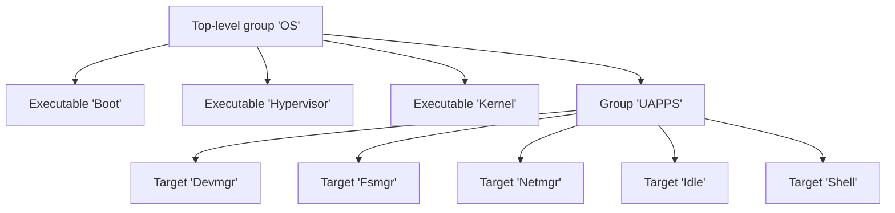
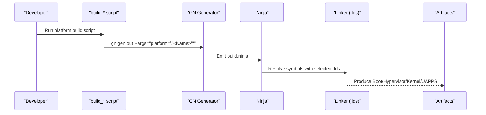
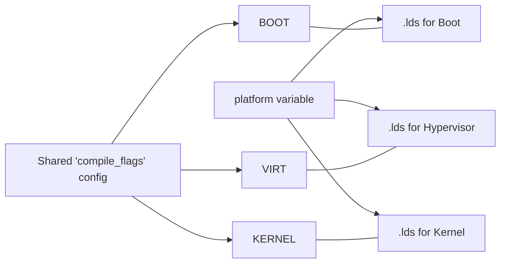

# Build System and Configuration

<cite>
**Referenced Files in This Document**
- [BUILD.gn](file://BUILD.gn)
- [boot/BUILD.gn](file://boot/BUILD.gn)
- [kernel/BUILD.gn](file://kernel/BUILD.gn)
- [virt/BUILD.gn](file://virt/BUILD.gn)
- [scripts/build_cm4.sh](file://scripts/build_cm4.sh)
- [scripts/build_pi3b.sh](file://scripts/build_pi3b.sh)
- [scripts/build_pi4b.sh](file://scripts/build_pi4b.sh)
- [scripts/build_qemu.sh](file://scripts/build_qemu.sh)
- [env_setup.sh](file://env_setup.sh)
- [platform/CM4/linker/boot.lds](file://platform/CM4/linker/boot.lds)
- [platform/CM4/linker/kernel.lds](file://platform/CM4/linker/kernel.lds)
- [platform/Pi3b/linker/kernel.lds](file://platform/Pi3b/linker/kernel.lds)
- [platform/Pi4b/linker/kernel.lds](file://platform/Pi4b/linker/kernel.lds)
- [platform/QemuVirt/linker/virt.lds](file://platform/QemuVirt/linker/virt.lds)
- [uapps/BUILD.gn](file://uapps/BUILD.gn)
</cite>

## Table of Contents
1. [Introduction](#introduction)
2. [Project Structure](#project-structure)
3. [Core Components](#core-components)
4. [Architecture Overview](#architecture-overview)
5. [Detailed Component Analysis](#detailed-component-analysis)
6. [Dependency Analysis](#dependency-analysis)
7. [Performance Considerations](#performance-considerations)
8. [Troubleshooting Guide](#troubleshooting-guide)
9. [Conclusion](#conclusion)
10. [Appendices](#appendices)

## Introduction
This document explains the build system and configuration for TranquilOS, focusing on the GN/Ninja build pipeline, build configuration options, and platform-specific targets. It covers how the build is orchestrated, how platform selection influences linking and memory layout, and how to customize the build for new platforms or optimization scenarios. It also documents the provided build scripts, environment setup, and practical guidance for cross-compilation and troubleshooting.

## Project Structure
TranquilOS uses GN (Generate) to produce Ninja build files. The top-level group aggregates the Boot stage, Hypervisor, Kernel, and User Applications. Each component defines its own executable target with shared compile-time flags and platform-aware linker scripts.



**Diagram sources**
- [BUILD.gn](file://BUILD.gn#L1-L9)
- [uapps/BUILD.gn](file://uapps/BUILD.gn#L1-L10)

**Section sources**
- [BUILD.gn](file://BUILD.gn#L1-L9)
- [uapps/BUILD.gn](file://uapps/BUILD.gn#L1-L10)

## Core Components
- Top-level group “OS” aggregates the Boot, Hypervisor, Kernel, and User Applications.
- “Boot” is the initial stage responsible for early hardware initialization and minimal runtime support.
- “Hypervisor” is the ARMv8 virtualization layer executed at EL2.
- “Kernel” is the main microkernel executed at EL1.
- “UAPPS” groups user-space applications (device manager, filesystem manager, network manager, idle, shell).

Each component:
- Defines a shared config for compile flags and link flags.
- Selects platform-specific linker scripts via the platform variable.
- Includes architecture-specific sources and userland libraries.

**Section sources**
- [boot/BUILD.gn](file://boot/BUILD.gn#L1-L66)
- [virt/BUILD.gn](file://virt/BUILD.gn#L1-L72)
- [kernel/BUILD.gn](file://kernel/BUILD.gn#L1-L135)
- [uapps/BUILD.gn](file://uapps/BUILD.gn#L1-L10)
- [BUILD.gn](file://BUILD.gn#L1-L9)

## Architecture Overview
The build architecture ties together GN configuration, platform selection, and per-target linking. Platform selection is passed to GN during generation and influences which linker script is used for each executable.



**Diagram sources**
- [scripts/build_cm4.sh](file://scripts/build_cm4.sh#L1-L6)
- [scripts/build_pi3b.sh](file://scripts/build_pi3b.sh#L1-L6)
- [scripts/build_pi4b.sh](file://scripts/build_pi4b.sh#L1-L6)
- [scripts/build_qemu.sh](file://scripts/build_qemu.sh#L1-L6)
- [boot/BUILD.gn](file://boot/BUILD.gn#L37-L40)
- [virt/BUILD.gn](file://virt/BUILD.gn#L37-L40)
- [kernel/BUILD.gn](file://kernel/BUILD.gn#L34-L37)

## Detailed Component Analysis

### Build Configuration Options and Flags
- Shared compile flags include CPU architecture tuning, debug info, and warning suppression.
- C-specific flags disable standard libraries and headers, enforcing a minimal build footprint.
- Link flags disable standard libraries and enable verbose linking output.
- The platform variable is printed at build time for visibility.

These options are defined in a shared config block and applied to each executable target.

**Section sources**
- [boot/BUILD.gn](file://boot/BUILD.gn#L7-L24)
- [virt/BUILD.gn](file://virt/BUILD.gn#L7-L24)
- [kernel/BUILD.gn](file://kernel/BUILD.gn#L6-L23)

### Platform Selection and Linker Scripts
- Platform selection is passed to GN via command-line arguments in the build scripts.
- Each executable links against a platform-specific linker script resolved by the platform variable.
- Linker scripts define load addresses, section placement, and stack regions for each platform.

```mermaid
flowchart TD
Start(["GN Generation"]) --> Args["Parse --args='platform=\"<Name>\"'"]
Args --> Resolve["Resolve '$PLATFORM_DIR/$platform/linker/<target>.lds'"]
Resolve --> Link["Link with selected .lds"]
Link --> Output(["Binaries"])
```

**Diagram sources**
- [scripts/build_cm4.sh](file://scripts/build_cm4.sh#L4-L4)
- [scripts/build_pi3b.sh](file://scripts/build_pi3b.sh#L4-L4)
- [scripts/build_pi4b.sh](file://scripts/build_pi4b.sh#L4-L4)
- [scripts/build_qemu.sh](file://scripts/build_qemu.sh#L4-L4)
- [boot/BUILD.gn](file://boot/BUILD.gn#L37-L40)
- [virt/BUILD.gn](file://virt/BUILD.gn#L37-L40)
- [kernel/BUILD.gn](file://kernel/BUILD.gn#L34-L37)

**Section sources**
- [boot/BUILD.gn](file://boot/BUILD.gn#L27-L27)
- [virt/BUILD.gn](file://virt/BUILD.gn#L27-L27)
- [kernel/BUILD.gn](file://kernel/BUILD.gn#L26-L26)
- [platform/CM4/linker/boot.lds](file://platform/CM4/linker/boot.lds#L1-L73)
- [platform/CM4/linker/kernel.lds](file://platform/CM4/linker/kernel.lds#L1-L73)
- [platform/Pi3b/linker/kernel.lds](file://platform/Pi3b/linker/kernel.lds#L1-L73)
- [platform/Pi4b/linker/kernel.lds](file://platform/Pi4b/linker/kernel.lds#L1-L73)
- [platform/QemuVirt/linker/virt.lds](file://platform/QemuVirt/linker/virt.lds#L1-L70)

### Build Targets and Source Sets
- “Boot”: Early stage sources including architecture boot assembly, console, RTC, GPIO, UART, PSCI, device tree, and boot memory management.
- “Hypervisor”: EL2 sources including boot assembly, exception handling, GIC, UART, VM management, and hypervisor core.
- “Kernel”: EL1 microkernel sources including architecture entry/exit, MMU, TLB, interrupts, scheduling, IPC, capabilities, and drivers.

**Section sources**
- [boot/BUILD.gn](file://boot/BUILD.gn#L41-L64)
- [virt/BUILD.gn](file://virt/BUILD.gn#L41-L70)
- [kernel/BUILD.gn](file://kernel/BUILD.gn#L38-L130)

### Automated Builds and Build Scripts
- Platform-specific scripts clean the output directory, generate GN build files with the platform argument, and invoke Ninja.
- These scripts encapsulate the standard build workflow for Raspberry Pi Compute Module 4, Pi 3b, Pi 4b, and QEMU virtual platforms.

**Section sources**
- [scripts/build_cm4.sh](file://scripts/build_cm4.sh#L1-L6)
- [scripts/build_pi3b.sh](file://scripts/build_pi3b.sh#L1-L6)
- [scripts/build_pi4b.sh](file://scripts/build_pi4b.sh#L1-L6)
- [scripts/build_qemu.sh](file://scripts/build_qemu.sh#L1-L6)

### Environment Setup
- The environment script sets base directory and prepends GN and cross-toolchain binaries to PATH.
- This ensures the correct GN and aarch64 cross-compiler are used for building.

**Section sources**
- [env_setup.sh](file://env_setup.sh#L1-L5)

### Continuous Integration
- No CI configuration file was found in the repository.
- The build system relies on local GN/Ninja invocations and platform scripts.

[No sources needed since this section does not analyze specific files]

## Dependency Analysis
The build targets depend on shared configuration and platform-specific linker scripts. The top-level group aggregates all components.



**Diagram sources**
- [boot/BUILD.gn](file://boot/BUILD.gn#L28-L29)
- [virt/BUILD.gn](file://virt/BUILD.gn#L28-L29)
- [kernel/BUILD.gn](file://kernel/BUILD.gn#L27-L28)
- [boot/BUILD.gn](file://boot/BUILD.gn#L37-L40)
- [virt/BUILD.gn](file://virt/BUILD.gn#L37-L40)
- [kernel/BUILD.gn](file://kernel/BUILD.gn#L34-L37)

**Section sources**
- [boot/BUILD.gn](file://boot/BUILD.gn#L28-L29)
- [virt/BUILD.gn](file://virt/BUILD.gn#L28-L29)
- [kernel/BUILD.gn](file://kernel/BUILD.gn#L27-L28)

## Performance Considerations
- Minimal runtime: Disabling standard libraries and headers reduces binary size and startup overhead.
- Debugging: Debug flags are enabled for all targets, aiding development and diagnostics.
- CPU tuning: Target CPU flags are set to optimize for the ARM Cortex-A72 architecture variant.
- Link-time verbosity: Verbose linking helps diagnose unresolved symbols and layout issues.

[No sources needed since this section provides general guidance]

## Troubleshooting Guide
Common issues and remedies:
- Incorrect toolchain or missing GN:
  - Ensure environment variables are set so GN and the cross-compiler are on PATH.
- Platform mismatch:
  - Verify the platform argument matches an existing platform directory and its linker scripts.
- Linker errors:
  - Confirm the selected .lds exists and matches the target’s expected sections and entry points.
- Build artifacts not updating:
  - Scripts clean the output directory before regeneration; re-run the platform script to force rebuild.

**Section sources**
- [env_setup.sh](file://env_setup.sh#L2-L5)
- [scripts/build_cm4.sh](file://scripts/build_cm4.sh#L3-L3)
- [scripts/build_pi3b.sh](file://scripts/build_pi3b.sh#L3-L3)
- [scripts/build_pi4b.sh](file://scripts/build_pi4b.sh#L3-L3)
- [scripts/build_qemu.sh](file://scripts/build_qemu.sh#L3-L3)

## Conclusion
TranquilOS employs a straightforward GN/Ninja build system with platform-driven linker scripts and shared compile flags. The build scripts streamline generation and compilation for supported platforms. Extending the system involves adding a new platform directory with appropriate linker scripts and ensuring the platform variable resolves correctly.

[No sources needed since this section summarizes without analyzing specific files]

## Appendices

### Customizing the Build System
- Add a new platform:
  - Create a new directory under platform/<NewPlatform>/linker/ with the required .lds files.
  - Ensure the platform name is recognized by the build scripts and GN args.
- Modify optimization or feature toggles:
  - Adjust shared compile flags in the common config blocks for all targets.
- Cross-compilation:
  - Ensure the cross-toolchain is installed and on PATH via the environment script.

**Section sources**
- [boot/BUILD.gn](file://boot/BUILD.gn#L37-L40)
- [virt/BUILD.gn](file://virt/BUILD.gn#L37-L40)
- [kernel/BUILD.gn](file://kernel/BUILD.gn#L34-L37)
- [env_setup.sh](file://env_setup.sh#L4-L4)

### Example Build Scenarios
- Build for Raspberry Pi 4b:
  - Run the Pi 4b build script to generate and compile with the Pi 4b platform.
- Build for QEMU virtual machine:
  - Run the QEMU build script to target the virtual platform linker script.
- Clean rebuild:
  - Scripts remove the output directory prior to regeneration; subsequent runs will rebuild all targets.

**Section sources**
- [scripts/build_pi4b.sh](file://scripts/build_pi4b.sh#L1-L6)
- [scripts/build_qemu.sh](file://scripts/build_qemu.sh#L1-L6)