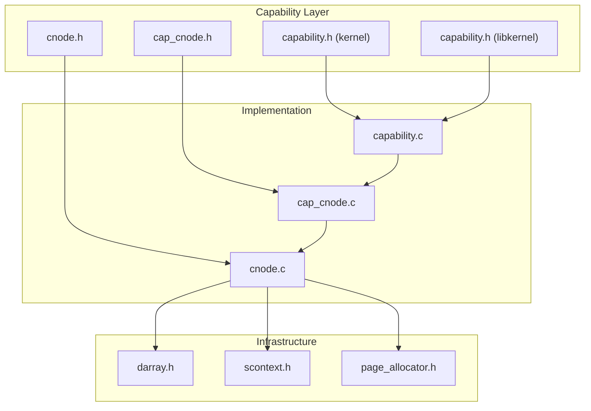
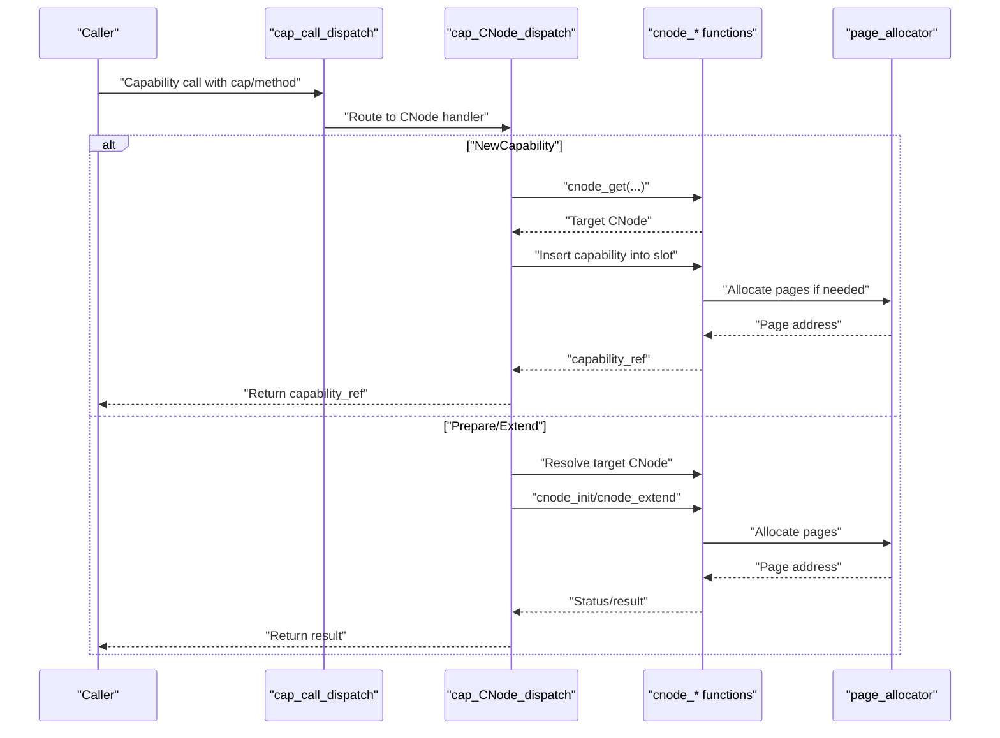
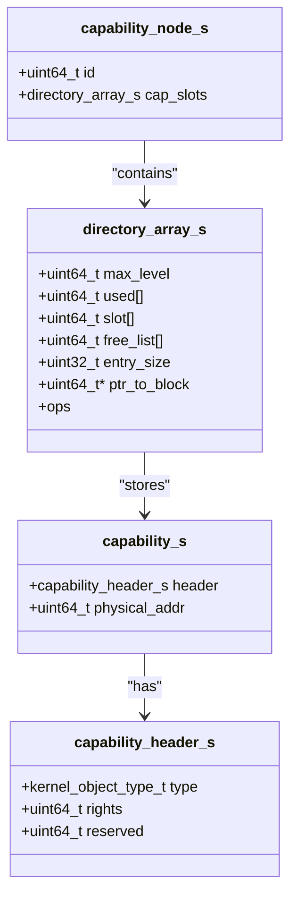
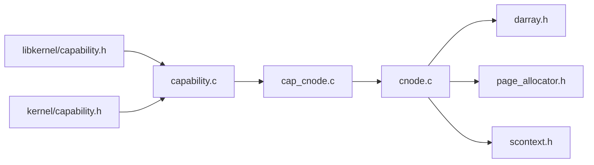

# CNode (Capability Node) Management

<cite>
**Referenced Files in This Document**
- [cnode.c](file://kernel/capability/cnode.c)
- [cnode.h](file://kernel/include/capability/cnode.h)
- [cap_cnode.c](file://kernel/capability/cap_cnode.c)
- [cap_cnode.h](file://kernel/include/capability/cap_cnode.h)
- [capability.h](file://kernel/include/capability/capability.h)
- [capability.h](file://ulibs/include/libkernel/capability.h)
- [darray.h](file://ulibs/include/libalgorithm/darray.h)
- [scontext.h](file://kernel/include/scontext/scontext.h)
- [page_allocator.h](file://kernel/include/mm/page_allocator.h)
- [capability.c](file://kernel/capability/capability.c)
</cite>

## Table of Contents
1. [Introduction](#introduction)
2. [Project Structure](#project-structure)
3. [Core Components](#core-components)
4. [Architecture Overview](#architecture-overview)
5. [Detailed Component Analysis](#detailed-component-analysis)
6. [Dependency Analysis](#dependency-analysis)
7. [Performance Considerations](#performance-considerations)
8. [Troubleshooting Guide](#troubleshooting-guide)
9. [Conclusion](#conclusion)
10. [Appendices](#appendices)

## Introduction
This document explains CNode (capability node) management in the TranquilOS capability system. CNodes serve as capability tables that organize kernel capabilities hierarchically. Each CNode holds a directory array of capability slots, enabling dynamic allocation, extension, and lookup of capabilities. The document covers CNode structure, capability slot management, indexing, creation and manipulation operations, capability table layout, memory management, and dispatch mechanisms. It also addresses capability inheritance, delegation, permission propagation, security boundaries, and practical usage patterns.

## Project Structure
The CNode subsystem spans kernel capability code and shared headers:
- Kernel capability implementation: capability/cnode.c, capability/cap_cnode.c
- Public headers: include/capability/cnode.h, include/capability/cap_cnode.h
- Capability model and dispatch: include/capability/capability.h, capability/capability.c
- Capability indexing and capability references: ulibs/include/libkernel/capability.h
- Directory array (capability slot container): ulibs/include/libalgorithm/darray.h
- Memory management: include/mm/page_allocator.h
- Execution context and scheduling: include/scontext/scontext.h

**Diagram sources**
- [cnode.h](file://kernel/include/capability/cnode.h#L1-L29)
- [cnode.c](file://kernel/capability/cnode.c#L1-L95)
- [cap_cnode.h](file://kernel/include/capability/cap_cnode.h#L1-L12)
- [cap_cnode.c](file://kernel/capability/cap_cnode.c#L1-L184)
- [capability.h](file://kernel/include/capability/capability.h#L1-L26)
- [capability.c](file://kernel/capability/capability.c#L1-L58)
- [capability.h](file://ulibs/include/libkernel/capability.h#L1-L141)
- [darray.h](file://ulibs/include/libalgorithm/darray.h#L1-L64)
- [scontext.h](file://kernel/include/scontext/scontext.h#L1-L50)
- [page_allocator.h](file://kernel/include/mm/page_allocator.h#L1-L23)

**Section sources**
- [cnode.h](file://kernel/include/capability/cnode.h#L1-L29)
- [cnode.c](file://kernel/capability/cnode.c#L1-L95)
- [cap_cnode.h](file://kernel/include/capability/cap_cnode.h#L1-L12)
- [cap_cnode.c](file://kernel/capability/cap_cnode.c#L1-L184)
- [capability.h](file://kernel/include/capability/capability.h#L1-L26)
- [capability.c](file://kernel/capability/capability.c#L1-L58)
- [capability.h](file://ulibs/include/libkernel/capability.h#L1-L141)
- [darray.h](file://ulibs/include/libalgorithm/darray.h#L1-L64)
- [scontext.h](file://kernel/include/scontext/scontext.h#L1-L50)
- [page_allocator.h](file://kernel/include/mm/page_allocator.h#L1-L23)

## Core Components
- CNode structure: A capability_node_s contains a unique identifier and a directory array of capability slots. The directory array supports dynamic growth and efficient slot management.
- Capability reference: A 64-bit capability_ref_t encodes the target CNode ID and the slot index within that CNode, enabling compact addressing across the system.
- Dispatch and capability model: The capability model defines capability headers with type and rights, while the dispatcher routes capability calls to the appropriate handler.

Key responsibilities:
- CNode initialization and extension
- Capability creation and insertion
- Capability lookup and retrieval
- Hierarchical navigation via CNode capabilities
- Memory-backed slot allocation and growth

**Section sources**
- [cnode.h](file://kernel/include/capability/cnode.h#L9-L14)
- [cnode.c](file://kernel/capability/cnode.c#L9-L13)
- [capability.h](file://ulibs/include/libkernel/capability.h#L44-L50)
- [capability.h](file://kernel/include/capability/capability.h#L11-L20)
- [capability.c](file://kernel/capability/capability.c#L14-L54)

## Architecture Overview
CNode management integrates with the capability dispatch system and memory management:
- Capability dispatch decodes the capability type and method, routing to the CNode handler.
- The CNode handler resolves the target CNode from the caller’s schedule context or a provided reference.
- Memory allocation extends the directory array when slots are exhausted.
- Capabilities are inserted into the nearest free slot and returned via a capability reference.

**Diagram sources**
- [capability.c](file://kernel/capability/capability.c#L14-L54)
- [cap_cnode.c](file://kernel/capability/cap_cnode.c#L163-L184)
- [cnode.c](file://kernel/capability/cnode.c#L9-L95)
- [page_allocator.h](file://kernel/include/mm/page_allocator.h#L8-L21)

## Detailed Component Analysis

### CNode Data Model and Layout
- CNode identity: Each CNode has a unique ID generated by a monotonic generator.
- Slot container: The directory array supports multi-level addressing with fixed bit-widths per level, enabling scalable slot indexing.
- Capability representation: Each slot stores a capability header (type, rights) and a physical address pointing to the kernel object or another CNode.

**Diagram sources**
- [cnode.h](file://kernel/include/capability/cnode.h#L11-L14)
- [darray.h](file://ulibs/include/libalgorithm/darray.h#L46-L59)
- [capability.h](file://kernel/include/capability/capability.h#L11-L20)

**Section sources**
- [cnode.h](file://kernel/include/capability/cnode.h#L9-L14)
- [darray.h](file://ulibs/include/libalgorithm/darray.h#L12-L27)
- [capability.h](file://kernel/include/capability/capability.h#L11-L20)

### Capability Reference Encoding
- The capability_ref_t encodes two fields:
  - cnode_id: upper 32 bits identifying the owning CNode
  - slot_idx: lower 32 bits identifying the slot within that CNode
- Special reference value CNODE_CURRENT_CREF indicates the current CNode in the schedule context.

Practical usage:
- Passing a capability reference to a capability call identifies both the CNode and the slot for operations like NewCapability, Prepare, and Extend.

**Section sources**
- [capability.h](file://ulibs/include/libkernel/capability.h#L4-L50)
- [capability.h](file://ulibs/include/libkernel/capability.h#L4-L18)

### CNode Creation and Initialization
- Root CNode ID starts at a predefined constant.
- cnode_init initializes a CNode with a given ID and a backing page for the directory array.
- cnode_gen_id generates a new unique ID for child CNodes.

Operational notes:
- Backing page is allocated via the global page allocator when the CNode is first used.
- Initialization sets up the directory array with the capability entry size.

**Section sources**
- [cnode.c](file://kernel/capability/cnode.c#L7-L13)
- [cnode.h](file://kernel/include/capability/cnode.h#L9-L14)
- [page_allocator.h](file://kernel/include/mm/page_allocator.h#L18-L21)

### Capability Insertion and Allocation
- cnode_new_cap creates a new capability within a CNode:
  - Ensures the CNode has a backing page
  - Allocates additional pages if the directory array is full
  - Inserts the capability into the next free slot
  - Returns a capability reference composed of the CNode ID and the inserted slot index

Slot allocation algorithm:
- The directory array tracks free capacity and grows by extending with new page blocks when necessary.
- Insertion occurs into the first available slot, maintaining compactness.

**Section sources**
- [cnode.c](file://kernel/capability/cnode.c#L23-L59)
- [darray.h](file://ulibs/include/libalgorithm/darray.h#L29-L41)

### Capability Lookup and Hierarchical Navigation
- cnode_get resolves a CNode from either:
  - The current CNode in the schedule context (when the reference is zero)
  - A CNode capability located at a specific slot index within another CNode
- cnode_get_cap retrieves a capability from a given slot index within a CNode.

Security note:
- Access to a CNode capability requires appropriate rights on the parent CNode.
- The system panics if the referenced capability is not a CNode or if the target CNode is null.

**Section sources**
- [cnode.c](file://kernel/capability/cnode.c#L61-L90)
- [capability.h](file://kernel/include/capability/capability.h#L11-L20)

### CNode Extension and Memory Management
- cnode_extend extends a CNode’s directory array by allocating a new page and appending it to the directory structure.
- Memory allocation uses the global page allocator with kernel GFP flags.

Behavior:
- If the CNode lacks a backing page, it allocates one before extending.
- Returns the number of free slots after extension.

**Section sources**
- [cnode.c](file://kernel/capability/cnode.c#L15-L21)
- [page_allocator.h](file://kernel/include/mm/page_allocator.h#L8-L21)

### Capability Dispatch and Method Routing
- cap_call_dispatch decodes the capability call number to extract the capability type and method, then routes to the appropriate handler.
- cap_CNode_dispatch handles CNode-specific methods:
  - Create: internal use
  - NewCapability: insert a new capability into a target CNode
  - Prepare: initialize a child CNode with a backing page
  - Extend: extend a child CNode’s directory array
  - Destroy: internal use

Method-specific logic:
- NewCapability validates the target CNode and inserts a capability, returning a capability reference.
- Prepare initializes a child CNode with a new backing page.
- Extend appends a new page block to the child CNode’s directory array.

**Section sources**
- [capability.c](file://kernel/capability/capability.c#L14-L54)
- [cap_cnode.c](file://kernel/capability/cap_cnode.c#L163-L184)
- [cap_cnode.h](file://kernel/include/capability/cap_cnode.h#L7-L10)

### Capability Inheritance, Delegation, and Permission Propagation
- Capability rights propagate from parent to child via the capability header embedded in each slot.
- Delegation occurs when a parent CNode grants rights to a child CNode capability, which can then be used to create further descendants.
- Access control is enforced by checking the rights associated with the capability header during operations like NewCapability and Prepare.

Security boundary enforcement:
- Only capabilities with sufficient rights can create or manipulate child CNodes.
- Null checks and type checks prevent misuse of references.

Note: Rights constants and masks are defined per capability type in their respective headers.

**Section sources**
- [capability.h](file://kernel/include/capability/capability.h#L9-L15)
- [capability.h](file://ulibs/include/libkernel/capability.h#L6-L18)
- [cap_cnode.h](file://kernel/include/capability/cap_cnode.h#L7-L9)

### Practical Usage Patterns and Examples
- Creating a child CNode:
  - Use Prepare to initialize a child CNode with a backing page.
  - Use NewCapability to insert the child CNode into a parent CNode.
- Sharing capabilities:
  - Insert a capability into a child CNode and pass the capability reference to another component.
- Extending capacity:
  - Use Extend to allocate additional pages when the directory array becomes full.

Example references:
- Child CNode preparation and extension are handled by the CNode handler methods.
- Capability insertion returns a capability reference suitable for passing across the system.

**Section sources**
- [cap_cnode.c](file://kernel/capability/cap_cnode.c#L93-L161)
- [capability.h](file://ulibs/include/libkernel/capability.h#L4-L50)

## Dependency Analysis
CNode management depends on:
- Directory array for slot storage and growth
- Page allocator for backing memory
- Schedule context for resolving the current CNode
- Capability dispatch for routing capability calls

**Diagram sources**
- [cnode.c](file://kernel/capability/cnode.c#L1-L95)
- [darray.h](file://ulibs/include/libalgorithm/darray.h#L1-L64)
- [page_allocator.h](file://kernel/include/mm/page_allocator.h#L1-L23)
- [scontext.h](file://kernel/include/scontext/scontext.h#L1-L50)
- [cap_cnode.c](file://kernel/capability/cap_cnode.c#L1-L184)
- [capability.c](file://kernel/capability/capability.c#L1-L58)
- [capability.h](file://ulibs/include/libkernel/capability.h#L1-L141)
- [capability.h](file://kernel/include/capability/capability.h#L1-L26)

**Section sources**
- [cnode.c](file://kernel/capability/cnode.c#L1-L95)
- [cap_cnode.c](file://kernel/capability/cap_cnode.c#L1-L184)
- [capability.c](file://kernel/capability/capability.c#L1-L58)
- [capability.h](file://ulibs/include/libkernel/capability.h#L1-L141)
- [capability.h](file://kernel/include/capability/capability.h#L1-L26)
- [darray.h](file://ulibs/include/libalgorithm/darray.h#L1-L64)
- [page_allocator.h](file://kernel/include/mm/page_allocator.h#L1-L23)
- [scontext.h](file://kernel/include/scontext/scontext.h#L1-L50)

## Performance Considerations
- Directory array growth: Each extension appends a new page block, amortizing allocation costs across many slots.
- Slot insertion: O(1) average time due to free-list management in the directory array.
- Memory locality: Backing pages are contiguous per block, improving cache behavior for sequential accesses.
- Right checks: Enforcing rights during capability operations adds minimal overhead compared to the cost of memory operations.

Optimization strategies:
- Pre-allocate multiple pages for frequently extended CNodes to reduce allocation frequency.
- Reuse child CNodes when possible to avoid repeated allocations.
- Keep capability references small by using the current CNode reference (zero) when applicable.

[No sources needed since this section provides general guidance]

## Troubleshooting Guide
Common issues and resolutions:
- Null CNode pointer:
  - Symptom: Panic during CNode resolution or capability lookup.
  - Cause: Attempting to access a capability that points to a null CNode.
  - Resolution: Ensure the parent CNode capability exists and points to a valid CNode.
- Not a CNode capability:
  - Symptom: Panic indicating the referenced capability is not a CNode.
  - Cause: Using a capability reference targeting a non-CNode capability.
  - Resolution: Verify the capability type stored in the slot matches the expected CNode type.
- Page allocation failure:
  - Symptom: Panic during CNode initialization or extension.
  - Cause: Global page allocator unavailable or out of memory.
  - Resolution: Check memory availability and ensure the allocator is initialized.
- Full directory array:
  - Symptom: Failure to insert a capability due to no free slots.
  - Cause: Insufficient capacity in the current page block.
  - Resolution: Extend the CNode with a new page block.

**Section sources**
- [cnode.c](file://kernel/capability/cnode.c#L16-L19)
- [cnode.c](file://kernel/capability/cnode.c#L74-L87)
- [cnode.c](file://kernel/capability/cnode.c#L34-L48)
- [cap_cnode.c](file://kernel/capability/cap_cnode.c#L45-L56)

## Conclusion
CNode management in TranquilOS provides a robust, hierarchical capability table system. By combining a multi-level directory array with a compact capability reference encoding, the system enables efficient capability creation, lookup, and delegation. Proper memory management and strict access control ensure secure operation across the capability hierarchy. The dispatch-driven interface cleanly separates capability semantics from implementation, supporting extensibility and maintainability.

[No sources needed since this section summarizes without analyzing specific files]

## Appendices

### Capability Table Layout and Indexing
- Multi-level addressing scheme with fixed bit-widths per level enables scalable indexing.
- Entry size and free-list management optimize insertion and traversal.

**Section sources**
- [darray.h](file://ulibs/include/libalgorithm/darray.h#L12-L27)
- [darray.h](file://ulibs/include/libalgorithm/darray.h#L46-L59)

### Security Features and Access Control
- Capability rights embedded in headers govern operations.
- Type checks and null validations enforce security boundaries.
- Panic-based error handling prevents undefined behavior.

**Section sources**
- [capability.h](file://kernel/include/capability/capability.h#L9-L15)
- [cnode.c](file://kernel/capability/cnode.c#L74-L87)
- [cap_cnode.c](file://kernel/capability/cap_cnode.c#L113-L120)