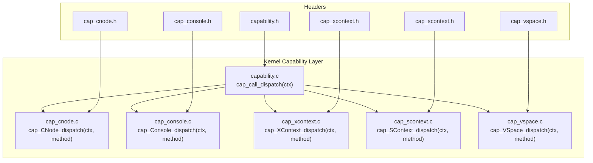
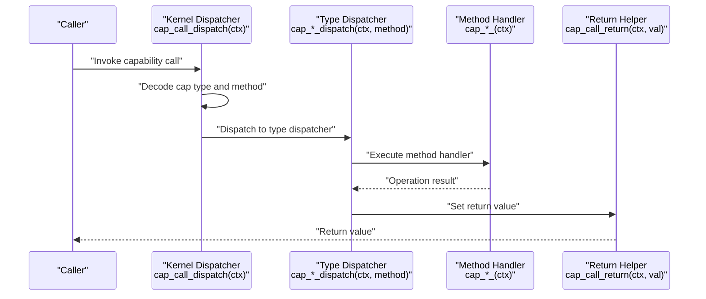
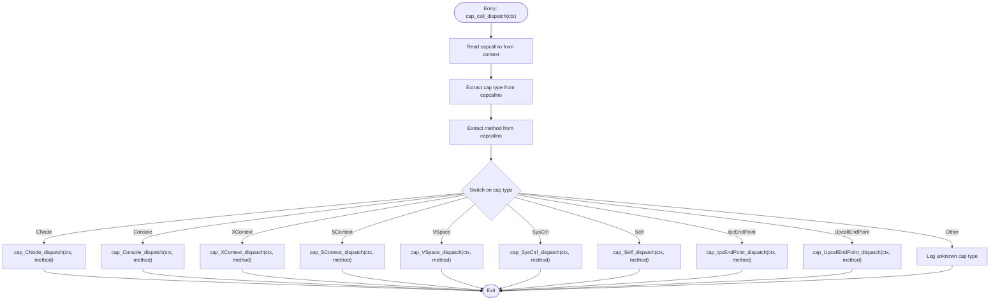
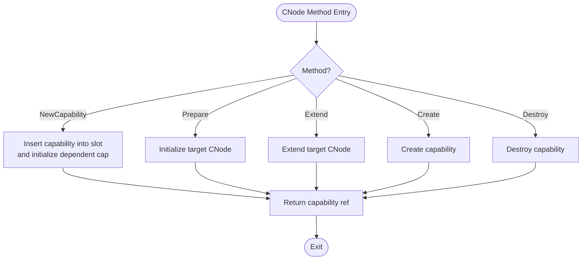
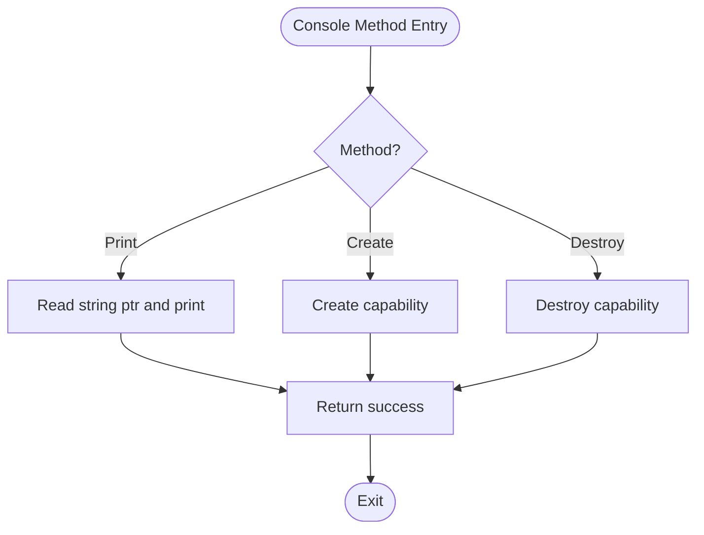
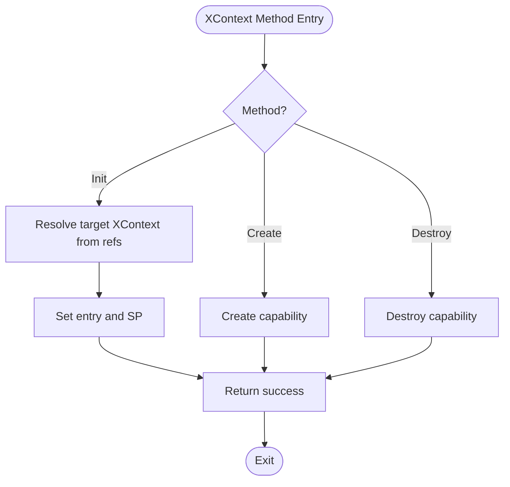
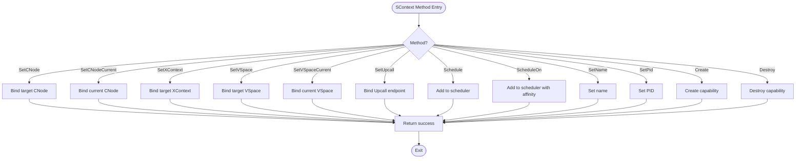
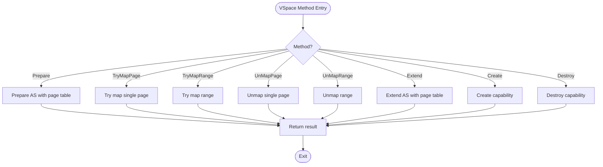
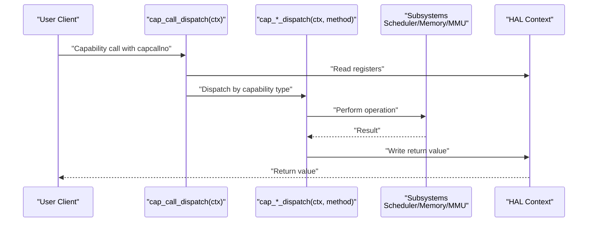
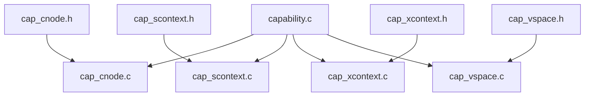

# Capability Dispatch and Method Invocation

<cite>
**Referenced Files in This Document**
- [capability.h](file://kernel/include/capability/capability.h)
- [capability.c](file://kernel/capability/capability.c)
- [cap_cnode.h](file://kernel/include/capability/cap_cnode.h)
- [cap_cnode.c](file://kernel/capability/cap_cnode.c)
- [cap_console.h](file://kernel/include/capability/cap_console.h)
- [cap_console.c](file://kernel/capability/cap_console.c)
- [cap_xcontext.h](file://kernel/include/capability/cap_xcontext.h)
- [cap_xcontext.c](file://kernel/capability/cap_xcontext.c)
- [cap_scontext.h](file://kernel/include/capability/cap_scontext.h)
- [cap_scontext.c](file://kernel/capability/cap_scontext.c)
- [cap_vspace.h](file://kernel/include/capability/cap_vspace.h)
- [cap_vspace.c](file://kernel/capability/cap_vspace.c)
- [hal_context.h](file://kernel/include/arch/generic/hal_context.h)
- [xcontext.h](file://kernel/include/xcontext/xcontext.h)
- [scontext.h](file://kernel/include/scontext/scontext.h)
- [cnode.h](file://kernel/include/capability/cnode.h)
- [cnode.c](file://kernel/capability/cnode.c)
- [address_space.h](file://kernel/include/mm/address_space.h)
- [scheduler_mgr.h](file://kernel/include/scheduler/sched_mgr.h)
- [upcall_endpoint.h](file://kernel/include/upcall/upcall_endpoint.h)
- [capcall.h](file://ulibs/include/libkernel/capcall.h)
- [capability.h](file://ulibs/include/libkernel/capability.h)
</cite>

## Table of Contents
1. [Introduction](#introduction)
2. [Project Structure](#project-structure)
3. [Core Components](#core-components)
4. [Architecture Overview](#architecture-overview)
5. [Detailed Component Analysis](#detailed-component-analysis)
6. [Dependency Analysis](#dependency-analysis)
7. [Performance Considerations](#performance-considerations)
8. [Troubleshooting Guide](#troubleshooting-guide)
9. [Conclusion](#conclusion)
10. [Appendices](#appendices)

## Introduction
This document explains the capability dispatch mechanism and method invocation system in TranquilOS. It covers how capability calls are decoded, routed to the appropriate capability type, and executed. It also documents the capability call convention, parameter passing, return value handling, method dispatch tables, capability type classification, and operation code encoding. Finally, it describes the integration with system execution context, including context switching and privilege management, along with practical examples, performance considerations, and debugging strategies.

## Project Structure
The capability subsystem resides under kernel/capability and exposes capability-specific dispatchers and method implementations. The central dispatcher decodes the capability call number and routes to per-capability dispatchers. Each capability type defines its own method constants and dispatch functions.

**Diagram sources**
- [capability.c](file://kernel/capability/capability.c#L14-L54)
- [cap_cnode.c](file://kernel/capability/cap_cnode.c#L163-L184)
- [cap_console.c](file://kernel/capability/cap_console.c#L24-L39)
- [cap_xcontext.c](file://kernel/capability/cap_xcontext.c#L53-L68)
- [cap_scontext.c](file://kernel/capability/cap_scontext.c#L420-L462)
- [cap_vspace.c](file://kernel/capability/cap_vspace.c#L213-L243)
- [capability.h](file://kernel/include/capability/capability.h#L22-L24)

**Section sources**
- [capability.c](file://kernel/capability/capability.c#L14-L54)
- [capability.h](file://kernel/include/capability/capability.h#L1-L26)

## Core Components
- Central dispatcher: Decodes capability call number and routes to the correct capability type dispatcher.
- Capability type dispatchers: Per-type method dispatchers that decode the method and call the corresponding handler.
- Method handlers: Implement the actual capability operations, including parameter extraction, validation, and return value setting.
- Execution context integration: Uses HAL context helpers to read/write registers and manage return values.

Key responsibilities:
- Capability identification via bits extracted from the capability call number.
- Method routing via method identifiers encoded in the call number.
- Parameter passing through execution context registers.
- Return value propagation via a dedicated return helper.

**Section sources**
- [capability.h](file://kernel/include/capability/capability.h#L22-L24)
- [capability.c](file://kernel/capability/capability.c#L14-L54)
- [cap_cnode.c](file://kernel/capability/cap_cnode.c#L163-L184)
- [cap_console.c](file://kernel/capability/cap_console.c#L24-L39)
- [cap_xcontext.c](file://kernel/capability/cap_xcontext.c#L53-L68)
- [cap_scontext.c](file://kernel/capability/cap_scontext.c#L420-L462)
- [cap_vspace.c](file://kernel/capability/cap_vspace.c#L213-L243)

## Architecture Overview
The capability call flow begins when a capability call is placed in the execution context. The kernel’s central dispatcher reads the capability call number, extracts the capability type and method, and invokes the appropriate dispatcher. The dispatcher then executes the method handler, which performs validation, interacts with subsystems (such as memory management or scheduling), and returns a value via the return helper.

**Diagram sources**
- [capability.c](file://kernel/capability/capability.c#L14-L54)
- [cap_cnode.c](file://kernel/capability/cap_cnode.c#L163-L184)
- [cap_console.c](file://kernel/capability/cap_console.c#L24-L39)
- [cap_xcontext.c](file://kernel/capability/cap_xcontext.c#L53-L68)
- [cap_scontext.c](file://kernel/capability/cap_scontext.c#L420-L462)
- [cap_vspace.c](file://kernel/capability/cap_vspace.c#L213-L243)
- [capability.h](file://kernel/include/capability/capability.h#L24-L24)

## Detailed Component Analysis

### Central Capability Call Dispatcher
The central dispatcher reads the capability call number from the execution context, extracts the capability type and method, and branches to the appropriate type dispatcher. It logs unknown capability types and defers permission checks to future work.

**Diagram sources**
- [capability.c](file://kernel/capability/capability.c#L14-L54)

**Section sources**
- [capability.c](file://kernel/capability/capability.c#L14-L54)

### Capability Call Convention and Encoding
- Capability call number layout: The capability type occupies a specific bit field, and the method occupies another bit field within the call number.
- Parameter passing: Method parameters are passed via registers in the execution context.
- Return value handling: The return value is written back to a designated register using the return helper.

Implementation details:
- Capability type and method are extracted from the capability call number.
- Parameters are retrieved using HAL context register helpers.
- Return value is set using the return helper.

**Section sources**
- [capability.c](file://kernel/capability/capability.c#L14-L54)
- [capability.h](file://kernel/include/capability/capability.h#L22-L24)
- [hal_context.h](file://kernel/include/arch/generic/hal_context.h)

### Capability Type Classification and Rights
Each capability type defines its rights mask constants and method enumerations. These are used to control access and route method calls.

Examples:
- CNode: Rights for creation and destruction.
- Console: Rights for creation and destruction.
- XContext: Rights for creation and destruction.
- SContext: Rights for creation and destruction.
- VSpace: Rights for creation and destruction.

These definitions live in the respective capability headers.

**Section sources**
- [cap_cnode.h](file://kernel/include/capability/cap_cnode.h#L7-L8)
- [cap_console.h](file://kernel/include/capability/cap_console.h#L7-L8)
- [cap_xcontext.h](file://kernel/include/capability/cap_xcontext.h#L7-L8)
- [cap_scontext.h](file://kernel/include/capability/cap_scontext.h#L7-L8)
- [cap_vspace.h](file://kernel/include/capability/cap_vspace.h#L7-L8)

### Method Dispatch Tables and Handlers

#### CNode Capability
- Methods: Create, NewCapability, Prepare, Extend, Destroy.
- Responsibilities:
  - Create: Untyped object typing and capability creation.
  - NewCapability: Insert a new capability into a slot, initialize dependent capabilities, and return a capability reference.
  - Prepare: Initialize a target CNode with a page.
  - Extend: Extend a target CNode with additional pages.
  - Destroy: Placeholder for cleanup.

**Diagram sources**
- [cap_cnode.c](file://kernel/capability/cap_cnode.c#L163-L184)

**Section sources**
- [cap_cnode.c](file://kernel/capability/cap_cnode.c#L13-L184)

#### Console Capability
- Methods: Create, Print, Destroy.
- Responsibilities:
  - Create: Untyped object typing and capability creation.
  - Print: Reads a string pointer from the execution context and prints it.
  - Destroy: Placeholder for cleanup.

**Diagram sources**
- [cap_console.c](file://kernel/capability/cap_console.c#L24-L39)

**Section sources**
- [cap_console.c](file://kernel/capability/cap_console.c#L7-L39)

#### XContext Capability
- Methods: Create, Init, Destroy.
- Responsibilities:
  - Create: Untyped object typing and capability creation.
  - Init: Initializes an execute context with entry point and stack pointer using capability references resolved from slots.
  - Destroy: Placeholder for cleanup.

**Diagram sources**
- [cap_xcontext.c](file://kernel/capability/cap_xcontext.c#L53-L68)

**Section sources**
- [cap_xcontext.c](file://kernel/capability/cap_xcontext.c#L9-L68)

#### SContext Capability
- Methods: Create, SetCNode, SetCNodeCurrent, SetXContext, SetVSpace, SetVSpaceCurrent, SetUpcall, Schedule, ScheduleOn, SetName, SetPid, Destroy.
- Responsibilities:
  - Create: Untyped object typing and capability creation.
  - SetCNode/SetCNodeCurrent: Bind a CNode to an SContext.
  - SetXContext: Bind an XContext to an SContext.
  - SetVSpace/SetVSpaceCurrent: Bind a VSpace to an SContext.
  - SetUpcall: Bind an Upcall endpoint to an SContext.
  - Schedule/ScheduleOn: Add SContext to scheduler with optional affinity.
  - SetName/SetPid: Configure metadata.
  - Destroy: Placeholder for cleanup.

**Diagram sources**
- [cap_scontext.c](file://kernel/capability/cap_scontext.c#L420-L462)

**Section sources**
- [cap_scontext.c](file://kernel/capability/cap_scontext.c#L12-L462)

#### VSpace Capability
- Methods: Create, Prepare, TryMapPage, TryMapRange, UnMapPage, UnMapRange, Extend, Destroy.
- Responsibilities:
  - Create: Untyped object typing and capability creation.
  - Prepare: Prepare an address space with a page table page.
  - TryMapPage/TryMapRange: Map a page or range into an address space.
  - UnMapPage/UnMapRange: Unmap a page or range from an address space.
  - Extend: Extend an address space with a new page table page.
  - Destroy: Placeholder for cleanup.

**Diagram sources**
- [cap_vspace.c](file://kernel/capability/cap_vspace.c#L213-L243)

**Section sources**
- [cap_vspace.c](file://kernel/capability/cap_vspace.c#L8-L243)

### Integration with Execution Context and Privilege Management
- Execution context: The dispatcher and method handlers operate on the current execution context, accessing registers and state via HAL helpers.
- Context switching: SContext methods integrate with the scheduler to add or schedule contexts.
- Privilege management: Capability calls originate from user-level clients and are mediated by capability references and rights masks. Permission checks are currently marked as TODO in the dispatcher.

**Diagram sources**
- [capability.c](file://kernel/capability/capability.c#L14-L54)
- [cap_scontext.c](file://kernel/capability/cap_scontext.c#L279-L348)
- [cap_vspace.c](file://kernel/capability/cap_vspace.c#L15-L134)
- [scheduler_mgr.h](file://kernel/include/scheduler/sched_mgr.h)

**Section sources**
- [capability.c](file://kernel/capability/capability.c#L14-L54)
- [cap_scontext.c](file://kernel/capability/cap_scontext.c#L279-L348)
- [cap_vspace.c](file://kernel/capability/cap_vspace.c#L15-L134)
- [scheduler_mgr.h](file://kernel/include/scheduler/sched_mgr.h)

### Practical Examples

- Example: Creating a Console capability and printing a message
  - Steps: Obtain an untyped reference, pass it to the Console Create method, then call Print with a string pointer. The Print method reads the string pointer from the execution context and prints it.
  - Validation: Ensure the caller holds the Console rights and the string pointer is valid.
  - Return handling: The Print method returns a success code via the return helper.

- Example: Initializing an XContext
  - Steps: Resolve the target XContext capability from a capability reference, then call Init with entry and stack pointer values. The handler resolves the target XContext and sets its initial state.
  - Validation: Verify the capability references resolve to the correct types and the target XContext exists.
  - Return handling: Returns success after initialization.

- Example: Mapping a page in VSpace
  - Steps: Resolve the VSpace capability, then call TryMapPage with virtual and physical addresses. The handler validates the capability and performs the mapping.
  - Validation: Ensure the VSpace capability is valid and the mapping succeeds.
  - Return handling: Returns a mapping result code.

- Example: Scheduling an SContext
  - Steps: Resolve the SContext capability, then call Schedule or ScheduleOn. The handler adds the SContext to the scheduler.
  - Validation: Ensure the scheduler manager is initialized and the SContext is valid.
  - Return handling: No explicit return value for scheduling.

**Section sources**
- [cap_console.c](file://kernel/capability/cap_console.c#L17-L22)
- [cap_xcontext.c](file://kernel/capability/cap_xcontext.c#L16-L47)
- [cap_vspace.c](file://kernel/capability/cap_vspace.c#L49-L84)
- [cap_scontext.c](file://kernel/capability/cap_scontext.c#L279-L348)

### Error Handling and Debugging
- Logging: The dispatcher logs unknown capability types. Individual method handlers log errors for invalid capabilities or missing resources.
- Panics: Handlers use panics for unrecoverable conditions such as null pointers or incorrect capability types.
- Return values: Methods return either zero for success or specific result codes (e.g., mapping results) to indicate failure modes.

Debugging tips:
- Verify capability call number encoding matches expectations.
- Confirm capability references resolve to the correct types.
- Check return codes and logs for failure reasons.

**Section sources**
- [capability.c](file://kernel/capability/capability.c#L50-L52)
- [cap_cnode.c](file://kernel/capability/cap_cnode.c#L45-L56)
- [cap_vspace.c](file://kernel/capability/cap_vspace.c#L79-L81)
- [cap_scontext.c](file://kernel/capability/cap_scontext.c#L50-L58)

## Dependency Analysis
The capability subsystem exhibits a clean separation of concerns:
- capability.c depends on capability headers for type constants and dispatch prototypes.
- Each capability module depends on HAL context helpers and relevant subsystem headers (e.g., scheduler, MM, upcalls).
- Method handlers depend on capability nodes and related subsystems to perform operations.

**Diagram sources**
- [capability.c](file://kernel/capability/capability.c#L1-L12)
- [cap_cnode.c](file://kernel/capability/cap_cnode.c#L1-L11)
- [cap_scontext.c](file://kernel/capability/cap_scontext.c#L1-L10)
- [cap_xcontext.c](file://kernel/capability/cap_xcontext.c#L1-L7)
- [cap_vspace.c](file://kernel/capability/cap_vspace.c#L1-L6)

**Section sources**
- [capability.c](file://kernel/capability/capability.c#L1-L12)
- [cap_cnode.c](file://kernel/capability/cap_cnode.c#L1-L11)
- [cap_scontext.c](file://kernel/capability/cap_scontext.c#L1-L10)
- [cap_xcontext.c](file://kernel/capability/cap_xcontext.c#L1-L7)
- [cap_vspace.c](file://kernel/capability/cap_vspace.c#L1-L6)

## Performance Considerations
- Minimal overhead: The dispatcher uses simple bitfield extraction and a switch statement, keeping dispatch latency low.
- Register-based parameter passing: Using execution context registers avoids expensive memory accesses for parameters.
- Early exits: Handlers return early on errors to minimize unnecessary work.
- Potential optimizations:
  - Inline small handlers to reduce call overhead.
  - Pre-validate capability references when possible to fail fast.
  - Introduce a capability cache for frequently accessed capabilities.
  - Add permission checks to avoid unnecessary work for unauthorized calls.

[No sources needed since this section provides general guidance]

## Troubleshooting Guide
Common issues and resolutions:
- Unknown capability type: Indicates an incorrect capability call number encoding or unsupported capability type. Verify the call number layout and supported types.
- Null capability or slot: Occurs when a capability reference does not resolve to a valid capability or slot. Ensure the capability node is properly prepared and has free slots.
- Incorrect capability type: Handlers panic when a capability reference does not match the expected type. Verify the capability references and types.
- Mapping failures: VSpace mapping methods return failure codes when mapping fails. Validate addresses and permissions.

**Section sources**
- [capability.c](file://kernel/capability/capability.c#L50-L52)
- [cap_cnode.c](file://kernel/capability/cap_cnode.c#L38-L50)
- [cap_vspace.c](file://kernel/capability/cap_vspace.c#L79-L81)
- [cap_scontext.c](file://kernel/capability/cap_scontext.c#L49-L58)

## Conclusion
TranquilOS implements a robust capability dispatch mechanism that decodes capability call numbers, routes to type-specific dispatchers, and executes method handlers with register-based parameter passing and return value handling. The system integrates with execution context, supports context switching, and provides a foundation for privilege management. Extensibility is achieved by adding new capability types with their own method tables and dispatchers.

[No sources needed since this section summarizes without analyzing specific files]

## Appendices

### Capability Call Convention Summary
- Capability call number layout: Encodes capability type and method.
- Parameter passing: Via execution context registers.
- Return value: Via return helper writing to a designated register.

**Section sources**
- [capability.c](file://kernel/capability/capability.c#L14-L54)
- [capability.h](file://kernel/include/capability/capability.h#L24-L24)

### System Call Translation and Extensibility
- System call translation: Capability-based interfaces can be layered beneath traditional system calls by translating system call parameters into capability references and invoking capability dispatchers.
- Extensibility patterns:
  - Define new capability types with method enumerations and rights masks.
  - Implement type and method dispatchers.
  - Add subsystem integrations in method handlers.
  - Maintain consistent parameter and return value conventions.

**Section sources**
- [capability.h](file://kernel/include/capability/capability.h#L1-L26)
- [capcall.h](file://ulibs/include/libkernel/capcall.h)
- [capability.h](file://ulibs/include/libkernel/capability.h)