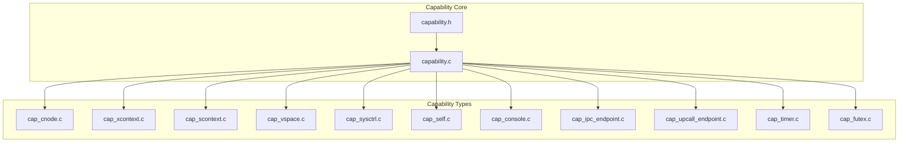
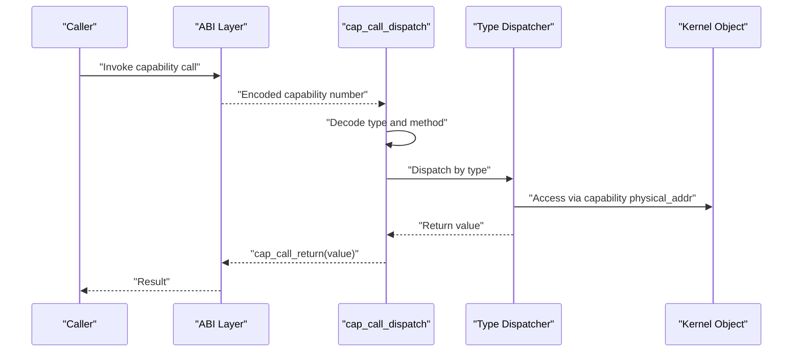
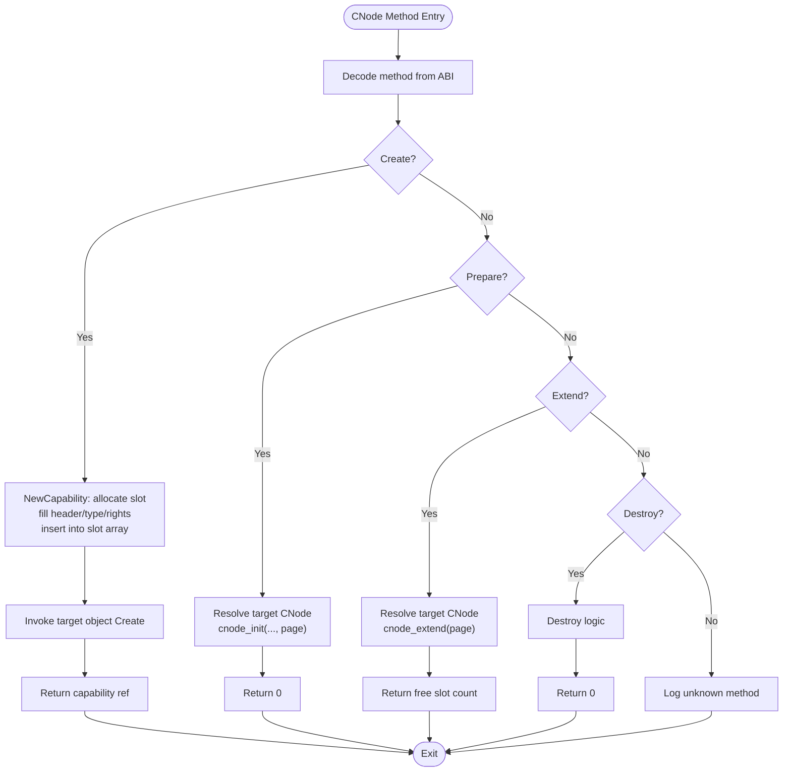
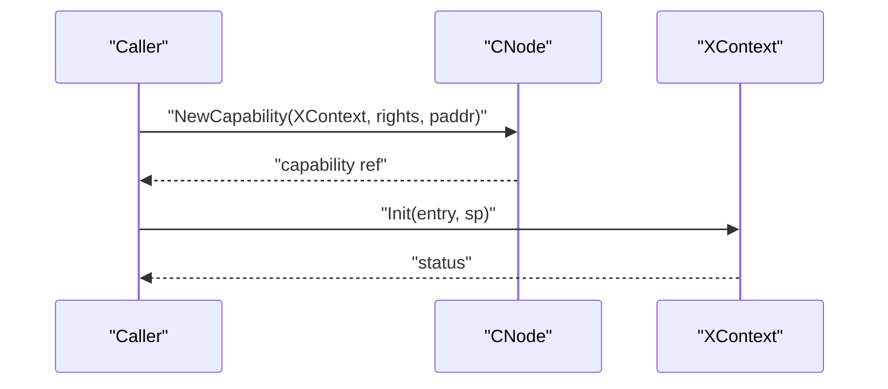
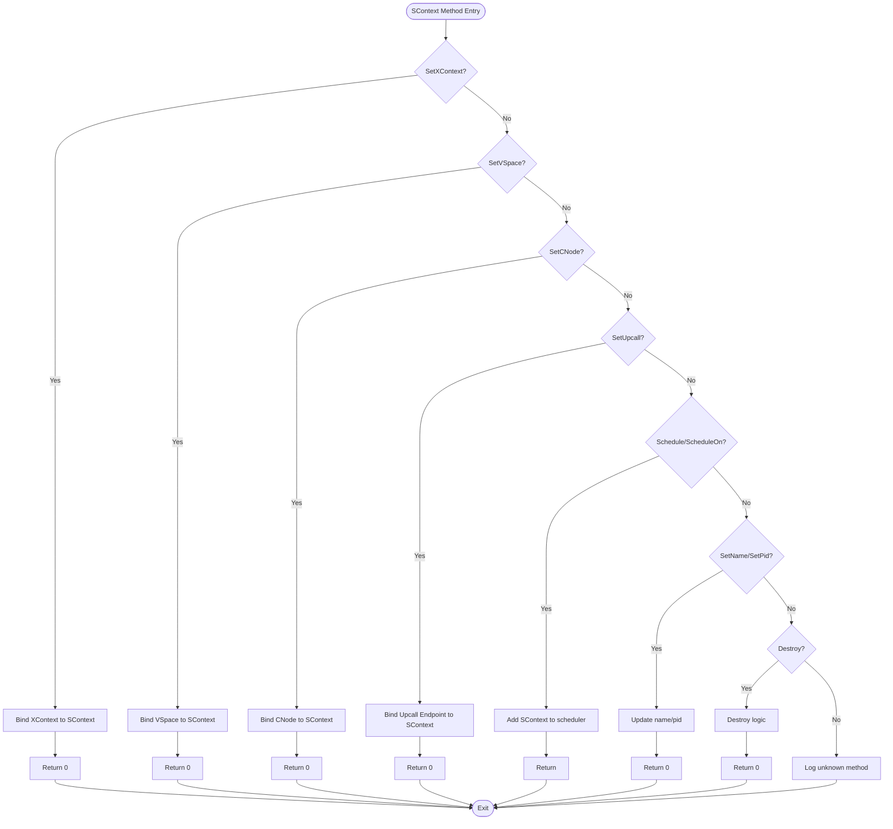
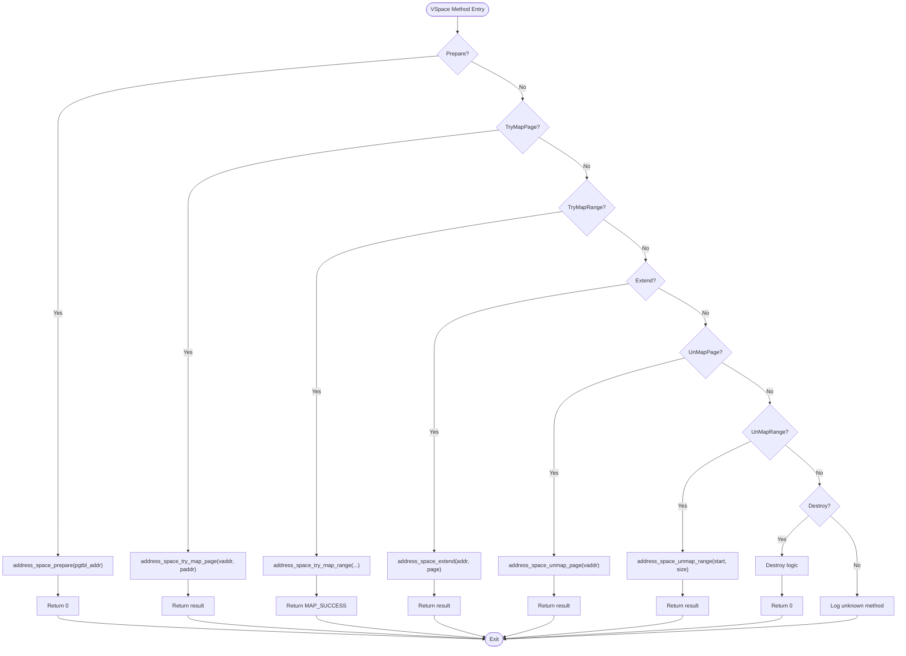
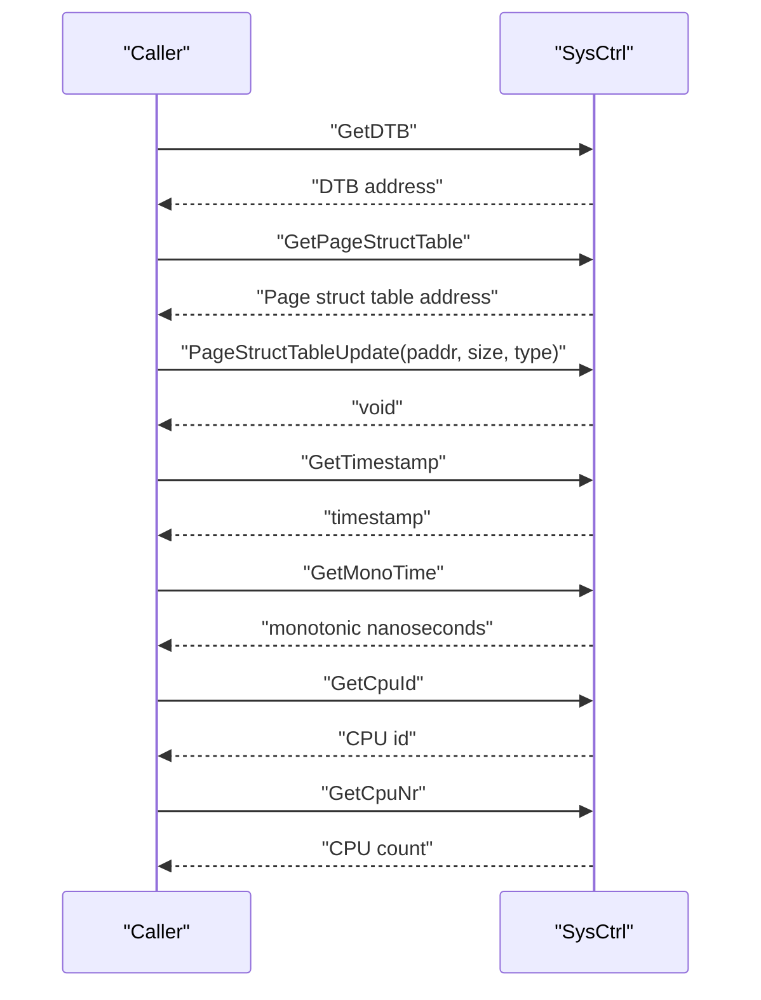
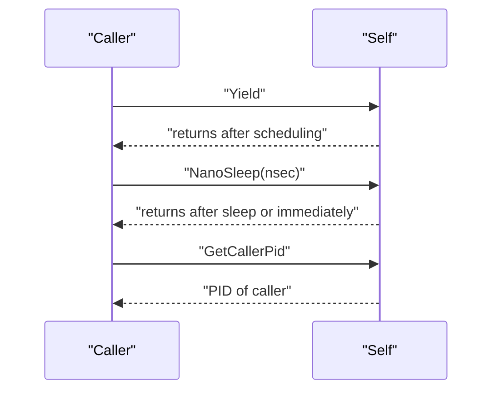
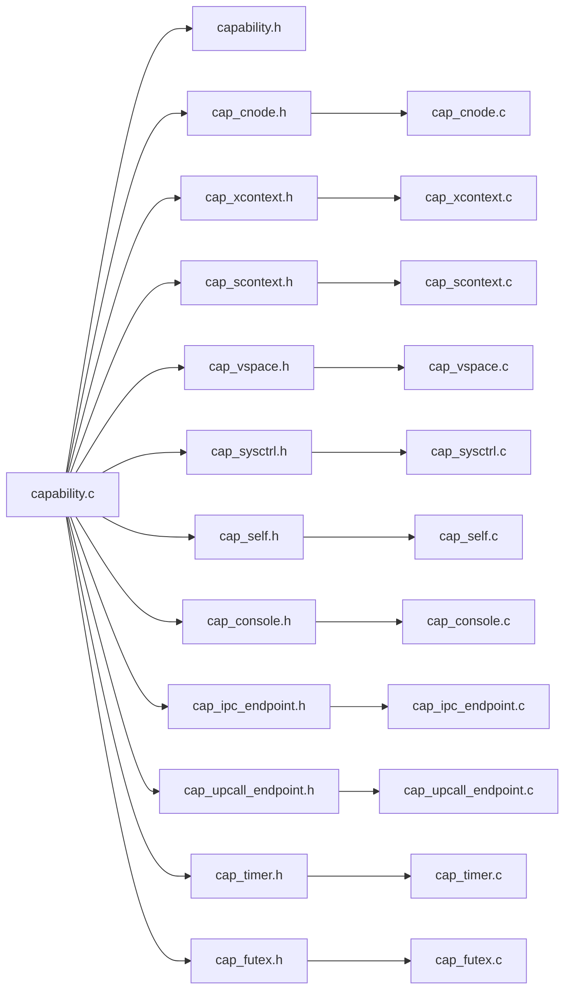

# Capability Objects and Types

<cite>
**Referenced Files in This Document**
- [capability.h](file://kernel/include/capability/capability.h)
- [capability.c](file://kernel/capability/capability.c)
- [cnode.h](file://kernel/include/capability/cnode.h)
- [cap_cnode.h](file://kernel/include/capability/cap_cnode.h)
- [cap_cnode.c](file://kernel/capability/cap_cnode.c)
- [cap_xcontext.h](file://kernel/include/capability/cap_xcontext.h)
- [cap_xcontext.c](file://kernel/capability/cap_xcontext.c)
- [cap_scontext.h](file://kernel/include/capability/cap_scontext.h)
- [cap_scontext.c](file://kernel/capability/cap_scontext.c)
- [cap_vspace.h](file://kernel/include/capability/cap_vspace.h)
- [cap_vspace.c](file://kernel/capability/cap_vspace.c)
- [cap_sysctrl.h](file://kernel/include/capability/cap_sysctrl.h)
- [cap_sysctrl.c](file://kernel/capability/cap_sysctrl.c)
- [cap_self.h](file://kernel/include/capability/cap_self.h)
- [cap_self.c](file://kernel/capability/cap_self.c)
- [cap_console.h](file://kernel/include/capability/cap_console.h)
- [cap_console.c](file://kernel/capability/cap_console.c)
- [cap_ipc_endpoint.h](file://kernel/include/capability/cap_ipc_endpoint.h)
- [cap_ipc_endpoint.c](file://kernel/capability/cap_ipc_endpoint.c)
- [cap_upcall_endpoint.h](file://kernel/include/capability/cap_upcall_endpoint.h)
- [cap_upcall_endpoint.c](file://kernel/capability/cap_upcall_endpoint.c)
- [cap_timer.h](file://kernel/include/capability/cap_timer.h)
- [cap_timer.c](file://kernel/capability/cap_timer.c)
- [cap_futex.h](file://kernel/include/capability/cap_futex.h)
- [cap_futex.c](file://kernel/capability/cap_futex.c)
</cite>

## Table of Contents
1. [Introduction](#introduction)
2. [Project Structure](#project-structure)
3. [Core Components](#core-components)
4. [Architecture Overview](#architecture-overview)
5. [Detailed Component Analysis](#detailed-component-analysis)
6. [Dependency Analysis](#dependency-analysis)
7. [Performance Considerations](#performance-considerations)
8. [Troubleshooting Guide](#troubleshooting-guide)
9. [Conclusion](#conclusion)

## Introduction
This document explains capability objects and their types in TranquilOS. Capabilities are the kernel’s primary security primitives: each capability encapsulates both an object identifier and a set of rights that define what operations are permitted against that object. The capability header carries the object type and rights, while the capability body stores a physical address pointing to the kernel object. Methods are invoked via a capability dispatch mechanism that decodes the capability type and method number from the ABI, then routes to the appropriate capability handler. This document covers the capability header, object identification, type-specific metadata, dispatch and invocation patterns, and practical examples of creation, manipulation, and destruction for each capability type.

## Project Structure
The capability subsystem is organized around a small set of core headers and per-type implementation files:
- Core capability definitions and dispatch: capability.h, capability.c
- Capability nodes (capability containers): cnode.h, cap_cnode.c
- Execution contexts: cap_xcontext.c
- Scheduling contexts: cap_scontext.c
- Virtual memory spaces: cap_vspace.c
- System control: cap_sysctrl.c
- Self operations: cap_self.c
- Console: cap_console.c
- IPC endpoint: cap_ipc_endpoint.c
- Upcall endpoint: cap_upcall_endpoint.c
- Timer: cap_timer.c
- Futex: cap_futex.c

**Diagram sources**
- [capability.h](file://kernel/include/capability/capability.h#L1-L26)
- [capability.c](file://kernel/capability/capability.c#L1-L58)
- [cap_cnode.c](file://kernel/capability/cap_cnode.c#L1-L184)
- [cap_xcontext.c](file://kernel/capability/cap_xcontext.c#L1-L68)
- [cap_scontext.c](file://kernel/capability/cap_scontext.c#L1-L462)
- [cap_vspace.c](file://kernel/capability/cap_vspace.c#L1-L243)
- [cap_sysctrl.c](file://kernel/capability/cap_sysctrl.c#L1-L96)
- [cap_self.c](file://kernel/capability/cap_self.c#L1-L89)
- [cap_console.c](file://kernel/capability/cap_console.c#L1-L12)
- [cap_ipc_endpoint.c](file://kernel/capability/cap_ipc_endpoint.c#L1-L12)
- [cap_upcall_endpoint.c](file://kernel/capability/cap_upcall_endpoint.c#L1-L12)
- [cap_timer.c](file://kernel/capability/cap_timer.c#L1-L12)
- [cap_futex.c](file://kernel/capability/cap_futex.c#L1-L12)

**Section sources**
- [capability.h](file://kernel/include/capability/capability.h#L1-L26)
- [capability.c](file://kernel/capability/capability.c#L1-L58)

## Core Components
- Capability header: Encodes object type and rights in a packed structure. The rights field is a bitmask controlling operations; CAP_RIGHT_ALL is defined as a full rights mask.
- Capability body: Contains the header plus a physical address pointing to the kernel object instance.
- Capability node (CNode): A container of capability slots backed by a dynamic array. It supports creation of typed capabilities, preparing/allocating child nodes, and extending capacity.
- Dispatch mechanism: capability.c decodes the capability number from the ABI, extracts capability type and method, performs a switch to the appropriate handler, and returns values via a dedicated return routine.

Key responsibilities:
- capability.h defines the header and capability structures and declares dispatch/return helpers.
- capability.c implements the dispatch router and return value setter.

**Section sources**
- [capability.h](file://kernel/include/capability/capability.h#L11-L25)
- [capability.c](file://kernel/capability/capability.c#L14-L58)

## Architecture Overview
The capability dispatch pipeline:
- The ABI encodes capability type and method into a single argument.
- capability.c reads the encoded value, splits it into capability type and method, and branches to the type-specific dispatcher.
- Each type dispatcher validates capability identity and rights, fetches the target object via the capability’s physical address, and executes the requested method.
- Results are returned via cap_call_return.

**Diagram sources**
- [capability.c](file://kernel/capability/capability.c#L14-L58)
- [capability.h](file://kernel/include/capability/capability.h#L22-L25)

## Detailed Component Analysis

### Capability Header and Object Identification
- Header fields:
  - type: 8-bit object type discriminator.
  - rights: 32-bit rights mask.
  - reserved: 24-bit padding/reserved bits.
- Object identification:
  - Each capability holds a physical address to the kernel object instance.
  - Capability references combine a CNode ID and a slot index to form a compact reference used across APIs.

Implementation highlights:
- capability.h defines the packed header and capability structures.
- Rights constants are defined per capability type via macros (e.g., CAP_CNode_RIGHT_*).

**Section sources**
- [capability.h](file://kernel/include/capability/capability.h#L11-L25)
- [cap_cnode.h](file://kernel/include/capability/cap_cnode.h#L7-L8)

### Capability Node (CNode)
Purpose:
- Container of capability slots; supports creating typed capabilities, preparing child nodes, and extending capacity.

Key operations:
- New capability creation: Validates free slots, constructs a capability with type/rights/physical address, inserts into the slot array, and triggers the newly created object’s Create method.
- Prepare: Initializes a child CNode at a target slot with a provided page.
- Extend: Extends a child CNode with a new page and returns free count.

Method enumeration:
- CAP_CNode_METHOD_Create
- CAP_CNode_METHOD_NewCapability
- CAP_CNode_METHOD_Prepare
- CAP_CNode_METHOD_Extend
- CAP_CNode_METHOD_Destroy

Rights model:
- Creation and destruction rights are represented by dedicated bit masks.

**Diagram sources**
- [cap_cnode.c](file://kernel/capability/cap_cnode.c#L163-L184)
- [cap_cnode.c](file://kernel/capability/cap_cnode.c#L23-L91)
- [cap_cnode.c](file://kernel/capability/cap_cnode.c#L93-L126)
- [cap_cnode.c](file://kernel/capability/cap_cnode.c#L128-L161)

**Section sources**
- [cap_cnode.h](file://kernel/include/capability/cap_cnode.h#L7-L11)
- [cap_cnode.c](file://kernel/capability/cap_cnode.c#L13-L184)
- [cnode.h](file://kernel/include/capability/cnode.h#L16-L28)

### XContext
Purpose:
- Represents an executable execution context (e.g., a thread’s CPU context) with entry point and stack pointer.

Key operations:
- Create: Typed allocation of an XContext from untyped memory (rights-checked in implementation).
- Init: Initialize an existing XContext with entry and stack pointer.
- Destroy: Placeholder for cleanup.

Rights model:
- Creation and destruction rights are represented by dedicated bit masks.

**Diagram sources**
- [cap_xcontext.c](file://kernel/capability/cap_xcontext.c#L9-L48)
- [cap_xcontext.h](file://kernel/include/capability/cap_xcontext.h#L7-L11)

**Section sources**
- [cap_xcontext.h](file://kernel/include/capability/cap_xcontext.h#L7-L11)
- [cap_xcontext.c](file://kernel/capability/cap_xcontext.c#L9-L68)

### SContext
Purpose:
- Represents a scheduling context bound to an XContext, virtual address space, and optional upcall endpoint.

Key operations:
- Create: Typed allocation of an SContext from untyped memory.
- SetCNode/SetCNodeCurrent: Bind a CNode to the SContext.
- SetXContext: Bind an XContext to the SContext.
- SetVSpace/SetVSpaceCurrent: Bind a VSpace to the SContext.
- SetUpcall: Bind an Upcall Endpoint to the SContext.
- Schedule/ScheduleOn: Add SContext to scheduler (locally or with affinity).
- SetName/SetPid: Configure metadata.
- Destroy: Placeholder for cleanup.

Rights model:
- Creation and destruction rights are represented by dedicated bit masks.

**Diagram sources**
- [cap_scontext.c](file://kernel/capability/cap_scontext.c#L192-L277)
- [cap_scontext.c](file://kernel/capability/cap_scontext.c#L279-L348)
- [cap_scontext.c](file://kernel/capability/cap_scontext.c#L420-L462)

**Section sources**
- [cap_scontext.h](file://kernel/include/capability/cap_scontext.h#L7-L11)
- [cap_scontext.c](file://kernel/capability/cap_scontext.c#L12-L462)

### VSpace
Purpose:
- Manages a virtual address space and page-table operations.

Key operations:
- Create: Typed allocation of a VSpace from untyped memory.
- Prepare: Prepare a VSpace with a supplied page table page.
- TryMapPage/TryMapRange: Attempt to map pages/ranges into the VSpace.
- UnMapPage/UnMapRange: Unmap pages/ranges from the VSpace.
- Extend: Extend the VSpace with a new page table page.
- Destroy: Placeholder for cleanup.

Rights model:
- Creation and destruction rights are represented by dedicated bit masks.

**Diagram sources**
- [cap_vspace.c](file://kernel/capability/cap_vspace.c#L15-L43)
- [cap_vspace.c](file://kernel/capability/cap_vspace.c#L49-L85)
- [cap_vspace.c](file://kernel/capability/cap_vspace.c#L87-L97)
- [cap_vspace.c](file://kernel/capability/cap_vspace.c#L99-L134)
- [cap_vspace.c](file://kernel/capability/cap_vspace.c#L137-L171)
- [cap_vspace.c](file://kernel/capability/cap_vspace.c#L173-L208)
- [cap_vspace.c](file://kernel/capability/cap_vspace.c#L213-L243)

**Section sources**
- [cap_vspace.h](file://kernel/include/capability/cap_vspace.h#L7-L11)
- [cap_vspace.c](file://kernel/capability/cap_vspace.c#L8-L243)

### SysCtrl
Purpose:
- Provides system-level control and introspection services.

Key operations:
- GetDTB: Returns the device tree blob address.
- GetPageStructTable: Returns the page structure table address.
- PageStructTableUpdate: Updates memory bank information.
- GetTimestamp/GetMonoTime: Returns timestamps.
- GetCpuId/GetCpuNr: Returns CPU identifiers and count.

Rights model:
- Creation and destruction rights are represented by dedicated bit masks.

**Diagram sources**
- [cap_sysctrl.c](file://kernel/capability/cap_sysctrl.c#L14-L57)
- [cap_sysctrl.c](file://kernel/capability/cap_sysctrl.c#L69-L96)

**Section sources**
- [cap_sysctrl.h](file://kernel/include/capability/cap_sysctrl.h#L7-L11)
- [cap_sysctrl.c](file://kernel/capability/cap_sysctrl.c#L14-L96)

### Self
Purpose:
- Provides self-related operations for the calling SContext.

Key operations:
- Yield: Voluntarily yield the processor.
- NanoSleep: Sleep for a specified nanosecond duration.
- GetCallerPid: Obtain the PID of the caller in IPC context.

Rights model:
- Creation and destruction rights are represented by dedicated bit masks.

**Diagram sources**
- [cap_self.c](file://kernel/capability/cap_self.c#L16-L53)
- [cap_self.c](file://kernel/capability/cap_self.c#L74-L89)

**Section sources**
- [cap_self.h](file://kernel/include/capability/cap_self.h#L7-L11)
- [cap_self.c](file://kernel/capability/cap_self.c#L16-L89)

### Console
Purpose:
- Provides console I/O capability.

Rights model:
- Creation and destruction rights are represented by dedicated bit masks.

Notes:
- Implementation currently stubbed; rights are declared.

**Section sources**
- [cap_console.h](file://kernel/include/capability/cap_console.h#L7-L11)
- [cap_console.c](file://kernel/capability/cap_console.c#L1-L12)

### IPC Endpoint
Purpose:
- Represents an IPC endpoint for inter-process communication.

Rights model:
- Creation and destruction rights are represented by dedicated bit masks.

Notes:
- Implementation currently stubbed; rights are declared.

**Section sources**
- [cap_ipc_endpoint.h](file://kernel/include/capability/cap_ipc_endpoint.h#L7-L11)
- [cap_ipc_endpoint.c](file://kernel/capability/cap_ipc_endpoint.c#L1-L12)

### Upcall Endpoint
Purpose:
- Represents an upcall endpoint for asynchronous notifications.

Rights model:
- Creation and destruction rights are represented by dedicated bit masks.

Notes:
- Implementation currently stubbed; rights are declared.

**Section sources**
- [cap_upcall_endpoint.h](file://kernel/include/capability/cap_upcall_endpoint.h#L7-L11)
- [cap_upcall_endpoint.c](file://kernel/capability/cap_upcall_endpoint.c#L1-L12)

### Timer
Purpose:
- Provides timer-related capability operations.

Rights model:
- Creation and destruction rights are represented by dedicated bit masks.

Notes:
- Implementation currently stubbed; rights are declared.

**Section sources**
- [cap_timer.h](file://kernel/include/capability/cap_timer.h#L7-L11)
- [cap_timer.c](file://kernel/capability/cap_timer.c#L1-L12)

### Futex
Purpose:
- Provides futex (fast userspace mutex) capability operations.

Rights model:
- Creation and destruction rights are represented by dedicated bit masks.

Notes:
- Implementation currently stubbed; rights are declared.

**Section sources**
- [cap_futex.h](file://kernel/include/capability/cap_futex.h#L7-L11)
- [cap_futex.c](file://kernel/capability/cap_futex.c#L1-L12)

## Dependency Analysis
- capability.c depends on per-type headers to route capability calls.
- Each type dispatcher depends on:
  - cnode.h for resolving capability references and accessing capability nodes.
  - Type-specific kernel objects (e.g., address_space for VSpace, scontext/xcontext for scheduling/exec contexts).
  - HAL/context interfaces for reading/writing registers during method invocation.

**Diagram sources**
- [capability.c](file://kernel/capability/capability.c#L1-L12)
- [capability.h](file://kernel/include/capability/capability.h#L1-L26)
- [cap_cnode.h](file://kernel/include/capability/cap_cnode.h#L1-L12)
- [cap_xcontext.h](file://kernel/include/capability/cap_xcontext.h#L1-L12)
- [cap_scontext.h](file://kernel/include/capability/cap_scontext.h#L1-L12)
- [cap_vspace.h](file://kernel/include/capability/cap_vspace.h#L1-L12)
- [cap_sysctrl.h](file://kernel/include/capability/cap_sysctrl.h#L1-L12)
- [cap_self.h](file://kernel/include/capability/cap_self.h#L1-L12)
- [cap_console.h](file://kernel/include/capability/cap_console.h#L1-L12)
- [cap_ipc_endpoint.h](file://kernel/include/capability/cap_ipc_endpoint.h#L1-L12)
- [cap_upcall_endpoint.h](file://kernel/include/capability/cap_upcall_endpoint.h#L1-L12)
- [cap_timer.h](file://kernel/include/capability/cap_timer.h#L1-L12)
- [cap_futex.h](file://kernel/include/capability/cap_futex.h#L1-L12)

**Section sources**
- [capability.c](file://kernel/capability/capability.c#L1-L58)

## Performance Considerations
- Dispatch overhead: Single switch on capability type with minimal branching; method dispatch is constant-time.
- Slot insertion: New capability creation uses a dynamic array; insertion cost scales with free-slot availability and array operations.
- VSpace operations: Page mapping/unmapping results depend on address_space implementation; batched operations (range) are intended to reduce overhead.
- Scheduling: Adding SContext to scheduler is O(1) per local scheduler; affinity scheduling may incur additional overhead depending on scheduler policy.

## Troubleshooting Guide
Common issues and diagnostics:
- Unknown capability type in dispatch: The router logs an error when encountering an unsupported type.
- Null context or capability node: Many handlers panic if scontext or cnode is null, indicating misuse of references or missing initialization.
- Target object not found: Handlers panic if the resolved capability does not match the expected type (e.g., expecting a VSpace but finding another type).
- No free slots: Creating a capability fails if the CNode has no free slots; callers should extend the node or manage references.
- Permission checks: The router currently has a TODO for permission checks; ensure callers pass valid rights and typed memory.

Remediation steps:
- Verify capability references carry the correct CNode ID and slot index.
- Ensure the capability’s physical address points to a properly initialized kernel object.
- Confirm rights masks align with intended operations (creation, destruction, etc.).
- Extend CNodes when encountering “no free slot” errors.

**Section sources**
- [capability.c](file://kernel/capability/capability.c#L50-L53)
- [cap_cnode.c](file://kernel/capability/cap_cnode.c#L34-L50)
- [cap_vspace.c](file://kernel/capability/cap_vspace.c#L33-L40)
- [cap_scontext.c](file://kernel/capability/cap_scontext.c#L19-L22)

## Conclusion
TranquilOS’ capability system centers on a compact header encoding type and rights, paired with a physical address to kernel objects. The dispatch mechanism cleanly routes method invocations to type-specific handlers, enabling secure and composable control over system resources. Each capability type exposes a focused set of operations—creating and initializing objects, binding them to scheduling and execution contexts, managing virtual memory, and providing system services—while enforcing rights and identity checks. The design supports practical workflows such as constructing execution threads, binding address spaces, and scheduling workloads, with clear extension points for additional capability types.