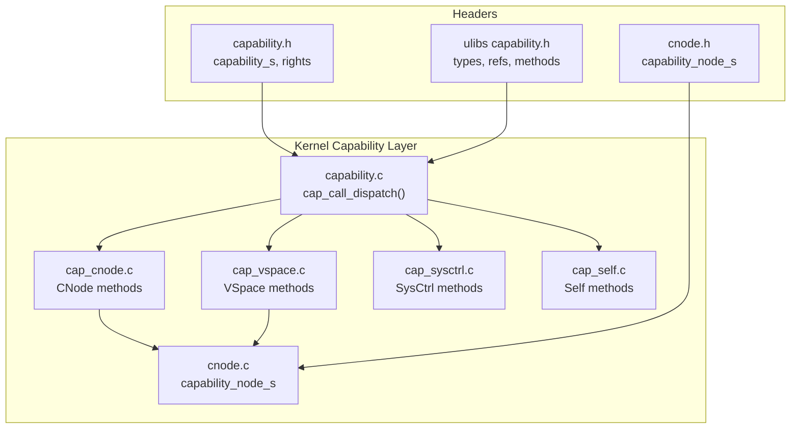
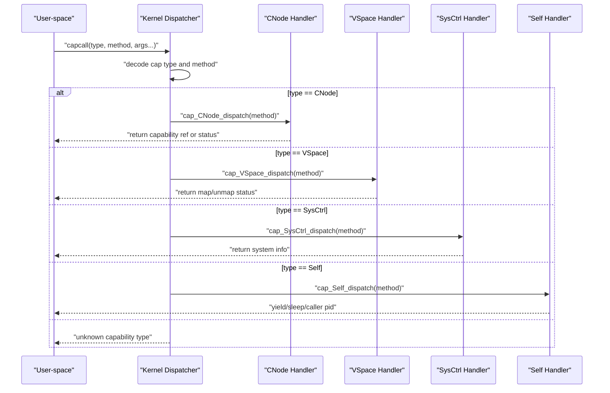
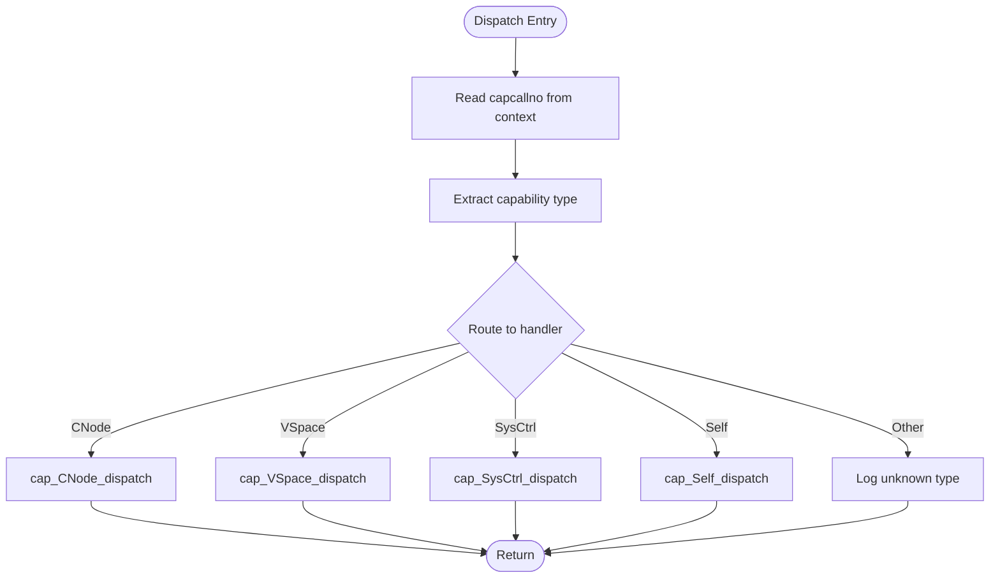
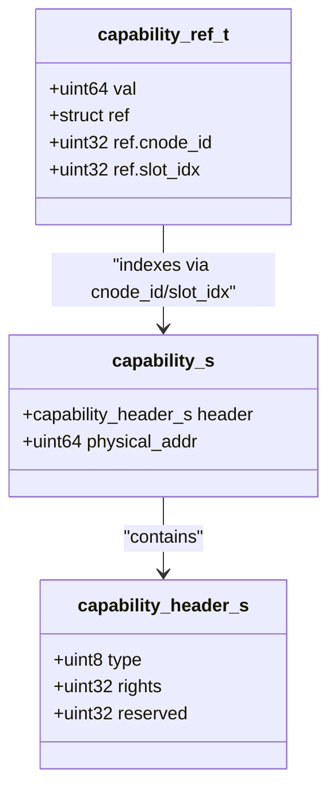
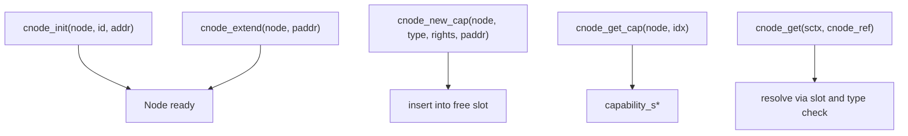
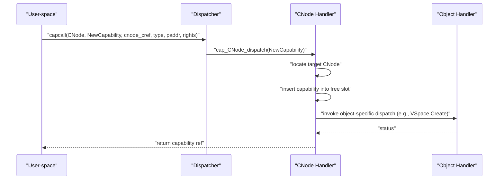
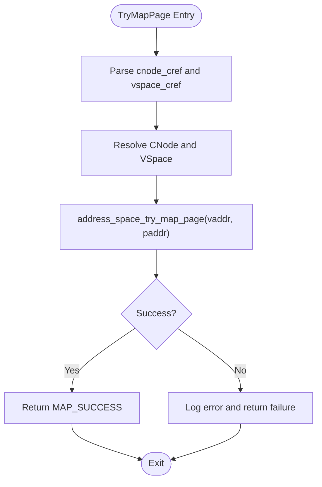
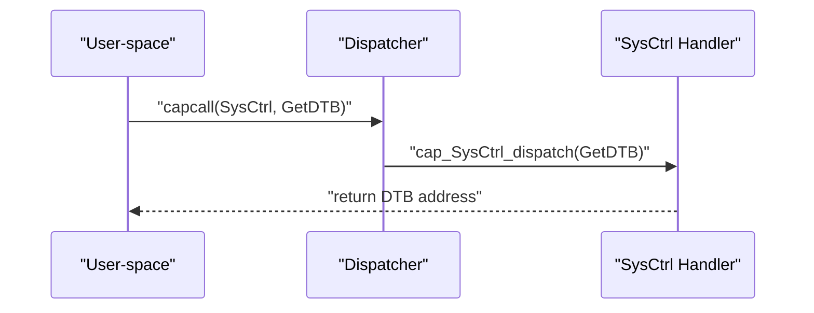
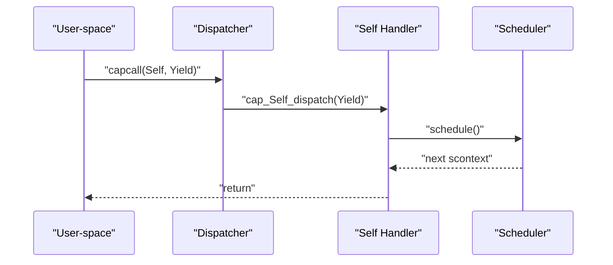
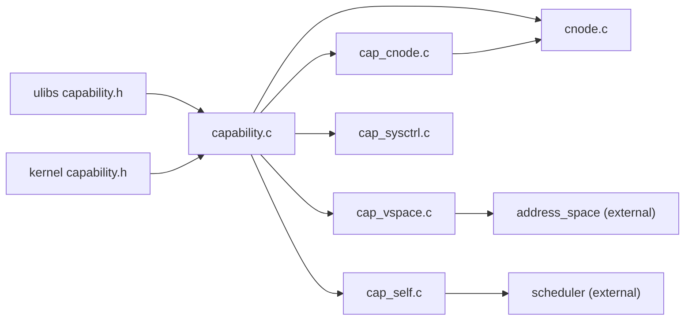

# Capability-Based Security System

<cite>
**Referenced Files in This Document**
- [capability.c](file://kernel/capability/capability.c)
- [capability.h](file://kernel/include/capability/capability.h)
- [cnode.c](file://kernel/capability/cnode.c)
- [cnode.h](file://kernel/include/capability/cnode.h)
- [cap_cnode.c](file://kernel/capability/cap_cnode.c)
- [cap_cnode.h](file://kernel/include/capability/cap_cnode.h)
- [cap_vspace.c](file://kernel/capability/cap_vspace.c)
- [cap_vspace.h](file://kernel/include/capability/cap_vspace.h)
- [cap_sysctrl.c](file://kernel/capability/cap_sysctrl.c)
- [cap_sysctrl.h](file://kernel/include/capability/cap_sysctrl.h)
- [cap_self.c](file://kernel/capability/cap_self.c)
- [cap_self.h](file://kernel/include/capability/cap_self.h)
- [capability.h](file://ulibs/include/libkernel/capability.h)
</cite>

## Table of Contents
1. [Introduction](#introduction)
2. [Project Structure](#project-structure)
3. [Core Components](#core-components)
4. [Architecture Overview](#architecture-overview)
5. [Detailed Component Analysis](#detailed-component-analysis)
6. [Dependency Analysis](#dependency-analysis)
7. [Performance Considerations](#performance-considerations)
8. [Troubleshooting Guide](#troubleshooting-guide)
9. [Conclusion](#conclusion)
10. [Appendices](#appendices)

## Introduction
This document explains the capability-based security model in TranquilOS. It covers the fundamental concepts of capabilities as the primary security primitive, the CNode (capability node) structure, capability creation and destruction, permission management, and the dispatch mechanism. It also documents how capabilities relate to system calls, inter-process communication (IPC), and resource management, and provides implementation details for capability manipulation, permission checking, and security enforcement. Practical examples, security boundaries, access control patterns, attack surface analysis, and best practices for capability-based programming are included.

## Project Structure
The capability subsystem spans kernel-side capability dispatchers, capability nodes, and user-space headers that define capability object types, method IDs, and capability references. The kernel exposes capability-based interfaces via a unified dispatcher that routes calls to specific capability handlers based on the capability type and method.

**Diagram sources**
- [capability.c](file://kernel/capability/capability.c#L14-L58)
- [capability.h](file://kernel/include/capability/capability.h#L11-L25)
- [cnode.c](file://kernel/capability/cnode.c#L9-L95)
- [cnode.h](file://kernel/include/capability/cnode.h#L11-L28)
- [cap_cnode.c](file://kernel/capability/cap_cnode.c#L163-L184)
- [cap_vspace.c](file://kernel/capability/cap_vspace.c#L213-L243)
- [cap_sysctrl.c](file://kernel/capability/cap_sysctrl.c#L69-L96)
- [cap_self.c](file://kernel/capability/cap_self.c#L74-L89)
- [capability.h](file://ulibs/include/libkernel/capability.h#L6-L141)

**Section sources**
- [capability.c](file://kernel/capability/capability.c#L14-L58)
- [capability.h](file://kernel/include/capability/capability.h#L11-L25)
- [cnode.c](file://kernel/capability/cnode.c#L9-L95)
- [cnode.h](file://kernel/include/capability/cnode.h#L11-L28)
- [capability.h](file://ulibs/include/libkernel/capability.h#L6-L141)

## Core Components
- Capability header and structure
  - The capability header encodes the object type and rights bitmap. The capability structure includes the header and a physical address pointing to the kernel object instance.
  - Rights are represented as a packed 32-bit field. A constant defines all rights set.

- Capability reference
  - A 64-bit capability reference encodes the capability node ID and slot index, enabling compact addressing of capabilities within a process’s capability table.

- Capability dispatch
  - The kernel extracts the capability type and method from the capability call number and dispatches to the appropriate handler. Permission checks are currently marked as TODO in the dispatcher.

- Capability nodes (CNodes)
  - A capability node is a typed container of capability slots backed by a dynamic array. It supports initialization, extension with new pages, and creation of typed capabilities with associated rights.

- Capability object types and methods
  - Kernel object types include CNode, Console, XContext, SContext, VSpace, SysCtrl, Self, IpcEndPoint, UpcallEndPoint, and others.
  - Methods are grouped per capability type (e.g., CNode methods include Create, NewCapability, Prepare, Extend, Destroy).

**Section sources**
- [capability.h](file://kernel/include/capability/capability.h#L9-L25)
- [capability.h](file://ulibs/include/libkernel/capability.h#L43-L50)
- [capability.c](file://kernel/capability/capability.c#L14-L58)
- [cnode.h](file://kernel/include/capability/cnode.h#L11-L28)
- [cnode.c](file://kernel/capability/cnode.c#L9-L95)
- [capability.h](file://ulibs/include/libkernel/capability.h#L6-L141)

## Architecture Overview
The capability-based architecture centers on capability references stored in a per-process capability node (CNode). Processes use these references to invoke methods on kernel objects. The dispatcher decodes the capability type and method, then invokes the corresponding capability handler. Handlers perform operations such as creating typed objects, preparing virtual memory mappings, or accessing system resources.

**Diagram sources**
- [capability.c](file://kernel/capability/capability.c#L14-L58)
- [cap_cnode.c](file://kernel/capability/cap_cnode.c#L163-L184)
- [cap_vspace.c](file://kernel/capability/cap_vspace.c#L213-L243)
- [cap_sysctrl.c](file://kernel/capability/cap_sysctrl.c#L69-L96)
- [cap_self.c](file://kernel/capability/cap_self.c#L74-L89)

## Detailed Component Analysis

### Capability Dispatch Mechanism
- The dispatcher reads the capability call number from the execution context and extracts the capability type and method.
- It routes to the appropriate capability handler based on the type.
- Permission checks are currently a placeholder and should be implemented to enforce rights before executing privileged operations.

**Diagram sources**
- [capability.c](file://kernel/capability/capability.c#L14-L58)

**Section sources**
- [capability.c](file://kernel/capability/capability.c#L14-L58)

### Capability Header and Reference Encoding
- The capability header stores:
  - type: 8 bits indicating the kernel object type
  - rights: 32 bits representing permissions
  - reserved: 24 bits padding
- The capability structure adds a physical address pointing to the kernel object instance.
- The capability reference encodes:
  - cnode_id: 32 bits identifying the capability node
  - slot_idx: 32 bits identifying the slot index within that node

**Diagram sources**
- [capability.h](file://kernel/include/capability/capability.h#L11-L25)
- [capability.h](file://ulibs/include/libkernel/capability.h#L43-L50)

**Section sources**
- [capability.h](file://kernel/include/capability/capability.h#L9-L25)
- [capability.h](file://ulibs/include/libkernel/capability.h#L43-L50)

### CNode (Capability Node) Structure and Operations
- Initialization
  - A CNode is initialized with an ID and backing storage (a dynamic array).
- Extension
  - Additional pages can be attached to expand the capability slot capacity.
- Capability Creation
  - Creates a typed capability with specified rights and physical address, inserting it into the first available slot.
- Retrieval and Resolution
  - Retrieves a capability from a given slot index.
  - Resolves a CNode reference to locate another CNode by traversing a slot that points to a CNode object.

**Diagram sources**
- [cnode.c](file://kernel/capability/cnode.c#L9-L95)
- [cnode.h](file://kernel/include/capability/cnode.h#L11-L28)

**Section sources**
- [cnode.c](file://kernel/capability/cnode.c#L9-L95)
- [cnode.h](file://kernel/include/capability/cnode.h#L11-L28)

### CNode Capability Methods
- Create
  - Placeholder for creating a new CNode from untyped memory; permission checks are pending.
- NewCapability
  - Creates a typed capability within a target CNode, invoking the corresponding object-specific dispatcher after insertion.
- Prepare
  - Initializes a target CNode by binding it to a page and generating a new CNode ID.
- Extend
  - Extends a target CNode by attaching an additional page.
- Destroy
  - Placeholder for destroying a CNode.

**Diagram sources**
- [cap_cnode.c](file://kernel/capability/cap_cnode.c#L23-L91)

**Section sources**
- [cap_cnode.c](file://kernel/capability/cap_cnode.c#L13-L184)
- [cap_cnode.h](file://kernel/include/capability/cap_cnode.h#L7-L11)

### Virtual Space (VSpace) Capability Methods
- Prepare
  - Prepares a VSpace object by binding a page table page to it.
- TryMapPage
  - Attempts to map a single page into the virtual address space.
- TryMapRange
  - Placeholder for mapping a contiguous range.
- UnMapPage
  - Unmaps a single page from the virtual address space.
- UnMapRange
  - Unmaps a contiguous range from the virtual address space.
- Extend
  - Extends the virtual address space by attaching a page table page.
- Destroy
  - Placeholder for destroying a VSpace.

**Diagram sources**
- [cap_vspace.c](file://kernel/capability/cap_vspace.c#L49-L85)

**Section sources**
- [cap_vspace.c](file://kernel/capability/cap_vspace.c#L15-L243)
- [cap_vspace.h](file://kernel/include/capability/cap_vspace.h#L7-L8)

### System Control (SysCtrl) Capability Methods
- GetDTB
  - Returns the device tree blob address.
- GetPageStructTable
  - Returns the page structure table address.
- PageStructTableUpdate
  - Updates memory bank information in the page structure table.
- GetTimestamp
  - Returns a timestamp value.
- GetMonoTime
  - Returns monotonic time from the timer manager.
- GetCpuId
  - Returns the current CPU ID.
- GetCpuNr
  - Returns the total number of CPUs.

**Diagram sources**
- [cap_sysctrl.c](file://kernel/capability/cap_sysctrl.c#L14-L44)

**Section sources**
- [cap_sysctrl.c](file://kernel/capability/cap_sysctrl.c#L14-L96)
- [cap_sysctrl.h](file://kernel/include/capability/cap_sysctrl.h#L7-L8)

### Self Capability Methods
- Yield
  - Yields the current scheduling context to the scheduler.
- NanoSleep
  - Sleeps for a specified nanosecond duration and reschedules.
- GetCallerPid
  - Retrieves the PID of the caller from the IPC endpoint’s caller context.

**Diagram sources**
- [cap_self.c](file://kernel/capability/cap_self.c#L16-L31)

**Section sources**
- [cap_self.c](file://kernel/capability/cap_self.c#L16-L89)
- [cap_self.h](file://kernel/include/capability/cap_self.h#L7-L8)

## Dependency Analysis
- Kernel capability dispatch depends on:
  - Capability header definitions
  - Capability node implementation
  - Per-object capability handlers
- Capability references depend on:
  - User-space capability header enumerations and encoding
- Object-specific handlers depend on:
  - Scheduling contexts for yielding and sleeping
  - Address spaces for virtual memory operations
  - Device tree and timer managers for system queries

**Diagram sources**
- [capability.c](file://kernel/capability/capability.c#L1-L12)
- [capability.h](file://kernel/include/capability/capability.h#L1-L26)
- [capability.h](file://ulibs/include/libkernel/capability.h#L6-L141)
- [cnode.c](file://kernel/capability/cnode.c#L1-L12)
- [cap_cnode.c](file://kernel/capability/cap_cnode.c#L1-L12)
- [cap_vspace.c](file://kernel/capability/cap_vspace.c#L1-L7)
- [cap_sysctrl.c](file://kernel/capability/cap_sysctrl.c#L1-L12)
- [cap_self.c](file://kernel/capability/cap_self.c#L1-L14)

**Section sources**
- [capability.c](file://kernel/capability/capability.c#L1-L12)
- [capability.h](file://kernel/include/capability/capability.h#L1-L26)
- [capability.h](file://ulibs/include/libkernel/capability.h#L6-L141)
- [cnode.c](file://kernel/capability/cnode.c#L1-L12)
- [cap_cnode.c](file://kernel/capability/cap_cnode.c#L1-L12)
- [cap_vspace.c](file://kernel/capability/cap_vspace.c#L1-L7)
- [cap_sysctrl.c](file://kernel/capability/cap_sysctrl.c#L1-L12)
- [cap_self.c](file://kernel/capability/cap_self.c#L1-L14)

## Performance Considerations
- Capability lookup and dispatch
  - The dispatcher performs a constant-time decode of capability type and method from the call number, minimizing overhead.
- CNode operations
  - Dynamic array expansion occurs on demand; repeated extensions may fragment memory. Consider pre-allocation strategies for high-throughput scenarios.
- Virtual memory mapping
  - Page mapping operations are O(1) per page; batch operations can reduce overhead.
- Scheduling and sleep
  - Yield and sleep operations trigger rescheduling; minimize unnecessary calls to reduce context-switch overhead.

[No sources needed since this section provides general guidance]

## Troubleshooting Guide
- Unknown capability type
  - The dispatcher logs an error when encountering an unsupported capability type. Verify the capability type enumeration and ensure the handler is implemented.
- Null CNode or capability
  - Handlers panic when a CNode or capability is null. Ensure the capability reference is valid and the CNode is prepared before use.
- Not a CNode capability
  - Attempting to resolve a non-CNode capability as a CNode triggers a panic. Confirm the capability type matches expectations.
- Free slots exhausted
  - Creating a capability fails if no free slots remain. Extend the CNode with additional pages before attempting to insert more capabilities.
- Permission checks TODO
  - Permission checks are not yet enforced in the dispatcher. Implement rights verification before executing sensitive operations.

**Section sources**
- [capability.c](file://kernel/capability/capability.c#L50-L53)
- [cnode.c](file://kernel/capability/cnode.c#L16-L21)
- [cnode.c](file://kernel/capability/cnode.c#L66-L90)
- [cap_cnode.c](file://kernel/capability/cap_cnode.c#L104-L126)
- [cap_vspace.c](file://kernel/capability/cap_vspace.c#L78-L82)

## Conclusion
TranquilOS implements a capability-based security model centered on capability references, capability nodes, and a unified dispatcher. Capabilities encapsulate authority via typed objects and rights bitmaps, while CNodes provide structured containers for capabilities. The dispatcher routes capability calls to specialized handlers that manage object lifecycle, virtual memory mapping, system queries, and scheduling primitives. Security enforcement relies on rights and future permission checks; robust permission verification, careful capability distribution, and strict access control patterns are essential for maintaining system integrity.

[No sources needed since this section summarizes without analyzing specific files]

## Appendices

### Practical Examples and Access Control Patterns
- Capability creation and distribution
  - Create a typed capability (e.g., VSpace) within a CNode and pass the capability reference to another process to grant mapping authority.
- Permission management
  - Assign minimal rights to each capability; avoid granting CAP_RIGHT_ALL unless absolutely necessary.
- Security boundaries
  - Use separate CNodes per subsystem to isolate capabilities and limit blast radius.
- IPC and capability passing
  - Pass capability references through IPC endpoints to enable controlled delegation of authority between processes.

[No sources needed since this section provides general guidance]

### Security Considerations and Attack Surface Analysis
- Privilege escalation
  - Risk exists if capabilities are not properly validated before use. Enforce rights checks in the dispatcher and handlers.
- Information disclosure
  - SysCtrl methods expose system information; restrict access to trusted processes only.
- Denial of service
  - Excessive capability creation or mapping can exhaust memory; implement quotas and limits.
- Capability theft
  - Protect capability references from interception; use secure IPC channels and avoid logging sensitive references.

[No sources needed since this section provides general guidance]