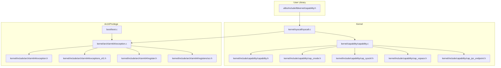
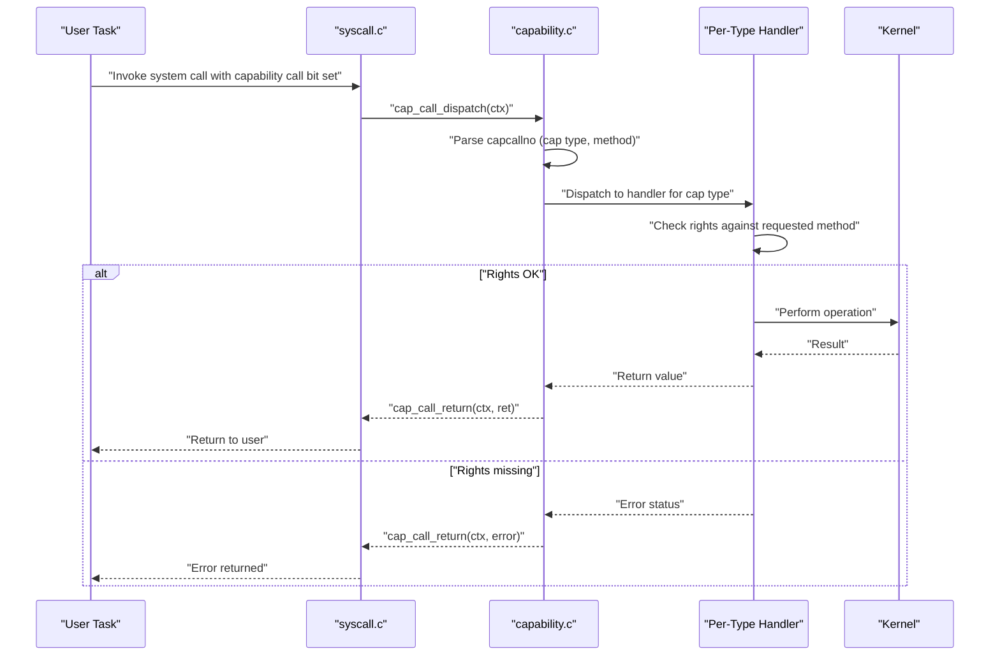
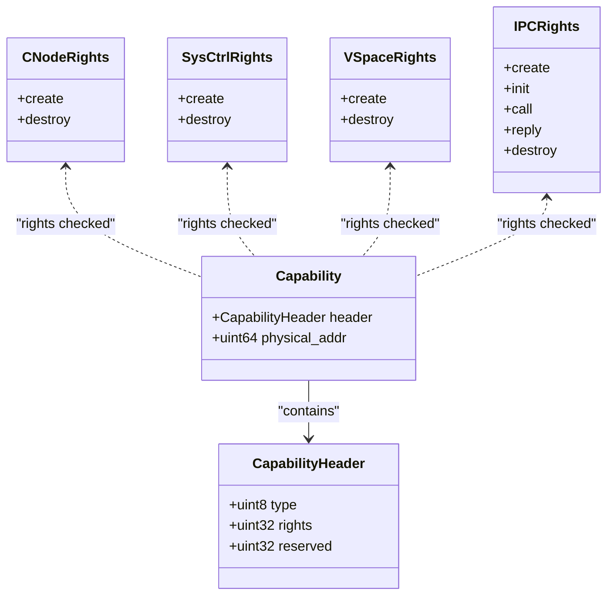
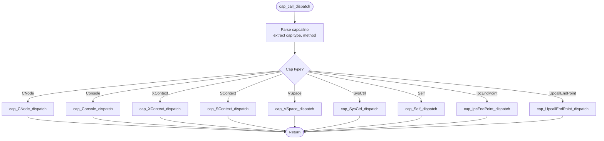
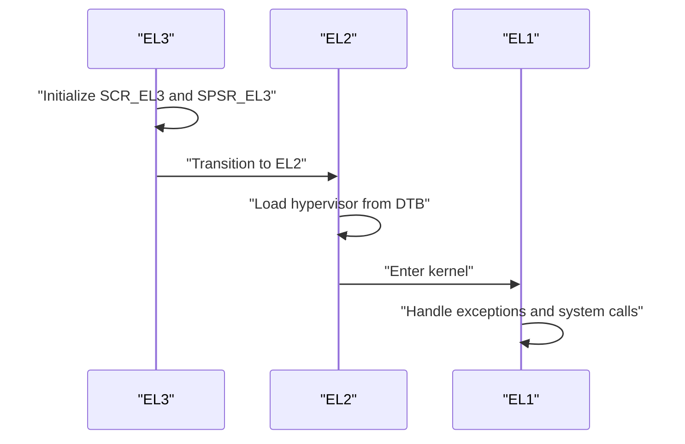
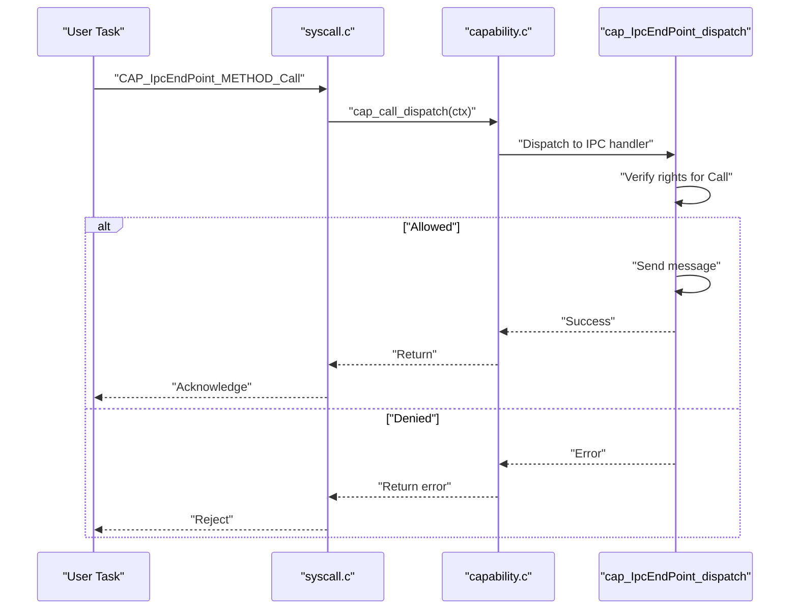
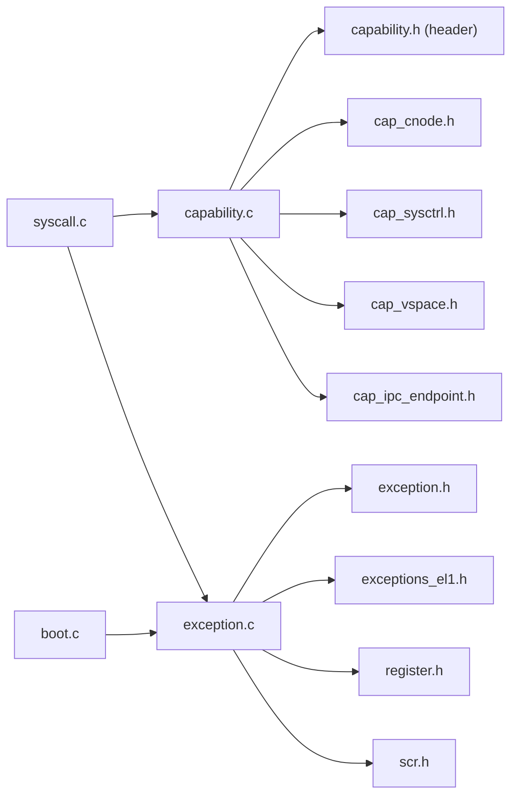
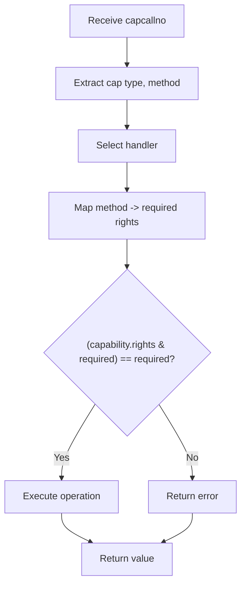

# Permission System and Security Enforcement

<cite>
**Referenced Files in This Document**
- [capability.h](file://kernel/include/capability/capability.h)
- [capability.c](file://kernel/capability/capability.c)
- [cap_cnode.h](file://kernel/include/capability/cap_cnode.h)
- [cap_sysctrl.h](file://kernel/include/capability/cap_sysctrl.h)
- [cap_vspace.h](file://kernel/include/capability/cap_vspace.h)
- [cap_ipc_endpoint.h](file://kernel/include/capability/cap_ipc_endpoint.h)
- [capability.h](file://ulibs/include/libkernel/capability.h)
- [syscall.c](file://kernel/syscall/syscall.c)
- [exception.c](file://kernel/arch/arm64/exception.c)
- [exception.h](file://kernel/include/arch/arm64/exception.h)
- [exceptions_el1.h](file://kernel/include/arch/arm64/exceptions_el1.h)
- [register.h](file://kernel/include/arch/arm64/register.h)
- [scr.h](file://kernel/include/arch/arm64/registers/scr.h)
- [boot.c](file://boot/boot.c)
</cite>

## Table of Contents
1. [Introduction](#introduction)
2. [Project Structure](#project-structure)
3. [Core Components](#core-components)
4. [Architecture Overview](#architecture-overview)
5. [Detailed Component Analysis](#detailed-component-analysis)
6. [Dependency Analysis](#dependency-analysis)
7. [Performance Considerations](#performance-considerations)
8. [Troubleshooting Guide](#troubleshooting-guide)
9. [Conclusion](#conclusion)
10. [Appendices](#appendices)

## Introduction
This document explains the permission system and security enforcement mechanisms in the TranquilOS capability-based security model. It covers how capabilities represent rights, how permission checks are performed during capability calls, and how security boundaries are enforced across privilege levels (EL0, EL1, EL2). It also documents the relationship between capability rights and system operations, permission delegation and revocation via capability nodes, and the integration between capabilities and system calls, IPC, and resource access patterns. Practical examples, security considerations, and debugging approaches are included.

## Project Structure
The capability system spans kernel headers and implementations, userland library definitions, system call dispatch, and ARM64 privilege-level handling. The most relevant areas are:
- Capability metadata and dispatch: kernel/include/capability and kernel/capability
- Capability method enumerations and object types: ulibs/include/libkernel/capability.h
- System call entry and capability call routing: kernel/syscall/syscall.c
- Privilege-level exception handling and register definitions: kernel/arch/arm64/*
- Hypervisor bootstrap and EL2 entry: boot/boot.c

**Diagram sources**
- [capability.c](file://kernel/capability/capability.c#L1-L58)
- [capability.h](file://kernel/include/capability/capability.h#L1-L26)
- [cap_cnode.h](file://kernel/include/capability/cap_cnode.h#L1-L12)
- [cap_sysctrl.h](file://kernel/include/capability/cap_sysctrl.h#L1-L12)
- [cap_vspace.h](file://kernel/include/capability/cap_vspace.h#L1-L12)
- [cap_ipc_endpoint.h](file://kernel/include/capability/cap_ipc_endpoint.h#L1-L12)
- [capability.h](file://ulibs/include/libkernel/capability.h#L1-L141)
- [syscall.c](file://kernel/syscall/syscall.c#L1-L20)
- [exception.c](file://kernel/arch/arm64/exception.c#L1-L119)
- [exception.h](file://kernel/include/arch/arm64/exception.h#L1-L113)
- [exceptions_el1.h](file://kernel/include/arch/arm64/exceptions_el1.h#L1-L26)
- [register.h](file://kernel/include/arch/arm64/register.h#L1-L53)
- [scr.h](file://kernel/include/arch/arm64/registers/scr.h#L1-L52)
- [boot.c](file://boot/boot.c#L114-L175)

**Section sources**
- [capability.c](file://kernel/capability/capability.c#L1-L58)
- [capability.h](file://kernel/include/capability/capability.h#L1-L26)
- [capability.h](file://ulibs/include/libkernel/capability.h#L1-L141)
- [syscall.c](file://kernel/syscall/syscall.c#L1-L20)
- [exception.c](file://kernel/arch/arm64/exception.c#L1-L119)
- [exception.h](file://kernel/include/arch/arm64/exception.h#L1-L113)
- [exceptions_el1.h](file://kernel/include/arch/arm64/exceptions_el1.h#L1-L26)
- [register.h](file://kernel/include/arch/arm64/register.h#L1-L53)
- [scr.h](file://kernel/include/arch/arm64/registers/scr.h#L1-L52)
- [boot.c](file://boot/boot.c#L114-L175)

## Core Components
- Capability representation and header:
  - A capability consists of a typed header containing an object type and a rights bitmap, plus a physical address field. Rights are 32-bit flags packed into the header.
  - Reference: [capability.h](file://kernel/include/capability/capability.h#L11-L20)

- Capability call dispatch:
  - The kernel routes capability calls based on the capability type extracted from the capability call number. The dispatcher branches to per-object handlers (e.g., CNode, Console, XContext, SContext, VSpace, SysCtrl, Self, IPC endpoint, Upcall endpoint).
  - Permission checks are currently marked as TODO in the dispatcher.
  - Reference: [capability.c](file://kernel/capability/capability.c#L14-L54)

- Capability method enumerations and object types:
  - The user library defines kernel object types and method enums for each capability class (e.g., CNode, Console, SysCtrl, VSpace, IPC endpoint, Upcall endpoint, XContext, SContext, Self).
  - References:
    - [capability.h](file://ulibs/include/libkernel/capability.h#L6-L41)
    - [capability.h](file://ulibs/include/libkernel/capability.h#L52-L139)

- System call entry and capability routing:
  - The system call entrypoint detects whether a call is a capability call (mask test) and dispatches accordingly. After dispatch, the kernel switches to user mode with appropriate address spaces.
  - Reference: [syscall.c](file://kernel/syscall/syscall.c#L8-L20)

- Privilege-level handling:
  - Exception handling reads ESR/FAR depending on current privilege level (EL1 or EL2) and dumps register state for debugging. Privilege-level vectors and exception entry points are declared for EL1.
  - References:
    - [exception.c](file://kernel/arch/arm64/exception.c#L22-L45)
    - [exception.c](file://kernel/arch/arm64/exception.c#L47-L106)
    - [exception.h](file://kernel/include/arch/arm64/exception.h#L1-L113)
    - [exceptions_el1.h](file://kernel/include/arch/arm64/exceptions_el1.h#L1-L26)

- Hypervisor bootstrap and EL2:
  - The boot code initializes EL3 and transitions to EL2 on the primary CPU, loading a hypervisor entry from device tree.
  - Reference: [boot.c](file://boot/boot.c#L114-L175)

**Section sources**
- [capability.h](file://kernel/include/capability/capability.h#L11-L20)
- [capability.c](file://kernel/capability/capability.c#L14-L54)
- [capability.h](file://ulibs/include/libkernel/capability.h#L6-L41)
- [capability.h](file://ulibs/include/libkernel/capability.h#L52-L139)
- [syscall.c](file://kernel/syscall/syscall.c#L8-L20)
- [exception.c](file://kernel/arch/arm64/exception.c#L22-L45)
- [exception.c](file://kernel/arch/arm64/exception.c#L47-L106)
- [exception.h](file://kernel/include/arch/arm64/exception.h#L1-L113)
- [exceptions_el1.h](file://kernel/include/arch/arm64/exceptions_el1.h#L1-L26)
- [boot.c](file://boot/boot.c#L114-L175)

## Architecture Overview
The capability-based security model routes user requests through a capability call interface. Each capability carries a rights bitmap indicating permitted operations. The kernel dispatches to specialized handlers per capability type and enforces access control by verifying rights against requested operations.

**Diagram sources**
- [syscall.c](file://kernel/syscall/syscall.c#L8-L20)
- [capability.c](file://kernel/capability/capability.c#L14-L54)

## Detailed Component Analysis

### Capability Representation and Rights
- Structure:
  - Header includes object type (8 bits) and rights (32 bits), with reserved padding.
  - Physical address field anchors the capability’s backing object.
- Rights semantics:
  - Rights are defined per capability class (e.g., CNode, SysCtrl, VSpace, IPC endpoint) as bit flags.
  - Example rights constants:
    - CNode: create, destroy
    - SysCtrl: create, destroy
    - VSpace: create, destroy
    - IPC endpoint: create, init, call, reply, destroy
- Access control:
  - Handlers must verify that the caller’s rights include the required bits for the requested method.

**Diagram sources**
- [capability.h](file://kernel/include/capability/capability.h#L11-L20)
- [cap_cnode.h](file://kernel/include/capability/cap_cnode.h#L7-L8)
- [cap_sysctrl.h](file://kernel/include/capability/cap_sysctrl.h#L7-L8)
- [cap_vspace.h](file://kernel/include/capability/cap_vspace.h#L7-L8)
- [cap_ipc_endpoint.h](file://kernel/include/capability/cap_ipc_endpoint.h#L7-L8)

**Section sources**
- [capability.h](file://kernel/include/capability/capability.h#L11-L20)
- [cap_cnode.h](file://kernel/include/capability/cap_cnode.h#L7-L8)
- [cap_sysctrl.h](file://kernel/include/capability/cap_sysctrl.h#L7-L8)
- [cap_vspace.h](file://kernel/include/capability/cap_vspace.h#L7-L8)
- [cap_ipc_endpoint.h](file://kernel/include/capability/cap_ipc_endpoint.h#L7-L8)

### Capability Call Dispatch and Permission Checking
- Dispatch logic:
  - Extracts capability type and method from the capability call number.
  - Branches to per-type handlers after a TODO placeholder for permission checks.
- Permission enforcement:
  - Right verification must be implemented in each handler before performing operations.
  - Delegation and revocation are modeled by manipulating capability nodes and updating rights bitmaps.

**Diagram sources**
- [capability.c](file://kernel/capability/capability.c#L14-L54)

**Section sources**
- [capability.c](file://kernel/capability/capability.c#L14-L54)

### Privilege Levels and Security Isolation
- Privilege-level exception handling:
  - Reads ESR/FAR depending on current level (EL1 or EL2) and dumps registers for diagnostics.
- EL2 bootstrap:
  - EL3 initializes secure configuration and SPSR, then transitions to EL2 on primary CPU, invoking a hypervisor entry located via device tree.
- Security implications:
  - EL2 provides isolation and control for virtualization layers.
  - EL1 handles normal kernel operations with appropriate privilege checks.

**Diagram sources**
- [boot.c](file://boot/boot.c#L138-L175)
- [exception.c](file://kernel/arch/arm64/exception.c#L22-L45)

**Section sources**
- [exception.c](file://kernel/arch/arm64/exception.c#L22-L45)
- [boot.c](file://boot/boot.c#L138-L175)

### Integration with System Calls, IPC, and Resource Access
- System call entry:
  - Detects capability calls and invokes capability dispatch; switches to user mode afterward.
- IPC endpoints:
  - Capabilities expose create, init, call, reply, destroy methods; rights govern who can establish endpoints and exchange messages.
- Virtual spaces:
  - Rights enable creation and destruction of address spaces; mapping/unmapping requires additional checks in handlers.

**Diagram sources**
- [syscall.c](file://kernel/syscall/syscall.c#L8-L20)
- [capability.c](file://kernel/capability/capability.c#L44-L46)
- [cap_ipc_endpoint.h](file://kernel/include/capability/cap_ipc_endpoint.h#L126-L132)

**Section sources**
- [syscall.c](file://kernel/syscall/syscall.c#L8-L20)
- [capability.c](file://kernel/capability/capability.c#L44-L46)
- [cap_ipc_endpoint.h](file://kernel/include/capability/cap_ipc_endpoint.h#L126-L132)

## Dependency Analysis
- Kernel capability dispatch depends on:
  - Capability call number parsing and capability type identification
  - Per-type handler availability
- Handlers depend on:
  - Capability rights definitions
  - Underlying kernel subsystems (address spaces, IPC, devices)
- System call entry depends on:
  - Capability call detection mask
  - Context switching to user mode

**Diagram sources**
- [syscall.c](file://kernel/syscall/syscall.c#L1-L20)
- [capability.c](file://kernel/capability/capability.c#L1-L58)
- [capability.h](file://kernel/include/capability/capability.h#L1-L26)
- [cap_cnode.h](file://kernel/include/capability/cap_cnode.h#L1-L12)
- [cap_sysctrl.h](file://kernel/include/capability/cap_sysctrl.h#L1-L12)
- [cap_vspace.h](file://kernel/include/capability/cap_vspace.h#L1-L12)
- [cap_ipc_endpoint.h](file://kernel/include/capability/cap_ipc_endpoint.h#L1-L12)
- [exception.c](file://kernel/arch/arm64/exception.c#L1-L119)
- [exception.h](file://kernel/include/arch/arm64/exception.h#L1-L113)
- [exceptions_el1.h](file://kernel/include/arch/arm64/exceptions_el1.h#L1-L26)
- [register.h](file://kernel/include/arch/arm64/register.h#L1-L53)
- [scr.h](file://kernel/include/arch/arm64/registers/scr.h#L1-L52)
- [boot.c](file://boot/boot.c#L114-L175)

**Section sources**
- [syscall.c](file://kernel/syscall/syscall.c#L1-L20)
- [capability.c](file://kernel/capability/capability.c#L1-L58)
- [capability.h](file://kernel/include/capability/capability.h#L1-L26)
- [cap_cnode.h](file://kernel/include/capability/cap_cnode.h#L1-L12)
- [cap_sysctrl.h](file://kernel/include/capability/cap_sysctrl.h#L1-L12)
- [cap_vspace.h](file://kernel/include/capability/cap_vspace.h#L1-L12)
- [cap_ipc_endpoint.h](file://kernel/include/capability/cap_ipc_endpoint.h#L1-L12)
- [exception.c](file://kernel/arch/arm64/exception.c#L1-L119)
- [exception.h](file://kernel/include/arch/arm64/exception.h#L1-L113)
- [exceptions_el1.h](file://kernel/include/arch/arm64/exceptions_el1.h#L1-L26)
- [register.h](file://kernel/include/arch/arm64/register.h#L1-L53)
- [scr.h](file://kernel/include/arch/arm64/registers/scr.h#L1-L52)
- [boot.c](file://boot/boot.c#L114-L175)

## Performance Considerations
- Capability dispatch overhead:
  - Minimal branching per call; ensure right checks are fast bit tests.
- Context switching:
  - System call return path performs address space switch and user-mode transition; keep capability handlers efficient to minimize latency.
- Memory layout:
  - Capability headers are packed; maintain compact layouts to reduce cache pressure.

[No sources needed since this section provides general guidance]

## Troubleshooting Guide
- Debugging capability violations:
  - Use exception handling to dump registers and syndrome/fault information for EL1/EL2 faults.
  - Inspect ESR and FAR to identify permission or translation faults.
- Logging:
  - Kernel logs include exception details and register dumps to aid diagnosis.
- Practical steps:
  - Verify capability rights before invoking methods.
  - Confirm capability type matches the intended handler.
  - Check privilege level transitions and EL2 bootstrap correctness.

**Section sources**
- [exception.c](file://kernel/arch/arm64/exception.c#L22-L45)
- [exception.c](file://kernel/arch/arm64/exception.c#L47-L106)
- [exception.h](file://kernel/include/arch/arm64/exception.h#L39-L76)

## Conclusion
TranquilOS implements a capability-based security model where each capability carries explicit rights and is dispatched to specialized handlers. Permission enforcement is currently deferred to handlers and must be implemented to validate rights against requested operations. Privilege-level handling supports EL1 and EL2 isolation, with EL2 bootstrap managed by the boot stage. Integrations with system calls, IPC, and virtual memory rely on capability rights to gate operations. Robust auditing and debugging facilities are available through exception handling and logging.

[No sources needed since this section summarizes without analyzing specific files]

## Appendices

### Permission Checking Algorithm Outline
- Input: capability header (type, rights), requested method
- Steps:
  1. Extract capability type and method from the capability call number.
  2. Route to the per-type handler.
  3. Map method to a required rights bit.
  4. Bitwise AND of capability rights with required rights.
  5. If result equals required rights, proceed; otherwise, return denial.
- Output: success or error status

[No sources needed since this diagram shows conceptual workflow, not actual code structure]

### Security Considerations
- Side-channel attacks:
  - Minimize timing differences across permission checks; avoid branching on secret data.
- Privilege abuse prevention:
  - Enforce strict rights checks in all handlers; avoid granting unnecessary rights.
- Secure capability manipulation:
  - Protect capability nodes and rights updates with appropriate synchronization and validation.

[No sources needed since this section provides general guidance]