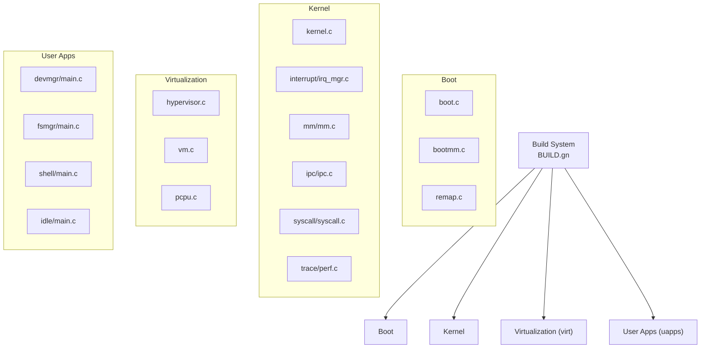
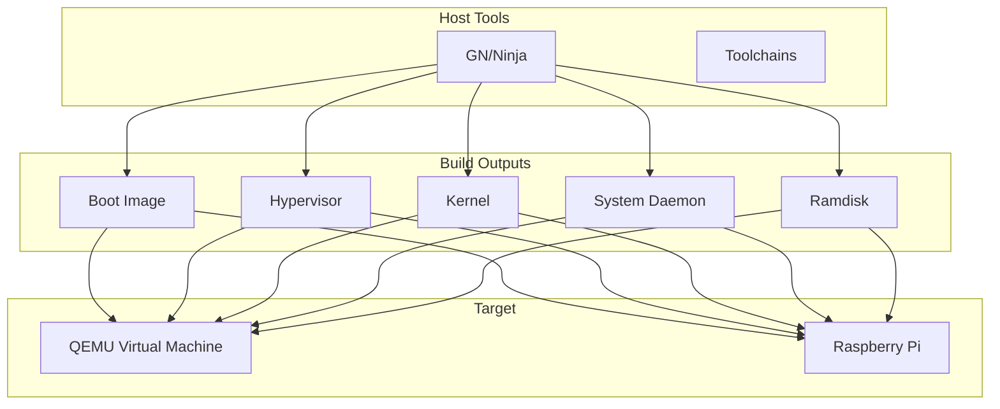
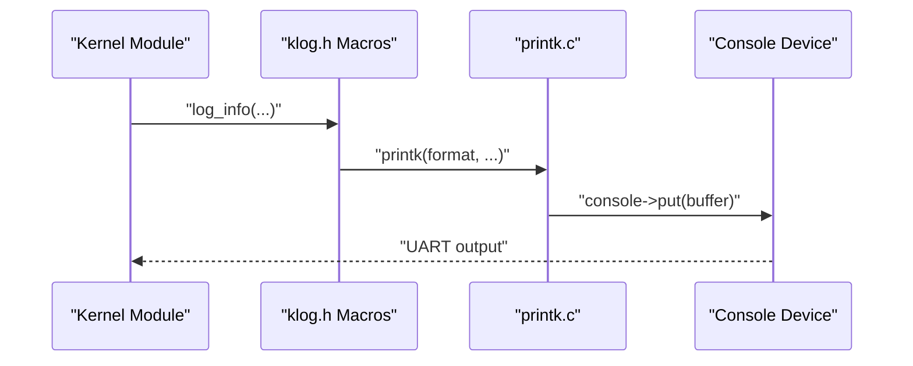
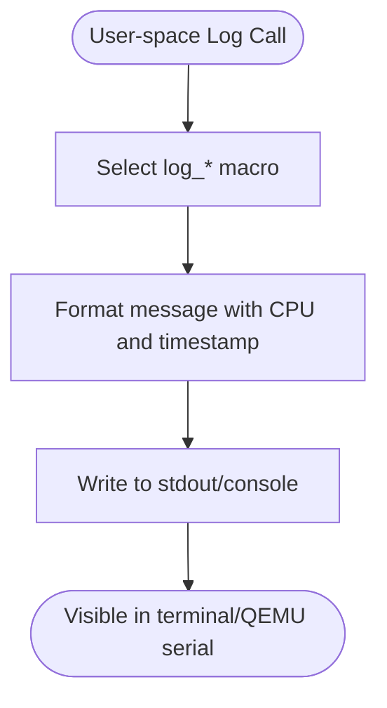
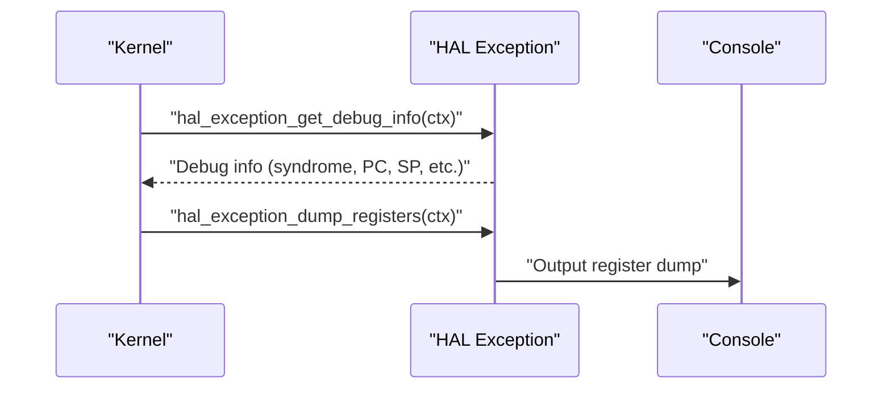
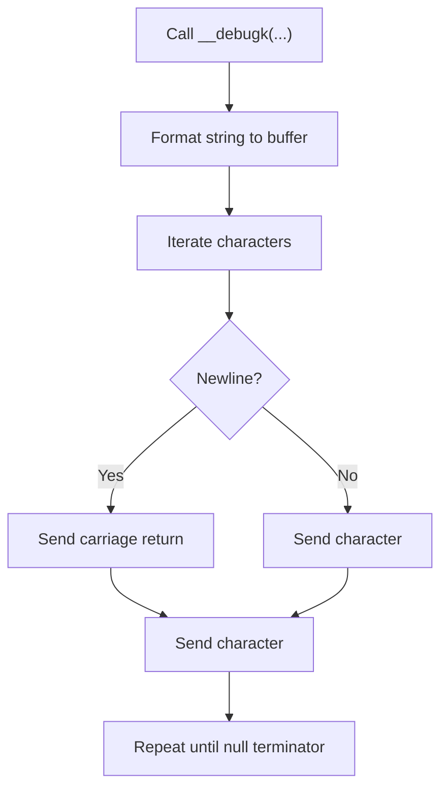
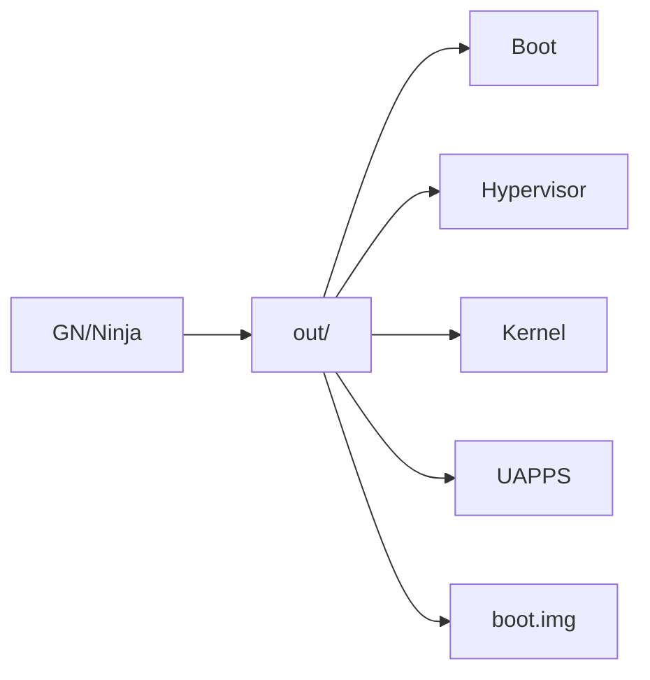

# Development and Testing

<cite>
**Referenced Files in This Document**
- [README.md](file://README.md)
- [env_setup.sh](file://env_setup.sh)
- [BUILD.gn](file://BUILD.gn)
- [run_qemu_virt.sh](file://run_qemu_virt.sh)
- [scripts/build_qemu.sh](file://scripts/build_qemu.sh)
- [scripts/mkimg.sh](file://scripts/mkimg.sh)
- [run_board_cm4.sh](file://run_board_cm4.sh)
- [kernel/include/debug.h](file://kernel/include/debug.h)
- [kernel/printk.c](file://kernel/printk.c)
- [kernel/include/klog.h](file://kernel/include/klog.h)
- [kernel/include/arch/generic/hal_exception.h](file://kernel/include/arch/generic/hal_exception.h)
- [uapps/devmgr/include/log.h](file://uapps/devmgr/include/log.h)
- [uapps/fsmgr/include/log.h](file://uapps/fsmgr/include/log.h)
- [uapps/idle/include/log.h](file://uapps/idle/include/log.h)
- [toolchains/README.md](file://toolchains/README.md)
</cite>

## Table of Contents
1. [Introduction](#introduction)
2. [Project Structure](#project-structure)
3. [Core Components](#core-components)
4. [Architecture Overview](#architecture-overview)
5. [Detailed Component Analysis](#detailed-component-analysis)
6. [Dependency Analysis](#dependency-analysis)
7. [Performance Considerations](#performance-considerations)
8. [Troubleshooting Guide](#troubleshooting-guide)
9. [Conclusion](#conclusion)
10. [Appendices](#appendices)

## Introduction
This document describes the development and testing workflows for TranquilOS, focusing on environment setup, debugging techniques, testing methodologies, performance evaluation, and validation procedures. It covers kernel debugging, user-space debugging, and virtualization testing, and outlines the development workflow, code quality standards, and testing automation practices. Implementation details for common debugging scenarios, performance profiling, and memory leak detection are included, along with examples of development tools usage and continuous integration practices.

## Project Structure
TranquilOS is organized into several top-level areas:
- boot: Bootloader and early boot components for ARM64 platforms.
- kernel: Microkernel core, architecture-specific code, subsystems (interrupts, MMU, IPC, timers, scheduling), and logging facilities.
- uapps: User-space system services and applications (device manager, filesystem manager, network manager, shell, idle).
- ulibs: Lightweight libraries used by user-space apps (C library, ELF, FDT, graphics, kernel client APIs).
- virt: Hypervisor and virtualization support for ARM64.
- platform: Platform-specific device tree sources and link scripts for Raspberry Pi and QEMU virtual machines.
- scripts: Build and run scripts for QEMU and Raspberry Pi boards.
- toolchains: Toolchain binaries and GN build tools.
- trustee: Secure partition image build configuration.
- docs: Kernel design and basic theory documentation.

**Diagram sources**
- [BUILD.gn](file://BUILD.gn#L1-L9)

**Section sources**
- [README.md](file://README.md#L1-L42)
- [BUILD.gn](file://BUILD.gn#L1-L9)

## Core Components
- Build and toolchain setup: Environment variables configure GN and cross-compilation toolchains; QEMU and board builds are scripted.
- Logging and debugging: Kernel-side logging macros and UART-based printing; user-space logging macros with capability-based timestamps.
- Exception handling: Generic HAL exception interface exposes debug info and register dumping.
- Virtualization: Hypervisor and VM management for ARM64 with stage-2 page tables and GIC emulation.

Key implementation references:
- Environment setup and toolchains: [env_setup.sh](file://env_setup.sh#L1-L5), [toolchains/README.md](file://toolchains/README.md#L1-L3)
- Build orchestration: [BUILD.gn](file://BUILD.gn#L1-L9)
- QEMU workflow: [run_qemu_virt.sh](file://run_qemu_virt.sh#L1-L5), [scripts/build_qemu.sh](file://scripts/build_qemu.sh#L1-L6), [scripts/mkimg.sh](file://scripts/mkimg.sh#L1-L38)
- Board workflow: [run_board_cm4.sh](file://run_board_cm4.sh#L1-L5)
- Kernel logging: [kernel/include/klog.h](file://kernel/include/klog.h#L1-L38), [kernel/printk.c](file://kernel/printk.c#L1-L16)
- Debug helpers: [kernel/include/debug.h](file://kernel/include/debug.h#L1-L31)
- Exception HAL: [kernel/include/arch/generic/hal_exception.h](file://kernel/include/arch/generic/hal_exception.h#L1-L24)
- User-space logging: [uapps/devmgr/include/log.h](file://uapps/devmgr/include/log.h#L1-L32), [uapps/fsmgr/include/log.h](file://uapps/fsmgr/include/log.h#L1-L32), [uapps/idle/include/log.h](file://uapps/idle/include/log.h#L1-L32)

**Section sources**
- [env_setup.sh](file://env_setup.sh#L1-L5)
- [toolchains/README.md](file://toolchains/README.md#L1-L3)
- [BUILD.gn](file://BUILD.gn#L1-L9)
- [run_qemu_virt.sh](file://run_qemu_virt.sh#L1-L5)
- [scripts/build_qemu.sh](file://scripts/build_qemu.sh#L1-L6)
- [scripts/mkimg.sh](file://scripts/mkimg.sh#L1-L38)
- [run_board_cm4.sh](file://run_board_cm4.sh#L1-L5)
- [kernel/include/klog.h](file://kernel/include/klog.h#L1-L38)
- [kernel/printk.c](file://kernel/printk.c#L1-L16)
- [kernel/include/debug.h](file://kernel/include/debug.h#L1-L31)
- [kernel/include/arch/generic/hal_exception.h](file://kernel/include/arch/generic/hal_exception.h#L1-L24)
- [uapps/devmgr/include/log.h](file://uapps/devmgr/include/log.h#L1-L32)
- [uapps/fsmgr/include/log.h](file://uapps/fsmgr/include/log.h#L1-L32)
- [uapps/idle/include/log.h](file://uapps/idle/include/log.h#L1-L32)

## Architecture Overview
The system integrates a microkernel with user-space services and a hypervisor for virtualized environments. The build system generates the boot image, hypervisor, kernel, and user-space daemons, which are combined into a single boot image for QEMU or SD card images for Raspberry Pi.

**Diagram sources**
- [BUILD.gn](file://BUILD.gn#L1-L9)
- [scripts/mkimg.sh](file://scripts/mkimg.sh#L1-L38)
- [run_qemu_virt.sh](file://run_qemu_virt.sh#L1-L5)
- [run_board_cm4.sh](file://run_board_cm4.sh#L1-L5)

## Detailed Component Analysis

### Development Environment Setup
- Toolchain and GN: Environment script exports paths for GN and aarch64 cross-toolchain.
- Build invocation: GN generates Ninja configurations per platform; Ninja compiles targets.
- Image creation: objcopy extracts ELF segments to raw images; mkimg.sh composes a boot image with loader, DTB, hypervisor, kernel, systemd, and ramdisk.

Implementation references:
- Environment setup: [env_setup.sh](file://env_setup.sh#L1-L5), [toolchains/README.md](file://toolchains/README.md#L1-L3)
- Build orchestration: [BUILD.gn](file://BUILD.gn#L1-L9), [scripts/build_qemu.sh](file://scripts/build_qemu.sh#L1-L6)
- Image composition: [scripts/mkimg.sh](file://scripts/mkimg.sh#L1-L38)
- Run scripts: [run_qemu_virt.sh](file://run_qemu_virt.sh#L1-L5), [run_board_cm4.sh](file://run_board_cm4.sh#L1-L5)

**Section sources**
- [env_setup.sh](file://env_setup.sh#L1-L5)
- [toolchains/README.md](file://toolchains/README.md#L1-L3)
- [BUILD.gn](file://BUILD.gn#L1-L9)
- [scripts/build_qemu.sh](file://scripts/build_qemu.sh#L1-L6)
- [scripts/mkimg.sh](file://scripts/mkimg.sh#L1-L38)
- [run_qemu_virt.sh](file://run_qemu_virt.sh#L1-L5)
- [run_board_cm4.sh](file://run_board_cm4.sh#L1-L5)

### Debugging Facilities

#### Kernel Debugging
- UART-based kernel print: printk writes formatted strings via the console device.
- Low-level debug: __debugk prints formatted strings to a hardware UART register address.
- Logging macros: klog.h provides level-based macros for debug/info/warn/error.
- Exception HAL: hal_exception.h defines debug info structure and register dump/init routines.

Implementation references:
- Kernel print: [kernel/printk.c](file://kernel/printk.c#L1-L16)
- Low-level debug: [kernel/include/debug.h](file://kernel/include/debug.h#L1-L31)
- Kernel logging: [kernel/include/klog.h](file://kernel/include/klog.h#L1-L38)
- Exception HAL: [kernel/include/arch/generic/hal_exception.h](file://kernel/include/arch/generic/hal_exception.h#L1-L24)

**Diagram sources**
- [kernel/include/klog.h](file://kernel/include/klog.h#L17-L35)
- [kernel/printk.c](file://kernel/printk.c#L6-L15)

**Section sources**
- [kernel/printk.c](file://kernel/printk.c#L1-L16)
- [kernel/include/debug.h](file://kernel/include/debug.h#L1-L31)
- [kernel/include/klog.h](file://kernel/include/klog.h#L1-L38)
- [kernel/include/arch/generic/hal_exception.h](file://kernel/include/arch/generic/hal_exception.h#L1-L24)

#### User-Space Debugging
- User-space logging macros: devmgr, fsmgr, and idle define macros that prefix messages with CPU ID and monotonic timestamp using capability calls.
- These macros enable quick filtering and correlation of logs across CPUs and time.

Implementation references:
- devmgr logging: [uapps/devmgr/include/log.h](file://uapps/devmgr/include/log.h#L1-L32)
- fsmgr logging: [uapps/fsmgr/include/log.h](file://uapps/fsmgr/include/log.h#L1-L32)
- idle logging: [uapps/idle/include/log.h](file://uapps/idle/include/log.h#L1-L32)

**Diagram sources**
- [uapps/devmgr/include/log.h](file://uapps/devmgr/include/log.h#L11-L30)
- [uapps/fsmgr/include/log.h](file://uapps/fsmgr/include/log.h#L11-L30)
- [uapps/idle/include/log.h](file://uapps/idle/include/log.h#L11-L30)

**Section sources**
- [uapps/devmgr/include/log.h](file://uapps/devmgr/include/log.h#L1-L32)
- [uapps/fsmgr/include/log.h](file://uapps/fsmgr/include/log.h#L1-L32)
- [uapps/idle/include/log.h](file://uapps/idle/include/log.h#L1-L32)

### Testing Methodologies and Automation
- Virtualization testing: QEMU virtual machine runs the composed boot image; scripts automate generation and launch.
- Board testing: SD card image creation and flashing scripts for Raspberry Pi Compute Module 4.
- Continuous integration: While explicit CI configuration is not present in the provided files, the reproducible build and run scripts form the basis for automated pipelines.

Implementation references:
- QEMU run: [run_qemu_virt.sh](file://run_qemu_virt.sh#L1-L5), [scripts/build_qemu.sh](file://scripts/build_qemu.sh#L1-L6), [scripts/mkimg.sh](file://scripts/mkimg.sh#L1-L38)
- Board run: [run_board_cm4.sh](file://run_board_cm4.sh#L1-L5)

**Section sources**
- [run_qemu_virt.sh](file://run_qemu_virt.sh#L1-L5)
- [scripts/build_qemu.sh](file://scripts/build_qemu.sh#L1-L6)
- [scripts/mkimg.sh](file://scripts/mkimg.sh#L1-L38)
- [run_board_cm4.sh](file://run_board_cm4.sh#L1-L5)

### Performance Evaluation and Profiling
- Kernel performance tracing: trace/perf.c provides performance context and counters for profiling kernel paths.
- Scheduling and timers: sched_mgr.c and timer components under kernel/timer provide timing and scheduling primitives suitable for latency and throughput measurements.
- Hypervisor performance: virt/ includes PMU and timer support for virtualized environments.

Implementation references:
- Perf tracing: [kernel/trace/perf.c](file://kernel/trace/perf.c)
- Scheduler: [kernel/schedule/sched_mgr.c](file://kernel/schedule/sched_mgr.c)
- Timers: [kernel/timer/timer_mgr.c](file://kernel/timer/timer_mgr.c)
- Virtual PMU/timers: [virt/include/vpmu.h](file://virt/include/vpmu.h), [virt/timer/rtc.c](file://virt/timer/rtc.c)

**Section sources**
- [kernel/trace/perf.c](file://kernel/trace/perf.c)
- [kernel/schedule/sched_mgr.c](file://kernel/schedule/sched_mgr.c)
- [kernel/timer/timer_mgr.c](file://kernel/timer/timer_mgr.c)
- [virt/include/vpmu.h](file://virt/include/vpmu.h)
- [virt/timer/rtc.c](file://virt/timer/rtc.c)

### Memory Leak Detection
- Kernel heap and allocators: Buddy allocator and boot page allocator under kernel/mm/impl implement page-level allocation; use valgrind-like tools on user-space components where applicable.
- User-space heap: libc/malloc.c provides dynamic allocation; instrument with sanitizers or static analysis in user-space tests.

Implementation references:
- Allocators: [kernel/mm/impl/buddy_page_allocator.c](file://kernel/mm/impl/buddy_page_allocator.c), [kernel/mm/impl/boot_page_allocator.c](file://kernel/mm/impl/boot_page_allocator.c)
- User-space heap: [ulibs/libc/malloc.c](file://ulibs/libc/malloc.c)

**Section sources**
- [kernel/mm/impl/buddy_page_allocator.c](file://kernel/mm/impl/buddy_page_allocator.c)
- [kernel/mm/impl/boot_page_allocator.c](file://kernel/mm/impl/boot_page_allocator.c)
- [ulibs/libc/malloc.c](file://ulibs/libc/malloc.c)

### Common Debugging Scenarios

#### Kernel Panic/Exception
- Capture exception syndrome, fault address, and register state via HAL exception interface.
- Dump registers and exception info for diagnosis.

**Diagram sources**
- [kernel/include/arch/generic/hal_exception.h](file://kernel/include/arch/generic/hal_exception.h#L8-L22)

**Section sources**
- [kernel/include/arch/generic/hal_exception.h](file://kernel/include/arch/generic/hal_exception.h#L1-L24)

#### UART Console Output
- Use kernel printk for formatted kernel messages.
- Use low-level __debugk for direct UART output when console initialization is unavailable.

**Diagram sources**
- [kernel/include/debug.h](file://kernel/include/debug.h#L22-L29)

**Section sources**
- [kernel/include/debug.h](file://kernel/include/debug.h#L1-L31)
- [kernel/printk.c](file://kernel/printk.c#L1-L16)

## Dependency Analysis
The build group aggregates the boot, hypervisor, kernel, and user-space apps. Scripts depend on GN and Ninja to generate and compile artifacts, then compose a boot image.

**Diagram sources**
- [BUILD.gn](file://BUILD.gn#L1-L9)
- [scripts/build_qemu.sh](file://scripts/build_qemu.sh#L4-L5)
- [scripts/mkimg.sh](file://scripts/mkimg.sh#L1-L38)

**Section sources**
- [BUILD.gn](file://BUILD.gn#L1-L9)
- [scripts/build_qemu.sh](file://scripts/build_qemu.sh#L1-L6)
- [scripts/mkimg.sh](file://scripts/mkimg.sh#L1-L38)

## Performance Considerations
- Prefer level-based logging to reduce overhead in hot paths.
- Use kernel perf tracing selectively during development; disable in production builds.
- Validate timer and scheduler behavior under load; measure latency distributions.
- For virtualized environments, monitor guest/host scheduling and memory translation overhead.

## Troubleshooting Guide
- No output on serial console:
  - Verify UART console device selection and wiring.
  - Confirm __debugk target address matches the platform.
- Excessive logging noise:
  - Adjust klog current log level to INFO/WARNING/ERROR.
- Exceptions or panics:
  - Use hal_exception_get_debug_info and hal_exception_dump_registers to capture context.
- QEMU boot failures:
  - Rebuild with GN, re-run mkimg.sh, and confirm loader, DTB, hypervisor, kernel, systemd, and ramdisk are present in the boot image.

**Section sources**
- [kernel/include/debug.h](file://kernel/include/debug.h#L1-L31)
- [kernel/include/klog.h](file://kernel/include/klog.h#L15-L16)
- [kernel/include/arch/generic/hal_exception.h](file://kernel/include/arch/generic/hal_exception.h#L8-L22)
- [scripts/mkimg.sh](file://scripts/mkimg.sh#L1-L38)

## Conclusion
TranquilOS provides a structured development and testing framework centered around GN/Ninja builds, QEMU virtualization, and robust logging/debugging facilities. The kernel and user-space modules expose clear hooks for diagnostics and performance measurement. By leveraging the provided scripts and logging infrastructure, developers can efficiently iterate on kernel features, validate behavior on virtual platforms, and prepare reliable releases for physical hardware.

## Appendices

### Development Workflow Checklist
- Set up environment: source env_setup.sh and ensure toolchains are installed.
- Build for QEMU: gn gen out --args="platform=\"QemuVirt\"" && ninja -C out.
- Compose boot image: run scripts/mkimg.sh with the appropriate DTB.
- Launch QEMU: run run_qemu_virt.sh.
- For Raspberry Pi: run run_board_cm4.sh after preparing SD card.

**Section sources**
- [env_setup.sh](file://env_setup.sh#L1-L5)
- [scripts/build_qemu.sh](file://scripts/build_qemu.sh#L1-L6)
- [scripts/mkimg.sh](file://scripts/mkimg.sh#L1-L38)
- [run_qemu_virt.sh](file://run_qemu_virt.sh#L1-L5)
- [run_board_cm4.sh](file://run_board_cm4.sh#L1-L5)