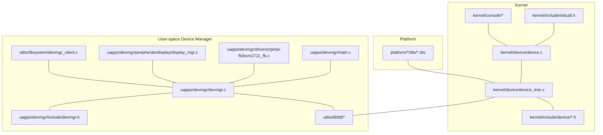
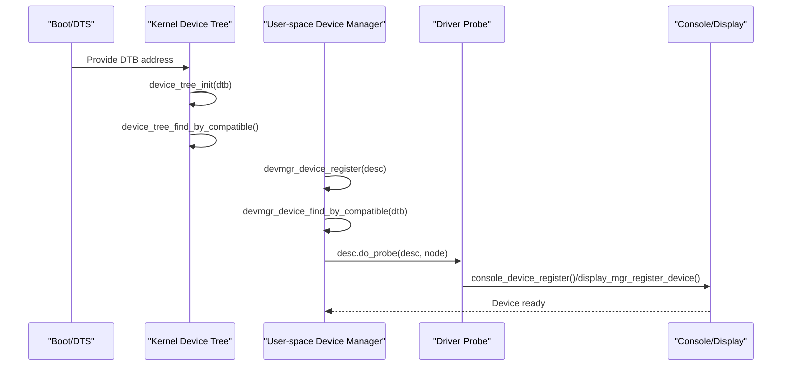
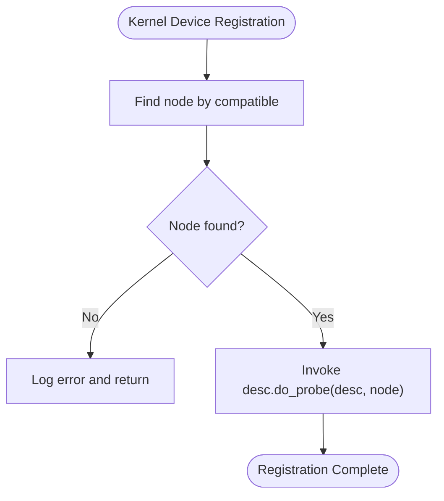
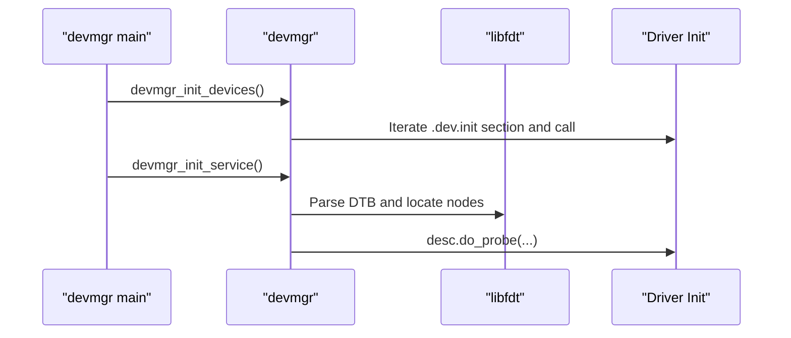
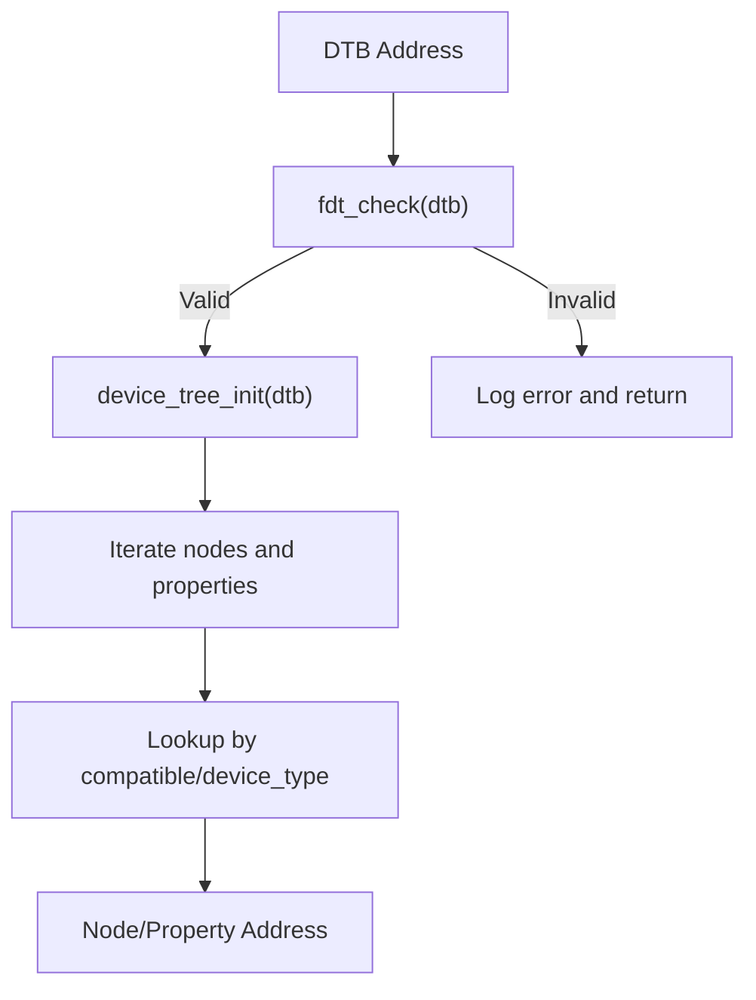
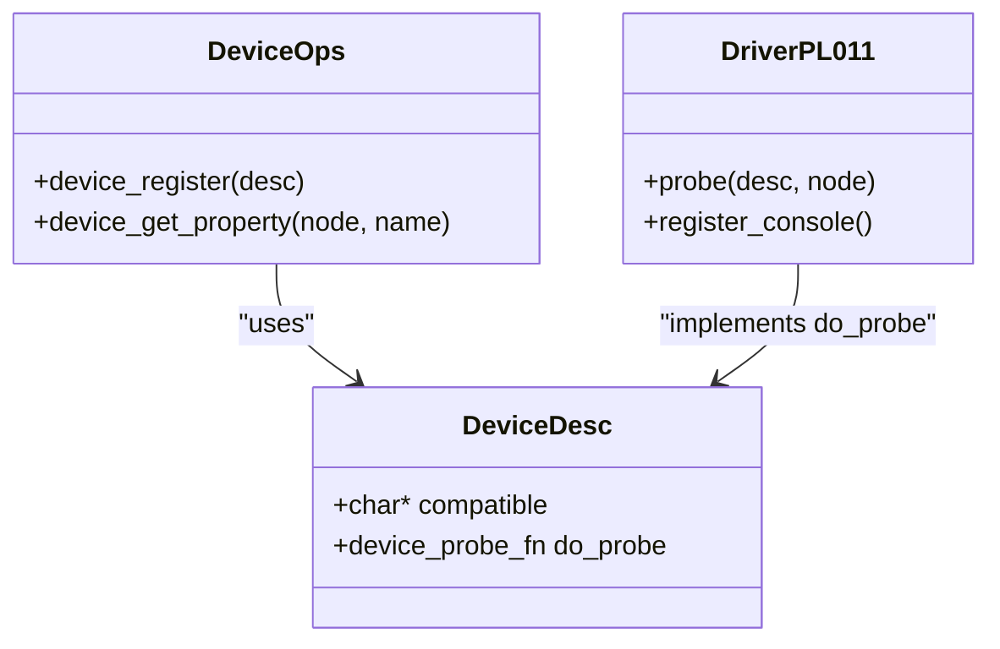
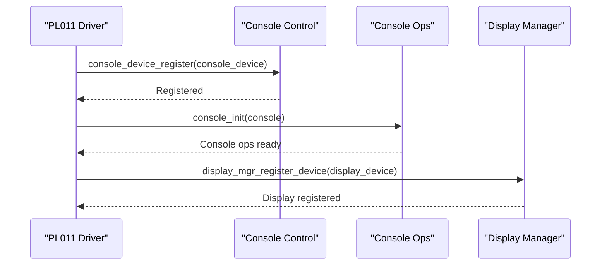
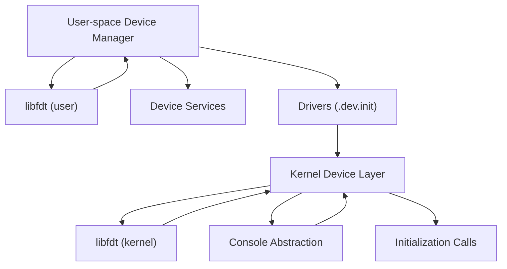

# Device Management System

<cite>
**Referenced Files in This Document**
- [device.c](file://kernel/device/device.c)
- [device_tree.c](file://kernel/device/device_tree.c)
- [device.h](file://kernel/include/device/device.h)
- [device_tree.h](file://kernel/include/device/device_tree.h)
- [initcall.h](file://kernel/include/initcall.h)
- [pl011.c](file://boot/drivers/arm-uart/pl011.c)
- [bcm2711-rpi-cm4.dts](file://platform/CM4/dts/bcm2711-rpi-cm4.dts)
- [devmgr.c](file://uapps/devmgr/devmgr.c)
- [devmgr.h](file://uapps/devmgr/include/devmgr.h)
- [main.c](file://uapps/devmgr/main.c)
- [fdt.h](file://ulibs/include/libfdt/fdt.h)
- [fdt.c](file://ulibs/libfdt/fdt.c)
- [console.c](file://kernel/console/console.c)
- [console_ctl.c](file://kernel/console/device/console_ctl.c)
- [console.h](file://kernel/include/console/console.h)
- [console_ctl.h](file://kernel/include/console/device/console_ctl.h)
- [caslock.h](file://kernel/include/sync/spinlock/caslock.h)
- [sp805.c](file://kernel/drivers/watchdog/sp805.c)
- [pl080.c](file://kernel/drivers/arm-dma/pl080.c)
- [bcm2711_fb.c](file://uapps/devmgr/drivers/rpi/rpi-fb/bcm2711_fb.c)
- [display_mgr.c](file://uapps/devmgr/peripherals/display/display_mgr.c)
- [devmgr_client.c](file://ulibs/libsystem/devmgr_client.c)
</cite>

## Table of Contents
1. [Introduction](#introduction)
2. [Project Structure](#project-structure)
3. [Core Components](#core-components)
4. [Architecture Overview](#architecture-overview)
5. [Detailed Component Analysis](#detailed-component-analysis)
6. [Dependency Analysis](#dependency-analysis)
7. [Performance Considerations](#performance-considerations)
8. [Troubleshooting Guide](#troubleshooting-guide)
9. [Conclusion](#conclusion)
10. [Appendices](#appendices)

## Introduction
This document explains the device management system in TranquilOS, focusing on the device tree framework, device discovery and registration, and the modular driver architecture. It also describes the relationship between kernel-level device management and user-space device managers, including device tree parsing, device enumeration, and driver registration mechanisms. The separation of concerns between kernel-level device abstraction and user-space driver implementation is highlighted, along with practical examples of device registration, driver loading, and device communication patterns. Platform-specific device implementations and hardware abstraction layers are addressed through concrete examples.

## Project Structure
The device management system spans three primary areas:
- Kernel device management: device tree parsing, device registration, and initialization hooks
- Platform device tree sources: DTS files defining hardware topology and capabilities
- User-space device manager: device discovery, driver registration, and service orchestration

**Diagram sources**
- [device.c](file://kernel/device/device.c#L1-L55)
- [device_tree.c](file://kernel/device/device_tree.c#L1-L95)
- [device.h](file://kernel/include/device/device.h#L1-L37)
- [device_tree.h](file://kernel/include/device/device_tree.h#L1-L25)
- [initcall.h](file://kernel/include/initcall.h#L1-L42)
- [bcm2711-rpi-cm4.dts](file://platform/CM4/dts/bcm2711-rpi-cm4.dts#L1-L200)
- [devmgr.c](file://uapps/devmgr/devmgr.c#L1-L62)
- [devmgr.h](file://uapps/devmgr/include/devmgr.h#L1-L30)
- [main.c](file://uapps/devmgr/main.c#L1-L18)
- [fdt.h](file://ulibs/include/libfdt/fdt.h#L1-L55)
- [fdt.c](file://ulibs/libfdt/fdt.c#L1-L334)
- [console.c](file://kernel/console/console.c#L1-L30)
- [console_ctl.c](file://kernel/console/device/console_ctl.c#L1-L54)
- [console.h](file://kernel/include/console/console.h#L1-L25)
- [console_ctl.h](file://kernel/include/console/device/console_ctl.h#L1-L41)
- [display_mgr.c](file://uapps/devmgr/peripherals/display/display_mgr.c#L1-L31)
- [bcm2711_fb.c](file://uapps/devmgr/drivers/rpi/rpi-fb/bcm2711_fb.c#L1-L173)
- [devmgr_client.c](file://ulibs/libsystem/devmgr_client.c#L1-L25)

**Section sources**
- [device.c](file://kernel/device/device.c#L1-L55)
- [device_tree.c](file://kernel/device/device_tree.c#L1-L95)
- [device.h](file://kernel/include/device/device.h#L1-L37)
- [device_tree.h](file://kernel/include/device/device_tree.h#L1-L25)
- [initcall.h](file://kernel/include/initcall.h#L1-L42)
- [bcm2711-rpi-cm4.dts](file://platform/CM4/dts/bcm2711-rpi-cm4.dts#L1-L200)
- [devmgr.c](file://uapps/devmgr/devmgr.c#L1-L62)
- [devmgr.h](file://uapps/devmgr/include/devmgr.h#L1-L30)
- [main.c](file://uapps/devmgr/main.c#L1-L18)
- [fdt.h](file://ulibs/include/libfdt/fdt.h#L1-L55)
- [fdt.c](file://ulibs/libfdt/fdt.c#L1-L334)
- [console.c](file://kernel/console/console.c#L1-L30)
- [console_ctl.c](file://kernel/console/device/console_ctl.c#L1-L54)
- [console.h](file://kernel/include/console/console.h#L1-L25)
- [console_ctl.h](file://kernel/include/console/device/console_ctl.h#L1-L41)
- [display_mgr.c](file://uapps/devmgr/peripherals/display/display_mgr.c#L1-L31)
- [bcm2711_fb.c](file://uapps/devmgr/drivers/rpi/rpi-fb/bcm2711_fb.c#L1-L173)
- [devmgr_client.c](file://ulibs/libsystem/devmgr_client.c#L1-L25)

## Core Components
- Kernel device management
  - Device registration and probing via device descriptors
  - Initialization call levels for staged device initialization
  - Device tree parsing and property retrieval
- User-space device manager
  - Device discovery using platform device tree
  - Driver registration and probing in user space
  - Service orchestration and client integration
- Console abstraction
  - Kernel console device registration and operations
  - User-space display manager and framebuffer driver

Key APIs and data structures:
- Device descriptor and probe function types
- Device tree node and property accessors
- Initialization call macros and runners
- Console device registration and operations

**Section sources**
- [device.h](file://kernel/include/device/device.h#L11-L36)
- [device_tree.h](file://kernel/include/device/device_tree.h#L7-L23)
- [initcall.h](file://kernel/include/initcall.h#L7-L34)
- [console_ctl.h](file://kernel/include/console/device/console_ctl.h#L9-L33)
- [console.h](file://kernel/include/console/console.h#L12-L21)

## Architecture Overview
The device management architecture separates kernel-level device abstraction from user-space driver implementation. The kernel parses the device tree and exposes discovery and registration primitives. Platform DTS files define hardware nodes and compatibility strings. User-space device manager locates matching nodes, invokes driver probes, and manages device services.

**Diagram sources**
- [device_tree.c](file://kernel/device/device_tree.c#L10-L37)
- [devmgr.c](file://uapps/devmgr/devmgr.c#L33-L55)
- [pl011.c](file://boot/drivers/arm-uart/pl011.c#L51-L93)
- [console_ctl.c](file://kernel/console/device/console_ctl.c#L29-L40)
- [display_mgr.c](file://uapps/devmgr/peripherals/display/display_mgr.c#L6-L19)

**Section sources**
- [device_tree.c](file://kernel/device/device_tree.c#L10-L37)
- [devmgr.c](file://uapps/devmgr/devmgr.c#L33-L55)
- [pl011.c](file://boot/drivers/arm-uart/pl011.c#L51-L93)
- [console_ctl.c](file://kernel/console/device/console_ctl.c#L29-L40)
- [display_mgr.c](file://uapps/devmgr/peripherals/display/display_mgr.c#L6-L19)

## Detailed Component Analysis

### Kernel Device Management
- Device registration
  - The kernel provides a device registration function that finds a device node by its compatible string and invokes the driver’s probe routine.
  - Initialization call levels enable staged device initialization across early, per-CPU, and normal phases.
- Device tree integration
  - The kernel initializes the device tree parser with a DTB address, supports dumping, iterating nodes, and retrieving properties.
  - Node address extraction assists drivers in mapping hardware registers.

Implementation highlights:
- Registration and property access
  - [device_register](file://kernel/device/device.c#L13-L26)
  - [device_get_property](file://kernel/device/device.c#L28-L30)
- Initialization call macros and runners
  - [initcall.h](file://kernel/include/initcall.h#L11-L34)
- Device tree parsing and iteration
  - [device_tree_init](file://kernel/device/device_tree.c#L10-L17)
  - [device_tree_find_by_compatible](file://kernel/device/device_tree.c#L25-L37)
  - [device_tree_iter_node](file://kernel/device/device_tree.c#L62-L68)

**Diagram sources**
- [device.c](file://kernel/device/device.c#L13-L26)

**Section sources**
- [device.c](file://kernel/device/device.c#L13-L30)
- [initcall.h](file://kernel/include/initcall.h#L11-L34)
- [device_tree.c](file://kernel/device/device_tree.c#L10-L37)

### User-space Device Manager
- Device discovery and registration
  - The user-space device manager retrieves the DTB address from the kernel, locates nodes by compatible string, and triggers driver probes.
  - A dedicated section collects driver initialization functions and runs them during startup.
- Service integration
  - The device manager initializes display management and services, and integrates with clients for surface submission and CPIO access.

Key functions:
- [devmgr_device_register](file://uapps/devmgr/devmgr.c#L33-L55)
- [devmgr_device_find_by_compatible](file://uapps/devmgr/devmgr.c#L10-L22)
- [devmgr_init_devices](file://uapps/devmgr/devmgr.c#L57-L62)
- [devmgr_main](file://uapps/devmgr/main.c#L6-L17)

**Diagram sources**
- [main.c](file://uapps/devmgr/main.c#L6-L17)
- [devmgr.c](file://uapps/devmgr/devmgr.c#L57-L62)
- [devmgr.h](file://uapps/devmgr/include/devmgr.h#L7-L11)

**Section sources**
- [devmgr.c](file://uapps/devmgr/devmgr.c#L10-L62)
- [devmgr.h](file://uapps/devmgr/include/devmgr.h#L7-L29)
- [main.c](file://uapps/devmgr/main.c#L6-L17)

### Device Tree Parsing and Enumeration
- Device tree parsing
  - The kernel initializes the device tree parser with the DTB address and validates the blob.
  - Iteration and lookup functions traverse nodes and properties by compatible strings and device types.
- Property retrieval
  - Properties can be retrieved by name for further driver configuration.

Core functions:
- [device_tree_init](file://kernel/device/device_tree.c#L10-L17)
- [device_tree_dump](file://kernel/device/device_tree.c#L19-L23)
- [fdt_node_by_compatible](file://ulibs/libfdt/fdt.c#L152-L203)
- [fdt_prop_by_name](file://ulibs/libfdt/fdt.c#L205-L240)

**Diagram sources**
- [device_tree.c](file://kernel/device/device_tree.c#L10-L23)
- [fdt.c](file://ulibs/libfdt/fdt.c#L25-L33)
- [fdt.c](file://ulibs/libfdt/fdt.c#L152-L203)
- [fdt.c](file://ulibs/libfdt/fdt.c#L205-L240)

**Section sources**
- [device_tree.c](file://kernel/device/device_tree.c#L10-L23)
- [fdt.h](file://ulibs/include/libfdt/fdt.h#L40-L55)
- [fdt.c](file://ulibs/libfdt/fdt.c#L25-L33)
- [fdt.c](file://ulibs/libfdt/fdt.c#L152-L203)
- [fdt.c](file://ulibs/libfdt/fdt.c#L205-L240)

### Modular Driver Architecture
- Driver registration
  - Drivers declare a device descriptor with a compatible string and a probe function, then register during initialization.
- Example: ARM PL011 UART driver
  - Finds the node address from the device tree, configures UART registers, and registers a console device for output.

Driver registration pattern:
- [device_register](file://kernel/device/device.c#L13-L26)
- [early_device_init macro](file://kernel/include/device/device.h#L11-L16)
- [pl011_init](file://boot/drivers/arm-uart/pl011.c#L90-L95)

**Diagram sources**
- [device.h](file://kernel/include/device/device.h#L18-L22)
- [device.c](file://kernel/device/device.c#L13-L30)
- [pl011.c](file://boot/drivers/arm-uart/pl011.c#L85-L95)

**Section sources**
- [device.c](file://kernel/device/device.c#L13-L30)
- [device.h](file://kernel/include/device/device.h#L11-L22)
- [pl011.c](file://boot/drivers/arm-uart/pl011.c#L85-L95)

### Console Abstraction and Display Management
- Kernel console
  - Console devices are registered and attached to a console instance, enabling character I/O operations.
- User-space display manager
  - Registers display devices and coordinates framebuffer operations.

Key components:
- [console_device_register](file://kernel/console/device/console_ctl.c#L29-L40)
- [console_init](file://kernel/console/console.c#L25-L30)
- [display_mgr_register_device](file://uapps/devmgr/peripherals/display/display_mgr.c#L6-L19)
- [bcm2711_fb_probe](file://uapps/devmgr/drivers/rpi/rpi-fb/bcm2711_fb.c#L159-L166)

**Diagram sources**
- [console_ctl.c](file://kernel/console/device/console_ctl.c#L29-L40)
- [console.c](file://kernel/console/console.c#L25-L30)
- [display_mgr.c](file://uapps/devmgr/peripherals/display/display_mgr.c#L6-L19)
- [pl011.c](file://boot/drivers/arm-uart/pl011.c#L41-L71)

**Section sources**
- [console_ctl.c](file://kernel/console/device/console_ctl.c#L29-L40)
- [console.c](file://kernel/console/console.c#L25-L30)
- [display_mgr.c](file://uapps/devmgr/peripherals/display/display_mgr.c#L6-L19)
- [pl011.c](file://boot/drivers/arm-uart/pl011.c#L41-L71)

### Platform-Specific Device Implementations
- Raspberry Pi Compute Module 4 device tree
  - Defines memory reservations, aliases, and device nodes with compatible strings and register ranges.
- Example nodes
  - UART, GPIO, mailbox, and other peripherals are declared with compatible strings used by drivers.

Relevant DTS excerpts:
- [aliases and memory reservations](file://platform/CM4/dts/bcm2711-rpi-cm4.dts#L36-L111)
- [GPIO and UART nodes](file://platform/CM4/dts/bcm2711-rpi-cm4.dts#L166-L178)
- [Mailbox node for framebuffer](file://platform/CM4/dts/bcm2711-rpi-cm4.dts#L158-L164)

**Section sources**
- [bcm2711-rpi-cm4.dts](file://platform/CM4/dts/bcm2711-rpi-cm4.dts#L36-L178)

### Hardware Abstraction Layers
- Spinlock abstraction
  - CAS-based spinlock provides atomic operations for protecting device I/O in drivers like PL011.
- CPU HAL
  - Privilege level detection and event synchronization primitives support efficient locking and wait/broadcast semantics.

References:
- [spinlock_cas_lock/unlock](file://kernel/include/sync/spinlock/caslock.h#L29-L42)
- [hal_cpu_event_wait/broadcast](file://kernel/arch/arm64/cpu.c#L38-L44)

**Section sources**
- [caslock.h](file://kernel/include/sync/spinlock/caslock.h#L29-L42)
- [cpu.c](file://kernel/arch/arm64/cpu.c#L38-L44)

## Dependency Analysis
The device management system exhibits clear separation of concerns:
- Kernel depends on libfdt for device tree parsing and exposes device registration and initialization APIs
- User-space device manager depends on libfdt and kernel-provided DTB address to discover and register drivers
- Drivers depend on device descriptors and console/display abstractions to integrate with the system

**Diagram sources**
- [device_tree.c](file://kernel/device/device_tree.c#L1-L95)
- [fdt.c](file://ulibs/libfdt/fdt.c#L1-L334)
- [devmgr.c](file://uapps/devmgr/devmgr.c#L1-L62)
- [console_ctl.c](file://kernel/console/device/console_ctl.c#L1-L54)
- [initcall.h](file://kernel/include/initcall.h#L1-L42)

**Section sources**
- [device_tree.c](file://kernel/device/device_tree.c#L1-L95)
- [fdt.c](file://ulibs/libfdt/fdt.c#L1-L334)
- [devmgr.c](file://uapps/devmgr/devmgr.c#L1-L62)
- [console_ctl.c](file://kernel/console/device/console_ctl.c#L1-L54)
- [initcall.h](file://kernel/include/initcall.h#L1-L42)

## Performance Considerations
- Device tree traversal
  - Linear scans by compatible and device type are straightforward but can be optimized with indexed lookups in future iterations.
- Driver registration
  - Staged initialization reduces boot latency by deferring non-critical devices.
- Locking
  - CAS-based spinlocks minimize overhead for short critical sections in device I/O.

[No sources needed since this section provides general guidance]

## Troubleshooting Guide
Common issues and remedies:
- DTB not found or invalid
  - Verify device tree initialization and DTB address passed to the kernel.
  - Check device tree dump logs for parsing errors.
- Compatible string mismatch
  - Ensure the driver’s compatible string matches the DTS definition.
- Node address extraction
  - Confirm node address parsing and register mapping align with platform documentation.
- Driver probe failures
  - Validate device registration and probe invocation sequences.

Diagnostic references:
- [device_tree_init logging](file://kernel/device/device_tree.c#L10-L17)
- [device_register error logging](file://kernel/device/device.c#L14-L20)
- [devmgr_device_register error handling](file://uapps/devmgr/devmgr.c#L34-L54)

**Section sources**
- [device_tree.c](file://kernel/device/device_tree.c#L10-L17)
- [device.c](file://kernel/device/device.c#L14-L20)
- [devmgr.c](file://uapps/devmgr/devmgr.c#L34-L54)

## Conclusion
TranquilOS implements a clean separation between kernel-level device abstraction and user-space driver management. The device tree framework enables robust discovery and registration, while staged initialization ensures predictable boot performance. The modular driver architecture, exemplified by the PL011 UART and framebuffer drivers, demonstrates how platform-specific implementations integrate seamlessly. Together, these components form a scalable and maintainable device management system.

[No sources needed since this section summarizes without analyzing specific files]

## Appendices

### API Reference Summary
- Kernel device APIs
  - [device_register](file://kernel/device/device.c#L13-L26)
  - [device_get_property](file://kernel/device/device.c#L28-L30)
  - [device_tree_init](file://kernel/device/device_tree.c#L10-L17)
  - [device_tree_find_by_compatible](file://kernel/device/device_tree.c#L25-L37)
- User-space device manager APIs
  - [devmgr_device_register](file://uapps/devmgr/devmgr.c#L33-L55)
  - [devmgr_device_find_by_compatible](file://uapps/devmgr/devmgr.c#L10-L22)
  - [devmgr_init_devices](file://uapps/devmgr/devmgr.c#L57-L62)
- Console APIs
  - [console_device_register](file://kernel/console/device/console_ctl.c#L29-L40)
  - [console_init](file://kernel/console/console.c#L25-L30)
  - [display_mgr_register_device](file://uapps/devmgr/peripherals/display/display_mgr.c#L6-L19)

**Section sources**
- [device.c](file://kernel/device/device.c#L13-L30)
- [device_tree.c](file://kernel/device/device_tree.c#L10-L37)
- [devmgr.c](file://uapps/devmgr/devmgr.c#L10-L62)
- [console_ctl.c](file://kernel/console/device/console_ctl.c#L29-L40)
- [console.c](file://kernel/console/console.c#L25-L30)
- [display_mgr.c](file://uapps/devmgr/peripherals/display/display_mgr.c#L6-L19)