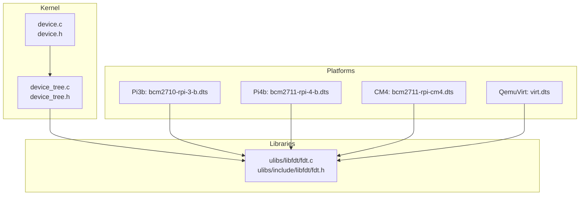
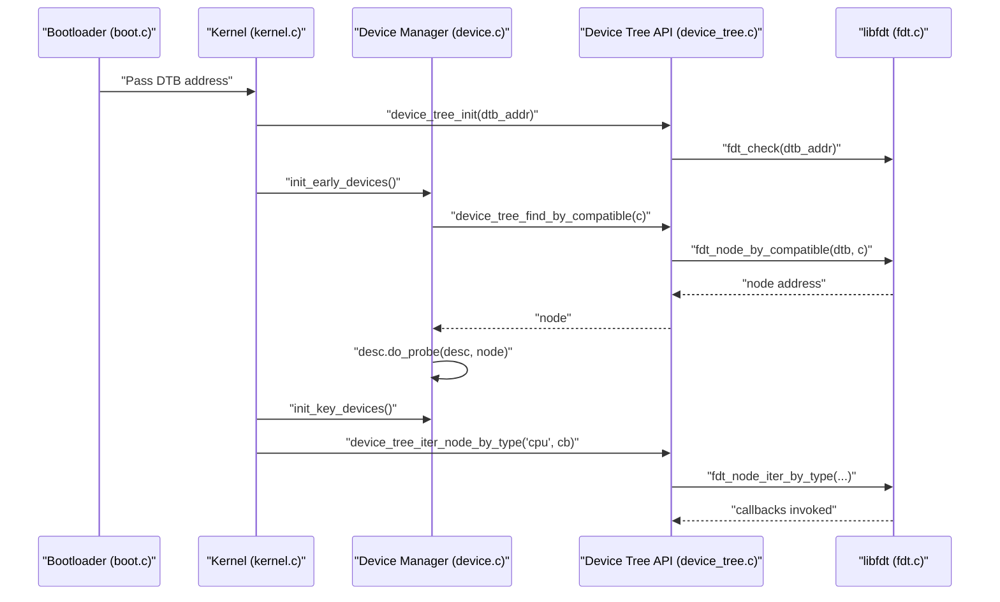
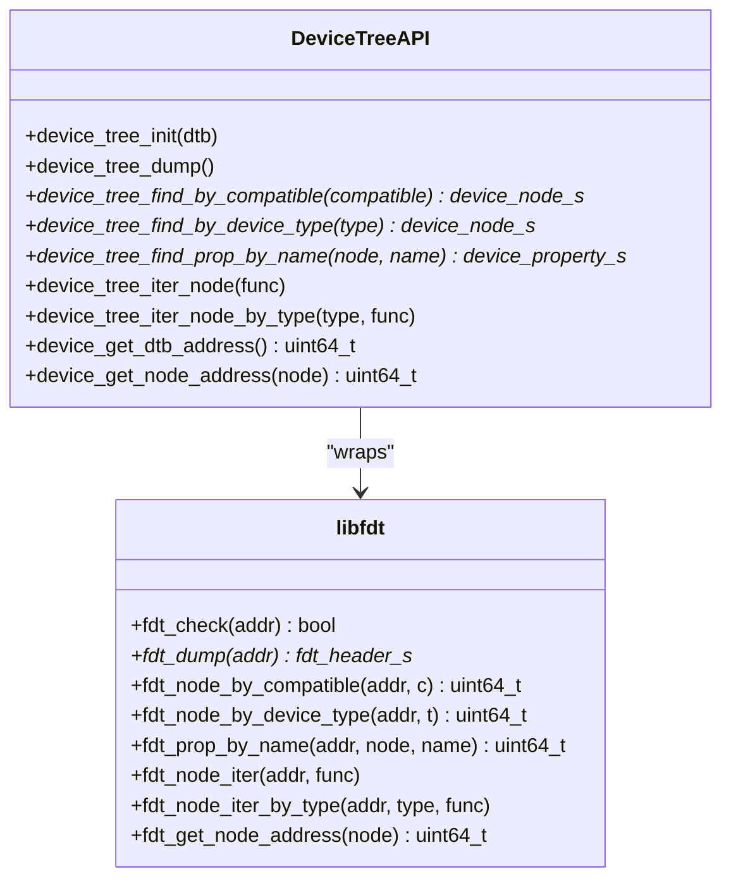
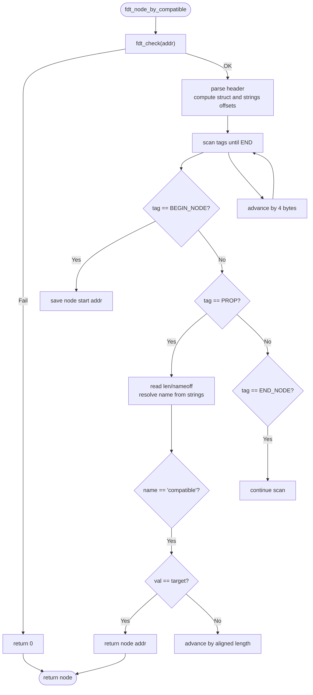
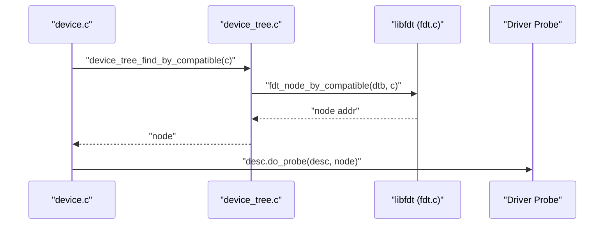
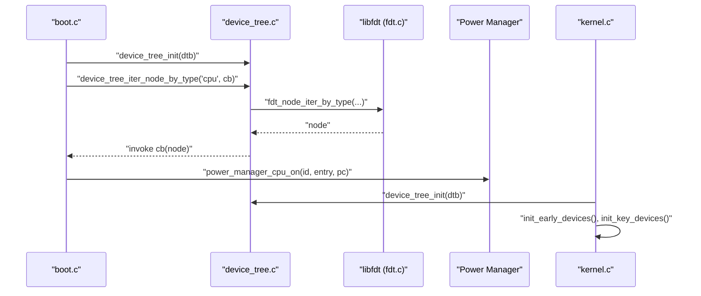
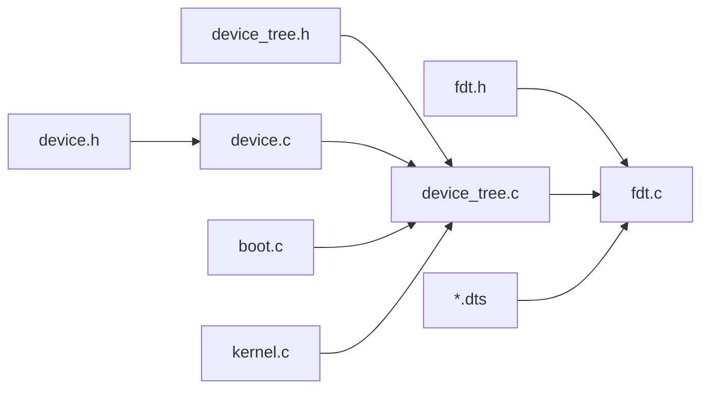

# Device Tree Framework

<cite>
**Referenced Files in This Document**
- [device_tree.c](file://kernel/device/device_tree.c)
- [device_tree.h](file://kernel/include/device/device_tree.h)
- [fdt.c](file://ulibs/libfdt/fdt.c)
- [fdt.h](file://ulibs/include/libfdt/fdt.h)
- [device.c](file://kernel/device/device.c)
- [device.h](file://kernel/include/device/device.h)
- [boot.c](file://boot/boot.c)
- [kernel.c](file://kernel/kernel.c)
- [bcm2711-rpi-cm4.dts](file://platform/CM4/dts/bcm2711-rpi-cm4.dts)
- [bcm2711-rpi-4-b.dts](file://platform/Pi4b/dts/bcm2711-rpi-4-b.dts)
- [bcm2710-rpi-3-b.dts](file://platform/Pi3b/dts/bcm2710-rpi-3-b.dts)
- [virt.dts](file://platform/QemuVirt/dts/virt.dts)
</cite>

## Table of Contents
1. [Introduction](#introduction)
2. [Project Structure](#project-structure)
3. [Core Components](#core-components)
4. [Architecture Overview](#architecture-overview)
5. [Detailed Component Analysis](#detailed-component-analysis)
6. [Dependency Analysis](#dependency-analysis)
7. [Performance Considerations](#performance-considerations)
8. [Troubleshooting Guide](#troubleshooting-guide)
9. [Conclusion](#conclusion)

## Introduction
This document describes the device tree framework in TranquilOS, covering parsing, traversal, and property extraction; the device tree compilation pipeline from DTS to DTB; runtime manipulation; and platform-specific variations. It also documents the APIs, search algorithms, and property access patterns used across ARM64 platforms (Raspberry Pi 3B/4B/Compute Module and QEMU Virtual ARMv8).

## Project Structure
The device tree framework spans three layers:
- Kernel-facing API: thin wrappers around libfdt for device registration and traversal.
- libfdt: low-level parser and iterator for flattened device tree binary format.
- Platform DTS files: device tree source definitions per platform.

**Diagram sources**
- [device_tree.c](file://kernel/device/device_tree.c#L1-L95)
- [device_tree.h](file://kernel/include/device/device_tree.h#L1-L25)
- [fdt.c](file://ulibs/libfdt/fdt.c#L1-L334)
- [fdt.h](file://ulibs/include/libfdt/fdt.h#L1-L56)
- [bcm2710-rpi-3-b.dts](file://platform/Pi3b/dts/bcm2710-rpi-3-b.dts#L1-L120)
- [bcm2711-rpi-4-b.dts](file://platform/Pi4b/dts/bcm2711-rpi-4-b.dts#L1-L120)
- [bcm2711-rpi-cm4.dts](file://platform/CM4/dts/bcm2711-rpi-cm4.dts#L1-L120)
- [virt.dts](file://platform/QemuVirt/dts/virt.dts#L1-L120)

**Section sources**
- [device_tree.c](file://kernel/device/device_tree.c#L1-L95)
- [device_tree.h](file://kernel/include/device/device_tree.h#L1-L25)
- [fdt.c](file://ulibs/libfdt/fdt.c#L1-L334)
- [fdt.h](file://ulibs/include/libfdt/fdt.h#L1-L56)

## Core Components
- Kernel device tree API: initialization, dumping, node search by compatible/device-type, property lookup, iteration, and node address extraction.
- libfdt: binary device tree validation, dump, node search by compatible/device-type, property lookup by name, and node iteration.
- Device registration: driver discovery via compatible strings and probing with parsed nodes.
- Boot integration: bootloader passes DTB address to kernel; kernel initializes device tree and triggers device initialization sequences.

Key responsibilities:
- device_tree_init(): validates DTB and stores base address.
- device_tree_dump(): prints structured tree for diagnostics.
- device_tree_find_by_compatible()/device_tree_find_by_device_type(): locate nodes by matching properties.
- device_tree_find_prop_by_name(): extract property pointer/address for a given node.
- device_tree_iter_node()/device_tree_iter_node_by_type(): iterate nodes for bulk operations.
- device_get_node_address(): parse node’s base address from node name string.

**Section sources**
- [device_tree.c](file://kernel/device/device_tree.c#L10-L95)
- [device_tree.h](file://kernel/include/device/device_tree.h#L12-L22)
- [fdt.c](file://ulibs/libfdt/fdt.c#L25-L97)
- [fdt.c](file://ulibs/libfdt/fdt.c#L152-L203)
- [fdt.c](file://ulibs/libfdt/fdt.c#L205-L240)
- [fdt.c](file://ulibs/libfdt/fdt.c#L242-L324)
- [fdt.c](file://ulibs/libfdt/fdt.c#L326-L334)

## Architecture Overview
The device tree lifecycle:
- Build-time: DTS files define platform topology; compiled to DTB via libfdt tools.
- Boot-time: Bootloader passes DTB address to kernel; kernel initializes device tree API and discovers devices.
- Runtime: Drivers probe nodes by compatible strings, read properties, and bind to hardware.

**Diagram sources**
- [boot.c](file://boot/boot.c#L82-L107)
- [kernel.c](file://kernel/kernel.c#L125-L224)
- [device.c](file://kernel/device/device.c#L13-L26)
- [device_tree.c](file://kernel/device/device_tree.c#L10-L17)
- [fdt.c](file://ulibs/libfdt/fdt.c#L25-L33)
- [fdt.c](file://ulibs/libfdt/fdt.c#L152-L203)
- [fdt.c](file://ulibs/libfdt/fdt.c#L281-L324)

## Detailed Component Analysis

### Kernel Device Tree API
- Initialization and validation: sets logging callback and checks magic header.
- Dumping: iterates and prints nodes/properties for diagnostics.
- Node search: by compatible string and by device_type.
- Property access: returns pointer to property payload for a given node and name.
- Iteration: traverse all nodes or filter by device_type.
- Node address extraction: parses physical address embedded in node label.

**Diagram sources**
- [device_tree.c](file://kernel/device/device_tree.c#L10-L95)
- [fdt.c](file://ulibs/libfdt/fdt.c#L25-L334)

**Section sources**
- [device_tree.c](file://kernel/device/device_tree.c#L10-L95)
- [device_tree.h](file://kernel/include/device/device_tree.h#L12-L22)

### libfdt Implementation Details
- Binary validation: verifies magic number and header fields.
- Dump: walks struct buffer, resolves strings via string table, prints nodes/props.
- Node search: scans struct buffer for BEGIN_NODE/PROP pairs; matches "compatible" or "device_type".
- Property lookup: finds named property within node’s property stream.
- Iteration: traverses nodes and invokes callbacks; optional device_type filter.
- Node address parsing: extracts hex address from node label string.

**Diagram sources**
- [fdt.c](file://ulibs/libfdt/fdt.c#L152-L203)

**Section sources**
- [fdt.c](file://ulibs/libfdt/fdt.c#L25-L97)
- [fdt.c](file://ulibs/libfdt/fdt.c#L152-L203)
- [fdt.c](file://ulibs/libfdt/fdt.c#L205-L240)
- [fdt.c](file://ulibs/libfdt/fdt.c#L242-L324)
- [fdt.c](file://ulibs/libfdt/fdt.c#L326-L334)

### Device Registration and Driver Discovery
- Drivers declare a device descriptor with compatible string and probe function.
- At init time, the device manager queries the device tree for nodes matching the compatible string and invokes the probe routine.

**Diagram sources**
- [device.c](file://kernel/device/device.c#L13-L26)
- [device_tree.c](file://kernel/device/device_tree.c#L25-L37)
- [fdt.c](file://ulibs/libfdt/fdt.c#L152-L203)

**Section sources**
- [device.c](file://kernel/device/device.c#L13-L30)
- [device.h](file://kernel/include/device/device.h#L18-L31)

### Boot Integration and CPU Enablement
- Bootloader initializes device tree, runs early device init, iterates CPUs by type, and powers them on via PSCI when enabled by device tree.
- Kernel initializes device tree, runs early/per-CPU/key device init, and proceeds with memory and scheduler setup.

**Diagram sources**
- [boot.c](file://boot/boot.c#L82-L107)
- [boot.c](file://boot/boot.c#L68-L80)
- [kernel.c](file://kernel/kernel.c#L125-L224)
- [fdt.c](file://ulibs/libfdt/fdt.c#L281-L324)

**Section sources**
- [boot.c](file://boot/boot.c#L82-L107)
- [boot.c](file://boot/boot.c#L68-L80)
- [kernel.c](file://kernel/kernel.c#L125-L224)

### Platform-Specific Device Tree Variations
- Raspberry Pi 3B/4B/Compute Module: use ARM SoC peripherals, GPIO pinmux groups, UARTs, SPI/I2C/I2S, SD host, mailbox, clocks, and thermal zones. Interrupt parent and ranges are defined per platform.
- QEMU Virtual ARMv8: uses virtualized peripherals (GIC, PL011 UART, virtio MMIO, PCI host ecam, flash), fixed clocks, and CPU topology via PSCI.

Examples of structures present in platform DTS files:
- Memory reservations and reserved regions.
- Aliases for common peripherals.
- soc bus with ranges and dma-ranges.
- Peripherals with compatible strings, reg, interrupts, clocks, and phandles.
- CPU nodes with enable-method and reg.

**Section sources**
- [bcm2710-rpi-3-b.dts](file://platform/Pi3b/dts/bcm2710-rpi-3-b.dts#L1-L120)
- [bcm2711-rpi-4-b.dts](file://platform/Pi4b/dts/bcm2711-rpi-4-b.dts#L1-L120)
- [bcm2711-rpi-cm4.dts](file://platform/CM4/dts/bcm2711-rpi-cm4.dts#L1-L120)
- [virt.dts](file://platform/QemuVirt/dts/virt.dts#L1-L120)

## Dependency Analysis
- device_tree.c depends on libfdt headers and implements thin wrappers around libfdt functions.
- device.c depends on device_tree.h and uses device tree APIs for driver discovery.
- boot.c and kernel.c initialize device tree and trigger device initialization sequences.
- Platform DTS files are consumed by libfdt during build and runtime by the kernel.

**Diagram sources**
- [device_tree.h](file://kernel/include/device/device_tree.h#L1-L25)
- [device_tree.c](file://kernel/device/device_tree.c#L1-L95)
- [fdt.h](file://ulibs/include/libfdt/fdt.h#L1-L56)
- [fdt.c](file://ulibs/libfdt/fdt.c#L1-L334)
- [device.h](file://kernel/include/device/device.h#L1-L36)
- [device.c](file://kernel/device/device.c#L1-L54)
- [boot.c](file://boot/boot.c#L1-L176)
- [kernel.c](file://kernel/kernel.c#L1-L225)

**Section sources**
- [device_tree.c](file://kernel/device/device_tree.c#L1-L95)
- [fdt.c](file://ulibs/libfdt/fdt.c#L1-L334)
- [device.c](file://kernel/device/device.c#L1-L54)
- [boot.c](file://boot/boot.c#L1-L176)
- [kernel.c](file://kernel/kernel.c#L1-L225)

## Performance Considerations
- Parsing cost: linear scan of DTB struct buffer; O(N) with N being number of tags. Keep searches minimal by using device_type filters when iterating.
- Alignment: libfdt aligns property lengths to 4-byte boundaries; ensure property accessors handle alignment.
- Logging overhead: dumping entire tree is useful for diagnostics but expensive; disable or gate by verbosity.
- Early vs late init: perform lightweight device discovery early; defer heavy initialization to key/init stages.

## Troubleshooting Guide
Common issues and remedies:
- DTB not found or invalid: ensure device_tree_init is called with a valid DTB address and magic check passes.
- Compatible string mismatch: verify the driver’s compatible string matches the node’s compatible property exactly.
- Property not found: confirm property name and node path; use device_tree_dump to inspect structure.
- Node address parsing: node label format must include a base address; ensure device_get_node_address receives a valid node pointer.
- CPU enablement: for PSCI-enabled systems, ensure CPU nodes have correct enable-method and reg values.

Operational checks:
- Use device_tree_dump to print the tree and validate structure.
- Validate device_type and compatible strings against platform DTS.
- Confirm initcall sequences run in the intended order (early -> key -> normal).

**Section sources**
- [device_tree.c](file://kernel/device/device_tree.c#L10-L23)
- [fdt.c](file://ulibs/libfdt/fdt.c#L25-L33)
- [boot.c](file://boot/boot.c#L82-L107)
- [kernel.c](file://kernel/kernel.c#L125-L224)

## Conclusion
TranquilOS implements a clean separation between a kernel-facing device tree API and a robust libfdt backend. The framework supports platform-agnostic device discovery via compatible strings, efficient traversal and property access, and integrates tightly with the boot process and device initialization subsystems. Platform-specific DTS files define hardware topologies, while the kernel consumes them to power on CPUs, configure memory, and bind drivers to hardware resources.