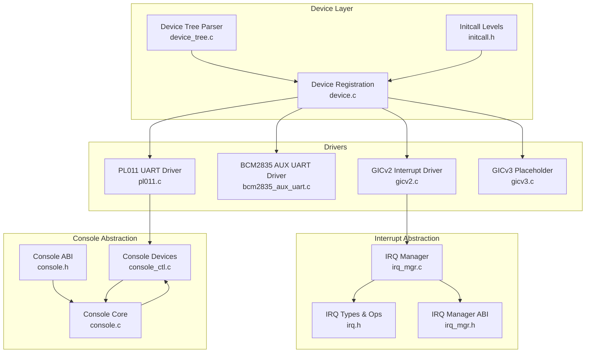
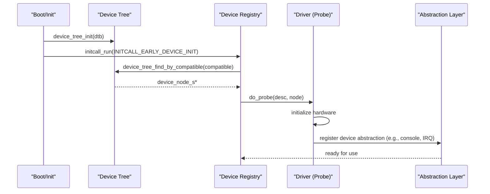
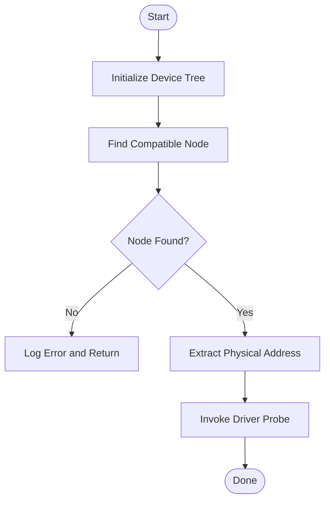
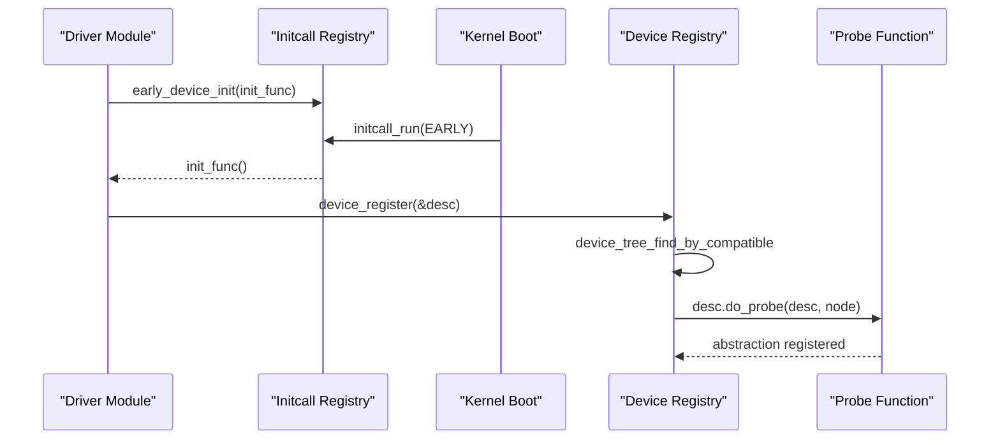
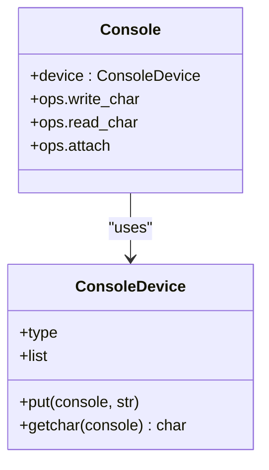
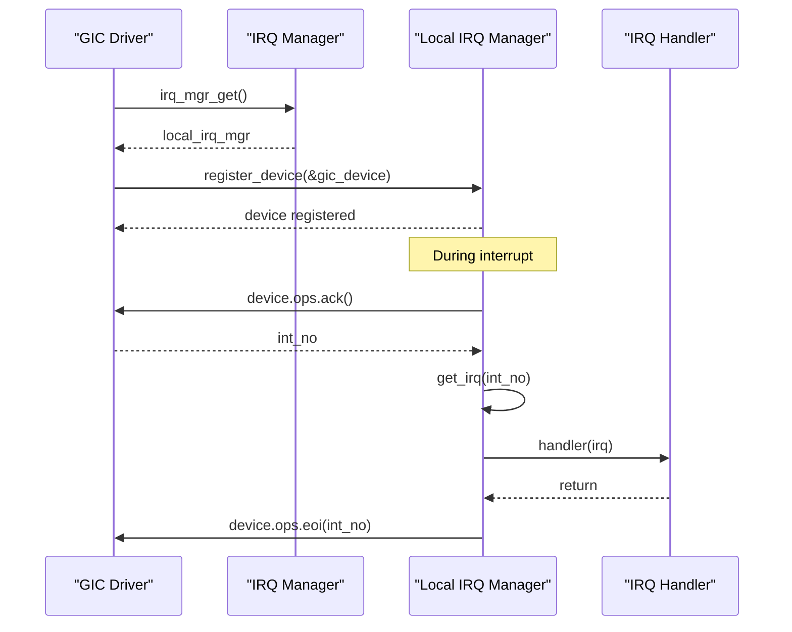
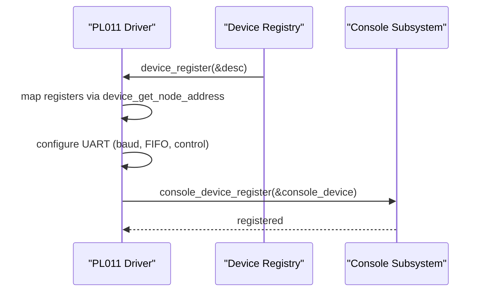
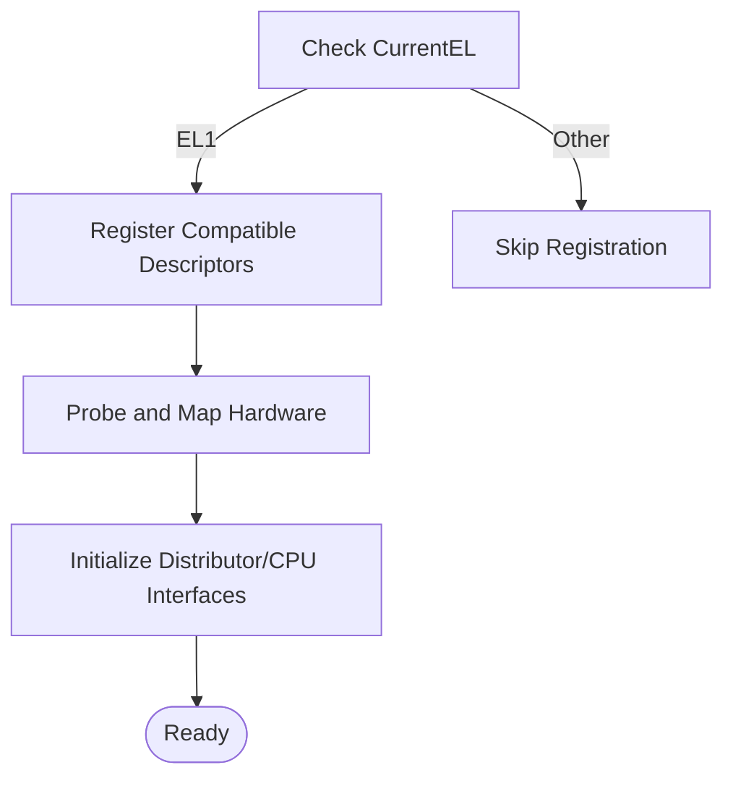
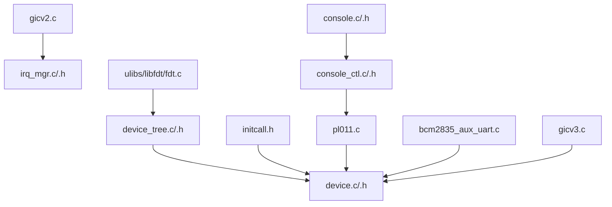

# Driver Architecture

<cite>
**Referenced Files in This Document**
- [device.c](file://kernel/device/device.c)
- [device.h](file://kernel/include/device/device.h)
- [device_tree.c](file://kernel/device/device_tree.c)
- [device_tree.h](file://kernel/include/device/device_tree.h)
- [initcall.h](file://kernel/include/initcall.h)
- [pl011.c](file://boot/drivers/arm-uart/pl011.c)
- [bcm2835_aux_uart.c](file://boot/drivers/rpi/bcm2835-aux-uart/bcm2835_aux_uart.c)
- [gicv2.c](file://kernel/drivers/arm-gic/gicv2.c)
- [gicv3.c](file://kernel/drivers/arm-gic/gicv3.c)
- [irq_mgr.c](file://kernel/interrupt/irq_mgr.c)
- [irq_mgr.h](file://kernel/include/interrupt/irq_mgr.h)
- [irq.h](file://kernel/include/interrupt/irq.h)
- [console.h](file://kernel/include/console/console.h)
- [console.c](file://kernel/console/console.c)
- [console_ctl.h](file://kernel/include/console/device/console_ctl.h)
- [console_ctl.c](file://kernel/console/device/console_ctl.c)
- [fdt.c](file://ulibs/libfdt/fdt.c)
- [devmgr.c](file://uapps/devmgr/devmgr.c)
- [devmgr.h](file://uapps/devmgr/include/devmgr.h)
</cite>

## Table of Contents
1. [Introduction](#introduction)
2. [Project Structure](#project-structure)
3. [Core Components](#core-components)
4. [Architecture Overview](#architecture-overview)
5. [Detailed Component Analysis](#detailed-component-analysis)
6. [Dependency Analysis](#dependency-analysis)
7. [Performance Considerations](#performance-considerations)
8. [Troubleshooting Guide](#troubleshooting-guide)
9. [Conclusion](#conclusion)
10. [Appendices](#appendices)

## Introduction
This document explains the driver architecture in TranquilOS, focusing on the modular driver system, driver registration mechanisms, and device discovery via the device tree. It covers the driver lifecycle, probe functions, and device binding procedures. It also documents the driver framework interfaces, callback mechanisms, and device abstraction layers, including examples of driver implementations, device matching algorithms, and interrupt handling. Initialization phases, per-CPU driver setup, and cleanup procedures are addressed, along with common driver patterns, error handling strategies, and platform-specific adaptations.

## Project Structure
The driver architecture spans several subsystems:
- Device discovery and registration live under kernel/device and kernel/include/device.
- Device tree parsing is implemented in kernel/device and uses ulibs/libfdt.
- Drivers are organized by domain (e.g., boot/drivers, kernel/drivers) and register via initcall levels.
- Interrupt handling is abstracted through kernel/interrupt and implemented by platform-specific drivers like ARM GIC.
- Console devices demonstrate device abstraction and registration.

**Diagram sources**
- [device_tree.c](file://kernel/device/device_tree.c#L1-L95)
- [device.c](file://kernel/device/device.c#L1-L55)
- [initcall.h](file://kernel/include/initcall.h#L1-L44)
- [pl011.c](file://boot/drivers/arm-uart/pl011.c#L1-L95)
- [bcm2835_aux_uart.c](file://boot/drivers/rpi/bcm2835-aux-uart/bcm2835_aux_uart.c#L1-L37)
- [gicv2.c](file://kernel/drivers/arm-gic/gicv2.c#L1-L379)
- [gicv3.c](file://kernel/drivers/arm-gic/gicv3.c#L1-L29)
- [irq_mgr.c](file://kernel/interrupt/irq_mgr.c#L1-L142)
- [irq_mgr.h](file://kernel/include/interrupt/irq_mgr.h#L1-L46)
- [irq.h](file://kernel/include/interrupt/irq.h#L1-L38)
- [console.c](file://kernel/console/console.c#L1-L30)
- [console_ctl.c](file://kernel/console/device/console_ctl.c#L1-L54)
- [console.h](file://kernel/include/console/console.h#L1-L25)

**Section sources**
- [device.c](file://kernel/device/device.c#L1-L55)
- [device.h](file://kernel/include/device/device.h#L1-L37)
- [device_tree.c](file://kernel/device/device_tree.c#L1-L95)
- [device_tree.h](file://kernel/include/device/device_tree.h#L1-L25)
- [initcall.h](file://kernel/include/initcall.h#L1-L44)

## Core Components
- Device descriptor and registration:
  - device_desc_s defines a driver’s compatible string and probe function pointer.
  - device_register finds a device node by compatible string and invokes do_probe.
- Device tree integration:
  - device_tree_init parses the DTB address.
  - device_tree_find_by_compatible locates nodes by compatible property.
  - device_get_node_address extracts physical address from device node.
- Initcall-based driver registration:
  - Macros define early/key/normal device init levels.
  - initcall_run executes all registered initcalls for a given level.
- Console abstraction:
  - console_device_s encapsulates device-specific I/O callbacks.
  - console_device_register binds a console device into a global list.
  - console core routes writes/read through console_device_s.

Key APIs and types:
- device_register, device_get_property, init_early_devices, init_key_devices, init_normal_devices
- device_tree_init, device_tree_find_by_compatible, device_get_node_address
- early_device_init, key_device_init, normal_device_init macros
- console_device_register, console_device_get_by_type, console_init

**Section sources**
- [device.h](file://kernel/include/device/device.h#L11-L36)
- [device.c](file://kernel/device/device.c#L13-L30)
- [device_tree.h](file://kernel/include/device/device_tree.h#L12-L22)
- [device_tree.c](file://kernel/device/device_tree.c#L10-L95)
- [initcall.h](file://kernel/include/initcall.h#L7-L34)
- [console_ctl.h](file://kernel/include/console/device/console_ctl.h#L28-L40)
- [console_ctl.c](file://kernel/console/device/console_ctl.c#L29-L40)
- [console.h](file://kernel/include/console/console.h#L12-L24)
- [console.c](file://kernel/console/console.c#L4-L29)

## Architecture Overview
The driver architecture follows a layered model:
- Device discovery: The kernel initializes the device tree and exposes helpers to locate nodes by compatible strings.
- Driver registration: Drivers register via initcall levels. At boot, initcall_run triggers drivers to probe and bind to matching devices.
- Probe and bind: Each driver’s probe function receives the device node and performs hardware initialization, then registers abstractions (e.g., console, IRQ device).
- Abstraction layers: Console and IRQ managers provide a unified interface for higher-level subsystems.

**Diagram sources**
- [device_tree.c](file://kernel/device/device_tree.c#L10-L37)
- [device.c](file://kernel/device/device.c#L32-L34)
- [initcall.h](file://kernel/include/initcall.h#L26-L34)
- [pl011.c](file://boot/drivers/arm-uart/pl011.c#L51-L83)
- [gicv2.c](file://kernel/drivers/arm-gic/gicv2.c#L216-L276)

## Detailed Component Analysis

### Device Discovery and Matching
Device discovery relies on the device tree:
- device_tree_init stores the DTB address and enables logging.
- device_tree_find_by_compatible scans the flattened device tree for a matching compatible string.
- device_get_node_address parses the node to extract the base physical address.

Matching algorithm:
- The flattened device tree parser iterates nodes and properties, comparing the “compatible” string against the driver’s descriptor.
- On match, the driver’s probe function is invoked with the matched node.

**Diagram sources**
- [device_tree.c](file://kernel/device/device_tree.c#L10-L37)
- [fdt.c](file://ulibs/libfdt/fdt.c#L152-L164)

**Section sources**
- [device_tree.c](file://kernel/device/device_tree.c#L10-L95)
- [fdt.c](file://ulibs/libfdt/fdt.c#L152-L164)

### Driver Registration and Lifecycle
Drivers register descriptors with compatible strings and probe functions. Registration occurs during initcall levels:
- early_device_init, key_device_init, normal_device_init macros register initcall entries.
- initcall_run enumerates and executes all registered initcalls for a level.
- device_register resolves the device node and calls do_probe.

Lifecycle stages:
- Registration: Driver provides device_desc_s and registers via early/key/normal levels.
- Discovery: Kernel matches compatible string to a device node.
- Probe: Driver initializes hardware and registers abstractions.
- Per-CPU setup: Some drivers register per-CPU resources (e.g., GIC CPU interface).
- Cleanup: Not explicitly shown in the referenced files; typical patterns include unregistering abstractions and disabling hardware.

**Diagram sources**
- [initcall.h](file://kernel/include/initcall.h#L19-L34)
- [device.c](file://kernel/device/device.c#L13-L26)
- [pl011.c](file://boot/drivers/arm-uart/pl011.c#L85-L95)

**Section sources**
- [initcall.h](file://kernel/include/initcall.h#L7-L34)
- [device.c](file://kernel/device/device.c#L13-L30)
- [pl011.c](file://boot/drivers/arm-uart/pl011.c#L85-L95)

### Console Device Abstraction
Console drivers implement console_device_s and register via console_device_register. The console core provides a unified interface for writing and reading.

Implementation highlights:
- console_device_s holds type, linked-list node, and function pointers for put/getchar.
- console_device_register inserts devices into a global list, with a dummy fallback.
- console core routes write/read to the attached console device.

**Diagram sources**
- [console_ctl.h](file://kernel/include/console/device/console_ctl.h#L28-L40)
- [console.h](file://kernel/include/console/console.h#L12-L24)
- [console.c](file://kernel/console/console.c#L4-L29)
- [console_ctl.c](file://kernel/console/device/console_ctl.c#L29-L40)

**Section sources**
- [console_ctl.h](file://kernel/include/console/device/console_ctl.h#L9-L40)
- [console.h](file://kernel/include/console/console.h#L8-L24)
- [console.c](file://kernel/console/console.c#L4-L29)
- [console_ctl.c](file://kernel/console/device/console_ctl.c#L29-L40)
- [pl011.c](file://boot/drivers/arm-uart/pl011.c#L41-L49)

### Interrupt Handling and GIC Abstraction
The GIC driver demonstrates interrupt abstraction:
- gicv2_probe maps the GIC distributor and logs register addresses.
- gicv2_percpu_probe maps per-CPU GICC/GICH registers and registers the IRQ device.
- register_gic_device attaches the GIC device to the IRQ manager’s local IRQ manager.
- The IRQ manager handles ack/eoi and dispatches to registered IRQ handlers.

**Diagram sources**
- [gicv2.c](file://kernel/drivers/arm-gic/gicv2.c#L201-L214)
- [gicv2.c](file://kernel/drivers/arm-gic/gicv2.c#L296-L357)
- [irq_mgr.c](file://kernel/interrupt/irq_mgr.c#L49-L83)
- [irq_mgr.h](file://kernel/include/interrupt/irq_mgr.h#L14-L40)
- [irq.h](file://kernel/include/interrupt/irq.h#L23-L35)

**Section sources**
- [gicv2.c](file://kernel/drivers/arm-gic/gicv2.c#L216-L357)
- [irq_mgr.c](file://kernel/interrupt/irq_mgr.c#L13-L142)
- [irq_mgr.h](file://kernel/include/interrupt/irq_mgr.h#L14-L40)
- [irq.h](file://kernel/include/interrupt/irq.h#L8-L35)

### Example Drivers: PL011 UART and BCM2835 AUX UART
- PL011 UART:
  - Initializes FIFO, baud rate, and control registers.
  - Registers a console device for kernel output/input.
  - Uses spinlocks for thread-safe I/O.
- BCM2835 AUX UART:
  - Initializes auxiliary peripheral and sets baud rate.
  - Supports multiple compatible strings for different SoCs.

**Diagram sources**
- [pl011.c](file://boot/drivers/arm-uart/pl011.c#L51-L83)
- [pl011.c](file://boot/drivers/arm-uart/pl011.c#L85-L95)
- [console_ctl.c](file://kernel/console/device/console_ctl.c#L29-L40)

**Section sources**
- [pl011.c](file://boot/drivers/arm-uart/pl011.c#L51-L95)
- [bcm2835_aux_uart.c](file://boot/drivers/rpi/bcm2835-aux-uart/bcm2835_aux_uart.c#L19-L35)

### Platform-Specific Adaptations
- GICv2:
  - Uses CurrentEL checks to conditionally register compatible strings.
  - Maps GICD/GICC/GICH per platform offsets and initializes registers.
  - Provides per-CPU initialization for GICC/GICH.
- GICv3:
  - Placeholder driver registers a compatible string for GICv3 systems.

**Diagram sources**
- [gicv2.c](file://kernel/drivers/arm-gic/gicv2.c#L289-L294)
- [gicv2.c](file://kernel/drivers/arm-gic/gicv2.c#L370-L375)
- [gicv3.c](file://kernel/drivers/arm-gic/gicv3.c#L23-L28)

**Section sources**
- [gicv2.c](file://kernel/drivers/arm-gic/gicv2.c#L289-L375)
- [gicv3.c](file://kernel/drivers/arm-gic/gicv3.c#L10-L28)

## Dependency Analysis
The driver architecture exhibits clear separation of concerns:
- Device layer depends on device_tree and initcall.
- Drivers depend on device.h and device_tree.h for discovery and probing.
- Console and IRQ subsystems depend on device abstractions and are registered by drivers.
- libfdt provides low-level device tree parsing.

**Diagram sources**
- [device_tree.c](file://kernel/device/device_tree.c#L1-L95)
- [device.c](file://kernel/device/device.c#L1-L55)
- [initcall.h](file://kernel/include/initcall.h#L1-L44)
- [pl011.c](file://boot/drivers/arm-uart/pl011.c#L1-L95)
- [bcm2835_aux_uart.c](file://boot/drivers/rpi/bcm2835-aux-uart/bcm2835_aux_uart.c#L1-L37)
- [gicv2.c](file://kernel/drivers/arm-gic/gicv2.c#L1-L379)
- [gicv3.c](file://kernel/drivers/arm-gic/gicv3.c#L1-L29)
- [irq_mgr.c](file://kernel/interrupt/irq_mgr.c#L1-L142)
- [irq_mgr.h](file://kernel/include/interrupt/irq_mgr.h#L1-L46)
- [console.c](file://kernel/console/console.c#L1-L30)
- [console_ctl.c](file://kernel/console/device/console_ctl.c#L1-L54)
- [fdt.c](file://ulibs/libfdt/fdt.c#L152-L164)

**Section sources**
- [device_tree.c](file://kernel/device/device_tree.c#L1-L95)
- [device.c](file://kernel/device/device.c#L1-L55)
- [initcall.h](file://kernel/include/initcall.h#L1-L44)
- [pl011.c](file://boot/drivers/arm-uart/pl011.c#L1-L95)
- [bcm2835_aux_uart.c](file://boot/drivers/rpi/bcm2835-aux-uart/bcm2835_aux_uart.c#L1-L37)
- [gicv2.c](file://kernel/drivers/arm-gic/gicv2.c#L1-L379)
- [gicv3.c](file://kernel/drivers/arm-gic/gicv3.c#L1-L29)
- [irq_mgr.c](file://kernel/interrupt/irq_mgr.c#L1-L142)
- [irq_mgr.h](file://kernel/include/interrupt/irq_mgr.h#L1-L46)
- [console.c](file://kernel/console/console.c#L1-L30)
- [console_ctl.c](file://kernel/console/device/console_ctl.c#L1-L54)
- [fdt.c](file://ulibs/libfdt/fdt.c#L152-L164)

## Performance Considerations
- Device tree scanning:
  - The compatible string lookup traverses the flattened device tree. Keep compatible strings concise and unique to minimize scan overhead.
- Spinlocks in console:
  - PL011 uses a spinlock for serial I/O. While ensuring atomicity, avoid long critical sections to prevent contention on high-throughput paths.
- IRQ handling:
  - The IRQ manager acknowledges and ends interrupts promptly. Ensure driver handlers are lightweight and defer heavy work to threads if needed.
- Per-CPU initialization:
  - GIC per-CPU mapping avoids contention across CPUs but increases memory footprint. Ensure only necessary mappings are established.

[No sources needed since this section provides general guidance]

## Troubleshooting Guide
Common issues and remedies:
- Driver not loaded:
  - Verify compatible string matches the device tree.
  - Confirm initcall registration macro usage and that initcall_run reaches the intended level.
- Device node not found:
  - Ensure device_tree_init was called with a valid DTB address.
  - Check that device_tree_find_by_compatible returns a non-null node.
- Console output missing:
  - Ensure console_device_register is called after probe and that console_attach is used to bind the console.
- Interrupt storm or no interrupts:
  - Verify GIC device registration and that IRQ handlers are registered via the IRQ manager.
  - Confirm ack/eoi sequences are executed in the IRQ processing path.

**Section sources**
- [device_tree.c](file://kernel/device/device_tree.c#L10-L37)
- [device.c](file://kernel/device/device.c#L13-L26)
- [console_ctl.c](file://kernel/console/device/console_ctl.c#L29-L40)
- [irq_mgr.c](file://kernel/interrupt/irq_mgr.c#L49-L83)

## Conclusion
TranquilOS implements a modular, initcall-driven driver architecture with strong device tree integration. Drivers register descriptors, discover matching devices, and probe hardware to expose abstractions such as console and interrupt controllers. The IRQ manager and console subsystems provide clean interfaces for higher-level components. Platform-specific adaptations (e.g., GIC variants) are handled through conditional registration and per-CPU initialization. This design supports scalable, maintainable driver development across diverse platforms.

[No sources needed since this section summarizes without analyzing specific files]

## Appendices

### Driver Implementation Patterns
- UART-style drivers:
  - Map device registers via device_get_node_address.
  - Configure baud/divisors and FIFO/control registers.
  - Register console devices for kernel I/O.
- Interrupt controller drivers:
  - Map distributor and CPU interface registers.
  - Initialize control/status registers.
  - Register IRQ device with the IRQ manager.
- Per-CPU drivers:
  - Use per-CPU initcall macros to initialize CPU-local structures.
  - Bind abstractions per-core.

**Section sources**
- [pl011.c](file://boot/drivers/arm-uart/pl011.c#L51-L83)
- [gicv2.c](file://kernel/drivers/arm-gic/gicv2.c#L296-L357)
- [console_ctl.c](file://kernel/console/device/console_ctl.c#L29-L40)

### Device Matching and Property Access
- Matching:
  - Use device_tree_find_by_compatible to locate nodes by compatible string.
- Properties:
  - Use device_get_property to fetch named properties from a node.
- Address extraction:
  - Use device_get_node_address to obtain the base physical address of a device node.

**Section sources**
- [device_tree.c](file://kernel/device/device_tree.c#L25-L60)
- [device.c](file://kernel/device/device.c#L28-L30)

### User-space Device Manager (Reference)
- uapps/devmgr mirrors kernel-side device discovery and registration patterns:
  - devmgr_device_register locates nodes by compatible string and invokes do_probe.
  - Iterates over a section of device init functions similar to initcall_run.

**Section sources**
- [devmgr.c](file://uapps/devmgr/devmgr.c#L33-L55)
- [devmgr.h](file://uapps/devmgr/include/devmgr.h#L7-L30)