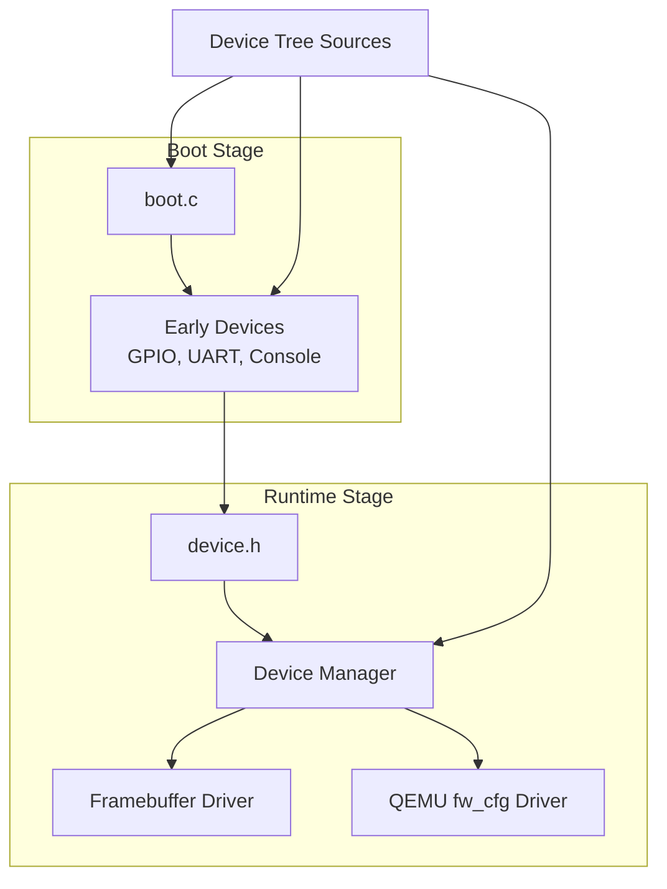
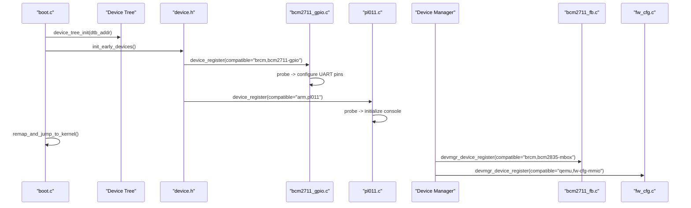
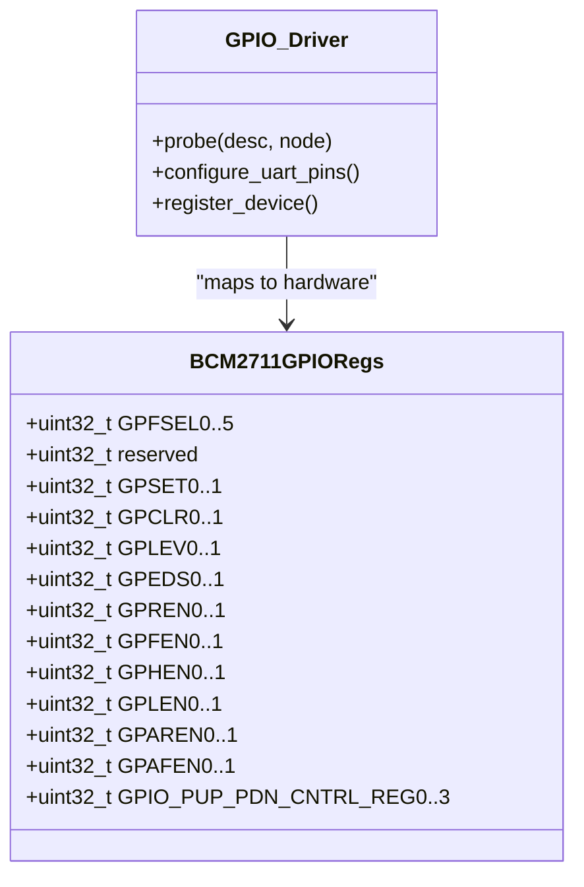
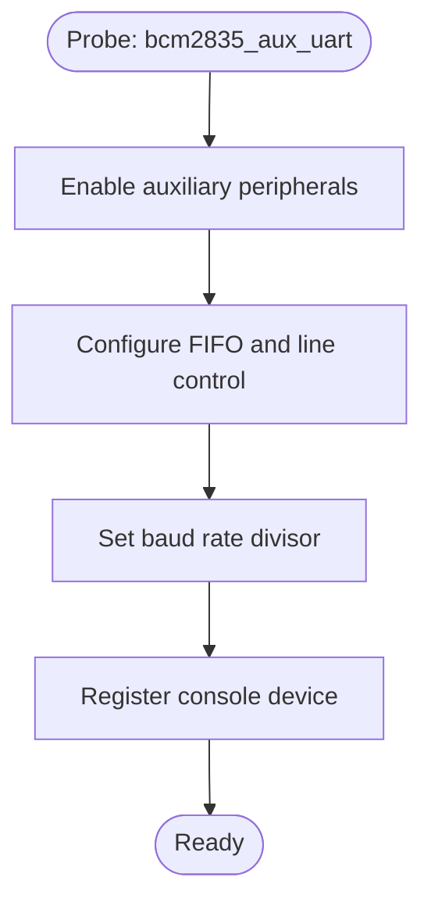
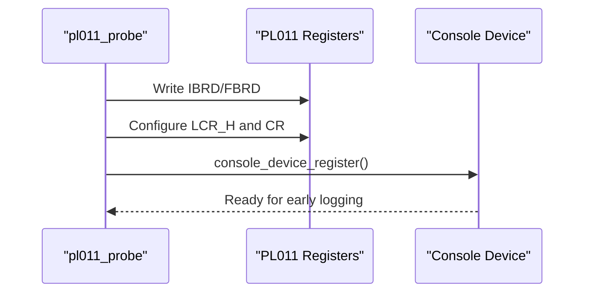
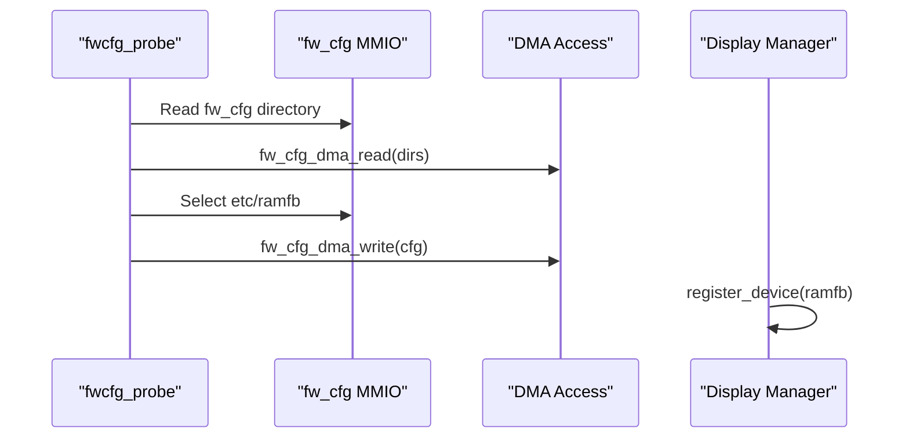
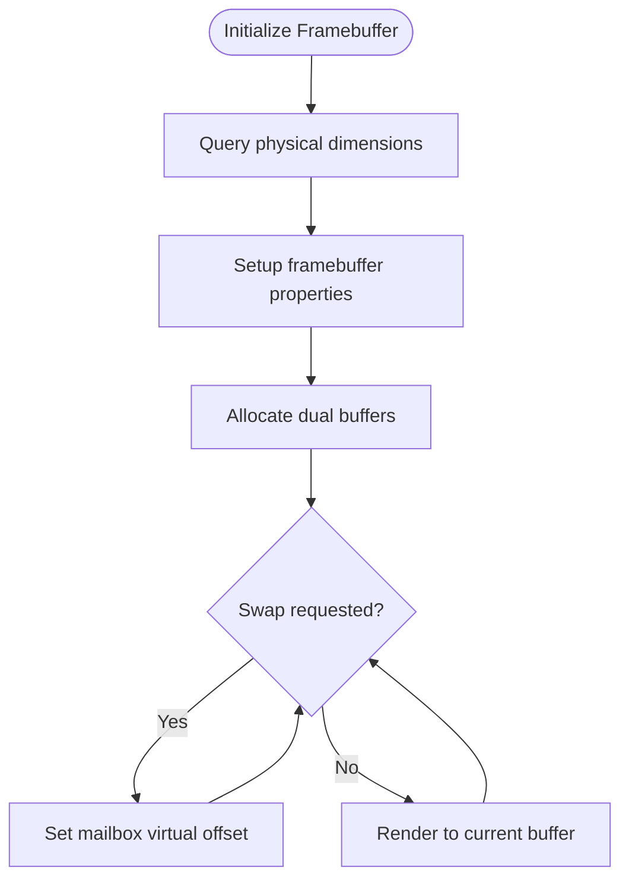
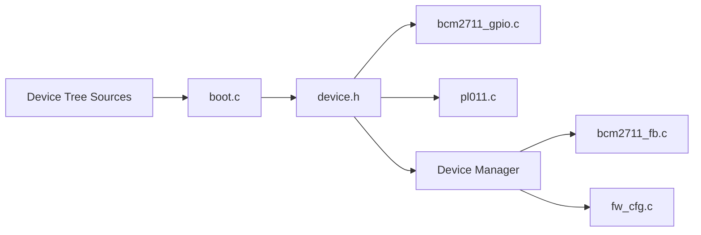

# Platform-Specific Implementations

<cite>
**Referenced Files in This Document**
- [boot.c](file://boot/boot.c)
- [device.h](file://kernel/include/device/device.h)
- [virt.dts](file://platform/QemuVirt/dts/virt.dts)
- [bcm2711-rpi-4-b.dts](file://platform/Pi4b/dts/bcm2711-rpi-4-b.dts)
- [bcm2710-rpi-3-b.dts](file://platform/Pi3b/dts/bcm2710-rpi-3-b.dts)
- [bcm2711-rpi-cm4.dts](file://platform/CM4/dts/bcm2711-rpi-cm4.dts)
- [bcm2711_gpio.c](file://boot/drivers/rpi/bcm2711-gpio/bcm2711_gpio.c)
- [bcm2711_gpio.h](file://boot/drivers/rpi/bcm2711-gpio/bcm2711_gpio.h)
- [bcm2835_aux_uart.c](file://boot/drivers/rpi/bcm2835-aux-uart/bcm2835_aux_uart.c)
- [pl011.c](file://boot/drivers/arm-uart/pl011.c)
- [pl011.h](file://boot/drivers/arm-uart/pl011.h)
- [bcm2711_fb.c](file://uapps/devmgr/drivers/rpi/rpi-fb/bcm2711_fb.c)
- [bcm2711_fb.h](file://uapps/devmgr/drivers/rpi/rpi-fb/bcm2711_fb.h)
- [fw_cfg.c](file://uapps/devmgr/drivers/virt/fw_cfg.c)
- [fw_cfg.h](file://uapps/devmgr/drivers/virt/fw_cfg.h)
</cite>

## Table of Contents
1. [Introduction](#introduction)
2. [Project Structure](#project-structure)
3. [Core Components](#core-components)
4. [Architecture Overview](#architecture-overview)
5. [Detailed Component Analysis](#detailed-component-analysis)
6. [Dependency Analysis](#dependency-analysis)
7. [Performance Considerations](#performance-considerations)
8. [Troubleshooting Guide](#troubleshooting-guide)
9. [Conclusion](#conclusion)

## Introduction
This document explains platform-specific device implementations in TranquilOS, focusing on:
- Raspberry Pi hardware support: GPIO controllers, UART interfaces, framebuffer devices, and peripheral drivers
- QEMU virtual platform implementations and hardware emulation drivers
- Platform detection via Device Tree, device initialization phases, register mappings, and HAL integration
- Boot-time versus runtime driver separation, device tree integration, and hardware register definitions
- Examples of platform detection, device configuration, and hardware-specific optimizations

## Project Structure
The platform implementations are organized by platform family and driver type:
- Boot-time drivers under boot/ handle early hardware initialization and console output
- Runtime drivers under uapps/devmgr/ integrate with the device manager for higher-level devices
- Platform Device Tree Sources define hardware layout per board and virtual platform

**Diagram sources**
- [boot.c](file://boot/boot.c#L82-L107)
- [device.h](file://kernel/include/device/device.h#L11-L35)
- [bcm2711_gpio.c](file://boot/drivers/rpi/bcm2711-gpio/bcm2711_gpio.c#L49-L65)
- [pl011.c](file://boot/drivers/arm-uart/pl011.c#L51-L83)
- [bcm2711_fb.c](file://uapps/devmgr/drivers/rpi/rpi-fb/bcm2711_fb.c#L159-L166)
- [fw_cfg.c](file://uapps/devmgr/drivers/virt/fw_cfg.c#L132-L152)

**Section sources**
- [boot.c](file://boot/boot.c#L82-L107)
- [device.h](file://kernel/include/device/device.h#L11-L35)

## Core Components
- Early device registration macros and device descriptor interface
- Platform-specific GPIO configuration for UART pin selection
- PL011 UART driver for boot-time console output
- QEMU fw_cfg driver for virtual framebuffer configuration
- Raspberry Pi framebuffer mailbox driver for display output

Key implementation references:
- Device registration macros and descriptors: [device.h](file://kernel/include/device/device.h#L11-L35)
- GPIO register structure and alt-function mapping: [bcm2711_gpio.h](file://boot/drivers/rpi/bcm2711-gpio/bcm2711_gpio.h#L52-L95)
- UART initialization and console ops: [pl011.c](file://boot/drivers/arm-uart/pl011.c#L51-L83)
- QEMU fw_cfg DMA and framebuffer configuration: [fw_cfg.c](file://uapps/devmgr/drivers/virt/fw_cfg.c#L132-L152)

**Section sources**
- [device.h](file://kernel/include/device/device.h#L11-L35)
- [bcm2711_gpio.h](file://boot/drivers/rpi/bcm2711-gpio/bcm2711_gpio.h#L52-L95)
- [pl011.c](file://boot/drivers/arm-uart/pl011.c#L51-L83)
- [fw_cfg.c](file://uapps/devmgr/drivers/virt/fw_cfg.c#L132-L152)

## Architecture Overview
The platform architecture separates boot-time and runtime responsibilities:
- Boot-time: Device Tree parsing, early device registration, console initialization, and jump to kernel
- Runtime: Device manager integrates devices, exposes HAL abstractions, and manages runtime drivers

**Diagram sources**
- [boot.c](file://boot/boot.c#L82-L107)
- [device.h](file://kernel/include/device/device.h#L29-L35)
- [bcm2711_gpio.c](file://boot/drivers/rpi/bcm2711-gpio/bcm2711_gpio.c#L49-L65)
- [pl011.c](file://boot/drivers/arm-uart/pl011.c#L51-L83)
- [bcm2711_fb.c](file://uapps/devmgr/drivers/rpi/rpi-fb/bcm2711_fb.c#L159-L166)
- [fw_cfg.c](file://uapps/devmgr/drivers/virt/fw_cfg.c#L132-L152)

## Detailed Component Analysis

### Raspberry Pi GPIO Controller
Purpose:
- Configure GPIO alternate functions for UART and other peripherals
- Provide register-level access to GPIO function select and pin state

Implementation highlights:
- Register mapping defines function select and level/state registers
- Pin selection for UART0 TX/RX on specific GPIO pins
- Early device registration for both bcm2711 and bcm2835 compatibility

**Diagram sources**
- [bcm2711_gpio.h](file://boot/drivers/rpi/bcm2711-gpio/bcm2711_gpio.h#L52-L95)
- [bcm2711_gpio.c](file://boot/drivers/rpi/bcm2711-gpio/bcm2711_gpio.c#L49-L65)

**Section sources**
- [bcm2711_gpio.h](file://boot/drivers/rpi/bcm2711-gpio/bcm2711_gpio.h#L52-L95)
- [bcm2711_gpio.c](file://boot/drivers/rpi/bcm2711-gpio/bcm2711_gpio.c#L49-L65)

### Auxiliary UART (bcm2835)
Purpose:
- Initialize auxiliary UART (mini UART) for early console on Raspberry Pi platforms

Implementation highlights:
- Enable auxiliary peripherals and configure FIFO, baud rate, and line control
- Register device descriptor for both bcm2835 and bcm2711 compatibility

**Diagram sources**
- [bcm2835_aux_uart.c](file://boot/drivers/rpi/bcm2835-aux-uart/bcm2835_aux_uart.c#L9-L23)

**Section sources**
- [bcm2835_aux_uart.c](file://boot/drivers/rpi/bcm2835-aux-uart/bcm2835_aux_uart.c#L9-L23)

### PrimeCell PL011 UART
Purpose:
- Provide boot-time console output via PrimeCell PL011 UART

Implementation highlights:
- Initialize baud rate divisors, line control, and enable transmitter/receiver
- Thread-safe console put/get with spinlock protection

**Diagram sources**
- [pl011.c](file://boot/drivers/arm-uart/pl011.c#L51-L83)
- [pl011.h](file://boot/drivers/arm-uart/pl011.h#L9-L41)

**Section sources**
- [pl011.c](file://boot/drivers/arm-uart/pl011.c#L51-L83)
- [pl011.h](file://boot/drivers/arm-uart/pl011.h#L9-L41)

### QEMU Virtual Platform fw_cfg Driver
Purpose:
- Configure virtual framebuffer via QEMU fw_cfg interface
- Allocate and set RAM framebuffers dynamically

Implementation highlights:
- Read fw_cfg directory, locate etc/ramfb entry
- DMA transfer to configure framebuffer geometry and memory
- Expose display device to display manager

**Diagram sources**
- [fw_cfg.c](file://uapps/devmgr/drivers/virt/fw_cfg.c#L132-L152)
- [fw_cfg.h](file://uapps/devmgr/drivers/virt/fw_cfg.h#L8-L47)

**Section sources**
- [fw_cfg.c](file://uapps/devmgr/drivers/virt/fw_cfg.c#L132-L152)
- [fw_cfg.h](file://uapps/devmgr/drivers/virt/fw_cfg.h#L8-L47)

### Raspberry Pi Framebuffer Driver
Purpose:
- Manage dual-buffered framebuffer via mailbox property interface
- Provide pixel write and buffer swap operations

Implementation highlights:
- Query and set framebuffer dimensions, depth, and pitch
- Allocate two buffers with configurable offsets
- Swap buffers by updating mailbox virtual offset

**Diagram sources**
- [bcm2711_fb.c](file://uapps/devmgr/drivers/rpi/rpi-fb/bcm2711_fb.c#L56-L157)
- [bcm2711_fb.h](file://uapps/devmgr/drivers/rpi/rpi-fb/bcm2711_fb.h#L12-L19)

**Section sources**
- [bcm2711_fb.c](file://uapps/devmgr/drivers/rpi/rpi-fb/bcm2711_fb.c#L56-L157)
- [bcm2711_fb.h](file://uapps/devmgr/drivers/rpi/rpi-fb/bcm2711_fb.h#L12-L19)

## Dependency Analysis
Platform drivers depend on:
- Device Tree for hardware discovery and address mapping
- Device manager for runtime device registration
- HAL abstractions for console and display interfaces

**Diagram sources**
- [boot.c](file://boot/boot.c#L82-L107)
- [device.h](file://kernel/include/device/device.h#L29-L35)
- [bcm2711_gpio.c](file://boot/drivers/rpi/bcm2711-gpio/bcm2711_gpio.c#L49-L65)
- [pl011.c](file://boot/drivers/arm-uart/pl011.c#L51-L83)
- [bcm2711_fb.c](file://uapps/devmgr/drivers/rpi/rpi-fb/bcm2711_fb.c#L159-L166)
- [fw_cfg.c](file://uapps/devmgr/drivers/virt/fw_cfg.c#L132-L152)

**Section sources**
- [boot.c](file://boot/boot.c#L82-L107)
- [device.h](file://kernel/include/device/device.h#L29-L35)

## Performance Considerations
- UART console throughput: PL011 driver uses polling with spinlocks; consider DMA or interrupts for high-throughput scenarios
- Framebuffer rendering: Dual buffering reduces tearing; ensure proper synchronization and minimal CPU overhead
- fw_cfg DMA: Batch transfers and avoid frequent reconfiguration to reduce overhead
- GPIO alt-function writes: Cache register indices and minimize repeated masking operations

## Troubleshooting Guide
Common issues and resolutions:
- UART console not appearing:
  - Verify PL011 initialization sequence and baud rate divisors
  - Confirm device registration and console registration order
- GPIO UART pins not configured:
  - Check GPFSEL register writes and alt-function selection
  - Ensure device is registered with correct compatible string
- QEMU virtual framebuffer not visible:
  - Confirm fw_cfg directory read and etc/ramfb selection
  - Validate DMA control/status bits and buffer addresses
- Framebuffer swap errors:
  - Verify mailbox property channel usage and virtual offset values
  - Ensure buffer addresses are aligned and within allocated regions

**Section sources**
- [pl011.c](file://boot/drivers/arm-uart/pl011.c#L51-L83)
- [bcm2711_gpio.c](file://boot/drivers/rpi/bcm2711-gpio/bcm2711_gpio.c#L49-L65)
- [fw_cfg.c](file://uapps/devmgr/drivers/virt/fw_cfg.c#L132-L152)
- [bcm2711_fb.c](file://uapps/devmgr/drivers/rpi/rpi-fb/bcm2711_fb.c#L56-L157)

## Conclusion
TranquilOS implements platform-specific device drivers with a clear separation between boot-time and runtime responsibilities. Device Tree drives platform detection and hardware mapping, while early device registration ensures essential peripherals (GPIO, UART) are ready before kernel handoff. Runtime drivers integrate with the device manager to expose framebuffer and virtualized hardware capabilities. The modular design allows portability across Raspberry Pi variants and QEMU virtual platforms, with straightforward extension points for new hardware.