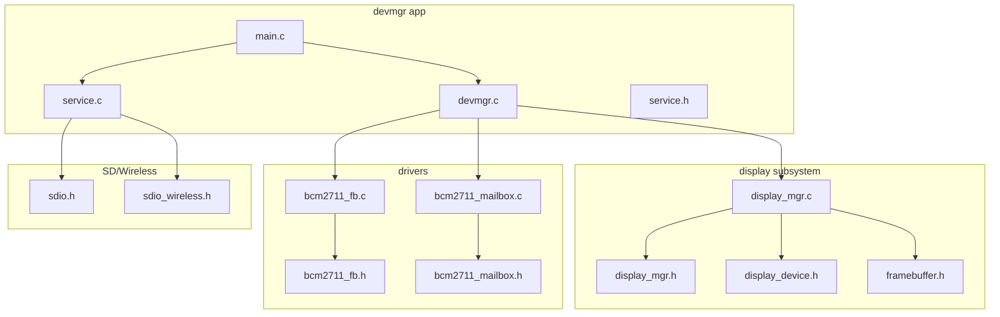
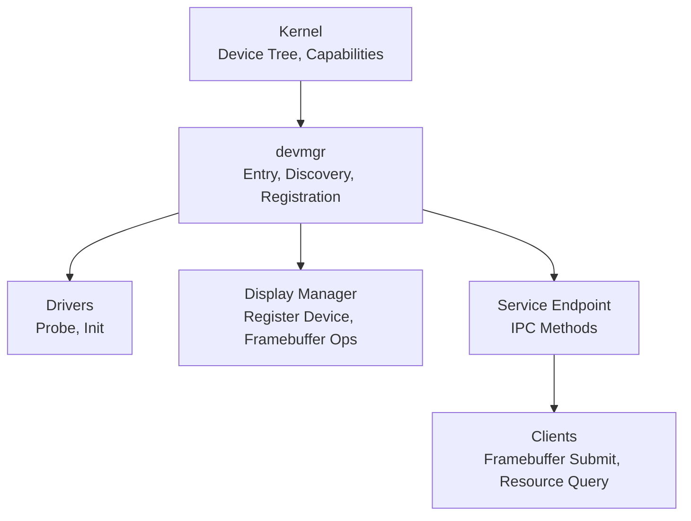
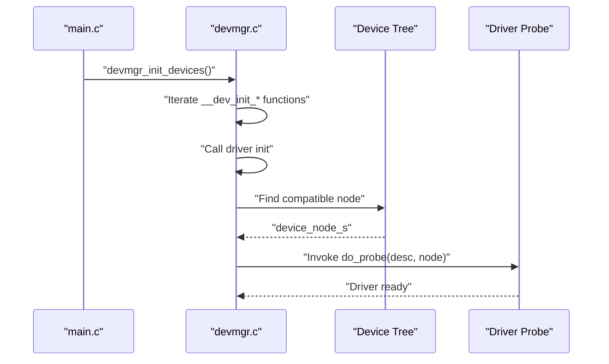
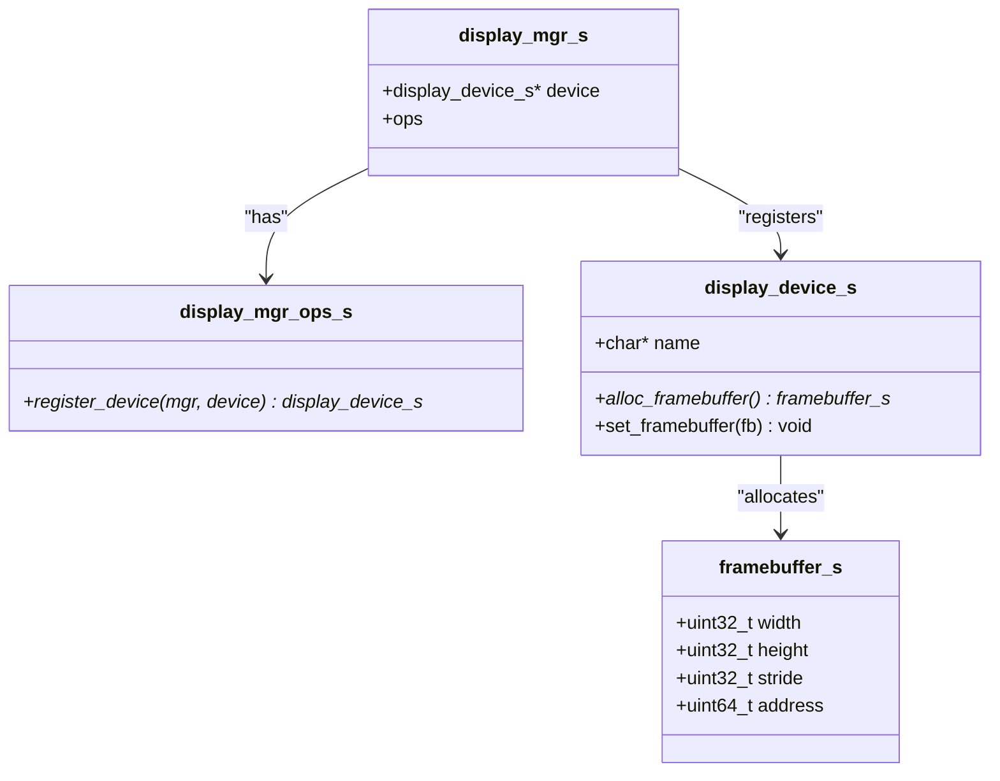
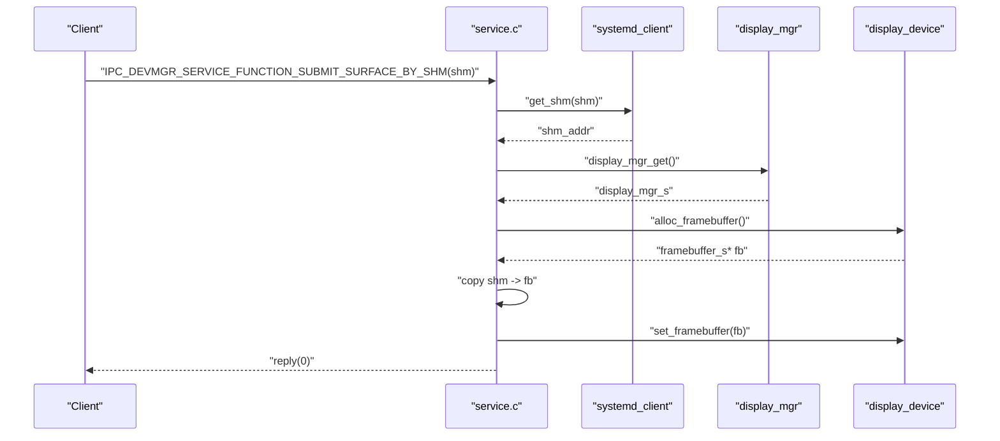
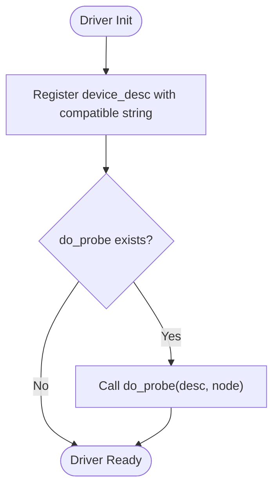
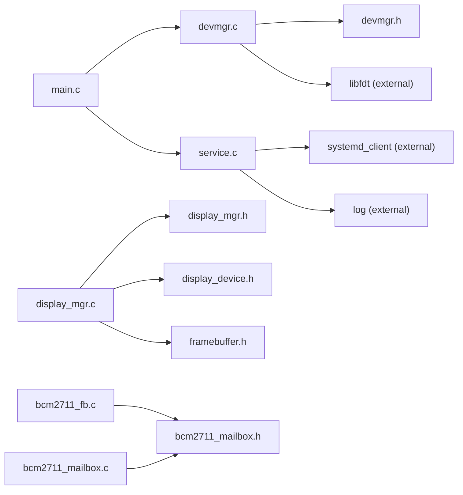

# User-Space Device Manager (devmgr)

<cite>
**Referenced Files in This Document**
- [main.c](file://uapps/devmgr/main.c)
- [devmgr.c](file://uapps/devmgr/devmgr.c)
- [service.c](file://uapps/devmgr/service.c)
- [devmgr.h](file://uapps/devmgr/include/devmgr.h)
- [service.h](file://uapps/devmgr/include/service.h)
- [display_mgr.c](file://uapps/devmgr/peripherals/display/display_mgr.c)
- [display_mgr.h](file://uapps/devmgr/include/peripherals/display/display_mgr.h)
- [display_device.h](file://uapps/devmgr/include/peripherals/display/device/display_device.h)
- [framebuffer.h](file://uapps/devmgr/include/peripherals/display/framebuffer.h)
- [bcm2711_fb.c](file://uapps/devmgr/drivers/rpi/rpi-fb/bcm2711_fb.c)
- [bcm2711_fb.h](file://uapps/devmgr/drivers/rpi/rpi-fb/bcm2711_fb.h)
- [bcm2711_mailbox.c](file://uapps/devmgr/drivers/rpi/rpi-fb/bcm2711_mailbox.c)
- [bcm2711_mailbox.h](file://uapps/devmgr/drivers/rpi/rpi-fb/bcm2711_mailbox.h)
- [sdio.h](file://uapps/devmgr/include/sd/sdio.h)
- [sdio_wireless.h](file://uapps/devmgr/include/sd/sdio_wireless.h)
</cite>

## Table of Contents
1. [Introduction](#introduction)
2. [Project Structure](#project-structure)
3. [Core Components](#core-components)
4. [Architecture Overview](#architecture-overview)
5. [Detailed Component Analysis](#detailed-component-analysis)
6. [Dependency Analysis](#dependency-analysis)
7. [Performance Considerations](#performance-considerations)
8. [Troubleshooting Guide](#troubleshooting-guide)
9. [Conclusion](#conclusion)
10. [Appendices](#appendices)

## Introduction
This document describes the user-space device manager (devmgr) in TranquilOS. The devmgr orchestrates device discovery, driver coordination, and user-space service delegation. It initializes display management, registers devices discovered via the device tree, and exposes a service interface for clients to submit framebuffers and retrieve resources. The devmgr coordinates with kernel-provided device tree information and integrates with the system service registry for IPC-based client interactions.

## Project Structure
The devmgr lives under uapps/devmgr and is composed of:
- Application entry and orchestration
- Device discovery and registration
- Display manager and device abstractions
- Drivers for Raspberry Pi peripherals (framebuffer and mailbox)
- SDIO and wireless protocol definitions
- Service endpoint for IPC

**Diagram sources**
- [main.c](file://uapps/devmgr/main.c#L1-L18)
- [devmgr.c](file://uapps/devmgr/devmgr.c#L1-L62)
- [service.c](file://uapps/devmgr/service.c#L1-L72)
- [display_mgr.c](file://uapps/devmgr/peripherals/display/display_mgr.c#L1-L31)
- [display_mgr.h](file://uapps/devmgr/include/peripherals/display/display_mgr.h#L1-L20)
- [display_device.h](file://uapps/devmgr/include/peripherals/display/device/display_device.h#L1-L16)
- [framebuffer.h](file://uapps/devmgr/include/peripherals/display/framebuffer.h#L1-L16)
- [bcm2711_fb.c](file://uapps/devmgr/drivers/rpi/rpi-fb/bcm2711_fb.c#L1-L173)
- [bcm2711_fb.h](file://uapps/devmgr/drivers/rpi/rpi-fb/bcm2711_fb.h#L1-L22)
- [bcm2711_mailbox.c](file://uapps/devmgr/drivers/rpi/rpi-fb/bcm2711_mailbox.c#L1-L43)
- [bcm2711_mailbox.h](file://uapps/devmgr/drivers/rpi/rpi-fb/bcm2711_mailbox.h#L1-L161)
- [sdio.h](file://uapps/devmgr/include/sd/sdio.h#L1-L105)
- [sdio_wireless.h](file://uapps/devmgr/include/sd/sdio_wireless.h#L1-L62)

**Section sources**
- [main.c](file://uapps/devmgr/main.c#L1-L18)
- [devmgr.c](file://uapps/devmgr/devmgr.c#L1-L62)
- [service.c](file://uapps/devmgr/service.c#L1-L72)
- [display_mgr.c](file://uapps/devmgr/peripherals/display/display_mgr.c#L1-L31)
- [bcm2711_fb.c](file://uapps/devmgr/drivers/rpi/rpi-fb/bcm2711_fb.c#L1-L173)
- [bcm2711_mailbox.c](file://uapps/devmgr/drivers/rpi/rpi-fb/bcm2711_mailbox.c#L1-L43)
- [sdio.h](file://uapps/devmgr/include/sd/sdio.h#L1-L105)
- [sdio_wireless.h](file://uapps/devmgr/include/sd/sdio_wireless.h#L1-L62)

## Core Components
- Application entry and loop: Initializes display, discovers devices, registers services, and yields control in a loop.
- Device manager: Discovers devices by compatible string in the device tree, resolves nodes, and invokes driver probe routines.
- Display manager: Provides a singleton display manager that registers a display device and manages framebuffers.
- Service endpoint: Exposes IPC methods for framebuffer submission and resource queries.
- Drivers: RPi mailbox and framebuffer drivers demonstrate device probing and registration.

Key responsibilities:
- Device discovery and driver coordination via device tree.
- Display management and framebuffer operations.
- Service lifecycle and IPC method dispatch.
- Inter-process communication with kernel via system service registry.

**Section sources**
- [main.c](file://uapps/devmgr/main.c#L6-L15)
- [devmgr.c](file://uapps/devmgr/devmgr.c#L33-L55)
- [display_mgr.c](file://uapps/devmgr/peripherals/display/display_mgr.c#L25-L31)
- [service.c](file://uapps/devmgr/service.c#L68-L72)

## Architecture Overview
The devmgr architecture separates concerns across discovery, driver coordination, display management, and service exposure. The kernel supplies the device tree and system capabilities; devmgr uses them to locate hardware, initialize drivers, and expose services.

**Diagram sources**
- [main.c](file://uapps/devmgr/main.c#L6-L15)
- [devmgr.c](file://uapps/devmgr/devmgr.c#L33-L55)
- [display_mgr.c](file://uapps/devmgr/peripherals/display/display_mgr.c#L25-L31)
- [service.c](file://uapps/devmgr/service.c#L68-L72)

## Detailed Component Analysis

### Application Entry and Initialization
- Initializes display manager, discovers devices, registers the devmgr service, and enters an infinite yield loop.
- Typical initialization pattern:
  - Initialize display manager.
  - Discover and probe devices.
  - Register service with the system.

Example references:
- [Application entry and loop](file://uapps/devmgr/main.c#L6-L15)

**Section sources**
- [main.c](file://uapps/devmgr/main.c#L6-L15)

### Device Discovery and Driver Coordination
- Device discovery uses the device tree base pointer provided by the kernel and a compatible string to locate nodes.
- Registration invokes a driver’s probe routine if present.
- Device initialization functions are linked into a special section and executed during startup.

Key APIs and patterns:
- Find device by compatible string.
- Get node address.
- Register device descriptor and invoke probe.
- Iterate device init functions linked in a special section.

Example references:
- [Device registration and probe invocation](file://uapps/devmgr/devmgr.c#L33-L55)
- [Device init function macro and iteration](file://uapps/devmgr/devmgr.c#L57-L62)
- [Device descriptor and compatible string](file://uapps/devmgr/include/devmgr.h#L17-L20)

**Diagram sources**
- [main.c](file://uapps/devmgr/main.c#L9-L11)
- [devmgr.c](file://uapps/devmgr/devmgr.c#L57-L62)
- [devmgr.c](file://uapps/devmgr/devmgr.c#L33-L55)
- [devmgr.h](file://uapps/devmgr/include/devmgr.h#L17-L20)

**Section sources**
- [devmgr.c](file://uapps/devmgr/devmgr.c#L33-L55)
- [devmgr.c](file://uapps/devmgr/devmgr.c#L57-L62)
- [devmgr.h](file://uapps/devmgr/include/devmgr.h#L17-L20)

### Display Management
- Display manager maintains a singleton instance and registers a display device.
- The display device exposes allocation and setting of framebuffers.
- The service layer can submit surfaces by shared memory to update the display.

Key types and operations:
- Display manager singleton and registration function.
- Display device interface for framebuffer operations.
- Framebuffer structure with width, height, stride, and address.

Example references:
- [Display manager initialization and registration](file://uapps/devmgr/peripherals/display/display_mgr.c#L25-L31)
- [Display manager interface](file://uapps/devmgr/include/peripherals/display/display_mgr.h#L11-L14)
- [Display device interface](file://uapps/devmgr/include/peripherals/display/device/display_device.h#L8-L14)
- [Framebuffer structure](file://uapps/devmgr/include/peripherals/display/framebuffer.h#L8-L14)

**Diagram sources**
- [display_mgr.h](file://uapps/devmgr/include/peripherals/display/display_mgr.h#L11-L14)
- [display_device.h](file://uapps/devmgr/include/peripherals/display/device/display_device.h#L8-L14)
- [framebuffer.h](file://uapps/devmgr/include/peripherals/display/framebuffer.h#L8-L14)

**Section sources**
- [display_mgr.c](file://uapps/devmgr/peripherals/display/display_mgr.c#L25-L31)
- [display_mgr.h](file://uapps/devmgr/include/peripherals/display/display_mgr.h#L11-L14)
- [display_device.h](file://uapps/devmgr/include/peripherals/display/device/display_device.h#L8-L14)
- [framebuffer.h](file://uapps/devmgr/include/peripherals/display/framebuffer.h#L8-L14)

### Service Endpoint and IPC
- Registers a service with the system and handles IPC methods for framebuffer operations and resource queries.
- Supports submitting a surface via shared memory by retrieving a shared memory region from the system and copying pixel data into the current framebuffer.

Key operations:
- Service registration.
- IPC method dispatch.
- Shared memory retrieval and framebuffer copy.

Example references:
- [Service registration](file://uapps/devmgr/service.c#L68-L72)
- [IPC entry and method dispatch](file://uapps/devmgr/service.c#L42-L66)
- [Surface submission via shared memory](file://uapps/devmgr/service.c#L10-L40)

**Diagram sources**
- [service.c](file://uapps/devmgr/service.c#L42-L66)
- [service.c](file://uapps/devmgr/service.c#L10-L40)
- [display_mgr.c](file://uapps/devmgr/peripherals/display/display_mgr.c#L21-L23)
- [display_device.h](file://uapps/devmgr/include/peripherals/display/device/display_device.h#L8-L14)

**Section sources**
- [service.c](file://uapps/devmgr/service.c#L42-L66)
- [service.c](file://uapps/devmgr/service.c#L68-L72)

### Drivers: Mailbox and Framebuffer
- Mailbox driver: Probes and registers a compatible device for mailbox communication.
- Framebuffer driver: Demonstrates device probing and registration; includes mailbox-based framebuffer setup and buffer swapping.

Key references:
- [Mailbox driver registration](file://uapps/devmgr/drivers/rpi/rpi-fb/bcm2711_mailbox.c#L35-L43)
- [Mailbox driver probe](file://uapps/devmgr/drivers/rpi/rpi-fb/bcm2711_mailbox.c#L31-L33)
- [Framebuffer driver registration](file://uapps/devmgr/drivers/rpi/rpi-fb/bcm2711_fb.c#L165-L173)
- [Framebuffer driver probe](file://uapps/devmgr/drivers/rpi/rpi-fb/bcm2711_fb.c#L159-L163)
- [Mailbox constants and channels](file://uapps/devmgr/drivers/rpi/rpi-fb/bcm2711_mailbox.h#L7-L18)
- [Framebuffer structure](file://uapps/devmgr/drivers/rpi/rpi-fb/bcm2711_fb.h#L12-L19)

**Diagram sources**
- [bcm2711_mailbox.c](file://uapps/devmgr/drivers/rpi/rpi-fb/bcm2711_mailbox.c#L35-L43)
- [bcm2711_fb.c](file://uapps/devmgr/drivers/rpi/rpi-fb/bcm2711_fb.c#L165-L173)

**Section sources**
- [bcm2711_mailbox.c](file://uapps/devmgr/drivers/rpi/rpi-fb/bcm2711_mailbox.c#L31-L43)
- [bcm2711_fb.c](file://uapps/devmgr/drivers/rpi/rpi-fb/bcm2711_fb.c#L159-L173)
- [bcm2711_mailbox.h](file://uapps/devmgr/drivers/rpi/rpi-fb/bcm2711_mailbox.h#L7-L18)
- [bcm2711_fb.h](file://uapps/devmgr/drivers/rpi/rpi-fb/bcm2711_fb.h#L12-L19)

### SD Card and Wireless Protocol Support
- SDIO command structures and response formats are defined for IO SEND OP_COND, IO_RW_DIRECT, and IO_RW_EXTENDED commands.
- Wireless LAN command identifiers and packet structures are defined for scanning, connecting, establishing, Wi-Fi Direct, WPS, and disconnect operations.

Example references:
- [SDIO command definitions](file://uapps/devmgr/include/sd/sdio.h#L7-L103)
- [Wireless LAN command and response structures](file://uapps/devmgr/include/sd/sdio_wireless.h#L18-L61)

Note: These headers define the wire protocols and data structures used by higher-level SDIO/WLAN stacks. They are not instantiated here but serve as the foundation for future SD card and wireless device drivers.

**Section sources**
- [sdio.h](file://uapps/devmgr/include/sd/sdio.h#L7-L103)
- [sdio_wireless.h](file://uapps/devmgr/include/sd/sdio_wireless.h#L18-L61)

## Dependency Analysis
The devmgr composes several layers:
- Entry and service depend on logging and system IPC.
- Device manager depends on device tree parsing and driver descriptors.
- Display manager depends on display device and framebuffer abstractions.
- Drivers depend on mailbox and device tree interfaces.

**Diagram sources**
- [main.c](file://uapps/devmgr/main.c#L1-L18)
- [devmgr.c](file://uapps/devmgr/devmgr.c#L1-L62)
- [service.c](file://uapps/devmgr/service.c#L1-L72)
- [display_mgr.c](file://uapps/devmgr/peripherals/display/display_mgr.c#L1-L31)
- [bcm2711_fb.c](file://uapps/devmgr/drivers/rpi/rpi-fb/bcm2711_fb.c#L1-L173)
- [bcm2711_mailbox.c](file://uapps/devmgr/drivers/rpi/rpi-fb/bcm2711_mailbox.c#L1-L43)

**Section sources**
- [main.c](file://uapps/devmgr/main.c#L1-L18)
- [devmgr.c](file://uapps/devmgr/devmgr.c#L1-L62)
- [service.c](file://uapps/devmgr/service.c#L1-L72)
- [display_mgr.c](file://uapps/devmgr/peripherals/display/display_mgr.c#L1-L31)
- [bcm2711_fb.c](file://uapps/devmgr/drivers/rpi/rpi-fb/bcm2711_fb.c#L1-L173)
- [bcm2711_mailbox.c](file://uapps/devmgr/drivers/rpi/rpi-fb/bcm2711_mailbox.c#L1-L43)

## Performance Considerations
- Device discovery iterates a small number of driver init functions; overhead is minimal at boot.
- Framebuffer copy in the service layer is a bulk memory operation; ensure shared memory alignment and size match framebuffer dimensions to avoid extra copies.
- Mailbox operations are synchronous; batch operations where possible to reduce latency.
- Logging should be kept at appropriate verbosity to minimize overhead in steady state.

## Troubleshooting Guide
Common issues and diagnostics:
- Device tree not available: If the device tree physical address is zero, device discovery fails. Verify kernel provides DTB via system control.
  - Reference: [Device tree retrieval and error handling](file://uapps/devmgr/devmgr.c#L38-L44)
- Compatible string mismatch: If no node matches the driver’s compatible string, the driver does not probe.
  - Reference: [Compatible node lookup](file://uapps/devmgr/devmgr.c#L15-L21)
- Display manager not initialized: If the display manager is not initialized before use, framebuffer operations fail.
  - Reference: [Display manager initialization](file://uapps/devmgr/peripherals/display/display_mgr.c#L25-L31)
- No display device registered: Attempting to allocate or set a framebuffer without a registered device fails.
  - Reference: [Display device registration](file://uapps/devmgr/peripherals/display/display_mgr.c#L6-L19)
- Service method not recognized: Unknown IPC methods are logged as errors.
  - Reference: [IPC method dispatch](file://uapps/devmgr/service.c#L42-L66)

**Section sources**
- [devmgr.c](file://uapps/devmgr/devmgr.c#L38-L44)
- [devmgr.c](file://uapps/devmgr/devmgr.c#L15-L21)
- [display_mgr.c](file://uapps/devmgr/peripherals/display/display_mgr.c#L25-L31)
- [display_mgr.c](file://uapps/devmgr/peripherals/display/display_mgr.c#L6-L19)
- [service.c](file://uapps/devmgr/service.c#L42-L66)

## Conclusion
The devmgr provides a clean separation between kernel-provided device tree information and user-space driver coordination. It initializes display management, discovers and probes devices, and exposes a service interface for clients to manage framebuffers. The modular design allows new drivers and services to be integrated with minimal changes, while the service endpoint ensures robust IPC-based interactions.

## Appendices

### Example Operation Patterns
- Device manager initialization and service registration:
  - [Initialization sequence](file://uapps/devmgr/main.c#L9-L11)
  - [Service registration](file://uapps/devmgr/service.c#L68-L72)
- Device registration and probe:
  - [Registration and probe invocation](file://uapps/devmgr/devmgr.c#L33-L55)
  - [Driver registration macros and examples](file://uapps/devmgr/drivers/rpi/rpi-fb/bcm2711_mailbox.c#L35-L43)
  - [Driver registration macros and examples](file://uapps/devmgr/drivers/rpi/rpi-fb/bcm2711_fb.c#L165-L173)
- Display framebuffer submission via shared memory:
  - [Shared memory retrieval and copy](file://uapps/devmgr/service.c#L10-L40)
  - [Framebuffers and display device interface](file://uapps/devmgr/include/peripherals/display/framebuffer.h#L8-L14)
  - [Display device operations](file://uapps/devmgr/include/peripherals/display/device/display_device.h#L8-L14)