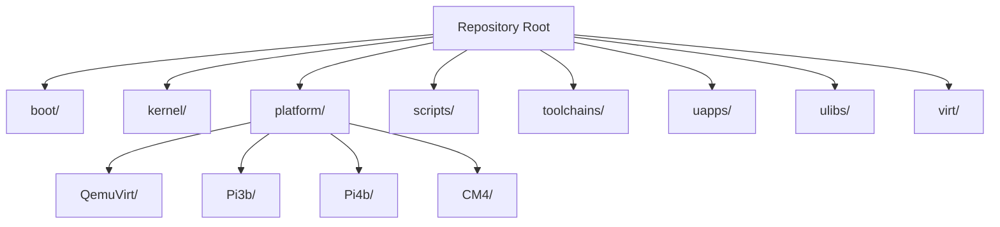
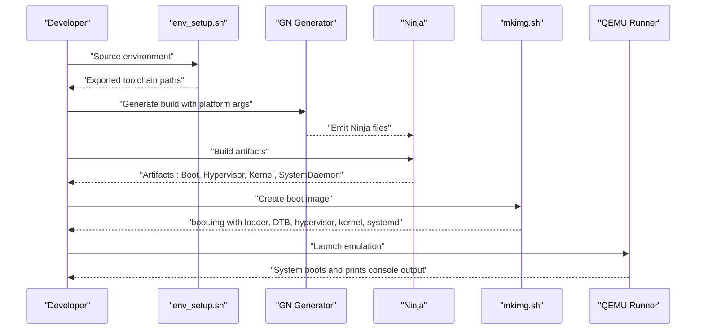
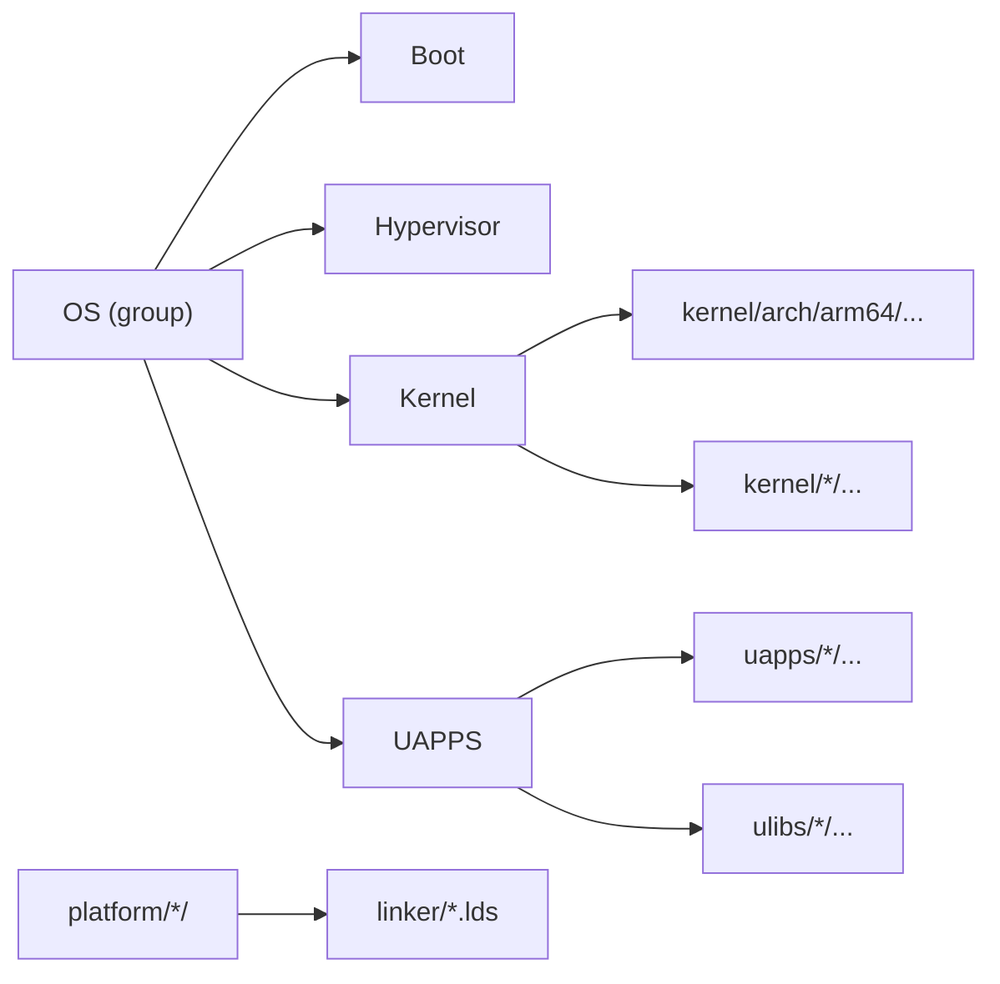

# Getting Started

<cite>
**Referenced Files in This Document**
- [README.md](file://README.md)
- [BUILD.gn](file://BUILD.gn)
- [env_setup.sh](file://env_setup.sh)
- [scripts/build_qemu.sh](file://scripts/build_qemu.sh)
- [scripts/build_pi3b.sh](file://scripts/build_pi3b.sh)
- [scripts/build_pi4b.sh](file://scripts/build_pi4b.sh)
- [scripts/build_cm4.sh](file://scripts/build_cm4.sh)
- [run_qemu_virt.sh](file://run_qemu_virt.sh)
- [scripts/mkimg.sh](file://scripts/mkimg.sh)
- [scripts/qemu.virt.boot.run](file://scripts/qemu.virt.boot.run)
- [scripts/qemu.rasp3b.boot.run](file://scripts/qemu.rasp3b.boot.run)
- [platform/QemuVirt/linker/virt.lds](file://platform/QemuVirt/linker/virt.lds)
- [platform/Pi3b/linker/kernel.lds](file://platform/Pi3b/linker/kernel.lds)
- [platform/Pi4b/linker/kernel.lds](file://platform/Pi4b/linker/kernel.lds)
- [platform/CM4/linker/kernel.lds](file://platform/CM4/linker/kernel.lds)
- [toolchains/README.md](file://toolchains/README.md)
</cite>

## Table of Contents
1. [Introduction](#introduction)
2. [Project Structure](#project-structure)
3. [Core Components](#core-components)
4. [Architecture Overview](#architecture-overview)
5. [Detailed Component Analysis](#detailed-component-analysis)
6. [Dependency Analysis](#dependency-analysis)
7. [Performance Considerations](#performance-considerations)
8. [Troubleshooting Guide](#troubleshooting-guide)
9. [Conclusion](#conclusion)
10. [Appendices](#appendices)

## Introduction
This guide helps you install, configure, and build TranquilOS for development. It covers:
- Prerequisites and environment setup
- Toolchain acquisition and configuration
- Build system usage with GN and Ninja
- Building for QEMU virtual machines and Raspberry Pi platforms
- Verification steps and basic usage
- Troubleshooting common issues

TranquilOS is an aarch64 microkernel-based operating system. The repository provides scripts and linker configurations to build and run the system on QEMU and Raspberry Pi variants.

## Project Structure
At a high level, the repository organizes code by functional areas:
- boot: Bootloader and early boot support
- kernel: Microkernel core, architecture-specific code, and subsystems
- platform: Platform-specific device tree blobs, firmware configs, and linker scripts
- scripts: Build and run automation for various targets
- toolchains: Toolchain binaries and documentation
- uapps: Userspace system services and applications
- ulibs: Shared userspace libraries
- virt: Hypervisor layer for virtualized environments

**Section sources**
- [README.md](file://README.md#L1-L42)
- [BUILD.gn](file://BUILD.gn#L1-L9)

## Core Components
- Build system: GN (Generate) and Ninja are used to configure and compile the system.
- Toolchain: aarch64 cross-toolchain binaries are required for compilation.
- Scripts: Convenience scripts orchestrate generation, building, image creation, and launching emulators.
- Linker scripts: Platform-specific memory layouts define load addresses and sections.
- Targets: QEMU virtual machine and Raspberry Pi boards (Pi3b, Pi4b, CM4).

Key entry points for setup and builds:
- Environment setup script exports paths for GN and the aarch64 toolchain.
- Per-platform build scripts initialize GN args and invoke Ninja.
- Image creation script packages binaries into a single boot image.
- Run scripts launch QEMU with appropriate machine, CPU, and memory settings.

**Section sources**
- [env_setup.sh](file://env_setup.sh#L1-L5)
- [scripts/build_qemu.sh](file://scripts/build_qemu.sh#L1-L6)
- [scripts/build_pi3b.sh](file://scripts/build_pi3b.sh#L1-L6)
- [scripts/build_pi4b.sh](file://scripts/build_pi4b.sh#L1-L6)
- [scripts/build_cm4.sh](file://scripts/build_cm4.sh#L1-L6)
- [scripts/mkimg.sh](file://scripts/mkimg.sh#L1-L38)
- [scripts/qemu.virt.boot.run](file://scripts/qemu.virt.boot.run#L1-L19)
- [scripts/qemu.rasp3b.boot.run](file://scripts/qemu.rasp3b.boot.run#L1-L13)

## Architecture Overview
The build-and-run pipeline connects environment setup, GN/Ninja, image creation, and emulator launch.

**Diagram sources**
- [env_setup.sh](file://env_setup.sh#L1-L5)
- [scripts/build_qemu.sh](file://scripts/build_qemu.sh#L1-L6)
- [scripts/mkimg.sh](file://scripts/mkimg.sh#L1-L38)
- [scripts/qemu.virt.boot.run](file://scripts/qemu.virt.boot.run#L1-L19)

## Detailed Component Analysis

### Prerequisites and Environment Setup
- Operating system: macOS recommended for the provided toolchain binaries.
- Toolchain: Download and extract the aarch64 toolchain to a local path. The repository documents the toolchain location and expects GN and the aarch64 compiler in PATH via the environment script.
- GN: Installed alongside the toolchain; the environment script prepends GN’s bin directory to PATH.
- Optional: Install QEMU for emulation if you plan to test on QEMU.

Verification steps:
- Source the environment script to export paths.
- Verify that GN and aarch64-elf-gcc are available on PATH.
- Confirm the OS base directory variable is set.

**Section sources**
- [toolchains/README.md](file://toolchains/README.md#L1-L3)
- [env_setup.sh](file://env_setup.sh#L1-L5)

### Toolchain Setup
- Place the aarch64 toolchain under the toolchains directory as indicated by the environment script.
- Ensure GN and the aarch64 cross-compiler are executable and discoverable via PATH after sourcing the environment script.

Notes:
- The image creation script uses the aarch64-elf objcopy binary from the toolchain; confirm it exists at the expected path.

**Section sources**
- [env_setup.sh](file://env_setup.sh#L1-L5)
- [scripts/mkimg.sh](file://scripts/mkimg.sh#L1-L5)

### Build System Configuration (GN and Ninja)
- GN groups the OS components into a single target that depends on Boot, Hypervisor, Kernel, and UAPPS.
- Per-platform builds set GN args to select the target platform.
- Ninja compiles the generated build files.

Typical workflow:
- Clean previous output.
- Generate GN build with the desired platform argument.
- Invoke Ninja to build.

**Section sources**
- [BUILD.gn](file://BUILD.gn#L1-L9)
- [scripts/build_qemu.sh](file://scripts/build_qemu.sh#L1-L6)
- [scripts/build_pi3b.sh](file://scripts/build_pi3b.sh#L1-L6)
- [scripts/build_pi4b.sh](file://scripts/build_pi4b.sh#L1-L6)
- [scripts/build_cm4.sh](file://scripts/build_cm4.sh#L1-L6)

### Building for QEMU Virtual Platform
- Use the QEMU build script to configure and build for the virtual platform.
- The run script performs three actions: builds, creates the boot image, and launches QEMU.
- QEMU is configured with a virtual machine, CPU, SMP cores, memory, kernel, DTB, and serial console.

Verification steps:
- After running the run script, observe console output in the terminal.
- Ensure the system initializes and reaches a usable prompt or logs.

**Section sources**
- [scripts/build_qemu.sh](file://scripts/build_qemu.sh#L1-L6)
- [run_qemu_virt.sh](file://run_qemu_virt.sh#L1-L5)
- [scripts/qemu.virt.boot.run](file://scripts/qemu.virt.boot.run#L1-L19)

### Building for Raspberry Pi Platforms
- Pi3b, Pi4b, and CM4 share similar build scripts that set the platform GN arg and invoke Ninja.
- The linker scripts for each platform define load addresses and section layout for the kernel and related components.

Verification steps:
- Confirm the correct platform script is used for your target board.
- Ensure the resulting images are present in the output directory before flashing or emulation.

**Section sources**
- [scripts/build_pi3b.sh](file://scripts/build_pi3b.sh#L1-L6)
- [scripts/build_pi4b.sh](file://scripts/build_pi4b.sh#L1-L6)
- [scripts/build_cm4.sh](file://scripts/build_cm4.sh#L1-L6)
- [platform/Pi3b/linker/kernel.lds](file://platform/Pi3b/linker/kernel.lds#L1-L73)
- [platform/Pi4b/linker/kernel.lds](file://platform/Pi4b/linker/kernel.lds#L1-L73)
- [platform/CM4/linker/kernel.lds](file://platform/CM4/linker/kernel.lds#L1-L73)

### Image Creation and Boot Image Packaging
- The image creation script converts ELF artifacts to raw binaries and assembles them into a single boot image.
- It embeds the loader, DTB, hypervisor, kernel, systemd, and a ramdisk containing userspace services.
- The resulting boot image is passed to QEMU or used for physical SD card flashing.

Verification steps:
- Confirm the boot image is created and contains the expected segments at the correct offsets.
- Validate that the ramdisk includes the built userspace services.

**Section sources**
- [scripts/mkimg.sh](file://scripts/mkimg.sh#L1-L38)

### Running on QEMU (Virtual Machine)
- The QEMU runner sets machine type, CPU, SMP, memory, kernel, DTB, and serial console.
- It supports graphical output and input devices suitable for testing.

Verification steps:
- Check that QEMU starts and displays console output.
- If needed, enable remote debugging by uncommenting the relevant QEMU option in the runner script.

**Section sources**
- [scripts/qemu.virt.boot.run](file://scripts/qemu.virt.boot.run#L1-L19)

### Running on Raspberry Pi (Physical Board)
- Use the Pi3b runner script to emulate the Pi 3B machine with QEMU for quick testing.
- For real hardware, flash the boot image to an SD card and boot the Pi.

Verification steps:
- On QEMU Pi3b emulation, confirm console output appears.
- On physical hardware, ensure the SD card is properly prepared and inserted.

**Section sources**
- [scripts/qemu.rasp3b.boot.run](file://scripts/qemu.rasp3b.boot.run#L1-L13)

## Dependency Analysis
The build system composes the OS from modular components. The top-level group aggregates Boot, Hypervisor, Kernel, and UAPPS. Platform-specific linker scripts define memory layouts per target.

**Diagram sources**
- [BUILD.gn](file://BUILD.gn#L1-L9)
- [platform/QemuVirt/linker/virt.lds](file://platform/QemuVirt/linker/virt.lds#L1-L70)
- [platform/Pi3b/linker/kernel.lds](file://platform/Pi3b/linker/kernel.lds#L1-L73)
- [platform/Pi4b/linker/kernel.lds](file://platform/Pi4b/linker/kernel.lds#L1-L73)
- [platform/CM4/linker/kernel.lds](file://platform/CM4/linker/kernel.lds#L1-L73)

**Section sources**
- [BUILD.gn](file://BUILD.gn#L1-L9)

## Performance Considerations
- Use Ninja’s parallelism to speed up builds; it respects the number of CPU cores available.
- Keep toolchain binaries close to the repository root to minimize path resolution overhead.
- For QEMU runs, adjust SMP and memory settings to match your host resources.

[No sources needed since this section provides general guidance]

## Troubleshooting Guide
Common issues and resolutions:
- Toolchain not found:
  - Ensure the environment script is sourced and the toolchain directory matches the paths exported by the script.
  - Verify that GN and aarch64-elf-* tools are executable and on PATH.
- Build failures:
  - Clean the output directory and regenerate with the correct platform argument.
  - Confirm that the platform selection matches the intended target.
- Image creation errors:
  - Ensure the aarch64-elf objcopy binary exists at the expected path.
  - Confirm that all required ELF artifacts are present in the output directory before running the image script.
- QEMU launch issues:
  - Verify that QEMU is installed and supports the selected machine and CPU.
  - Check that the DTB and kernel paths are correct and accessible.
- No console output:
  - Confirm the serial console is enabled and the terminal is connected to the QEMU console.
  - For Pi3b emulation, ensure the nographic flag is appropriate for your terminal setup.

**Section sources**
- [env_setup.sh](file://env_setup.sh#L1-L5)
- [scripts/mkimg.sh](file://scripts/mkimg.sh#L1-L5)
- [scripts/qemu.virt.boot.run](file://scripts/qemu.virt.boot.run#L1-L19)
- [scripts/qemu.rasp3b.boot.run](file://scripts/qemu.rasp3b.boot.run#L1-L13)

## Conclusion
You now have the essentials to set up the development environment, configure the toolchain, build the system for QEMU and Raspberry Pi platforms, and verify operation. Use the provided scripts to streamline the workflow and refer to the troubleshooting section for common issues.

[No sources needed since this section summarizes without analyzing specific files]

## Appendices

### Appendix A: Quick Start Checklist
- Install the aarch64 toolchain and place it under the toolchains directory.
- Source the environment script to export toolchain paths.
- Choose a platform and run the corresponding build script.
- Create the boot image and launch QEMU or prepare an SD card for physical boards.
- Verify console output and basic functionality.

**Section sources**
- [toolchains/README.md](file://toolchains/README.md#L1-L3)
- [env_setup.sh](file://env_setup.sh#L1-L5)
- [scripts/build_qemu.sh](file://scripts/build_qemu.sh#L1-L6)
- [scripts/mkimg.sh](file://scripts/mkimg.sh#L1-L38)
- [scripts/qemu.virt.boot.run](file://scripts/qemu.virt.boot.run#L1-L19)