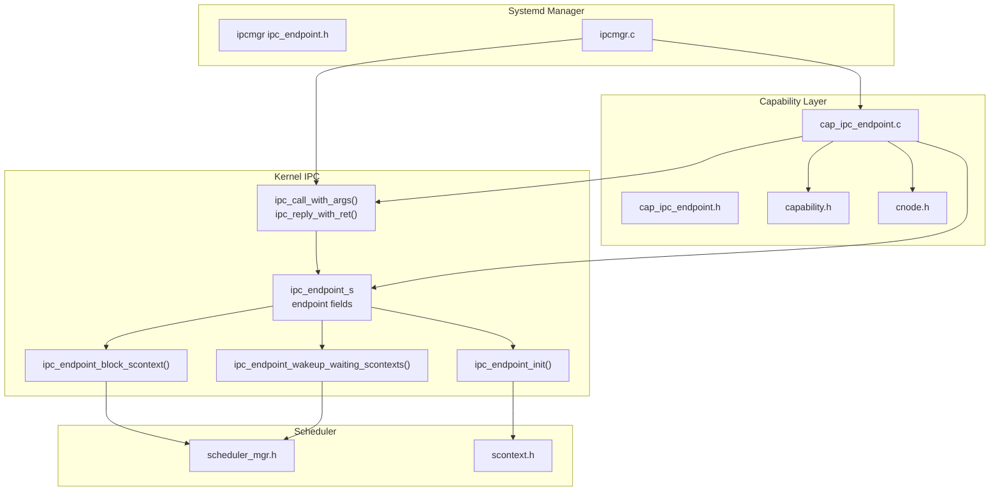
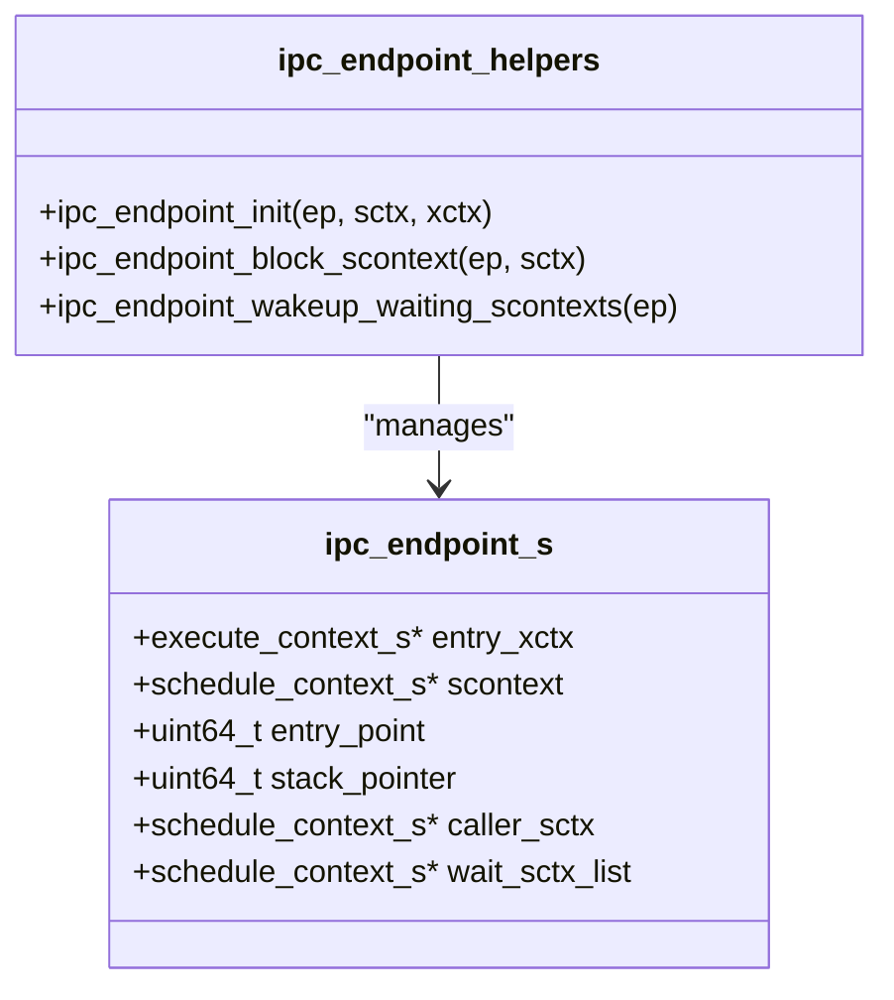
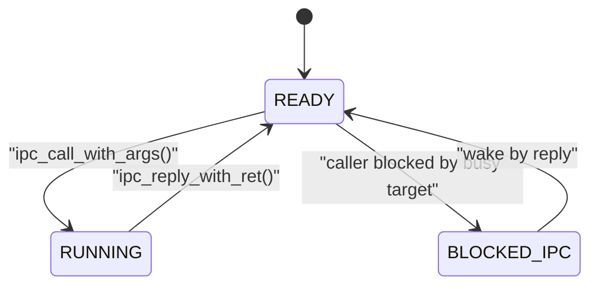
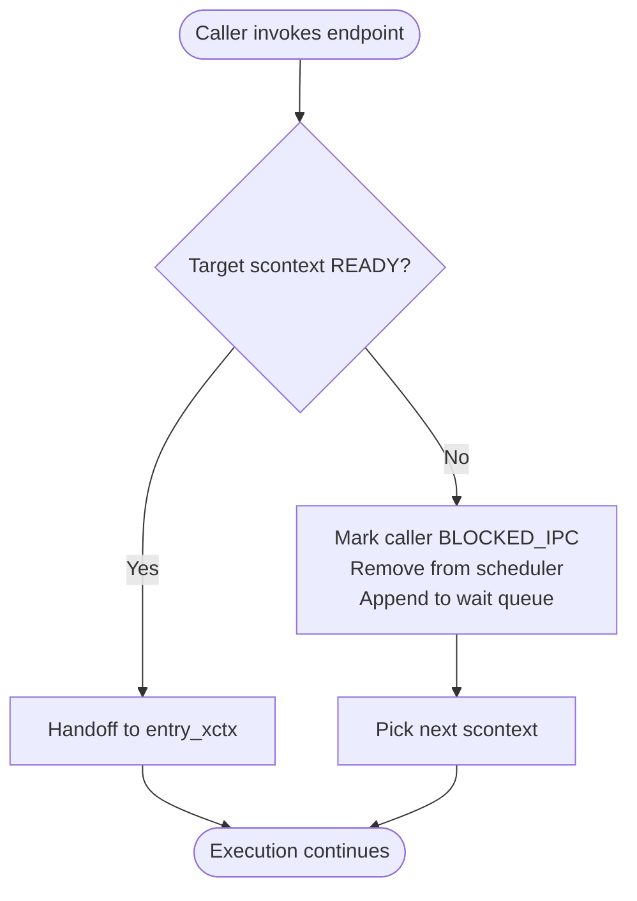
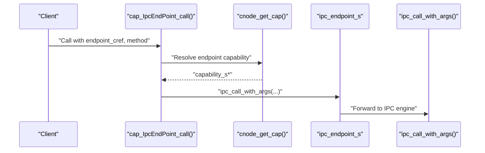
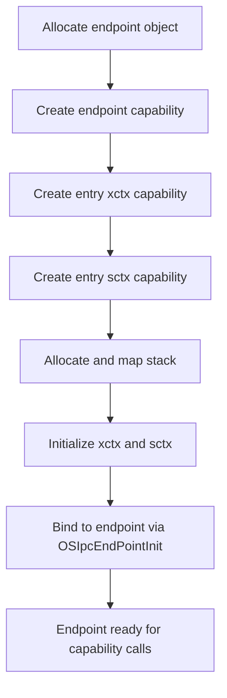
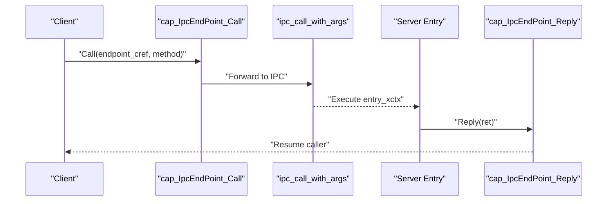
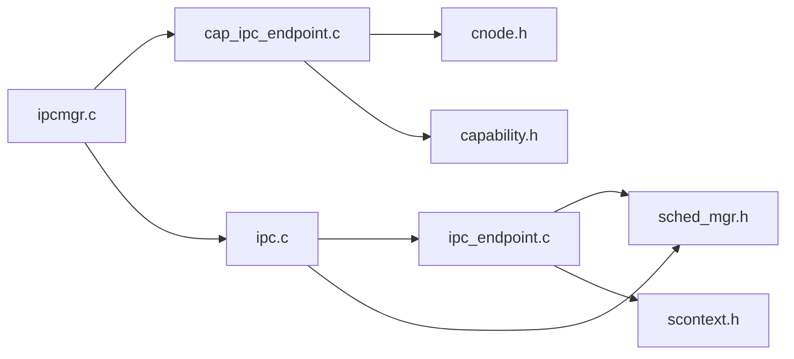

# IPC Endpoint Management

<cite>
**Referenced Files in This Document**
- [ipc_endpoint.h](file://kernel/include/ipc/ipc_endpoint.h)
- [ipc_endpoint.c](file://kernel/ipc/ipc_endpoint.c)
- [ipc.h](file://kernel/include/ipc/ipc.h)
- [ipc.c](file://kernel/ipc/ipc.c)
- [cap_ipc_endpoint.h](file://kernel/include/capability/cap_ipc_endpoint.h)
- [cap_ipc_endpoint.c](file://kernel/capability/cap_ipc_endpoint.c)
- [scontext.h](file://kernel/include/scontext/scontext.h)
- [sched_mgr.h](file://kernel/include/scheduler/sched_mgr.h)
- [capability.h](file://kernel/include/capability/capability.h)
- [cnode.h](file://kernel/include/capability/cnode.h)
- [ipcmgr.h](file://kernel/systemd/include/ipcmgr/ipc_endpoint.h)
- [ipcmgr.c](file://kernel/systemd/ipcmgr/ipcmgr.c)
- [capcall.h](file://ulibs/include/libkernel/capcall.h)
</cite>

## Table of Contents
1. [Introduction](#introduction)
2. [Project Structure](#project-structure)
3. [Core Components](#core-components)
4. [Architecture Overview](#architecture-overview)
5. [Detailed Component Analysis](#detailed-component-analysis)
6. [Dependency Analysis](#dependency-analysis)
7. [Performance Considerations](#performance-considerations)
8. [Troubleshooting Guide](#troubleshooting-guide)
9. [Conclusion](#conclusion)

## Introduction
This document explains IPC endpoint management in TranquilOS, focusing on the ipc_endpoint_s structure, endpoint lifecycle, and capability-based management. It details the endpoint state machine, blocking and waking mechanisms, and how endpoints integrate with the capability system. It also covers endpoint registration, lookup, cleanup, usage patterns, error handling for invalid endpoints, and performance considerations.

## Project Structure
The IPC endpoint subsystem spans several kernel modules:
- IPC endpoint definition and operations
- Capability dispatch for endpoint creation, initialization, invocation, and reply
- Scheduler integration for blocking and wakeup
- System daemon (systemd) endpoint manager for allocation and wiring
- Capability system for capability-based security



**Diagram sources**
- [ipc_endpoint.h](file://kernel/include/ipc/ipc_endpoint.h#L8-L17)
- [ipc_endpoint.c](file://kernel/ipc/ipc_endpoint.c#L7-L25)
- [ipc_endpoint.c](file://kernel/ipc/ipc_endpoint.c#L27-L49)
- [ipc_endpoint.c](file://kernel/ipc/ipc_endpoint.c#L51-L82)
- [ipc.h](file://kernel/include/ipc/ipc.h#L9-L11)
- [ipc.c](file://kernel/ipc/ipc.c#L9-L76)
- [ipc.c](file://kernel/ipc/ipc.c#L78-L114)
- [cap_ipc_endpoint.h](file://kernel/include/capability/cap_ipc_endpoint.h#L7-L11)
- [cap_ipc_endpoint.c](file://kernel/capability/cap_ipc_endpoint.c#L16-L68)
- [cap_ipc_endpoint.c](file://kernel/capability/cap_ipc_endpoint.c#L70-L119)
- [capability.h](file://kernel/include/capability/capability.h#L11-L20)
- [cnode.h](file://kernel/include/capability/cnode.h#L11-L24)
- [scontext.h](file://kernel/include/scontext/scontext.h#L12-L43)
- [sched_mgr.h](file://kernel/include/scheduler/sched_mgr.h#L14-L43)
- [ipcmgr.h](file://kernel/systemd/include/ipcmgr/ipc_endpoint.h#L8-L18)
- [ipcmgr.c](file://kernel/systemd/ipcmgr/ipcmgr.c#L106-L142)

**Section sources**
- [ipc_endpoint.h](file://kernel/include/ipc/ipc_endpoint.h#L1-L25)
- [ipc_endpoint.c](file://kernel/ipc/ipc_endpoint.c#L1-L82)
- [ipc.h](file://kernel/include/ipc/ipc.h#L1-L13)
- [ipc.c](file://kernel/ipc/ipc.c#L1-L114)
- [cap_ipc_endpoint.h](file://kernel/include/capability/cap_ipc_endpoint.h#L1-L12)
- [cap_ipc_endpoint.c](file://kernel/capability/cap_ipc_endpoint.c#L1-L145)
- [capability.h](file://kernel/include/capability/capability.h#L1-L26)
- [cnode.h](file://kernel/include/capability/cnode.h#L1-L29)
- [scontext.h](file://kernel/include/scontext/scontext.h#L1-L50)
- [sched_mgr.h](file://kernel/include/scheduler/sched_mgr.h#L1-L49)
- [ipcmgr.h](file://kernel/systemd/include/ipcmgr/ipc_endpoint.h#L1-L20)
- [ipcmgr.c](file://kernel/systemd/ipcmgr/ipcmgr.c#L42-L142)

## Core Components
- ipc_endpoint_s: Holds the entry user context, target schedule context, entry point and stack pointer, caller context, and a wait queue of blocked contexts.
- IPC API: ipc_call_with_args() and ipc_reply_with_ret() orchestrate cross-context IPC transitions.
- Endpoint helpers: ipc_endpoint_init(), ipc_endpoint_block_scontext(), and ipc_endpoint_wakeup_waiting_scontexts() manage lifecycle and scheduling.
- Capability interface: cap_IpcEndPoint_* methods expose endpoint operations via capabilities.
- Scheduler integration: Blocking and wakeup use scheduler manager APIs to manipulate ready queues.
- Systemd manager: Allocates and wires endpoint objects, capabilities, and stacks.

**Section sources**
- [ipc_endpoint.h](file://kernel/include/ipc/ipc_endpoint.h#L8-L17)
- [ipc_endpoint.c](file://kernel/ipc/ipc_endpoint.c#L7-L25)
- [ipc_endpoint.c](file://kernel/ipc/ipc_endpoint.c#L27-L49)
- [ipc_endpoint.c](file://kernel/ipc/ipc_endpoint.c#L51-L82)
- [ipc.h](file://kernel/include/ipc/ipc.h#L9-L11)
- [ipc.c](file://kernel/ipc/ipc.c#L9-L76)
- [ipc.c](file://kernel/ipc/ipc.c#L78-L114)
- [cap_ipc_endpoint.c](file://kernel/capability/cap_ipc_endpoint.c#L16-L68)
- [cap_ipc_endpoint.c](file://kernel/capability/cap_ipc_endpoint.c#L70-L119)
- [scontext.h](file://kernel/include/scontext/scontext.h#L12-L43)
- [sched_mgr.h](file://kernel/include/scheduler/sched_mgr.h#L14-L43)
- [ipcmgr.c](file://kernel/systemd/ipcmgr/ipcmgr.c#L106-L142)

## Architecture Overview
The IPC endpoint architecture connects capability-based invocation to the scheduler and HAL context switching. Capabilities resolve endpoint objects and associated contexts, while the IPC layer sets up user contexts and manages blocking/waking.

```mermaid
sequenceDiagram
participant Caller as "Caller Thread"
participant Cap as "cap_IpcEndPoint_call()"
participant IPC as "ipc_call_with_args()"
participant EP as "ipc_endpoint_s"
participant Sched as "scheduler_mgr"
participant HAL as "HAL Context"
Caller->>Cap : "Invoke capability with endpoint_cref, method"
Cap->>Cap : "Resolve endpoint capability"
Cap->>IPC : "ipc_call_with_args(endpoint_cref, ep, current_xctx)"
IPC->>EP : "Check target scontext state"
alt "Target not READY"
IPC->>EP : "Block caller and append to wait queue"
IPC->>Sched : "Remove caller, pick next"
Sched-->>IPC : "Next scontext"
end
IPC->>HAL : "Initialize entry_xctx with entry_point and stack"
HAL-->>EP : "Switch to entry_xctx"
Note over EP,Caller : "Entry executes; later replies wake caller"
```

**Diagram sources**
- [cap_ipc_endpoint.c](file://kernel/capability/cap_ipc_endpoint.c#L70-L104)
- [ipc.c](file://kernel/ipc/ipc.c#L9-L76)
- [ipc_endpoint.c](file://kernel/ipc/ipc_endpoint.c#L27-L49)
- [scontext.h](file://kernel/include/scontext/scontext.h#L12-L20)
- [sched_mgr.h](file://kernel/include/scheduler/sched_mgr.h#L30-L43)

## Detailed Component Analysis

### ipc_endpoint_s and Lifecycle
- Fields:
  - entry_xctx: User execute context for the endpoint entry.
  - scontext: Target schedule context bound to the endpoint.
  - entry_point, stack_pointer: Saved entry and SP for context initialization.
  - caller_sctx: Currently blocked caller context.
  - wait_sctx_list: FIFO queue of blocked contexts waiting on this endpoint.
- Initialization: ipc_endpoint_init() validates inputs, binds scontext and xcontext, saves entry/SP, and clears caller/wait list.
- Destruction: cap_IpcEndPoint_destroy() is currently a placeholder; endpoint lifetime is managed by systemd and capability lifetimes.



**Diagram sources**
- [ipc_endpoint.h](file://kernel/include/ipc/ipc_endpoint.h#L8-L17)
- [ipc_endpoint.c](file://kernel/ipc/ipc_endpoint.c#L7-L25)
- [ipc_endpoint.c](file://kernel/ipc/ipc_endpoint.c#L27-L49)
- [ipc_endpoint.c](file://kernel/ipc/ipc_endpoint.c#L51-L82)

**Section sources**
- [ipc_endpoint.h](file://kernel/include/ipc/ipc_endpoint.h#L8-L17)
- [ipc_endpoint.c](file://kernel/ipc/ipc_endpoint.c#L7-L25)
- [cap_ipc_endpoint.c](file://kernel/capability/cap_ipc_endpoint.c#L121-L122)

### Endpoint State Machine
- States:
  - READY: Available for invocation.
  - RUNNING: Currently executing.
  - BLOCKED | BLOCKED_IPC: Blocked specifically by IPC.
  - Other BLOCKED_* variants exist for upcalls and other blocking reasons.
- Transitions:
  - Call path: READY → RUNNING on successful handoff; if target not READY, caller transitions to BLOCKED_IPC and waits.
  - Reply path: RUNNING → READY; wakes next waiter(s) and schedules them.



**Diagram sources**
- [scontext.h](file://kernel/include/scontext/scontext.h#L12-L20)
- [ipc.c](file://kernel/ipc/ipc.c#L19-L35)
- [ipc.c](file://kernel/ipc/ipc.c#L78-L114)
- [ipc_endpoint.c](file://kernel/ipc/ipc_endpoint.c#L27-L49)

**Section sources**
- [scontext.h](file://kernel/include/scontext/scontext.h#L12-L20)
- [ipc.c](file://kernel/ipc/ipc.c#L19-L35)
- [ipc.c](file://kernel/ipc/ipc.c#L78-L114)

### Blocking and Waking Mechanisms
- Blocking:
  - Caller’s scontext is marked BLOCKED_IPC and removed from the scheduler.
  - Caller is appended to endpoint’s wait queue.
- Waking:
  - On reply, current scontext is set READY and caller is resumed.
  - All queued waiters are woken and scheduled.



**Diagram sources**
- [ipc.c](file://kernel/ipc/ipc.c#L19-L35)
- [ipc_endpoint.c](file://kernel/ipc/ipc_endpoint.c#L27-L49)
- [sched_mgr.h](file://kernel/include/scheduler/sched_mgr.h#L14-L21)

**Section sources**
- [ipc_endpoint.c](file://kernel/ipc/ipc_endpoint.c#L27-L49)
- [ipc_endpoint.c](file://kernel/ipc/ipc_endpoint.c#L51-L82)
- [ipc.c](file://kernel/ipc/ipc.c#L59-L75)

### Capability-Based Endpoint Management
- Capability types:
  - OBJ_TYPE_IpcEndPoint: The endpoint object.
  - Rights: Creation and destruction rights are exposed via capability constants.
- Dispatch methods:
  - Create: Allocate endpoint storage (placeholder).
  - Init: Bind endpoint to a target scontext and entry xcontext.
  - Call: Invoke the endpoint with arguments.
  - Reply: Return value and resume caller.
  - Destroy: Placeholder for cleanup.
- Lookup and validation:
  - Capability nodes are resolved from the caller’s scontext.
  - Endpoint, XContext, and SContext capabilities are validated by type and address.



**Diagram sources**
- [cap_ipc_endpoint.c](file://kernel/capability/cap_ipc_endpoint.c#L70-L104)
- [cnode.h](file://kernel/include/capability/cnode.h#L22-L24)
- [capability.h](file://kernel/include/capability/capability.h#L11-L20)
- [cap_ipc_endpoint.h](file://kernel/include/capability/cap_ipc_endpoint.h#L7-L11)

**Section sources**
- [cap_ipc_endpoint.h](file://kernel/include/capability/cap_ipc_endpoint.h#L7-L11)
- [cap_ipc_endpoint.c](file://kernel/capability/cap_ipc_endpoint.c#L16-L68)
- [cap_ipc_endpoint.c](file://kernel/capability/cap_ipc_endpoint.c#L70-L119)
- [capability.h](file://kernel/include/capability/capability.h#L11-L20)
- [cnode.h](file://kernel/include/capability/cnode.h#L22-L24)

### Endpoint Registration, Lookup, and Cleanup
- Registration (systemd):
  - Allocate endpoint object and bind capabilities for endpoint, entry xcontext, and entry scontext.
  - Allocate and map a stack for the endpoint entry.
  - Initialize execute and schedule contexts and wire them to the endpoint.
- Lookup:
  - From a caller’s scontext, resolve the capability node and fetch the endpoint capability by slot index.
- Cleanup:
  - Endpoint destruction is a capability method placeholder; systemd manages endpoint object lifetimes.



**Diagram sources**
- [ipcmgr.c](file://kernel/systemd/ipcmgr/ipcmgr.c#L106-L142)
- [ipcmgr.c](file://kernel/systemd/ipcmgr/ipcmgr.c#L42-L72)
- [cap_ipc_endpoint.c](file://kernel/capability/cap_ipc_endpoint.c#L65-L67)

**Section sources**
- [ipcmgr.h](file://kernel/systemd/include/ipcmgr/ipc_endpoint.h#L8-L18)
- [ipcmgr.c](file://kernel/systemd/ipcmgr/ipcmgr.c#L42-L142)
- [cap_ipc_endpoint.c](file://kernel/capability/cap_ipc_endpoint.c#L65-L67)

### Usage Patterns and Examples
- Typical client invocation pattern:
  - Obtain endpoint capability reference.
  - Call cap_IpcEndPoint_Call with endpoint_cref and method.
  - The IPC engine blocks the caller until the endpoint replies.
- Typical server reply pattern:
  - In the entry context, compute result and call cap_IpcEndPoint_Reply with return value.
  - The IPC engine resumes the caller and wakes any waiters.



**Diagram sources**
- [capcall.h](file://ulibs/include/libkernel/capcall.h#L15-L41)
- [cap_ipc_endpoint.c](file://kernel/capability/cap_ipc_endpoint.c#L70-L119)
- [ipc.c](file://kernel/ipc/ipc.c#L9-L76)
- [ipc.c](file://kernel/ipc/ipc.c#L78-L114)

**Section sources**
- [capcall.h](file://ulibs/include/libkernel/capcall.h#L15-L41)
- [cap_ipc_endpoint.c](file://kernel/capability/cap_ipc_endpoint.c#L70-L119)

### Error Handling for Invalid Endpoints
- Null checks:
  - Endpoint, caller scontext, and scheduler components are validated; panics are raised on failure.
- Capability validation:
  - Endpoint capability must be of type OBJ_TYPE_IpcEndPoint; XContext and SContext must match their respective types.
- Wait queue safety:
  - Iteration uses container_of and list traversal; logs errors if entries are malformed.

**Section sources**
- [ipc_endpoint.c](file://kernel/ipc/ipc_endpoint.c#L8-L13)
- [ipc_endpoint.c](file://kernel/ipc/ipc_endpoint.c#L53-L55)
- [ipc.c](file://kernel/ipc/ipc.c#L10-L18)
- [ipc.c](file://kernel/ipc/ipc.c#L55-L57)
- [cap_ipc_endpoint.c](file://kernel/capability/cap_ipc_endpoint.c#L36-L43)
- [cap_ipc_endpoint.c](file://kernel/capability/cap_ipc_endpoint.c#L46-L63)
- [cap_ipc_endpoint.c](file://kernel/capability/cap_ipc_endpoint.c#L93-L99)

## Dependency Analysis
- ipc_endpoint.c depends on scontext.h for state definitions and sched_mgr.h for scheduler operations.
- ipc.c depends on hal_context and hal_cpu for context manipulation and switch_user_* for context switching.
- cap_ipc_endpoint.c depends on cnode.h for capability lookup and capability.h for capability metadata.
- systemd ipcmgr wires endpoints and capabilities together during service bootstrap.



**Diagram sources**
- [ipc_endpoint.c](file://kernel/ipc/ipc_endpoint.c#L1-L82)
- [sched_mgr.h](file://kernel/include/scheduler/sched_mgr.h#L14-L43)
- [scontext.h](file://kernel/include/scontext/scontext.h#L12-L43)
- [ipc.c](file://kernel/ipc/ipc.c#L1-L114)
- [cap_ipc_endpoint.c](file://kernel/capability/cap_ipc_endpoint.c#L1-L145)
- [cnode.h](file://kernel/include/capability/cnode.h#L11-L24)
- [capability.h](file://kernel/include/capability/capability.h#L11-L20)
- [ipcmgr.c](file://kernel/systemd/ipcmgr/ipcmgr.c#L106-L142)

**Section sources**
- [ipc_endpoint.c](file://kernel/ipc/ipc_endpoint.c#L1-L82)
- [ipc.c](file://kernel/ipc/ipc.c#L1-L114)
- [cap_ipc_endpoint.c](file://kernel/capability/cap_ipc_endpoint.c#L1-L145)
- [ipcmgr.c](file://kernel/systemd/ipcmgr/ipcmgr.c#L106-L142)

## Performance Considerations
- Context switching cost:
  - Each IPC call/reply involves scheduler operations and HAL context initialization; minimize unnecessary handoffs.
- Wait queue traversal:
  - Wake-all semantics iterate the wait queue; keep endpoint wait queues short to reduce wakeup overhead.
- Capability resolution:
  - Capability lookups traverse capability nodes; cache frequently used endpoint references when possible.
- Stack allocation:
  - Endpoint stacks are allocated per endpoint; ensure appropriate sizing to avoid frequent reallocation.

[No sources needed since this section provides general guidance]

## Troubleshooting Guide
- Symptom: Caller stuck indefinitely.
  - Cause: Target scontext remains busy; caller is BLOCKED_IPC.
  - Action: Verify server replies; ensure reply path executes and wakes waiters.
- Symptom: Panic on endpoint call.
  - Cause: Null endpoint, caller scontext, or scheduler components.
  - Action: Validate capability references and ensure endpoint initialization completed.
- Symptom: Capability lookup fails.
  - Cause: Wrong capability type or invalid slot index.
  - Action: Confirm OBJ_TYPE_IpcEndPoint and correct indices; reinitialize endpoint binding.

**Section sources**
- [ipc.c](file://kernel/ipc/ipc.c#L10-L18)
- [ipc.c](file://kernel/ipc/ipc.c#L55-L57)
- [ipc_endpoint.c](file://kernel/ipc/ipc_endpoint.c#L33-L39)
- [cap_ipc_endpoint.c](file://kernel/capability/cap_ipc_endpoint.c#L36-L43)
- [cap_ipc_endpoint.c](file://kernel/capability/cap_ipc_endpoint.c#L93-L99)

## Conclusion
TranquilOS implements IPC endpoints as capability-backed objects with explicit lifecycle management and scheduler integration. The endpoint state machine cleanly separates blocking callers from running targets, while the capability layer enforces access control and simplifies endpoint invocation. Proper initialization, capability validation, and careful handling of blocking and waking ensure robust IPC behavior. Future work includes implementing endpoint destruction and optimizing wait queue operations.