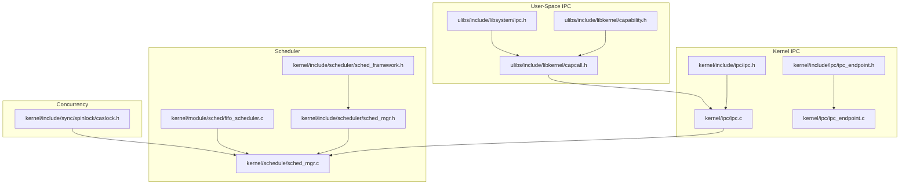
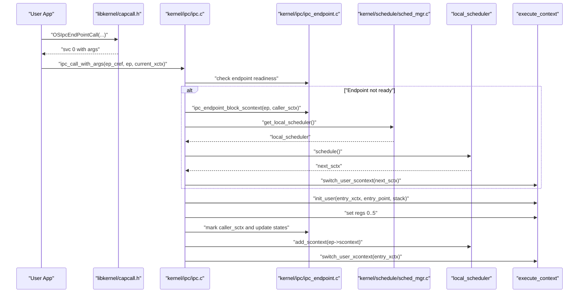
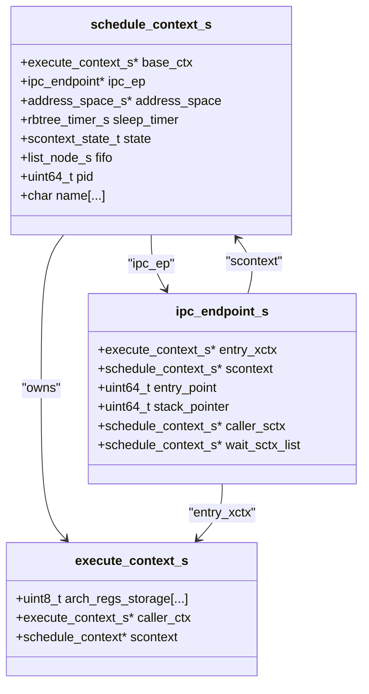
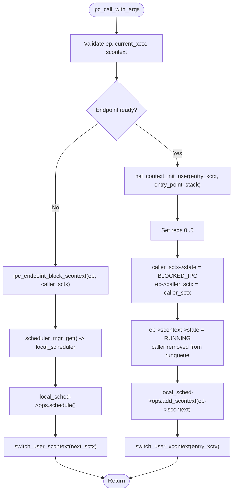
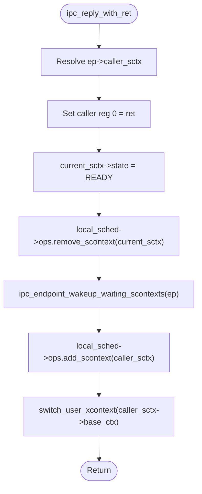
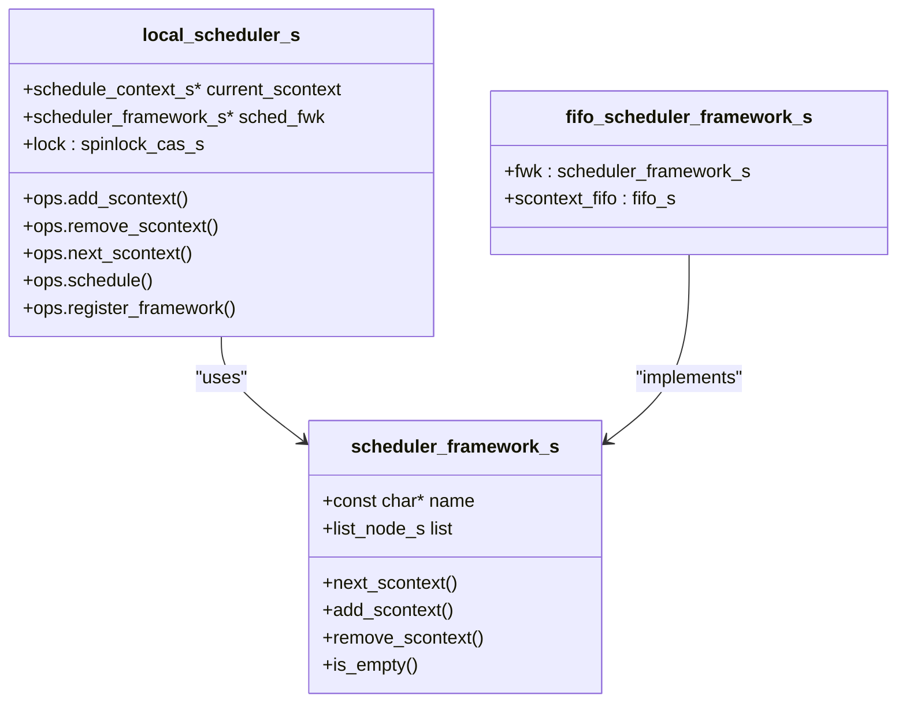
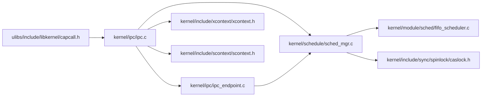

# IPC Performance and Optimization

<cite>
**Referenced Files in This Document**
- [ipc.h](file://kernel/include/ipc/ipc.h)
- [ipc_endpoint.h](file://kernel/include/ipc/ipc_endpoint.h)
- [ipc.c](file://kernel/ipc/ipc.c)
- [ipc_endpoint.c](file://kernel/ipc/ipc_endpoint.c)
- [xcontext.h](file://kernel/include/xcontext/xcontext.h)
- [scontext.h](file://kernel/include/scontext/scontext.h)
- [sched_framework.h](file://kernel/include/scheduler/sched_framework.h)
- [sched_mgr.h](file://kernel/include/scheduler/sched_mgr.h)
- [sched_mgr.c](file://kernel/schedule/sched_mgr.c)
- [caslock.h](file://kernel/include/sync/spinlock/caslock.h)
- [fifo_scheduler.c](file://kernel/module/sched/fifo_scheduler.c)
- [capcall.h](file://ulibs/include/libkernel/capcall.h)
- [capability.h](file://ulibs/include/libkernel/capability.h)
- [ipc.h](file://ulibs/include/libsystem/ipc.h)
</cite>

## Table of Contents
1. [Introduction](#introduction)
2. [Project Structure](#project-structure)
3. [Core Components](#core-components)
4. [Architecture Overview](#architecture-overview)
5. [Detailed Component Analysis](#detailed-component-analysis)
6. [Dependency Analysis](#dependency-analysis)
7. [Performance Considerations](#performance-considerations)
8. [Benchmarking Methodologies](#benchmarking-methodologies)
9. [Optimization Strategies](#optimization-strategies)
10. [Troubleshooting Guide](#troubleshooting-guide)
11. [Conclusion](#conclusion)

## Introduction
This document provides a deep dive into Inter-Process Communication (IPC) performance optimization in TranquilOS. It analyzes IPC latency characteristics, throughput optimization techniques, and the scheduling impact on IPC performance. It also documents the relationship between IPC operations and scheduler behavior, context switching overhead, and memory bandwidth utilization. Guidance is included on benchmarking methodologies, performance measurement tools, contention handling, lock-free IPC patterns, memory layout considerations, profiling IPC bottlenecks, and tuning IPC parameters for high-frequency scenarios.

## Project Structure
The IPC subsystem spans kernel headers and implementations, scheduler frameworks, and user-space capability-call wrappers. The most relevant paths include:
- Kernel IPC interfaces and endpoints
- Scheduler framework and FIFO scheduler
- Spinlock primitives for synchronization
- User-space capability-call macros for IPC invocation

**Diagram sources**
- [ipc.h](file://kernel/include/ipc/ipc.h#L1-L13)
- [ipc_endpoint.h](file://kernel/include/ipc/ipc_endpoint.h#L1-L25)
- [ipc.c](file://kernel/ipc/ipc.c#L1-L114)
- [ipc_endpoint.c](file://kernel/ipc/ipc_endpoint.c#L1-L82)
- [sched_framework.h](file://kernel/include/scheduler/sched_framework.h#L1-L20)
- [sched_mgr.h](file://kernel/include/scheduler/sched_mgr.h#L1-L49)
- [sched_mgr.c](file://kernel/schedule/sched_mgr.c#L1-L167)
- [fifo_scheduler.c](file://kernel/module/sched/fifo_scheduler.c#L1-L111)
- [caslock.h](file://kernel/include/sync/spinlock/caslock.h#L1-L43)
- [capcall.h](file://ulibs/include/libkernel/capcall.h#L1-L177)
- [capability.h](file://ulibs/include/libkernel/capability.h#L1-L141)
- [ipc.h](file://ulibs/include/libsystem/ipc.h#L1-L73)

**Section sources**
- [ipc.h](file://kernel/include/ipc/ipc.h#L1-L13)
- [ipc_endpoint.h](file://kernel/include/ipc/ipc_endpoint.h#L1-L25)
- [ipc.c](file://kernel/ipc/ipc.c#L1-L114)
- [ipc_endpoint.c](file://kernel/ipc/ipc_endpoint.c#L1-L82)
- [sched_framework.h](file://kernel/include/scheduler/sched_framework.h#L1-L20)
- [sched_mgr.h](file://kernel/include/scheduler/sched_mgr.h#L1-L49)
- [sched_mgr.c](file://kernel/schedule/sched_mgr.c#L1-L167)
- [fifo_scheduler.c](file://kernel/module/sched/fifo_scheduler.c#L1-L111)
- [caslock.h](file://kernel/include/sync/spinlock/caslock.h#L1-L43)
- [capcall.h](file://ulibs/include/libkernel/capcall.h#L1-L177)
- [capability.h](file://ulibs/include/libkernel/capability.h#L1-L141)
- [ipc.h](file://ulibs/include/libsystem/ipc.h#L1-L73)

## Core Components
- IPC Endpoint Model: Defines the endpoint structure, including entry contexts, schedule contexts, entry point, stack pointer, caller context, and waiting list.
- IPC Call and Reply: Implements the call path (argument extraction, context initialization, state transitions, scheduling) and reply path (result delivery, wake-up of waiters, scheduling).
- Scheduler Framework: Provides a pluggable framework for scheduling policies with FIFO scheduler as the current implementation.
- Concurrency Primitives: Spinlocks using compare-and-swap for low-latency locking around scheduler operations.
- User-Space Capability Calls: Macros to invoke kernel IPC methods via system-visible capability calls.

Key performance-relevant elements:
- Context switching via user context switches during IPC handoff.
- Blocking and wake-up of schedule contexts on endpoints.
- FIFO scheduling adds/removals and next selection.
- Spinlock-protected scheduler operations.

**Section sources**
- [ipc_endpoint.h](file://kernel/include/ipc/ipc_endpoint.h#L8-L24)
- [ipc.c](file://kernel/ipc/ipc.c#L9-L76)
- [ipc.c](file://kernel/ipc/ipc.c#L78-L114)
- [ipc_endpoint.c](file://kernel/ipc/ipc_endpoint.c#L7-L25)
- [ipc_endpoint.c](file://kernel/ipc/ipc_endpoint.c#L27-L49)
- [ipc_endpoint.c](file://kernel/ipc/ipc_endpoint.c#L51-L82)
- [sched_framework.h](file://kernel/include/scheduler/sched_framework.h#L11-L18)
- [sched_mgr.h](file://kernel/include/scheduler/sched_mgr.h#L23-L28)
- [fifo_scheduler.c](file://kernel/module/sched/fifo_scheduler.c#L13-L52)
- [caslock.h](file://kernel/include/sync/spinlock/caslock.h#L15-L42)
- [capcall.h](file://ulibs/include/libkernel/capcall.h#L15-L126)

## Architecture Overview
The IPC architecture connects user-space capability calls to kernel IPC handlers, which manage context switching and scheduling. The sequence below maps the actual code paths.

**Diagram sources**
- [capcall.h](file://ulibs/include/libkernel/capcall.h#L74-L126)
- [ipc.c](file://kernel/ipc/ipc.c#L9-L76)
- [ipc_endpoint.c](file://kernel/ipc/ipc_endpoint.c#L27-L49)
- [sched_mgr.c](file://kernel/schedule/sched_mgr.c#L105-L111)
- [sched_mgr.c](file://kernel/schedule/sched_mgr.c#L74-L87)
- [xcontext.h](file://kernel/include/xcontext/xcontext.h#L7-L15)

**Section sources**
- [capcall.h](file://ulibs/include/libkernel/capcall.h#L15-L126)
- [ipc.c](file://kernel/ipc/ipc.c#L9-L76)
- [ipc_endpoint.c](file://kernel/ipc/ipc_endpoint.c#L27-L49)
- [sched_mgr.c](file://kernel/schedule/sched_mgr.c#L74-L87)
- [xcontext.h](file://kernel/include/xcontext/xcontext.h#L7-L15)

## Detailed Component Analysis

### IPC Endpoint Data Model
The endpoint encapsulates:
- Entry execute context and schedule context
- Entry point and stack pointer
- Caller schedule context
- Waiting schedule context list

**Diagram sources**
- [scontext.h](file://kernel/include/scontext/scontext.h#L22-L43)
- [xcontext.h](file://kernel/include/xcontext/xcontext.h#L7-L15)
- [ipc_endpoint.h](file://kernel/include/ipc/ipc_endpoint.h#L8-L17)

**Section sources**
- [scontext.h](file://kernel/include/scontext/scontext.h#L22-L43)
- [xcontext.h](file://kernel/include/xcontext/xcontext.h#L7-L15)
- [ipc_endpoint.h](file://kernel/include/ipc/ipc_endpoint.h#L8-L17)

### IPC Call Path Analysis
The call path extracts arguments from the current execute context, initializes the entry execute context, sets registers, blocks the caller, updates states, schedules the endpoint handler, and performs a user context switch.

**Diagram sources**
- [ipc.c](file://kernel/ipc/ipc.c#L9-L76)
- [ipc_endpoint.c](file://kernel/ipc/ipc_endpoint.c#L27-L49)
- [sched_mgr.c](file://kernel/schedule/sched_mgr.c#L105-L111)
- [sched_mgr.c](file://kernel/schedule/sched_mgr.c#L74-L87)

**Section sources**
- [ipc.c](file://kernel/ipc/ipc.c#L9-L76)
- [ipc_endpoint.c](file://kernel/ipc/ipc_endpoint.c#L27-L49)
- [sched_mgr.c](file://kernel/schedule/sched_mgr.c#L74-L87)

### IPC Reply Path Analysis
The reply path sets the return value in the caller’s execute context, transitions the current handler to ready, re-adds it to the scheduler, wakes waiting contexts, and switches to the caller.

**Diagram sources**
- [ipc.c](file://kernel/ipc/ipc.c#L78-L114)
- [ipc_endpoint.c](file://kernel/ipc/ipc_endpoint.c#L51-L82)
- [sched_mgr.c](file://kernel/schedule/sched_mgr.c#L105-L111)

**Section sources**
- [ipc.c](file://kernel/ipc/ipc.c#L78-L114)
- [ipc_endpoint.c](file://kernel/ipc/ipc_endpoint.c#L51-L82)
- [sched_mgr.c](file://kernel/schedule/sched_mgr.c#L105-L111)

### Scheduler Framework and FIFO Implementation
The scheduler framework defines operations for adding, removing, and selecting the next schedule context. The FIFO scheduler implements these operations using a FIFO queue per CPU.

**Diagram sources**
- [sched_framework.h](file://kernel/include/scheduler/sched_framework.h#L11-L18)
- [sched_mgr.h](file://kernel/include/scheduler/sched_mgr.h#L23-L28)
- [fifo_scheduler.c](file://kernel/module/sched/fifo_scheduler.c#L13-L52)

**Section sources**
- [sched_framework.h](file://kernel/include/scheduler/sched_framework.h#L11-L18)
- [sched_mgr.h](file://kernel/include/scheduler/sched_mgr.h#L23-L28)
- [fifo_scheduler.c](file://kernel/module/sched/fifo_scheduler.c#L13-L52)

## Dependency Analysis
The IPC code depends on:
- Scheduler manager for CPU-local scheduling
- FIFO scheduler framework for runqueue operations
- Spinlocks for protecting scheduler operations
- Execute and schedule context abstractions
- User-space capability-call macros to trigger IPC

**Diagram sources**
- [ipc.c](file://kernel/ipc/ipc.c#L1-L114)
- [sched_mgr.c](file://kernel/schedule/sched_mgr.c#L1-L167)
- [ipc_endpoint.c](file://kernel/ipc/ipc_endpoint.c#L1-L82)
- [fifo_scheduler.c](file://kernel/module/sched/fifo_scheduler.c#L1-L111)
- [caslock.h](file://kernel/include/sync/spinlock/caslock.h#L1-L43)
- [xcontext.h](file://kernel/include/xcontext/xcontext.h#L7-L15)
- [scontext.h](file://kernel/include/scontext/scontext.h#L22-L43)
- [capcall.h](file://ulibs/include/libkernel/capcall.h#L15-L126)

**Section sources**
- [ipc.c](file://kernel/ipc/ipc.c#L1-L114)
- [sched_mgr.c](file://kernel/schedule/sched_mgr.c#L1-L167)
- [ipc_endpoint.c](file://kernel/ipc/ipc_endpoint.c#L1-L82)
- [fifo_scheduler.c](file://kernel/module/sched/fifo_scheduler.c#L1-L111)
- [caslock.h](file://kernel/include/sync/spinlock/caslock.h#L1-L43)
- [xcontext.h](file://kernel/include/xcontext/xcontext.h#L7-L15)
- [scontext.h](file://kernel/include/scontext/scontext.h#L22-L43)
- [capcall.h](file://ulibs/include/libkernel/capcall.h#L15-L126)

## Performance Considerations
- Latency characteristics:
  - IPC call latency includes argument extraction, context initialization, register setup, state transitions, and potential scheduler invocation.
  - Reply latency includes result delivery, handler state updates, and context switching back to the caller.
  - Blocking on endpoints introduces wait-list traversal and wake-up operations.

- Throughput optimization:
  - Minimize context switching by keeping handlers short and avoiding unnecessary blocking.
  - Use FIFO scheduling for predictable ordering; ensure the runqueue is not overly contended.
  - Reduce contention by aligning scheduler structures to cache line boundaries and using lock-free queues where feasible.

- Scheduling impact:
  - The local scheduler maintains a single framework; contention arises when many contexts compete for the same CPU.
  - Spinlocks protect scheduler operations; excessive contention can degrade performance.

- Context switching overhead:
  - User context switches occur during IPC handoffs; minimize frequency by batching operations and reducing cross-CPU migrations.

- Memory bandwidth utilization:
  - Endpoint structures and context structures are accessed frequently; ensure alignment and locality to reduce cache misses.

[No sources needed since this section provides general guidance]

## Benchmarking Methodologies
- Microbenchmarks:
  - Measure round-trip IPC latency for varying payload sizes using capability-call wrappers.
  - Track minimum, median, and tail latencies under load.

- Load tests:
  - Vary concurrency levels and CPU affinities to observe saturation points.
  - Monitor scheduler runqueue lengths and context switch counts.

- Tools:
  - Use kernel profiling hooks to capture IPC entry/exit timestamps.
  - Utilize CPU performance counters for cycles, instructions, and context switches.

- Metrics:
  - IPC calls per second, average latency, 99th percentile latency, scheduler queue depth, and spinlock contention.

[No sources needed since this section provides general guidance]

## Optimization Strategies
- Contention handling:
  - Prefer per-CPU endpoints to reduce cross-CPU contention.
  - Use lock-free queues for waiting contexts where appropriate.

- Lock-free IPC patterns:
  - Implement producer-consumer queues with atomic operations for high-frequency messaging.
  - Avoid blocking when possible; use non-blocking checks and back-off strategies.

- Memory layout:
  - Align endpoint and context structures to cache line boundaries.
  - Co-locate frequently accessed fields to reduce cache misses.

- Parameter tuning:
  - Adjust CPU affinity masks to keep callers and handlers on the same core.
  - Tune scheduler policy and priorities for latency-sensitive tasks.

[No sources needed since this section provides general guidance]

## Troubleshooting Guide
- Common issues:
  - Endpoint not ready: Verify that the endpoint’s schedule context is in the ready state before invoking IPC.
  - Scheduler not initialized: Ensure the scheduler manager and local scheduler are initialized for the current CPU.
  - Spinlock contention: Investigate high contention on the scheduler lock and reduce contention by adjusting CPU placement or workload distribution.

- Debugging steps:
  - Enable logging around IPC call and reply paths to trace state transitions.
  - Inspect endpoint waiting lists and handler states.
  - Profile context switches and scheduler operations to identify hotspots.

**Section sources**
- [ipc.c](file://kernel/ipc/ipc.c#L9-L18)
- [ipc_endpoint.c](file://kernel/ipc/ipc_endpoint.c#L27-L49)
- [sched_mgr.c](file://kernel/schedule/sched_mgr.c#L105-L111)
- [caslock.h](file://kernel/include/sync/spinlock/caslock.h#L29-L42)

## Conclusion
TranquilOS IPC performance hinges on efficient context switching, scheduler design, and endpoint management. By understanding the call and reply paths, leveraging FIFO scheduling, minimizing contention, and applying targeted optimizations—such as lock-free patterns, memory layout improvements, and CPU affinity tuning—developers can achieve high-frequency IPC with predictable latency and high throughput.