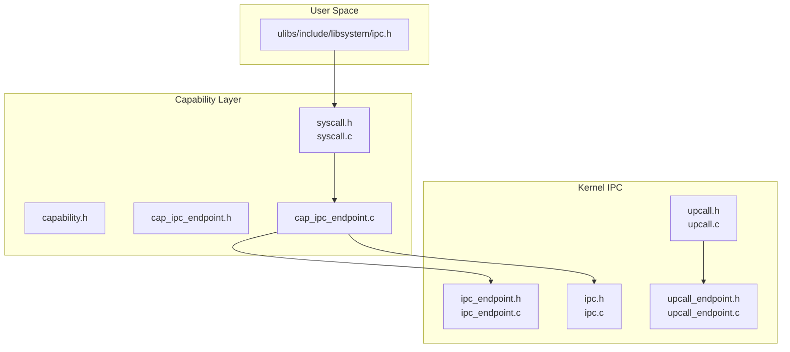
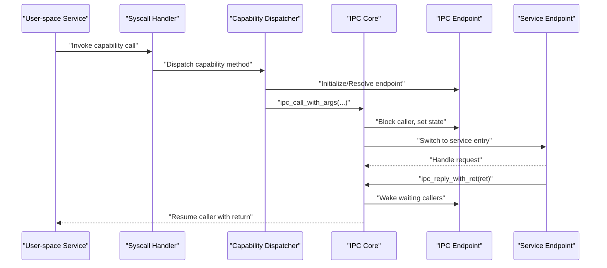
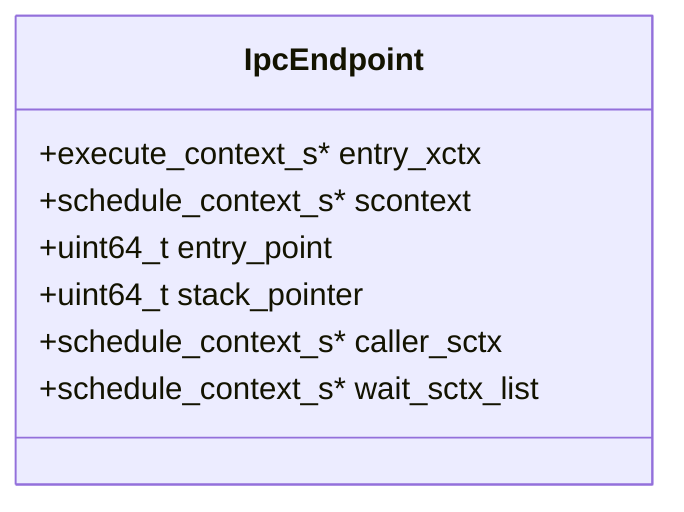
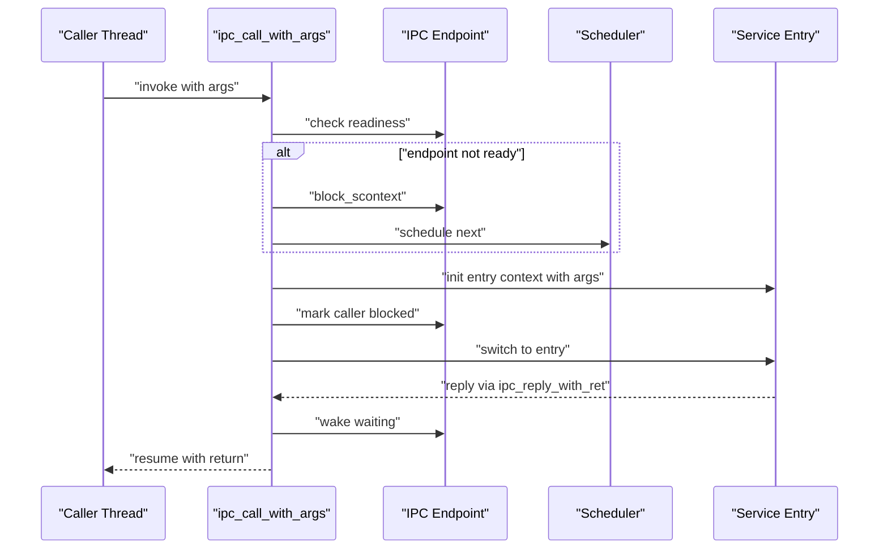
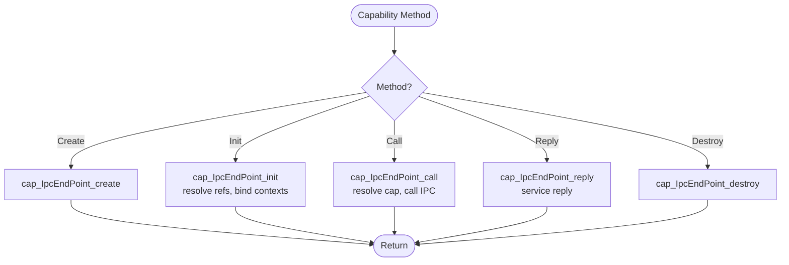
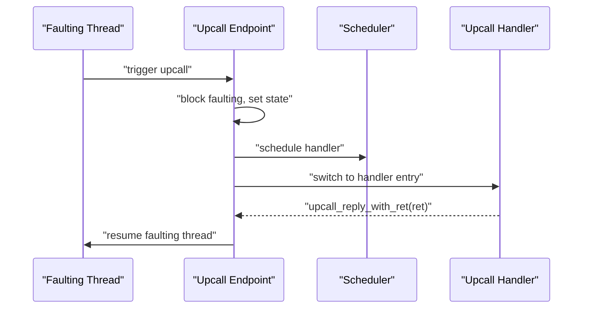
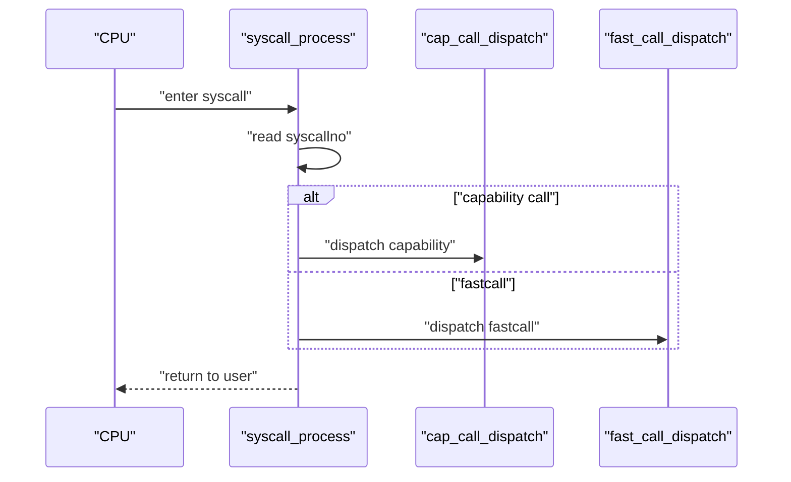
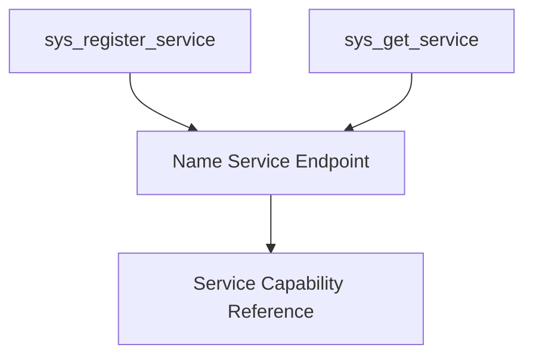
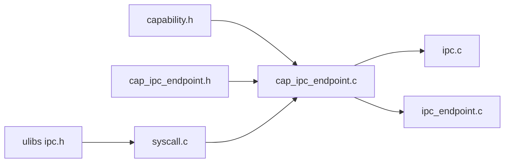

# Inter-Process Communication (IPC)

<cite>
**Referenced Files in This Document**
- [ipc.h](file://kernel/include/ipc/ipc.h)
- [ipc_endpoint.h](file://kernel/include/ipc/ipc_endpoint.h)
- [ipc.c](file://kernel/ipc/ipc.c)
- [ipc_endpoint.c](file://kernel/ipc/ipc_endpoint.c)
- [cap_ipc_endpoint.h](file://kernel/include/capability/cap_ipc_endpoint.h)
- [cap_ipc_endpoint.c](file://kernel/capability/cap_ipc_endpoint.c)
- [upcall.h](file://kernel/include/upcall/upcall.h)
- [upcall_endpoint.h](file://kernel/include/upcall/upcall_endpoint.h)
- [upcall.c](file://kernel/upcall/upcall.c)
- [upcall_endpoint.c](file://kernel/upcall/upcall_endpoint.c)
- [capability.h](file://kernel/include/capability/capability.h)
- [syscall.h](file://kernel/include/syscall/syscall.h)
- [syscall.c](file://kernel/syscall/syscall.c)
- [ipc.h](file://ulibs/include/libsystem/ipc.h)
</cite>

## Table of Contents
1. [Introduction](#introduction)
2. [Project Structure](#project-structure)
3. [Core Components](#core-components)
4. [Architecture Overview](#architecture-overview)
5. [Detailed Component Analysis](#detailed-component-analysis)
6. [Dependency Analysis](#dependency-analysis)
7. [Performance Considerations](#performance-considerations)
8. [Troubleshooting Guide](#troubleshooting-guide)
9. [Conclusion](#conclusion)
10. [Appendices](#appendices)

## Introduction
This document explains the Inter-Process Communication (IPC) system in TranquilOS with a focus on its capability-based architecture, endpoint management, and message passing mechanisms. It covers how IPC endpoints are structured, how capabilities are passed to grant access, and how the upcall system enables asynchronous notifications. We also document performance characteristics, message serialization considerations, and communication patterns between user-space services. Finally, we provide implementation examples for common IPC scenarios, error handling, debugging techniques, and optimization strategies for high-frequency IPC.

## Project Structure
The IPC subsystem spans kernel headers and implementations, capability dispatchers, and user-space libraries:
- Kernel IPC core: endpoint lifecycle, blocking, scheduling, and switching
- Capability-based IPC endpoint: creation, initialization, invocation, and replies
- Upcall system: asynchronous notifications and replies
- Syscall entry: routing capability calls to capability dispatchers
- User-space IPC library: service registration and discovery helpers

**Diagram sources**
- [ipc_endpoint.h](file://kernel/include/ipc/ipc_endpoint.h#L1-L25)
- [ipc_endpoint.c](file://kernel/ipc/ipc_endpoint.c#L1-L82)
- [ipc.h](file://kernel/include/ipc/ipc.h#L1-L13)
- [ipc.c](file://kernel/ipc/ipc.c#L1-L114)
- [upcall_endpoint.h](file://kernel/include/upcall/upcall_endpoint.h#L1-L25)
- [upcall_endpoint.c](file://kernel/upcall/upcall_endpoint.c#L1-L83)
- [upcall.h](file://kernel/include/upcall/upcall.h#L1-L13)
- [upcall.c](file://kernel/upcall/upcall.c#L1-L95)
- [capability.h](file://kernel/include/capability/capability.h#L1-L26)
- [cap_ipc_endpoint.h](file://kernel/include/capability/cap_ipc_endpoint.h#L1-L12)
- [cap_ipc_endpoint.c](file://kernel/capability/cap_ipc_endpoint.c#L1-L145)
- [syscall.h](file://kernel/include/syscall/syscall.h#L1-L8)
- [syscall.c](file://kernel/syscall/syscall.c#L1-L20)
- [ipc.h](file://ulibs/include/libsystem/ipc.h#L1-L73)

**Section sources**
- [ipc.h](file://kernel/include/ipc/ipc.h#L1-L13)
- [ipc_endpoint.h](file://kernel/include/ipc/ipc_endpoint.h#L1-L25)
- [cap_ipc_endpoint.h](file://kernel/include/capability/cap_ipc_endpoint.h#L1-L12)
- [capability.h](file://kernel/include/capability/capability.h#L1-L26)
- [syscall.h](file://kernel/include/syscall/syscall.h#L1-L8)
- [ipc.h](file://ulibs/include/libsystem/ipc.h#L1-L73)

## Core Components
- IPC Endpoint: Holds execution and scheduling contexts, entry point, stack pointer, caller tracking, and wait queue for blocked callers.
- IPC Core: Switches to endpoint entry context, passes arguments via registers, blocks caller, schedules next, and resumes after reply.
- Capability-based IPC Endpoint: Validates capability references, initializes endpoints with target contexts, and dispatches Create/Init/Call/Reply/Destroy.
- Upcall Endpoint: Similar structure to IPC endpoint but for asynchronous notifications; supports blocking and wakeups.
- Syscall Routing: Detects capability calls and dispatches to capability handlers; switches address spaces and returns to user mode.

Key responsibilities:
- Endpoint lifecycle management and scheduling integration
- Capability validation and rights enforcement
- Argument passing and return value propagation
- Asynchronous notification support via upcalls

**Section sources**
- [ipc_endpoint.h](file://kernel/include/ipc/ipc_endpoint.h#L8-L24)
- [ipc_endpoint.c](file://kernel/ipc/ipc_endpoint.c#L7-L25)
- [ipc.c](file://kernel/ipc/ipc.c#L9-L76)
- [cap_ipc_endpoint.c](file://kernel/capability/cap_ipc_endpoint.c#L16-L68)
- [upcall_endpoint.h](file://kernel/include/upcall/upcall_endpoint.h#L8-L17)
- [upcall_endpoint.c](file://kernel/upcall/upcall_endpoint.c#L8-L26)
- [upcall.c](file://kernel/upcall/upcall.c#L8-L52)
- [syscall.c](file://kernel/syscall/syscall.c#L8-L20)

## Architecture Overview
The IPC architecture combines capability-based access control with endpoint-driven message passing and asynchronous upcalls. User-space invokes capability methods via syscall, which route to capability dispatchers. These dispatchers manipulate IPC endpoints and invoke kernel IPC routines to transfer control to service endpoints and manage replies.

**Diagram sources**
- [syscall.c](file://kernel/syscall/syscall.c#L8-L20)
- [cap_ipc_endpoint.c](file://kernel/capability/cap_ipc_endpoint.c#L124-L145)
- [ipc.c](file://kernel/ipc/ipc.c#L9-L76)
- [ipc_endpoint.c](file://kernel/ipc/ipc_endpoint.c#L27-L49)
- [upcall.c](file://kernel/upcall/upcall.c#L8-L52)

## Detailed Component Analysis

### IPC Endpoint Model
The IPC endpoint encapsulates:
- Execution context for the entry point
- Schedule context for the endpoint owner
- Entry point and stack pointer
- Caller tracking and wait queue for blocked callers

**Diagram sources**
- [ipc_endpoint.h](file://kernel/include/ipc/ipc_endpoint.h#L8-L17)

**Section sources**
- [ipc_endpoint.h](file://kernel/include/ipc/ipc_endpoint.h#L8-L24)
- [ipc_endpoint.c](file://kernel/ipc/ipc_endpoint.c#L7-L25)

### IPC Call Flow
The kernel performs argument passing, context switching, and scheduling:
- Validates endpoint and caller contexts
- Reads registers for endpoint reference, method, and arguments
- Initializes user entry context with arguments
- Blocks caller and schedules next runnable context
- Switches to endpoint entry context

**Diagram sources**
- [ipc.c](file://kernel/ipc/ipc.c#L9-L76)
- [ipc_endpoint.c](file://kernel/ipc/ipc_endpoint.c#L27-L49)

**Section sources**
- [ipc.c](file://kernel/ipc/ipc.c#L9-L76)

### Capability-Based IPC Endpoint
Capability dispatching validates rights and resolves references:
- Create: prepares untyped memory for endpoint typing
- Init: binds endpoint to target execute and schedule contexts
- Call: resolves endpoint capability and invokes IPC call
- Reply: handles service reply and resumes caller
- Destroy: placeholder for cleanup

**Diagram sources**
- [cap_ipc_endpoint.c](file://kernel/capability/cap_ipc_endpoint.c#L124-L145)

**Section sources**
- [cap_ipc_endpoint.h](file://kernel/include/capability/cap_ipc_endpoint.h#L7-L12)
- [cap_ipc_endpoint.c](file://kernel/capability/cap_ipc_endpoint.c#L9-L68)
- [cap_ipc_endpoint.c](file://kernel/capability/cap_ipc_endpoint.c#L70-L104)
- [cap_ipc_endpoint.c](file://kernel/capability/cap_ipc_endpoint.c#L106-L119)

### Upcall System for Asynchronous Notifications
Upcalls mirror IPC semantics but are designed for asynchronous fault/notification handling:
- Endpoint holds entry context, schedule context, entry point, stack pointer
- Blocking and wakeup semantics similar to IPC
- Reply resumes the faulting thread with a return value

**Diagram sources**
- [upcall.c](file://kernel/upcall/upcall.c#L8-L52)
- [upcall_endpoint.c](file://kernel/upcall/upcall_endpoint.c#L28-L50)

**Section sources**
- [upcall_endpoint.h](file://kernel/include/upcall/upcall_endpoint.h#L8-L17)
- [upcall_endpoint.c](file://kernel/upcall/upcall_endpoint.c#L8-L26)
- [upcall.c](file://kernel/upcall/upcall.c#L54-L95)

### Syscall Routing and Capability Dispatch
The syscall handler detects capability calls and routes them to capability dispatchers, then switches to user mode:
- Reads syscall number and branches on capability mask
- Invokes capability dispatcher or fastcall handler
- Switches address spaces and returns to user context

**Diagram sources**
- [syscall.c](file://kernel/syscall/syscall.c#L8-L20)

**Section sources**
- [syscall.h](file://kernel/include/syscall/syscall.h#L6-L6)
- [syscall.c](file://kernel/syscall/syscall.c#L8-L20)

### User-Space IPC Library
The user-space IPC library provides helpers for service registration and discovery:
- Defines service identifiers and function selectors
- Provides registration and lookup helpers using capability endpoints
- Uses capability-based calls to communicate with name service

**Diagram sources**
- [ipc.h](file://ulibs/include/libsystem/ipc.h#L53-L70)

**Section sources**
- [ipc.h](file://ulibs/include/libsystem/ipc.h#L1-L73)

## Dependency Analysis
The IPC system exhibits layered dependencies:
- Capability headers define rights and method dispatch entry points
- Capability implementations depend on IPC core and endpoint structures
- Syscall handler depends on capability dispatchers
- User-space library depends on capability calls and syscall ABI

**Diagram sources**
- [capability.h](file://kernel/include/capability/capability.h#L1-L26)
- [cap_ipc_endpoint.h](file://kernel/include/capability/cap_ipc_endpoint.h#L1-L12)
- [cap_ipc_endpoint.c](file://kernel/capability/cap_ipc_endpoint.c#L1-L145)
- [ipc.c](file://kernel/ipc/ipc.c#L1-L114)
- [ipc_endpoint.c](file://kernel/ipc/ipc_endpoint.c#L1-L82)
- [syscall.c](file://kernel/syscall/syscall.c#L1-L20)
- [ipc.h](file://ulibs/include/libsystem/ipc.h#L1-L73)

**Section sources**
- [capability.h](file://kernel/include/capability/capability.h#L1-L26)
- [cap_ipc_endpoint.c](file://kernel/capability/cap_ipc_endpoint.c#L1-L145)
- [ipc.c](file://kernel/ipc/ipc.c#L1-L114)
- [syscall.c](file://kernel/syscall/syscall.c#L1-L20)

## Performance Considerations
- Fast path: When the endpoint is ready, IPC avoids blocking and context switches by directly initializing the entry context and resuming immediately.
- Blocking and scheduling: When the endpoint is busy, IPC blocks the caller and schedules the next runnable context, minimizing overhead by leveraging existing scheduler primitives.
- Register-based argument passing: Arguments are passed via registers, reducing memory traffic compared to stack or buffer-based passing.
- Wakeup batching: Endpoint wakeups iterate through a wait queue and re-schedule all waiting contexts efficiently.
- Upcall efficiency: Upcalls share similar patterns with IPC, enabling low-latency asynchronous notifications.
- Address space switching: Syscall handler switches address spaces only when returning to user mode, avoiding redundant switches during capability dispatch.

[No sources needed since this section provides general guidance]

## Troubleshooting Guide
Common issues and diagnostics:
- Null endpoint or context panics indicate incorrect capability references or uninitialized contexts; verify capability resolution and initialization steps.
- Non-ready endpoint state leads to blocking; ensure proper endpoint readiness and avoid deadlocks by replying promptly.
- Missing caller context on reply indicates the caller did not originate from IPC call; confirm reply path matches the call path.
- Scheduler not initialized panics suggest missing scheduler setup; ensure scheduler manager is properly initialized before IPC operations.
- Capability method errors: Unknown methods or mismatched object types cause panics; validate capability types and method indices.
- Upcall reply with zero return: Indicates invalid return value; ensure handlers return non-zero values to resume faulting threads.

**Section sources**
- [ipc.c](file://kernel/ipc/ipc.c#L10-L18)
- [ipc.c](file://kernel/ipc/ipc.c#L87-L93)
- [cap_ipc_endpoint.c](file://kernel/capability/cap_ipc_endpoint.c#L37-L39)
- [cap_ipc_endpoint.c](file://kernel/capability/cap_ipc_endpoint.c#L93-L95)
- [upcall.c](file://kernel/upcall/upcall.c#L83-L85)

## Conclusion
TranquilOS implements a capability-based IPC system centered around endpoints and capability dispatchers. The IPC core manages argument passing, context switching, and scheduling, while the upcall system extends asynchronous notification semantics. The syscall handler integrates capability calls seamlessly into the kernel’s ABI. Together, these components enable secure, efficient inter-process communication with clear separation of concerns and robust error handling.

[No sources needed since this section summarizes without analyzing specific files]

## Appendices

### IPC Message Passing Mechanism
- Arguments: Passed via registers to the service entry context
- Return values: Placed into the caller’s context registers upon reply
- Blocking: Caller is blocked and scheduled out until reply
- Wakeup: Endpoint wakes all waiting contexts and reschedules them

**Section sources**
- [ipc.c](file://kernel/ipc/ipc.c#L46-L52)
- [ipc.c](file://kernel/ipc/ipc.c#L107-L108)
- [ipc_endpoint.c](file://kernel/ipc/ipc_endpoint.c#L67-L79)

### Capability Passing and Rights
- Capability header encodes object type and rights
- IPC endpoint capability supports create and destroy rights
- Capability dispatch validates object types and rights before operations

**Section sources**
- [capability.h](file://kernel/include/capability/capability.h#L11-L20)
- [cap_ipc_endpoint.h](file://kernel/include/capability/cap_ipc_endpoint.h#L7-L8)
- [cap_ipc_endpoint.c](file://kernel/capability/cap_ipc_endpoint.c#L37-L39)

### Upcall System Details
- Asynchronous notifications routed to upcall endpoints
- Faulting thread is blocked and resumed after handler reply
- Wakeup semantics mirror IPC endpoint behavior

**Section sources**
- [upcall_endpoint.h](file://kernel/include/upcall/upcall_endpoint.h#L8-L17)
- [upcall.c](file://kernel/upcall/upcall.c#L54-L95)

### User-Space Communication Patterns
- Service registration and discovery via name service endpoint
- Capability-based calls to register and retrieve service references
- Retry loops for service availability

**Section sources**
- [ipc.h](file://ulibs/include/libsystem/ipc.h#L53-L70)