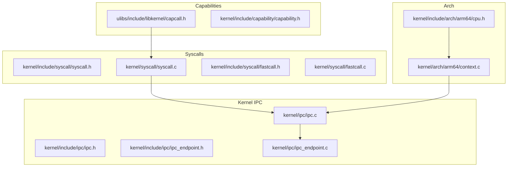
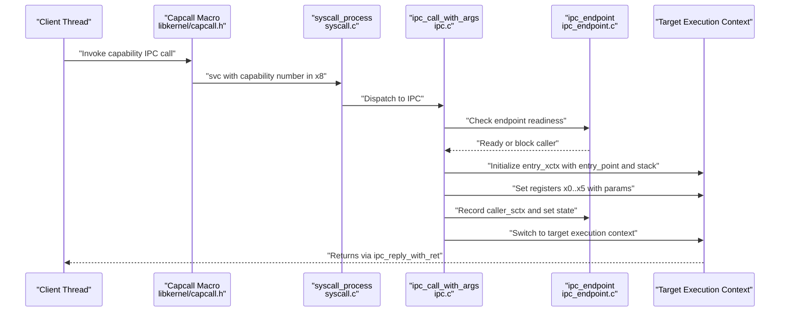
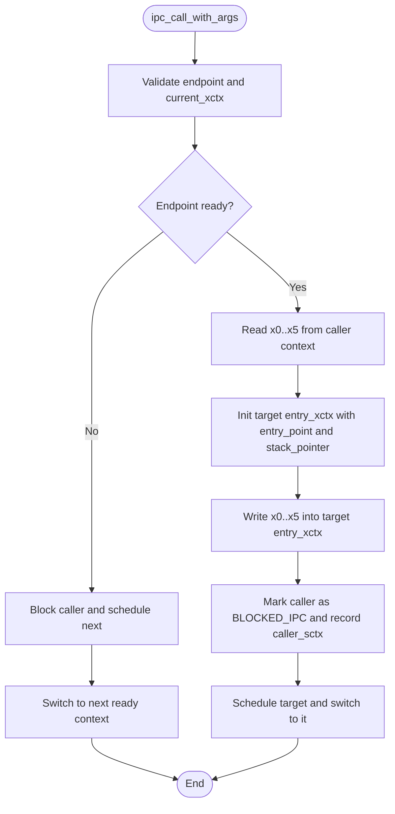
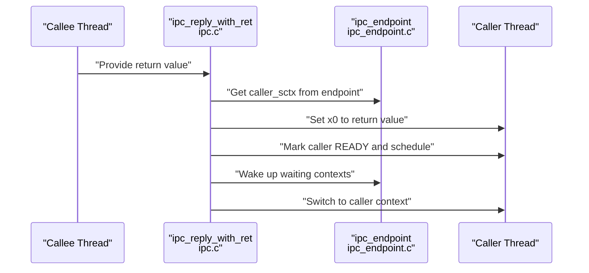
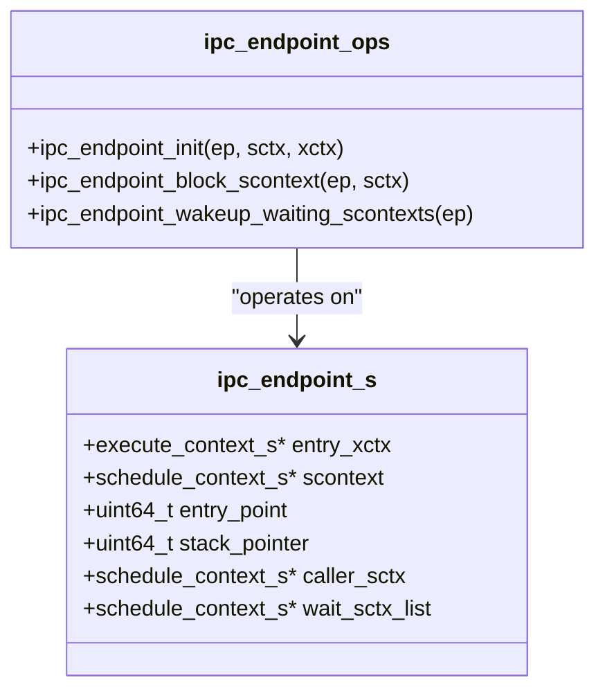
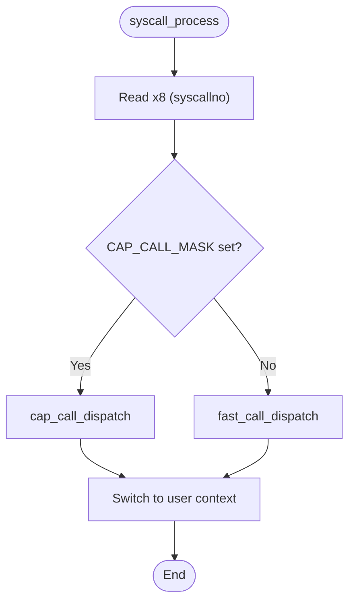
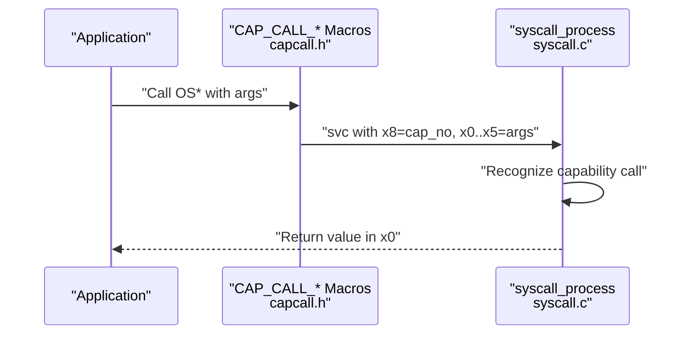
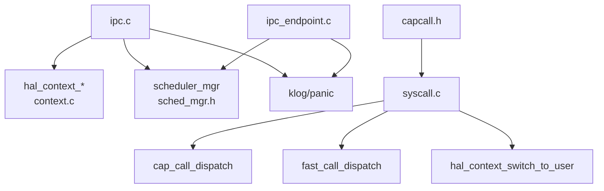

# Message Passing Mechanisms

<cite>
**Referenced Files in This Document**
- [ipc.h](file://kernel/include/ipc/ipc.h)
- [ipc_endpoint.h](file://kernel/include/ipc/ipc_endpoint.h)
- [ipc.c](file://kernel/ipc/ipc.c)
- [ipc_endpoint.c](file://kernel/ipc/ipc_endpoint.c)
- [syscall.h](file://kernel/include/syscall/syscall.h)
- [syscall.c](file://kernel/syscall/syscall.c)
- [fastcall.h](file://kernel/include/syscall/fastcall.h)
- [fastcall.c](file://kernel/syscall/fastcall.c)
- [capcall.h](file://ulibs/include/libkernel/capcall.h)
- [capability.h](file://kernel/include/capability/capability.h)
- [context.c](file://kernel/arch/arm64/context.c)
- [cpu.h](file://kernel/include/arch/arm64/cpu.h)
</cite>

## Table of Contents
1. [Introduction](#introduction)
2. [Project Structure](#project-structure)
3. [Core Components](#core-components)
4. [Architecture Overview](#architecture-overview)
5. [Detailed Component Analysis](#detailed-component-analysis)
6. [Dependency Analysis](#dependency-analysis)
7. [Performance Considerations](#performance-considerations)
8. [Troubleshooting Guide](#troubleshooting-guide)
9. [Conclusion](#conclusion)

## Introduction
This document explains the message passing mechanisms in the TranquilOS IPC system with a focus on the ipc_call_with_args function, the fastcall mechanism for efficient IPC, and the underlying calling convention. It covers parameter passing via registers, argument marshaling/unmarshaling, return value handling, context switching during IPC, examples of different message types, parameter validation, error propagation, performance optimization techniques, message size limitations, and debugging approaches for IPC communication failures.

## Project Structure
The IPC subsystem spans kernel headers and implementations, syscall dispatchers, capability-based calls, and architecture-specific context handling. The most relevant files for IPC message passing are:

- Kernel IPC interfaces and endpoints
- Syscall and fastcall dispatchers
- Capability call macros and dispatch
- ARM64 context register accessors

**Diagram sources**
- [ipc.h](file://kernel/include/ipc/ipc.h#L1-L13)
- [ipc_endpoint.h](file://kernel/include/ipc/ipc_endpoint.h#L1-L25)
- [ipc.c](file://kernel/ipc/ipc.c#L1-L114)
- [ipc_endpoint.c](file://kernel/ipc/ipc_endpoint.c#L1-L82)
- [syscall.h](file://kernel/include/syscall/syscall.h#L1-L8)
- [syscall.c](file://kernel/syscall/syscall.c#L1-L20)
- [fastcall.h](file://kernel/include/syscall/fastcall.h#L1-L8)
- [fastcall.c](file://kernel/syscall/fastcall.c#L1-L17)
- [capcall.h](file://ulibs/include/libkernel/capcall.h#L1-L177)
- [capability.h](file://kernel/include/capability/capability.h#L1-L26)
- [context.c](file://kernel/arch/arm64/context.c#L50-L98)
- [cpu.h](file://kernel/include/arch/arm64/cpu.h#L1-L93)

**Section sources**
- [ipc.h](file://kernel/include/ipc/ipc.h#L1-L13)
- [ipc_endpoint.h](file://kernel/include/ipc/ipc_endpoint.h#L1-L25)
- [ipc.c](file://kernel/ipc/ipc.c#L1-L114)
- [ipc_endpoint.c](file://kernel/ipc/ipc_endpoint.c#L1-L82)
- [syscall.h](file://kernel/include/syscall/syscall.h#L1-L8)
- [syscall.c](file://kernel/syscall/syscall.c#L1-L20)
- [fastcall.h](file://kernel/include/syscall/fastcall.h#L1-L8)
- [fastcall.c](file://kernel/syscall/fastcall.c#L1-L17)
- [capcall.h](file://ulibs/include/libkernel/capcall.h#L1-L177)
- [capability.h](file://kernel/include/capability/capability.h#L1-L26)
- [context.c](file://kernel/arch/arm64/context.c#L50-L98)
- [cpu.h](file://kernel/include/arch/arm64/cpu.h#L1-L93)

## Core Components
- ipc_call_with_args: Initiates an IPC call by reading parameters from registers, setting up the target execution context, and switching to it. It also blocks the caller if the endpoint is busy and schedules another ready context.
- ipc_reply_with_ret: Returns a value to the caller, updates scheduling state, and resumes the waiting context.
- ipc_endpoint: Holds the entry execution context, entry point, stack pointer, and linked scheduling contexts for blocking and wake-up.
- syscall_process: Routes incoming calls to either capability-based calls or fastcall handlers.
- fast_call_dispatch: Placeholder dispatcher for fastcall routes.
- capcall macros: Provide a capability-based calling convention with up to six integer arguments passed in registers.

Key responsibilities:
- Parameter marshaling/unmarshaling via register indices (x0–x5 for arguments, x8 for syscall/fastcall number).
- Context switching between caller and callee execution contexts.
- Endpoint-based synchronization and queueing of waiting contexts.

**Section sources**
- [ipc.c](file://kernel/ipc/ipc.c#L9-L76)
- [ipc.c](file://kernel/ipc/ipc.c#L78-L114)
- [ipc_endpoint.c](file://kernel/ipc/ipc_endpoint.c#L7-L25)
- [syscall.c](file://kernel/syscall/syscall.c#L8-L20)
- [fastcall.c](file://kernel/syscall/fastcall.c#L6-L17)
- [capcall.h](file://ulibs/include/libkernel/capcall.h#L15-L126)

## Architecture Overview
The IPC flow begins when a client invokes a capability-based IPC call macro. The syscall dispatcher recognizes the capability call and forwards to the IPC implementation. The kernel reads parameters from registers, initializes the callee’s execution context, and switches to it. The caller is blocked and scheduled out until the callee replies.

**Diagram sources**
- [capcall.h](file://ulibs/include/libkernel/capcall.h#L15-L126)
- [syscall.c](file://kernel/syscall/syscall.c#L8-L20)
- [ipc.c](file://kernel/ipc/ipc.c#L9-L76)
- [ipc_endpoint.c](file://kernel/ipc/ipc_endpoint.c#L27-L49)

## Detailed Component Analysis

### ipc_call_with_args: Calling Convention and Register Usage
- Purpose: Transfer control to an IPC endpoint with up to four integer arguments plus a capability reference and method ID.
- Register usage:
  - x0: endpoint capability reference
  - x1: method identifier
  - x2..x5: integer arguments (up to four)
  - x8: syscall/fastcall number (not used here; capability call uses a dedicated path)
- Behavior:
  - Validates endpoint and current execution context pointers.
  - If the endpoint’s scheduling context is not ready, blocks the caller and schedules another context.
  - Reads parameters from the caller’s execution context registers.
  - Initializes the target execution context with entry point and stack pointer.
  - Writes parameters into the target execution context registers.
  - Updates scheduling states and performs context switch to the target.

**Diagram sources**
- [ipc.c](file://kernel/ipc/ipc.c#L9-L76)

**Section sources**
- [ipc.c](file://kernel/ipc/ipc.c#L9-L76)
- [context.c](file://kernel/arch/arm64/context.c#L50-L84)
- [cpu.h](file://kernel/include/arch/arm64/cpu.h#L7-L39)

### ipc_reply_with_ret: Return Value Handling and Wake-Up
- Purpose: Deliver a return value to the caller and resume it.
- Steps:
  - Retrieve the endpoint from the current scheduling context.
  - Restore the caller’s scheduling context state and write the return value into its x0 register.
  - Re-schedule the caller and switch back to it.
  - Wake up any contexts waiting on the endpoint.

**Diagram sources**
- [ipc.c](file://kernel/ipc/ipc.c#L78-L114)
- [ipc_endpoint.c](file://kernel/ipc/ipc_endpoint.c#L51-L82)

**Section sources**
- [ipc.c](file://kernel/ipc/ipc.c#L78-L114)
- [ipc_endpoint.c](file://kernel/ipc/ipc_endpoint.c#L51-L82)

### ipc_endpoint: Synchronization and Waiting Queue
- Purpose: Manage the endpoint’s execution context, entry point, stack pointer, and waiting contexts.
- Functions:
  - Initialize endpoint with entry execution context and capture entry point and stack pointer.
  - Block a scheduling context and enqueue it for later wake-up.
  - Wake up all waiting contexts and re-schedule them.

**Diagram sources**
- [ipc_endpoint.h](file://kernel/include/ipc/ipc_endpoint.h#L8-L24)
- [ipc_endpoint.c](file://kernel/ipc/ipc_endpoint.c#L7-L25)
- [ipc_endpoint.c](file://kernel/ipc/ipc_endpoint.c#L27-L49)
- [ipc_endpoint.c](file://kernel/ipc/ipc_endpoint.c#L51-L82)

**Section sources**
- [ipc_endpoint.h](file://kernel/include/ipc/ipc_endpoint.h#L8-L24)
- [ipc_endpoint.c](file://kernel/ipc/ipc_endpoint.c#L7-L25)
- [ipc_endpoint.c](file://kernel/ipc/ipc_endpoint.c#L27-L49)
- [ipc_endpoint.c](file://kernel/ipc/ipc_endpoint.c#L51-L82)

### Syscall and Fastcall Mechanism
- syscall_process:
  - Reads the syscall number from x8.
  - If the capability call bit is set, dispatches to capability-based calls.
  - Otherwise, dispatches to fastcall handler.
  - Ensures address space switch and switches to user context.
- fast_call_dispatch:
  - Extracts the lower 32 bits of the syscall number to select a fastcall route.
  - Currently a placeholder; default logs an error and triggers a core dump.

**Diagram sources**
- [syscall.c](file://kernel/syscall/syscall.c#L8-L20)
- [fastcall.c](file://kernel/syscall/fastcall.c#L6-L17)

**Section sources**
- [syscall.c](file://kernel/syscall/syscall.c#L8-L20)
- [fastcall.c](file://kernel/syscall/fastcall.c#L6-L17)

### Capability-Based IPC Calls (Client-Side)
- The capcall macros define capability-based IPC calls with up to six integer arguments.
- Arguments are passed in registers x0–x5; the capability number is placed in x8.
- The svc instruction triggers the syscall path, which routes to capability dispatch.

**Diagram sources**
- [capcall.h](file://ulibs/include/libkernel/capcall.h#L15-L126)
- [syscall.c](file://kernel/syscall/syscall.c#L8-L20)

**Section sources**
- [capcall.h](file://ulibs/include/libkernel/capcall.h#L15-L126)
- [capability.h](file://kernel/include/capability/capability.h#L22-L25)

### Parameter Marshaling and Unmarshaling
- Marshaling:
  - Client-side: capcall macros place arguments into registers x0–x5 and capability number into x8.
  - Kernel-side: ipc_call_with_args reads x0–x5 from the caller’s execution context and writes them into the target’s execution context.
- Unmarshaling:
  - Return value: ipc_reply_with_ret writes the return value into the caller’s x0 register.
  - No automatic unmarshaling for complex structures is implemented in the shown code.

Validation and error propagation:
- The kernel validates endpoint and execution context pointers; panics are triggered on invalid states.
- If the endpoint is not ready, the caller is blocked and scheduled out.
- On IPC reply, the caller is resumed and switched back to user mode.

**Section sources**
- [capcall.h](file://ulibs/include/libkernel/capcall.h#L15-L126)
- [ipc.c](file://kernel/ipc/ipc.c#L9-L76)
- [ipc.c](file://kernel/ipc/ipc.c#L78-L114)

### Examples of Different Message Types
- Method invocation with up to four integer arguments:
  - Use the capcall macro for up to six arguments; the IPC implementation supports four integer arguments plus two additional fields (capability reference and method).
- Return value handling:
  - The callee sets the return value; the caller retrieves it from x0 after the IPC completes.

Note: The code does not implement automatic serialization of arbitrary structures. Complex messages require external marshaling outside the kernel’s IPC layer.

**Section sources**
- [capcall.h](file://ulibs/include/libkernel/capcall.h#L15-L126)
- [ipc.c](file://kernel/ipc/ipc.c#L37-L52)
- [ipc.c](file://kernel/ipc/ipc.c#L107-L108)

## Dependency Analysis
- ipc.c depends on:
  - hal_context getters/setters to access and set registers.
  - scheduler manager to schedule and switch contexts.
  - panic and logging for error handling.
- ipc_endpoint.c depends on:
  - scheduler manager for enqueueing and rescheduling contexts.
  - linked-list helpers for waiting context queues.
- syscall.c depends on:
  - cap_call_dispatch and fast_call_dispatch to route calls.
  - hal_context_switch_to_user to enter user mode.
- capcall.h depends on:
  - svc instruction and register constraints to pass arguments efficiently.

**Diagram sources**
- [ipc.c](file://kernel/ipc/ipc.c#L1-L114)
- [ipc_endpoint.c](file://kernel/ipc/ipc_endpoint.c#L1-L82)
- [syscall.c](file://kernel/syscall/syscall.c#L1-L20)
- [capcall.h](file://ulibs/include/libkernel/capcall.h#L15-L126)
- [context.c](file://kernel/arch/arm64/context.c#L50-L98)

**Section sources**
- [ipc.c](file://kernel/ipc/ipc.c#L1-L114)
- [ipc_endpoint.c](file://kernel/ipc/ipc_endpoint.c#L1-L82)
- [syscall.c](file://kernel/syscall/syscall.c#L1-L20)
- [capcall.h](file://ulibs/include/libkernel/capcall.h#L15-L126)
- [context.c](file://kernel/arch/arm64/context.c#L50-L98)

## Performance Considerations
- Register-based parameter passing minimizes memory traffic and avoids stack manipulation for small argument counts.
- Fastcall and capability calls reduce overhead compared to full system call entry/exit paths.
- Blocking and scheduling are performed only when the endpoint is busy, avoiding unnecessary context switches.
- Limitations:
  - Up to four integer arguments are supported directly in registers; additional arguments require external mechanisms.
  - No built-in serialization for complex data structures; large payloads should be handled via shared memory or capability references managed by higher layers.

[No sources needed since this section provides general guidance]

## Troubleshooting Guide
Common failure modes and diagnostics:
- Endpoint or execution context is null:
  - The kernel panics immediately upon detecting invalid pointers.
- Endpoint not ready:
  - Caller is blocked and scheduled out; check endpoint initialization and scheduling state transitions.
- Scheduler not initialized:
  - Panics occur if scheduler manager or local scheduler is unavailable.
- Return value not visible:
  - Ensure the callee invoked ipc_reply_with_ret and wrote the value into x0.
- Debugging steps:
  - Enable kernel logging to inspect endpoint readiness and blocking/wake-up events.
  - Verify register values around the svc and context switch boundaries.
  - Confirm that the capability number and method identifiers are correctly formed.

**Section sources**
- [ipc.c](file://kernel/ipc/ipc.c#L10-L18)
- [ipc.c](file://kernel/ipc/ipc.c#L19-L35)
- [ipc.c](file://kernel/ipc/ipc.c#L22-L34)
- [ipc.c](file://kernel/ipc/ipc.c#L62-L75)
- [ipc.c](file://kernel/ipc/ipc.c#L78-L114)
- [ipc_endpoint.c](file://kernel/ipc/ipc_endpoint.c#L27-L49)
- [ipc_endpoint.c](file://kernel/ipc/ipc_endpoint.c#L51-L82)

## Conclusion
TranquilOS implements a compact, register-centric IPC mechanism optimized for small argument counts and efficient context switching. The ipc_call_with_args function orchestrates parameter marshaling, endpoint readiness checks, and context transitions, while ipc_reply_with_ret handles return value delivery and wake-up. Capability-based macros provide a streamlined calling convention, and syscall routing ensures proper dispatch. For complex or large messages, external marshaling and shared capabilities are recommended. Robust validation and logging support effective debugging of IPC failures.