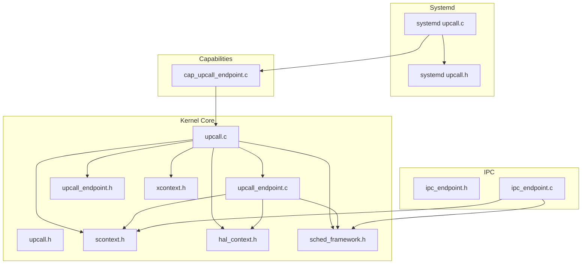
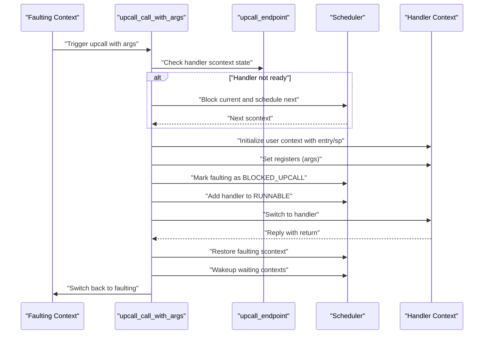
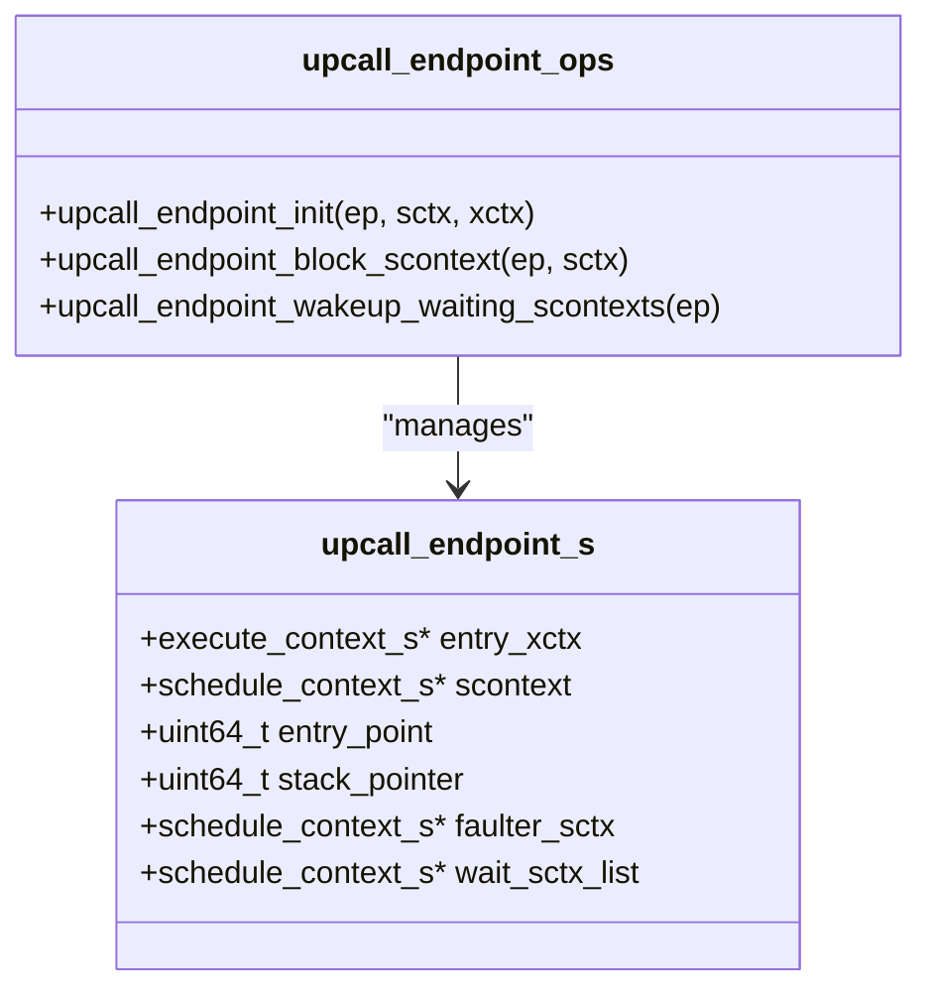
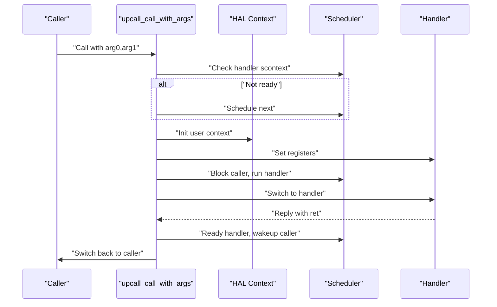
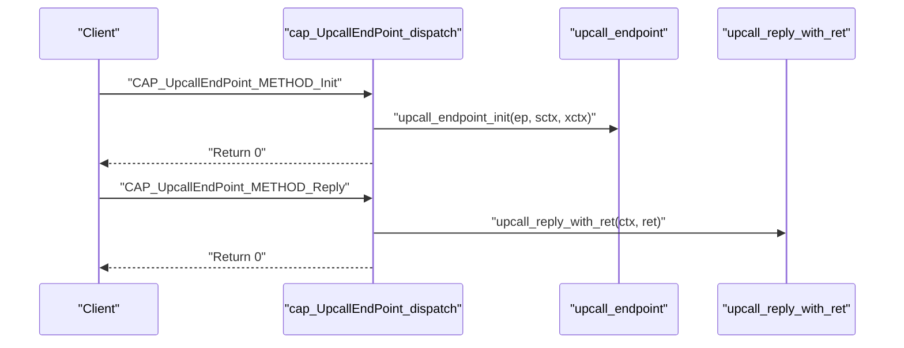
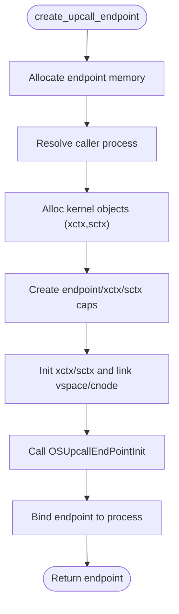
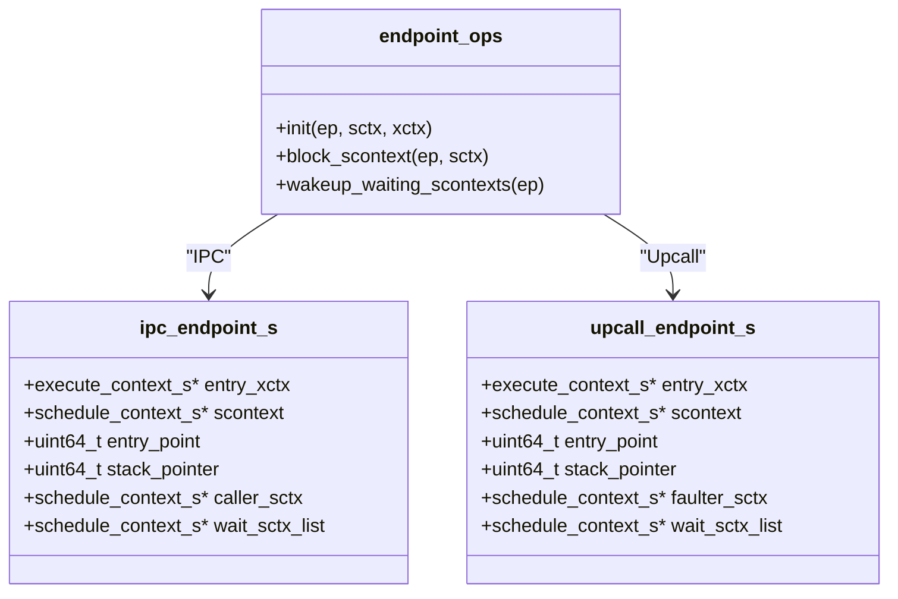
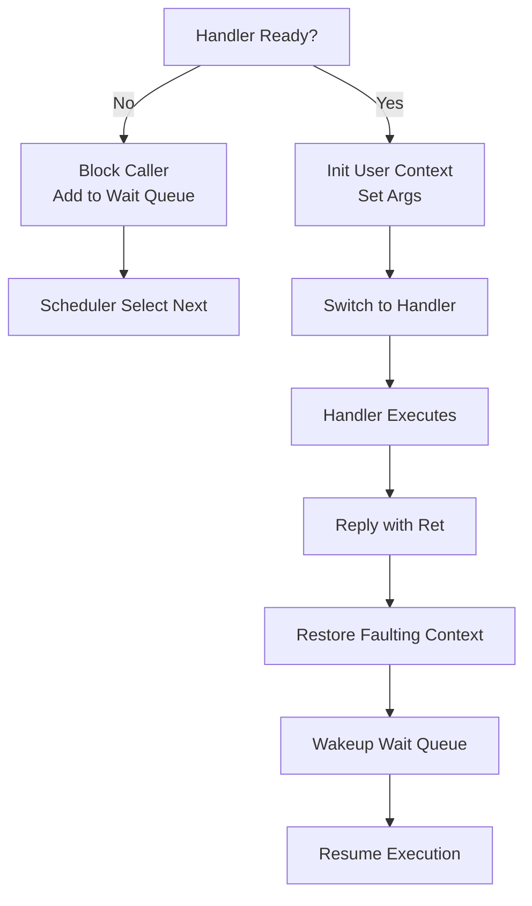
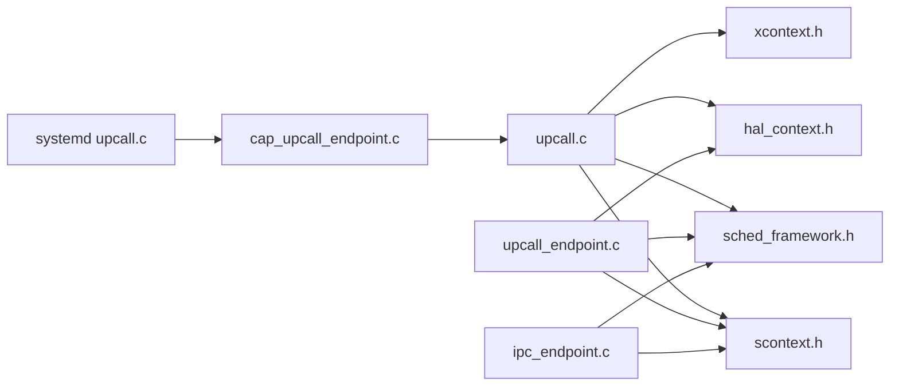

# Upcall System

<cite>
**Referenced Files in This Document**
- [upcall.h](file://kernel/include/upcall/upcall.h)
- [upcall_endpoint.h](file://kernel/include/upcall/upcall_endpoint.h)
- [upcall.c](file://kernel/upcall/upcall.c)
- [upcall_endpoint.c](file://kernel/upcall/upcall_endpoint.c)
- [cap_upcall_endpoint.c](file://kernel/capability/cap_upcall_endpoint.c)
- [upcall.h (systemd)](file://kernel/systemd/include/upcall.h)
- [upcall.c (systemd)](file://kernel/systemd/upcall.c)
- [ipc_endpoint.h](file://kernel/include/ipc/ipc_endpoint.h)
- [ipc_endpoint.c](file://kernel/ipc/ipc_endpoint.c)
- [xcontext.h](file://kernel/include/xcontext/xcontext.h)
- [scontext.h](file://kernel/include/scontext/scontext.h)
- [hal_context.h](file://kernel/include/arch/generic/hal_context.h)
- [sched_framework.h](file://kernel/include/scheduler/sched_framework.h)
- [upcall.h (libkernel)](file://ulibs/include/libkernel/upcall.h)
</cite>

## Table of Contents
1. [Introduction](#introduction)
2. [Project Structure](#project-structure)
3. [Core Components](#core-components)
4. [Architecture Overview](#architecture-overview)
5. [Detailed Component Analysis](#detailed-component-analysis)
6. [Dependency Analysis](#dependency-analysis)
7. [Performance Considerations](#performance-considerations)
8. [Troubleshooting Guide](#troubleshooting-guide)
9. [Conclusion](#conclusion)
10. [Appendices](#appendices)

## Introduction
This document explains the upcall system in the TranquilOS IPC architecture. It covers asynchronous notifications via upcall endpoints, endpoint lifecycle and management, callback registration, context switching, notification delivery, and cleanup. It also documents handler implementation, scheduling behavior, queuing mechanisms, common patterns, error handling, performance considerations, security implications, and debugging techniques. The upcall mechanism complements regular IPC by enabling asynchronous notifications delivered to a dedicated handler context.

## Project Structure
The upcall system spans several kernel subsystems:
- Upcall core definitions and primitives live under kernel/include/upcall and kernel/upcall.
- Endpoint management integrates with scheduling contexts and execute contexts.
- Capability dispatchers expose upcall endpoint operations to user-space clients.
- Systemd constructs and wires upcall endpoints for processes.
- IPC endpoints provide a synchronous communication model for comparison.

**Diagram sources**
- [upcall.c](file://kernel/upcall/upcall.c#L1-L95)
- [upcall_endpoint.c](file://kernel/upcall/upcall_endpoint.c#L1-L83)
- [upcall_endpoint.h](file://kernel/include/upcall/upcall_endpoint.h#L1-L25)
- [upcall.h](file://kernel/include/upcall/upcall.h#L1-L13)
- [xcontext.h](file://kernel/include/xcontext/xcontext.h#L1-L24)
- [scontext.h](file://kernel/include/scontext/scontext.h#L1-L49)
- [hal_context.h](file://kernel/include/arch/generic/hal_context.h#L1-L24)
- [sched_framework.h](file://kernel/include/scheduler/sched_framework.h#L1-L20)
- [ipc_endpoint.h](file://kernel/include/ipc/ipc_endpoint.h#L1-L25)
- [ipc_endpoint.c](file://kernel/ipc/ipc_endpoint.c#L1-L82)
- [upcall.c (systemd)](file://kernel/systemd/upcall.c#L1-L132)
- [upcall.h (systemd)](file://kernel/systemd/include/upcall.h#L1-L21)
- [cap_upcall_endpoint.c](file://kernel/capability/cap_upcall_endpoint.c#L1-L110)

**Section sources**
- [upcall.h](file://kernel/include/upcall/upcall.h#L1-L13)
- [upcall_endpoint.h](file://kernel/include/upcall/upcall_endpoint.h#L1-L25)
- [upcall.c](file://kernel/upcall/upcall.c#L1-L95)
- [upcall_endpoint.c](file://kernel/upcall/upcall_endpoint.c#L1-L83)
- [cap_upcall_endpoint.c](file://kernel/capability/cap_upcall_endpoint.c#L1-L110)
- [upcall.c (systemd)](file://kernel/systemd/upcall.c#L1-L132)
- [upcall.h (systemd)](file://kernel/systemd/include/upcall.h#L1-L21)
- [ipc_endpoint.h](file://kernel/include/ipc/ipc_endpoint.h#L1-L25)
- [ipc_endpoint.c](file://kernel/ipc/ipc_endpoint.c#L1-L82)
- [xcontext.h](file://kernel/include/xcontext/xcontext.h#L1-L24)
- [scontext.h](file://kernel/include/scontext/scontext.h#L1-L49)
- [hal_context.h](file://kernel/include/arch/generic/hal_context.h#L1-L24)
- [sched_framework.h](file://kernel/include/scheduler/sched_framework.h#L1-L20)

## Core Components
- Upcall endpoint: Holds the handler’s execute context, schedule context, entry point, and stack pointer. It tracks the faulting (caller) context and maintains a wait queue for blocked contexts.
- Upcall primitives: Functions to initiate an upcall with arguments and to return from an upcall handler with a result.
- Capability dispatcher: Exposes creation, initialization, reply, and destroy operations for upcall endpoints to user-space.
- Systemd integration: Allocates kernel objects, creates capabilities, initializes contexts, and binds endpoints to processes.
- Scheduler integration: Uses the scheduler framework to block, wake, and reschedule contexts during upcall transitions.
- HAL context: Provides low-level context manipulation for user-mode entry and register passing.

Key responsibilities:
- Asynchronous notification delivery to a registered handler.
- Argument passing to the handler via registers.
- Context state transitions and scheduling.
- Wakeup of waiting contexts upon reply.
- Cleanup and resource release.

**Section sources**
- [upcall_endpoint.h](file://kernel/include/upcall/upcall_endpoint.h#L8-L17)
- [upcall_endpoint.c](file://kernel/upcall/upcall_endpoint.c#L8-L26)
- [upcall.h](file://kernel/include/upcall/upcall.h#L9-L11)
- [upcall.c](file://kernel/upcall/upcall.c#L8-L52)
- [cap_upcall_endpoint.c](file://kernel/capability/cap_upcall_endpoint.c#L20-L87)
- [upcall.c (systemd)](file://kernel/systemd/upcall.c#L27-L92)
- [scontext.h](file://kernel/include/scontext/scontext.h#L12-L20)
- [hal_context.h](file://kernel/include/arch/generic/hal_context.h#L10-L22)

## Architecture Overview
The upcall architecture separates concerns between endpoint management, handler invocation, and scheduling. The flow is:
- Systemd constructs an upcall endpoint and associated kernel objects (execute and schedule contexts).
- A capability dispatcher initializes the endpoint with the handler’s entry point and stack pointer.
- When a fault or event occurs, the kernel invokes the upcall handler with arguments.
- The handler executes in the handler context and replies to resume the faulting context.
- The scheduler manages blocking and wakeup of contexts.

**Diagram sources**
- [upcall.c](file://kernel/upcall/upcall.c#L8-L52)
- [upcall_endpoint.c](file://kernel/upcall/upcall_endpoint.c#L28-L50)
- [scontext.h](file://kernel/include/scontext/scontext.h#L12-L20)
- [sched_framework.h](file://kernel/include/scheduler/sched_framework.h#L1-L20)

## Detailed Component Analysis

### Upcall Endpoint Management
The upcall endpoint encapsulates:
- Handler execute and schedule contexts.
- Entry point and stack pointer for user-mode entry.
- Tracking of the faulting context and a FIFO queue of waiting contexts.

Initialization sets the entry point and stack pointer from the current execute context, binds the endpoint to the handler schedule context, and clears state fields.

Blocking appends the calling context to the endpoint’s wait queue and transitions it to a blocked state. Wakeup iterates the wait queue, resets states, and re-adds contexts to the scheduler.

**Diagram sources**
- [upcall_endpoint.h](file://kernel/include/upcall/upcall_endpoint.h#L8-L17)
- [upcall_endpoint.c](file://kernel/upcall/upcall_endpoint.c#L8-L26)
- [upcall_endpoint.c](file://kernel/upcall/upcall_endpoint.c#L28-L50)
- [upcall_endpoint.c](file://kernel/upcall/upcall_endpoint.c#L52-L83)

**Section sources**
- [upcall_endpoint.h](file://kernel/include/upcall/upcall_endpoint.h#L8-L17)
- [upcall_endpoint.c](file://kernel/upcall/upcall_endpoint.c#L8-L26)
- [upcall_endpoint.c](file://kernel/upcall/upcall_endpoint.c#L28-L50)
- [upcall_endpoint.c](file://kernel/upcall/upcall_endpoint.c#L52-L83)

### Upcall Primitive Functions
Two primitives coordinate the upcall lifecycle:
- upcall_call_with_args: Validates handler readiness, blocks the caller if needed, initializes the handler’s user context with entry point and stack pointer, passes arguments via registers, updates states, schedules the handler, and switches to it.
- upcall_reply_with_ret: Validates reply conditions, restores the handler state, removes it from the scheduler, wakes up the faulting context, and resumes it.

**Diagram sources**
- [upcall.c](file://kernel/upcall/upcall.c#L8-L52)
- [upcall.c](file://kernel/upcall/upcall.c#L54-L95)
- [hal_context.h](file://kernel/include/arch/generic/hal_context.h#L10-L16)

**Section sources**
- [upcall.h](file://kernel/include/upcall/upcall.h#L9-L11)
- [upcall.c](file://kernel/upcall/upcall.c#L8-L52)
- [upcall.c](file://kernel/upcall/upcall.c#L54-L95)
- [hal_context.h](file://kernel/include/arch/generic/hal_context.h#L10-L16)

### Callback Registration and Capability Dispatch
The capability dispatcher exposes methods to create, initialize, reply, and destroy upcall endpoints:
- Create: Prepares untyped memory for the endpoint.
- Init: Resolves capability references for the endpoint, execute context, and schedule context, then initializes the endpoint.
- Reply: Extracts the return value and invokes the upcall reply primitive.
- Destroy: Placeholder for cleanup.

**Diagram sources**
- [cap_upcall_endpoint.c](file://kernel/capability/cap_upcall_endpoint.c#L20-L87)
- [upcall_endpoint.c](file://kernel/upcall/upcall_endpoint.c#L8-L26)
- [upcall.c](file://kernel/upcall/upcall.c#L54-L95)

**Section sources**
- [cap_upcall_endpoint.c](file://kernel/capability/cap_upcall_endpoint.c#L12-L110)

### Systemd Integration and Endpoint Construction
Systemd constructs kernel objects and capabilities for normal processes:
- Allocates memory for the endpoint and handler contexts.
- Creates capability references for the endpoint, execute context, and schedule context.
- Initializes the handler’s execute and schedule contexts, sets up the virtual address space and capability node linkage, and calls the capability initializer.
- Stores the endpoint reference on the process for later use.

**Diagram sources**
- [upcall.c (systemd)](file://kernel/systemd/upcall.c#L94-L132)
- [upcall.c (systemd)](file://kernel/systemd/upcall.c#L27-L92)

**Section sources**
- [upcall.h (systemd)](file://kernel/systemd/include/upcall.h#L8-L17)
- [upcall.c (systemd)](file://kernel/systemd/upcall.c#L27-L92)
- [upcall.c (systemd)](file://kernel/systemd/upcall.c#L94-L132)

### Relationship Between Upcalls and Regular IPC
Both upcalls and IPC use endpoints and wait queues:
- IPC endpoints track a caller context and a wait queue for blocked callers.
- Upcall endpoints track a faulting context and a wait queue for blocked contexts.
- Both rely on the scheduler framework to manage blocking and wakeup.

**Diagram sources**
- [ipc_endpoint.h](file://kernel/include/ipc/ipc_endpoint.h#L8-L17)
- [upcall_endpoint.h](file://kernel/include/upcall/upcall_endpoint.h#L8-L17)
- [ipc_endpoint.c](file://kernel/ipc/ipc_endpoint.c#L7-L25)
- [upcall_endpoint.c](file://kernel/upcall/upcall_endpoint.c#L8-L26)

**Section sources**
- [ipc_endpoint.h](file://kernel/include/ipc/ipc_endpoint.h#L8-L17)
- [ipc_endpoint.c](file://kernel/ipc/ipc_endpoint.c#L7-L25)
- [upcall_endpoint.h](file://kernel/include/upcall/upcall_endpoint.h#L8-L17)
- [upcall_endpoint.c](file://kernel/upcall/upcall_endpoint.c#L8-L26)

### Implementation Details: Handlers, Priority, and Queuing
- Handler implementation: The handler runs in the handler context with its own entry point and stack. Arguments are passed via registers initialized by the upcall primitive.
- Priority handling: The scheduler framework determines which runnable context to schedule next. Upcalls temporarily replace the caller in the scheduler while the handler runs.
- Queuing mechanisms: Both IPC and upcall endpoints maintain FIFO queues of blocked contexts. Wakeup drains the queue, resets states, and re-adds contexts to the scheduler.

**Diagram sources**
- [upcall.c](file://kernel/upcall/upcall.c#L8-L52)
- [upcall_endpoint.c](file://kernel/upcall/upcall_endpoint.c#L28-L50)
- [upcall_endpoint.c](file://kernel/upcall/upcall_endpoint.c#L52-L83)
- [ipc_endpoint.c](file://kernel/ipc/ipc_endpoint.c#L27-L49)

**Section sources**
- [upcall.c](file://kernel/upcall/upcall.c#L8-L52)
- [upcall_endpoint.c](file://kernel/upcall/upcall_endpoint.c#L28-L50)
- [upcall_endpoint.c](file://kernel/upcall/upcall_endpoint.c#L52-L83)
- [ipc_endpoint.c](file://kernel/ipc/ipc_endpoint.c#L27-L49)

### Common Upcall Patterns
- Page fault handling: A faulting context triggers an upcall to a page fault handler. The handler resolves the fault and replies to resume execution.
- Event-driven notifications: Device or subsystem events trigger asynchronous notifications delivered to a registered handler.

These patterns rely on the endpoint’s ability to capture the faulting context, deliver arguments, and resume execution after the handler completes.

**Section sources**
- [upcall.h (libkernel)](file://ulibs/include/libkernel/upcall.h#L4-L6)
- [upcall.c](file://kernel/upcall/upcall.c#L54-L95)

### Error Handling for Failed Upcalls
- Validation failures: Null endpoint, null execute context, or missing scheduler lead to panics.
- Reply validation: Returning zero from an upcall handler is flagged as an error condition.
- Wait queue integrity: Iteration checks for null contexts and logs errors if inconsistencies are detected.

Best practices:
- Ensure endpoint initialization precedes upcall invocation.
- Verify handler readiness and correct argument passing.
- Treat reply return values as protocol signals.

**Section sources**
- [upcall_endpoint.c](file://kernel/upcall/upcall_endpoint.c#L9-L14)
- [upcall.c](file://kernel/upcall/upcall.c#L32-L34)
- [upcall.c](file://kernel/upcall/upcall.c#L58-L65)
- [upcall.c](file://kernel/upcall/upcall.c#L83-L85)
- [upcall_endpoint.c](file://kernel/upcall/upcall_endpoint.c#L71-L75)

### Security Implications
- Capability-based access: Upcall endpoints are created and initialized via capability methods, ensuring controlled allocation and binding.
- Isolation: Handlers execute in separate contexts with distinct stacks and address spaces, reducing cross-process interference.
- Privilege boundaries: Upcalls traverse HAL context interfaces and scheduler operations, maintaining kernel-level control.

Recommendations:
- Restrict endpoint creation to trusted services.
- Validate capability references and permissions during initialization.
- Monitor handler execution and enforce strict reply semantics.

**Section sources**
- [cap_upcall_endpoint.c](file://kernel/capability/cap_upcall_endpoint.c#L20-L72)
- [upcall.c (systemd)](file://kernel/systemd/upcall.c#L77-L85)

### Debugging Techniques for Upcall-Related Issues
- Logging: The code emits debug and info logs during endpoint initialization, blocking, wakeup, and reply phases.
- Panic paths: Clear panic messages indicate invalid states (e.g., missing scheduler, null contexts).
- Context inspection: HAL context helpers support dumping and inspecting register states.
- Scheduling state: Verify scontext states (READY, RUNNING, BLOCKED_UPCALL) and wait queue contents.

Checklist:
- Confirm endpoint initialization and handler readiness.
- Inspect register values passed to the handler.
- Validate reply return values and faulting context restoration.
- Trace scheduler transitions and wait queue behavior.

**Section sources**
- [upcall_endpoint.c](file://kernel/upcall/upcall_endpoint.c#L19-L21)
- [upcall_endpoint.c](file://kernel/upcall/upcall_endpoint.c#L29-L31)
- [upcall_endpoint.c](file://kernel/upcall/upcall_endpoint.c#L53-L56)
- [upcall.c](file://kernel/upcall/upcall.c#L55-L56)
- [upcall.c](file://kernel/upcall/upcall.c#L92-L94)
- [hal_context.h](file://kernel/include/arch/generic/hal_context.h#L12-L16)

## Dependency Analysis
The upcall system depends on:
- Schedule and execute contexts for state and switching.
- Scheduler framework for blocking and scheduling.
- HAL context for user-mode entry and register manipulation.
- IPC endpoint infrastructure for analogous blocking/wakeup semantics.

**Diagram sources**
- [upcall.c](file://kernel/upcall/upcall.c#L1-L95)
- [upcall_endpoint.c](file://kernel/upcall/upcall_endpoint.c#L1-L83)
- [cap_upcall_endpoint.c](file://kernel/capability/cap_upcall_endpoint.c#L1-L110)
- [upcall.c (systemd)](file://kernel/systemd/upcall.c#L1-L132)
- [ipc_endpoint.c](file://kernel/ipc/ipc_endpoint.c#L1-L82)
- [scontext.h](file://kernel/include/scontext/scontext.h#L1-L49)
- [xcontext.h](file://kernel/include/xcontext/xcontext.h#L1-L24)
- [hal_context.h](file://kernel/include/arch/generic/hal_context.h#L1-L24)
- [sched_framework.h](file://kernel/include/scheduler/sched_framework.h#L1-L20)

**Section sources**
- [upcall.c](file://kernel/upcall/upcall.c#L1-L95)
- [upcall_endpoint.c](file://kernel/upcall/upcall_endpoint.c#L1-L83)
- [cap_upcall_endpoint.c](file://kernel/capability/cap_upcall_endpoint.c#L1-L110)
- [upcall.c (systemd)](file://kernel/systemd/upcall.c#L1-L132)
- [ipc_endpoint.c](file://kernel/ipc/ipc_endpoint.c#L1-L82)
- [scontext.h](file://kernel/include/scontext/scontext.h#L1-L49)
- [xcontext.h](file://kernel/include/xcontext/xcontext.h#L1-L24)
- [hal_context.h](file://kernel/include/arch/generic/hal_context.h#L1-L24)
- [sched_framework.h](file://kernel/include/scheduler/sched_framework.h#L1-L20)

## Performance Considerations
- Context switching overhead: Upcalls involve saving/restoring context and switching to/from user mode. Minimize unnecessary handler invocations.
- Argument passing: Passing arguments via registers avoids extra memory operations.
- Scheduler contention: Frequent upcalls can increase scheduler load; consider batching or rate limiting.
- Memory layout: Align allocations and avoid TLB pressure by grouping related objects.
- Wait queue traversal: Keep wait queues short; long queues increase wakeup latency.

[No sources needed since this section provides general guidance]

## Troubleshooting Guide
Common symptoms and resolutions:
- Handler never invoked: Verify endpoint initialization and handler readiness. Check scontext state transitions.
- Caller stuck: Ensure reply is issued and faulting context is restored. Confirm scheduler operations succeed.
- Incorrect arguments: Validate register initialization and argument passing in the upcall primitive.
- Panic on reply: Review reply return value semantics and ensure non-zero return indicates success.

Diagnostic steps:
- Enable debug logs around endpoint initialization, blocking, and reply.
- Inspect scontext states and wait queue contents.
- Dump HAL context registers for verification.

**Section sources**
- [upcall_endpoint.c](file://kernel/upcall/upcall_endpoint.c#L29-L31)
- [upcall_endpoint.c](file://kernel/upcall/upcall_endpoint.c#L53-L56)
- [upcall.c](file://kernel/upcall/upcall.c#L58-L65)
- [upcall.c](file://kernel/upcall/upcall.c#L83-L85)
- [hal_context.h](file://kernel/include/arch/generic/hal_context.h#L12-L16)

## Conclusion
The upcall system in TranquilOS provides a robust, capability-backed mechanism for asynchronous notifications. It leverages dedicated handler contexts, precise argument passing, and scheduler integration to deliver efficient and secure notifications. Proper initialization, careful reply semantics, and disciplined debugging practices ensure reliable operation alongside regular IPC.

[No sources needed since this section summarizes without analyzing specific files]

## Appendices

### Upcall Types Enumeration
The library defines upcall types, including page fault handling, to categorize asynchronous notifications.

**Section sources**
- [upcall.h (libkernel)](file://ulibs/include/libkernel/upcall.h#L4-L15)