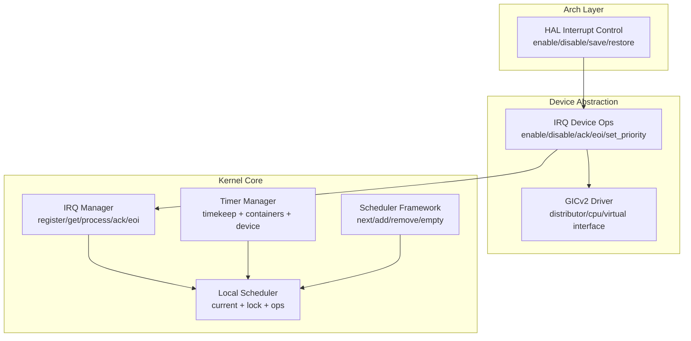
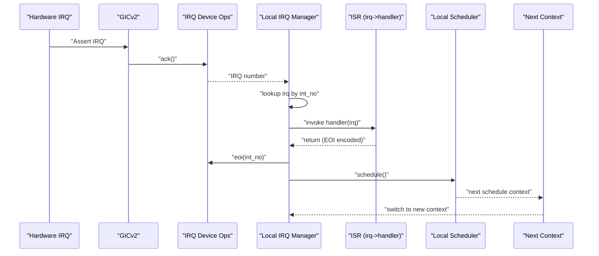
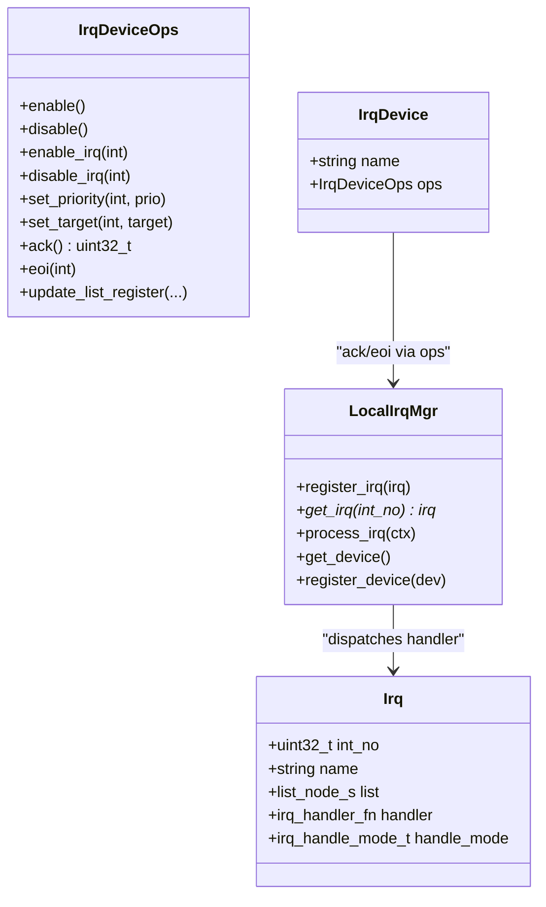
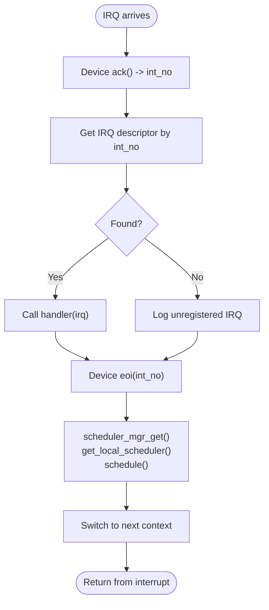
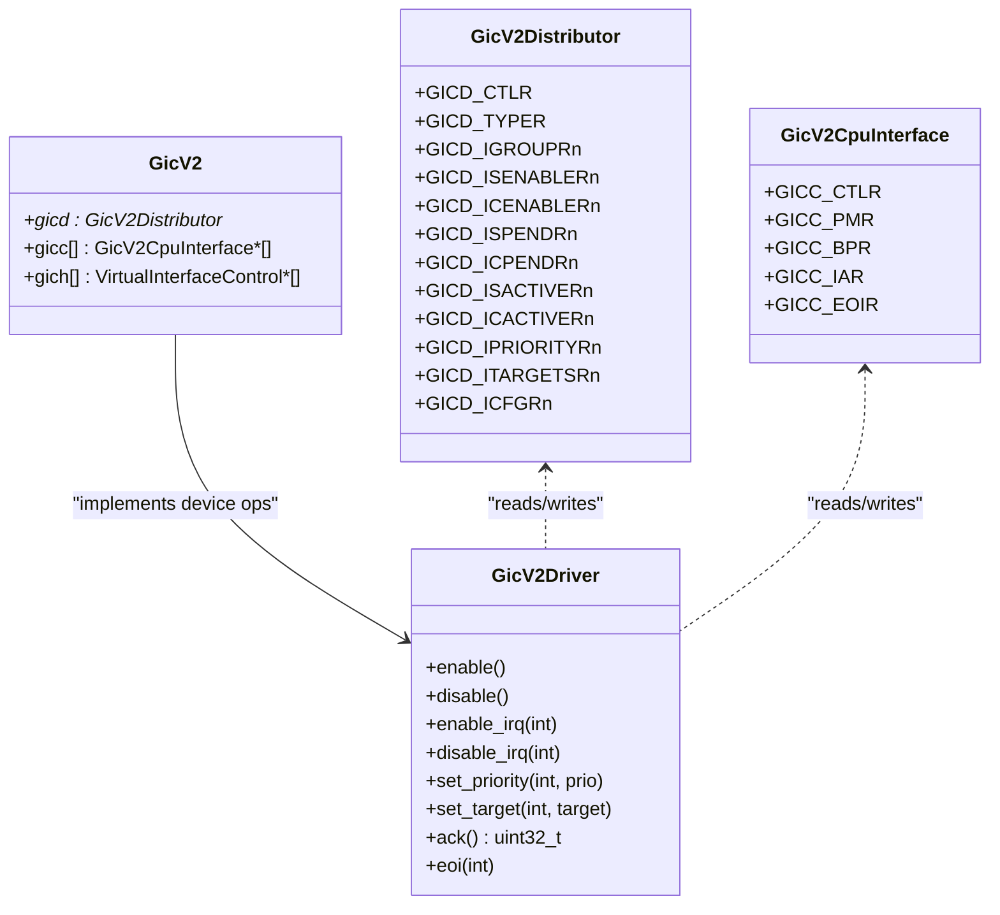
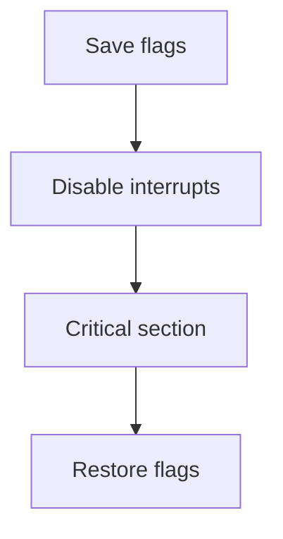
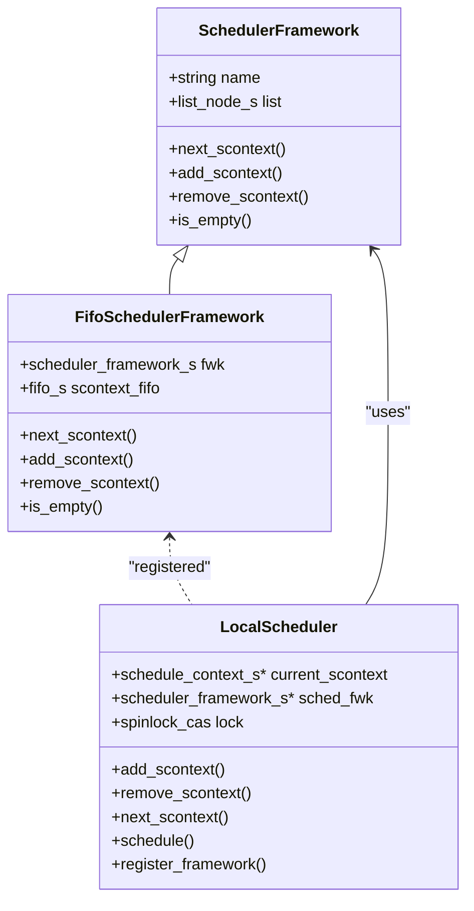
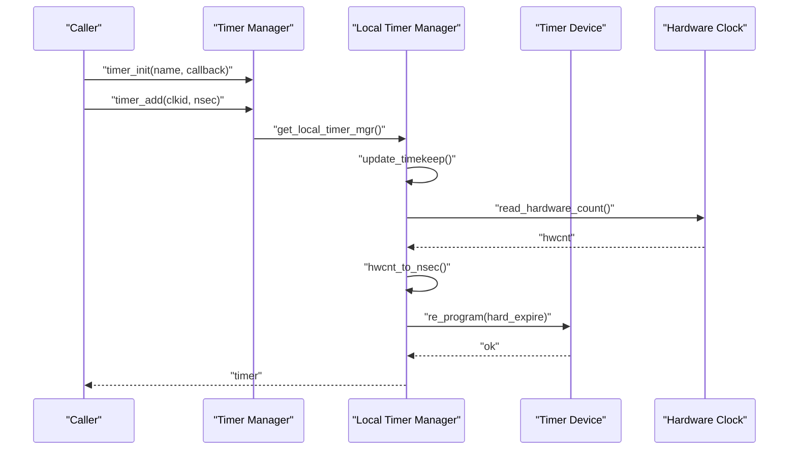
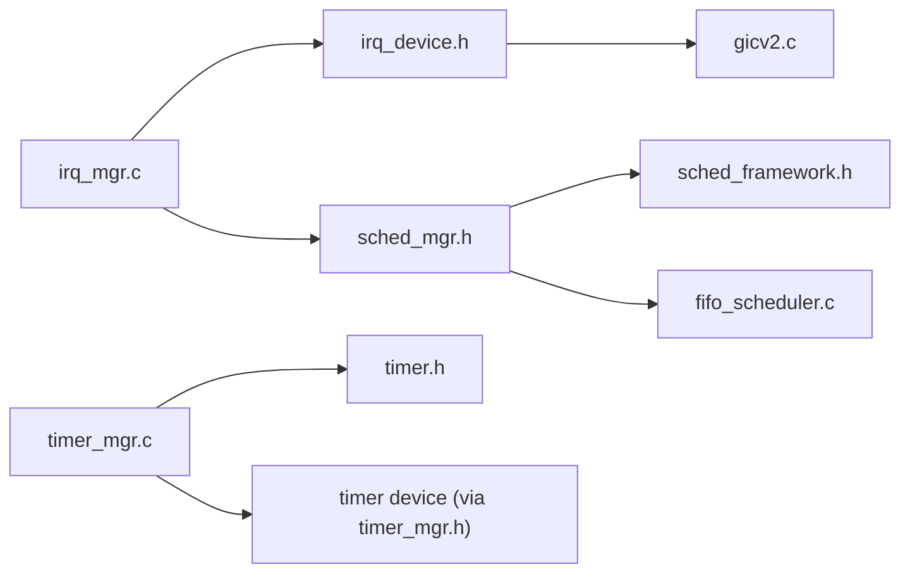

# Interrupt Handling and Scheduling

<cite>
**Referenced Files in This Document**
- [irq.h](file://kernel/include/interrupt/irq.h)
- [irq_mgr.h](file://kernel/include/interrupt/irq_mgr.h)
- [irq_mgr.c](file://kernel/interrupt/irq_mgr.c)
- [irq_device.h](file://kernel/include/interrupt/device/irq_device.h)
- [interrupt.c](file://kernel/arch/arm64/interrupt.c)
- [gicv2.h](file://kernel/drivers/arm-gic/gicv2.h)
- [gicv2.c](file://kernel/drivers/arm-gic/gicv2.c)
- [sched_framework.h](file://kernel/include/scheduler/sched_framework.h)
- [sched_mgr.h](file://kernel/include/scheduler/sched_mgr.h)
- [fifo_scheduler.c](file://kernel/module/sched/fifo_scheduler.c)
- [timer.h](file://kernel/include/timer/timer.h)
- [timer.c](file://kernel/timer/timer.c)
- [timer_mgr.h](file://kernel/include/timer/timer_mgr.h)
- [timer_mgr.c](file://kernel/timer/timer_mgr.c)
</cite>

## Table of Contents
1. [Introduction](#introduction)
2. [Project Structure](#project-structure)
3. [Core Components](#core-components)
4. [Architecture Overview](#architecture-overview)
5. [Detailed Component Analysis](#detailed-component-analysis)
6. [Dependency Analysis](#dependency-analysis)
7. [Performance Considerations](#performance-considerations)
8. [Troubleshooting Guide](#troubleshooting-guide)
9. [Conclusion](#conclusion)

## Introduction
This document explains interrupt handling and scheduling in TranquilOS with a focus on:
- Interrupt management abstraction and routing
- Generic Interrupt Controller (GIC) v2 support
- IRQ manager, priorities, and ISRs
- Scheduler integration with interrupts and timer-based scheduling
- Real-time scheduling capabilities and latency optimization
- Examples of interrupt-driven operations and scheduling decisions

## Project Structure
The interrupt and scheduling subsystem spans several layers:
- Architecture-specific HAL for enabling/disabling interrupts
- Device abstraction for GIC v2
- IRQ manager for registering handlers and dispatching ISRs
- Scheduler framework and FIFO scheduler module
- Timer subsystem for timekeeping and scheduling timers

**Diagram sources**
- [interrupt.c](file://kernel/arch/arm64/interrupt.c#L7-L66)
- [irq_device.h](file://kernel/include/interrupt/device/irq_device.h#L15-L25)
- [gicv2.h](file://kernel/drivers/arm-gic/gicv2.h#L15-L63)
- [gicv2.c](file://kernel/drivers/arm-gic/gicv2.c#L187-L199)
- [irq_mgr.h](file://kernel/include/interrupt/irq_mgr.h#L14-L21)
- [irq_mgr.c](file://kernel/interrupt/irq_mgr.c#L49-L83)
- [sched_framework.h](file://kernel/include/scheduler/sched_framework.h#L11-L18)
- [sched_mgr.h](file://kernel/include/scheduler/sched_mgr.h#L23-L28)
- [timer_mgr.h](file://kernel/include/timer/timer_mgr.h#L22-L32)

**Section sources**
- [irq.h](file://kernel/include/interrupt/irq.h#L8-L35)
- [irq_mgr.h](file://kernel/include/interrupt/irq_mgr.h#L23-L40)
- [irq_mgr.c](file://kernel/interrupt/irq_mgr.c#L13-L83)
- [irq_device.h](file://kernel/include/interrupt/device/irq_device.h#L27-L30)
- [gicv2.h](file://kernel/drivers/arm-gic/gicv2.h#L98-L102)
- [gicv2.c](file://kernel/drivers/arm-gic/gicv2.c#L216-L276)
- [sched_framework.h](file://kernel/include/scheduler/sched_framework.h#L11-L18)
- [sched_mgr.h](file://kernel/include/scheduler/sched_mgr.h#L23-L43)
- [timer_mgr.h](file://kernel/include/timer/timer_mgr.h#L34-L55)

## Core Components
- Interrupt descriptor and handler model
  - Interrupts are represented by a descriptor with number, name, handler, and handle mode.
  - Handler return type encodes EOI signaling.
- IRQ manager
  - Per-CPU local IRQ manager with ops for register/get/process and device binding.
  - Processes an interrupt by acknowledging via the device, invoking the ISR, and signaling EOI.
- GIC v2 driver
  - Provides device ops for enable/disable, enable/disable specific IRQs, set priority/target, acknowledge, and EOI.
  - Registers itself with the IRQ manager.
- Scheduler integration
  - After ISR completion, the IRQ manager queries the local scheduler to decide the next context.
- Timer subsystem
  - Timekeeping and timer containers; timers are scheduled and reprogrammed by the timer manager.

**Section sources**
- [irq.h](file://kernel/include/interrupt/irq.h#L23-L35)
- [irq_mgr.c](file://kernel/interrupt/irq_mgr.c#L13-L83)
- [irq_device.h](file://kernel/include/interrupt/device/irq_device.h#L15-L25)
- [gicv2.c](file://kernel/drivers/arm-gic/gicv2.c#L187-L199)
- [sched_mgr.h](file://kernel/include/scheduler/sched_mgr.h#L30-L43)
- [timer_mgr.c](file://kernel/timer/timer_mgr.c#L84-L95)

## Architecture Overview
The interrupt pipeline integrates hardware, device abstraction, and kernel services:

**Diagram sources**
- [irq_mgr.c](file://kernel/interrupt/irq_mgr.c#L49-L83)
- [irq_device.h](file://kernel/include/interrupt/device/irq_device.h#L12-L13)
- [gicv2.c](file://kernel/drivers/arm-gic/gicv2.c#L179-L185)
- [sched_mgr.h](file://kernel/include/scheduler/sched_mgr.h#L30-L43)

## Detailed Component Analysis

### Interrupt Abstraction and Handler Model
- Interrupt descriptor fields:
  - Number, name, linked-list node, handler function pointer, and handle mode (sync/thread).
- Handler return type encodes EOI signaling for efficient integration with device EOI.
- Handle modes:
  - Synchronous handling executes inline during ISR processing.
  - Threaded handling defers work to a dedicated thread (not shown here; mode selection exists).

**Diagram sources**
- [irq.h](file://kernel/include/interrupt/irq.h#L28-L35)
- [irq_device.h](file://kernel/include/interrupt/device/irq_device.h#L15-L25)
- [irq_mgr.h](file://kernel/include/interrupt/irq_mgr.h#L23-L27)

**Section sources**
- [irq.h](file://kernel/include/interrupt/irq.h#L8-L35)
- [irq_device.h](file://kernel/include/interrupt/device/irq_device.h#L27-L30)
- [irq_mgr.h](file://kernel/include/interrupt/irq_mgr.h#L23-L27)

### IRQ Manager: Registration, Routing, and Dispatch
- Registration:
  - Append interrupt descriptors to a per-CPU linked list keyed by interrupt number.
- Routing:
  - On interrupt, the manager acknowledges via the device, looks up the descriptor, and invokes the handler.
- Completion:
  - Issues EOI to the device and triggers scheduling decisions.
- Scheduling integration:
  - Retrieves local scheduler and switches to the next context returned by schedule.

**Diagram sources**
- [irq_mgr.c](file://kernel/interrupt/irq_mgr.c#L49-L83)

**Section sources**
- [irq_mgr.c](file://kernel/interrupt/irq_mgr.c#L13-L83)

### GIC Controller Support (v2)
- Hardware layout:
  - Distributor registers for enable/pending/active, priority, target, and configuration.
  - CPU interface registers for control, priority mask, binary point, and acknowledge/EOR.
  - Virtual interface control for virtualization scenarios.
- Device ops:
  - Enable/disable controller, enable/disable specific IRQs, set priority/target, acknowledge, and EOI.
- Initialization:
  - Probes device tree nodes, maps registers, initializes state, and registers the device with the IRQ manager.

**Diagram sources**
- [gicv2.h](file://kernel/drivers/arm-gic/gicv2.h#L15-L63)
- [gicv2.h](file://kernel/drivers/arm-gic/gicv2.h#L98-L102)
- [gicv2.c](file://kernel/drivers/arm-gic/gicv2.c#L187-L199)

**Section sources**
- [gicv2.h](file://kernel/drivers/arm-gic/gicv2.h#L15-L63)
- [gicv2.c](file://kernel/drivers/arm-gic/gicv2.c#L216-L276)
- [gicv2.c](file://kernel/drivers/arm-gic/gicv2.c#L187-L199)

### HAL Interrupt Control (ARM64)
- Functions to enable/disable all or specific interrupt classes (normal/fast/system-error/debug).
- Save-and-disable and restore helpers capture processor state flags for safe transitions.

**Diagram sources**
- [interrupt.c](file://kernel/arch/arm64/interrupt.c#L58-L66)

**Section sources**
- [interrupt.c](file://kernel/arch/arm64/interrupt.c#L7-L66)

### Scheduler Integration and Real-Time Scheduling
- Scheduler framework defines the contract for adding/removing/retrieving contexts and checking emptiness.
- Local scheduler maintains current context, a scheduler framework, and a spinlock for thread safety.
- FIFO scheduler module implements a FIFO queue backed by a ring buffer and registers itself with the local scheduler.

**Diagram sources**
- [sched_framework.h](file://kernel/include/scheduler/sched_framework.h#L11-L18)
- [sched_mgr.h](file://kernel/include/scheduler/sched_mgr.h#L23-L28)
- [fifo_scheduler.c](file://kernel/module/sched/fifo_scheduler.c#L13-L16)
- [fifo_scheduler.c](file://kernel/module/sched/fifo_scheduler.c#L85-L109)

**Section sources**
- [sched_framework.h](file://kernel/include/scheduler/sched_framework.h#L11-L18)
- [sched_mgr.h](file://kernel/include/scheduler/sched_mgr.h#L23-L43)
- [fifo_scheduler.c](file://kernel/module/sched/fifo_scheduler.c#L85-L111)

### Timer-Based Scheduling and Real-Time Capabilities
- Timer descriptor:
  - Hard and soft expiration times, clock ID, optional wait context, and handler.
- Timer manager:
  - Maintains timekeeping, tick timer, timer device, and per-clock containers.
  - Adds timers, updates timekeeping from hardware, and reprograms the timer device when earlier than current.
- Example of timer-driven operation:
  - Initialize a timer with a callback, add it to a clock, and rely on the timer manager to reprogram the hardware when appropriate.

**Diagram sources**
- [timer.c](file://kernel/timer/timer.c#L5-L26)
- [timer.c](file://kernel/timer/timer.c#L28-L59)
- [timer_mgr.c](file://kernel/timer/timer_mgr.c#L97-L113)
- [timer_mgr.c](file://kernel/timer/timer_mgr.c#L84-L95)

**Section sources**
- [timer.h](file://kernel/include/timer/timer.h#L23-L50)
- [timer.c](file://kernel/timer/timer.c#L5-L59)
- [timer_mgr.h](file://kernel/include/timer/timer_mgr.h#L34-L41)
- [timer_mgr.c](file://kernel/timer/timer_mgr.c#L164-L185)

## Dependency Analysis
- IRQ manager depends on:
  - IRQ device abstraction for acknowledgment and EOI
  - Scheduler manager/local scheduler for post-ISR scheduling decisions
- GIC v2 driver implements the IRQ device ops and registers with the IRQ manager
- Scheduler framework and FIFO scheduler module integrate via the local scheduler
- Timer manager depends on timer containers and a timer device for reprogramming

**Diagram sources**
- [irq_mgr.c](file://kernel/interrupt/irq_mgr.c#L69-L83)
- [irq_device.h](file://kernel/include/interrupt/device/irq_device.h#L15-L25)
- [gicv2.c](file://kernel/drivers/arm-gic/gicv2.c#L187-L199)
- [sched_mgr.h](file://kernel/include/scheduler/sched_mgr.h#L30-L43)
- [sched_framework.h](file://kernel/include/scheduler/sched_framework.h#L11-L18)
- [fifo_scheduler.c](file://kernel/module/sched/fifo_scheduler.c#L85-L109)
- [timer_mgr.c](file://kernel/timer/timer_mgr.c#L84-L95)
- [timer.h](file://kernel/include/timer/timer.h#L23-L50)

**Section sources**
- [irq_mgr.c](file://kernel/interrupt/irq_mgr.c#L69-L83)
- [gicv2.c](file://kernel/drivers/arm-gic/gicv2.c#L187-L199)
- [sched_mgr.h](file://kernel/include/scheduler/sched_mgr.h#L30-L43)
- [timer_mgr.c](file://kernel/timer/timer_mgr.c#L84-L95)

## Performance Considerations
- Interrupt latency
  - Keep ISRs minimal; offload heavy work to threads or deferred handlers.
  - Use threaded handling mode when available to reduce ISR duration.
- Priority handling
  - Configure GIC priorities to ensure critical interrupts preempt lower-priority ones.
  - Ensure the scheduler respects priority policies if extended beyond FIFO.
- Timer accuracy
  - Re-program the timer device only when a nearer expiration is observed to avoid unnecessary wakeups.
  - Use monotonic clocks for relative delays to prevent drift.
- Locking
  - Local scheduler uses a spinlock; keep critical sections short to minimize contention.

[No sources needed since this section provides general guidance]

## Troubleshooting Guide
- Unregistered IRQ logs
  - The IRQ manager logs when an interrupt number has no registered handler; verify device tree and driver registration.
- Missing device or scheduler
  - The IRQ manager panics if the scheduler manager or local scheduler is uninitialized; ensure early initialization order.
- Timer device missing
  - The timer manager logs when no timer device is present; confirm device probe and registration.
- GIC initialization
  - Verify GIC registers are mapped and initialized; check interrupt count derived from GICD_TYPER.

**Section sources**
- [irq_mgr.c](file://kernel/interrupt/irq_mgr.c#L55-L67)
- [irq_mgr.c](file://kernel/interrupt/irq_mgr.c#L69-L83)
- [timer_mgr.c](file://kernel/timer/timer_mgr.c#L88-L94)
- [gicv2.c](file://kernel/drivers/arm-gic/gicv2.c#L253-L254)

## Conclusion
TranquilOS implements a clean separation between hardware-specific interrupt controllers (GIC v2) and kernel abstractions (IRQ device ops and IRQ manager). Interrupts are acknowledged and dispatched efficiently, with post-ISR scheduling decisions integrated into the local scheduler. The timer subsystem provides robust timekeeping and timer reprogramming for real-time scheduling. Extending to priority-based scheduling and threaded ISR handling would further improve responsiveness and latency characteristics.