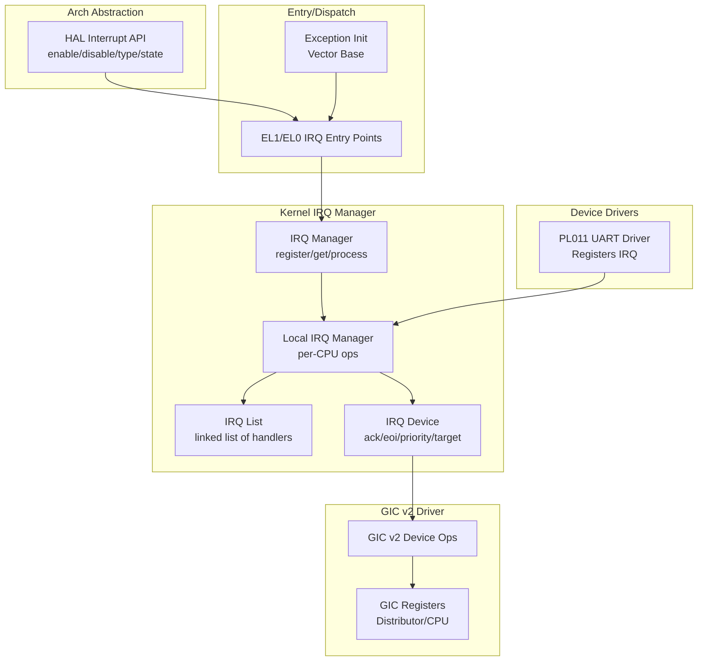
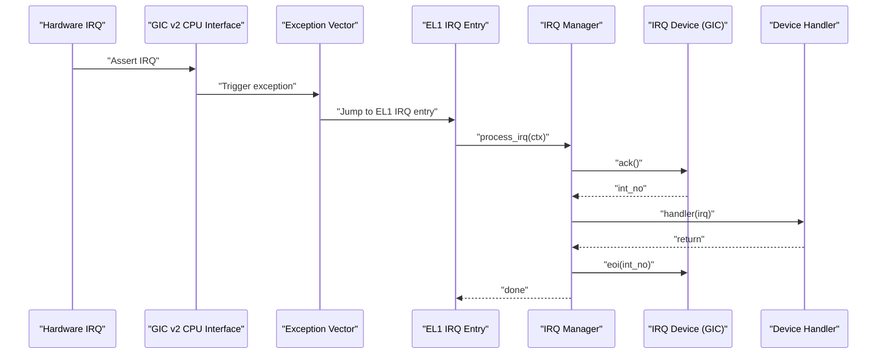
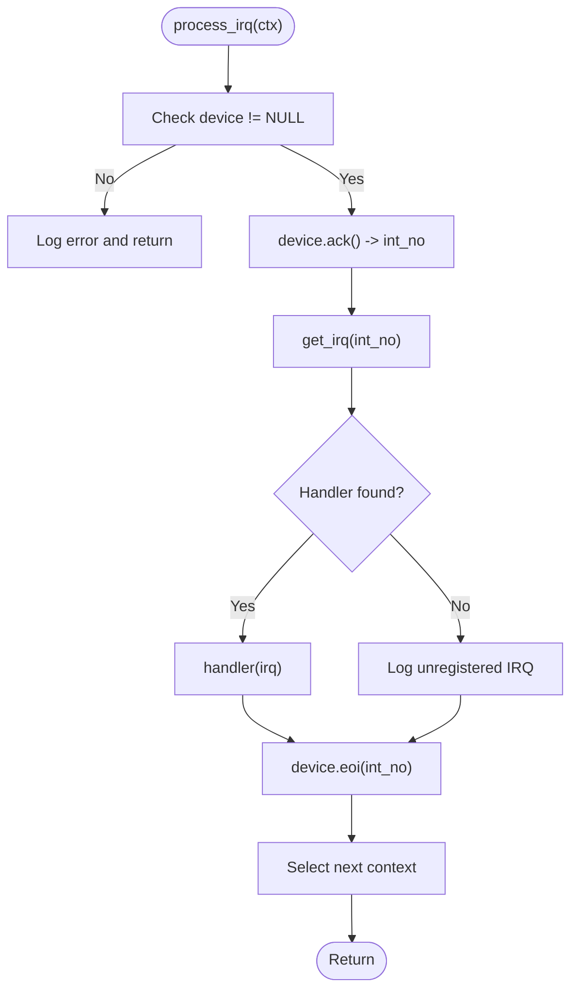
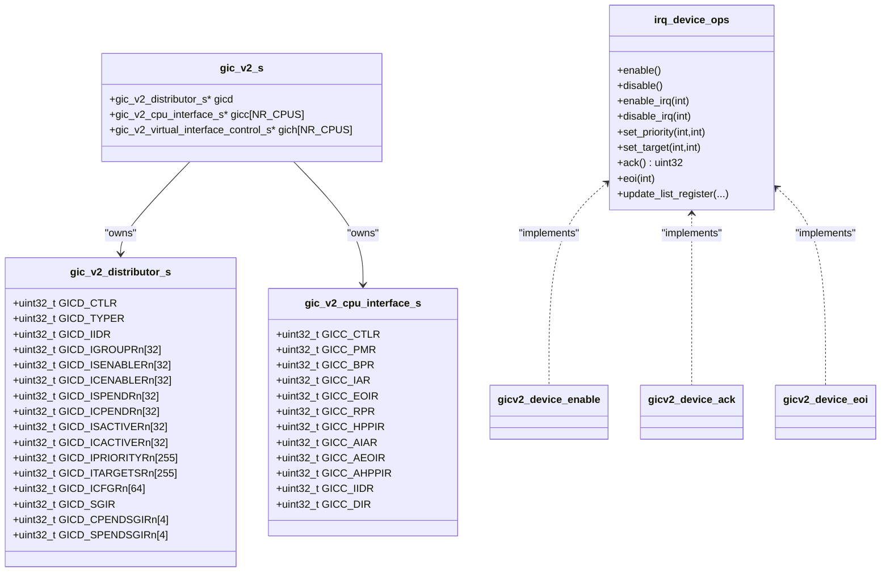
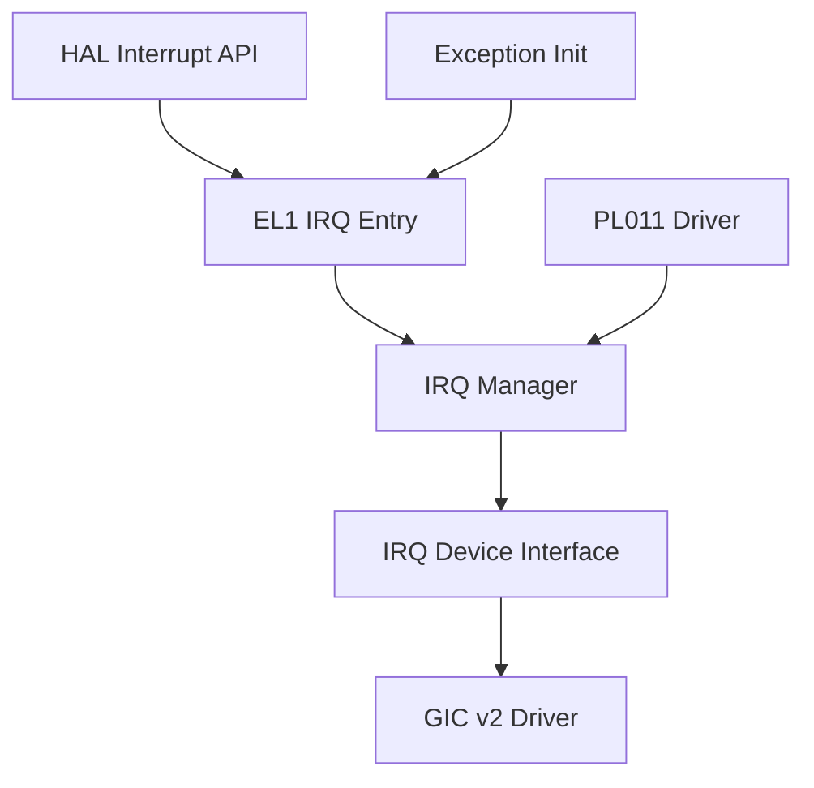

# Interrupt Management System

<cite>
**Referenced Files in This Document**
- [interrupt.c](file://kernel/arch/arm64/interrupt.c)
- [hal_interrupt.h](file://kernel/include/arch/generic/hal_interrupt.h)
- [irq_mgr.h](file://kernel/include/interrupt/irq_mgr.h)
- [irq_mgr.c](file://kernel/interrupt/irq_mgr.c)
- [irq.h](file://kernel/include/interrupt/irq.h)
- [irq_device.h](file://kernel/include/interrupt/device/irq_device.h)
- [gicv2.h](file://kernel/drivers/arm-gic/gicv2.h)
- [gicv2.c](file://kernel/drivers/arm-gic/gicv2.c)
- [centry.c](file://kernel/arch/arm64/entry/centry.c)
- [exception.c](file://kernel/arch/arm64/exception.c)
- [interrupt.h](file://boot/include/arch/arm64/interrupt.h)
- [pl011.c](file://kernel/drivers/arm-uart/pl011.c)
- [cpu.h](file://kernel/include/arch/arm64/cpu.h)
</cite>

## Table of Contents
1. [Introduction](#introduction)
2. [Project Structure](#project-structure)
3. [Core Components](#core-components)
4. [Architecture Overview](#architecture-overview)
5. [Detailed Component Analysis](#detailed-component-analysis)
6. [Dependency Analysis](#dependency-analysis)
7. [Performance Considerations](#performance-considerations)
8. [Troubleshooting Guide](#troubleshooting-guide)
9. [Conclusion](#conclusion)

## Introduction
This document describes the interrupt management system in TranquilOS for the ARM64 architecture. It explains the interrupt handling architecture, the Generic Interrupt Controller (GIC) v2 implementation, and the interrupt routing mechanisms. It documents the IRQ manager functionality, interrupt registration and deregistration processes, and interrupt service routine management. It also details the interrupt priority system, interrupt masking and unmasking operations, and interrupt acknowledgment procedures. Implementation details for device-specific interrupt handlers, interrupt vector tables, and interrupt context preservation are covered. Finally, it addresses interrupt latency optimization, interrupt stacking, and nested interrupt handling, and provides examples of registering custom interrupt handlers and managing interrupt devices.

## Project Structure
The interrupt subsystem spans several layers:
- Architecture abstraction and HAL for enabling/disabling interrupts and saving/restoring processor state
- Kernel IRQ manager that routes interrupts to registered handlers via an IRQ device abstraction
- GIC v2 driver implementing the IRQ device interface for the ARM Generic Interrupt Controller
- Entry points that dispatch interrupts to the IRQ manager
- Device drivers that register their own IRQ handlers

**Diagram sources**
- [interrupt.c](file://kernel/arch/arm64/interrupt.c#L7-L66)
- [irq_mgr.c](file://kernel/interrupt/irq_mgr.c#L13-L142)
- [irq_mgr.h](file://kernel/include/interrupt/irq_mgr.h#L23-L41)
- [irq_device.h](file://kernel/include/interrupt/device/irq_device.h#L15-L31)
- [gicv2.c](file://kernel/drivers/arm-gic/gicv2.c#L153-L214)
- [gicv2.h](file://kernel/drivers/arm-gic/gicv2.h#L15-L102)
- [centry.c](file://kernel/arch/arm64/entry/centry.c#L78-L97)
- [exception.c](file://kernel/arch/arm64/exception.c#L108-L117)
- [pl011.c](file://kernel/drivers/arm-uart/pl011.c#L73-L90)

**Section sources**
- [interrupt.c](file://kernel/arch/arm64/interrupt.c#L1-L66)
- [irq_mgr.c](file://kernel/interrupt/irq_mgr.c#L1-L142)
- [irq_mgr.h](file://kernel/include/interrupt/irq_mgr.h#L1-L46)
- [irq_device.h](file://kernel/include/interrupt/device/irq_device.h#L1-L32)
- [gicv2.c](file://kernel/drivers/arm-gic/gicv2.c#L1-L379)
- [gicv2.h](file://kernel/drivers/arm-gic/gicv2.h#L1-L105)
- [centry.c](file://kernel/arch/arm64/entry/centry.c#L1-L224)
- [exception.c](file://kernel/arch/arm64/exception.c#L1-L119)
- [pl011.c](file://kernel/drivers/arm-uart/pl011.c#L73-L113)

## Core Components
- HAL interrupt control: Provides fine-grained control over interrupt masks (normal, fast, system error, debug) and global enable/disable, plus save-and-disable and restore helpers.
- IRQ manager: Manages per-CPU local IRQ managers, maintains a linked list of registered IRQs, and processes incoming interrupts by acknowledging via the IRQ device, invoking the handler, and signaling end-of-interrupt.
- IRQ device abstraction: Defines the interface for interrupt controllers (enable/disable, enable/disable specific IRQs, set priority/target, acknowledge, end-of-interrupt, and optional list register updates).
- GIC v2 driver: Implements the IRQ device interface for the ARM GIC v2, mapping distributor and CPU interface registers, initializing state, and exposing enable/disable/set priority/target/ack/eoi operations.
- Entry points: EL1 and EL0 entry routines dispatch IRQs to the IRQ manager after switching address spaces.
- Device drivers: Example PL011 UART driver registers its IRQ with the IRQ manager.

**Section sources**
- [hal_interrupt.h](file://kernel/include/arch/generic/hal_interrupt.h#L7-L30)
- [interrupt.c](file://kernel/arch/arm64/interrupt.c#L7-L66)
- [irq_mgr.h](file://kernel/include/interrupt/irq_mgr.h#L14-L41)
- [irq_mgr.c](file://kernel/interrupt/irq_mgr.c#L13-L83)
- [irq_device.h](file://kernel/include/interrupt/device/irq_device.h#L15-L31)
- [gicv2.c](file://kernel/drivers/arm-gic/gicv2.c#L153-L214)
- [centry.c](file://kernel/arch/arm64/entry/centry.c#L78-L97)
- [pl011.c](file://kernel/drivers/arm-uart/pl011.c#L73-L90)

## Architecture Overview
The interrupt pipeline follows a layered design:
- Hardware raises an interrupt to the GIC v2 CPU interface.
- The kernel’s exception vector writes the interrupt to the appropriate exception level entry.
- The entry routine switches to kernel address space and invokes the IRQ manager.
- The IRQ manager acknowledges the interrupt via the IRQ device, retrieves the registered handler, executes it, and signals end-of-interrupt.
- The scheduler may be invoked to select the next thread context.

**Diagram sources**
- [centry.c](file://kernel/arch/arm64/entry/centry.c#L78-L97)
- [irq_mgr.c](file://kernel/interrupt/irq_mgr.c#L49-L83)
- [gicv2.c](file://kernel/drivers/arm-gic/gicv2.c#L179-L185)

## Detailed Component Analysis

### HAL Interrupt Control (ARM64)
The HAL provides:
- Global enable/disable for normal/fast/system-error/debug interrupt masks
- Query current interrupt mask state
- Save-and-disable and restore helpers for atomic critical sections

Implementation notes:
- Uses system register accessors to read/write DAIF (Disable All/IRQ/FIQ/SERROR bits).
- Inline assembly ensures memory barriers and correct register semantics.

Key APIs:
- Enable/disable all
- Enable/disable by type
- Query enabled state
- Save-and-disable and restore

**Section sources**
- [interrupt.c](file://kernel/arch/arm64/interrupt.c#L7-L66)
- [hal_interrupt.h](file://kernel/include/arch/generic/hal_interrupt.h#L14-L28)
- [interrupt.h](file://boot/include/arch/arm64/interrupt.h#L8-L46)

### IRQ Manager and Local IRQ Manager
Responsibilities:
- Per-CPU initialization of local IRQ manager operations
- Registration of IRQ descriptors into a linked list
- Retrieval of IRQ descriptor by interrupt number
- Dispatch of IRQs: acknowledge, invoke handler, end-of-interrupt, and scheduling decisions

Processing flow:
- Acknowledge via device ops
- Lookup handler by interrupt number
- Invoke handler
- End-of-interrupt via device ops
- Schedule next context if applicable

**Diagram sources**
- [irq_mgr.c](file://kernel/interrupt/irq_mgr.c#L49-L83)

**Section sources**
- [irq_mgr.h](file://kernel/include/interrupt/irq_mgr.h#L23-L41)
- [irq_mgr.c](file://kernel/interrupt/irq_mgr.c#L13-L83)

### IRQ Descriptor and Handler Model
- IRQ descriptor holds interrupt number, name, linkage, handler function pointer, and handle mode (sync/thread).
- Handlers return a small structure indicating whether the IRQ should be acknowledged and other flags.

Key fields:
- int_no: hardware interrupt number
- name: human-readable name
- list: embedded list node for chaining
- handler: function pointer invoked during dispatch
- handle_mode: synchronous or threaded handling mode

**Section sources**
- [irq.h](file://kernel/include/interrupt/irq.h#L23-L35)

### IRQ Device Abstraction
Defines the interface that all interrupt controllers must implement:
- enable/disable controller
- enable/disable specific IRQs
- set priority and target
- acknowledge and end-of-interrupt
- optional update of list registers for virtualized environments

This abstraction allows the IRQ manager to remain agnostic of the underlying controller.

**Section sources**
- [irq_device.h](file://kernel/include/interrupt/device/irq_device.h#L15-L31)

### GIC v2 Driver (Distributor and CPU Interface)
The GIC v2 driver implements the IRQ device interface and manages:
- Distributor registers: enable/disable, pending, active, priority, target, and configuration
- CPU interface registers: control, priority mask, binary point, interrupt acknowledge, end-of-interrupt, and list registers
- Initialization sequences for both per-core CPU interface and system-wide distributor
- Mapping of physical addresses from device tree nodes

Initialization highlights:
- Probe function maps GICD and GICC/GICH registers based on device tree address
- Disables controller, clears pending/active bits, sets defaults for priorities and targets
- Registers the GIC device with the IRQ manager

Operations exposed:
- enable/disable controller
- enable/disable specific IRQ
- set priority and target
- acknowledge and end-of-interrupt
- Optional list register update for virtualization

**Diagram sources**
- [gicv2.h](file://kernel/drivers/arm-gic/gicv2.h#L15-L102)
- [gicv2.c](file://kernel/drivers/arm-gic/gicv2.c#L153-L214)

**Section sources**
- [gicv2.h](file://kernel/drivers/arm-gic/gicv2.h#L15-L102)
- [gicv2.c](file://kernel/drivers/arm-gic/gicv2.c#L216-L379)

### Entry Points and Vector Table
- Exception vector base is initialized to point to the ARM64 exception table.
- EL1 IRQ entry saves/restores context, switches address spaces, and delegates to the IRQ manager.
- EL0 IRQ entry performs similar steps for lower exception levels.

Context preservation:
- Entry routines preserve and restore address space contexts around interrupt processing.
- The ARM64 CPU context structure defines the layout of saved registers.

**Section sources**
- [exception.c](file://kernel/arch/arm64/exception.c#L108-L117)
- [centry.c](file://kernel/arch/arm64/entry/centry.c#L78-L97)
- [cpu.h](file://kernel/include/arch/arm64/cpu.h#L85-L93)

### Device-Specific Handler Registration (Example: PL011 UART)
- The PL011 driver registers its IRQ with the IRQ manager after probing the device.
- The IRQ manager stores the handler in a per-CPU linked list keyed by interrupt number.
- On interrupt, the manager retrieves the handler and invokes it.

Registration flow:
- Probe reads device address from device tree
- Initialize device registers
- Register IRQ with local IRQ manager

**Section sources**
- [pl011.c](file://kernel/drivers/arm-uart/pl011.c#L73-L113)
- [irq_mgr.c](file://kernel/interrupt/irq_mgr.c#L13-L28)

## Dependency Analysis
The IRQ subsystem exhibits clean separation of concerns:
- HAL depends on architecture-specific registers and inline assembly
- IRQ manager depends on HAL CPU identification and scheduler interfaces
- GIC v2 driver depends on device tree and memory-mapped register access
- Entry points depend on exception handling and address space switching
- Device drivers depend on the IRQ manager for handler registration

**Diagram sources**
- [interrupt.c](file://kernel/arch/arm64/interrupt.c#L7-L66)
- [centry.c](file://kernel/arch/arm64/entry/centry.c#L78-L97)
- [irq_mgr.c](file://kernel/interrupt/irq_mgr.c#L105-L127)
- [gicv2.c](file://kernel/drivers/arm-gic/gicv2.c#L153-L214)
- [pl011.c](file://kernel/drivers/arm-uart/pl011.c#L73-L90)
- [exception.c](file://kernel/arch/arm64/exception.c#L108-L117)

**Section sources**
- [irq_mgr.c](file://kernel/interrupt/irq_mgr.c#L105-L142)
- [gicv2.c](file://kernel/drivers/arm-gic/gicv2.c#L153-L214)
- [centry.c](file://kernel/arch/arm64/entry/centry.c#L78-L97)

## Performance Considerations
- Minimize work inside interrupt handlers; defer heavy processing to threads or queued tasks.
- Use targeted enable/disable for specific IRQs rather than global disables to reduce latency.
- Keep handler chains short and avoid unnecessary logging in ISR context.
- Ensure proper priority configuration to prevent preemption storms.
- Use the scheduler integration to yield promptly after handling to maintain responsiveness.

## Troubleshooting Guide
Common issues and diagnostics:
- Unregistered IRQ: The IRQ manager logs an error when no handler is found for an interrupt number.
- Missing device: If the IRQ device is not registered, processing aborts early.
- GIC initialization: Verify that GIC registers are mapped and initialized correctly; check enable/disable and priority/target settings.
- Entry point failures: Confirm exception vector base is set and aligned, and that entry routines switch address spaces properly.

Operational checks:
- Validate that the IRQ manager is initialized per CPU and that local IRQ manager ops are installed.
- Ensure device drivers register their IRQs after device probe completes.
- Confirm that handlers return appropriately and that EOI is reached.

**Section sources**
- [irq_mgr.c](file://kernel/interrupt/irq_mgr.c#L49-L83)
- [gicv2.c](file://kernel/drivers/arm-gic/gicv2.c#L216-L276)
- [exception.c](file://kernel/arch/arm64/exception.c#L108-L117)

## Conclusion
TranquilOS implements a modular interrupt management system centered on a HAL abstraction, a per-CPU IRQ manager, and a device-agnostic IRQ device interface. The GIC v2 driver provides robust controller functionality, while entry points and exception handling ensure safe and efficient dispatch. Device drivers integrate seamlessly by registering IRQ handlers through the IRQ manager. The design supports fine-grained control over interrupt masking, priority configuration, and acknowledgment, enabling predictable latency and scalability across cores.