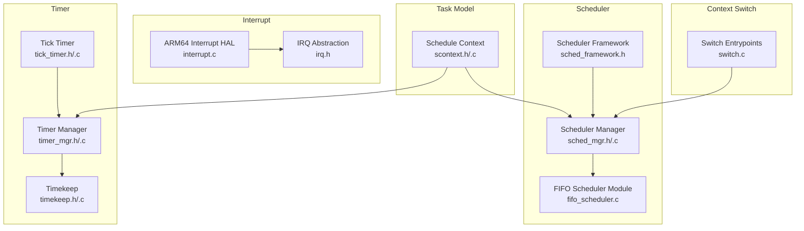
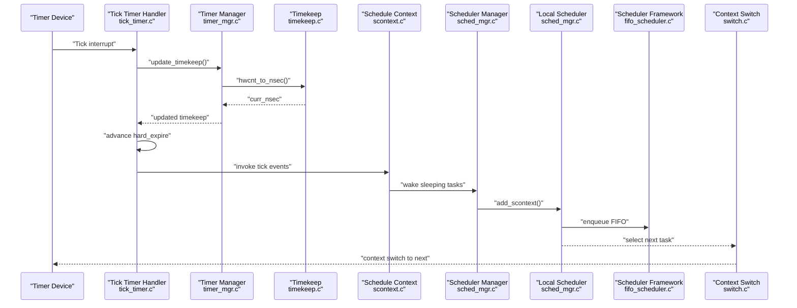
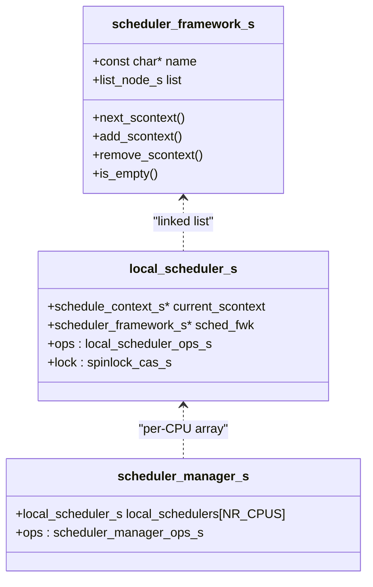
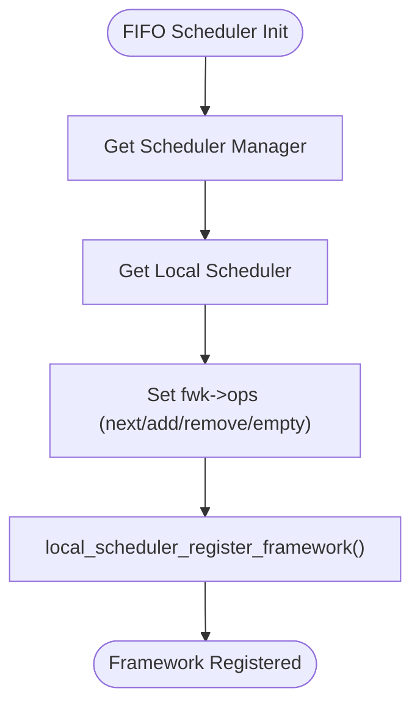
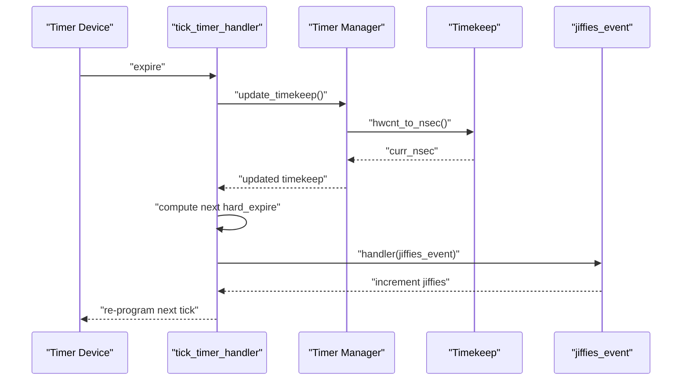
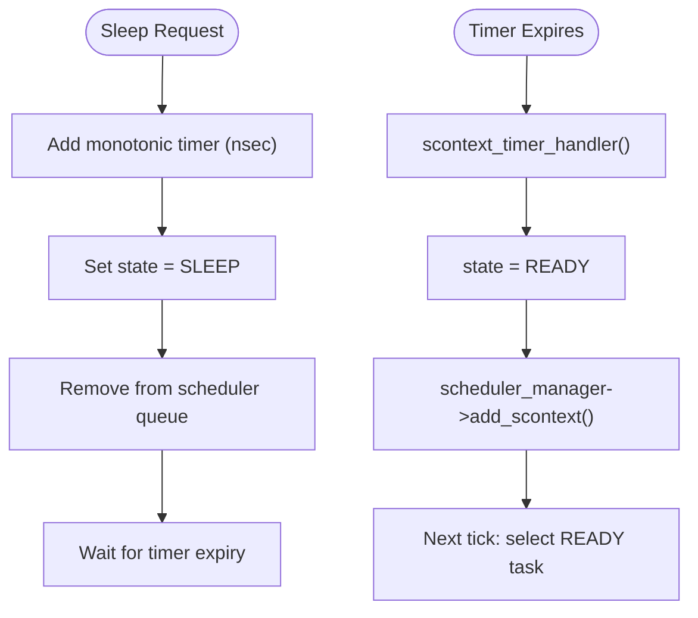
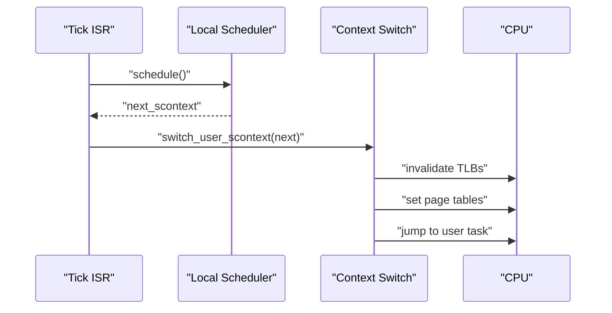
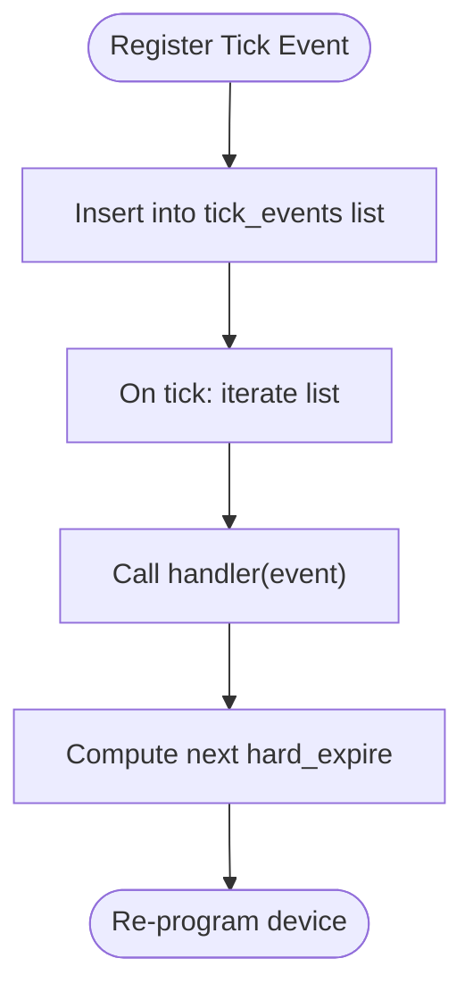
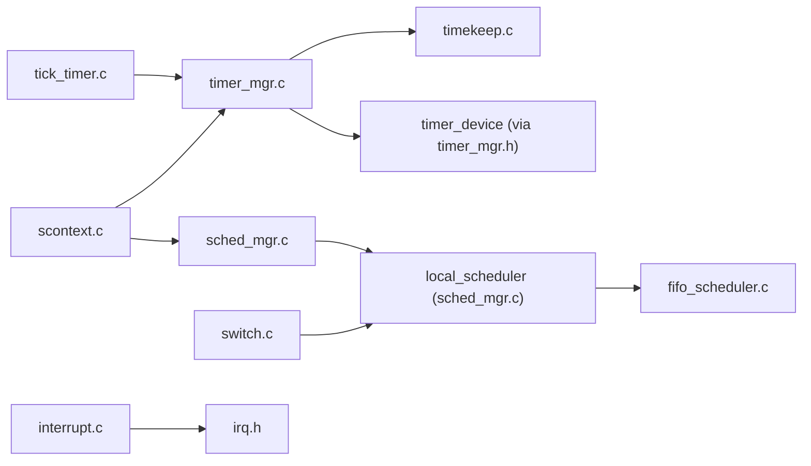

# Scheduler Integration and Time Management

<cite>
**Referenced Files in This Document**
- [sched_framework.h](file://kernel/include/scheduler/sched_framework.h)
- [sched_mgr.h](file://kernel/include/scheduler/sched_mgr.h)
- [sched_mgr.c](file://kernel/schedule/sched_mgr.c)
- [fifo_scheduler.c](file://kernel/module/sched/fifo_scheduler.c)
- [tick_timer.h](file://kernel/include/timer/tick_timer.h)
- [tick_timer.c](file://kernel/timer/tick_timer.c)
- [timer_mgr.h](file://kernel/include/timer/timer_mgr.h)
- [timer_mgr.c](file://kernel/timer/timer_mgr.c)
- [timekeep.h](file://kernel/include/timer/timekeep.h)
- [timekeep.c](file://kernel/timer/timekeep.c)
- [scontext.h](file://kernel/include/scontext/scontext.h)
- [scontext.c](file://kernel/context/scontext.c)
- [interrupt.h](file://kernel/include/interrupt/irq.h)
- [interrupt.c](file://kernel/arch/arm64/interrupt.c)
- [switch.c](file://kernel/switch.c)
- [cap_timer.h](file://kernel/include/capability/cap_timer.h)
</cite>

## Table of Contents
1. [Introduction](#introduction)
2. [Project Structure](#project-structure)
3. [Core Components](#core-components)
4. [Architecture Overview](#architecture-overview)
5. [Detailed Component Analysis](#detailed-component-analysis)
6. [Dependency Analysis](#dependency-analysis)
7. [Performance Considerations](#performance-considerations)
8. [Troubleshooting Guide](#troubleshooting-guide)
9. [Conclusion](#conclusion)

## Introduction
This document explains how TranquilOS integrates the scheduler with interrupt handling and time management. It covers how timer interrupts drive scheduler decisions, how context switching is performed, and how preemptive scheduling is realized. It also documents the scheduler manager, FIFO scheduling framework, tick timer implementation, timekeeping mechanisms, sleep/wake operations, and deadline management. Finally, it addresses performance optimization, load balancing, fairness, and the relationship between interrupt latency and scheduling responsiveness.

## Project Structure
The scheduler and time management subsystems are organized around modular components:
- Scheduler framework and manager define the abstraction for per-CPU schedulers and task queues.
- Timer subsystem provides tick timers, timekeeping, and timer containers.
- Schedule contexts represent tasks and their sleep/deadline timers.
- Interrupt handling enables low-level control of CPU interrupt masks and state.
- Context switching bridges the scheduler’s selection with hardware context switches.

**Diagram sources**
- [sched_framework.h](file://kernel/include/scheduler/sched_framework.h#L1-L20)
- [sched_mgr.h](file://kernel/include/scheduler/sched_mgr.h#L1-L49)
- [sched_mgr.c](file://kernel/schedule/sched_mgr.c#L1-L167)
- [fifo_scheduler.c](file://kernel/module/sched/fifo_scheduler.c#L1-L111)
- [tick_timer.h](file://kernel/include/timer/tick_timer.h#L1-L37)
- [tick_timer.c](file://kernel/timer/tick_timer.c#L1-L148)
- [timer_mgr.h](file://kernel/include/timer/timer_mgr.h#L1-L62)
- [timer_mgr.c](file://kernel/timer/timer_mgr.c#L1-L208)
- [timekeep.h](file://kernel/include/timer/timekeep.h#L1-L27)
- [timekeep.c](file://kernel/timer/timekeep.c#L1-L17)
- [scontext.h](file://kernel/include/scontext/scontext.h#L1-L49)
- [scontext.c](file://kernel/context/scontext.c#L1-L68)
- [interrupt.h](file://kernel/include/interrupt/irq.h#L1-L38)
- [interrupt.c](file://kernel/arch/arm64/interrupt.c#L1-L66)
- [switch.c](file://kernel/switch.c#L1-L29)

**Section sources**
- [sched_framework.h](file://kernel/include/scheduler/sched_framework.h#L1-L20)
- [sched_mgr.h](file://kernel/include/scheduler/sched_mgr.h#L1-L49)
- [sched_mgr.c](file://kernel/schedule/sched_mgr.c#L1-L167)
- [fifo_scheduler.c](file://kernel/module/sched/fifo_scheduler.c#L1-L111)
- [tick_timer.h](file://kernel/include/timer/tick_timer.h#L1-L37)
- [tick_timer.c](file://kernel/timer/tick_timer.c#L1-L148)
- [timer_mgr.h](file://kernel/include/timer/timer_mgr.h#L1-L62)
- [timer_mgr.c](file://kernel/timer/timer_mgr.c#L1-L208)
- [timekeep.h](file://kernel/include/timer/timekeep.h#L1-L27)
- [timekeep.c](file://kernel/timer/timekeep.c#L1-L17)
- [scontext.h](file://kernel/include/scontext/scontext.h#L1-L49)
- [scontext.c](file://kernel/context/scontext.c#L1-L68)
- [interrupt.h](file://kernel/include/interrupt/irq.h#L1-L38)
- [interrupt.c](file://kernel/arch/arm64/interrupt.c#L1-L66)
- [switch.c](file://kernel/switch.c#L1-L29)

## Core Components
- Scheduler Framework: Defines function pointers for adding/removing tasks, selecting the next task, and checking emptiness. It encapsulates the scheduling policy interface.
- Local Scheduler: Per-CPU scheduler instance holding current task pointer, a linked list of frameworks, and operation vtable. It serializes access via a spinlock.
- Scheduler Manager: Global coordinator that initializes per-CPU schedulers, routes tasks to target CPUs based on affinity, and exposes registration of scheduling frameworks.
- FIFO Scheduler Module: Implements a FIFO queue for ready tasks and registers itself with the local scheduler.
- Tick Timer: Periodic timer that triggers at a fixed frequency (jiffies), updates timekeeping, and dispatches registered tick events.
- Timer Manager: Manages per-CPU timer containers, timekeeping, and timer device programming. It selects the nearest timer to reprogram the hardware.
- Timekeep: Provides conversion between hardware counts and nanoseconds, maintaining frequency and GCD-derived scaling factors.
- Schedule Context: Represents a task with state, address space, capability node, CPU context, and a sleep timer. Sleep/wake transitions are mediated by timer callbacks.
- Interrupt HAL: ARM64-specific helpers to enable/disable various interrupt classes and save/restore interrupt state.
- Context Switch: Performs user-mode context switch, updates TLBs, sets page tables, and transfers control to the next task.

**Section sources**
- [sched_framework.h](file://kernel/include/scheduler/sched_framework.h#L6-L18)
- [sched_mgr.h](file://kernel/include/scheduler/sched_mgr.h#L23-L43)
- [sched_mgr.c](file://kernel/schedule/sched_mgr.c#L6-L87)
- [fifo_scheduler.c](file://kernel/module/sched/fifo_scheduler.c#L13-L109)
- [tick_timer.h](file://kernel/include/timer/tick_timer.h#L10-L26)
- [tick_timer.c](file://kernel/timer/tick_timer.c#L23-L107)
- [timer_mgr.h](file://kernel/include/timer/timer_mgr.h#L34-L55)
- [timer_mgr.c](file://kernel/timer/timer_mgr.c#L97-L113)
- [timekeep.h](file://kernel/include/timer/timekeep.h#L14-L23)
- [timekeep.c](file://kernel/timer/timekeep.c#L13-L17)
- [scontext.h](file://kernel/include/scontext/scontext.h#L22-L43)
- [scontext.c](file://kernel/context/scontext.c#L9-L30)
- [interrupt.c](file://kernel/arch/arm64/interrupt.c#L7-L66)
- [switch.c](file://kernel/switch.c#L8-L29)

## Architecture Overview
The scheduler integrates with the timer subsystem through periodic tick interrupts. The tick timer schedules recurring events, updates timekeeping, and triggers handlers that may cause scheduler decisions. Schedule contexts can sleep on timers; upon expiration, they are moved to READY and re-enter the scheduler’s queue. The scheduler selects the next task and the context switch routine performs the actual transfer.

**Diagram sources**
- [tick_timer.c](file://kernel/timer/tick_timer.c#L77-L107)
- [timer_mgr.c](file://kernel/timer/timer_mgr.c#L97-L113)
- [timekeep.c](file://kernel/timer/timekeep.c#L8-L11)
- [scontext.c](file://kernel/context/scontext.c#L9-L30)
- [sched_mgr.c](file://kernel/schedule/sched_mgr.c#L6-L87)
- [fifo_scheduler.c](file://kernel/module/sched/fifo_scheduler.c#L18-L52)
- [switch.c](file://kernel/switch.c#L24-L29)

## Detailed Component Analysis

### Scheduler Framework and Manager
- Framework abstraction: Provides function pointers for next, add, remove, and empty checks. This allows pluggable policies (e.g., FIFO).
- Local scheduler: Holds current task, a head of the framework list, and a spinlock. It forwards operations to the active framework chain.
- Scheduler manager: Initializes per-CPU schedulers, registers frameworks, and routes tasks to a target CPU based on affinity bits.

**Diagram sources**
- [sched_framework.h](file://kernel/include/scheduler/sched_framework.h#L11-L18)
- [sched_mgr.h](file://kernel/include/scheduler/sched_mgr.h#L23-L43)

**Section sources**
- [sched_framework.h](file://kernel/include/scheduler/sched_framework.h#L6-L18)
- [sched_mgr.h](file://kernel/include/scheduler/sched_mgr.h#L8-L43)
- [sched_mgr.c](file://kernel/schedule/sched_mgr.c#L89-L129)

### FIFO Scheduler Implementation
- FIFO scheduler wraps a FIFO queue and registers its operations with the local scheduler.
- It implements next, add, remove, and empty checks using the underlying FIFO container.
- Registration occurs during per-CPU initialization, linking the framework into the local scheduler.

**Diagram sources**
- [fifo_scheduler.c](file://kernel/module/sched/fifo_scheduler.c#L87-L109)

**Section sources**
- [fifo_scheduler.c](file://kernel/module/sched/fifo_scheduler.c#L13-L109)

### Tick Timer and Timekeeping
- Tick timer runs at a fixed rate (jiffies) and updates timekeeping on each tick.
- It reprograms the hardware timer to fire again after a computed interval.
- Tick events are dispatched synchronously; jiffies increment is one such event.

**Diagram sources**
- [tick_timer.c](file://kernel/timer/tick_timer.c#L77-L107)
- [timer_mgr.c](file://kernel/timer/timer_mgr.c#L97-L113)
- [timekeep.c](file://kernel/timer/timekeep.c#L8-L11)

**Section sources**
- [tick_timer.h](file://kernel/include/timer/tick_timer.h#L8-L26)
- [tick_timer.c](file://kernel/timer/tick_timer.c#L23-L107)
- [timer_mgr.h](file://kernel/include/timer/timer_mgr.h#L34-L55)
- [timer_mgr.c](file://kernel/timer/timer_mgr.c#L155-L157)
- [timekeep.h](file://kernel/include/timer/timekeep.h#L14-L23)
- [timekeep.c](file://kernel/timer/timekeep.c#L13-L17)

### Sleep/Wake Operations and Deadline Management
- Schedule contexts maintain a sleep timer backed by a red-black tree container.
- Sleeping transitions a task to SLEEP and removes it from the scheduler queue.
- On timer expiration, the callback marks the task READY and enqueues it via the scheduler manager.

**Diagram sources**
- [scontext.c](file://kernel/context/scontext.c#L47-L68)
- [scontext.c](file://kernel/context/scontext.c#L9-L30)
- [scontext.h](file://kernel/include/scontext/scontext.h#L37-L38)
- [sched_mgr.c](file://kernel/schedule/sched_mgr.c#L131-L147)

**Section sources**
- [scontext.h](file://kernel/include/scontext/scontext.h#L22-L43)
- [scontext.c](file://kernel/context/scontext.c#L9-L30)
- [scontext.c](file://kernel/context/scontext.c#L47-L68)

### Preemptive Scheduling and Context Switching
- Preemption occurs when the tick timer expires and the scheduler selects a new task.
- The selected task is switched into user mode with updated page tables and TLB invalidation.
- Interrupt control is managed via HAL routines to ensure safe transitions.

**Diagram sources**
- [tick_timer.c](file://kernel/timer/tick_timer.c#L77-L107)
- [sched_mgr.c](file://kernel/schedule/sched_mgr.c#L74-L87)
- [switch.c](file://kernel/switch.c#L24-L29)
- [interrupt.c](file://kernel/arch/arm64/interrupt.c#L58-L66)

**Section sources**
- [tick_timer.c](file://kernel/timer/tick_timer.c#L77-L107)
- [sched_mgr.c](file://kernel/schedule/sched_mgr.c#L74-L87)
- [switch.c](file://kernel/switch.c#L8-L29)
- [interrupt.c](file://kernel/arch/arm64/interrupt.c#L7-L66)

### Timer-Based Scheduling Hooks
- Tick events can be registered to perform periodic work synchronized with the tick rate.
- Handlers receive the tick event and can trigger scheduler actions (e.g., updating jiffies).
- The tick timer re-arms itself based on the current time plus a computed interval.

**Diagram sources**
- [tick_timer.h](file://kernel/include/timer/tick_timer.h#L15-L21)
- [tick_timer.c](file://kernel/timer/tick_timer.c#L56-L107)

**Section sources**
- [tick_timer.h](file://kernel/include/timer/tick_timer.h#L15-L21)
- [tick_timer.c](file://kernel/timer/tick_timer.c#L56-L107)

### Interrupt Latency and Scheduling Responsiveness
- Interrupt latency is influenced by the interrupt mask state and the time spent in ISRs.
- The HAL provides fine-grained control to enable/disable specific interrupt classes, minimizing ISR overhead.
- Responsiveness improves when tick intervals are short and timer device reprogramming is efficient.

**Section sources**
- [interrupt.h](file://kernel/include/interrupt/irq.h#L23-L26)
- [interrupt.c](file://kernel/arch/arm64/interrupt.c#L15-L47)
- [tick_timer.c](file://kernel/timer/tick_timer.c#L82-L84)

## Dependency Analysis
The following diagram shows key dependencies among components involved in scheduler-interrupt-time management.

**Diagram sources**
- [tick_timer.c](file://kernel/timer/tick_timer.c#L1-L148)
- [timer_mgr.c](file://kernel/timer/timer_mgr.c#L1-L208)
- [timekeep.c](file://kernel/timer/timekeep.c#L1-L17)
- [scontext.c](file://kernel/context/scontext.c#L1-L68)
- [sched_mgr.c](file://kernel/schedule/sched_mgr.c#L1-L167)
- [fifo_scheduler.c](file://kernel/module/sched/fifo_scheduler.c#L1-L111)
- [switch.c](file://kernel/switch.c#L1-L29)
- [interrupt.c](file://kernel/arch/arm64/interrupt.c#L1-L66)
- [irq.h](file://kernel/include/interrupt/irq.h#L1-L38)

**Section sources**
- [tick_timer.c](file://kernel/timer/tick_timer.c#L1-L148)
- [timer_mgr.c](file://kernel/timer/timer_mgr.c#L1-L208)
- [timekeep.c](file://kernel/timer/timekeep.c#L1-L17)
- [scontext.c](file://kernel/context/scontext.c#L1-L68)
- [sched_mgr.c](file://kernel/schedule/sched_mgr.c#L1-L167)
- [fifo_scheduler.c](file://kernel/module/sched/fifo_scheduler.c#L1-L111)
- [switch.c](file://kernel/switch.c#L1-L29)
- [interrupt.c](file://kernel/arch/arm64/interrupt.c#L1-L66)
- [irq.h](file://kernel/include/interrupt/irq.h#L1-L38)

## Performance Considerations
- Tick frequency: A higher tick rate reduces latency but increases overhead. The jiffies rate is fixed and balances responsiveness and cost.
- Timer device reprogramming: Minimizing reprogramming frequency and ensuring the nearest timer is chosen reduces CPU wake-ups.
- Queue operations: FIFO enqueue/dequeue should be O(1); ensure the underlying container supports constant-time operations.
- Lock contention: The local scheduler uses a spinlock; keep critical sections small and avoid blocking in ISRs.
- TLB invalidation: Performing targeted invalidation when switching address spaces reduces overhead.
- Load balancing: The current implementation assigns tasks based on affinity bits. Extending to dynamic load balancing can improve fairness under heterogeneous workloads.
- Fairness: FIFO does not provide preemption on priority; introducing priority queues or time slices can enhance fairness for multiple priorities.

[No sources needed since this section provides general guidance]

## Troubleshooting Guide
- No scheduler framework registered: The local scheduler requires a framework; ensure the FIFO module initializes and registers with the local scheduler.
- NULL scheduler manager/local scheduler: Initialization order matters; verify scheduler manager initialization before per-CPU initialization.
- Task remains blocked: If a task fails to wake, check that the sleep timer was added and the callback transitions the state to READY and enqueues the task.
- Tick timer not firing: Verify timer device enablement and that the tick timer is added to the local timer manager and reprogrammed after each tick.
- Interrupt latency spikes: Confirm that ISRs disable only necessary interrupts and restore state promptly; excessive ISR duration can delay tick handling.

**Section sources**
- [sched_mgr.c](file://kernel/schedule/sched_mgr.c#L14-L28)
- [fifo_scheduler.c](file://kernel/module/sched/fifo_scheduler.c#L87-L109)
- [scontext.c](file://kernel/context/scontext.c#L47-L68)
- [tick_timer.c](file://kernel/timer/tick_timer.c#L109-L147)
- [interrupt.c](file://kernel/arch/arm64/interrupt.c#L58-L66)

## Conclusion
TranquilOS achieves responsive scheduling through a tight integration of tick-driven timers, precise timekeeping, and a modular scheduler framework. The tick timer triggers periodic updates and event dispatch, while schedule contexts can sleep and wake deterministically. The FIFO scheduler provides a simple, predictable policy, and the context switch routine ensures efficient transitions. Future enhancements could include priority-based scheduling, dynamic load balancing, and advanced fairness mechanisms to support real-time and high-throughput workloads.