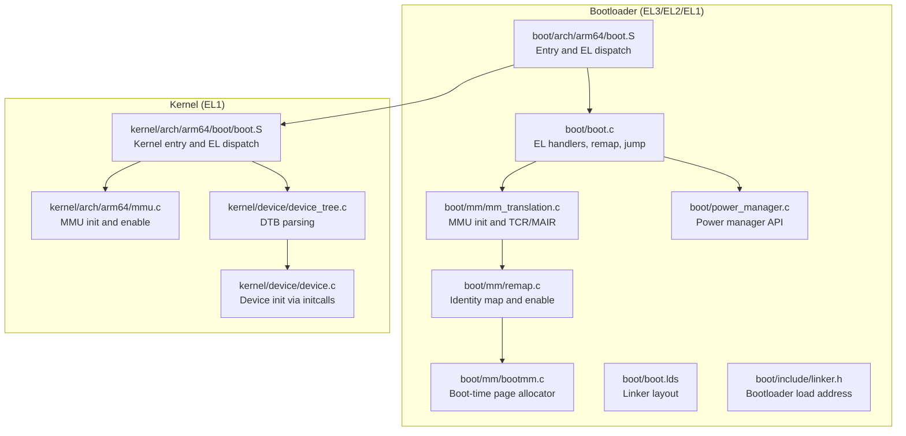
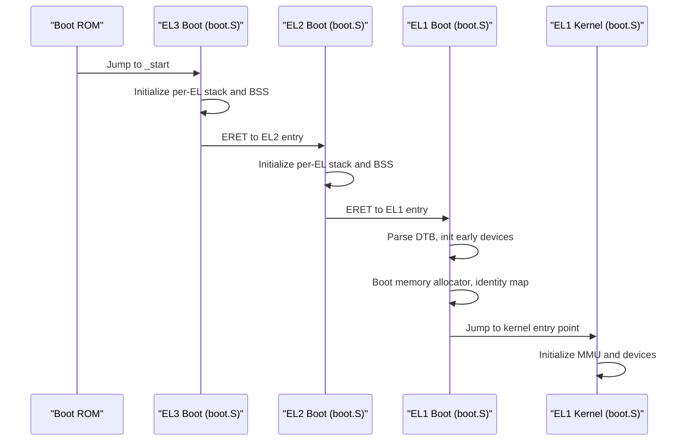
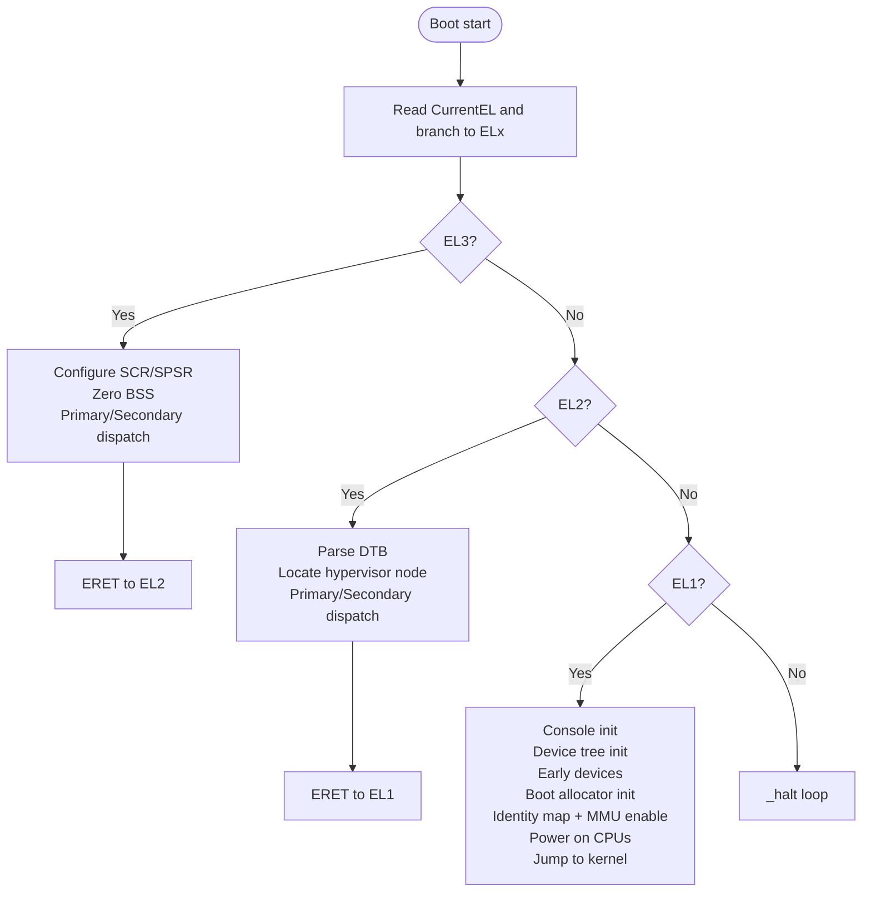
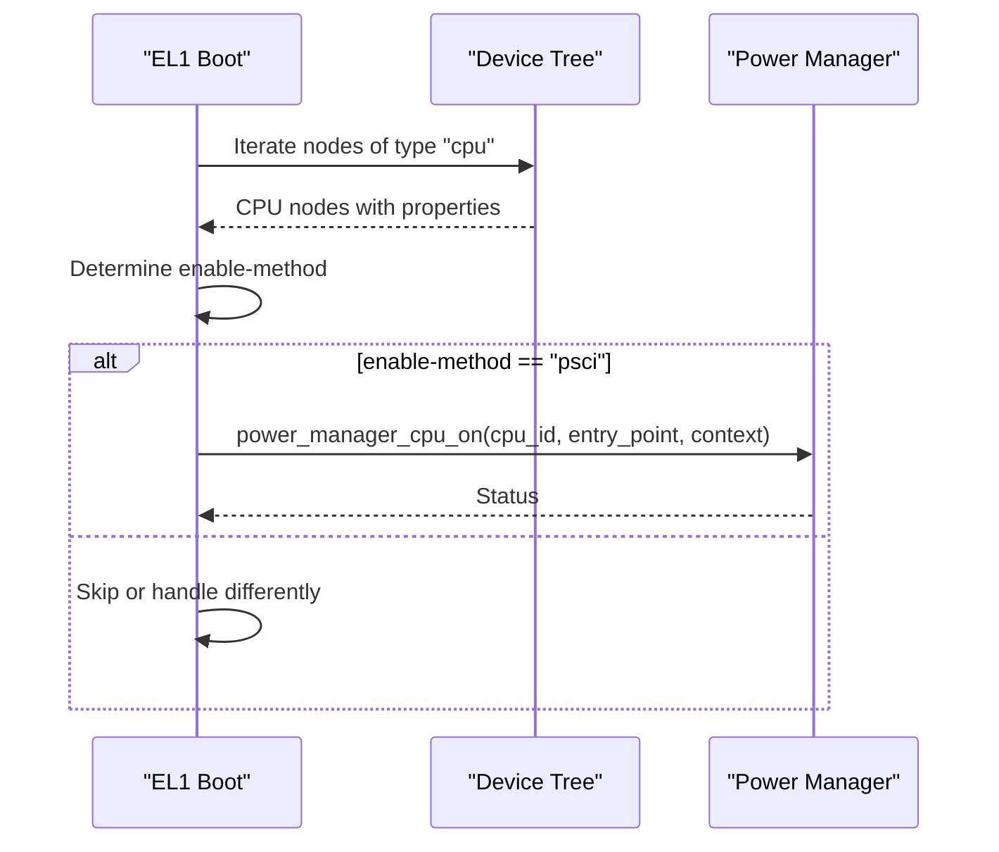
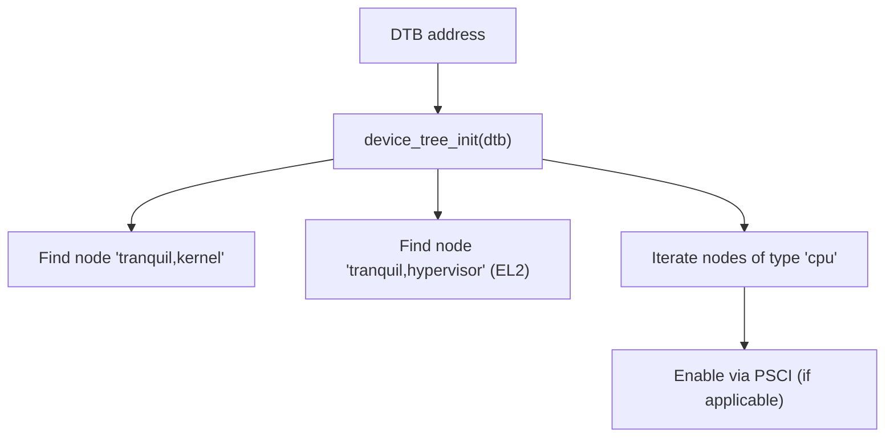
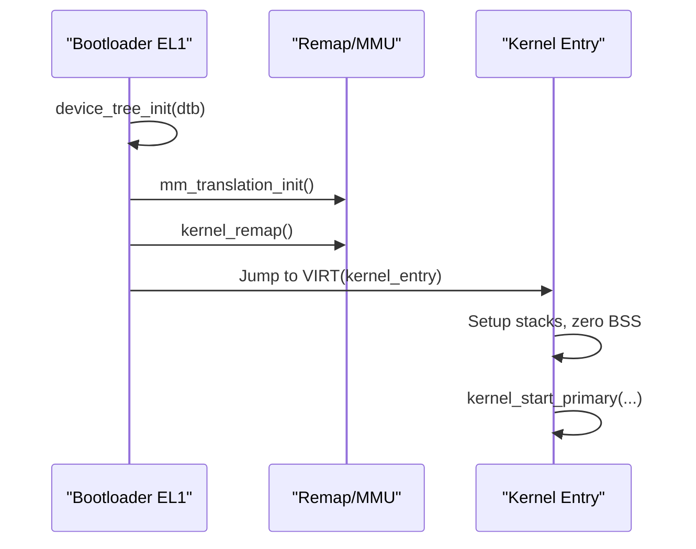
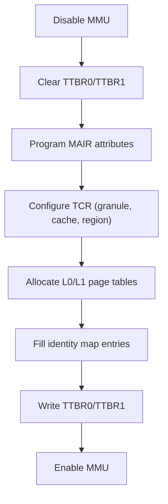
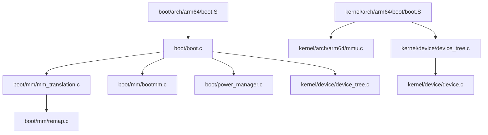

# Boot Process Management

<cite>
**Referenced Files in This Document**
- [boot.S](file://boot/arch/arm64/boot.S)
- [boot.c](file://boot/boot.c)
- [boot.lds](file://boot/boot.lds)
- [remap.c](file://boot/mm/remap.c)
- [mm_translation.c](file://boot/mm/mm_translation.c)
- [bootmm.c](file://boot/mm/bootmm.c)
- [power_manager.c](file://boot/power_manager.c)
- [power_manager.h](file://boot/include/power_manager.h)
- [linker.h](file://boot/include/linker.h)
- [boot.h](file://boot/include/boot.h)
- [mmu.c](file://kernel/arch/arm64/mmu.c)
- [device_tree.c](file://kernel/device/device_tree.c)
- [device.c](file://kernel/device/device.c)
- [boot.S](file://kernel/arch/arm64/boot/boot.S)
</cite>

## Table of Contents
1. [Introduction](#introduction)
2. [Project Structure](#project-structure)
3. [Core Components](#core-components)
4. [Architecture Overview](#architecture-overview)
5. [Detailed Component Analysis](#detailed-component-analysis)
6. [Dependency Analysis](#dependency-analysis)
7. [Performance Considerations](#performance-considerations)
8. [Troubleshooting Guide](#troubleshooting-guide)
9. [Conclusion](#conclusion)

## Introduction
This document explains the boot process management system in TranquilOS, focusing on the ARM64 EL3/EL2/EL1 initialization sequence, early boot stages, CPU initialization, and the transition from bootloader to kernel. It covers device tree parsing during boot, memory initialization, CPU feature detection, and platform-specific boot requirements. The document also details boot-time memory management, exception handling setup, and the coordination between boot stages.

## Project Structure
The boot subsystem is organized into:
- Boot assembly entry points and per-EL stacks
- Boot C runtime and initialization routines
- Memory management for boot stage (bootmm) and kernel remapping
- Power management interface for CPU bring-up
- Device tree parsing and device discovery
- Kernel-side boot entry and MMU configuration

**Diagram sources**
- [boot.S](file://boot/arch/arm64/boot.S#L1-L115)
- [boot.c](file://boot/boot.c#L1-L176)
- [mm_translation.c](file://boot/mm/mm_translation.c#L1-L225)
- [remap.c](file://boot/mm/remap.c#L1-L38)
- [bootmm.c](file://boot/mm/bootmm.c#L1-L29)
- [power_manager.c](file://boot/power_manager.c#L1-L27)
- [boot.lds](file://boot/boot.lds#L1-L73)
- [linker.h](file://boot/include/linker.h#L1-L6)
- [boot.S](file://kernel/arch/arm64/boot/boot.S#L1-L68)
- [mmu.c](file://kernel/arch/arm64/mmu.c#L1-L231)
- [device_tree.c](file://kernel/device/device_tree.c#L1-L95)
- [device.c](file://kernel/device/device.c#L1-L54)

**Section sources**
- [boot.S](file://boot/arch/arm64/boot.S#L1-L115)
- [boot.c](file://boot/boot.c#L1-L176)
- [boot.lds](file://boot/boot.lds#L1-L73)
- [linker.h](file://boot/include/linker.h#L1-L6)
- [mm_translation.c](file://boot/mm/mm_translation.c#L1-L225)
- [remap.c](file://boot/mm/remap.c#L1-L38)
- [bootmm.c](file://boot/mm/bootmm.c#L1-L29)
- [power_manager.c](file://boot/power_manager.c#L1-L27)
- [mmu.c](file://kernel/arch/arm64/mmu.c#L1-L231)
- [device_tree.c](file://kernel/device/device_tree.c#L1-L95)
- [device.c](file://kernel/device/device.c#L1-L54)

## Core Components
- Boot assembly entry and EL dispatch: Handles initial CPU state, stack setup per EL, and dispatch to appropriate EL handler.
- Boot C runtime: Initializes devices, parses device tree, sets up boot memory allocator, powers on secondary CPUs, and remaps/jumps to kernel.
- Memory management for boot: Configures MAIR/TCR, creates identity map, enables MMU, and manages boot-time pages.
- Power management: Provides PSCI-based CPU bring-up for secondary cores.
- Device tree parsing: Loads and iterates nodes to discover devices and locate kernel/hypervisor images.
- Kernel-side boot: Mirrors entry logic and initializes MMU and devices after handover.

**Section sources**
- [boot.S](file://boot/arch/arm64/boot.S#L1-L115)
- [boot.c](file://boot/boot.c#L1-L176)
- [mm_translation.c](file://boot/mm/mm_translation.c#L1-L225)
- [remap.c](file://boot/mm/remap.c#L1-L38)
- [bootmm.c](file://boot/mm/bootmm.c#L1-L29)
- [power_manager.c](file://boot/power_manager.c#L1-L27)
- [device_tree.c](file://kernel/device/device_tree.c#L1-L95)
- [mmu.c](file://kernel/arch/arm64/mmu.c#L1-L231)

## Architecture Overview
The boot process follows a layered model:
- EL3: Secure configuration and initial setup; transitions to EL2.
- EL2: Hypervisor selection and entry; optional path to EL1.
- EL1: Bootloader primary/secondary execution, device initialization, memory setup, and handover to kernel.

**Diagram sources**
- [boot.S](file://boot/arch/arm64/boot.S#L1-L115)
- [boot.c](file://boot/boot.c#L1-L176)
- [boot.S](file://kernel/arch/arm64/boot/boot.S#L1-L68)

## Detailed Component Analysis

### EL3/EL2/EL1 Initialization Sequence
- Entry and privilege dispatch:
  - Both bootloader and kernel share a similar entry routine that reads CurrentEL, computes EL level, and branches accordingly.
  - Per-EL stacks are allocated using a fixed stack size and CPU ID offset; BSS is zeroed for primary CPUs.
- EL3 responsibilities:
  - Configure secure control registers for EL3 (e.g., SCR/SPSR) and prepare for EL2 transition.
  - On primary CPU, initialize device tree and early devices, then transition to EL2.
- EL2 responsibilities:
  - Parse device tree and locate hypervisor node; if present, jump to hypervisor entry.
  - Otherwise, fall back to EL1 boot path.
- EL1 responsibilities (bootloader):
  - Initialize console, device tree, disable interrupts, and initialize early devices.
  - Set up boot memory allocator, iterate CPUs, and power on secondary CPUs via PSCI.
  - Perform identity mapping and enable MMU, then jump to kernel entry.
- EL1 responsibilities (kernel):
  - Mirror EL1 boot entry, allocate per-EL stacks, zero BSS, and call kernel start routines.

**Diagram sources**
- [boot.S](file://boot/arch/arm64/boot.S#L1-L115)
- [boot.c](file://boot/boot.c#L1-L176)
- [boot.S](file://kernel/arch/arm64/boot/boot.S#L1-L68)

**Section sources**
- [boot.S](file://boot/arch/arm64/boot.S#L1-L115)
- [boot.c](file://boot/boot.c#L1-L176)
- [boot.S](file://kernel/arch/arm64/boot/boot.S#L1-L68)

### Early Boot Stages and CPU Initialization
- CPU topology and secondary core bring-up:
  - Bootloader iterates CPU nodes in device tree, identifies enable method (e.g., PSCI), and requests power-on of secondary CPUs.
  - Power management API is used to execute PSCI CPU_ON with the desired entry point and context.
- Per-EL stack allocation:
  - Stack base addresses are computed per CPU ID and aligned to a fixed stack size; SP is set accordingly.
- Interrupts and early device initialization:
  - IRQs are disabled before device initialization to avoid race conditions.
  - Early devices are initialized via initcalls to expose essential hardware to the system.

**Diagram sources**
- [boot.c](file://boot/boot.c#L68-L80)
- [power_manager.c](file://boot/power_manager.c#L1-L27)
- [power_manager.h](file://boot/include/power_manager.h#L1-L74)

**Section sources**
- [boot.c](file://boot/boot.c#L68-L107)
- [power_manager.c](file://boot/power_manager.c#L1-L27)
- [power_manager.h](file://boot/include/power_manager.h#L1-L74)

### Boot ROM and RAM Entry Points
- Boot ROM loads the bootloader into RAM at a fixed address and jumps to the entry point.
- Linker configuration defines the base load address for the bootloader.
- The entry symbol is resolved by the linker script and executed from RAM.

**Diagram sources**
- [boot.lds](file://boot/boot.lds#L1-L73)
- [linker.h](file://boot/include/linker.h#L1-L6)
- [boot.S](file://boot/arch/arm64/boot.S#L1-L115)

**Section sources**
- [boot.lds](file://boot/boot.lds#L1-L73)
- [linker.h](file://boot/include/linker.h#L1-L6)
- [boot.S](file://boot/arch/arm64/boot.S#L1-L115)

### Device Tree Parsing During Boot
- Device tree is parsed early in EL1 boot to locate kernel/hypervisor nodes and gather hardware metadata.
- The parser supports locating nodes by compatible string or device type, iterating nodes, and extracting properties.
- The DTB address is passed down from the bootloader and validated before use.

**Diagram sources**
- [boot.c](file://boot/boot.c#L34-L45)
- [boot.c](file://boot/boot.c#L124-L135)
- [boot.c](file://boot/boot.c#L102-L102)
- [device_tree.c](file://kernel/device/device_tree.c#L10-L95)

**Section sources**
- [boot.c](file://boot/boot.c#L34-L45)
- [boot.c](file://boot/boot.c#L124-L135)
- [boot.c](file://boot/boot.c#L102-L102)
- [device_tree.c](file://kernel/device/device_tree.c#L10-L95)

### Transition from Bootloader to Kernel
- The bootloader locates the kernel entry address from device tree and performs identity mapping and MMU enable.
- It then jumps to the virtual address of the kernel entry point, passing the DTB address as a parameter.
- The kernel entry mirrors the bootloader’s EL1 entry, allocating per-EL stacks and proceeding with kernel initialization.

**Diagram sources**
- [boot.c](file://boot/boot.c#L47-L56)
- [remap.c](file://boot/mm/remap.c#L30-L38)
- [mm_translation.c](file://boot/mm/mm_translation.c#L99-L162)
- [boot.S](file://kernel/arch/arm64/boot/boot.S#L32-L56)

**Section sources**
- [boot.c](file://boot/boot.c#L47-L56)
- [remap.c](file://boot/mm/remap.c#L30-L38)
- [mm_translation.c](file://boot/mm/mm_translation.c#L99-L162)
- [boot.S](file://kernel/arch/arm64/boot/boot.S#L32-L56)

### Memory Initialization and CPU Feature Detection
- MMU configuration:
  - MAIR attributes are programmed for device and normal memory types.
  - TCR is configured for 4KB granule, inner WBWA cache policy, and 48-bit VA with 256TB regions.
  - Identity mapping is generated and installed into TTBR0/TTBR1 for both privileged and unprivileged views.
- CPU feature detection:
  - ID_AA64MMFR0 is read to determine supported physical address range and granule capabilities.
  - If 4KB granule is unsupported, boot panics to prevent undefined behavior.

**Diagram sources**
- [mm_translation.c](file://boot/mm/mm_translation.c#L99-L162)
- [mm_translation.c](file://boot/mm/mm_translation.c#L164-L225)
- [remap.c](file://boot/mm/remap.c#L30-L38)
- [mmu.c](file://kernel/arch/arm64/mmu.c#L62-L126)

**Section sources**
- [mm_translation.c](file://boot/mm/mm_translation.c#L99-L162)
- [mm_translation.c](file://boot/mm/mm_translation.c#L164-L225)
- [remap.c](file://boot/mm/remap.c#L30-L38)
- [mmu.c](file://kernel/arch/arm64/mmu.c#L62-L126)

### Platform-Specific Boot Requirements
- Fixed RAM load address for the bootloader is defined in linker headers.
- Per-EL stack layout and alignment are defined in the linker script to ensure deterministic per-CPU stack placement.
- Device tree compatibility strings are used to locate platform-specific nodes (kernel, hypervisor, CPU).

**Section sources**
- [linker.h](file://boot/include/linker.h#L1-L6)
- [boot.lds](file://boot/boot.lds#L53-L69)
- [boot.c](file://boot/boot.c#L34-L45)
- [boot.c](file://boot/boot.c#L124-L135)

## Dependency Analysis
The boot process exhibits clear layering and minimal coupling:
- Assembly entry depends on C runtime for device tree and memory management.
- Memory management depends on the boot page allocator and device tree for feature detection.
- Power management is decoupled and accessed via an abstract API.
- Kernel entry mirrors bootloader entry, ensuring consistent behavior across transitions.

**Diagram sources**
- [boot.S](file://boot/arch/arm64/boot.S#L1-L115)
- [boot.c](file://boot/boot.c#L1-L176)
- [mm_translation.c](file://boot/mm/mm_translation.c#L1-L225)
- [remap.c](file://boot/mm/remap.c#L1-L38)
- [bootmm.c](file://boot/mm/bootmm.c#L1-L29)
- [power_manager.c](file://boot/power_manager.c#L1-L27)
- [device_tree.c](file://kernel/device/device_tree.c#L1-L95)
- [boot.S](file://kernel/arch/arm64/boot/boot.S#L1-L68)
- [mmu.c](file://kernel/arch/arm64/mmu.c#L1-L231)
- [device.c](file://kernel/device/device.c#L1-L54)

**Section sources**
- [boot.S](file://boot/arch/arm64/boot.S#L1-L115)
- [boot.c](file://boot/boot.c#L1-L176)
- [mm_translation.c](file://boot/mm/mm_translation.c#L1-L225)
- [remap.c](file://boot/mm/remap.c#L1-L38)
- [bootmm.c](file://boot/mm/bootmm.c#L1-L29)
- [power_manager.c](file://boot/power_manager.c#L1-L27)
- [device_tree.c](file://kernel/device/device_tree.c#L1-L95)
- [boot.S](file://kernel/arch/arm64/boot/boot.S#L1-L68)
- [mmu.c](file://kernel/arch/arm64/mmu.c#L1-L231)
- [device.c](file://kernel/device/device.c#L1-L54)

## Performance Considerations
- Minimizing early boot overhead:
  - Zeroing BSS and initializing stacks are linear in size; keep stack sizes reasonable to reduce memory footprint.
  - Use efficient identity mapping generation and avoid redundant TLB invalidations.
- Device tree parsing:
  - Limit unnecessary iterations; cache frequently accessed nodes when possible.
- MMU configuration:
  - Program MAIR once and reuse; configure TCR and TTBRs atomically to avoid TLB thrash.

## Troubleshooting Guide
- DTB not found or invalid:
  - Ensure the DTB address is valid and passed correctly; verify device tree parsing functions return non-null nodes.
- Kernel/hypervisor node missing:
  - Confirm device tree contains compatible nodes for kernel/hypervisor; otherwise, bootloader falls back or halts.
- Secondary CPU not coming online:
  - Verify PSCI registration and enable-method property; check power manager API returns success.
- MMU configuration errors:
  - If 4KB granule is unsupported, boot panics; ensure platform supports required granule size.
- Jump to kernel fails:
  - Confirm identity map is installed and MMU is enabled before jumping; verify virtual address calculation and entry point.

**Section sources**
- [boot.c](file://boot/boot.c#L34-L45)
- [boot.c](file://boot/boot.c#L124-L135)
- [power_manager.c](file://boot/power_manager.c#L12-L21)
- [mm_translation.c](file://boot/mm/mm_translation.c#L87-L89)
- [remap.c](file://boot/mm/remap.c#L30-L38)

## Conclusion
TranquilOS boot process establishes a robust foundation for kernel operation through a clear EL3/EL2/EL1 progression, disciplined device tree parsing, and careful memory management. The bootloader prepares hardware, discovers devices, powers up secondary CPUs, and hands off to the kernel with a fully configured MMU and identity mapping. The kernel mirrors this behavior to maintain consistency and reliability across the boot boundary.