# Core Kernel Services

<cite>
**Referenced Files in This Document**
- [kernel.c](file://kernel/kernel.c)
- [core.h](file://kernel/include/core.h)
- [printk.c](file://kernel/printk.c)
- [printk.h](file://kernel/include/printk.h)
- [klog.h](file://kernel/include/klog.h)
- [debug.h](file://kernel/include/debug.h)
- [panic.h](file://kernel/include/panic.h)
- [boot.h](file://kernel/include/boot.h)
- [boot.c](file://boot/boot.c)
- [sysproc.c](file://kernel/sysproc.c)
- [cpulocal.h](file://kernel/include/cpulocal.h)
- [switch.h](file://kernel/include/switch.h)
- [exception.c](file://kernel/exception/exception.c)
- [arch_exception.c](file://kernel/arch/arm64/exception.c)
- [kmsg_console.c](file://kernel/drivers/kmsg/kmsg_console.c)
- [initcall.h](file://kernel/include/initcall.h)
</cite>

## Table of Contents
1. [Introduction](#introduction)
2. [Project Structure](#project-structure)
3. [Core Components](#core-components)
4. [Architecture Overview](#architecture-overview)
5. [Detailed Component Analysis](#detailed-component-analysis)
6. [Dependency Analysis](#dependency-analysis)
7. [Performance Considerations](#performance-considerations)
8. [Troubleshooting Guide](#troubleshooting-guide)
9. [Conclusion](#conclusion)

## Introduction
This document describes the core kernel services that provide fundamental system functionality in the kernel. It explains the kernel’s role as a minimal service provider, the logging and debugging facilities, panic handling mechanisms, and system-wide debugging support. It also documents the kernel’s internal APIs, logging infrastructure, and diagnostic capabilities, including kernel message handling, debug output formatting, and error reporting. The goal is to help developers understand how these core services enable other kernel subsystems and user-space components to function reliably.

## Project Structure
The core kernel services span several modules:
- Boot and early initialization: bootloader entrypoints and early CPU/device initialization
- Logging and diagnostics: kernel logging macros, formatted output, and debug helpers
- Panic and fault handling: fatal error reporting and graceful halt behavior
- System daemon bootstrap: creation of the initial system process and scheduling
- CPU-local state and context switching: per-CPU state and user-mode context transitions
- Exception handling: synchronous exceptions, data faults, and register dumps
- Console and kernel message devices: console output and reserved kernel message buffer device

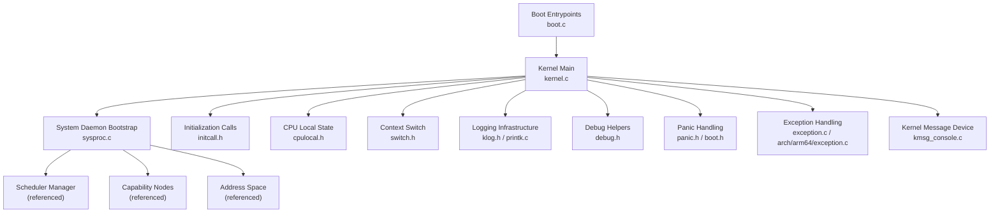

**Diagram sources**
- [boot.c](file://boot/boot.c#L82-L107)
- [kernel.c](file://kernel/kernel.c#L125-L224)
- [sysproc.c](file://kernel/sysproc.c#L63-L83)
- [initcall.h](file://kernel/include/initcall.h#L1-L44)
- [cpulocal.h](file://kernel/include/cpulocal.h#L1-L32)
- [switch.h](file://kernel/include/switch.h#L1-L11)
- [klog.h](file://kernel/include/klog.h#L1-L38)
- [printk.c](file://kernel/printk.c#L1-L16)
- [debug.h](file://kernel/include/debug.h#L1-L31)
- [panic.h](file://kernel/include/panic.h#L1-L10)
- [boot.h](file://kernel/include/boot.h#L1-L8)
- [exception.c](file://kernel/exception/exception.c#L1-L36)
- [arch_exception.c](file://kernel/arch/arm64/exception.c#L108-L119)
- [kmsg_console.c](file://kernel/drivers/kmsg/kmsg_console.c#L1-L33)

**Section sources**
- [kernel/kernel.c](file://kernel/kernel.c#L1-L225)
- [boot/boot.c](file://boot/boot.c#L1-L176)

## Core Components
- Kernel bootstrap and primary/secondary CPU startup
  - Primary CPU initializes devices, memory, interrupts, timers, and the scheduler, then starts the system daemon.
  - Secondary CPUs wait for early initialization completion, initialize per-CPU devices and timers, then enter the scheduler loop.
- Logging and diagnostics
  - Formatted logging via macros with severity levels and timestamps.
  - Low-level debug output to hardware UART via console device abstraction.
  - Panic macro logs error with file/function/line and halts execution.
- System daemon bootstrap
  - Creates kernel-side capability nodes and address spaces for the system daemon.
  - Initializes user and schedule contexts, registers with the scheduler, and switches to the system daemon.
- CPU-local state and context switching
  - Per-CPU structures track current schedule context and privilege stacks.
  - Context switch functions handle transitions between user schedule contexts and execute contexts.
- Exception handling and diagnostics
  - Synchronous exception handling routes data faults to either coredump or upcall handlers depending on fault address range.
  - Architecture-specific exception debug info and register dump utilities.
- Console and kernel message device
  - Console device abstraction supports UART output.
  - Reserved kernel message buffer device placeholder for kernel messages.

**Section sources**
- [kernel/kernel.c](file://kernel/kernel.c#L61-L123)
- [kernel/kernel.c](file://kernel/kernel.c#L125-L224)
- [kernel/include/klog.h](file://kernel/include/klog.h#L1-L38)
- [kernel/printk.c](file://kernel/printk.c#L1-L16)
- [kernel/include/debug.h](file://kernel/include/debug.h#L1-L31)
- [kernel/include/panic.h](file://kernel/include/panic.h#L1-L10)
- [kernel/sysproc.c](file://kernel/sysproc.c#L24-L83)
- [kernel/include/cpulocal.h](file://kernel/include/cpulocal.h#L1-L32)
- [kernel/include/switch.h](file://kernel/include/switch.h#L1-L11)
- [kernel/exception/exception.c](file://kernel/exception/exception.c#L11-L36)
- [kernel/arch/arm64/exception.c](file://kernel/arch/arm64/exception.c#L22-L119)
- [kernel/drivers/kmsg/kmsg_console.c](file://kernel/drivers/kmsg/kmsg_console.c#L1-L33)

## Architecture Overview
The kernel orchestrates early initialization, sets up core subsystems, and launches the system daemon. It provides logging, panic, and exception handling to maintain reliability and diagnostics. CPU-local state and context switching enable efficient scheduling and user-mode transitions.

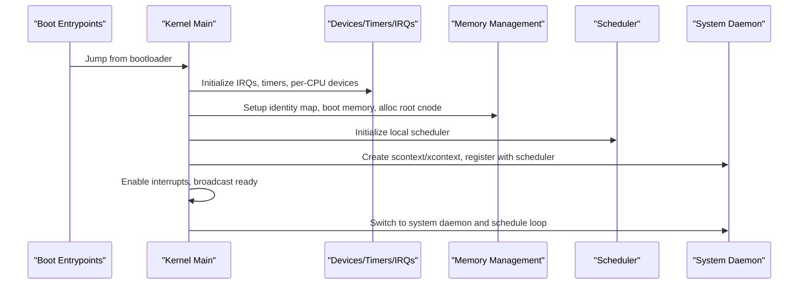

**Diagram sources**
- [boot/boot.c](file://boot/boot.c#L47-L104)
- [kernel/kernel.c](file://kernel/kernel.c#L125-L224)
- [kernel/sysproc.c](file://kernel/sysproc.c#L24-L83)

## Detailed Component Analysis

### Kernel Bootstrap and CPU Startup
- Primary CPU flow:
  - Reset console, initialize device tree, disable interrupts, print splash.
  - Initialize IRQ manager, early/per-CPU devices, print memory regions, and key devices.
  - Initialize timer manager, tick timer, and enable IRQ device.
  - Sparse memory initialization, boot memory manager, identity page tables, root capability node.
  - Initialize scheduler, modules, locate system daemon in device tree, and start it.
  - Disable boot memory, enable interrupts, signal secondary CPUs, and start system daemon.
- Secondary CPU flow:
  - Wait until early init is complete, initialize per-CPU devices and timers, then enter scheduler loop.

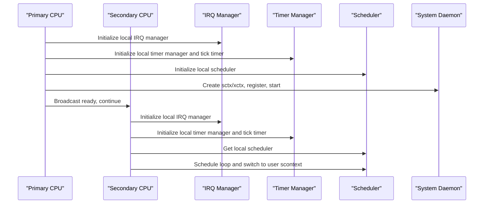

**Diagram sources**
- [kernel/kernel.c](file://kernel/kernel.c#L61-L123)
- [kernel/kernel.c](file://kernel/kernel.c#L125-L224)

**Section sources**
- [kernel/kernel.c](file://kernel/kernel.c#L61-L123)
- [kernel/kernel.c](file://kernel/kernel.c#L125-L224)

### Logging Infrastructure and Debug Output Formatting
- Logging macros:
  - Severity levels: debug, info, warning, error.
  - Current log level controls verbosity.
  - Each log line includes CPU ID and timestamp.
- Debug helpers:
  - Direct character output to hardware UART via a debug function.
  - Formatted debug printing to UART.
- Console output:
  - Formatted printing to UART via console device abstraction.

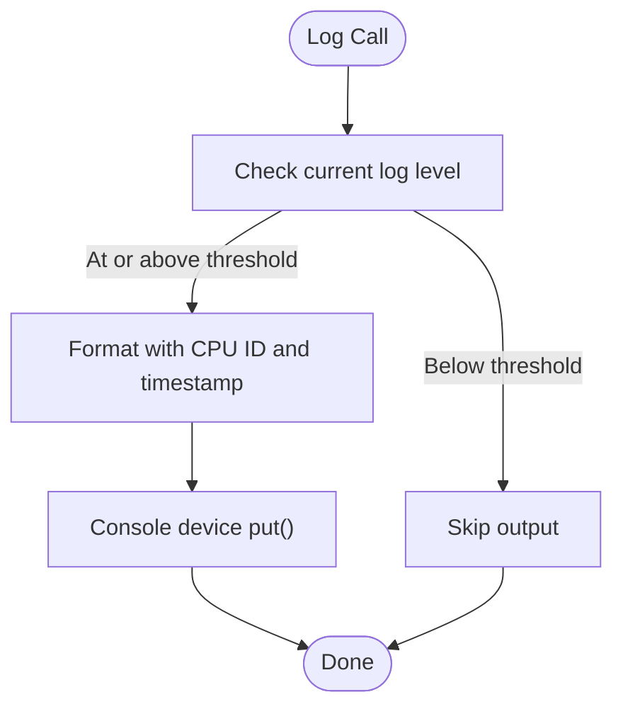

**Diagram sources**
- [kernel/include/klog.h](file://kernel/include/klog.h#L17-L35)
- [kernel/printk.c](file://kernel/printk.c#L6-L15)
- [kernel/include/debug.h](file://kernel/include/debug.h#L22-L29)

**Section sources**
- [kernel/include/klog.h](file://kernel/include/klog.h#L1-L38)
- [kernel/printk.c](file://kernel/printk.c#L1-L16)
- [kernel/include/debug.h](file://kernel/include/debug.h#L1-L31)

### Panic Handling Mechanisms
- Panic macro:
  - Logs error with file, function, and line number.
  - Halts execution via a kernel halt routine.
- Boot halt interface:
  - Declared for platform-specific halt behavior.

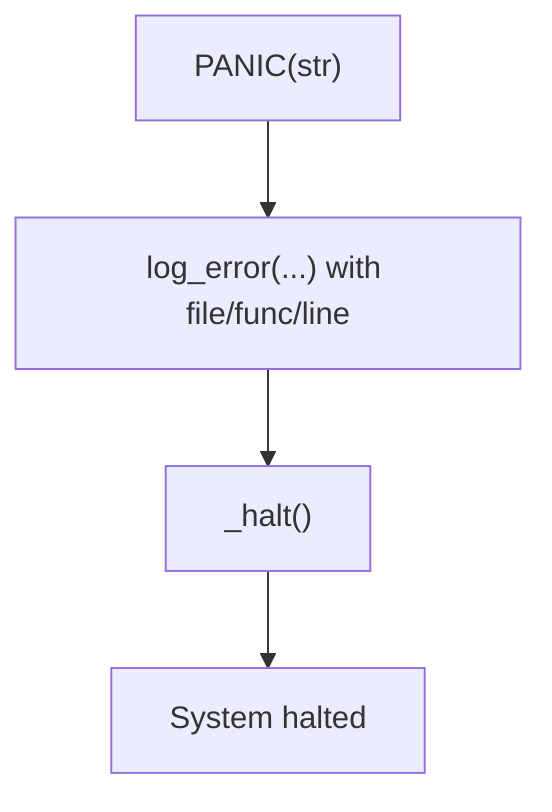

**Diagram sources**
- [kernel/include/panic.h](file://kernel/include/panic.h#L6-L8)
- [kernel/include/boot.h](file://kernel/include/boot.h#L4-L4)

**Section sources**
- [kernel/include/panic.h](file://kernel/include/panic.h#L1-L10)
- [kernel/include/boot.h](file://kernel/include/boot.h#L1-L8)

### System Daemon Bootstrap and Scheduling
- System daemon creation:
  - Allocates stack, initializes execute and schedule contexts.
  - Creates capabilities for scontext, xcontext, and address space.
  - Registers with local scheduler.
- Starting the system daemon:
  - Retrieves local scheduler and switches to the system daemon’s initial context.

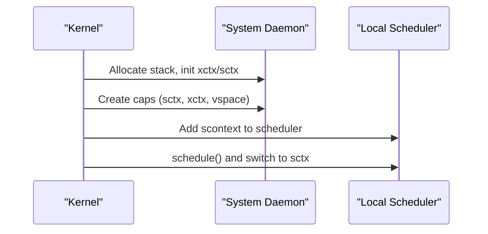

**Diagram sources**
- [kernel/sysproc.c](file://kernel/sysproc.c#L24-L83)

**Section sources**
- [kernel/sysproc.c](file://kernel/sysproc.c#L24-L83)
- [kernel/include/core.h](file://kernel/include/core.h#L1-L9)

### CPU-Local State and Context Switching
- CPU-local structure:
  - Tracks kernel high/low address spaces, current schedule context, and privilege stack pointer.
  - Provides setters/getters for per-CPU state.
- Context switching:
  - Switch to next user schedule context or execute context.

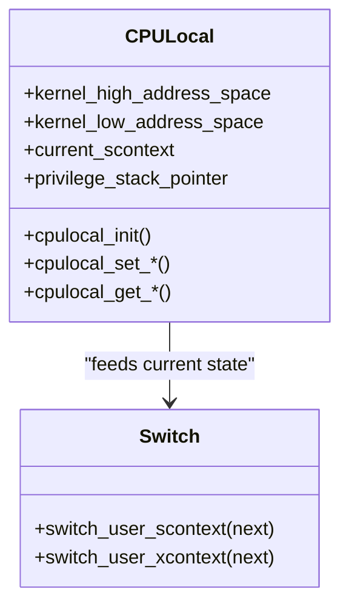

**Diagram sources**
- [kernel/include/cpulocal.h](file://kernel/include/cpulocal.h#L7-L31)
- [kernel/include/switch.h](file://kernel/include/switch.h#L7-L10)

**Section sources**
- [kernel/include/cpulocal.h](file://kernel/include/cpulocal.h#L1-L32)
- [kernel/include/switch.h](file://kernel/include/switch.h#L1-L11)

### Exception Handling and Diagnostics
- Synchronous exception handling:
  - Data faults routed differently based on fault address range.
  - Upcall mechanism invoked for user-space faults; coredump for kernel-space faults.
- Architecture-specific exception debug info:
  - Reads ESR/FAR and privilege level to populate debug info.
  - Dumps registers and relevant system control registers for diagnosis.

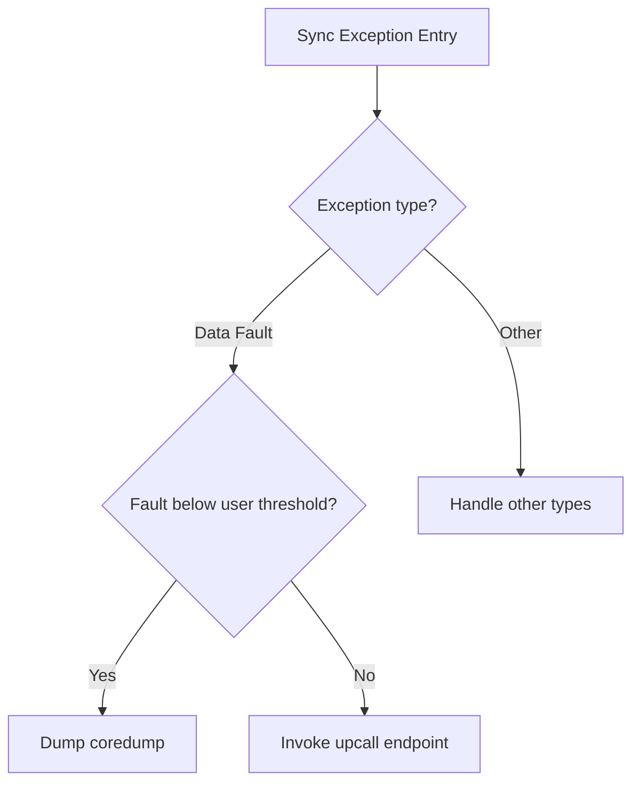

**Diagram sources**
- [kernel/exception/exception.c](file://kernel/exception/exception.c#L26-L35)
- [kernel/arch/arm64/exception.c](file://kernel/arch/arm64/exception.c#L22-L106)

**Section sources**
- [kernel/exception/exception.c](file://kernel/exception/exception.c#L1-L36)
- [kernel/arch/arm64/exception.c](file://kernel/arch/arm64/exception.c#L1-L119)

### Kernel Message Handling and Console Devices
- Console output:
  - Formatted printing to UART via console device abstraction.
- Kernel message buffer device:
  - Placeholder device for kernel messages in a reserved buffer area.

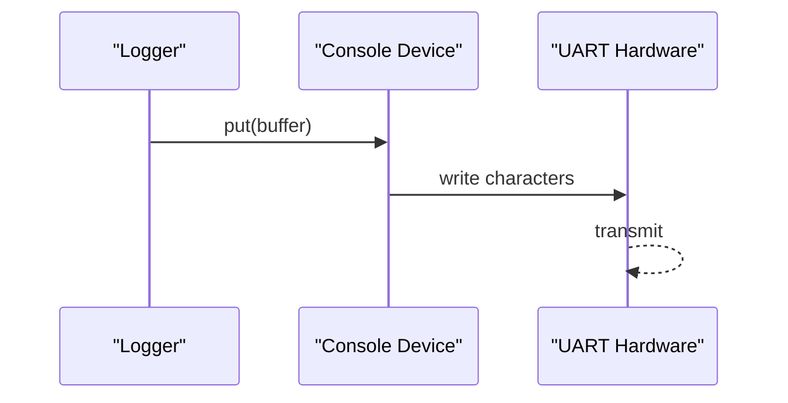

**Diagram sources**
- [kernel/printk.c](file://kernel/printk.c#L6-L15)
- [kernel/drivers/kmsg/kmsg_console.c](file://kernel/drivers/kmsg/kmsg_console.c#L8-L21)

**Section sources**
- [kernel/printk.c](file://kernel/printk.c#L1-L16)
- [kernel/drivers/kmsg/kmsg_console.c](file://kernel/drivers/kmsg/kmsg_console.c#L1-L33)

### Initialization Call Levels and Module Integration
- Initialization levels:
  - Early/key/normal device and per-CPU device initialization levels.
  - Module and per-CPU module initialization levels.
- Execution model:
  - Functions registered at compile time are executed in order by level.

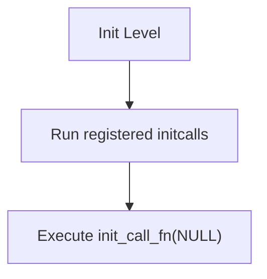

**Diagram sources**
- [kernel/include/initcall.h](file://kernel/include/initcall.h#L26-L34)

**Section sources**
- [kernel/include/initcall.h](file://kernel/include/initcall.h#L1-L44)

## Dependency Analysis
The kernel’s core services depend on:
- Boot and device tree for early hardware setup
- Memory management for page tables and capability nodes
- Interrupt and timer managers for scheduling and timing
- Scheduler manager for process scheduling
- Console and device abstractions for logging and diagnostics
- Exception handling for fault routing and register dumps

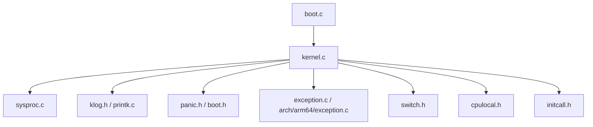

**Diagram sources**
- [boot/boot.c](file://boot/boot.c#L1-L176)
- [kernel/kernel.c](file://kernel/kernel.c#L1-L225)
- [kernel/sysproc.c](file://kernel/sysproc.c#L1-L84)
- [kernel/include/klog.h](file://kernel/include/klog.h#L1-L38)
- [kernel/printk.c](file://kernel/printk.c#L1-L16)
- [kernel/include/panic.h](file://kernel/include/panic.h#L1-L10)
- [kernel/include/boot.h](file://kernel/include/boot.h#L1-L8)
- [kernel/exception/exception.c](file://kernel/exception/exception.c#L1-L36)
- [kernel/arch/arm64/exception.c](file://kernel/arch/arm64/exception.c#L1-L119)
- [kernel/include/switch.h](file://kernel/include/switch.h#L1-L11)
- [kernel/include/cpulocal.h](file://kernel/include/cpulocal.h#L1-L32)
- [kernel/include/initcall.h](file://kernel/include/initcall.h#L1-L44)

**Section sources**
- [kernel/kernel.c](file://kernel/kernel.c#L1-L225)
- [kernel/sysproc.c](file://kernel/sysproc.c#L1-L84)
- [kernel/include/klog.h](file://kernel/include/klog.h#L1-L38)
- [kernel/printk.c](file://kernel/printk.c#L1-L16)
- [kernel/include/panic.h](file://kernel/include/panic.h#L1-L10)
- [kernel/include/boot.h](file://kernel/include/boot.h#L1-L8)
- [kernel/exception/exception.c](file://kernel/exception/exception.c#L1-L36)
- [kernel/arch/arm64/exception.c](file://kernel/arch/arm64/exception.c#L1-L119)
- [kernel/include/switch.h](file://kernel/include/switch.h#L1-L11)
- [kernel/include/cpulocal.h](file://kernel/include/cpulocal.h#L1-L32)
- [kernel/include/initcall.h](file://kernel/include/initcall.h#L1-L44)

## Performance Considerations
- Logging overhead: Keep log level at appropriate verbosity to avoid excessive formatting and console writes.
- Console I/O: UART output can be a bottleneck; minimize frequent small writes.
- Exception handling: Prefer upcall routing for user-space faults to avoid heavy coredump operations.
- Scheduling: Ensure timer tick and scheduler initialization are efficient to reduce latency.

## Troubleshooting Guide
- Panic with file/function/line:
  - Use the panic macro to capture precise failure location and halt for investigation.
- Register dumps:
  - On exceptions, the architecture-specific code prints ESR/FAR and register state for diagnosis.
- Data faults:
  - If fault address is in user range, coredump is triggered; otherwise, upcall handler is invoked.
- Console output:
  - Verify console device registration and UART availability for debug output.

**Section sources**
- [kernel/include/panic.h](file://kernel/include/panic.h#L6-L8)
- [kernel/arch/arm64/exception.c](file://kernel/arch/arm64/exception.c#L47-L106)
- [kernel/exception/exception.c](file://kernel/exception/exception.c#L11-L35)
- [kernel/printk.c](file://kernel/printk.c#L6-L15)

## Conclusion
The core kernel services provide a minimal yet robust foundation for system operation. They deliver reliable logging and diagnostics, safe panic handling, structured initialization, and efficient context switching. Together with exception handling and console device abstractions, they enable other kernel subsystems and user-space components to function predictably and support effective debugging and maintenance.