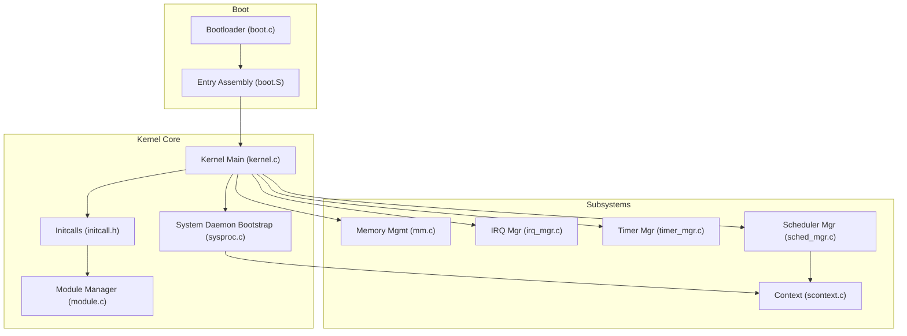
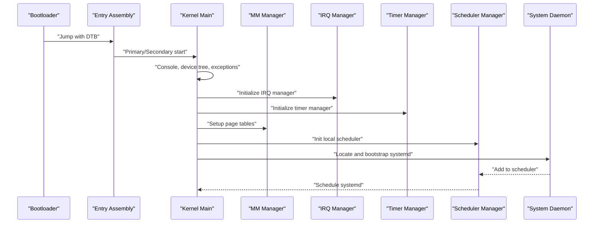
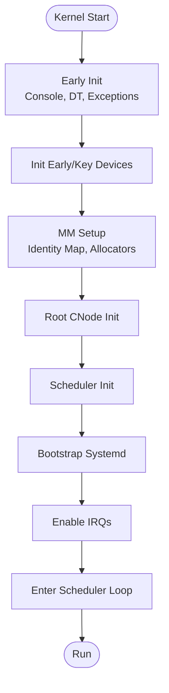
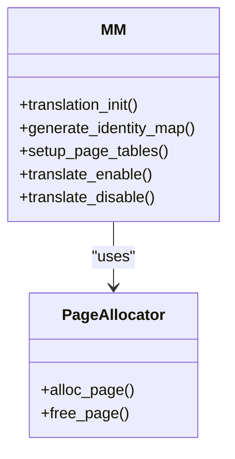
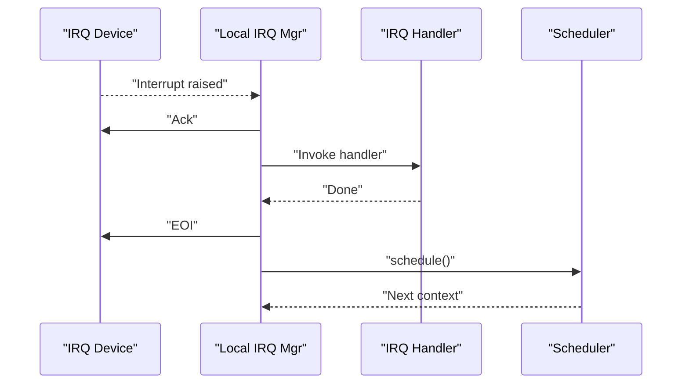
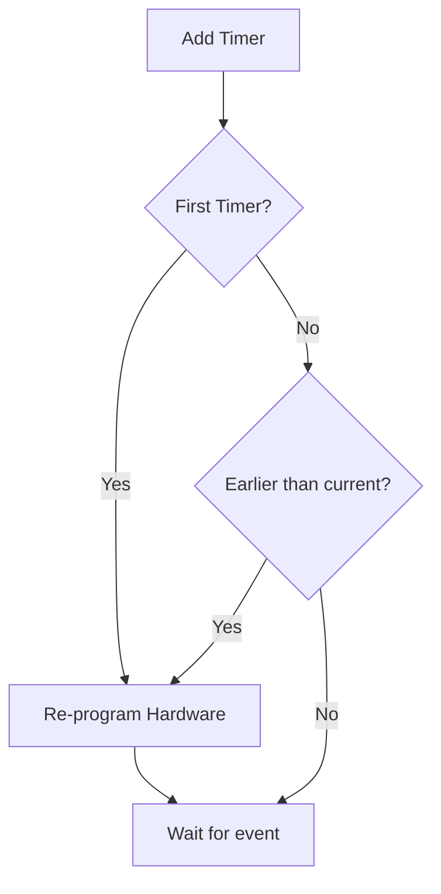
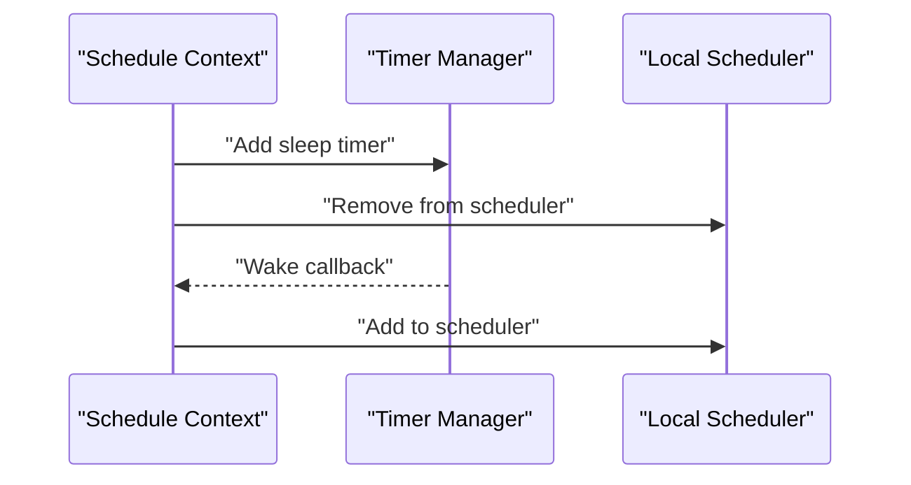
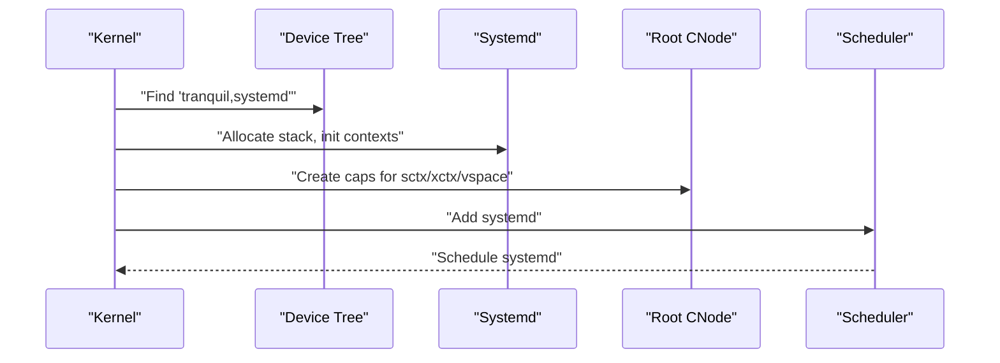
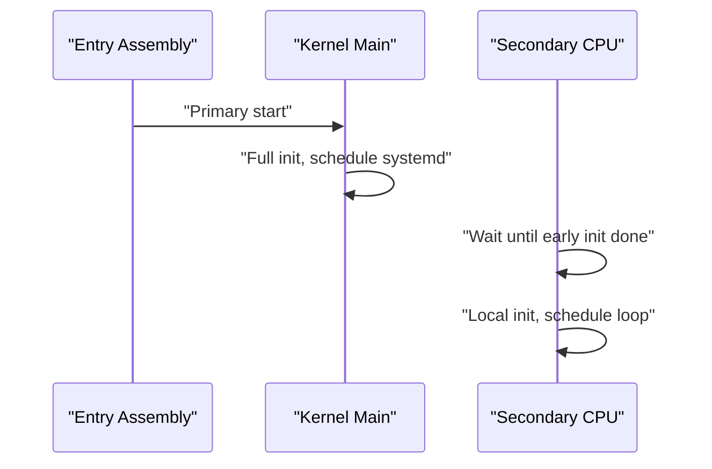
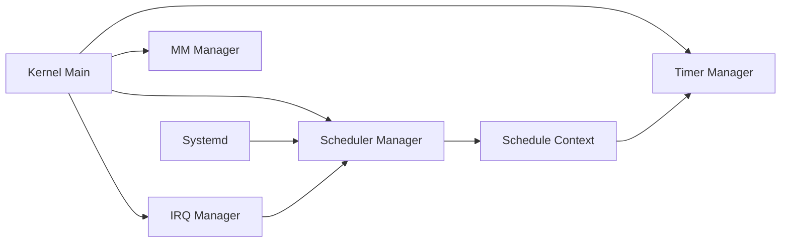

# Kernel Core Components

<cite>
**Referenced Files in This Document**
- [kernel.c](file://kernel/kernel.c)
- [core.h](file://kernel/include/core.h)
- [boot.c](file://boot/boot.c)
- [boot.S](file://kernel/arch/arm64/boot/boot.S)
- [entry.S](file://kernel/arch/arm64/entry/entry.S)
- [initcall.h](file://kernel/include/initcall.h)
- [module.c](file://kernel/module/module.c)
- [sysproc.c](file://kernel/sysproc.c)
- [mm.c](file://kernel/mm/mm.c)
- [sched_mgr.c](file://kernel/schedule/sched_mgr.c)
- [irq_mgr.c](file://kernel/interrupt/irq_mgr.c)
- [timer_mgr.c](file://kernel/timer/timer_mgr.c)
- [scontext.c](file://kernel/context/scontext.c)
</cite>

## Table of Contents
1. [Introduction](#introduction)
2. [Project Structure](#project-structure)
3. [Core Components](#core-components)
4. [Architecture Overview](#architecture-overview)
5. [Detailed Component Analysis](#detailed-component-analysis)
6. [Dependency Analysis](#dependency-analysis)
7. [Performance Considerations](#performance-considerations)
8. [Troubleshooting Guide](#troubleshooting-guide)
9. [Conclusion](#conclusion)

## Introduction
This document explains the kernel core components of TranquilOS, focusing on the initialization sequence, core services, and fundamental system abstractions. It covers how the kernel manages system resources, provides minimal services, coordinates with user-space services (notably the system daemon), and orchestrates subsystems such as memory management, interrupts, timers, scheduling, and capabilities. The goal is to make the kernel’s operation accessible to newcomers while offering sufficient depth for kernel developers.

## Project Structure
At a high level, the kernel is organized by functional domains:
- Boot and entry: early boot assembly and transitions from bootloader to kernel.
- Core runtime: kernel initialization, CPU-local state, and the system daemon bootstrap.
- Subsystems: memory management, interrupts, timers, scheduling, and capabilities.
- Modules and initcalls: modular initialization phases for devices and per-CPU services.
- User-space coordination: system daemon bootstrap and capability distribution.

**Diagram sources**
- [boot.c](file://boot/boot.c#L82-L107)
- [boot.S](file://kernel/arch/arm64/boot/boot.S#L32-L56)
- [kernel.c](file://kernel/kernel.c#L125-L224)
- [sysproc.c](file://kernel/sysproc.c#L63-L70)
- [initcall.h](file://kernel/include/initcall.h#L19-L34)
- [module.c](file://kernel/module/module.c#L8-L17)
- [mm.c](file://kernel/mm/mm.c#L29-L45)
- [irq_mgr.c](file://kernel/interrupt/irq_mgr.c#L135-L142)
- [timer_mgr.c](file://kernel/timer/timer_mgr.c#L202-L208)
- [sched_mgr.c](file://kernel/schedule/sched_mgr.c#L155-L162)
- [scontext.c](file://kernel/context/scontext.c#L32-L45)

**Section sources**
- [boot.c](file://boot/boot.c#L82-L107)
- [boot.S](file://kernel/arch/arm64/boot/boot.S#L32-L56)
- [kernel.c](file://kernel/kernel.c#L125-L224)
- [sysproc.c](file://kernel/sysproc.c#L63-L70)
- [initcall.h](file://kernel/include/initcall.h#L19-L34)
- [module.c](file://kernel/module/module.c#L8-L17)
- [mm.c](file://kernel/mm/mm.c#L29-L45)
- [irq_mgr.c](file://kernel/interrupt/irq_mgr.c#L135-L142)
- [timer_mgr.c](file://kernel/timer/timer_mgr.c#L202-L208)
- [sched_mgr.c](file://kernel/schedule/sched_mgr.c#L155-L162)
- [scontext.c](file://kernel/context/scontext.c#L32-L45)

## Core Components
This section outlines the kernel’s foundational building blocks and their roles.

- Kernel entry and CPU-local initialization
  - Primary CPU initializes console, device tree, exceptions, interrupts, early devices, and key per-CPU devices.
  - Secondary CPUs wait for a global “early init done” flag, then initialize locally and enter the scheduler loop.
  - CPU-local storage and kernel stacks are set up per-CPU.

- Memory management
  - MMU is initialized, identity maps are generated, and page tables are installed for both kernel and user spaces.
  - Boot memory allocator is used during early stages, later disabled after memory banks are set up.

- Interrupts and timers
  - Interrupt manager is initialized and bound to a per-CPU device; IRQ handlers can trigger scheduling decisions.
  - Timer manager sets up time accounting, tick timer, and timer containers (e.g., monotonic RB-tree).

- Scheduling
  - Scheduler manager creates per-CPU local schedulers and registers frameworks; tasks are added via schedule contexts.

- Capabilities and address spaces
  - Root capability node is allocated and initialized; the kernel’s address space is established and linked to the system daemon.

- System daemon bootstrap
  - The system daemon is located via device tree, a capability node is created for it, and it is placed into the scheduler.

**Section sources**
- [kernel.c](file://kernel/kernel.c#L61-L123)
- [kernel.c](file://kernel/kernel.c#L125-L224)
- [mm.c](file://kernel/mm/mm.c#L29-L45)
- [irq_mgr.c](file://kernel/interrupt/irq_mgr.c#L105-L118)
- [timer_mgr.c](file://kernel/timer/timer_mgr.c#L164-L185)
- [sched_mgr.c](file://kernel/schedule/sched_mgr.c#L113-L129)
- [sysproc.c](file://kernel/sysproc.c#L24-L61)

## Architecture Overview
The kernel follows a layered architecture:
- Bootloader transitions to kernel entry, sets up CPU stacks and device tree, and jumps to kernel start.
- Kernel performs early initialization, installs memory management, and brings up subsystems.
- Per-CPU modules and devices are initialized, then the system daemon is launched and scheduled.

**Diagram sources**
- [boot.c](file://boot/boot.c#L82-L107)
- [boot.S](file://kernel/arch/arm64/boot/boot.S#L32-L56)
- [kernel.c](file://kernel/kernel.c#L125-L224)
- [mm.c](file://kernel/mm/mm.c#L29-L45)
- [irq_mgr.c](file://kernel/interrupt/irq_mgr.c#L135-L142)
- [timer_mgr.c](file://kernel/timer/timer_mgr.c#L202-L208)
- [sched_mgr.c](file://kernel/schedule/sched_mgr.c#L155-L162)
- [sysproc.c](file://kernel/sysproc.c#L63-L70)

## Detailed Component Analysis

### Kernel Initialization Sequence
The kernel initialization proceeds in distinct phases:
- Early boot and CPU setup
  - Console reset, device tree parsing, exception and interrupt initialization, and early device initialization.
- Device and memory subsystems
  - Key devices and per-CPU devices are initialized; memory banks and page structures are set up; identity map is generated and installed.
- Capability and scheduler setup
  - Root capability node is created; scheduler manager is initialized and local schedulers are configured.
- System daemon bootstrap
  - Locate systemd in device tree, allocate stack, initialize contexts, and add to scheduler.
- Enable interrupts and hand off to scheduler
  - Broadcast early init completion, enable interrupts, and start scheduling.

**Diagram sources**
- [kernel.c](file://kernel/kernel.c#L125-L224)
- [mm.c](file://kernel/mm/mm.c#L29-L45)
- [sched_mgr.c](file://kernel/schedule/sched_mgr.c#L155-L162)
- [sysproc.c](file://kernel/sysproc.c#L24-L61)

**Section sources**
- [kernel.c](file://kernel/kernel.c#L125-L224)
- [mm.c](file://kernel/mm/mm.c#L29-L45)
- [sched_mgr.c](file://kernel/schedule/sched_mgr.c#L155-L162)
- [sysproc.c](file://kernel/sysproc.c#L24-L61)

### Memory Management
- Responsibilities
  - Initialize MMU, create identity maps, install kernel and user page tables, and manage page allocators.
- Key operations
  - Translation enable/disable, identity map generation, and per-CPU kernel address space setup.

**Diagram sources**
- [mm.c](file://kernel/mm/mm.c#L29-L45)

**Section sources**
- [mm.c](file://kernel/mm/mm.c#L29-L45)

### Interrupt Management
- Responsibilities
  - Manage per-CPU interrupt devices, register IRQ handlers, acknowledge and EOI interrupts, and coordinate with scheduler to select next task.
- Flow
  - IRQ device ack -> dispatch handler -> EOI -> schedule next context.

**Diagram sources**
- [irq_mgr.c](file://kernel/interrupt/irq_mgr.c#L49-L83)

**Section sources**
- [irq_mgr.c](file://kernel/interrupt/irq_mgr.c#L105-L118)
- [irq_mgr.c](file://kernel/interrupt/irq_mgr.c#L135-L142)

### Timers and Timekeeping
- Responsibilities
  - Maintain timekeeping, expose monotonic time, manage timer containers, and re-program hardware timers.
- Flow
  - Add timers to containers; re-program hardware when earliest deadline changes; update timekeep from hardware counts.

**Diagram sources**
- [timer_mgr.c](file://kernel/timer/timer_mgr.c#L50-L71)
- [timer_mgr.c](file://kernel/timer/timer_mgr.c#L84-L95)

**Section sources**
- [timer_mgr.c](file://kernel/timer/timer_mgr.c#L164-L185)
- [timer_mgr.c](file://kernel/timer/timer_mgr.c#L202-L208)

### Scheduling and Context Management
- Responsibilities
  - Provide per-CPU local schedulers, register scheduler frameworks, and manage schedule contexts.
- Context lifecycle
  - Create schedule context bound to an execute context; sleep via timers; wake and re-enter scheduler.

**Diagram sources**
- [scontext.c](file://kernel/context/scontext.c#L47-L68)
- [scontext.c](file://kernel/context/scontext.c#L9-L30)
- [sched_mgr.c](file://kernel/schedule/sched_mgr.c#L74-L87)

**Section sources**
- [sched_mgr.c](file://kernel/schedule/sched_mgr.c#L113-L129)
- [scontext.c](file://kernel/context/scontext.c#L32-L45)
- [scontext.c](file://kernel/context/scontext.c#L47-L68)

### System Daemon Bootstrap
- Responsibilities
  - Locate systemd in device tree, allocate stack, initialize execute and schedule contexts, bind capabilities, and add to scheduler.
- Integration
  - Uses root capability node and kernel address space; becomes the first user-space-like entity scheduled.

**Diagram sources**
- [sysproc.c](file://kernel/sysproc.c#L24-L61)
- [sysproc.c](file://kernel/sysproc.c#L63-L70)
- [sysproc.c](file://kernel/sysproc.c#L72-L83)

**Section sources**
- [sysproc.c](file://kernel/sysproc.c#L24-L61)
- [sysproc.c](file://kernel/sysproc.c#L63-L70)
- [sysproc.c](file://kernel/sysproc.c#L72-L83)

### Entry Points and Control Flow
- Bootloader entry
  - Transitions from EL1/EL2/EL3, initializes early devices, remaps kernel, and jumps to kernel start.
- Kernel entry
  - Primary CPU: full early init, memory setup, scheduler init, system daemon bootstrap, then schedule.
  - Secondary CPU: wait for early init, local init, then enter scheduler loop.

**Diagram sources**
- [boot.S](file://kernel/arch/arm64/boot/boot.S#L32-L56)
- [kernel.c](file://kernel/kernel.c#L61-L123)
- [kernel.c](file://kernel/kernel.c#L125-L224)

**Section sources**
- [boot.S](file://kernel/arch/arm64/boot/boot.S#L32-L56)
- [kernel.c](file://kernel/kernel.c#L61-L123)
- [kernel.c](file://kernel/kernel.c#L125-L224)

## Dependency Analysis
The kernel’s subsystems are loosely coupled via well-defined interfaces and managers:
- Managers own per-CPU arrays and expose ops tables for local instances.
- Contexts depend on timers and schedulers; timers depend on timekeeping and devices; IRQs depend on devices and schedulers.
- Module and initcall infrastructure decouples device initialization from core runtime.

**Diagram sources**
- [kernel.c](file://kernel/kernel.c#L125-L224)
- [irq_mgr.c](file://kernel/interrupt/irq_mgr.c#L135-L142)
- [timer_mgr.c](file://kernel/timer/timer_mgr.c#L202-L208)
- [sched_mgr.c](file://kernel/schedule/sched_mgr.c#L155-L162)
- [mm.c](file://kernel/mm/mm.c#L29-L45)
- [sysproc.c](file://kernel/sysproc.c#L63-L70)

**Section sources**
- [kernel.c](file://kernel/kernel.c#L125-L224)
- [irq_mgr.c](file://kernel/interrupt/irq_mgr.c#L135-L142)
- [timer_mgr.c](file://kernel/timer/timer_mgr.c#L202-L208)
- [sched_mgr.c](file://kernel/schedule/sched_mgr.c#L155-L162)
- [mm.c](file://kernel/mm/mm.c#L29-L45)
- [sysproc.c](file://kernel/sysproc.c#L63-L70)

## Performance Considerations
- Minimize early init overhead by deferring non-essential devices.
- Use efficient timer containers and re-program only when the earliest deadline changes.
- Keep IRQ handlers short and delegate heavy work to scheduled tasks.
- Ensure per-CPU initialization avoids contention; leverage spinlocks where appropriate.
- Disable boot memory allocator promptly after memory banks are set up to reduce fragmentation.

## Troubleshooting Guide
- Kernel fails to start on secondary CPU
  - Verify the early init completion flag and barrier synchronization.
  - Confirm local IRQ and timer managers are initialized before enabling interrupts.

- No scheduler or system daemon
  - Ensure scheduler manager is initialized and local schedulers are registered.
  - Confirm systemd is present in device tree and bootstrap succeeds.

- Memory mapping issues
  - Check identity map generation and page table installation.
  - Validate MMU enable/disable sequences and privilege levels.

- Interrupt storm or missed interrupts
  - Verify IRQ device ACK/EOI sequences and handler registration.
  - Confirm scheduler receives a next context after IRQ processing.

**Section sources**
- [kernel.c](file://kernel/kernel.c#L61-L123)
- [kernel.c](file://kernel/kernel.c#L125-L224)
- [mm.c](file://kernel/mm/mm.c#L29-L45)
- [irq_mgr.c](file://kernel/interrupt/irq_mgr.c#L49-L83)
- [timer_mgr.c](file://kernel/timer/timer_mgr.c#L84-L95)
- [sched_mgr.c](file://kernel/schedule/sched_mgr.c#L74-L87)
- [sysproc.c](file://kernel/sysproc.c#L63-L70)

## Conclusion
TranquilOS kernel provides a minimal yet robust foundation through disciplined initialization, modular subsystems, and clear separation of concerns. The kernel’s entry points, memory management, interrupts, timers, scheduling, and capability model collectively enable the system daemon to operate as the first coordinated user-space service. Understanding these components and their interactions is essential for extending or debugging the kernel effectively.