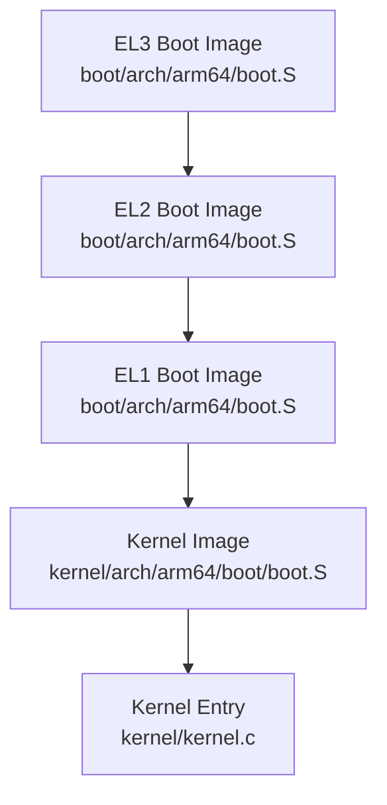
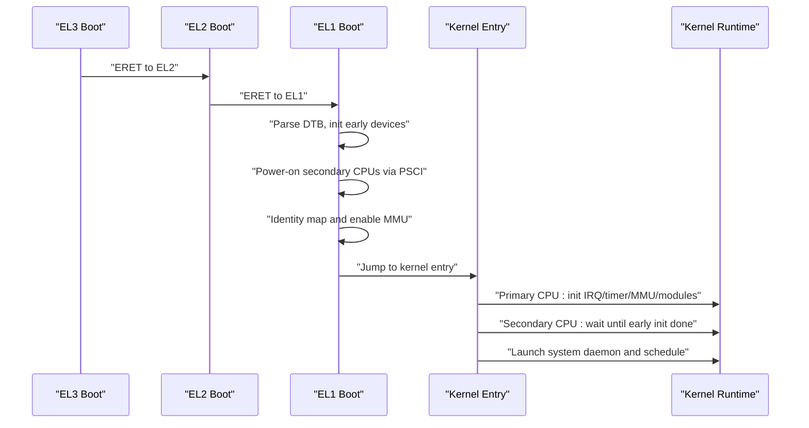
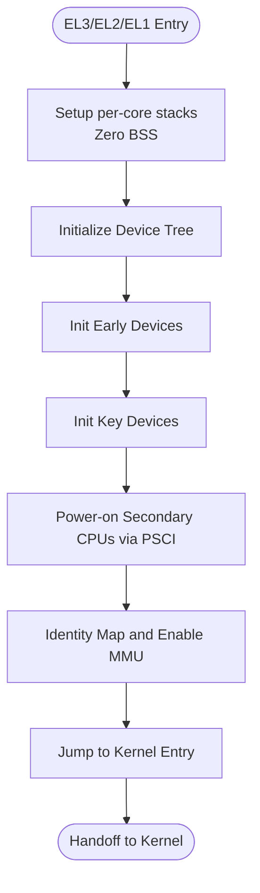
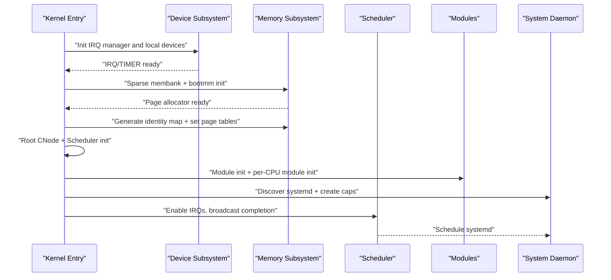
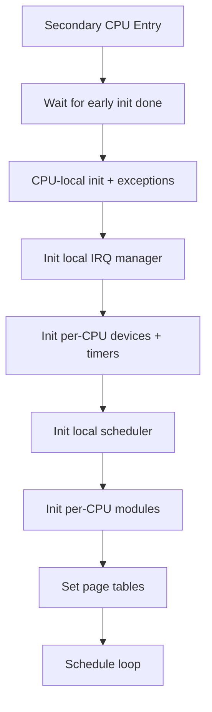
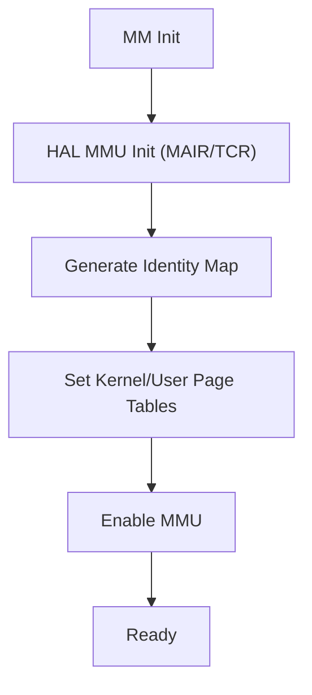
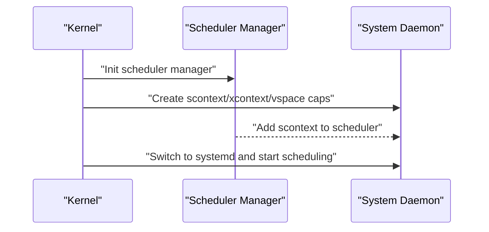
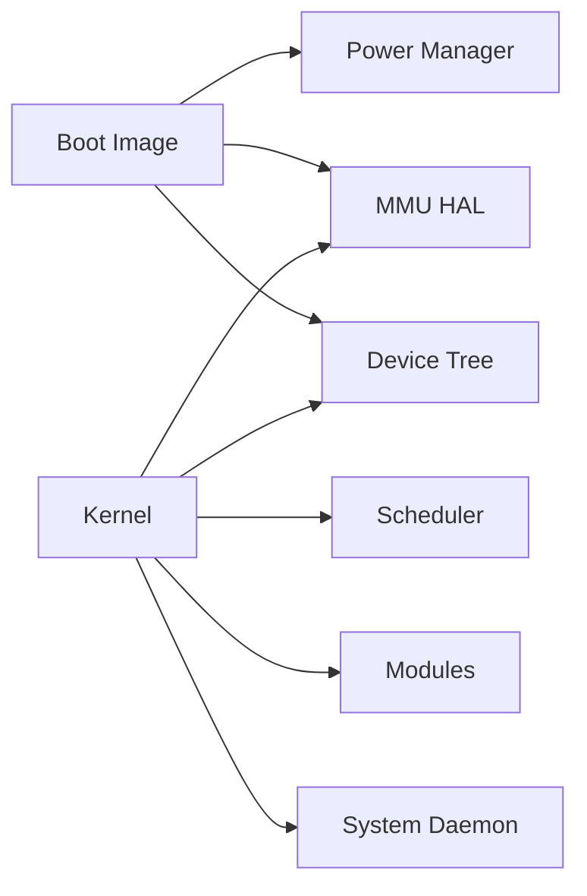

# Kernel Initialization Sequence

<cite>
**Referenced Files in This Document**
- [boot.S](file://boot/arch/arm64/boot.S)
- [boot.c](file://boot/boot.c)
- [remap.c](file://boot/mm/remap.c)
- [bootmm.c](file://boot/mm/bootmm.c)
- [power_manager.c](file://boot/power_manager.c)
- [boot.S](file://kernel/arch/arm64/boot/boot.S)
- [kernel.c](file://kernel/kernel.c)
- [mmu.c](file://kernel/arch/arm64/mmu.c)
- [mm.c](file://kernel/mm/mm.c)
- [device.c](file://kernel/device/device.c)
- [initcall.h](file://kernel/include/initcall.h)
- [module.c](file://kernel/module/module.c)
- [sysproc.c](file://kernel/sysproc.c)
- [sched_mgr.c](file://kernel/schedule/sched_mgr.c)
</cite>

## Table of Contents
1. [Introduction](#introduction)
2. [Project Structure](#project-structure)
3. [Core Components](#core-components)
4. [Architecture Overview](#architecture-overview)
5. [Detailed Component Analysis](#detailed-component-analysis)
6. [Dependency Analysis](#dependency-analysis)
7. [Performance Considerations](#performance-considerations)
8. [Troubleshooting Guide](#troubleshooting-guide)
9. [Conclusion](#conclusion)

## Introduction
This document explains the kernel initialization sequence and core startup procedures across the bootloader and kernel stages. It covers:
- Primary and secondary CPU boot paths
- Kernel entry points and initialization phases
- Establishment of core services and subsystem ordering
- Coordination with user-space services via the system daemon
- Kernel splash screen and memory region reporting
- Timing and critical path for boot completion
- Relationship among kernel initialization, module loading, device initialization, and scheduler setup

## Project Structure
The initialization spans two distinct images:
- Boot image (EL3/EL2/EL1): responsible for early hardware setup, device tree parsing, per-CPU bring-up, identity mapping, and jumping to the kernel image
- Kernel image (EL1): responsible for device subsystems, memory management, scheduler, module loading, and launching the system daemon

**Diagram sources**
- [boot.S](file://boot/arch/arm64/boot.S#L1-L115)
- [boot.S](file://kernel/arch/arm64/boot/boot.S#L1-L68)
- [kernel.c](file://kernel/kernel.c#L125-L224)

**Section sources**
- [boot.S](file://boot/arch/arm64/boot.S#L1-L115)
- [boot.S](file://kernel/arch/arm64/boot/boot.S#L1-L68)

## Core Components
- Bootloader (EL3/EL2/EL1):
  - Early CPU stack setup and BSS clearing
  - Device tree initialization and parsing
  - Early and key device initialization
  - Per-CPU bring-up via PSCI
  - Identity mapping and MMU enablement
  - Jump to kernel entry point
- Kernel (EL1):
  - CPU-local initialization and exception/interrupt setup
  - IRQ and timer subsystem initialization
  - Memory subsystem: sparse memory banks, boot memory allocator, page tables
  - Capability node and address space setup
  - Scheduler initialization and per-CPU scheduler setup
  - Module and per-CPU module initialization
  - System daemon launch and handover to scheduler

**Section sources**
- [boot.c](file://boot/boot.c#L82-L107)
- [boot.c](file://boot/boot.c#L58-L66)
- [remap.c](file://boot/mm/remap.c#L30-L38)
- [kernel.c](file://kernel/kernel.c#L125-L224)

## Architecture Overview
The boot process follows ARM64 exception levels. The boot image initializes hardware and jumps to the kernel. The kernel initializes devices, memory, scheduler, and modules, then launches the system daemon and begins scheduling.

**Diagram sources**
- [boot.S](file://boot/arch/arm64/boot.S#L24-L76)
- [boot.S](file://boot/arch/arm64/boot.S#L78-L103)
- [boot.c](file://boot/boot.c#L82-L107)
- [boot.c](file://boot/boot.c#L47-L56)
- [kernel.c](file://kernel/kernel.c#L125-L224)
- [kernel.c](file://kernel/kernel.c#L61-L123)

## Detailed Component Analysis

### Bootloader Initialization (EL3/EL2/EL1)
- CPU stack allocation per-core and BSS zeroing
- Device tree initialization and dump
- Early and key device initialization
- Per-CPU bring-up using PSCI
- Identity mapping and MMU enablement
- Jump to kernel entry point

**Diagram sources**
- [boot.S](file://boot/arch/arm64/boot.S#L24-L103)
- [boot.c](file://boot/boot.c#L82-L107)
- [remap.c](file://boot/mm/remap.c#L30-L38)

**Section sources**
- [boot.S](file://boot/arch/arm64/boot.S#L1-L115)
- [boot.c](file://boot/boot.c#L82-L107)
- [power_manager.c](file://boot/power_manager.c#L12-L21)

### Kernel Initialization (Primary CPU)
- Console reset and CPU-local init
- Device tree initialization and splash logging
- IRQ manager and local IRQ device enable
- Early and key per-CPU device initialization
- Sparse memory bank and boot memory allocator setup
- Identity page table generation and MMU setup
- Root capability node creation
- Scheduler manager initialization and local scheduler setup
- Module and per-CPU module initialization
- System daemon discovery and capability setup
- Boot memory allocator disable and IRQ enable
- Broadcast completion and system daemon start

**Diagram sources**
- [kernel.c](file://kernel/kernel.c#L125-L224)
- [mm.c](file://kernel/mm/mm.c#L29-L45)
- [mmu.c](file://kernel/arch/arm64/mmu.c#L161-L222)
- [device.c](file://kernel/device/device.c#L32-L54)
- [initcall.h](file://kernel/include/initcall.h#L19-L34)
- [module.c](file://kernel/module/module.c#L8-L18)
- [sysproc.c](file://kernel/sysproc.c#L63-L83)

**Section sources**
- [kernel.c](file://kernel/kernel.c#L125-L224)
- [mm.c](file://kernel/mm/mm.c#L29-L45)
- [mmu.c](file://kernel/arch/arm64/mmu.c#L62-L126)
- [device.c](file://kernel/device/device.c#L32-L54)
- [initcall.h](file://kernel/include/initcall.h#L19-L34)
- [module.c](file://kernel/module/module.c#L8-L18)
- [sysproc.c](file://kernel/sysproc.c#L24-L83)

### Kernel Initialization (Secondary CPU)
- Wait for primary CPU to complete early initialization
- CPU-local init and exception setup
- Local IRQ manager and per-CPU devices
- Local tick timer initialization
- Local scheduler setup
- Per-CPU module initialization
- Identity page table setup and MMU enable
- Enter scheduling loop

**Diagram sources**
- [kernel.c](file://kernel/kernel.c#L61-L123)

**Section sources**
- [kernel.c](file://kernel/kernel.c#L61-L123)

### Memory Management and Page Tables
- HAL MMU initialization: MAIR, TCR, and memory attributes
- Identity map generation for privileged/unprivileged modes
- Setting kernel and user page tables
- Enabling MMU and TLB invalidation

**Diagram sources**
- [mmu.c](file://kernel/arch/arm64/mmu.c#L62-L126)
- [mmu.c](file://kernel/arch/arm64/mmu.c#L161-L222)
- [mm.c](file://kernel/mm/mm.c#L29-L45)

**Section sources**
- [mmu.c](file://kernel/arch/arm64/mmu.c#L62-L126)
- [mmu.c](file://kernel/arch/arm64/mmu.c#L161-L222)
- [mm.c](file://kernel/mm/mm.c#L29-L45)

### Scheduler Setup and System Daemon Handover
- Scheduler manager initialization and local scheduler registration
- Adding the system daemon as a schedule context
- Switching to the system daemon and entering the scheduler loop

**Diagram sources**
- [sched_mgr.c](file://kernel/schedule/sched_mgr.c#L155-L162)
- [sysproc.c](file://kernel/sysproc.c#L24-L83)

**Section sources**
- [sched_mgr.c](file://kernel/schedule/sched_mgr.c#L155-L162)
- [sysproc.c](file://kernel/sysproc.c#L24-L83)

### Splash Screens and Logging
- Bootloader splash: prints core ID and privilege level
- Kernel splash: prints core ID and privilege level
- Memory region reporting: iterates boot memory regions and logs sizes

**Section sources**
- [boot.c](file://boot/boot.c#L27-L32)
- [kernel.c](file://kernel/kernel.c#L31-L48)

## Dependency Analysis
- Boot image depends on:
  - Device tree for CPU topology and device discovery
  - Power manager for PSCI-based CPU bring-up
  - MMU translation routines for identity mapping
- Kernel depends on:
  - Device subsystem for driver registration and initialization
  - Memory subsystem for page allocation and identity mapping
  - Scheduler for dispatching the system daemon
  - Modules for late initialization hooks

**Diagram sources**
- [boot.c](file://boot/boot.c#L82-L107)
- [power_manager.c](file://boot/power_manager.c#L12-L21)
- [mmu.c](file://kernel/arch/arm64/mmu.c#L62-L126)
- [device.c](file://kernel/device/device.c#L13-L26)
- [module.c](file://kernel/module/module.c#L8-L18)
- [sysproc.c](file://kernel/sysproc.c#L63-L83)

**Section sources**
- [boot.c](file://boot/boot.c#L82-L107)
- [power_manager.c](file://boot/power_manager.c#L12-L21)
- [mmu.c](file://kernel/arch/arm64/mmu.c#L62-L126)
- [device.c](file://kernel/device/device.c#L13-L26)
- [module.c](file://kernel/module/module.c#L8-L18)
- [sysproc.c](file://kernel/sysproc.c#L63-L83)

## Performance Considerations
- Minimize work during early boot to reduce boot latency
- Use per-CPU initialization paths to avoid contention
- Keep identity mapping minimal and enable MMU as early as possible
- Batch device initialization calls to reduce overhead
- Ensure scheduler is ready before enabling interrupts on secondary CPUs

## Troubleshooting Guide
- If secondary CPUs fail to start:
  - Verify PSCI registration and compatibility in device tree
  - Confirm per-CPU nodes and enable-method properties
- If MMU fails to enable:
  - Check MAIR/TCR configuration and supported physical address width
  - Ensure identity map generation succeeds and page tables are set
- If system daemon does not launch:
  - Confirm device tree contains the system daemon node and address
  - Verify capability creation and scheduler registration steps

**Section sources**
- [power_manager.c](file://boot/power_manager.c#L12-L21)
- [mmu.c](file://kernel/arch/arm64/mmu.c#L62-L126)
- [sysproc.c](file://kernel/sysproc.c#L24-L83)

## Conclusion
The kernel initialization sequence establishes a robust foundation for system services by carefully orchestrating early hardware setup, device discovery, memory management, and scheduler readiness. The bootloader’s role is to prepare the environment and jump to the kernel, while the kernel’s role is to initialize subsystems in the correct order, coordinate with modules and devices, and hand off control to the system daemon. The documented paths and diagrams provide a clear understanding of the critical boot path and serve as a guide for further development and troubleshooting.