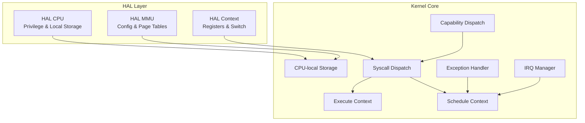
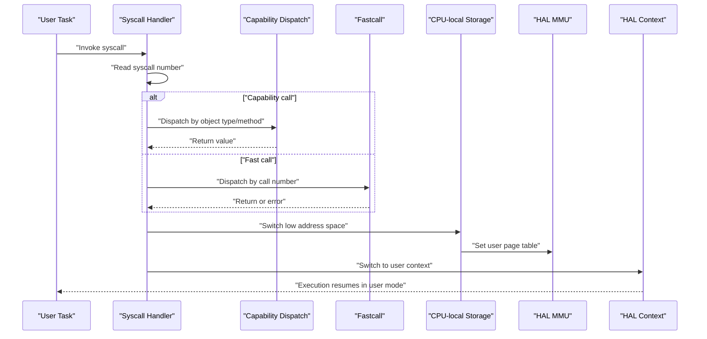
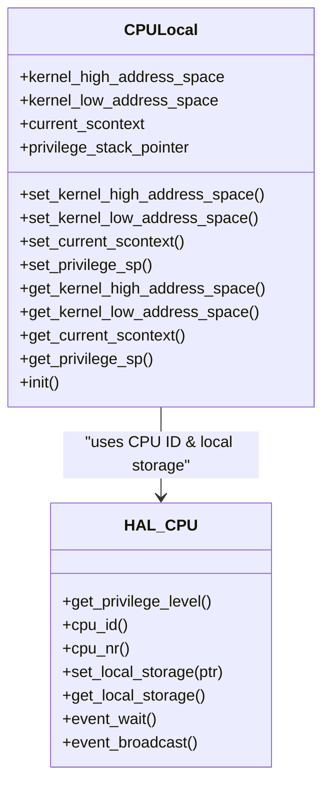
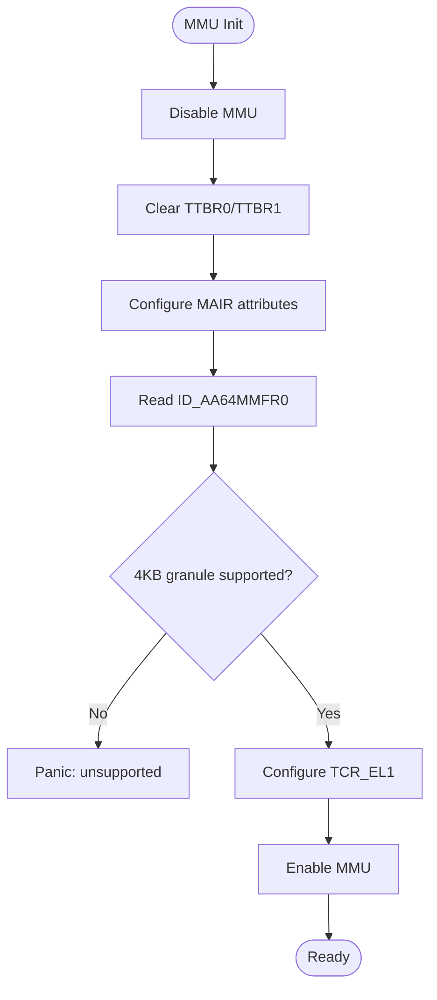
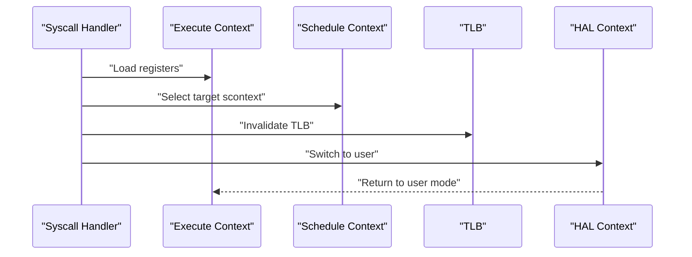
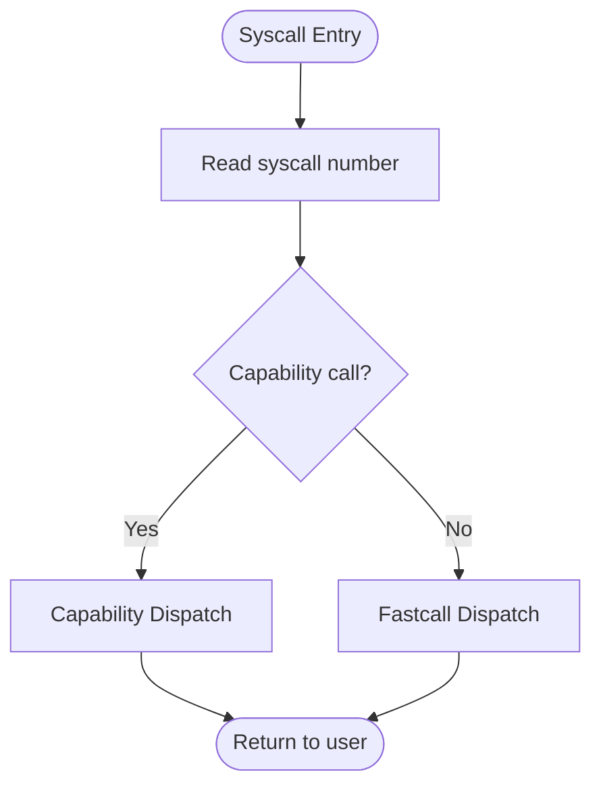
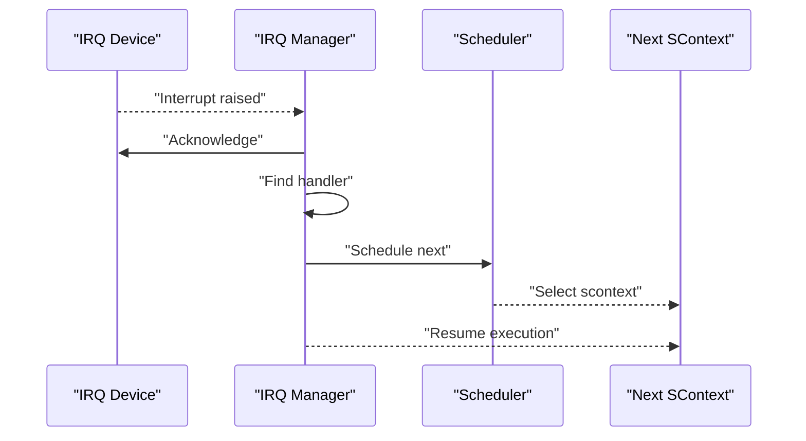
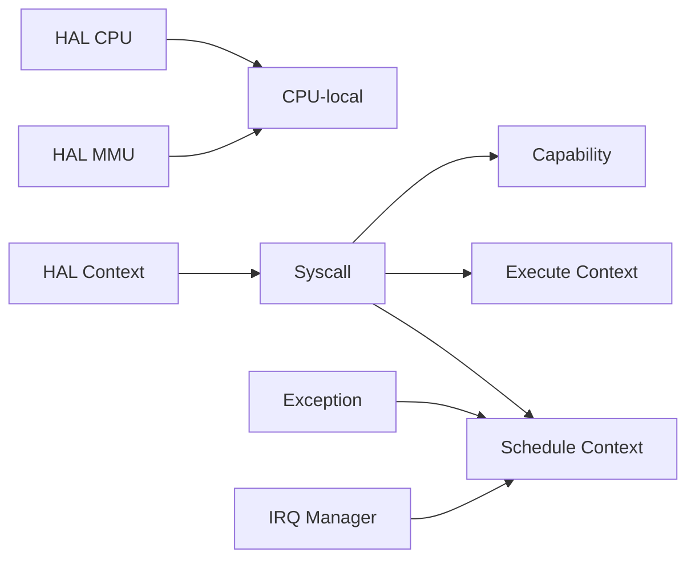

# System Abstractions and Interfaces

<cite>
**Referenced Files in This Document**
- [core.h](file://kernel/include/core.h)
- [cpulocal.c](file://kernel/cpulocal.c)
- [cpulocal.h](file://kernel/include/cpulocal.h)
- [cpu.c](file://kernel/arch/arm64/cpu.c)
- [scontext.c](file://kernel/context/scontext.c)
- [xcontext.c](file://kernel/context/xcontext.c)
- [syscall.c](file://kernel/syscall/syscall.c)
- [fastcall.c](file://kernel/syscall/fastcall.c)
- [exception.c](file://kernel/exception/exception.c)
- [irq_mgr.c](file://kernel/interrupt/irq_mgr.c)
- [capability.c](file://kernel/capability/capability.c)
- [mmu.c](file://kernel/arch/arm64/mmu.c)
- [hal_mmu.h](file://kernel/include/arch/generic/hal_mmu.h)
- [hal_context.h](file://kernel/include/arch/generic/hal_context.h)
</cite>

## Table of Contents
1. [Introduction](#introduction)
2. [Project Structure](#project-structure)
3. [Core Components](#core-components)
4. [Architecture Overview](#architecture-overview)
5. [Detailed Component Analysis](#detailed-component-analysis)
6. [Dependency Analysis](#dependency-analysis)
7. [Performance Considerations](#performance-considerations)
8. [Troubleshooting Guide](#troubleshooting-guide)
9. [Conclusion](#conclusion)

## Introduction
This document explains the kernel’s system abstractions and interfaces, focusing on how the kernel organizes its core services into modular layers. It covers CPU-local storage mechanisms, context switching interfaces, system call abstractions, hardware abstraction via HAL, privilege level management, and system boundary enforcement. The kernel’s design emphasizes modularity and microkernel characteristics by separating concerns across architecture-specific HAL layers, memory management, scheduling contexts, and capability-based IPC.

## Project Structure
The kernel is organized into layered components:
- Architecture-specific HAL (ARM64): CPU privilege, MMU, registers, and assembly entry/switch code.
- Core subsystems: memory management, interrupts, exceptions, scheduling contexts, and system call dispatch.
- Capability system: object-capability dispatch for IPC and resource control.
- Boot and initialization: early boot, memory layout, and core initialization entry.

**Diagram sources**
- [cpu.c](file://kernel/arch/arm64/cpu.c#L1-L44)
- [hal_mmu.h](file://kernel/include/arch/generic/hal_mmu.h#L1-L28)
- [hal_context.h](file://kernel/include/arch/generic/hal_context.h#L1-L24)
- [cpulocal.c](file://kernel/cpulocal.c#L1-L59)
- [syscall.c](file://kernel/syscall/syscall.c#L1-L20)
- [exception.c](file://kernel/exception/exception.c#L1-L36)
- [irq_mgr.c](file://kernel/interrupt/irq_mgr.c#L1-L142)
- [scontext.c](file://kernel/context/scontext.c#L1-L68)
- [xcontext.c](file://kernel/context/xcontext.c#L1-L15)
- [capability.c](file://kernel/capability/capability.c#L1-L58)

**Section sources**
- [core.h](file://kernel/include/core.h#L1-L9)
- [cpulocal.h](file://kernel/include/cpulocal.h#L1-L32)

## Core Components
- CPU-local storage: per-CPU state including kernel/user address spaces, current schedule context, and privilege stack pointer. Exposed via setters/getters and initialized with HAL CPU local storage.
- Privilege and CPU abstraction: HAL CPU reads CurrentEL to determine privilege level, exposes CPU ID and local storage pointers.
- Memory management: HAL MMU initializes TCR/MAIR, enables/disables MMU, sets page tables, and creates identity maps with appropriate attributes.
- Contexts: Execute context holds user/kernel register state; Schedule context tracks sleep/ready states and integrates with timers and scheduler.
- System call and capability dispatch: Syscall handler routes to capability or fastcall paths; capability dispatch decodes object type and method.
- Interrupts and exceptions: IRQ manager acknowledges devices, finds handlers, schedules next context; exception handler logs and invokes upcalls or dumps cores.

**Section sources**
- [cpulocal.c](file://kernel/cpulocal.c#L1-L59)
- [cpulocal.h](file://kernel/include/cpulocal.h#L1-L32)
- [cpu.c](file://kernel/arch/arm64/cpu.c#L1-L44)
- [mmu.c](file://kernel/arch/arm64/mmu.c#L1-L231)
- [hal_mmu.h](file://kernel/include/arch/generic/hal_mmu.h#L1-L28)
- [xcontext.c](file://kernel/context/xcontext.c#L1-L15)
- [scontext.c](file://kernel/context/scontext.c#L1-L68)
- [syscall.c](file://kernel/syscall/syscall.c#L1-L20)
- [fastcall.c](file://kernel/syscall/fastcall.c#L1-L18)
- [capability.c](file://kernel/capability/capability.c#L1-L58)
- [irq_mgr.c](file://kernel/interrupt/irq_mgr.c#L1-L142)
- [exception.c](file://kernel/exception/exception.c#L1-L36)

## Architecture Overview
The kernel enforces system boundaries and modularity through explicit interfaces:
- HAL layers abstract architecture-specific details (CPU, MMU, context).
- CPU-local storage binds kernel state to CPUs and ensures isolation.
- Address-space switching mediates between kernel and user page tables.
- Syscall and capability dispatch provide controlled entry points.
- Exceptions and interrupts integrate with scheduling and upcall mechanisms.

**Diagram sources**
- [syscall.c](file://kernel/syscall/syscall.c#L1-L20)
- [capability.c](file://kernel/capability/capability.c#L1-L58)
- [fastcall.c](file://kernel/syscall/fastcall.c#L1-L18)
- [cpulocal.c](file://kernel/cpulocal.c#L1-L59)
- [mmu.c](file://kernel/arch/arm64/mmu.c#L1-L231)
- [hal_context.h](file://kernel/include/arch/generic/hal_context.h#L1-L24)

## Detailed Component Analysis

### CPU-local Storage and Privilege Management
- Per-CPU state includes kernel-high/low address spaces, current schedule context, and privilege stack pointer.
- HAL CPU stores a pointer to the CPU-local block in TPIDR_EL1 and retrieves it on subsequent accesses.
- Privilege level is derived from CurrentEL; CPU ID is extracted from MPIDR_EL1.

**Diagram sources**
- [cpulocal.h](file://kernel/include/cpulocal.h#L1-L32)
- [cpulocal.c](file://kernel/cpulocal.c#L1-L59)
- [cpu.c](file://kernel/arch/arm64/cpu.c#L1-L44)

**Section sources**
- [cpulocal.c](file://kernel/cpulocal.c#L1-L59)
- [cpulocal.h](file://kernel/include/cpulocal.h#L1-L32)
- [cpu.c](file://kernel/arch/arm64/cpu.c#L1-L44)

### Memory Management and Address-Space Switching
- HAL MMU initializes MAIR and TCR, validates granule support, and configures translation controls.
- Kernel sets TTBR1 for privileged code; user tasks use TTBR0 after capability invocation.
- Identity mapping creation supports privileged/unprivileged mappings with appropriate XN/AP bits.

**Diagram sources**
- [mmu.c](file://kernel/arch/arm64/mmu.c#L1-L231)
- [hal_mmu.h](file://kernel/include/arch/generic/hal_mmu.h#L1-L28)

**Section sources**
- [mmu.c](file://kernel/arch/arm64/mmu.c#L1-L231)
- [hal_mmu.h](file://kernel/include/arch/generic/hal_mmu.h#L1-L28)

### Context Switching Interfaces
- Execute context encapsulates register state; HAL context initializes common registers and user entry.
- Schedule context manages lifecycle (ready/sleep) and integrates with timers and scheduler.
- Syscall handler switches address spaces and invokes HAL to resume user execution.

**Diagram sources**
- [xcontext.c](file://kernel/context/xcontext.c#L1-L15)
- [scontext.c](file://kernel/context/scontext.c#L1-L68)
- [syscall.c](file://kernel/syscall/syscall.c#L1-L20)
- [hal_context.h](file://kernel/include/arch/generic/hal_context.h#L1-L24)

**Section sources**
- [xcontext.c](file://kernel/context/xcontext.c#L1-L15)
- [scontext.c](file://kernel/context/scontext.c#L1-L68)
- [syscall.c](file://kernel/syscall/syscall.c#L1-L20)
- [hal_context.h](file://kernel/include/arch/generic/hal_context.h#L1-L24)

### System Call Abstractions and Capability Dispatch
- Syscall handler reads the syscall number and branches to capability or fastcall paths.
- Capability dispatch decodes object type and method, routing to specialized handlers.
- Fastcall path currently logs unknown calls and triggers core dump.

**Diagram sources**
- [syscall.c](file://kernel/syscall/syscall.c#L1-L20)
- [capability.c](file://kernel/capability/capability.c#L1-L58)
- [fastcall.c](file://kernel/syscall/fastcall.c#L1-L18)

**Section sources**
- [syscall.c](file://kernel/syscall/syscall.c#L1-L20)
- [capability.c](file://kernel/capability/capability.c#L1-L58)
- [fastcall.c](file://kernel/syscall/fastcall.c#L1-L18)

### Interrupt and Exception Handling
- IRQ manager acknowledges devices, locates registered handlers, and schedules the next context.
- Exception handler logs synchronous faults; data faults outside user range trigger core dump; otherwise upcall is invoked.

**Diagram sources**
- [irq_mgr.c](file://kernel/interrupt/irq_mgr.c#L1-L142)

**Section sources**
- [irq_mgr.c](file://kernel/interrupt/irq_mgr.c#L1-L142)
- [exception.c](file://kernel/exception/exception.c#L1-L36)

## Dependency Analysis
The kernel’s modularity emerges from clear dependency boundaries:
- HAL modules depend on architecture-specific registers and assembly but expose stable interfaces.
- CPU-local storage depends on HAL CPU and MMU for address space identifiers.
- Syscall and exception paths depend on HAL context/MMU and scheduler integration.
- Capability dispatch depends on HAL context and capability object implementations.

**Diagram sources**
- [cpu.c](file://kernel/arch/arm64/cpu.c#L1-L44)
- [mmu.c](file://kernel/arch/arm64/mmu.c#L1-L231)
- [cpulocal.c](file://kernel/cpulocal.c#L1-L59)
- [hal_context.h](file://kernel/include/arch/generic/hal_context.h#L1-L24)
- [syscall.c](file://kernel/syscall/syscall.c#L1-L20)
- [capability.c](file://kernel/capability/capability.c#L1-L58)
- [exception.c](file://kernel/exception/exception.c#L1-L36)
- [irq_mgr.c](file://kernel/interrupt/irq_mgr.c#L1-L142)

**Section sources**
- [cpulocal.c](file://kernel/cpulocal.c#L1-L59)
- [cpu.c](file://kernel/arch/arm64/cpu.c#L1-L44)
- [mmu.c](file://kernel/arch/arm64/mmu.c#L1-L231)
- [hal_context.h](file://kernel/include/arch/generic/hal_context.h#L1-L24)
- [syscall.c](file://kernel/syscall/syscall.c#L1-L20)
- [capability.c](file://kernel/capability/capability.c#L1-L58)
- [exception.c](file://kernel/exception/exception.c#L1-L36)
- [irq_mgr.c](file://kernel/interrupt/irq_mgr.c#L1-L142)

## Performance Considerations
- CPU-local storage minimizes contention by keeping per-CPU state in fast-access registers and arrays.
- TLB invalidation occurs only when necessary (e.g., during MMU enable/disable or address-space switches).
- Syscall dispatch avoids unnecessary work by branching quickly to capability or fastcall paths.
- Scheduler integration in IRQ path ensures timely preemption and context selection.

## Troubleshooting Guide
- Privilege mismatch: verify CurrentEL interpretation and ensure correct privilege transitions.
- Address-space errors: confirm TTBR0/TTBR1 updates and identity map creation for kernel/user modes.
- Syscall failures: check capability object type/method decoding and return value propagation.
- IRQ not handled: validate device ACK/EIO, handler registration, and scheduler selection.
- Exceptions: inspect exception type and fault address to distinguish between upcall and core dump paths.

**Section sources**
- [cpu.c](file://kernel/arch/arm64/cpu.c#L1-L44)
- [mmu.c](file://kernel/arch/arm64/mmu.c#L1-L231)
- [capability.c](file://kernel/capability/capability.c#L1-L58)
- [irq_mgr.c](file://kernel/interrupt/irq_mgr.c#L1-L142)
- [exception.c](file://kernel/exception/exception.c#L1-L36)

## Conclusion
The kernel’s abstraction layers—HAL CPU, MMU, and context—enable clean separation of concerns while enforcing strict system boundaries. CPU-local storage and address-space switching provide efficient, isolated execution environments. Capability-based dispatch and controlled syscall entry preserve modularity and microkernel characteristics, allowing other kernel components to integrate via well-defined interfaces.