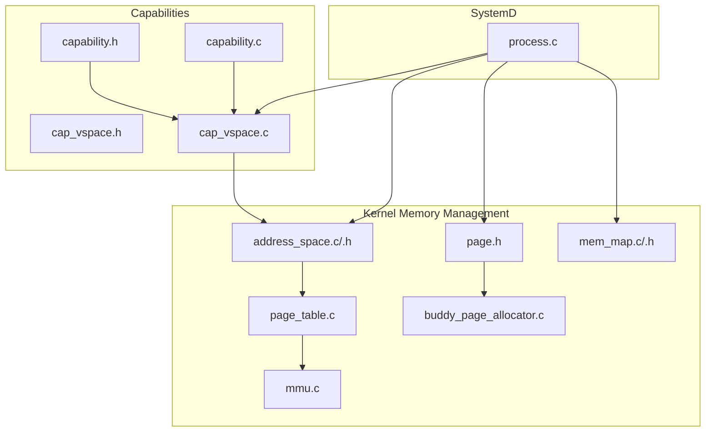
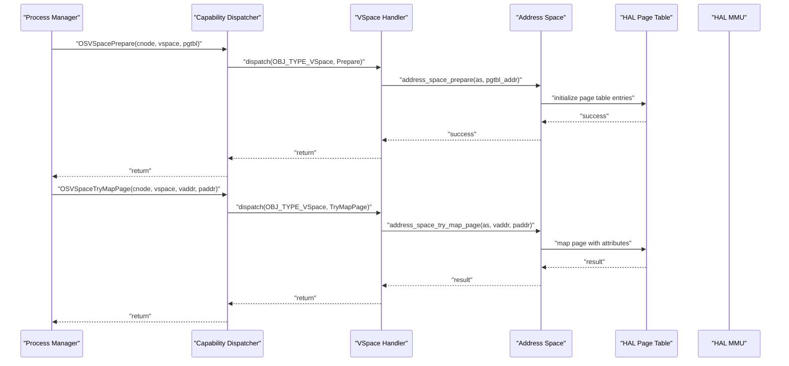
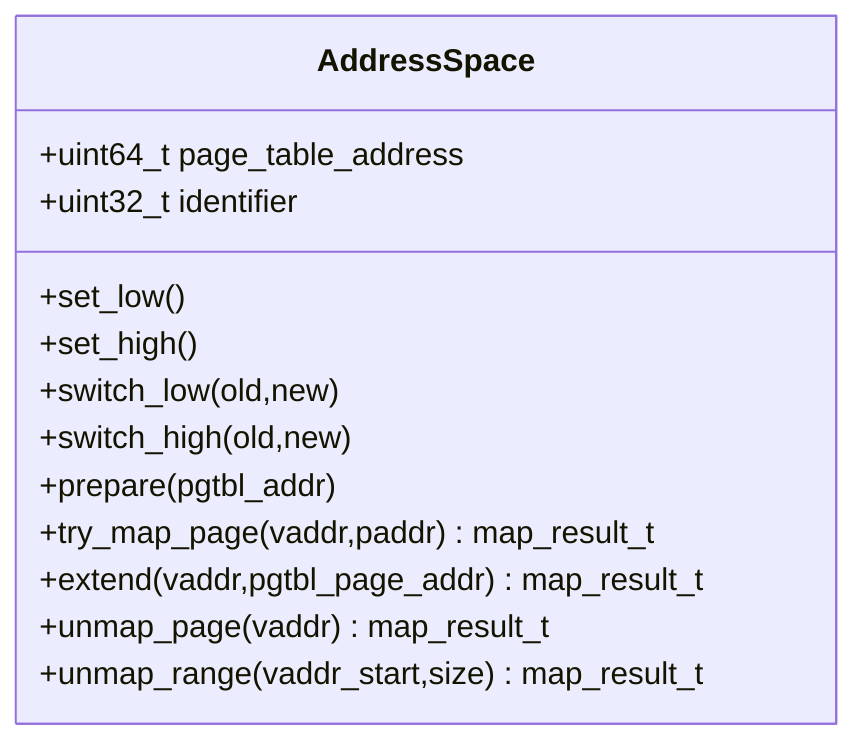
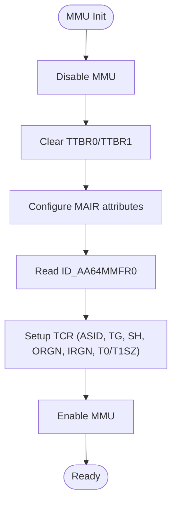
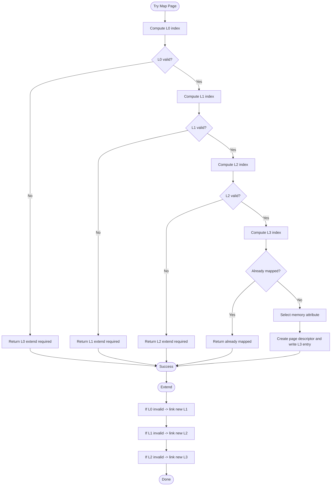
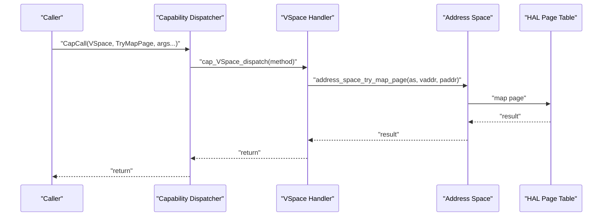
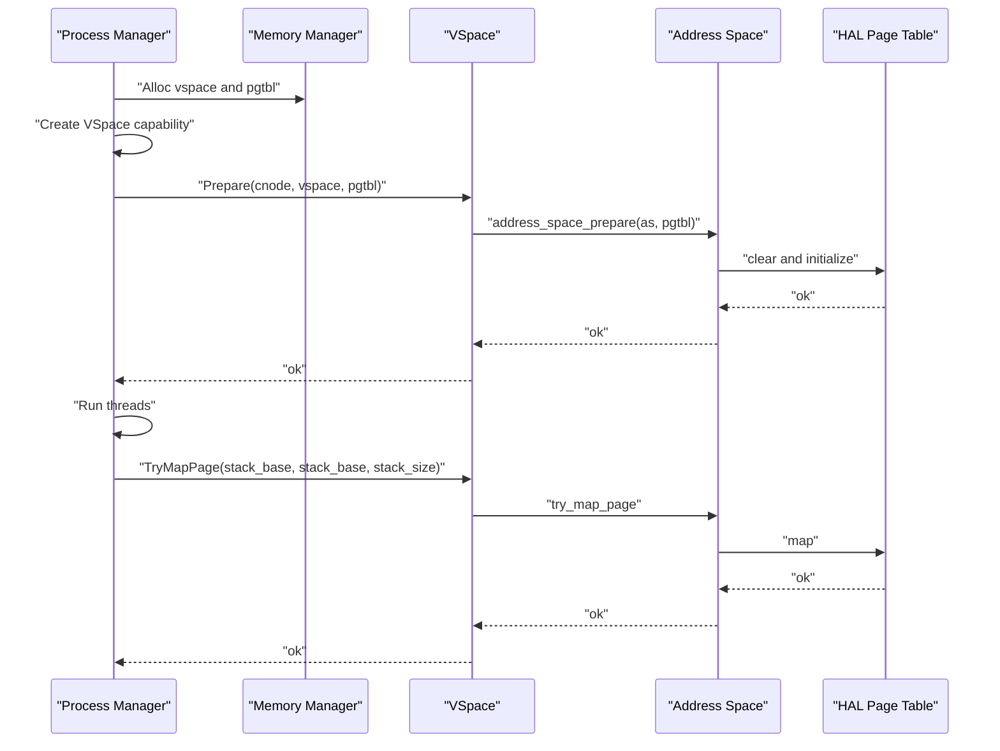
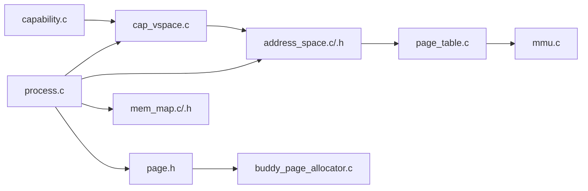

# Address Space Management

<cite>
**Referenced Files in This Document**
- [address_space.c](file://kernel/mm/address_space.c)
- [address_space.h](file://kernel/include/mm/address_space.h)
- [mmu.c](file://kernel/arch/arm64/mmu.c)
- [page_table.c](file://kernel/arch/arm64/page_table.c)
- [cap_vspace.h](file://kernel/include/capability/cap_vspace.h)
- [cap_vspace.c](file://kernel/capability/cap_vspace.c)
- [process.c](file://kernel/systemd/procmgr/process.c)
- [page.h](file://kernel/include/mm/page.h)
- [buddy_page_allocator.c](file://kernel/mm/impl/buddy_page_allocator.c)
- [mem_map.h](file://kernel/include/mm/mem_map.h)
- [mem_map.c](file://kernel/mm/mem_map.c)
- [capability.h](file://kernel/include/capability/capability.h)
- [capability.c](file://kernel/capability/capability.c)
</cite>

## Table of Contents
1. [Introduction](#introduction)
2. [Project Structure](#project-structure)
3. [Core Components](#core-components)
4. [Architecture Overview](#architecture-overview)
5. [Detailed Component Analysis](#detailed-component-analysis)
6. [Dependency Analysis](#dependency-analysis)
7. [Performance Considerations](#performance-considerations)
8. [Troubleshooting Guide](#troubleshooting-guide)
9. [Conclusion](#conclusion)
10. [Appendices](#appendices)

## Introduction
This document explains address space management in TranquilOS, focusing on process address space lifecycle, virtual memory region allocation, memory mapping operations, and isolation between processes. It also documents shared memory, copy-on-write mechanisms, memory protection boundaries, per-process page table management, and integration with the capability-based security model for memory access control. Where applicable, it highlights current implementation status and areas requiring completion.

## Project Structure
Address space management spans several subsystems:
- Generic address space abstraction and HAL interfaces
- ARM64 MMU configuration and page table manipulation
- Capability-based dispatch for virtual space operations
- Process manager orchestration for address space creation and teardown
- Page allocation and memory region metadata

**Diagram sources**
- [address_space.c](file://kernel/mm/address_space.c#L1-L105)
- [address_space.h](file://kernel/include/mm/address_space.h#L1-L43)
- [page_table.c](file://kernel/arch/arm64/page_table.c#L1-L167)
- [mmu.c](file://kernel/arch/arm64/mmu.c#L1-L231)
- [process.c](file://kernel/systemd/procmgr/process.c#L1-L442)
- [cap_vspace.h](file://kernel/include/capability/cap_vspace.h#L1-L12)
- [cap_vspace.c](file://kernel/capability/cap_vspace.c#L1-L243)
- [capability.h](file://kernel/include/capability/capability.h#L1-L26)
- [capability.c](file://kernel/capability/capability.c#L1-L58)
- [page.h](file://kernel/include/mm/page.h#L1-L31)
- [buddy_page_allocator.c](file://kernel/mm/impl/buddy_page_allocator.c#L1-L27)
- [mem_map.c](file://kernel/mm/mem_map.c#L1-L64)
- [mem_map.h](file://kernel/include/mm/mem_map.h#L1-L29)

**Section sources**
- [address_space.c](file://kernel/mm/address_space.c#L1-L105)
- [address_space.h](file://kernel/include/mm/address_space.h#L1-L43)
- [mmu.c](file://kernel/arch/arm64/mmu.c#L1-L231)
- [page_table.c](file://kernel/arch/arm64/page_table.c#L1-L167)
- [cap_vspace.h](file://kernel/include/capability/cap_vspace.h#L1-L12)
- [cap_vspace.c](file://kernel/capability/cap_vspace.c#L1-L243)
- [process.c](file://kernel/systemd/procmgr/process.c#L1-L442)
- [page.h](file://kernel/include/mm/page.h#L1-L31)
- [buddy_page_allocator.c](file://kernel/mm/impl/buddy_page_allocator.c#L1-L27)
- [mem_map.h](file://kernel/include/mm/mem_map.h#L1-L29)
- [mem_map.c](file://kernel/mm/mem_map.c#L1-L64)
- [capability.h](file://kernel/include/capability/capability.h#L1-L26)
- [capability.c](file://kernel/capability/capability.c#L1-L58)

## Core Components
- Address space abstraction: encapsulates a process’s page table pointer and identifier, and exposes operations to set, switch, prepare, map/unmap pages and ranges, and extend page tables.
- HAL MMU: ARM64-specific MMU initialization, enabling/disabling, and switching user/kernel page tables.
- Page table manipulation: four-level page table mapping and extension logic with memory attribute selection.
- Capability-based virtual space: capability dispatch for creating, preparing, mapping, extending, and unmapping virtual memory regions.
- Process manager: orchestrates address space creation, prepares page tables, and performs per-thread mappings during process startup.
- Page allocation: page structures and allocator stubs for allocating physical pages backing virtual mappings.
- Boot memory regions: metadata describing kernel text, rodata, data, bss, and kernel stack regions.

**Section sources**
- [address_space.h](file://kernel/include/mm/address_space.h#L19-L22)
- [address_space.c](file://kernel/mm/address_space.c#L9-L105)
- [mmu.c](file://kernel/arch/arm64/mmu.c#L62-L159)
- [page_table.c](file://kernel/arch/arm64/page_table.c#L9-L167)
- [cap_vspace.c](file://kernel/capability/cap_vspace.c#L8-L243)
- [process.c](file://kernel/systemd/procmgr/process.c#L257-L294)
- [page.h](file://kernel/include/mm/page.h#L23-L29)
- [buddy_page_allocator.c](file://kernel/mm/impl/buddy_page_allocator.c#L6-L27)
- [mem_map.c](file://kernel/mm/mem_map.c#L20-L64)

## Architecture Overview
The address space architecture integrates capability-based dispatch with ARM64 MMU and page table management. Processes own a virtual space capability that grants rights to prepare, map, extend, and unmap memory. The capability handler validates capabilities and invokes the generic address space routines, which delegate to HAL page table operations. MMU configuration sets up translation control and memory attributes.

**Diagram sources**
- [process.c](file://kernel/systemd/procmgr/process.c#L284-L291)
- [capability.c](file://kernel/capability/capability.c#L14-L58)
- [cap_vspace.c](file://kernel/capability/cap_vspace.c#L15-L85)
- [address_space.c](file://kernel/mm/address_space.c#L51-L93)
- [page_table.c](file://kernel/arch/arm64/page_table.c#L9-L94)
- [mmu.c](file://kernel/arch/arm64/mmu.c#L128-L159)

## Detailed Component Analysis

### Address Space Abstraction
The address space abstraction defines the per-process page table pointer and identifier, and provides:
- Set kernel/user page tables
- Switch between address spaces with TLB invalidation
- Prepare page tables
- Map/unmap single pages and ranges
- Extend page tables to new levels

**Diagram sources**
- [address_space.h](file://kernel/include/mm/address_space.h#L19-L41)
- [address_space.c](file://kernel/mm/address_space.c#L9-L105)

**Section sources**
- [address_space.h](file://kernel/include/mm/address_space.h#L1-L43)
- [address_space.c](file://kernel/mm/address_space.c#L1-L105)

### HAL MMU (ARM64)
The HAL MMU configures translation control registers, memory attributes, and enables/disables the MMU. It supports separate page tables for kernel and user via TTBR0/TTBR1 and sets up 48-bit VA with 4KB granules and four-level page tables.

**Diagram sources**
- [mmu.c](file://kernel/arch/arm64/mmu.c#L62-L126)

**Section sources**
- [mmu.c](file://kernel/arch/arm64/mmu.c#L62-L159)

### Page Table Manipulation (ARM64)
The HAL page table implementation:
- Validates four-level entries and returns failure codes for missing intermediate tables
- Extends page tables by allocating new level-N tables and linking them
- Maps leaf pages with appropriate memory attributes (Device vs Normal)
- Sets access permissions and attributes based on address ranges

**Diagram sources**
- [page_table.c](file://kernel/arch/arm64/page_table.c#L9-L167)

**Section sources**
- [page_table.c](file://kernel/arch/arm64/page_table.c#L1-L167)

### Capability-Based Virtual Space Operations
The VSpace capability dispatch exposes methods to:
- Create/destroy virtual spaces
- Prepare page tables
- Try map/unmap single pages and ranges
- Extend page tables

**Diagram sources**
- [capability.c](file://kernel/capability/capability.c#L14-L58)
- [cap_vspace.c](file://kernel/capability/cap_vspace.c#L213-L243)
- [address_space.c](file://kernel/mm/address_space.c#L59-L69)
- [page_table.c](file://kernel/arch/arm64/page_table.c#L9-L94)

**Section sources**
- [cap_vspace.h](file://kernel/include/capability/cap_vspace.h#L1-L12)
- [cap_vspace.c](file://kernel/capability/cap_vspace.c#L1-L243)
- [capability.h](file://kernel/include/capability/capability.h#L1-L26)
- [capability.c](file://kernel/capability/capability.c#L1-L58)

### Process Address Space Lifecycle
The process manager:
- Allocates kernel-side objects for virtual space and page tables
- Creates a VSpace capability and prepares its page table
- During process run, assigns VSpace to each thread, maps stacks, and initializes execution contexts

**Diagram sources**
- [process.c](file://kernel/systemd/procmgr/process.c#L257-L294)
- [process.c](file://kernel/systemd/procmgr/process.c#L150-L174)
- [cap_vspace.c](file://kernel/capability/cap_vspace.c#L15-L43)
- [address_space.c](file://kernel/mm/address_space.c#L51-L57)
- [page_table.c](file://kernel/arch/arm64/page_table.c#L9-L94)

**Section sources**
- [process.c](file://kernel/systemd/procmgr/process.c#L1-L442)

### Memory Protection Boundaries and Attributes
- Memory attributes are configured via MAIR and selected per mapping based on physical address ranges (e.g., Device vs Normal).
- Access permissions and privilege settings are encoded in page table descriptors.
- The MMU configuration sets up shareability, cacheability, and granule sizes appropriate for ARM64.

**Section sources**
- [mmu.c](file://kernel/arch/arm64/mmu.c#L52-L125)
- [page_table.c](file://kernel/arch/arm64/page_table.c#L72-L93)

### Copy-on-Write and Shared Memory
- Current implementation focuses on direct mapping and page table extension. Copy-on-write and explicit shared memory constructs are not present in the analyzed files. These would typically involve:
  - Reference-counted page table entries
  - Dirty bit tracking and fault handlers
  - Capability-based sharing policies

[No sources needed since this section synthesizes missing features conceptually]

### Address Space Isolation Between Processes
- Each process has its own VSpace capability and distinct page table pointer.
- Kernel and user page tables are switched via TTBR0/TTBR1.
- TLB invalidation occurs on address space switches to prevent cross-process aliasing.

**Section sources**
- [address_space.c](file://kernel/mm/address_space.c#L25-L49)
- [mmu.c](file://kernel/arch/arm64/mmu.c#L153-L159)

### Inter-Process Memory Sharing and File/Device Mapping
- The capability dispatch supports mapping operations but does not implement inter-process shared mappings or file/device mapping in the analyzed code.
- Such features would typically integrate with:
  - Capability-based sharing tokens
  - File system and device drivers exposing memory-like regions
  - Reference counting and unmap semantics

[No sources needed since this section describes missing integrations conceptually]

### Address Space Layout Randomization (ASLR)
- No ASLR implementation is present in the analyzed files. ASLR would typically randomize initial user-space mappings and page table locations.

[No sources needed since this section describes missing feature conceptually]

### Memory Layout Optimization
- The code establishes a four-level page table scheme with 4KB granules and 48-bit VA space.
- Boot memory regions are described for kernel segments, enabling early memory layout awareness.

**Section sources**
- [mmu.c](file://kernel/arch/arm64/mmu.c#L224-L231)
- [mem_map.c](file://kernel/mm/mem_map.c#L20-L64)

## Dependency Analysis

**Diagram sources**
- [process.c](file://kernel/systemd/procmgr/process.c#L1-L442)
- [address_space.c](file://kernel/mm/address_space.c#L1-L105)
- [page_table.c](file://kernel/arch/arm64/page_table.c#L1-L167)
- [mmu.c](file://kernel/arch/arm64/mmu.c#L1-L231)
- [cap_vspace.c](file://kernel/capability/cap_vspace.c#L1-L243)
- [capability.c](file://kernel/capability/capability.c#L1-L58)
- [page.h](file://kernel/include/mm/page.h#L1-L31)
- [buddy_page_allocator.c](file://kernel/mm/impl/buddy_page_allocator.c#L1-L27)
- [mem_map.c](file://kernel/mm/mem_map.c#L1-L64)

**Section sources**
- [process.c](file://kernel/systemd/procmgr/process.c#L1-L442)
- [address_space.c](file://kernel/mm/address_space.c#L1-L105)
- [page_table.c](file://kernel/arch/arm64/page_table.c#L1-L167)
- [mmu.c](file://kernel/arch/arm64/mmu.c#L1-L231)
- [cap_vspace.c](file://kernel/capability/cap_vspace.c#L1-L243)
- [capability.c](file://kernel/capability/capability.c#L1-L58)
- [page.h](file://kernel/include/mm/page.h#L1-L31)
- [buddy_page_allocator.c](file://kernel/mm/impl/buddy_page_allocator.c#L1-L27)
- [mem_map.c](file://kernel/mm/mem_map.c#L1-L64)

## Performance Considerations
- Four-level page tables with 4KB granules balance granularity and overhead; ensure minimal intermediate table allocations by pre-extending when possible.
- Batch mapping/unmapping operations reduce repeated capability calls and TLB churn.
- Using appropriate memory attributes avoids unnecessary cache pollution and improves I/O performance.

[No sources needed since this section provides general guidance]

## Troubleshooting Guide
Common issues and diagnostics:
- Null address space or uninitialized page table: panics occur when attempting operations without preparation.
- Mapping failures due to missing intermediate page table levels: extend page tables before mapping.
- Unmap operations currently return success; implement proper unmap logic to avoid leaking mappings.

**Section sources**
- [address_space.c](file://kernel/mm/address_space.c#L59-L105)
- [page_table.c](file://kernel/arch/arm64/page_table.c#L16-L23)
- [page_table.c](file://kernel/arch/arm64/page_table.c#L32-L55)

## Conclusion
TranquilOS implements a clean separation between generic address space operations and ARM64-specific MMU/page table logic, with capability-based access control for virtual space operations. The process manager creates and prepares per-process address spaces, while the HAL ensures correct translation and memory attributes. Current gaps include full unmap support, copy-on-write, explicit shared memory, inter-process sharing, and ASLR. These can be incrementally integrated with the existing HAL and capability framework.

## Appendices

### Appendix A: Boot Memory Regions
Boot-time memory regions describe kernel text, rodata, data, bss, and kernel stack segments for early memory management.

**Section sources**
- [mem_map.h](file://kernel/include/mm/mem_map.h#L7-L23)
- [mem_map.c](file://kernel/mm/mem_map.c#L20-L64)