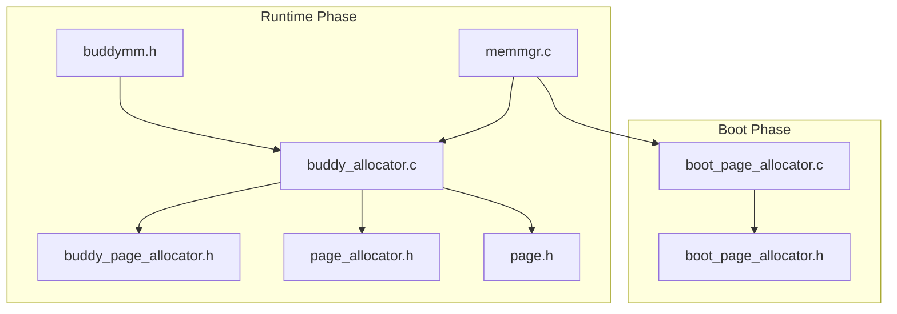
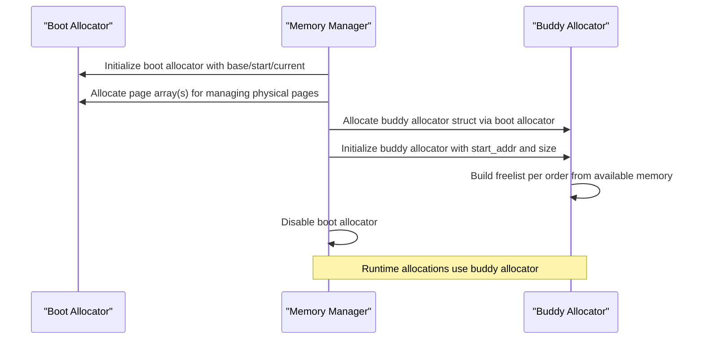
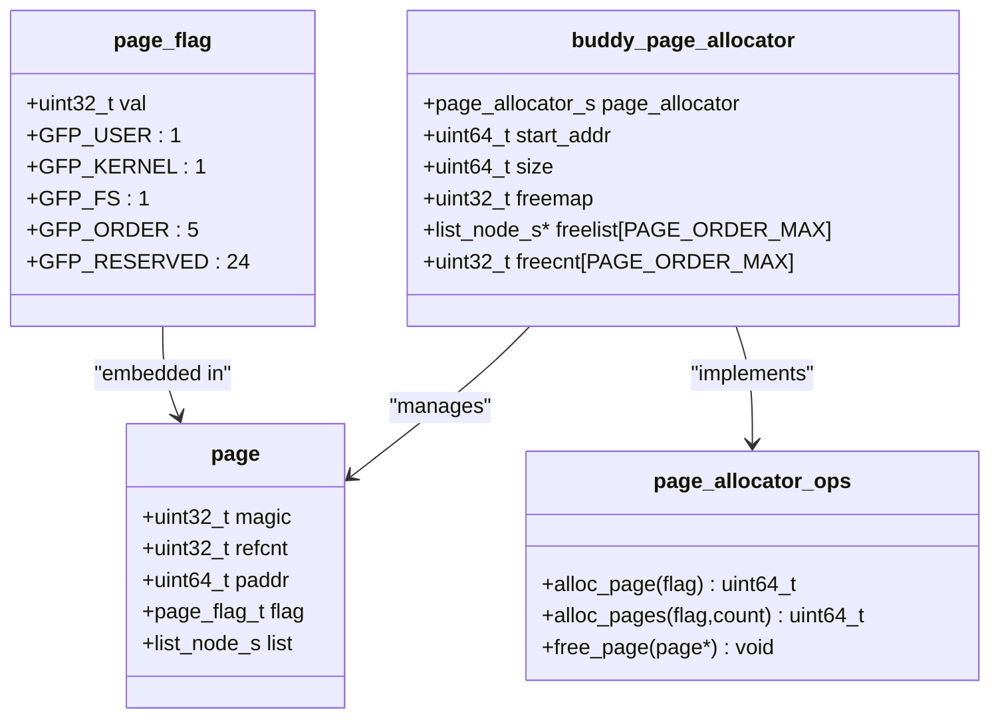
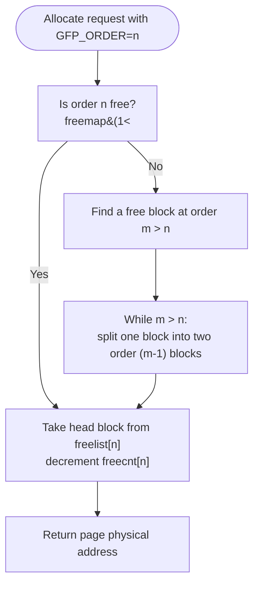
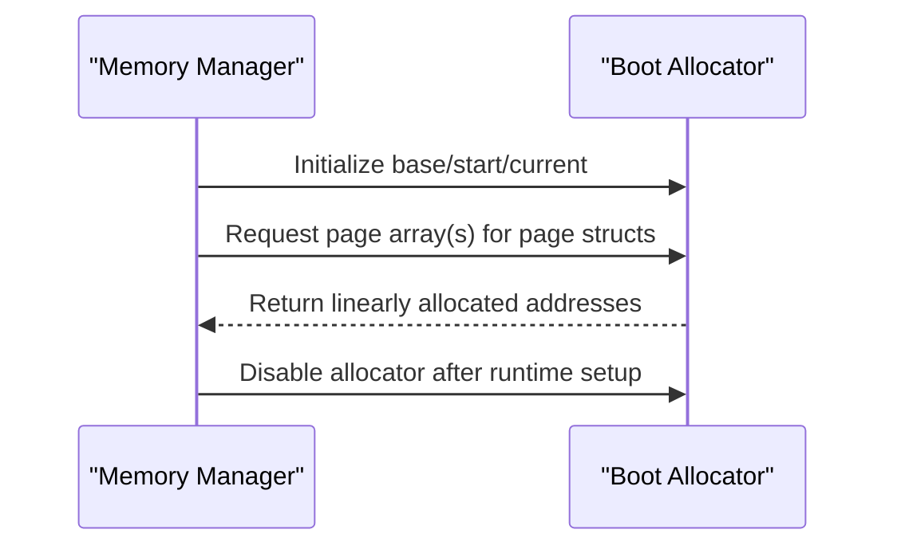
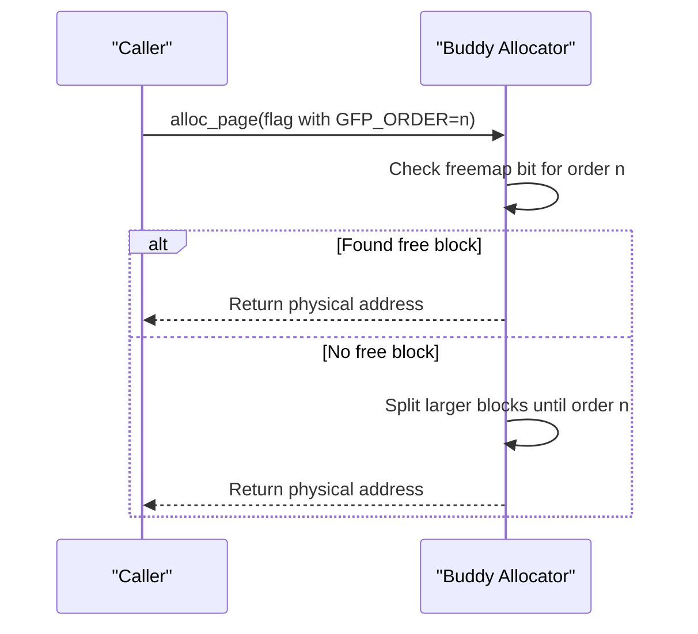
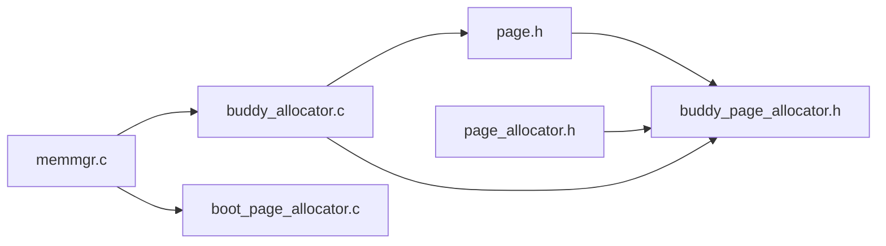

# Buddy Page Allocator

<cite>
**Referenced Files in This Document**
- [buddy_page_allocator.c](file://kernel/systemd/memmgr/pallocator/buddy_allocator.c)
- [buddy_page_allocator.h](file://kernel/include/mm/impl/buddy_page_allocator.h)
- [boot_page_allocator.c](file://kernel/mm/impl/boot_page_allocator.c)
- [boot_page_allocator.h](file://kernel/include/mm/impl/boot_page_allocator.h)
- [page_allocator.h](file://kernel/include/mm/page_allocator.h)
- [page.h](file://kernel/include/mm/page.h)
- [memmgr.c](file://kernel/systemd/memmgr/memmgr.c)
- [buddymm.h](file://kernel/include/mm/buddymm.h)
</cite>

## Table of Contents
1. [Introduction](#introduction)
2. [Project Structure](#project-structure)
3. [Core Components](#core-components)
4. [Architecture Overview](#architecture-overview)
5. [Detailed Component Analysis](#detailed-component-analysis)
6. [Dependency Analysis](#dependency-analysis)
7. [Performance Considerations](#performance-considerations)
8. [Troubleshooting Guide](#troubleshooting-guide)
9. [Conclusion](#conclusion)

## Introduction
This document explains the buddy page allocator implementation in the kernel, focusing on the buddy algorithm principles, block size hierarchies, splitting and merging behaviors, and the boot-time page allocator used during early kernel initialization. It also covers runtime page size management, free list organization, allocation and deallocation performance characteristics, and strategies to prevent fragmentation. Examples of allocation patterns and memory pressure scenarios are included, along with optimization techniques.

## Project Structure
The buddy page allocator is implemented in two places:
- Runtime implementation under kernel/systemd/memmgr/pallocator/buddy_allocator.c
- Boot-time allocator under kernel/mm/impl/boot_page_allocator.c

Key headers define the allocator interfaces and page metadata:
- Page allocator interface: kernel/include/mm/page_allocator.h
- Page metadata and constants: kernel/include/mm/page.h
- Buddy allocator public API and types: kernel/include/mm/impl/buddy_page_allocator.h
- Boot allocator public API and types: kernel/include/mm/impl/boot_page_allocator.h
- Memory manager integration: kernel/systemd/memmgr/memmgr.c
- Buddy MM entry point: kernel/include/mm/buddymm.h

**Diagram sources**
- [buddy_allocator.c](file://kernel/systemd/memmgr/pallocator/buddy_allocator.c#L1-L203)
- [buddy_page_allocator.h](file://kernel/include/mm/impl/buddy_page_allocator.h#L1-L40)
- [boot_page_allocator.c](file://kernel/mm/impl/boot_page_allocator.c#L1-L47)
- [boot_page_allocator.h](file://kernel/include/mm/impl/boot_page_allocator.h#L1-L17)
- [page_allocator.h](file://kernel/include/mm/page_allocator.h#L1-L23)
- [page.h](file://kernel/include/mm/page.h#L1-L31)
- [memmgr.c](file://kernel/systemd/memmgr/memmgr.c#L1-L300)
- [buddymm.h](file://kernel/include/mm/buddymm.h#L1-L11)

**Section sources**
- [buddy_allocator.c](file://kernel/systemd/memmgr/pallocator/buddy_allocator.c#L1-L203)
- [buddy_page_allocator.h](file://kernel/include/mm/impl/buddy_page_allocator.h#L1-L40)
- [boot_page_allocator.c](file://kernel/mm/impl/boot_page_allocator.c#L1-L47)
- [boot_page_allocator.h](file://kernel/include/mm/impl/boot_page_allocator.h#L1-L17)
- [page_allocator.h](file://kernel/include/mm/page_allocator.h#L1-L23)
- [page.h](file://kernel/include/mm/page.h#L1-L31)
- [memmgr.c](file://kernel/systemd/memmgr/memmgr.c#L1-L300)
- [buddymm.h](file://kernel/include/mm/buddymm.h#L1-L11)

## Core Components
- Boot page allocator: A simple linear allocator that grows upward from a base address during early boot. It does not support freeing and is disabled after the runtime buddy allocator is initialized.
- Buddy page allocator: A hierarchical block allocator with fixed-size orders. It maintains per-order free lists and supports splitting and coalescing to satisfy arbitrary page counts.

Key data structures and roles:
- page: Metadata for each physical page, including magic, reference count, physical address, flags, and a freelist link.
- page_flag: Allocation flags including GFP_USER/GFP_KERNEL/GFP_FS and GFP_ORDER indicating target order.
- buddy_page_allocator: Holds allocator state including start address, size, freemap bitmask, per-order freelist heads, and per-order free counts.
- page_allocator_ops: Function pointers for alloc_page, alloc_pages, and free_page.

Allocation entry points:
- buddy_page_allocator_alloc_pages: Allocates a contiguous region sized to a power-of-two number of pages based on GFP_ORDER.
- buddy_page_allocator_alloc_page: Convenience wrapper for single-page allocation.
- boot_page_allocator_alloc_pages: Boot-time allocation that advances current pointer by requested size.
- boot_page_allocator_free: No-op for boot allocator (no free).

**Section sources**
- [page.h](file://kernel/include/mm/page.h#L1-L31)
- [page_allocator.h](file://kernel/include/mm/page_allocator.h#L1-L23)
- [buddy_page_allocator.h](file://kernel/include/mm/impl/buddy_page_allocator.h#L1-L40)
- [buddy_allocator.c](file://kernel/systemd/memmgr/pallocator/buddy_allocator.c#L108-L145)
- [boot_page_allocator.c](file://kernel/mm/impl/boot_page_allocator.c#L7-L33)

## Architecture Overview
The memory manager initializes the boot allocator, builds page arrays, and then constructs the buddy allocator over the remaining memory. After initialization, allocations route through the buddy allocator’s free lists and splitting logic.

**Diagram sources**
- [memmgr.c](file://kernel/systemd/memmgr/memmgr.c#L16-L118)
- [boot_page_allocator.c](file://kernel/mm/impl/boot_page_allocator.c#L35-L47)
- [buddy_allocator.c](file://kernel/systemd/memmgr/pallocator/buddy_allocator.c#L156-L202)

**Section sources**
- [memmgr.c](file://kernel/systemd/memmgr/memmgr.c#L16-L118)
- [boot_page_allocator.c](file://kernel/mm/impl/boot_page_allocator.c#L35-L47)
- [buddy_allocator.c](file://kernel/systemd/memmgr/pallocator/buddy_allocator.c#L156-L202)

## Detailed Component Analysis

### Buddy Algorithm Principles and Block Size Hierarchies
- Orders represent block sizes as powers of two pages: 1×PAGE_SIZE, 2×PAGE_SIZE, ..., up to a maximum order.
- GFP_ORDER in page_flag determines the target order for allocation requests.
- Free blocks are organized into per-order singly linked freelists (via list_node_s embedded in page).
- freemap is a bitmask indicating which orders currently have free blocks.
- freecnt tracks the count of free blocks per order.

**Diagram sources**
- [page.h](file://kernel/include/mm/page.h#L23-L29)
- [page_allocator.h](file://kernel/include/mm/page_allocator.h#L12-L21)
- [buddy_page_allocator.h](file://kernel/include/mm/impl/buddy_page_allocator.h#L28-L36)

**Section sources**
- [page.h](file://kernel/include/mm/page.h#L12-L29)
- [buddy_page_allocator.h](file://kernel/include/mm/impl/buddy_page_allocator.h#L8-L36)

### Splitting and Merging Operations
Splitting:
- When allocating a block of order n, if no free block exists at order n, the allocator attempts to split a larger block (order n+1) recursively until reaching order n.
- Splitting updates per-order freelist heads, decrements freecnt, clears freemap bit if count reaches zero, and creates two new order-(n-1) free blocks appended to the appropriate freelist.

Coalescing:
- The current runtime implementation focuses on splitting and does not implement explicit coalescing on free. This means merging adjacent free blocks back into larger orders is not present in the analyzed code.

**Diagram sources**
- [buddy_allocator.c](file://kernel/systemd/memmgr/pallocator/buddy_allocator.c#L131-L145)
- [buddy_allocator.c](file://kernel/systemd/memmgr/pallocator/buddy_allocator.c#L99-L106)
- [buddy_allocator.c](file://kernel/systemd/memmgr/pallocator/buddy_allocator.c#L57-L97)

**Section sources**
- [buddy_allocator.c](file://kernel/systemd/memmgr/pallocator/buddy_allocator.c#L99-L145)

### Boot Page Allocator (Early Initialization)
- Maintains base, start_addr, and current_addr.
- Allocates by advancing current_addr by requested size and returns the previous current_addr as the allocated region’s base.
- Free is a no-op because the boot allocator assumes ownership of memory and does not reclaim it.
- Disabled after runtime initialization to prevent further allocations from the boot pool.

**Diagram sources**
- [boot_page_allocator.c](file://kernel/mm/impl/boot_page_allocator.c#L35-L47)
- [memmgr.c](file://kernel/systemd/memmgr/memmgr.c#L16-L28)

**Section sources**
- [boot_page_allocator.c](file://kernel/mm/impl/boot_page_allocator.c#L7-L47)
- [memmgr.c](file://kernel/systemd/memmgr/memmgr.c#L16-L28)

### Runtime Buddy Allocator (Normal Operation)
- Initialization:
  - Freelist arrays are cleared and freemap reset.
  - Memory is scanned from start_addr to size, placing blocks into per-order freelists according to largest possible order.
  - freemap bits are set and freecnt counters incremented accordingly.
- Allocation:
  - The requested order is derived from GFP_ORDER.
  - If no free block exists at that order, the allocator splits larger blocks until reaching the requested order.
  - The head block is removed from the freelist and returned.
- Free:
  - The current implementation does not implement coalescing on free. Free paths are placeholders and do not merge adjacent blocks.

**Diagram sources**
- [buddy_allocator.c](file://kernel/systemd/memmgr/pallocator/buddy_allocator.c#L131-L145)
- [buddy_allocator.c](file://kernel/systemd/memmgr/pallocator/buddy_allocator.c#L108-L129)

**Section sources**
- [buddy_allocator.c](file://kernel/systemd/memmgr/pallocator/buddy_allocator.c#L156-L202)
- [buddy_allocator.c](file://kernel/systemd/memmgr/pallocator/buddy_allocator.c#L131-L145)

### Page Size Management and Free List Organization
- Page size is defined by PAGE_SHIFT and PAGE_SIZE.
- Orders are enumerated from PAGE_ORDER_0 through PAGE_ORDER_MAX, representing block sizes from 1×PAGE_SIZE to up to 128M×PAGE_SIZE.
- freelist[order] holds the head of the freelist for that order.
- freecnt[order] tracks the number of free blocks at that order.
- freemap indicates which orders have at least one free block.

Allocation pattern helpers:
- size_to_order converts a requested byte size into the smallest order that can satisfy it.

**Section sources**
- [page.h](file://kernel/include/mm/page.h#L8-L9)
- [buddy_page_allocator.h](file://kernel/include/mm/impl/buddy_page_allocator.h#L8-L26)
- [memmgr.c](file://kernel/systemd/memmgr/memmgr.c#L120-L130)

### Allocation and Deallocation Performance Characteristics
- Allocation:
  - Best-fit-like behavior via first-fit on the freelist for the target order.
  - Worst-case O(k) movement when splitting k levels from a higher order to reach the requested order.
  - Amortized constant-time per allocation due to per-order freelists and bitmask checks.
- Deallocation:
  - Not implemented in the analyzed code; coalescing is absent, so fragmentation risk increases over time.

[No sources needed since this section provides general guidance]

### Examples of Allocation Patterns and Memory Pressure Scenarios
- Example pattern 1: Allocate a 16K region (order 1). If order 1 is unavailable, the allocator splits a 32K block (order 2) into two 16K blocks, takes one, and leaves the other free.
- Example pattern 2: Allocate a 1M region (order 8). If order 8 is unavailable, the allocator splits a 2M block (order 9) into two 1M blocks, and continues recursively until reaching order 8.
- Memory pressure scenario: Repeated allocations of mixed sizes can fragment the free lists, causing frequent splitting and potential exhaustion of higher-order blocks while leaving many small leftover blocks.

[No sources needed since this section provides general guidance]

### Optimization Techniques for the Buddy Allocator
- Prefer allocating in larger orders to reduce splitting overhead.
- Batch allocations of contiguous pages to minimize per-allocation splitting.
- Periodically compact or rebalance free lists if coalescing is introduced later.
- Monitor freecnt and freemap to detect fragmentation hotspots and adjust allocation strategies.

[No sources needed since this section provides general guidance]

## Dependency Analysis
The runtime buddy allocator depends on:
- Page metadata and flags for tracking allocation state.
- Page allocator interface for unified allocation/free APIs.
- Memory manager for boot-to-runtime handoff and allocator initialization.

**Diagram sources**
- [page.h](file://kernel/include/mm/page.h#L1-L31)
- [page_allocator.h](file://kernel/include/mm/page_allocator.h#L1-L23)
- [buddy_page_allocator.h](file://kernel/include/mm/impl/buddy_page_allocator.h#L1-L40)
- [buddy_allocator.c](file://kernel/systemd/memmgr/pallocator/buddy_allocator.c#L1-L203)
- [memmgr.c](file://kernel/systemd/memmgr/memmgr.c#L1-L300)
- [boot_page_allocator.c](file://kernel/mm/impl/boot_page_allocator.c#L1-L47)

**Section sources**
- [page.h](file://kernel/include/mm/page.h#L1-L31)
- [page_allocator.h](file://kernel/include/mm/page_allocator.h#L1-L23)
- [buddy_page_allocator.h](file://kernel/include/mm/impl/buddy_page_allocator.h#L1-L40)
- [buddy_allocator.c](file://kernel/systemd/memmgr/pallocator/buddy_allocator.c#L1-L203)
- [memmgr.c](file://kernel/systemd/memmgr/memmgr.c#L1-L300)
- [boot_page_allocator.c](file://kernel/mm/impl/boot_page_allocator.c#L1-L47)

## Performance Considerations
- Time complexity:
  - Allocation: O(k) where k is the number of split steps from a higher order to the requested order.
  - Free: Not implemented; if implemented, coalescing would typically be O(f) where f is the number of adjacent free blocks merged.
- Space overhead:
  - Per-page metadata (magic, refcnt, paddr, flag, list_node).
  - Per-order freelists and freecnt/freemap overhead.
- Fragmentation:
  - Absence of coalescing increases fragmentation risk. Consider adding coalescing to improve long-term utilization.

[No sources needed since this section provides general guidance]

## Troubleshooting Guide
Common issues and diagnostics:
- Page magic mismatch or corrupted page metadata during allocation/free operations.
- Attempting to allocate from a disabled boot allocator after runtime initialization.
- Freelist underflow or freemap inconsistencies leading to allocation failures.

Diagnostics:
- Logging of freelist counts and freemap state per order to identify missing free blocks.
- Assertions and fatal logs when encountering invalid page metadata or unexpected NULL freelist nodes.

**Section sources**
- [buddy_allocator.c](file://kernel/systemd/memmgr/pallocator/buddy_allocator.c#L7-L55)
- [buddy_allocator.c](file://kernel/systemd/memmgr/pallocator/buddy_allocator.c#L57-L97)
- [boot_page_allocator.c](file://kernel/mm/impl/boot_page_allocator.c#L8-L14)

## Conclusion
The buddy page allocator provides a structured, hierarchical approach to physical memory allocation with per-order freelists and efficient splitting. The boot allocator ensures a smooth transition from early boot to runtime, after which the buddy allocator manages memory with predictable performance characteristics. While the current implementation lacks coalescing, it offers a solid foundation for further enhancements such as merging adjacent free blocks to mitigate fragmentation and improve long-term memory utilization.