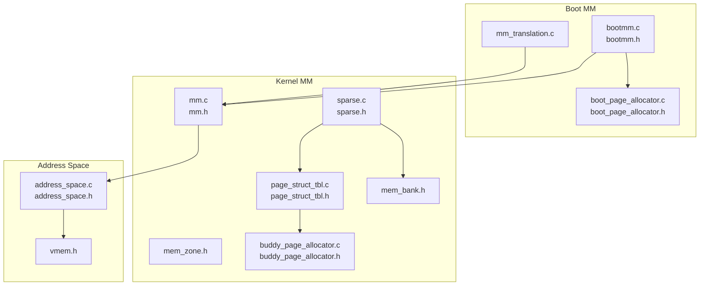
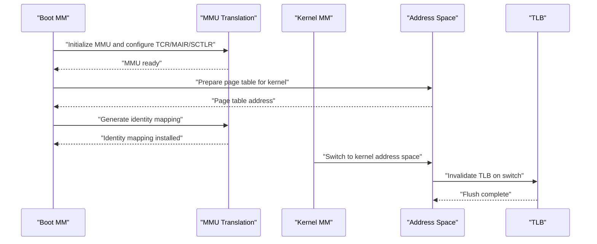
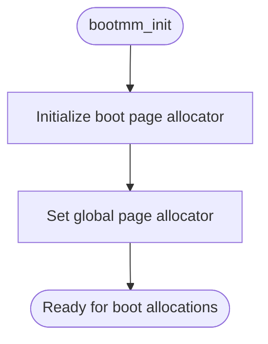
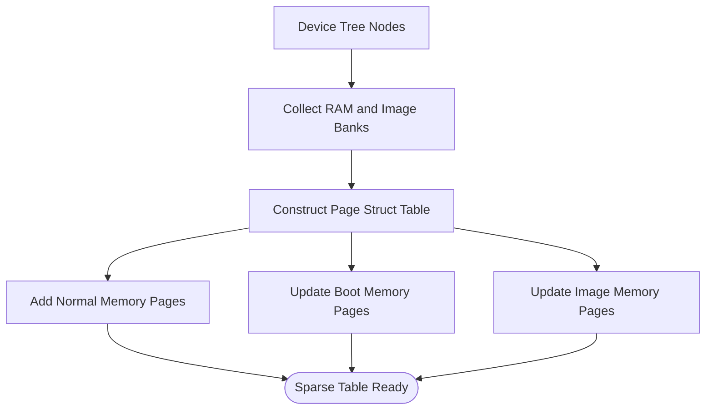
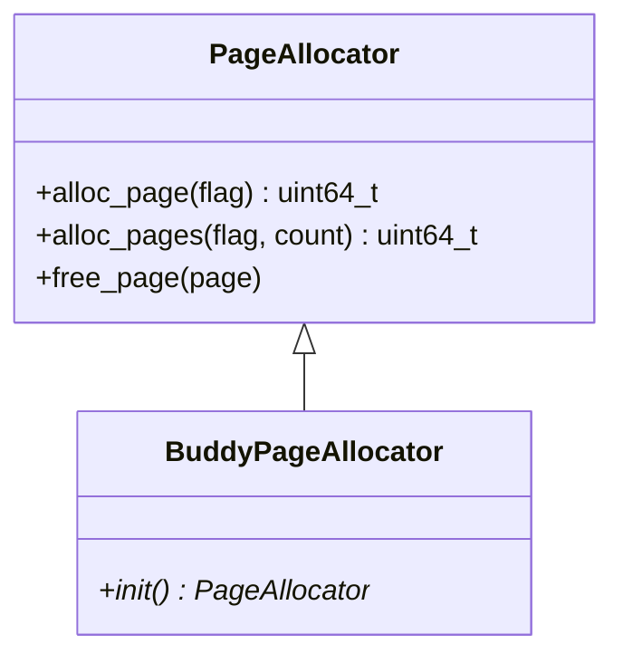
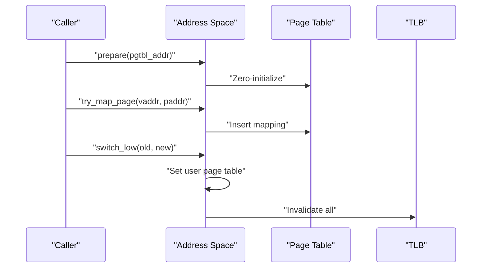
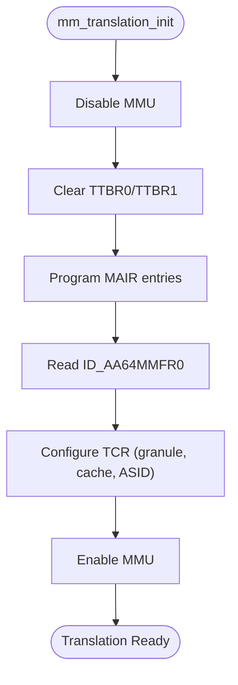
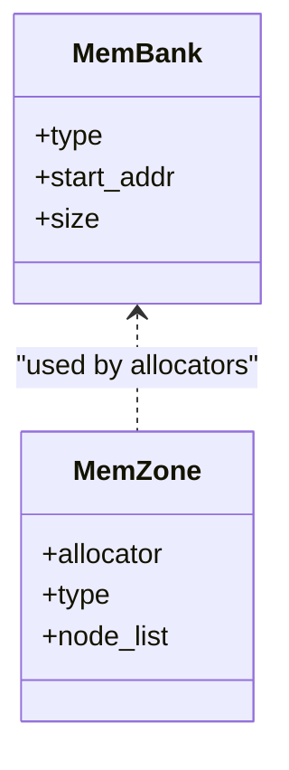
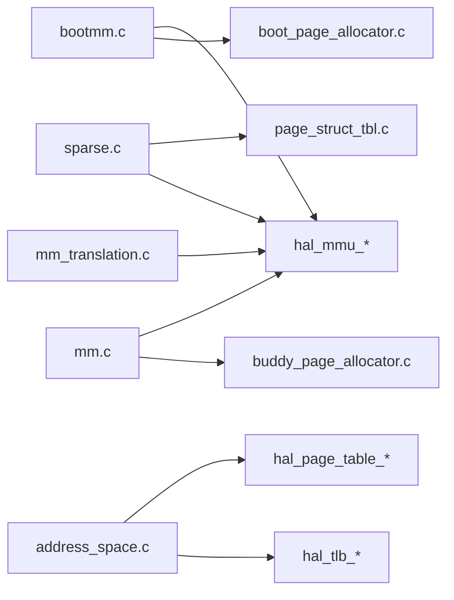

# Memory Management System

<cite>
**Referenced Files in This Document**
- [bootmm.h](file://kernel/include/mm/bootmm.h)
- [buddymm.h](file://kernel/include/mm/buddymm.h)
- [sparse.h](file://kernel/include/mm/sparse.h)
- [mem_zone.h](file://kernel/include/mm/mem_zone.h)
- [mem_bank.h](file://kernel/include/mm/mem_bank.h)
- [address_space.h](file://kernel/include/mm/address_space.h)
- [vmem.h](file://kernel/include/mm/vmem.h)
- [boot_page_allocator.c](file://kernel/mm/impl/boot_page_allocator.c)
- [buddy_page_allocator.c](file://kernel/mm/impl/buddy_page_allocator.c)
- [mm.c](file://kernel/mm/mm.c)
- [sparse.c](file://kernel/mm/sparse.c)
- [address_space.c](file://kernel/mm/address_space.c)
- [mem_map.c](file://kernel/mm/mem_map.c)
- [page_struct_tbl.c](file://kernel/mm/page_struct_tbl.c)
- [mm_translation.c](file://boot/mm/mm_translation.c)
</cite>

## Table of Contents
1. [Introduction](#introduction)
2. [Project Structure](#project-structure)
3. [Core Components](#core-components)
4. [Architecture Overview](#architecture-overview)
5. [Detailed Component Analysis](#detailed-component-analysis)
6. [Dependency Analysis](#dependency-analysis)
7. [Performance Considerations](#performance-considerations)
8. [Troubleshooting Guide](#troubleshooting-guide)
9. [Conclusion](#conclusion)

## Introduction
This document explains the memory management system in TranquilOS with a focus on sparse memory allocation, the buddy page allocator, and MMU integration. It documents the memory management hierarchy across boot memory, kernel memory, and user-space regions, virtual memory management, page table structures, memory mapping, and address space management. It also covers memory zones and banks, the relationship between physical and virtual memory, allocation/deallocation semantics, memory protection, and sharing between processes. Finally, it provides performance considerations and optimization techniques grounded in the implementation.

## Project Structure
The memory subsystem spans several layers:
- Boot-time memory management initializes a simple boot page allocator and sets up early identity mapping.
- Sparse memory management discovers physical memory banks from device tree nodes and constructs a sparse page structure table to track page states.
- Kernel memory management integrates a buddy page allocator for general-purpose allocations and exposes a unified page allocator interface.
- Address space management controls per-context page tables and TLB invalidation during switches.
- MMU translation control configures TCR, MAIR, SCTLR, and generates identity mappings.

**Diagram sources**
- [bootmm.c](file://kernel/mm/bootmm.c#L1-L29)
- [boot_page_allocator.c](file://kernel/mm/impl/boot_page_allocator.c#L1-L47)
- [mm_translation.c](file://boot/mm/mm_translation.c#L1-L225)
- [mm.c](file://kernel/mm/mm.c#L1-L45)
- [sparse.c](file://kernel/mm/sparse.c#L1-L104)
- [page_struct_tbl.c](file://kernel/mm/page_struct_tbl.c#L1-L142)
- [mem_zone.h](file://kernel/include/mm/mem_zone.h#L1-L21)
- [mem_bank.h](file://kernel/include/mm/mem_bank.h#L1-L21)
- [buddy_page_allocator.c](file://kernel/mm/impl/buddy_page_allocator.c#L1-L27)
- [address_space.c](file://kernel/mm/address_space.c#L1-L105)
- [vmem.h](file://kernel/include/mm/vmem.h#L1-L22)

**Section sources**
- [bootmm.c](file://kernel/mm/bootmm.c#L1-L29)
- [mm.c](file://kernel/mm/mm.c#L1-L45)
- [sparse.c](file://kernel/mm/sparse.c#L1-L104)
- [page_struct_tbl.c](file://kernel/mm/page_struct_tbl.c#L1-L142)
- [address_space.c](file://kernel/mm/address_space.c#L1-L105)
- [mem_zone.h](file://kernel/include/mm/mem_zone.h#L1-L21)
- [mem_bank.h](file://kernel/include/mm/mem_bank.h#L1-L21)
- [buddy_page_allocator.c](file://kernel/mm/impl/buddy_page_allocator.c#L1-L27)
- [vmem.h](file://kernel/include/mm/vmem.h#L1-L22)
- [mm_translation.c](file://boot/mm/mm_translation.c#L1-L225)

## Core Components
- Boot memory manager: Initializes a boot page allocator and exposes global accessor functions to set/get the current page allocator.
- Sparse memory management: Discovers memory banks via device tree, builds a sparse page structure table, and updates page types for boot and image regions.
- Buddy page allocator: Provides a placeholder interface for general-purpose kernel allocations.
- Page structure table: Maintains a radix-like sparse structure to track per-page metadata across physical memory.
- Address space manager: Prepares, maps, extends, and unmaps pages within a given address space; triggers TLB invalidation on switches.
- MMU translation control: Configures MAIR, TCR, and SCTLR, and generates identity mappings for privileged/unprivileged modes.

**Section sources**
- [bootmm.h](file://kernel/include/mm/bootmm.h#L1-L11)
- [buddymm.h](file://kernel/include/mm/buddymm.h#L1-L11)
- [sparse.h](file://kernel/include/mm/sparse.h#L1-L17)
- [mem_zone.h](file://kernel/include/mm/mem_zone.h#L1-L21)
- [mem_bank.h](file://kernel/include/mm/mem_bank.h#L1-L21)
- [address_space.h](file://kernel/include/mm/address_space.h#L1-L43)
- [vmem.h](file://kernel/include/mm/vmem.h#L1-L22)
- [boot_page_allocator.c](file://kernel/mm/impl/boot_page_allocator.c#L1-L47)
- [buddy_page_allocator.c](file://kernel/mm/impl/buddy_page_allocator.c#L1-L27)
- [mm.c](file://kernel/mm/mm.c#L1-L45)
- [sparse.c](file://kernel/mm/sparse.c#L1-L104)
- [page_struct_tbl.c](file://kernel/mm/page_struct_tbl.c#L1-L142)
- [address_space.c](file://kernel/mm/address_space.c#L1-L105)
- [mem_map.c](file://kernel/mm/mem_map.c#L1-L64)
- [mm_translation.c](file://boot/mm/mm_translation.c#L1-L225)

## Architecture Overview
The memory management architecture follows a layered design:
- Boot stage: Uses a linearly allocated boot page allocator to allocate early boot memory. Identity mapping is generated for initial bring-up.
- Discovery and sparse mapping: Device tree nodes define memory banks; a sparse page structure table tracks page metadata and supports dynamic updates.
- Kernel allocation: A buddy page allocator is initialized and exposed via a unified page allocator interface.
- Address spaces: Per-context page tables are prepared and mapped; switching between address spaces updates the active page table and invalidates TLB.
- MMU configuration: Translation control registers and memory attributes are configured to support the requested virtual address space and cache policies.

**Diagram sources**
- [mm_translation.c](file://boot/mm/mm_translation.c#L99-L162)
- [mm.c](file://kernel/mm/mm.c#L29-L35)
- [address_space.c](file://kernel/mm/address_space.c#L25-L49)

## Detailed Component Analysis

### Boot Memory Manager
- Purpose: Initialize a boot page allocator and expose a global page allocator pointer for early boot allocations.
- Key behaviors:
  - Sets the global page allocator to the boot allocator after initialization.
  - Boot allocator provides sequential allocation from a reserved boot region and intentionally does not support freeing.
- Integration: Used to allocate early boot structures and later superseded by the buddy allocator.

**Diagram sources**
- [bootmm.c](file://kernel/mm/bootmm.c#L26-L29)
- [boot_page_allocator.c](file://kernel/mm/impl/boot_page_allocator.c#L35-L47)

**Section sources**
- [bootmm.h](file://kernel/include/mm/bootmm.h#L1-L11)
- [bootmm.c](file://kernel/mm/bootmm.c#L1-L29)
- [boot_page_allocator.c](file://kernel/mm/impl/boot_page_allocator.c#L1-L47)

### Sparse Memory Management and Page Structure Table
- Purpose: Discover physical memory banks from device tree, construct a sparse page structure table, and update page types for boot and image regions.
- Key behaviors:
  - Iterates device tree nodes labeled as memory and image to populate memory banks.
  - Builds a radix-like four-level page structure table to track per-page metadata.
  - Updates memory bank types for normal memory, boot memory, and image memory.
- Complexity: Adding a memory bank scales with the number of pages in that bank; page table construction involves allocating intermediate table pages on demand.

**Diagram sources**
- [sparse.c](file://kernel/mm/sparse.c#L52-L89)
- [page_struct_tbl.c](file://kernel/mm/page_struct_tbl.c#L125-L142)

**Section sources**
- [sparse.h](file://kernel/include/mm/sparse.h#L1-L17)
- [sparse.c](file://kernel/mm/sparse.c#L1-L104)
- [page_struct_tbl.c](file://kernel/mm/page_struct_tbl.c#L1-L142)
- [mem_bank.h](file://kernel/include/mm/mem_bank.h#L1-L21)

### Buddy Page Allocator
- Purpose: Provide general-purpose kernel memory allocation using a buddy allocator strategy.
- Current state: Placeholder implementation exists with stubbed allocation/free functions; intended to be wired into the page allocator interface after boot.
- Integration: Exposed via a factory function returning a page allocator interface pointer.

**Diagram sources**
- [buddy_page_allocator.c](file://kernel/mm/impl/buddy_page_allocator.c#L1-L27)
- [buddymm.h](file://kernel/include/mm/buddymm.h#L1-L11)

**Section sources**
- [buddymm.h](file://kernel/include/mm/buddymm.h#L1-L11)
- [buddy_page_allocator.c](file://kernel/mm/impl/buddy_page_allocator.c#L1-L27)

### Address Space Management and Virtual Memory
- Purpose: Manage per-context page tables, map/unmap pages, extend page tables, and switch between address spaces with TLB invalidation.
- Key behaviors:
  - Prepare a page table for an address space and zero-initialize it.
  - Try mapping a single page or extending the page table at a given virtual address.
  - Unmap single pages and ranges (placeholder stubs).
  - Switch between low/high address spaces and invalidate TLB when the active page table changes.
- Virtual memory abstraction: A virtual memory descriptor holds ASID and page table address with operation hooks for initialization and mapping.

**Diagram sources**
- [address_space.c](file://kernel/mm/address_space.c#L51-L81)
- [address_space.h](file://kernel/include/mm/address_space.h#L19-L42)
- [vmem.h](file://kernel/include/mm/vmem.h#L12-L21)

**Section sources**
- [address_space.h](file://kernel/include/mm/address_space.h#L1-L43)
- [address_space.c](file://kernel/mm/address_space.c#L1-L105)
- [vmem.h](file://kernel/include/mm/vmem.h#L1-L22)

### MMU Translation Control and Identity Mapping
- Purpose: Configure memory attributes (MAIR), translation control (TCR), and system control (SCTLR), and generate identity mappings for privileged/unprivileged contexts.
- Key behaviors:
  - Disable/enable MMU and invalidate caches/TLBs around state changes.
  - Program MAIR entries for device and normal memory attributes.
  - Configure TCR for granule size, shareability, cacheability, and address space size.
  - Generate a two-level identity mapping with appropriate permissions and attributes.

**Diagram sources**
- [mm_translation.c](file://boot/mm/mm_translation.c#L99-L162)
- [mm_translation.c](file://boot/mm/mm_translation.c#L164-L225)

**Section sources**
- [mm_translation.c](file://boot/mm/mm_translation.c#L1-L225)
- [mm.c](file://kernel/mm/mm.c#L21-L45)

### Memory Zones and Banks
- Memory banks: Represent physical memory regions discovered from device tree with type, start address, and size.
- Memory zones: Logical groupings of memory with associated allocators and node lists; types include main, DMA, and high memory.
- Relationship: Banks feed the page structure table; zones coordinate allocation policies per region.

**Diagram sources**
- [mem_bank.h](file://kernel/include/mm/mem_bank.h#L1-L21)
- [mem_zone.h](file://kernel/include/mm/mem_zone.h#L1-L21)

**Section sources**
- [mem_bank.h](file://kernel/include/mm/mem_bank.h#L1-L21)
- [mem_zone.h](file://kernel/include/mm/mem_zone.h#L1-L21)
- [sparse.c](file://kernel/mm/sparse.c#L22-L62)

### Boot Memory Regions
- Purpose: Define boot-time memory regions for text, rodata, data, bss, and kernel stack to support early boot accounting and mapping.
- Usage: Provides a static list of boot regions used during early boot stages.

**Section sources**
- [mem_map.c](file://kernel/mm/mem_map.c#L20-L64)

## Dependency Analysis
- Boot MM depends on the page allocator interface and HAL MMU routines.
- Sparse MM depends on device tree iteration, page allocator, and page structure table.
- Kernel MM depends on HAL MMU and page allocator interfaces.
- Address Space depends on HAL page table and TLB operations.
- MMU translation depends on architecture-specific registers and HAL helpers.

**Diagram sources**
- [bootmm.c](file://kernel/mm/bootmm.c#L1-L29)
- [sparse.c](file://kernel/mm/sparse.c#L1-L104)
- [page_struct_tbl.c](file://kernel/mm/page_struct_tbl.c#L1-L142)
- [mm.c](file://kernel/mm/mm.c#L1-L45)
- [address_space.c](file://kernel/mm/address_space.c#L1-L105)
- [mm_translation.c](file://boot/mm/mm_translation.c#L1-L225)

**Section sources**
- [bootmm.c](file://kernel/mm/bootmm.c#L1-L29)
- [sparse.c](file://kernel/mm/sparse.c#L1-L104)
- [page_struct_tbl.c](file://kernel/mm/page_struct_tbl.c#L1-L142)
- [mm.c](file://kernel/mm/mm.c#L1-L45)
- [address_space.c](file://kernel/mm/address_space.c#L1-L105)
- [mm_translation.c](file://boot/mm/mm_translation.c#L1-L225)

## Performance Considerations
- Sparse page structure table: Using a radix-like four-level table reduces memory overhead for large physical address spaces by only allocating table pages as needed. This improves scalability for systems with large DRAM ranges.
- Buddy allocator: Once implemented, it will reduce fragmentation and improve locality for kernel allocations. Ensure alignment and coalescing logic are tuned for typical allocation sizes.
- TLB invalidation: Minimizing TLB flushes by avoiding unnecessary address space switches and batching mappings can improve performance.
- MMU configuration: Proper cacheability and shareability attributes in MAIR reduce cache pollution and improve throughput for device mappings.
- Boot allocator: Linear allocation avoids fragmentation during boot but is not suitable for long-term use; transitioning to buddy allocator promptly reduces overhead.

[No sources needed since this section provides general guidance]

## Troubleshooting Guide
- No page allocator initialized: If attempting to update boot memory pages or allocate from the page structure table without initializing the boot or buddy allocator, panics occur. Ensure bootmm_init is called before sparse initialization and that a page allocator is registered.
- Address space not prepared: Mapping or unmapping requires a prepared page table; otherwise, panics indicate the page table address is zero.
- MMU enable/disable issues: Enabling MMU without proper TCR/MAIR configuration or identity mapping can cause immediate faults. Verify translation initialization and identity mapping generation.
- TLB inconsistencies: After switching address spaces, ensure TLB invalidation occurs when the active page table changes.

**Section sources**
- [sparse.c](file://kernel/mm/sparse.c#L91-L104)
- [page_struct_tbl.c](file://kernel/mm/page_struct_tbl.c#L125-L142)
- [address_space.c](file://kernel/mm/address_space.c#L59-L105)
- [mm_translation.c](file://boot/mm/mm_translation.c#L99-L162)

## Conclusion
TranquilOS memory management combines a boot-time linear allocator, a sparse page structure table for scalable physical memory tracking, and a planned buddy allocator for efficient kernel allocations. Address space management and MMU translation control provide robust virtual memory capabilities with configurable memory attributes and permission models. The design emphasizes modularity and extensibility, enabling future enhancements such as full buddy allocator implementation, advanced memory protection, and inter-process memory sharing mechanisms.