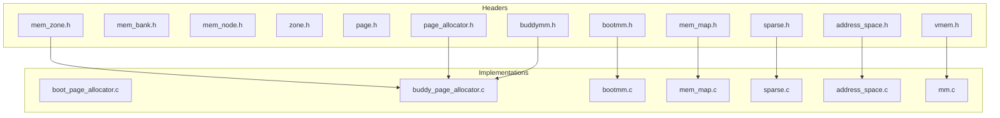
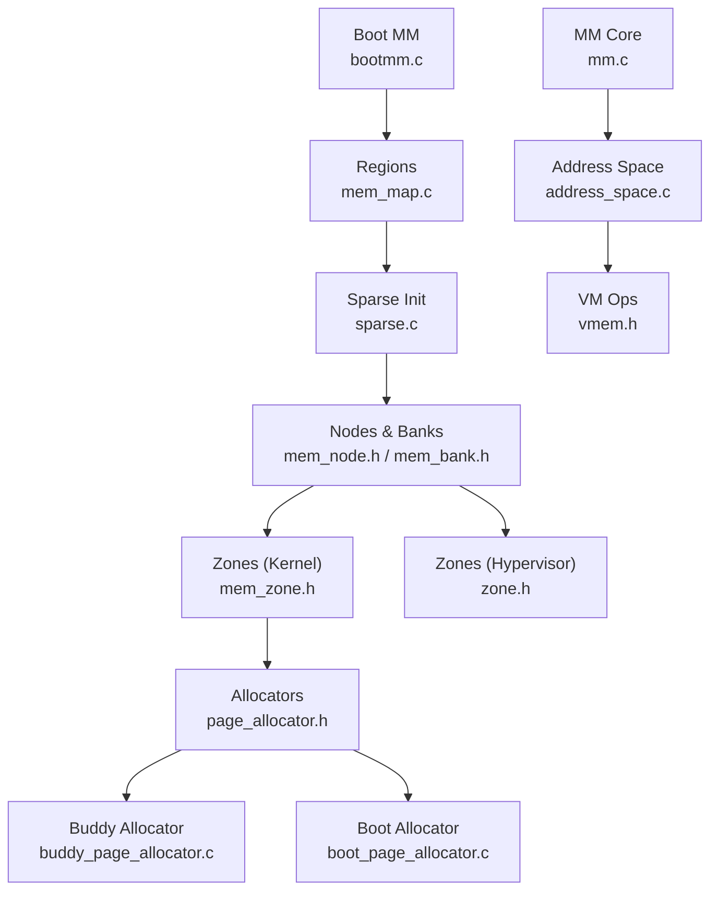
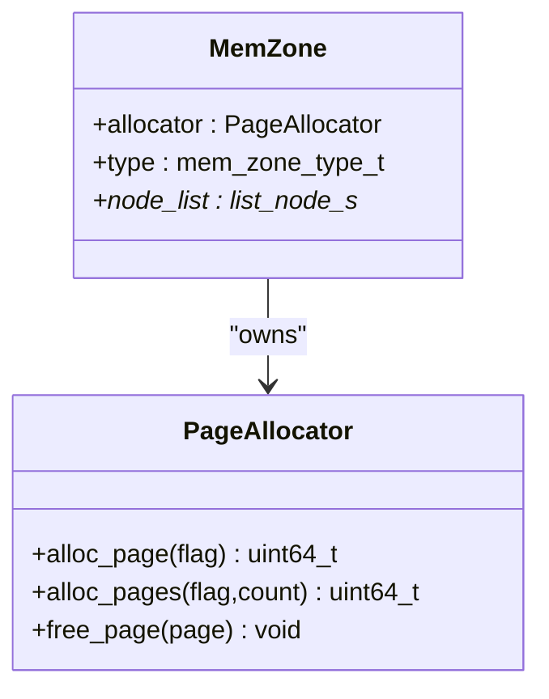
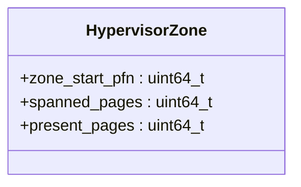
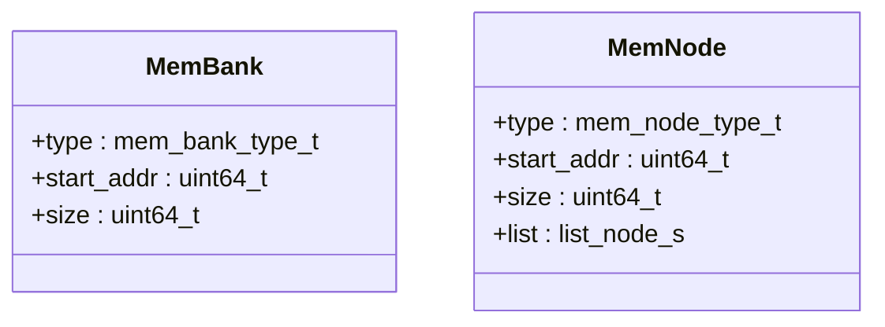
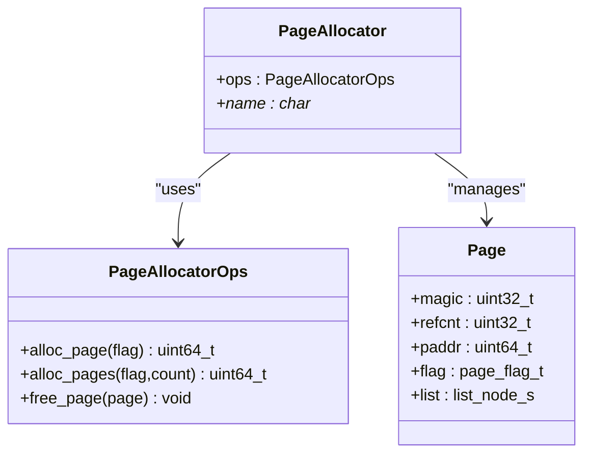
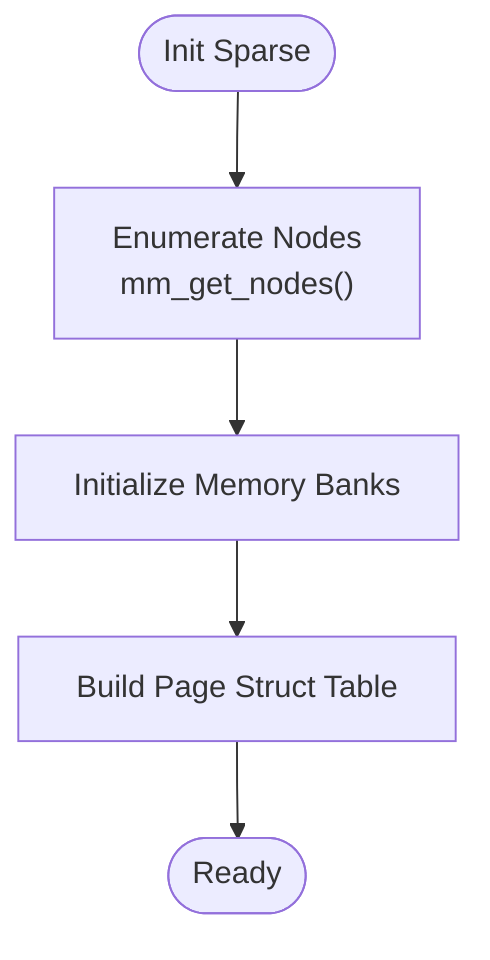
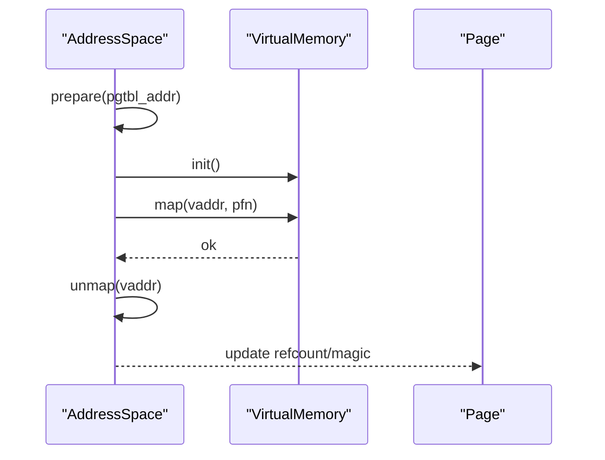
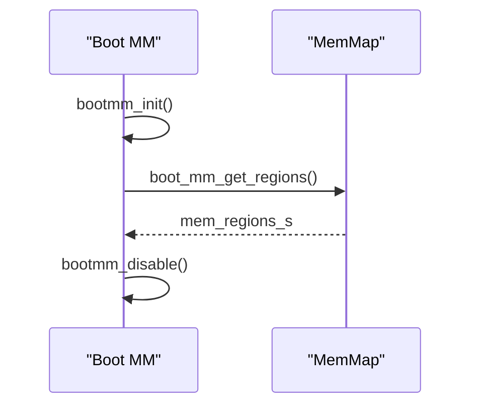
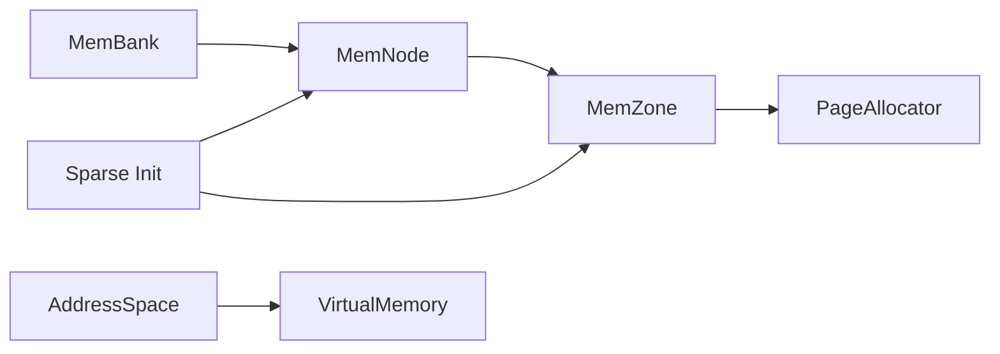

# Memory Zones and Banks

<cite>
**Referenced Files in This Document**
- [mem_zone.h](file://kernel/include/mm/mem_zone.h)
- [mem_bank.h](file://kernel/include/mm/mem_bank.h)
- [mem_node.h](file://kernel/include/mm/mem_node.h)
- [zone.h](file://kernel/include/mm/zone.h)
- [sparse.h](file://kernel/include/mm/sparse.h)
- [page.h](file://kernel/include/mm/page.h)
- [page_allocator.h](file://kernel/include/mm/page_allocator.h)
- [buddymm.h](file://kernel/include/mm/buddymm.h)
- [address_space.h](file://kernel/include/mm/address_space.h)
- [vmem.h](file://kernel/include/mm/vmem.h)
- [mem_map.h](file://kernel/include/mm/mem_map.h)
- [bootmm.h](file://kernel/include/mm/bootmm.h)
- [boot_page_allocator.c](file://kernel/mm/impl/boot_page_allocator.c)
- [buddy_page_allocator.c](file://kernel/mm/impl/buddy_page_allocator.c)
- [bootmm.c](file://kernel/mm/bootmm.c)
- [mem_map.c](file://kernel/mm/mem_map.c)
- [sparse.c](file://kernel/mm/sparse.c)
- [address_space.c](file://kernel/mm/address_space.c)
- [mm.c](file://kernel/mm/mm.c)
</cite>

## Table of Contents
1. [Introduction](#introduction)
2. [Project Structure](#project-structure)
3. [Core Components](#core-components)
4. [Architecture Overview](#architecture-overview)
5. [Detailed Component Analysis](#detailed-component-analysis)
6. [Dependency Analysis](#dependency-analysis)
7. [Performance Considerations](#performance-considerations)
8. [Troubleshooting Guide](#troubleshooting-guide)
9. [Conclusion](#conclusion)

## Introduction
This document explains memory zone and bank management in TranquilOS, focusing on the hierarchical organization of physical and virtual memory. It covers:
- Memory zones (DMA, Normal, High) and their allocation policies
- Memory banks for NUMA-aware systems and memory nodes for multi-socket architectures
- Virtual memory zones and their mapping to physical zones
- Memory mapping structures, allocator interfaces, and inter-zone allocation strategies
- Hot-plug and mirroring considerations, and performance implications

The goal is to help both developers and advanced users understand how physical memory is discovered, categorized, and exposed to the kernel’s memory management subsystem, and how virtual memory is organized to match these zones.

## Project Structure
The memory management subsystem spans header definitions, allocator interfaces, and implementation files. The most relevant parts for memory zones and banks are under kernel/include/mm and kernel/mm.

**Diagram sources**
- [mem_zone.h](file://kernel/include/mm/mem_zone.h#L1-L21)
- [mem_bank.h](file://kernel/include/mm/mem_bank.h#L1-L21)
- [mem_node.h](file://kernel/include/mm/mem_node.h#L1-L21)
- [zone.h](file://kernel/include/mm/zone.h#L1-L16)
- [page.h](file://kernel/include/mm/page.h#L1-L31)
- [page_allocator.h](file://kernel/include/mm/page_allocator.h#L1-L23)
- [buddymm.h](file://kernel/include/mm/buddymm.h#L1-L11)
- [address_space.h](file://kernel/include/mm/address_space.h#L1-L43)
- [vmem.h](file://kernel/include/mm/vmem.h#L1-L22)
- [sparse.h](file://kernel/include/mm/sparse.h#L1-L17)
- [mem_map.h](file://kernel/include/mm/mem_map.h#L1-L29)
- [bootmm.h](file://kernel/include/mm/bootmm.h#L1-L11)
- [boot_page_allocator.c](file://kernel/mm/impl/boot_page_allocator.c)
- [buddy_page_allocator.c](file://kernel/mm/impl/buddy_page_allocator.c)
- [bootmm.c](file://kernel/mm/bootmm.c)
- [mem_map.c](file://kernel/mm/mem_map.c)
- [sparse.c](file://kernel/mm/sparse.c)
- [address_space.c](file://kernel/mm/address_space.c)
- [mm.c](file://kernel/mm/mm.c)

**Section sources**
- [mem_zone.h](file://kernel/include/mm/mem_zone.h#L1-L21)
- [mem_bank.h](file://kernel/include/mm/mem_bank.h#L1-L21)
- [mem_node.h](file://kernel/include/mm/mem_node.h#L1-L21)
- [zone.h](file://kernel/include/mm/zone.h#L1-L16)
- [sparse.h](file://kernel/include/mm/sparse.h#L1-L17)
- [page.h](file://kernel/include/mm/page.h#L1-L31)
- [page_allocator.h](file://kernel/include/mm/page_allocator.h#L1-L23)
- [buddymm.h](file://kernel/include/mm/buddymm.h#L1-L11)
- [address_space.h](file://kernel/include/mm/address_space.h#L1-L43)
- [vmem.h](file://kernel/include/mm/vmem.h#L1-L22)
- [mem_map.h](file://kernel/include/mm/mem_map.h#L1-L29)
- [bootmm.h](file://kernel/include/mm/bootmm.h#L1-L11)

## Core Components
- Memory Zone (kernel): Defines zone types (DMA, Normal, High) and holds a per-zone page allocator and a list of memory nodes.
- Memory Zone (hypervisor): Defines zone types (Normal, DMA) and exposes zone metadata (PFNs, spans).
- Memory Bank: Describes a contiguous physical region with type (RAM, IOMMU, Image, Invalid) and address/size.
- Memory Node: Represents a NUMA node or IOMMU domain with type and address/size; supports list linkage.
- Page and Allocator: Page structure with flags and reference counting; page allocator interface defines allocation/free operations.
- Sparse/MM: Interfaces to enumerate nodes, initialize memory banks, and set up page structure tables.
- Address Space and VM: Abstractions for virtual memory management and mapping operations.
- Boot MM and Regions: Boot-time memory management and discovery of memory regions.

**Section sources**
- [mem_zone.h](file://kernel/include/mm/mem_zone.h#L9-L19)
- [zone.h](file://kernel/include/mm/zone.h#L4-L13)
- [mem_bank.h](file://kernel/include/mm/mem_bank.h#L8-L19)
- [mem_node.h](file://kernel/include/mm/mem_node.h#L8-L19)
- [page.h](file://kernel/include/mm/page.h#L23-L29)
- [page_allocator.h](file://kernel/include/mm/page_allocator.h#L8-L21)
- [sparse.h](file://kernel/include/mm/sparse.h#L8-L15)
- [address_space.h](file://kernel/include/mm/address_space.h#L19-L41)
- [vmem.h](file://kernel/include/mm/vmem.h#L12-L17)
- [mem_map.h](file://kernel/include/mm/mem_map.h#L13-L23)
- [bootmm.h](file://kernel/include/mm/bootmm.h#L7-L10)

## Architecture Overview
The memory subsystem organizes physical memory into zones and banks, then exposes virtual memory zones aligned with these physical constructs. At boot, memory regions are discovered and mapped into zones and nodes. Allocators manage pages within each zone, and virtual memory abstractions handle mapping between virtual and physical addresses.

**Diagram sources**
- [bootmm.c](file://kernel/mm/bootmm.c)
- [mem_map.c](file://kernel/mm/mem_map.c)
- [sparse.c](file://kernel/mm/sparse.c)
- [mem_node.h](file://kernel/include/mm/mem_node.h#L14-L19)
- [mem_bank.h](file://kernel/include/mm/mem_bank.h#L15-L19)
- [mem_zone.h](file://kernel/include/mm/mem_zone.h#L15-L19)
- [zone.h](file://kernel/include/mm/zone.h#L9-L13)
- [page_allocator.h](file://kernel/include/mm/page_allocator.h#L18-L21)
- [buddy_page_allocator.c](file://kernel/mm/impl/buddy_page_allocator.c)
- [boot_page_allocator.c](file://kernel/mm/impl/boot_page_allocator.c)
- [address_space.c](file://kernel/mm/address_space.c)
- [vmem.h](file://kernel/include/mm/vmem.h#L12-L17)
- [mm.c](file://kernel/mm/mm.c)

## Detailed Component Analysis

### Memory Zones (Kernel)
- Purpose: Group physical pages into logical zones (DMA, Normal, High) with a dedicated page allocator and a list of memory nodes.
- Allocation Policy: Zone-specific via the embedded page allocator; allocation order favors lower-numbered zones first, with fallback to higher zones when necessary.
- Inter-zone Migration: Not explicitly modeled here; typical designs use reclaim or migration policies elsewhere in the kernel.

**Diagram sources**
- [mem_zone.h](file://kernel/include/mm/mem_zone.h#L15-L19)
- [page_allocator.h](file://kernel/include/mm/page_allocator.h#L18-L21)

**Section sources**
- [mem_zone.h](file://kernel/include/mm/mem_zone.h#L9-L19)
- [page_allocator.h](file://kernel/include/mm/page_allocator.h#L8-L21)

### Memory Zones (Hypervisor)
- Purpose: Define hypervisor-visible zones (Normal, DMA) with PFN-level metadata for zone spans and presence.
- Relationship to Kernel Zones: Hypervisor zones align with kernel zones conceptually; the hypervisor interface focuses on PFN ranges and counts.

**Diagram sources**
- [zone.h](file://kernel/include/mm/zone.h#L9-L13)

**Section sources**
- [zone.h](file://kernel/include/mm/zone.h#L4-L13)

### Memory Banks and Nodes
- Memory Bank: Describes a contiguous physical region with a type and size, enabling categorization of RAM/IOMMU/Image/Invalid regions.
- Memory Node: Represents a NUMA node or IOMMU domain with type and address/size; supports list linkage for traversal.

**Diagram sources**
- [mem_bank.h](file://kernel/include/mm/mem_bank.h#L15-L19)
- [mem_node.h](file://kernel/include/mm/mem_node.h#L14-L19)

**Section sources**
- [mem_bank.h](file://kernel/include/mm/mem_bank.h#L8-L19)
- [mem_node.h](file://kernel/include/mm/mem_node.h#L8-L19)

### Page and Allocator Interface
- Page: Contains magic, reference count, physical address, flags, and a freelist linkage.
- Allocator: Provides function pointers for single-page and multi-page allocation and freeing.

**Diagram sources**
- [page.h](file://kernel/include/mm/page.h#L23-L29)
- [page_allocator.h](file://kernel/include/mm/page_allocator.h#L12-L21)

**Section sources**
- [page.h](file://kernel/include/mm/page.h#L12-L29)
- [page_allocator.h](file://kernel/include/mm/page_allocator.h#L8-L21)

### Sparse Initialization and Node Enumeration
- Sparse initialization sets up memory banks and node lists.
- Node enumeration allows traversing NUMA nodes and associating them with zones.

**Diagram sources**
- [sparse.h](file://kernel/include/mm/sparse.h#L8-L15)
- [sparse.c](file://kernel/mm/sparse.c)

**Section sources**
- [sparse.h](file://kernel/include/mm/sparse.h#L8-L15)

### Virtual Memory Zones and Mapping
- Address Space: Manages page table base and identifier, with operations to set low/high views, prepare, extend, map/unmap pages.
- VM Ops: Virtual memory abstraction with init and map callbacks.
- Relationship to Zones: Virtual zones mirror physical zones; mapping operations translate virtual addresses to physical frames within appropriate zones.

**Diagram sources**
- [address_space.h](file://kernel/include/mm/address_space.h#L19-L41)
- [vmem.h](file://kernel/include/mm/vmem.h#L12-L17)
- [page.h](file://kernel/include/mm/page.h#L23-L29)

**Section sources**
- [address_space.h](file://kernel/include/mm/address_space.h#L24-L41)
- [vmem.h](file://kernel/include/mm/vmem.h#L7-L17)
- [page.h](file://kernel/include/mm/page.h#L23-L29)

### Boot-time Memory Management and Region Discovery
- Boot MM: Initializes and disables early boot memory management.
- Regions: Boot-time discovery of memory regions (text, rodata, rwdata) with start/end and names.

**Diagram sources**
- [bootmm.h](file://kernel/include/mm/bootmm.h#L7-L10)
- [mem_map.h](file://kernel/include/mm/mem_map.h#L25-L26)
- [bootmm.c](file://kernel/mm/bootmm.c)
- [mem_map.c](file://kernel/mm/mem_map.c)

**Section sources**
- [bootmm.h](file://kernel/include/mm/bootmm.h#L7-L10)
- [mem_map.h](file://kernel/include/mm/mem_map.h#L13-L23)

## Dependency Analysis
- Zone-to-Allocator: Each zone holds a page allocator pointer; allocation requests route through the zone’s allocator.
- Node-to-Zone: Nodes are associated with zones during sparse initialization; this association determines where allocations occur.
- Address Space to VM: Address space operations delegate mapping to virtual memory ops; this decouples zone policy from mapping mechanics.
- Boot Regions to Sparse: Boot regions feed into sparse initialization, which populates nodes and banks.

**Diagram sources**
- [mem_zone.h](file://kernel/include/mm/mem_zone.h#L15-L19)
- [page_allocator.h](file://kernel/include/mm/page_allocator.h#L18-L21)
- [mem_node.h](file://kernel/include/mm/mem_node.h#L14-L19)
- [mem_bank.h](file://kernel/include/mm/mem_bank.h#L15-L19)
- [sparse.h](file://kernel/include/mm/sparse.h#L8-L15)
- [address_space.h](file://kernel/include/mm/address_space.h#L19-L41)
- [vmem.h](file://kernel/include/mm/vmem.h#L12-L17)

**Section sources**
- [mem_zone.h](file://kernel/include/mm/mem_zone.h#L15-L19)
- [page_allocator.h](file://kernel/include/mm/page_allocator.h#L18-L21)
- [mem_node.h](file://kernel/include/mm/mem_node.h#L14-L19)
- [mem_bank.h](file://kernel/include/mm/mem_bank.h#L15-L19)
- [sparse.h](file://kernel/include/mm/sparse.h#L8-L15)
- [address_space.h](file://kernel/include/mm/address_space.h#L19-L41)
- [vmem.h](file://kernel/include/mm/vmem.h#L12-L17)

## Performance Considerations
- Zone Ordering: Allocate from lower-numbered zones first to reduce inter-zone migrations and improve locality.
- NUMA Awareness: Place allocations near the node owning the target bank to minimize cross-node traffic.
- Buddy vs Boot Allocator: Use the boot allocator for early stages; switch to the buddy allocator for scalable, fragmentation-controlled allocation later.
- Virtual Mapping Overhead: Minimize frequent map/unmap cycles; batch updates when possible.
- Hot-plug Implications: Adding/removing memory banks/nodes requires updating node lists and reinitializing sparse structures to maintain accurate zone membership.

[No sources needed since this section provides general guidance]

## Troubleshooting Guide
- Zone Exhaustion: If allocations fail in a specific zone, verify that the zone’s allocator still has free pages and that inter-zone fallback is enabled.
- Node/Bank Mismatch: Confirm that nodes are correctly enumerated and associated with zones after sparse initialization.
- Virtual Mapping Issues: Ensure address space preparation and page table updates are performed before mapping; check that PFN ranges align with zone spans.
- Boot Regions: Validate that boot regions are discovered and passed to sparse initialization to avoid missing memory.

**Section sources**
- [sparse.h](file://kernel/include/mm/sparse.h#L8-L15)
- [address_space.h](file://kernel/include/mm/address_space.h#L32-L41)
- [mem_map.h](file://kernel/include/mm/mem_map.h#L25-L26)

## Conclusion
TranquilOS organizes physical memory into zones and nodes, exposing a clean interface for allocation and mapping. Zones encapsulate allocation policies, while nodes and banks provide NUMA-aware grouping. Virtual memory abstractions align with these zones to ensure efficient and predictable memory access. Proper initialization of boot regions, sparse structures, and allocators is essential for correct operation, especially under dynamic environments involving hot-plug and multi-socket setups.

[No sources needed since this section summarizes without analyzing specific files]