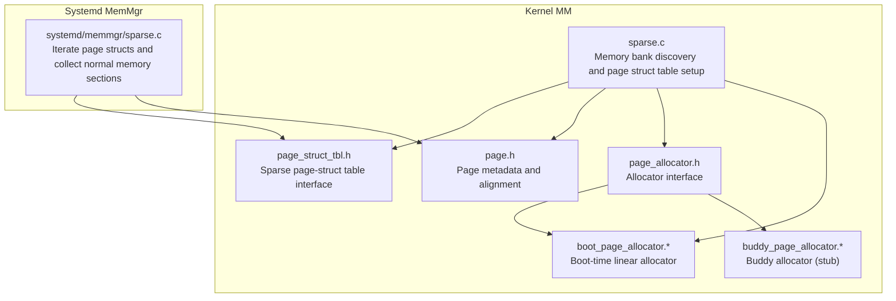
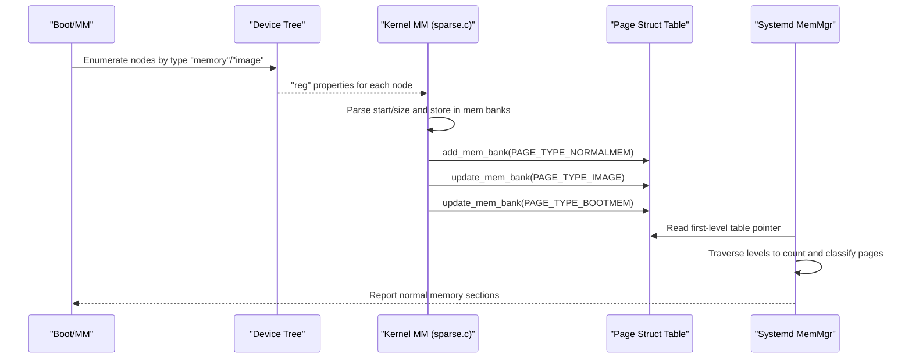
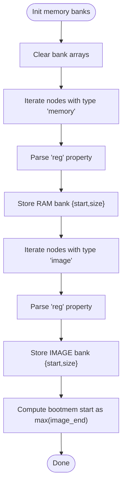
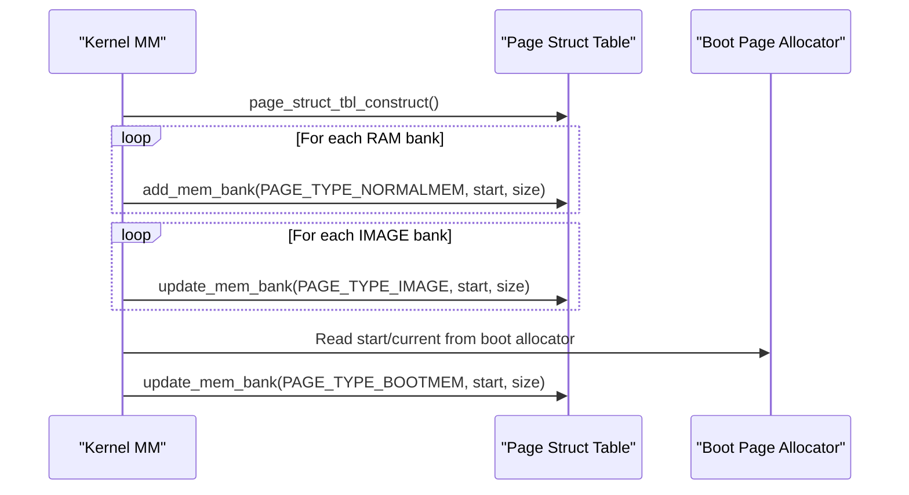
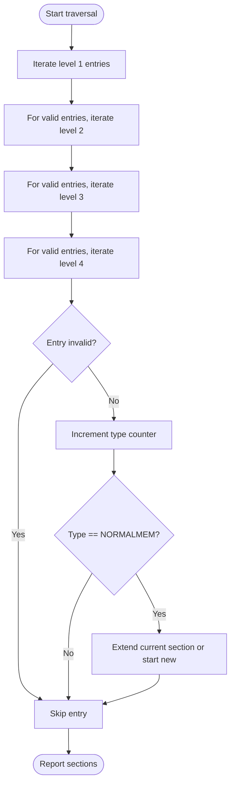
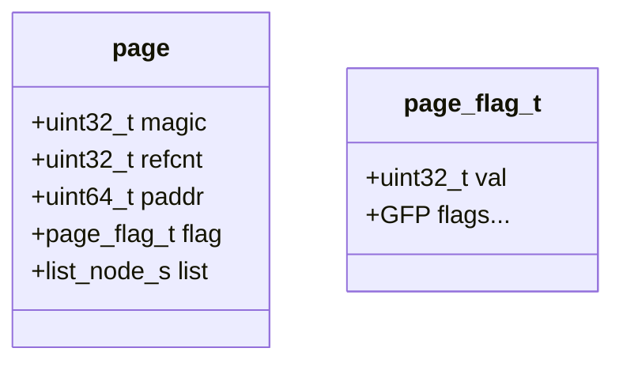
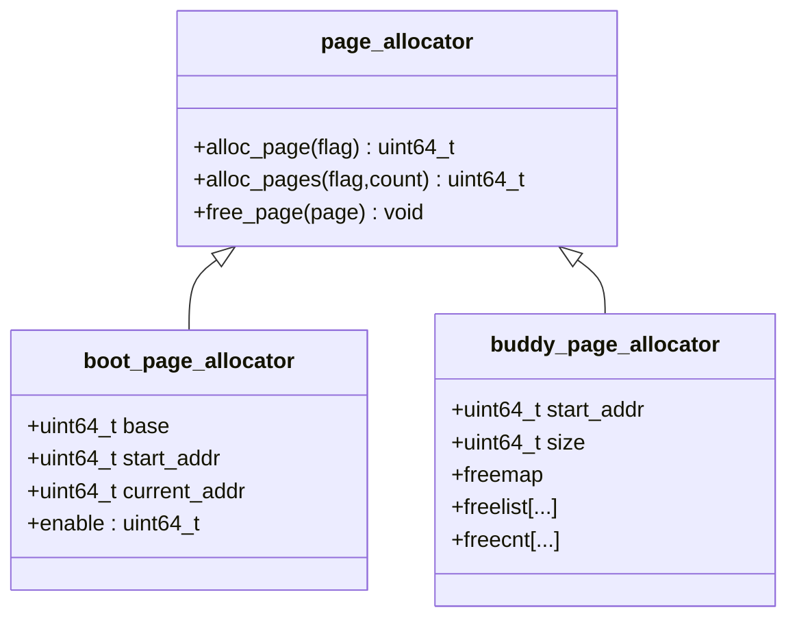
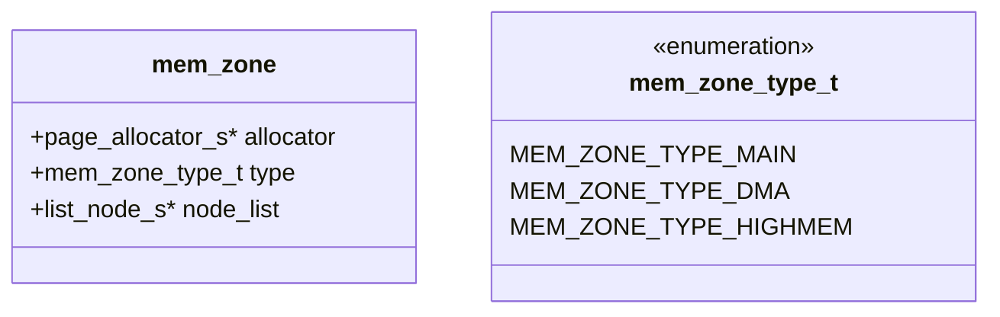
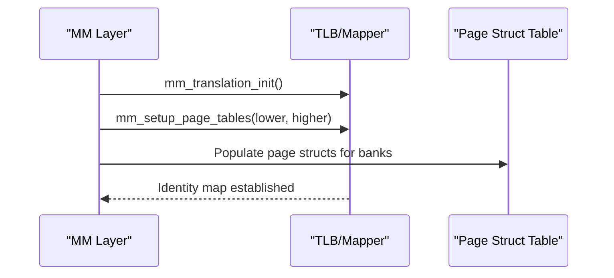
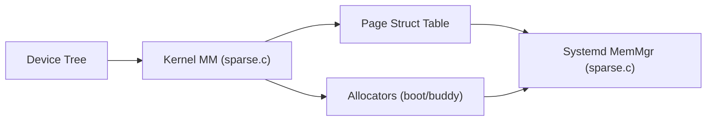

# Sparse Memory Allocation

<cite>
**Referenced Files in This Document**
- [sparse.c](file://kernel/mm/sparse.c)
- [sparse.h](file://kernel/include/mm/sparse.h)
- [mem_bank.h](file://kernel/include/mm/mem_bank.h)
- [mem_node.h](file://kernel/include/mm/mem_node.h)
- [mem_zone.h](file://kernel/include/mm/mem_zone.h)
- [page.h](file://kernel/include/mm/page.h)
- [page_struct_tbl.h](file://kernel/include/mm/page_struct_tbl.h)
- [page_allocator.h](file://kernel/include/mm/page_allocator.h)
- [boot_page_allocator.h](file://kernel/include/mm/impl/boot_page_allocator.h)
- [boot_page_allocator.c](file://kernel/mm/impl/boot_page_allocator.c)
- [buddy_page_allocator.h](file://kernel/include/mm/impl/buddy_page_allocator.h)
- [buddy_page_allocator.c](file://kernel/mm/impl/buddy_page_allocator.c)
- [mem_map.h](file://kernel/include/mm/mem_map.h)
- [mm.h](file://kernel/include/mm/mm.h)
- [sparse.c](file://kernel/systemd/memmgr/sparse.c)
</cite>

## Table of Contents
1. [Introduction](#introduction)
2. [Project Structure](#project-structure)
3. [Core Components](#core-components)
4. [Architecture Overview](#architecture-overview)
5. [Detailed Component Analysis](#detailed-component-analysis)
6. [Dependency Analysis](#dependency-analysis)
7. [Performance Considerations](#performance-considerations)
8. [Troubleshooting Guide](#troubleshooting-guide)
9. [Conclusion](#conclusion)
10. [Appendices](#appendices)

## Introduction
This document explains the sparse memory allocation subsystem in TranquilOS. It focuses on how sparse memory management differs from traditional dense allocation (such as the buddy allocator), how physical memory banks are discovered and represented, how a sparse page-structure table organizes memory, and how memory zones and allocators interact. It also covers memory mapping operations, alignment and protection considerations, and performance characteristics of sparse allocation versus the buddy allocator.

## Project Structure
The sparse memory subsystem spans several kernel modules:
- Boot-time memory discovery and initialization in the machine-specific memory manager
- Sparse page-structure table construction and maintenance
- Zone-based organization and allocator interfaces
- System service integration for reporting and inspection

**Diagram sources**
- [sparse.c](file://kernel/mm/sparse.c#L52-L89)
- [page_struct_tbl.h](file://kernel/include/mm/page_struct_tbl.h#L37-L41)
- [page.h](file://kernel/include/mm/page.h#L23-L29)
- [page_allocator.h](file://kernel/include/mm/page_allocator.h#L18-L21)
- [boot_page_allocator.c](file://kernel/mm/impl/boot_page_allocator.c#L7-L24)
- [buddy_page_allocator.c](file://kernel/mm/impl/buddy_page_allocator.c#L6-L15)
- [sparse.c](file://kernel/systemd/memmgr/sparse.c#L104-L131)

**Section sources**
- [sparse.c](file://kernel/mm/sparse.c#L1-L104)
- [sparse.h](file://kernel/include/mm/sparse.h#L1-L17)
- [page_struct_tbl.h](file://kernel/include/mm/page_struct_tbl.h#L1-L47)
- [page.h](file://kernel/include/mm/page.h#L1-L31)
- [page_allocator.h](file://kernel/include/mm/page_allocator.h#L1-L23)
- [boot_page_allocator.h](file://kernel/include/mm/impl/boot_page_allocator.h#L1-L17)
- [boot_page_allocator.c](file://kernel/mm/impl/boot_page_allocator.c#L1-L47)
- [buddy_page_allocator.h](file://kernel/include/mm/impl/buddy_page_allocator.h#L1-L40)
- [buddy_page_allocator.c](file://kernel/mm/impl/buddy_page_allocator.c#L1-L27)
- [sparse.c](file://kernel/systemd/memmgr/sparse.c#L1-L131)

## Core Components
- Memory bank discovery and registration:
  - RAM and IMAGE memory banks are enumerated via the device tree and stored in arrays of memory bank descriptors.
  - Boot memory bounds are computed to inform the page-structure table.
- Sparse page-structure table:
  - A hierarchical page-structure table tracks per-page metadata and types across the physical address space.
  - The table is populated with normal memory banks, image memory, and boot memory segments.
- Zone-based organization:
  - Zones group pages by type and allocator policy; the allocator interface defines allocation/free operations.
- Allocator implementations:
  - Boot-time linear allocator for early allocations.
  - Buddy allocator placeholder for later switching to dense allocation when needed.

Key responsibilities:
- Discover memory banks and compute boot memory boundary
- Construct and populate the sparse page-structure table
- Iterate and report contiguous normal memory sections
- Provide interfaces for translation setup and allocator selection

**Section sources**
- [sparse.c](file://kernel/mm/sparse.c#L22-L89)
- [page_struct_tbl.h](file://kernel/include/mm/page_struct_tbl.h#L37-L41)
- [mem_bank.h](file://kernel/include/mm/mem_bank.h#L15-L19)
- [mem_zone.h](file://kernel/include/mm/mem_zone.h#L15-L19)
- [page_allocator.h](file://kernel/include/mm/page_allocator.h#L18-L21)
- [boot_page_allocator.c](file://kernel/mm/impl/boot_page_allocator.c#L7-L24)
- [buddy_page_allocator.c](file://kernel/mm/impl/buddy_page_allocator.c#L6-L15)

## Architecture Overview
The sparse memory subsystem integrates boot-time memory discovery, a sparse page-structure table, and allocator interfaces. The systemd-side sparse module traverses the page-structure table to identify contiguous normal memory sections suitable for dense allocation or mapping.

**Diagram sources**
- [sparse.c](file://kernel/mm/sparse.c#L26-L89)
- [page_struct_tbl.h](file://kernel/include/mm/page_struct_tbl.h#L37-L41)
- [sparse.c](file://kernel/systemd/memmgr/sparse.c#L104-L131)

## Detailed Component Analysis

### Memory Bank Discovery and Boot Memory Boundary
- Iterates device tree nodes labeled as "memory" and "image".
- Extracts base address and length from the "reg" property and stores them as memory banks.
- Computes the highest end address among IMAGE banks to determine the boot memory boundary.

**Diagram sources**
- [sparse.c](file://kernel/mm/sparse.c#L52-L73)

**Section sources**
- [sparse.c](file://kernel/mm/sparse.c#L26-L73)
- [mem_bank.h](file://kernel/include/mm/mem_bank.h#L15-L19)

### Sparse Page-Structure Table Construction
- Constructs the page-structure table and registers:
  - Normal memory banks as PAGE_TYPE_NORMALMEM
  - Image banks as PAGE_TYPE_IMAGE
  - Boot memory segment as PAGE_TYPE_BOOTMEM
- Boot memory segment is derived from the boot page allocator’s current state.

**Diagram sources**
- [sparse.c](file://kernel/mm/sparse.c#L75-L104)
- [page_struct_tbl.h](file://kernel/include/mm/page_struct_tbl.h#L37-L41)
- [boot_page_allocator.c](file://kernel/mm/impl/boot_page_allocator.c#L7-L24)

**Section sources**
- [sparse.c](file://kernel/mm/sparse.c#L75-L104)
- [page_struct_tbl.h](file://kernel/include/mm/page_struct_tbl.h#L37-L41)
- [boot_page_allocator.c](file://kernel/mm/impl/boot_page_allocator.c#L7-L24)

### Systemd Sparse Module: Traversing the Page-Structure Table
- Reads the page-structure table pointer from the OS control interface.
- Recursively traverses the four-level table to:
  - Count pages by type
  - Identify contiguous normal memory sections
  - Build a compact list of sections for mapping and allocation strategies

**Diagram sources**
- [sparse.c](file://kernel/systemd/memmgr/sparse.c#L18-L86)

**Section sources**
- [sparse.c](file://kernel/systemd/memmgr/sparse.c#L104-L131)
- [page_struct_tbl.h](file://kernel/include/mm/page_struct_tbl.h#L22-L32)

### Page Metadata and Alignment
- Pages carry metadata including magic, reference count, physical address, and flags.
- Pages are aligned to ensure cache-line friendly access and atomic operations.

**Diagram sources**
- [page.h](file://kernel/include/mm/page.h#L23-L29)

**Section sources**
- [page.h](file://kernel/include/mm/page.h#L12-L29)

### Allocator Interfaces and Implementations
- The allocator interface defines allocation/free operations for single pages and multiple pages.
- Boot-time allocator:
  - Linear allocation from a base with an advancing cursor.
  - No free operation; memory is owned by the boot stage.
- Buddy allocator:
  - Placeholder with stubbed operations; intended for dense allocation later.

**Diagram sources**
- [page_allocator.h](file://kernel/include/mm/page_allocator.h#L18-L21)
- [boot_page_allocator.h](file://kernel/include/mm/impl/boot_page_allocator.h#L7-L13)
- [buddy_page_allocator.h](file://kernel/include/mm/impl/buddy_page_allocator.h#L28-L36)

**Section sources**
- [page_allocator.h](file://kernel/include/mm/page_allocator.h#L8-L21)
- [boot_page_allocator.c](file://kernel/mm/impl/boot_page_allocator.c#L7-L33)
- [buddy_page_allocator.c](file://kernel/mm/impl/buddy_page_allocator.c#L6-L19)

### Zone-Based Memory Management
- Zones group pages by type and associate an allocator.
- Zone types include main, DMA, and high-memory categories.

**Diagram sources**
- [mem_zone.h](file://kernel/include/mm/mem_zone.h#L9-L19)

**Section sources**
- [mem_zone.h](file://kernel/include/mm/mem_zone.h#L1-L21)

### Relationship Between Physical and Virtual Memory
- Translation setup and identity mapping are managed by the MM layer.
- The sparse subsystem relies on the page-structure table to understand physical memory layout and types.

**Diagram sources**
- [mm.h](file://kernel/include/mm/mm.h#L12-L16)
- [sparse.c](file://kernel/mm/sparse.c#L75-L89)

**Section sources**
- [mm.h](file://kernel/include/mm/mm.h#L8-L21)
- [sparse.c](file://kernel/mm/sparse.c#L75-L89)

## Dependency Analysis
The sparse memory subsystem depends on:
- Device tree parsing for memory bank discovery
- Page-structure table for sparse metadata
- Allocator interfaces for allocation policies
- Systemd integration for reporting and inspection

**Diagram sources**
- [sparse.c](file://kernel/mm/sparse.c#L52-L89)
- [page_struct_tbl.h](file://kernel/include/mm/page_struct_tbl.h#L37-L41)
- [sparse.c](file://kernel/systemd/memmgr/sparse.c#L104-L131)

**Section sources**
- [sparse.c](file://kernel/mm/sparse.c#L52-L104)
- [page_struct_tbl.h](file://kernel/include/mm/page_struct_tbl.h#L37-L41)
- [sparse.c](file://kernel/systemd/memmgr/sparse.c#L104-L131)

## Performance Considerations
- Sparse vs dense trade-offs:
  - Sparse allocation uses a page-structure table to track per-page state without requiring contiguous physical blocks. This reduces internal fragmentation but adds indirection overhead.
  - Dense allocation (buddy allocator) groups pages into orders and merges/splits blocks, reducing fragmentation at the cost of potential external fragmentation and alignment constraints.
- Fragmentation handling:
  - Sparse relies on the page-structure table to mark and traverse contiguous normal memory sections for mapping or dense allocation.
  - Buddy allocator uses buddy merging to coalesce free blocks after deallocation.
- Efficiency strategies:
  - Use sparse for heterogeneous memory layouts and early boot stages.
  - Migrate to buddy allocator for bulk allocations and steady-state workloads.
  - Align allocations to page boundaries to minimize TLB pressure and improve mapping efficiency.

[No sources needed since this section provides general guidance]

## Troubleshooting Guide
Common issues and diagnostics:
- Page-structure table is null:
  - Ensure the OS control interface exposes a valid pointer to the page-structure table.
- No normal memory sections found:
  - Verify that normal memory banks were registered and that traversal counted PAGE_TYPE_NORMALMEM entries.
- Boot memory boundary incorrect:
  - Confirm IMAGE bank enumeration and computation of the maximum end address.
- Allocator disabled or uninitialized:
  - Check boot page allocator enable flag and that the allocator is set in the MM layer.

**Section sources**
- [sparse.c](file://kernel/systemd/memmgr/sparse.c#L104-L131)
- [sparse.c](file://kernel/mm/sparse.c#L91-L104)
- [boot_page_allocator.c](file://kernel/mm/impl/boot_page_allocator.c#L7-L14)

## Conclusion
TranquilOS employs a sparse memory allocation approach centered around a hierarchical page-structure table and device-tree-driven memory bank discovery. This enables flexible handling of heterogeneous memory layouts and early boot scenarios. The subsystem integrates with zone-based allocators and provides mechanisms to identify contiguous normal memory for dense allocation strategies. Compared to a buddy allocator, sparse allocation trades indirection for adaptability, while buddy allocation optimizes for bulk allocations and reduces fragmentation at the cost of alignment and merging complexity.

[No sources needed since this section summarizes without analyzing specific files]

## Appendices

### Appendix A: Memory Types and Regions
- Memory types include text, rodata, and rwdata regions for boot-time memory maps.
- These types assist in organizing and protecting memory segments during early boot.

**Section sources**
- [mem_map.h](file://kernel/include/mm/mem_map.h#L7-L25)

### Appendix B: Example Allocation Patterns
- Boot-time allocations:
  - Use the boot page allocator to allocate pages sequentially from a base address until the boot stage completes.
- Sparse inspection:
  - Traverse the page-structure table to enumerate normal memory sections and prepare them for mapping or dense allocation.

**Section sources**
- [boot_page_allocator.c](file://kernel/mm/impl/boot_page_allocator.c#L7-L24)
- [sparse.c](file://kernel/systemd/memmgr/sparse.c#L18-L86)