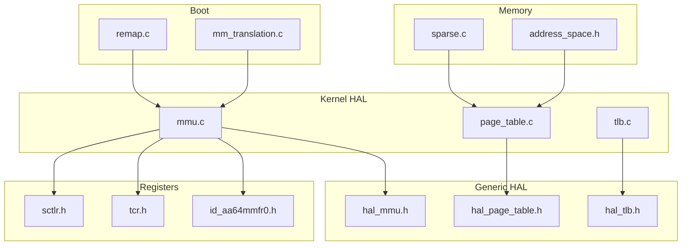
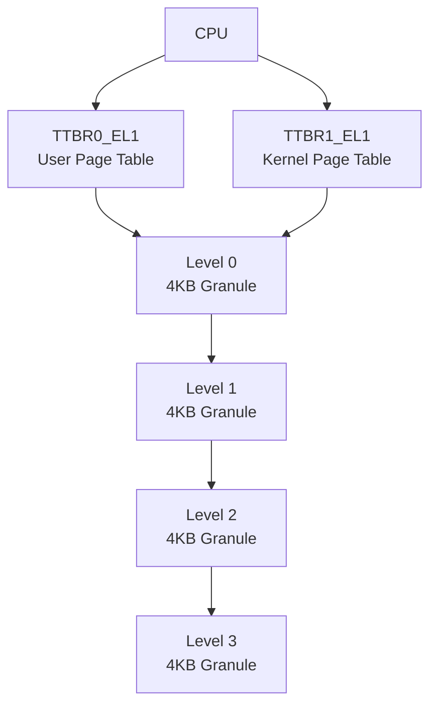
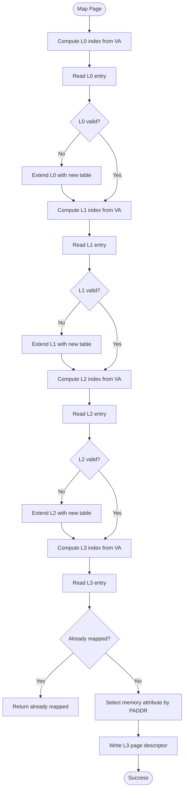
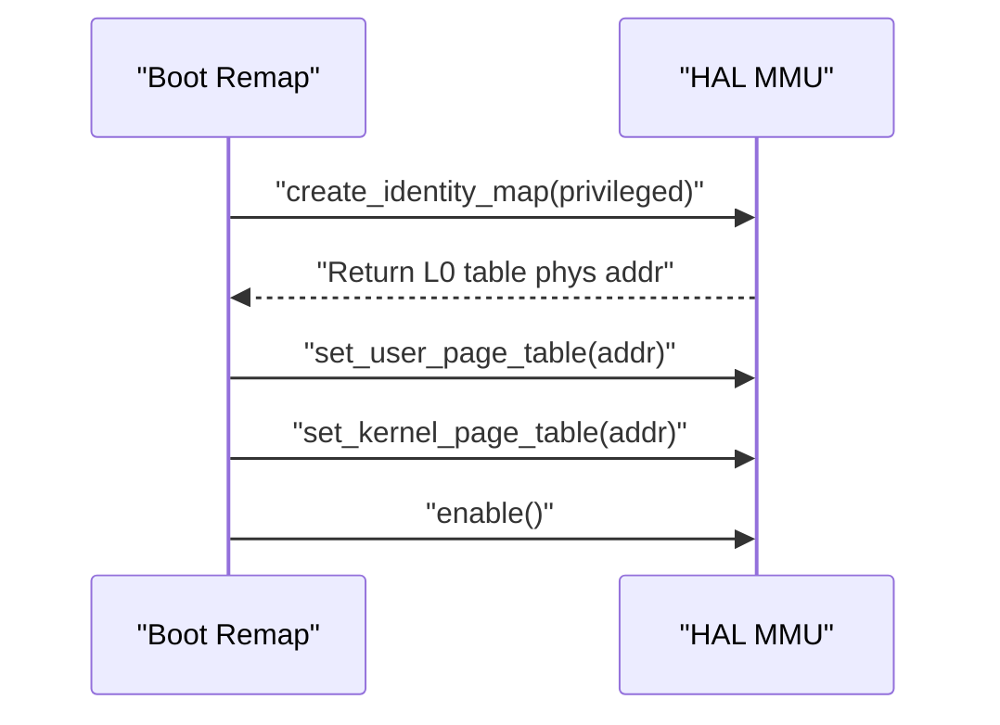
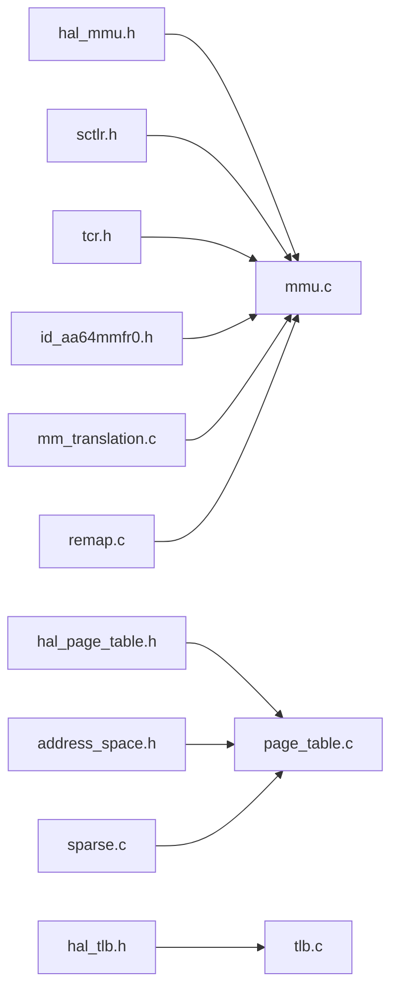

# Virtual Memory Management

<cite>
**Referenced Files in This Document**
- [mmu.c](file://kernel/arch/arm64/mmu.c)
- [page_table.c](file://kernel/arch/arm64/page_table.c)
- [tlb.c](file://kernel/arch/arm64/tlb.c)
- [mm_translation.c](file://boot/mm/mm_translation.c)
- [remap.c](file://boot/mm/remap.c)
- [mmu.h](file://kernel/include/arch/arm64/mmu.h)
- [tcr.h](file://kernel/include/arch/arm64/registers/tcr.h)
- [sctlr.h](file://kernel/include/arch/arm64/registers/sctlr.h)
- [id_aa64mmfr0.h](file://kernel/include/arch/arm64/registers/id_aa64mmfr0.h)
- [hal_mmu.h](file://kernel/include/arch/generic/hal_mmu.h)
- [hal_page_table.h](file://kernel/include/arch/generic/hal_page_table.h)
- [hal_tlb.h](file://kernel/include/arch/generic/hal_tlb.h)
- [address_space.h](file://kernel/include/mm/address_space.h)
- [sparse.c](file://kernel/mm/sparse.c)
- [sparse.h](file://kernel/include/mm/sparse.h)
</cite>

## Table of Contents
1. [Introduction](#introduction)
2. [Project Structure](#project-structure)
3. [Core Components](#core-components)
4. [Architecture Overview](#architecture-overview)
5. [Detailed Component Analysis](#detailed-component-analysis)
6. [Dependency Analysis](#dependency-analysis)
7. [Performance Considerations](#performance-considerations)
8. [Troubleshooting Guide](#troubleshooting-guide)
9. [Conclusion](#conclusion)
10. [Appendices](#appendices)

## Introduction
This document explains the ARM64 virtual memory management implementation in the kernel. It covers the MMU initialization, page table structures (levels 1–4), translation lookaside buffer (TLB) management, virtual-to-physical address translation, page table entry formats, memory protection, kernel vs. user address spaces, identity mapping, dynamic page table updates, page fault handling, TLB invalidation, cache coherency, performance optimizations, memory mapping strategies, and integration with the sparse memory allocation system.

## Project Structure
The virtual memory subsystem spans several modules:
- Boot-time MMU setup and identity mapping
- Runtime HAL for MMU, page tables, and TLB
- Register definitions for SCTLR_EL1, TCR_EL1, and ID_AA64MMFR0
- Generic HAL interfaces for MMU and TLB
- Address space abstraction and mapping APIs
- Sparse memory allocation integration



**Diagram sources**
- [mm_translation.c](file://boot/mm/mm_translation.c#L99-L162)
- [remap.c](file://boot/mm/remap.c#L30-L38)
- [mmu.c](file://kernel/arch/arm64/mmu.c#L62-L126)
- [page_table.c](file://kernel/arch/arm64/page_table.c#L9-L94)
- [tlb.c](file://kernel/arch/arm64/tlb.c#L44-L68)
- [sctlr.h](file://kernel/include/arch/arm64/registers/sctlr.h#L6-L59)
- [tcr.h](file://kernel/include/arch/arm64/registers/tcr.h#L6-L54)
- [id_aa64mmfr0.h](file://kernel/include/arch/arm64/registers/id_aa64mmfr0.h#L14-L33)
- [hal_mmu.h](file://kernel/include/arch/generic/hal_mmu.h#L7-L28)
- [hal_page_table.h](file://kernel/include/arch/generic/hal_page_table.h#L8-L12)
- [hal_tlb.h](file://kernel/include/arch/generic/hal_tlb.h#L7-L15)
- [address_space.h](file://kernel/include/mm/address_space.h#L11-L18)
- [sparse.c](file://kernel/mm/sparse.c#L52-L89)

**Section sources**
- [mm_translation.c](file://boot/mm/mm_translation.c#L99-L162)
- [remap.c](file://boot/mm/remap.c#L30-L38)
- [mmu.c](file://kernel/arch/arm64/mmu.c#L62-L126)
- [page_table.c](file://kernel/arch/arm64/page_table.c#L9-L94)
- [tlb.c](file://kernel/arch/arm64/tlb.c#L44-L68)
- [sctlr.h](file://kernel/include/arch/arm64/registers/sctlr.h#L6-L59)
- [tcr.h](file://kernel/include/arch/arm64/registers/tcr.h#L6-L54)
- [id_aa64mmfr0.h](file://kernel/include/arch/arm64/registers/id_aa64mmfr0.h#L14-L33)
- [hal_mmu.h](file://kernel/include/arch/generic/hal_mmu.h#L7-L28)
- [hal_page_table.h](file://kernel/include/arch/generic/hal_page_table.h#L8-L12)
- [hal_tlb.h](file://kernel/include/arch/generic/hal_tlb.h#L7-L15)
- [address_space.h](file://kernel/include/mm/address_space.h#L11-L18)
- [sparse.c](file://kernel/mm/sparse.c#L52-L89)

## Core Components
- MMU initialization and control:
  - Enables/disables MMU, configures MAIR, TCR, and SCTLR, sets TTBR0/TTBR1, and supports identity mapping.
- Page table management:
  - Provides mapping and extension routines for levels 0–3 under a 4-level page table hierarchy with 4KB granule.
- TLB management:
  - Implements comprehensive TLB invalidation primitives for all contexts and pages.
- Address space abstraction:
  - Defines indices and masks for VA slicing across four page table levels.
- Sparse memory integration:
  - Discovers memory banks via device tree and initializes page structure tables for normal and image memory.

**Section sources**
- [mmu.c](file://kernel/arch/arm64/mmu.c#L62-L126)
- [page_table.c](file://kernel/arch/arm64/page_table.c#L9-L94)
- [tlb.c](file://kernel/arch/arm64/tlb.c#L44-L68)
- [address_space.h](file://kernel/include/mm/address_space.h#L11-L18)
- [sparse.c](file://kernel/mm/sparse.c#L52-L89)

## Architecture Overview
The ARM64 MMU uses a 4-level page table hierarchy with 4KB granules and a 48-bit virtual address space. The kernel configures translation control (TCR_EL1), memory attributes (MAIR_EL1), and system control (SCTLR_EL1). Identity mapping is established during boot and later switched to runtime page tables. The HAL exposes generic interfaces for MMU, page table operations, and TLB invalidation.



**Diagram sources**
- [mmu.c](file://kernel/arch/arm64/mmu.c#L153-L159)
- [address_space.h](file://kernel/include/mm/address_space.h#L11-L18)
- [mmu.h](file://kernel/include/arch/arm64/mmu.h#L69-L114)

**Section sources**
- [mmu.c](file://kernel/arch/arm64/mmu.c#L153-L159)
- [address_space.h](file://kernel/include/mm/address_space.h#L11-L18)
- [mmu.h](file://kernel/include/arch/arm64/mmu.h#L69-L114)

## Detailed Component Analysis

### MMU Initialization and Control
- Initializes MAIR with device and normal memory attributes.
- Reads ID_AA64MMFR0_EL1 to detect supported physical address range and granule support.
- Configures TCR_EL1 with:
  - 4KB granule for both TTBR0 and TTBR1.
  - Inner/outer cacheability and shareability policies.
  - T0SZ/T1SZ to define kernel/user region boundaries.
  - ASID selection based on hardware capabilities.
- Enables/disables MMU via SCTLR_EL1 and ensures cache coherency with dsb/isb.

```mermaid
sequenceDiagram
participant Boot as "Boot/MMU Init"
participant Reg as "Registers"
participant HAL as "HAL MMU"
Boot->>Reg : "Read ID_AA64MMFR0_EL1"
Boot->>Reg : "Write MAIR_EL1"
Boot->>Reg : "Configure TCR_EL1"
Boot->>HAL : "Enable MMU"
HAL->>Reg : "Set SCTLR_EL1.M/C/I"
HAL->>Reg : "dsb; isb"
```

**Diagram sources**
- [mm_translation.c](file://boot/mm/mm_translation.c#L99-L162)
- [mmu.c](file://kernel/arch/arm64/mmu.c#L62-L126)
- [sctlr.h](file://kernel/include/arch/arm64/registers/sctlr.h#L6-L59)
- [tcr.h](file://kernel/include/arch/arm64/registers/tcr.h#L6-L54)
- [id_aa64mmfr0.h](file://kernel/include/arch/arm64/registers/id_aa64mmfr0.h#L14-L33)

**Section sources**
- [mm_translation.c](file://boot/mm/mm_translation.c#L99-L162)
- [mmu.c](file://kernel/arch/arm64/mmu.c#L62-L126)
- [sctlr.h](file://kernel/include/arch/arm64/registers/sctlr.h#L6-L59)
- [tcr.h](file://kernel/include/arch/arm64/registers/tcr.h#L6-L54)
- [id_aa64mmfr0.h](file://kernel/include/arch/arm64/registers/id_aa64mmfr0.h#L14-L33)

### Page Table Structures and Translation
- 4-level page table hierarchy with 4KB granules and 48-bit VA.
- VA slicing:
  - Level 0: bits 47:39
  - Level 1: bits 38:30
  - Level 2: bits 29:21
  - Level 3: bits 20:12 (page offset)
- Entry formats:
  - Table descriptor: valid/type/next-level address/APTable/XNTable/NSTable.
  - Page descriptor: valid/type/attrIndx/AP/SH/outputAddress/PXN/UXN.
  - Block descriptors for levels 1 and 2 (not shown here but defined in headers).
- Mapping:
  - hal_page_table_try_map_page maps a single 4KB page, selecting memory attributes based on physical address ranges.
  - hal_page_table_extend extends the page table by allocating new level tables where entries are invalid.



**Diagram sources**
- [page_table.c](file://kernel/arch/arm64/page_table.c#L9-L94)
- [address_space.h](file://kernel/include/mm/address_space.h#L11-L18)
- [mmu.h](file://kernel/include/arch/arm64/mmu.h#L93-L114)

**Section sources**
- [page_table.c](file://kernel/arch/arm64/page_table.c#L9-L94)
- [address_space.h](file://kernel/include/mm/address_space.h#L11-L18)
- [mmu.h](file://kernel/include/arch/arm64/mmu.h#L93-L114)

### TLB Management
- Comprehensive TLB invalidation set covering:
  - All levels (E1/E2/E3), per-VM, per-ASID, per-page, and instruction/data variants.
- Invalidation sequences:
  - Invalidate all contexts, then dsb; isb for ordering.
  - Invalidate single pages and ranges by iterating page addresses.

```mermaid
sequenceDiagram
participant Caller as "Caller"
participant HAL as "HAL TLB"
participant ASM as "ASM TLBI"
Caller->>HAL : "invalidate_all()"
HAL->>ASM : "TLBI VMALLE1IS"
HAL->>HAL : "dsb; isb"
Caller->>HAL : "invalidate_page(vaddr)"
HAL->>ASM : "TLBI VAE1IS, vaddr"
HAL->>HAL : "dsb; isb"
```

**Diagram sources**
- [tlb.c](file://kernel/arch/arm64/tlb.c#L44-L68)

**Section sources**
- [tlb.c](file://kernel/arch/arm64/tlb.c#L44-L68)

### Identity Mapping and Switching
- Identity mapping is generated during boot with privileged/unprivileged variants.
- The mapping uses block descriptors for level 1 and table descriptors for level 0.
- After generation, TTBR0/TTBR1 are set to the identity table, then MMU is enabled.



**Diagram sources**
- [remap.c](file://boot/mm/remap.c#L30-L38)
- [mm_translation.c](file://boot/mm/mm_translation.c#L164-L225)
- [mmu.c](file://kernel/arch/arm64/mmu.c#L153-L159)

**Section sources**
- [remap.c](file://boot/mm/remap.c#L30-L38)
- [mm_translation.c](file://boot/mm/mm_translation.c#L164-L225)
- [mmu.c](file://kernel/arch/arm64/mmu.c#L153-L159)

### Address Space Separation (Kernel vs. User)
- TTBR0_EL1 is used for user space; TTBR1_EL1 for kernel space.
- VA regions:
  - TTBR0: 0x0000000000000000 to 0x0000FFFFFFFFFFFF
  - TTBR1: 0xFFFF000000000000 to 0xFFFFFFFFFFFFFFFF
- Access permissions:
  - AP bits and PXN/UXN control privilege and execution.

**Section sources**
- [mmu.h](file://kernel/include/arch/arm64/mmu.h#L55-L58)
- [mmu.h](file://kernel/include/arch/arm64/mmu.h#L116-L141)

### Dynamic Page Table Updates
- hal_page_table_extend allocates new level tables when entries are invalid.
- hal_page_table_try_map_page writes leaf page descriptors with appropriate attributes.

**Section sources**
- [page_table.c](file://kernel/arch/arm64/page_table.c#L96-L167)
- [page_table.c](file://kernel/arch/arm64/page_table.c#L9-L94)

### Page Fault Handling
- Not implemented in the analyzed files. Typically handled by exception handlers that:
  - Identify faulting address and cause (permission, no mapping, etc.).
  - Trigger page allocation and mapping or signal the process.
- Integration points:
  - Use hal_page_table_try_map_page to lazily map missing pages.
  - Invalidate TLB entries after updates.

[No sources needed since this section describes conceptual handling not present in specific files]

### Cache Coherency and Memory Attributes
- MAIR_EL1 configured with device and normal memory attributes.
- TCR_EL1 sets inner/outer cacheability and shareability for data caches.
- dsb/isb used after enabling/disabling MMU and after TLB invalidations.

**Section sources**
- [mm_translation.c](file://boot/mm/mm_translation.c#L110-L119)
- [mmu.c](file://kernel/arch/arm64/mmu.c#L73-L82)
- [mmu.c](file://kernel/arch/arm64/mmu.c#L129-L139)
- [tlb.c](file://kernel/arch/arm64/tlb.c#L44-L48)

### Integration with Sparse Memory Allocation
- Memory banks discovered via device tree nodes "memory" and "image".
- Page structure table initialized with RAM and image banks; boot memory update tracked separately.

**Section sources**
- [sparse.c](file://kernel/mm/sparse.c#L52-L89)

## Dependency Analysis


**Diagram sources**
- [hal_mmu.h](file://kernel/include/arch/generic/hal_mmu.h#L14-L28)
- [hal_page_table.h](file://kernel/include/arch/generic/hal_page_table.h#L8-L12)
- [hal_tlb.h](file://kernel/include/arch/generic/hal_tlb.h#L7-L15)
- [sctlr.h](file://kernel/include/arch/arm64/registers/sctlr.h#L6-L59)
- [tcr.h](file://kernel/include/arch/arm64/registers/tcr.h#L6-L54)
- [id_aa64mmfr0.h](file://kernel/include/arch/arm64/registers/id_aa64mmfr0.h#L14-L33)
- [address_space.h](file://kernel/include/mm/address_space.h#L11-L18)
- [sparse.c](file://kernel/mm/sparse.c#L52-L89)
- [mm_translation.c](file://boot/mm/mm_translation.c#L99-L162)
- [remap.c](file://boot/mm/remap.c#L30-L38)

**Section sources**
- [hal_mmu.h](file://kernel/include/arch/generic/hal_mmu.h#L14-L28)
- [hal_page_table.h](file://kernel/include/arch/generic/hal_page_table.h#L8-L12)
- [hal_tlb.h](file://kernel/include/arch/generic/hal_tlb.h#L7-L15)
- [sctlr.h](file://kernel/include/arch/arm64/registers/sctlr.h#L6-L59)
- [tcr.h](file://kernel/include/arch/arm64/registers/tcr.h#L6-L54)
- [id_aa64mmfr0.h](file://kernel/include/arch/arm64/registers/id_aa64mmfr0.h#L14-L33)
- [address_space.h](file://kernel/include/mm/address_space.h#L11-L18)
- [sparse.c](file://kernel/mm/sparse.c#L52-L89)
- [mm_translation.c](file://boot/mm/mm_translation.c#L99-L162)
- [remap.c](file://boot/mm/remap.c#L30-L38)

## Performance Considerations
- Minimize TLB misses by grouping mappings in large pages where possible.
- Use block descriptors for large aligned regions to reduce page table depth.
- Batch TLB invalidations for ranges rather than per-page when feasible.
- Keep ASID usage consistent across context switches to leverage ASID-based invalidation.
- Configure cacheability appropriately via MAIR to avoid unnecessary cache pollution.

[No sources needed since this section provides general guidance]

## Troubleshooting Guide
- MMU fails to enable:
  - Verify TCR/MAIR/SCTLR values and ensure dsb/isb are executed after changes.
- Page faults on user accesses:
  - Confirm TTBR0 mapping exists and AP/PXN/UXN bits match intended access patterns.
- TLB inconsistencies after updates:
  - Ensure TLBI VMALLE1IS or targeted invalidations are performed after updating page tables.
- Identity mapping issues:
  - Validate that TTBR0/TTBR1 are set to the identity table before enabling MMU.

**Section sources**
- [mmu.c](file://kernel/arch/arm64/mmu.c#L129-L139)
- [tlb.c](file://kernel/arch/arm64/tlb.c#L44-L68)
- [remap.c](file://boot/mm/remap.c#L30-L38)

## Conclusion
The ARM64 virtual memory subsystem provides a robust 4-level page table hierarchy with 4KB granularity, configurable memory attributes, and comprehensive TLB invalidation. Boot-time identity mapping transitions to runtime page tables, with HAL abstractions enabling portable MMU operations. Integration with sparse memory allocation supports flexible memory layout across platforms.

## Appendices

### Page Table Entry Formats
- Table descriptor (L0/L1/L2):
  - Valid, Type, Next-Level Table Address, Access Permissions, eXecute Never, Nested Shared, etc.
- Page descriptor (L3):
  - Valid, Type, Memory Attribute Index, Non-Secure, Access Permissions, Shareability, Accessed/Fetched, Output Address, Privileged/Unprivileged eXecute Never, etc.

**Section sources**
- [mmu.h](file://kernel/include/arch/arm64/mmu.h#L75-L114)