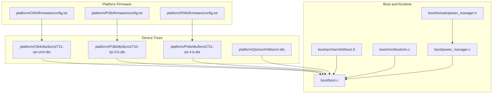
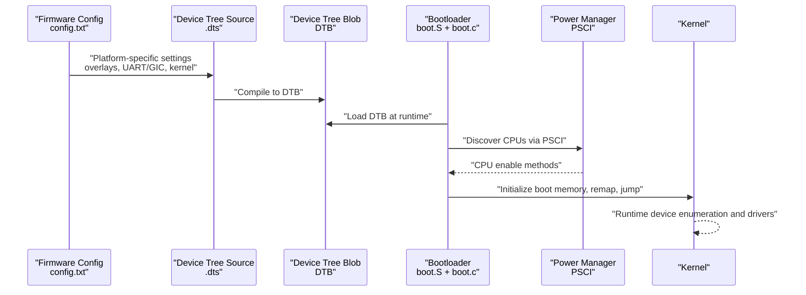
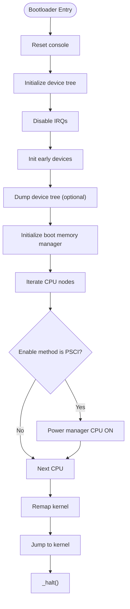
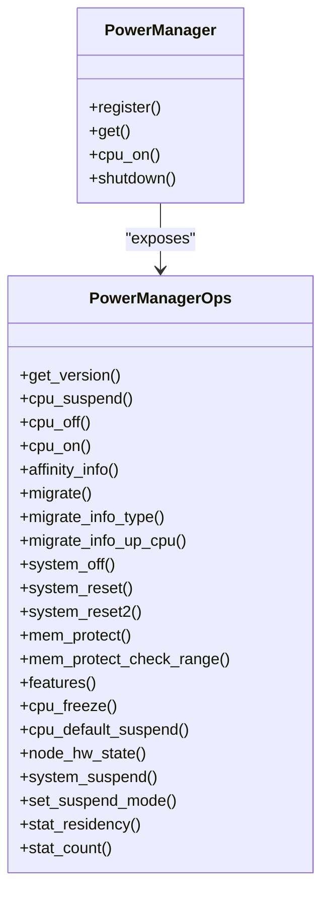
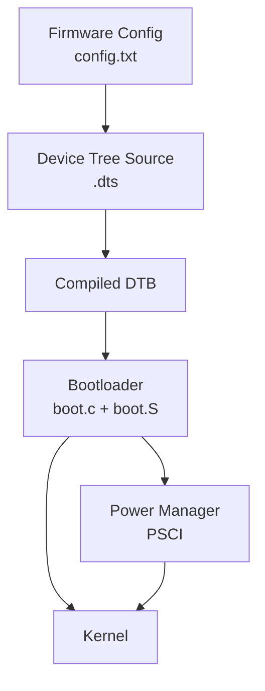

# Firmware and Configuration

<cite>
**Referenced Files in This Document**
- [config.txt (CM4)](file://platform/CM4/firmware/config.txt)
- [config.txt (Pi3b)](file://platform/Pi3b/firmware/config.txt)
- [config.txt (Pi4b)](file://platform/Pi4b/firmware/config.txt)
- [bcm2711-rpi-cm4.dts](file://platform/CM4/dts/bcm2711-rpi-cm4.dts)
- [bcm2710-rpi-3-b.dts](file://platform/Pi3b/dts/bcm2710-rpi-3-b.dts)
- [bcm2711-rpi-4-b.dts](file://platform/Pi4b/dts/bcm2711-rpi-4-b.dts)
- [virt.dts](file://platform/QemuVirt/dts/virt.dts)
- [boot.c](file://boot/boot.c)
- [boot.S](file://boot/arch/arm64/boot.S)
- [bootmm.c](file://boot/mm/bootmm.c)
- [power_manager.c](file://boot/power_manager.c)
- [power_manager.h](file://boot/include/power_manager.h)
</cite>

## Table of Contents
1. [Introduction](#introduction)
2. [Project Structure](#project-structure)
3. [Core Components](#core-components)
4. [Architecture Overview](#architecture-overview)
5. [Detailed Component Analysis](#detailed-component-analysis)
6. [Dependency Analysis](#dependency-analysis)
7. [Performance Considerations](#performance-considerations)
8. [Troubleshooting Guide](#troubleshooting-guide)
9. [Conclusion](#conclusion)
10. [Appendices](#appendices)

## Introduction
This document explains firmware configuration and platform-specific settings in TranquilOS. It covers the firmware initialization process, hardware parameter configuration, and platform-specific boot parameters. It also details how firmware settings relate to kernel initialization, including clock speeds, memory timings, and peripheral configurations. Practical guidance is provided for firmware updates, configuration validation, troubleshooting firmware-related issues, platform-specific optimizations, power management settings, and enabling hardware features. Examples illustrate configuration for different hardware variants and optimization scenarios.

## Project Structure
TranquilOS organizes firmware and platform configuration under platform-specific directories. Each platform variant defines:
- Firmware configuration files (config.txt) for bootloader and device overlays.
- Device Tree Sources (.dts) describing memory layout, clocks, and peripherals.
- Build-time linker scripts and platform-specific images.

**Diagram sources**
- [config.txt (CM4)](file://platform/CM4/firmware/config.txt#L1-L14)
- [config.txt (Pi3b)](file://platform/Pi3b/firmware/config.txt#L1-L14)
- [config.txt (Pi4b)](file://platform/Pi4b/firmware/config.txt#L1-L14)
- [bcm2711-rpi-cm4.dts](file://platform/CM4/dts/bcm2711-rpi-cm4.dts#L1-L120)
- [bcm2710-rpi-3-b.dts](file://platform/Pi3b/dts/bcm2710-rpi-3-b.dts#L1-L120)
- [bcm2711-rpi-4-b.dts](file://platform/Pi4b/dts/bcm2711-rpi-4-b.dts#L1-L120)
- [virt.dts](file://platform/QemuVirt/dts/virt.dts#L1-L120)
- [boot.c](file://boot/boot.c#L1-L176)
- [boot.S](file://boot/arch/arm64/boot.S#L1-L115)
- [bootmm.c](file://boot/mm/bootmm.c#L1-L29)
- [power_manager.c](file://boot/power_manager.c#L1-L27)
- [power_manager.h](file://boot/include/power_manager.h#L1-L74)

**Section sources**
- [config.txt (CM4)](file://platform/CM4/firmware/config.txt#L1-L14)
- [config.txt (Pi3b)](file://platform/Pi3b/firmware/config.txt#L1-L14)
- [config.txt (Pi4b)](file://platform/Pi4b/firmware/config.txt#L1-L14)
- [bcm2711-rpi-cm4.dts](file://platform/CM4/dts/bcm2711-rpi-cm4.dts#L1-L120)
- [bcm2710-rpi-3-b.dts](file://platform/Pi3b/dts/bcm2710-rpi-3-b.dts#L1-L120)
- [bcm2711-rpi-4-b.dts](file://platform/Pi4b/dts/bcm2711-rpi-4-b.dts#L1-L120)
- [virt.dts](file://platform/QemuVirt/dts/virt.dts#L1-L120)
- [boot.c](file://boot/boot.c#L1-L176)
- [boot.S](file://boot/arch/arm64/boot.S#L1-L115)
- [bootmm.c](file://boot/mm/bootmm.c#L1-L29)
- [power_manager.c](file://boot/power_manager.c#L1-L27)
- [power_manager.h](file://boot/include/power_manager.h#L1-L74)

## Core Components
- Firmware configuration files define platform-wide boot options, overlays, and kernel selection. They are shared across platforms to maintain consistent behavior while allowing per-platform overrides.
- Device Tree Sources encode runtime hardware topology, memory reservations, clocks, and peripheral nodes. These describe how firmware and kernel initialize hardware.
- Bootloader code initializes early devices, sets up memory management, discovers CPU topology via PSCI, and jumps to the kernel image located via the device tree.
- Power management integrates with PSCI to enable CPU onlining and system power operations.

Key responsibilities:
- Firmware config: select kernel image, enable UART/GIC, configure overlays and framebuffers.
- Device Tree: define memory layout, reserved regions, clocks, and device nodes.
- Bootloader: parse DTB, initialize boot-time memory, enable secondary CPUs, and transfer control to kernel.
- Power management: expose PSCI operations for CPU onlining and system control.

**Section sources**
- [config.txt (CM4)](file://platform/CM4/firmware/config.txt#L1-L14)
- [config.txt (Pi3b)](file://platform/Pi3b/firmware/config.txt#L1-L14)
- [config.txt (Pi4b)](file://platform/Pi4b/firmware/config.txt#L1-L14)
- [bcm2711-rpi-cm4.dts](file://platform/CM4/dts/bcm2711-rpi-cm4.dts#L11-L35)
- [bcm2710-rpi-3-b.dts](file://platform/Pi3b/dts/bcm2710-rpi-3-b.dts#L17-L45)
- [bcm2711-rpi-4-b.dts](file://platform/Pi4b/dts/bcm2711-rpi-4-b.dts#L17-L45)
- [boot.c](file://boot/boot.c#L82-L107)
- [power_manager.h](file://boot/include/power_manager.h#L38-L65)

## Architecture Overview
The firmware-to-kernel pipeline proceeds through firmware configuration, device tree generation, and bootloader initialization.

**Diagram sources**
- [config.txt (CM4)](file://platform/CM4/firmware/config.txt#L1-L14)
- [bcm2711-rpi-cm4.dts](file://platform/CM4/dts/bcm2711-rpi-cm4.dts#L11-L35)
- [boot.S](file://boot/arch/arm64/boot.S#L6-L22)
- [boot.c](file://boot/boot.c#L82-L107)
- [power_manager.h](file://boot/include/power_manager.h#L38-L65)

## Detailed Component Analysis

### Firmware Configuration Files
- Purpose: Control firmware behavior during boot, including enabling UART/GIC, selecting kernel image, configuring overlays, and framebuffer limits.
- Platform differences: While the [all] section is shared, platform-specific sections allow targeted overrides (e.g., overlays for GPU on CM4).
- Typical entries:
  - arm_64bit: Enable 64-bit operation.
  - enable_uart, uart_2ndstage: Enable serial console early in boot.
  - enable_gic: Enable Generic Interrupt Controller support.
  - bootcode_delay, boot_delay, boot_delay_ms: Tune boot delays for reliability.
  - dtoverlay and max_framebuffers: Configure GPU overlays and framebuffer count.
  - kernel: Select the kernel image filename.

Validation tips:
- Ensure the kernel filename matches the built image.
- Verify overlay compatibility with the SoC model.
- Confirm UART/GIC are enabled for debugging and interrupts.

**Section sources**
- [config.txt (CM4)](file://platform/CM4/firmware/config.txt#L1-L14)
- [config.txt (Pi3b)](file://platform/Pi3b/firmware/config.txt#L1-L14)
- [config.txt (Pi4b)](file://platform/Pi4b/firmware/config.txt#L1-L14)

### Device Tree Sources and Hardware Parameters
Device trees define hardware topology and resources:
- Memory layout and reserved regions:
  - Memory reservations at zero for firmware/runtime alignment.
  - Reserved memory blocks for firmware configuration and CMA.
- Clocks and timers:
  - Clock providers and frequencies for peripherals.
  - Timer nodes and interrupts.
- Peripherals:
  - GPIO, UART, SPI, I2C, SD/MMC, USB, Ethernet, and GPU nodes.
- CPU topology:
  - CPU nodes with enable-method (e.g., PSCI).
- Aliases and chosen:
  - stdout-path and bootargs for console and kernel parameters.

Examples of hardware parameters:
- Clock frequency for system timer.
- DMA ranges and bus ranges for SOC interconnects.
- GPIO pinmux groups for UART/I2C/SPI usage.
- Overlay and framebuffer configuration via aliases.

**Section sources**
- [bcm2711-rpi-cm4.dts](file://platform/CM4/dts/bcm2711-rpi-cm4.dts#L3-L111)
- [bcm2710-rpi-3-b.dts](file://platform/Pi3b/dts/bcm2710-rpi-3-b.dts#L3-L109)
- [bcm2711-rpi-4-b.dts](file://platform/Pi4b/dts/bcm2711-rpi-4-b.dts#L3-L151)
- [virt.dts](file://platform/QemuVirt/dts/virt.dts#L60-L467)

### Bootloader Initialization and Kernel Handoff
Bootloader responsibilities:
- Early initialization:
  - Reset console, initialize device tree, disable IRQs, initialize early devices.
  - Print splash and dump device tree for diagnostics.
- CPU enablement:
  - Iterate CPU nodes and enable via PSCI when indicated by enable-method.
- Memory management:
  - Initialize boot-time page allocator and remap kernel.
- Jump to kernel:
  - Locate kernel node by compatible string and jump to its address.

**Diagram sources**
- [boot.c](file://boot/boot.c#L82-L107)
- [bootmm.c](file://boot/mm/bootmm.c#L26-L29)
- [power_manager.c](file://boot/power_manager.c#L12-L21)

**Section sources**
- [boot.c](file://boot/boot.c#L82-L107)
- [bootmm.c](file://boot/mm/bootmm.c#L26-L29)
- [power_manager.c](file://boot/power_manager.c#L12-L21)

### Power Management and PSCI Integration
Power management exposes PSCI operations for CPU onlining and system control:
- Operations include suspend, off, on, migrate, system suspend/off/reset, and statistics.
- Registration allows the bootloader to call power operations for enabling secondary CPUs.

**Diagram sources**
- [power_manager.h](file://boot/include/power_manager.h#L38-L65)
- [power_manager.c](file://boot/power_manager.c#L6-L21)

**Section sources**
- [power_manager.h](file://boot/include/power_manager.h#L38-L65)
- [power_manager.c](file://boot/power_manager.c#L6-L21)

### Platform-Specific Firmware Optimizations
- Compute Module 4:
  - GPU overlay and framebuffer count configured via dtoverlay and max_framebuffers.
  - OTG mode enabled for USB host/peripheral flexibility.
- Raspberry Pi 3 and 4:
  - Shared [all] configuration for UART/GIC and kernel selection.
  - Console and audio bootargs tailored per platform.
- QEMU Virtual:
  - PSCI, GIC, and VirtIO devices defined for emulation.
  - CPU topology and memory layout adapted for virtualization.

Optimization scenarios:
- Enable UART/GIC for debugging and interrupt-driven peripherals.
- Increase framebuffer count for multi-head display setups.
- Adjust boot delays for unreliable SD/MMC or overclocked systems.
- Select appropriate overlays for GPU compute or display pipelines.

**Section sources**
- [config.txt (CM4)](file://platform/CM4/firmware/config.txt#L10-L14)
- [config.txt (Pi3b)](file://platform/Pi3b/firmware/config.txt#L1-L14)
- [config.txt (Pi4b)](file://platform/Pi4b/firmware/config.txt#L1-L14)
- [bcm2711-rpi-cm4.dts](file://platform/CM4/dts/bcm2711-rpi-cm4.dts#L83-L85)
- [bcm2710-rpi-3-b.dts](file://platform/Pi3b/dts/bcm2710-rpi-3-b.dts#L90-L94)
- [bcm2711-rpi-4-b.dts](file://platform/Pi4b/dts/bcm2711-rpi-4-b.dts#L111-L115)
- [virt.dts](file://platform/QemuVirt/dts/virt.dts#L51-L58)

## Dependency Analysis
Firmware configuration and device trees influence runtime behavior through the bootloader and kernel.

**Diagram sources**
- [config.txt (CM4)](file://platform/CM4/firmware/config.txt#L1-L14)
- [bcm2711-rpi-cm4.dts](file://platform/CM4/dts/bcm2711-rpi-cm4.dts#L11-L35)
- [boot.c](file://boot/boot.c#L82-L107)
- [power_manager.h](file://boot/include/power_manager.h#L38-L65)

**Section sources**
- [boot.c](file://boot/boot.c#L82-L107)
- [power_manager.h](file://boot/include/power_manager.h#L38-L65)

## Performance Considerations
- Boot delays: Tuning bootcode_delay, boot_delay, and boot_delay_ms can improve stability on slower storage or noisy environments.
- Framebuffer count: Limiting max_framebuffers reduces memory footprint on constrained systems.
- UART/GIC: Enabling early UART and GIC improves diagnostic throughput and interrupt responsiveness.
- Overlays: Select minimal overlays for performance-sensitive workloads; enable only required features.

[No sources needed since this section provides general guidance]

## Troubleshooting Guide
Common issues and resolutions:
- Kernel not found by device tree:
  - Ensure the kernel node exists with the expected compatible string and address.
  - Verify the kernel filename matches the firmware configuration.
- UART not available:
  - Confirm enable_uart and uart_2ndstage are set.
  - Check chosen stdout-path and aliases.
- CPU fail to come online:
  - Verify enable-method is PSCI and power manager is registered.
  - Confirm PSCI operations are available and functional.
- Boot hangs or early failures:
  - Reduce boot delays or disable problematic overlays.
  - Validate reserved memory and CMA allocations.
  - Inspect device tree dumps for missing nodes or incorrect ranges.

**Section sources**
- [boot.c](file://boot/boot.c#L34-L45)
- [boot.c](file://boot/boot.c#L169-L175)
- [power_manager.c](file://boot/power_manager.c#L12-L21)

## Conclusion
TranquilOS integrates firmware configuration and platform-specific device trees to deliver a robust, portable boot experience. Firmware settings control early boot behavior, overlays, and kernel selection, while device trees define hardware topology and resources. The bootloader leverages PSCI for CPU enablement and transfers control to the kernel after initializing boot-time memory and remapping. By validating configuration against device tree expectations and applying platform-specific optimizations, developers can achieve reliable and efficient system startup across diverse hardware variants.

[No sources needed since this section summarizes without analyzing specific files]

## Appendices

### Firmware Update Procedures
- Prepare platform-specific config.txt with desired settings.
- Rebuild the platform image and ensure the kernel filename aligns with firmware configuration.
- Flash the updated image to the target device and verify console output and device tree presence.

[No sources needed since this section provides general guidance]

### Configuration Validation Checklist
- Firmware:
  - Kernel filename matches built image.
  - UART/GIC enabled for diagnostics.
  - Overlays and framebuffer counts appropriate for the platform.
- Device Tree:
  - Memory reservations and CMA sizes adequate.
  - Clocks and timers configured correctly.
  - CPU enable-method set to PSCI.
  - Aliases and chosen nodes consistent with firmware configuration.

[No sources needed since this section provides general guidance]