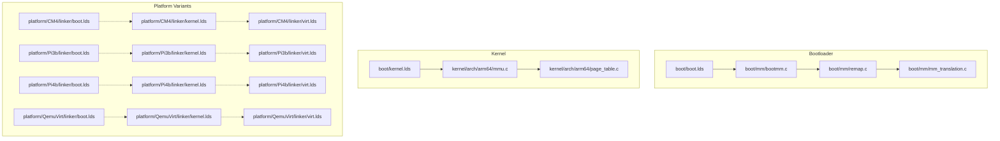
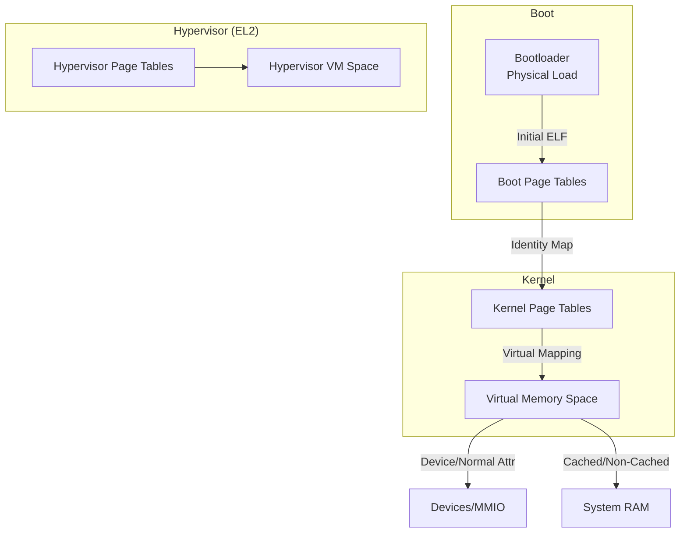
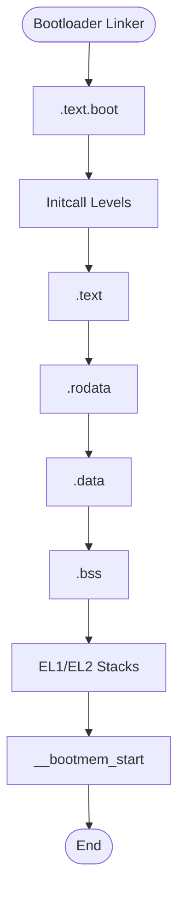
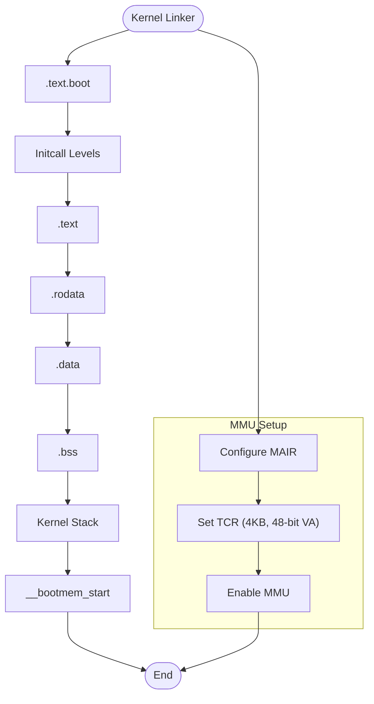
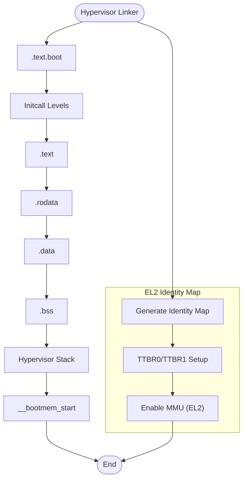
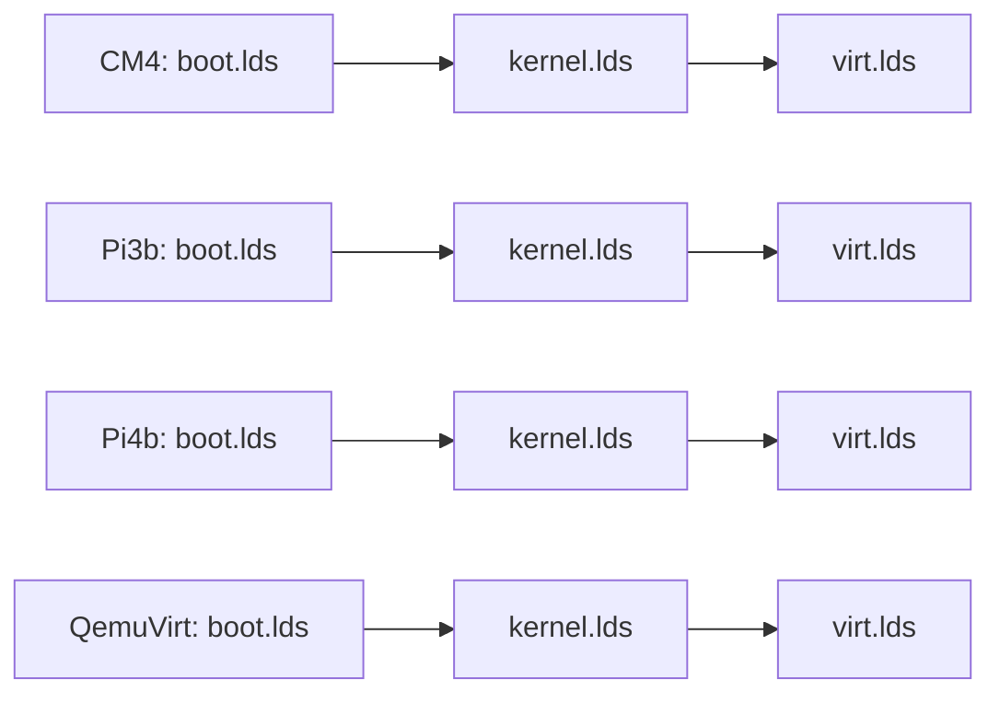
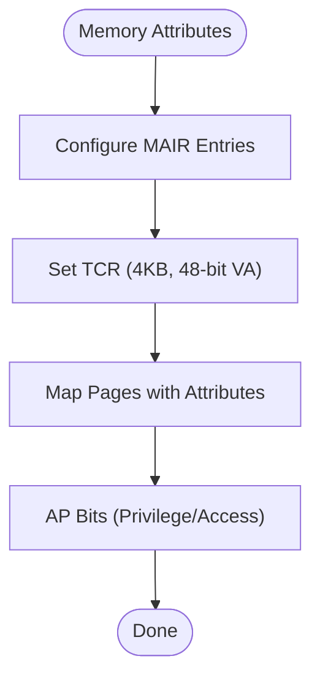
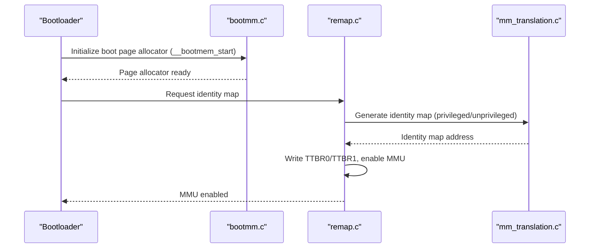
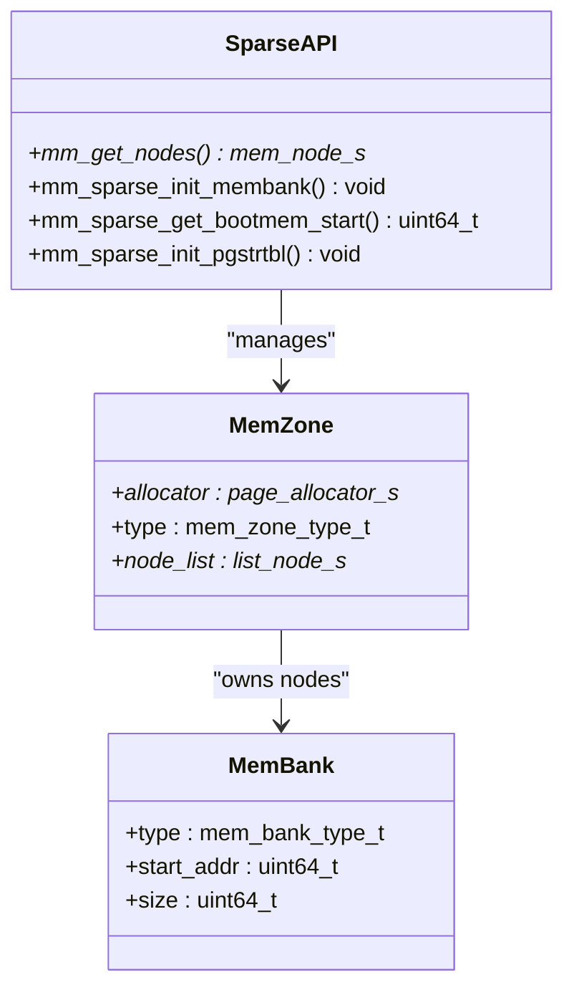
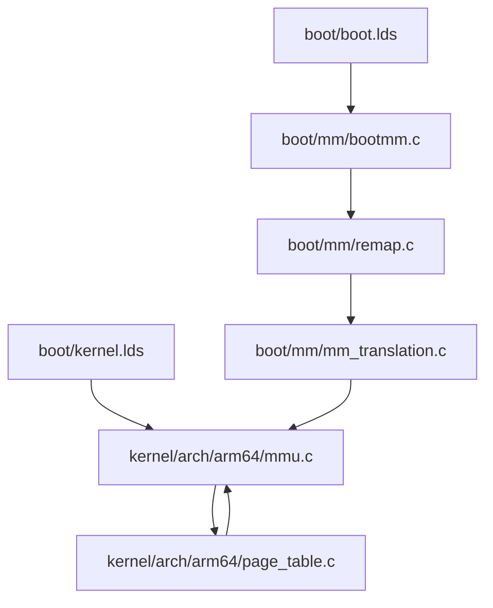

# Linker Scripts and Memory Layout

<cite>
**Referenced Files in This Document**
- [boot.lds](file://boot/boot.lds)
- [kernel.lds](file://boot/kernel.lds)
- [linker.h](file://boot/include/linker.h)
- [bootmm.c](file://boot/mm/bootmm.c)
- [remap.c](file://boot/mm/remap.c)
- [mm_translation.c](file://boot/mm/mm_translation.c)
- [mmu.c](file://kernel/arch/arm64/mmu.c)
- [page_table.c](file://kernel/arch/arm64/page_table.c)
- [mem_bank.h](file://kernel/include/mm/mem_bank.h)
- [mem_zone.h](file://kernel/include/mm/mem_zone.h)
- [sparse.h](file://kernel/include/mm/sparse.h)
- [virt.lds](file://platform/CM4/linker/virt.lds)
- [kernel.lds](file://platform/CM4/linker/kernel.lds)
- [boot.lds](file://platform/CM4/linker/boot.lds)
- [virt.lds](file://platform/Pi3b/linker/virt.lds)
- [kernel.lds](file://platform/Pi3b/linker/kernel.lds)
- [boot.lds](file://platform/Pi3b/linker/boot.lds)
- [virt.lds](file://platform/Pi4b/linker/virt.lds)
- [kernel.lds](file://platform/Pi4b/linker/kernel.lds)
- [boot.lds](file://platform/Pi4b/linker/boot.lds)
- [virt.lds](file://platform/QemuVirt/linker/virt.lds)
- [kernel.lds](file://platform/QemuVirt/linker/kernel.lds)
- [boot.lds](file://platform/QemuVirt/linker/boot.lds)
</cite>

## Table of Contents
1. [Introduction](#introduction)
2. [Project Structure](#project-structure)
3. [Core Components](#core-components)
4. [Architecture Overview](#architecture-overview)
5. [Detailed Component Analysis](#detailed-component-analysis)
6. [Dependency Analysis](#dependency-analysis)
7. [Performance Considerations](#performance-considerations)
8. [Troubleshooting Guide](#troubleshooting-guide)
9. [Conclusion](#conclusion)
10. [Appendices](#appendices)

## Introduction
This document explains how linker scripts and memory layout are organized across platforms in TranquilOS. It covers load addresses, virtual memory mappings, memory segmentation for boot, kernel, hypervisor (virt), and user-space components, and how physical and virtual memory relate via MMU configuration. It also documents platform-specific differences, reserved regions, memory protection controls, memory bank and zone management, and practical guidance for optimization and debugging.

## Project Structure
TranquilOS organizes memory layout definitions per platform under platform/<board>/linker/*.lds. The base linker definitions for the bootloader and kernel are located under boot/ and kernel/, while platform variants mirror these with board-specific load addresses and stack placements. The hypervisor (virt) uses separate linker scripts for EL2 environments.

**Diagram sources**
- [boot.lds](file://boot/boot.lds#L1-L73)
- [kernel.lds](file://boot/kernel.lds#L1-L73)
- [bootmm.c](file://boot/mm/bootmm.c#L1-L29)
- [remap.c](file://boot/mm/remap.c#L1-L38)
- [mm_translation.c](file://boot/mm/mm_translation.c#L1-L225)
- [mmu.c](file://kernel/arch/arm64/mmu.c#L1-L231)
- [page_table.c](file://kernel/arch/arm64/page_table.c#L1-L167)
- [virt.lds](file://platform/CM4/linker/virt.lds#L1-L70)
- [kernel.lds](file://platform/CM4/linker/kernel.lds#L1-L73)
- [boot.lds](file://platform/CM4/linker/boot.lds#L1-L73)
- [virt.lds](file://platform/Pi3b/linker/virt.lds#L1-L70)
- [kernel.lds](file://platform/Pi3b/linker/kernel.lds#L1-L73)
- [boot.lds](file://platform/Pi3b/linker/boot.lds#L1-L77)
- [virt.lds](file://platform/Pi4b/linker/virt.lds#L1-L76)
- [kernel.lds](file://platform/Pi4b/linker/kernel.lds#L1-L73)
- [boot.lds](file://platform/Pi4b/linker/boot.lds#L1-L83)
- [virt.lds](file://platform/QemuVirt/linker/virt.lds#L1-L70)
- [kernel.lds](file://platform/QemuVirt/linker/kernel.lds#L1-L73)
- [boot.lds](file://platform/QemuVirt/linker/boot.lds#L1-L76)

**Section sources**
- [boot.lds](file://boot/boot.lds#L1-L73)
- [kernel.lds](file://boot/kernel.lds#L1-L73)
- [virt.lds](file://platform/CM4/linker/virt.lds#L1-L70)
- [kernel.lds](file://platform/CM4/linker/kernel.lds#L1-L73)
- [boot.lds](file://platform/CM4/linker/boot.lds#L1-L73)
- [virt.lds](file://platform/Pi3b/linker/virt.lds#L1-L70)
- [kernel.lds](file://platform/Pi3b/linker/kernel.lds#L1-L73)
- [boot.lds](file://platform/Pi3b/linker/boot.lds#L1-L77)
- [virt.lds](file://platform/Pi4b/linker/virt.lds#L1-L76)
- [kernel.lds](file://platform/Pi4b/linker/kernel.lds#L1-L73)
- [boot.lds](file://platform/Pi4b/linker/boot.lds#L1-L83)
- [virt.lds](file://platform/QemuVirt/linker/virt.lds#L1-L70)
- [kernel.lds](file://platform/QemuVirt/linker/kernel.lds#L1-L73)
- [boot.lds](file://platform/QemuVirt/linker/boot.lds#L1-L76)

## Core Components
- Bootloader linker script defines initial load address, text, rodata, data, bss, and per-exception-level stacks, followed by a boot-time memory region marker.
- Kernel linker script sets the kernel’s virtual load address and organizes sections similarly, including a dedicated kernel stack area.
- Platform linker variants adjust load addresses and stack placements for each board, while preserving the same section layout pattern.
- Hypervisor linker script (virt.lds) mirrors the kernel pattern but targets EL2 and reserves a hypervisor stack.
- Boot memory allocator initializes early page allocation using the “bootmem” region exposed by the linker.
- MMU initialization configures MAIR, TCR, and enables the MMU; identity mapping is generated for privileged and unprivileged modes.
- Page table helpers map pages with appropriate memory attributes and handle sparse memory nodes.

**Section sources**
- [boot.lds](file://boot/boot.lds#L1-L73)
- [kernel.lds](file://boot/kernel.lds#L1-L73)
- [virt.lds](file://platform/CM4/linker/virt.lds#L1-L70)
- [bootmm.c](file://boot/mm/bootmm.c#L1-L29)
- [mm_translation.c](file://boot/mm/mm_translation.c#L1-L225)
- [mmu.c](file://kernel/arch/arm64/mmu.c#L1-L231)
- [page_table.c](file://kernel/arch/arm64/page_table.c#L1-L167)

## Architecture Overview
The memory architecture separates concerns across three domains:
- Boot: loads at a fixed physical address and runs in a minimal environment until MMU is configured.
- Kernel: runs at a high virtual address with identity mapping and privilege-aware page tables.
- Hypervisor (virt): runs at EL2 with its own identity mapping and stack region.

**Diagram sources**
- [boot.lds](file://boot/boot.lds#L1-L73)
- [kernel.lds](file://boot/kernel.lds#L1-L73)
- [mm_translation.c](file://boot/mm/mm_translation.c#L1-L225)
- [mmu.c](file://kernel/arch/arm64/mmu.c#L1-L231)
- [page_table.c](file://kernel/arch/arm64/page_table.c#L1-L167)
- [virt.lds](file://platform/CM4/linker/virt.lds#L1-L70)

## Detailed Component Analysis

### Bootloader Memory Layout and Load Address
- The bootloader is linked to a fixed physical address and placed at the start of usable memory for immediate execution after firmware handoff.
- Sections include .text.boot, initcall levels, .text, .rodata, .data, .bss, and per-exception-level stacks. A bootmem region follows the bss to support early heap allocation.
- The linker header exposes a constant for the bootloader address used by platform builds.

**Diagram sources**
- [boot.lds](file://boot/boot.lds#L1-L73)
- [linker.h](file://boot/include/linker.h#L1-L6)

**Section sources**
- [boot.lds](file://boot/boot.lds#L1-L73)
- [linker.h](file://boot/include/linker.h#L1-L6)

### Kernel Memory Layout and Virtual Load
- The kernel is linked at a high virtual address and relies on identity mapping and page tables for execution.
- Sections mirror the bootloader layout with a kernel stack area and a bootmem region for early allocations.
- The kernel’s MMU initialization configures MAIR entries for device and normal memory, sets TCR fields for 4KB granule and 48-bit VA, and enables the MMU.

**Diagram sources**
- [kernel.lds](file://boot/kernel.lds#L1-L73)
- [mmu.c](file://kernel/arch/arm64/mmu.c#L62-L126)

**Section sources**
- [kernel.lds](file://boot/kernel.lds#L1-L73)
- [mmu.c](file://kernel/arch/arm64/mmu.c#L62-L126)

### Hypervisor (virt) Memory Layout and EL2 Identity Map
- The virt linker mirrors kernel layout but targets EL2, reserving a hypervisor stack and adjusting load addresses per platform.
- Identity mapping is generated for EL2 with privilege-aware attributes and shared memory attributes configured via MAIR.

**Diagram sources**
- [virt.lds](file://platform/CM4/linker/virt.lds#L1-L70)
- [mm_translation.c](file://boot/mm/mm_translation.c#L164-L225)

**Section sources**
- [virt.lds](file://platform/CM4/linker/virt.lds#L1-L70)
- [mm_translation.c](file://boot/mm/mm_translation.c#L164-L225)

### Platform-Specific Variations
- Raspberry Pi 3B, Pi 4B, and Compute Module 4 share similar linker patterns but differ in load addresses and stack counts (Pi 3B and CM4 include an EL3 stack; Pi 4B adds an extra EL3 stack).
- QEMU Virt uses higher load addresses suitable for emulated devices and aligns with its device tree configuration.

**Diagram sources**
- [boot.lds](file://platform/CM4/linker/boot.lds#L1-L73)
- [kernel.lds](file://platform/CM4/linker/kernel.lds#L1-L73)
- [virt.lds](file://platform/CM4/linker/virt.lds#L1-L70)
- [boot.lds](file://platform/Pi3b/linker/boot.lds#L1-L77)
- [kernel.lds](file://platform/Pi3b/linker/kernel.lds#L1-L73)
- [virt.lds](file://platform/Pi3b/linker/virt.lds#L1-L70)
- [boot.lds](file://platform/Pi4b/linker/boot.lds#L1-L83)
- [kernel.lds](file://platform/Pi4b/linker/kernel.lds#L1-L73)
- [virt.lds](file://platform/Pi4b/linker/virt.lds#L1-L76)
- [boot.lds](file://platform/QemuVirt/linker/boot.lds#L1-L76)
- [kernel.lds](file://platform/QemuVirt/linker/kernel.lds#L1-L73)
- [virt.lds](file://platform/QemuVirt/linker/virt.lds#L1-L70)

**Section sources**
- [boot.lds](file://platform/CM4/linker/boot.lds#L1-L73)
- [kernel.lds](file://platform/CM4/linker/kernel.lds#L1-L73)
- [virt.lds](file://platform/CM4/linker/virt.lds#L1-L70)
- [boot.lds](file://platform/Pi3b/linker/boot.lds#L1-L77)
- [kernel.lds](file://platform/Pi3b/linker/kernel.lds#L1-L73)
- [virt.lds](file://platform/Pi3b/linker/virt.lds#L1-L70)
- [boot.lds](file://platform/Pi4b/linker/boot.lds#L1-L83)
- [kernel.lds](file://platform/Pi4b/linker/kernel.lds#L1-L73)
- [virt.lds](file://platform/Pi4b/linker/virt.lds#L1-L76)
- [boot.lds](file://platform/QemuVirt/linker/boot.lds#L1-L76)
- [kernel.lds](file://platform/QemuVirt/linker/kernel.lds#L1-L73)
- [virt.lds](file://platform/QemuVirt/linker/virt.lds#L1-L70)

### Memory Protection and Attribute Configuration
- MAIR entries define memory attributes for device memory (non-cacheable, nGnRnE) and normal memory (cacheable WBWA).
- TCR settings configure 4KB granule size, inner shareability, and 48-bit virtual address space.
- Page table mapping selects attributes per region (e.g., UART MMIO uses device attributes) and sets AP bits for privilege and access permissions.

**Diagram sources**
- [mmu.c](file://kernel/arch/arm64/mmu.c#L52-L126)
- [page_table.c](file://kernel/arch/arm64/page_table.c#L72-L94)

**Section sources**
- [mmu.c](file://kernel/arch/arm64/mmu.c#L52-L126)
- [page_table.c](file://kernel/arch/arm64/page_table.c#L72-L94)

### Boot-Time Memory Allocation and Early Heap
- The boot memory allocator uses the linker-exposed bootmem region to initialize a page allocator for early kernel use.
- The remapper generates an identity map and enables the MMU before transitioning to virtual-mode execution.

**Diagram sources**
- [bootmm.c](file://boot/mm/bootmm.c#L20-L29)
- [remap.c](file://boot/mm/remap.c#L30-L38)
- [mm_translation.c](file://boot/mm/mm_translation.c#L164-L225)

**Section sources**
- [bootmm.c](file://boot/mm/bootmm.c#L20-L29)
- [remap.c](file://boot/mm/remap.c#L30-L38)
- [mm_translation.c](file://boot/mm/mm_translation.c#L164-L225)

### Memory Zones and Sparse Allocation
- Memory banks represent contiguous physical regions with types (RAM, IOMMU, image).
- Memory zones group page allocators by type (main, DMA, highmem) and maintain lists of memory nodes.
- Sparse memory APIs expose node lists, bootmem start, and page structure table initialization.

**Diagram sources**
- [mem_bank.h](file://kernel/include/mm/mem_bank.h#L8-L21)
- [mem_zone.h](file://kernel/include/mm/mem_zone.h#L9-L21)
- [sparse.h](file://kernel/include/mm/sparse.h#L8-L16)

**Section sources**
- [mem_bank.h](file://kernel/include/mm/mem_bank.h#L8-L21)
- [mem_zone.h](file://kernel/include/mm/mem_zone.h#L9-L21)
- [sparse.h](file://kernel/include/mm/sparse.h#L8-L16)

## Dependency Analysis
- Bootloader depends on its linker script for load address and bootmem region, which bootmm initializes into a page allocator.
- Remapper depends on MMU translation routines to generate identity maps and enable MMU.
- Kernel MMU module configures MAIR and TCR and provides helpers to set page tables and create identity maps.
- Page table helpers depend on the page allocator to allocate new page tables and map pages with correct attributes.

**Diagram sources**
- [boot.lds](file://boot/boot.lds#L1-L73)
- [bootmm.c](file://boot/mm/bootmm.c#L1-L29)
- [remap.c](file://boot/mm/remap.c#L1-L38)
- [mm_translation.c](file://boot/mm/mm_translation.c#L1-L225)
- [kernel.lds](file://boot/kernel.lds#L1-L73)
- [mmu.c](file://kernel/arch/arm64/mmu.c#L1-L231)
- [page_table.c](file://kernel/arch/arm64/page_table.c#L1-L167)

**Section sources**
- [boot.lds](file://boot/boot.lds#L1-L73)
- [bootmm.c](file://boot/mm/bootmm.c#L1-L29)
- [remap.c](file://boot/mm/remap.c#L1-L38)
- [mm_translation.c](file://boot/mm/mm_translation.c#L1-L225)
- [kernel.lds](file://boot/kernel.lds#L1-L73)
- [mmu.c](file://kernel/arch/arm64/mmu.c#L1-L231)
- [page_table.c](file://kernel/arch/arm64/page_table.c#L1-L167)

## Performance Considerations
- Use 4KB granule size consistently across TTBR0/TTBR1 for predictable TLB behavior and efficient page table walks.
- Prefer cacheable normal memory for kernel data and device attributes for MMIO to avoid performance penalties.
- Keep identity mapping small and focused to minimize TLB pressure during boot transitions.
- Allocate page tables from the boot page allocator only during early boot; migrate to the kernel’s page allocator as soon as possible.

[No sources needed since this section provides general guidance]

## Troubleshooting Guide
- MMU enable failures: Verify MAIR entries are written before enabling MMU and that TCR settings match CPU capabilities.
- Identity map errors: Ensure TTBR0/TTBR1 are set to the generated identity map and that MMU is enabled after TLB invalidation.
- Page mapping issues: Confirm page table levels are extended when needed and that AP bits and memory attributes match the target region.
- Bootmem exhaustion: Increase the linker-assigned bootmem region or reduce early allocations.

**Section sources**
- [mmu.c](file://kernel/arch/arm64/mmu.c#L128-L151)
- [mm_translation.c](file://boot/mm/mm_translation.c#L54-L87)
- [page_table.c](file://kernel/arch/arm64/page_table.c#L96-L167)
- [bootmm.c](file://boot/mm/bootmm.c#L26-L29)

## Conclusion
TranquilOS employs consistent linker-driven memory layouts across platforms, with platform-specific load addresses and stack arrangements. The MMU is configured early with explicit MAIR and TCR settings, and identity maps are generated to bridge boot and kernel execution. Memory zones and sparse allocation APIs support scalable memory management, while attribute-aware page mapping ensures correct behavior for device and normal memory.

[No sources needed since this section summarizes without analyzing specific files]

## Appendices

### Appendix A: Reserved Regions and Stack Placement
- Bootloader: .bss end plus fixed offsets allocate EL1/EL2 stacks and a bootmem region.
- Kernel: .bss end plus fixed offset allocates a kernel stack and a bootmem region.
- Hypervisor: .bss end plus fixed offset allocates a hypervisor stack and a bootmem region.

**Section sources**
- [boot.lds](file://boot/boot.lds#L60-L72)
- [kernel.lds](file://boot/kernel.lds#L65-L72)
- [virt.lds](file://platform/CM4/linker/virt.lds#L61-L69)

### Appendix B: Physical vs Virtual Addresses
- Bootloader executes at a fixed physical address determined by the linker.
- Kernel uses identity mapping to equate physical and virtual addresses initially, then switches to virtual execution with configured page tables.
- Hypervisor operates at EL2 with its own identity map and stack region.

**Section sources**
- [boot.lds](file://boot/boot.lds#L6-L6)
- [kernel.lds](file://boot/kernel.lds#L4-L4)
- [mm_translation.c](file://boot/mm/mm_translation.c#L164-L225)