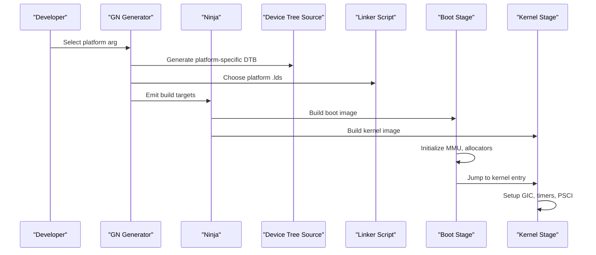
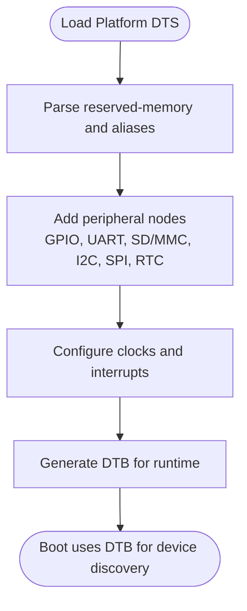
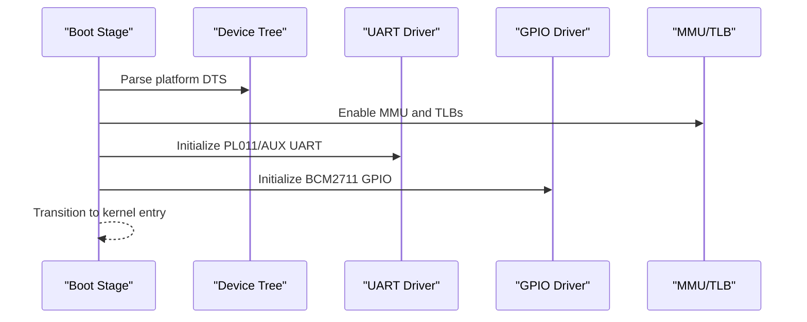
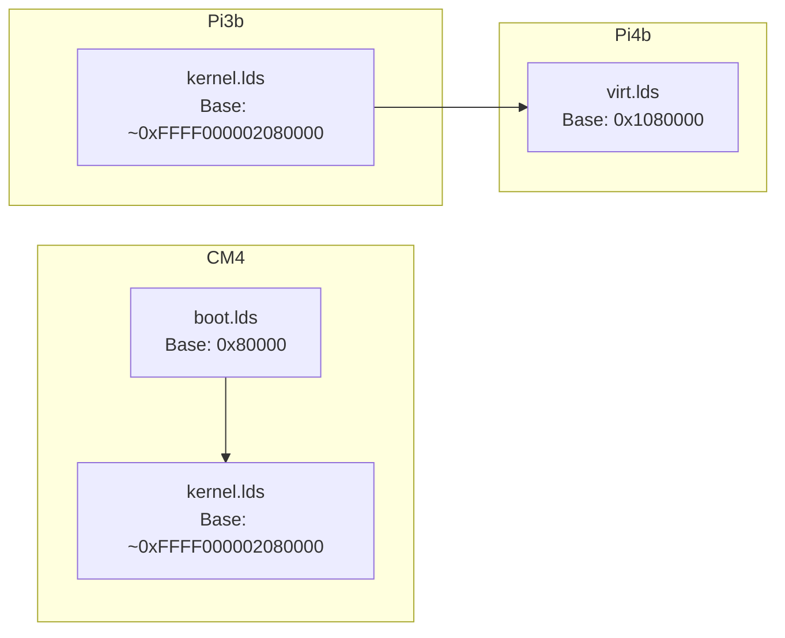
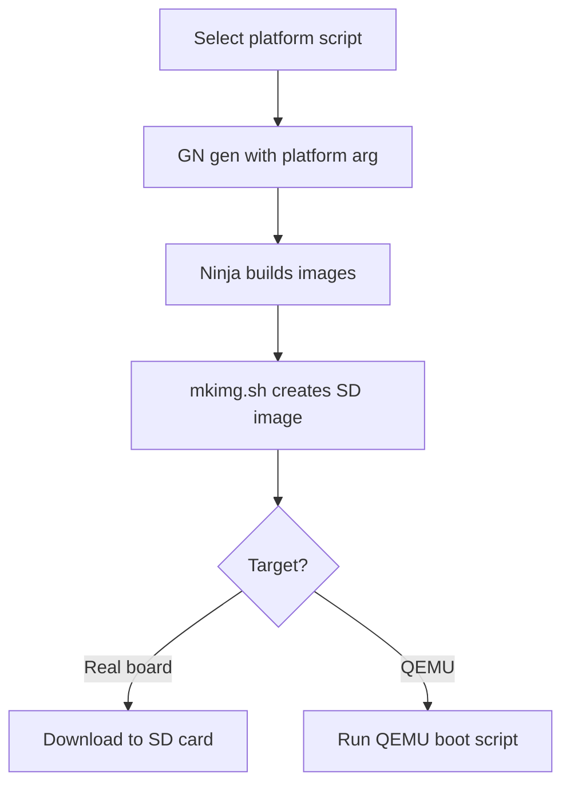
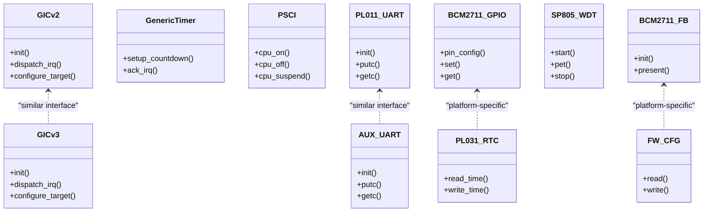
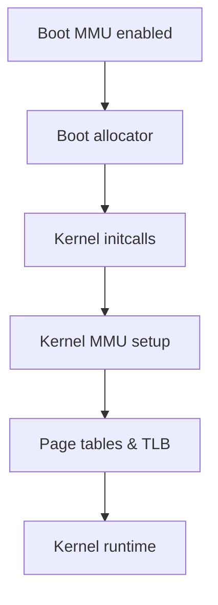
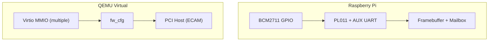
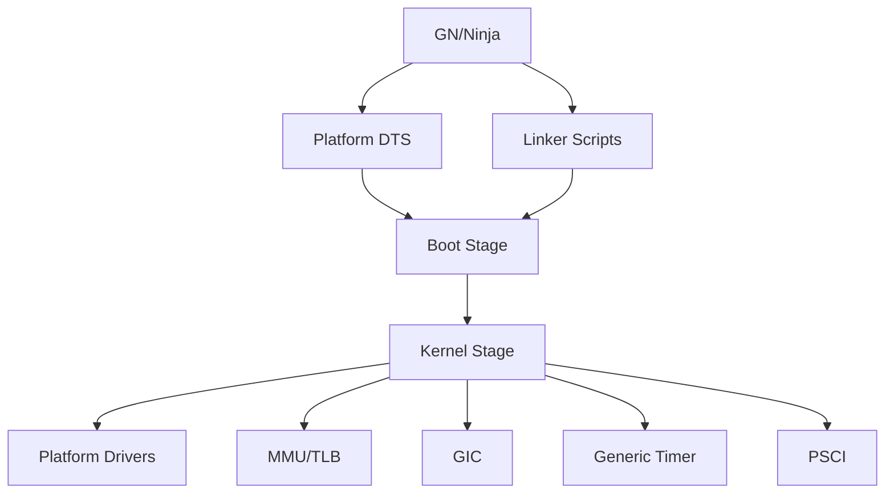

# Platform Support

<cite>
**Referenced Files in This Document**
- [bcm2711-rpi-cm4.dts](file://platform/CM4/dts/bcm2711-rpi-cm4.dts)
- [bcm2710-rpi-3-b.dts](file://platform/Pi3b/dts/bcm2710-rpi-3-b.dts)
- [bcm2711-rpi-4-b.dts](file://platform/Pi4b/dts/bcm2711-rpi-4-b.dts)
- [virt.dts](file://platform/QemuVirt/dts/virt.dts)
- [boot.lds (CM4)](file://platform/CM4/linker/boot.lds)
- [kernel.lds (CM4)](file://platform/CM4/linker/kernel.lds)
- [kernel.lds (Pi3b)](file://platform/Pi3b/linker/kernel.lds)
- [virt.lds (Pi4b)](file://platform/Pi4b/linker/virt.lds)
- [build_cm4.sh](file://scripts/build_cm4.sh)
- [build_pi3b.sh](file://scripts/build_pi3b.sh)
- [build_pi4b.sh](file://scripts/build_pi4b.sh)
- [build_qemu.sh](file://scripts/build_qemu.sh)
- [run_board_cm4.sh](file://run_board_cm4.sh)
- [run_qemu_pi3b.sh](file://run_qemu_pi3b.sh)
- [run_qemu_pi4b.sh](file://run_qemu_pi4b.sh)
- [run_qemu_virt.sh](file://run_qemu_virt.sh)
- [pl011.c](file://boot/drivers/arm-uart/pl011.c)
- [pl011.h](file://boot/drivers/arm-uart/pl011.h)
- [bcm2835_aux_uart.c](file://boot/drivers/rpi/bcm2835-aux-uart/bcm2835_aux_uart.c)
- [bcm2835_aux.h](file://boot/drivers/rpi/bcm2835-aux-uart/bcm2835_aux.h)
- [bcm2711_gpio.c](file://boot/drivers/rpi/bcm2711-gpio/bcm2711_gpio.c)
- [bcm2711_gpio.h](file://boot/drivers/rpi/bcm2711-gpio/bcm2711_gpio.h)
- [gicv2.c](file://kernel/drivers/arm-gic/gicv2.c)
- [gicv2.h](file://kernel/drivers/arm-gic/gicv2.h)
- [gicv3.c](file://kernel/drivers/arm-gic/gicv3.c)
- [gicv3.h](file://kernel/drivers/arm-gic/gicv3.h)
- [psci.c](file://kernel/drivers/arm-psci/psci.c)
- [psci.h](file://kernel/drivers/arm-psci/psci.h)
- [generic_timer.c](file://kernel/drivers/arm-timer/generic_timer.c)
- [generic_timer.h](file://kernel/drivers/arm-timer/generic_timer.h)
- [pl031.c](file://kernel/drivers/arm-rtc/pl031.c)
- [pl031.h](file://kernel/drivers/arm-rtc/pl031.h)
- [device_tree.c](file://kernel/device/device_tree.c)
- [device_tree.h](file://kernel/include/device/device_tree.h)
- [bootmm.c](file://boot/mm/bootmm.c)
- [mm_translation.c](file://boot/mm/mm_translation.c)
- [remap.c](file://boot/mm/remap.c)
- [bootmm.c (kernel)](file://kernel/mm/bootmm.c)
- [mm.c (kernel)](file://kernel/mm/mm.c)
- [page_table.c](file://kernel/arch/arm64/page_table.c)
- [tlb.c](file://kernel/arch/arm64/tlb.c)
- [mmu.c](file://kernel/arch/arm64/mmu.c)
- [boot.S (boot)](file://boot/arch/arm64/boot.S)
- [boot.S (kernel)](file://kernel/arch/arm64/boot/)
- [entry.S](file://kernel/arch/arm64/entry/entry.S)
- [centry.c](file://kernel/arch/arm64/entry/centry.c)
- [exception.c](file://kernel/arch/arm64/exception.c)
- [interrupt.c](file://kernel/arch/arm64/interrupt.c)
- [switch.S](file://kernel/arch/arm64/switch/switch.S)
- [context.c](file://kernel/arch/arm64/context.c)
- [cpu.c](file://kernel/arch/arm64/cpu.c)
- [power_manager.c](file://boot/power_manager.c)
- [power_manager.c (kernel)](file://kernel/power_manager.c)
- [kmsg_console.c](file://kernel/drivers/kmsg/kmsg_console.c)
- [sp805.c](file://kernel/drivers/watchdog/sp805.c)
- [sp805.h](file://kernel/drivers/watchdog/sp805.h)
- [bcm2711_fb.c](file://uapps/devmgr/drivers/rpi/rpi-fb/bcm2711_fb.c)
- [bcm2711_fb.h](file://uapps/devmgr/drivers/rpi/rpi-fb/bcm2711_fb.h)
- [bcm2711_mailbox.c](file://uapps/devmgr/drivers/rpi/rpi-fb/bcm2711_mailbox.c)
- [bcm2711_mailbox.h](file://uapps/devmgr/drivers/rpi/rpi-fb/bcm2711_mailbox.h)
- [fw_cfg.c](file://uapps/devmgr/drivers/virt/fw_cfg.c)
- [fw_cfg.h](file://uapps/devmgr/drivers/virt/fw_cfg.h)
</cite>

## Table of Contents
1. [Introduction](#introduction)
2. [Project Structure](#project-structure)
3. [Core Components](#core-components)
4. [Architecture Overview](#architecture-overview)
5. [Detailed Component Analysis](#detailed-component-analysis)
6. [Dependency Analysis](#dependency-analysis)
7. [Performance Considerations](#performance-considerations)
8. [Troubleshooting Guide](#troubleshooting-guide)
9. [Conclusion](#conclusion)
10. [Appendices](#appendices)

## Introduction
This document explains the multi-platform architecture of TranquilOS and how it supports Raspberry Pi variants (Compute Module 4, 3 Model B, 4 Model B) and QEMU virtual platforms. It covers device tree configurations, platform-specific hardware initialization, memory layouts, platform detection via GN arguments, hardware abstraction layers, and platform-specific optimizations. It also describes how to port the platform support to new hardware, configure hardware features, and manage platform-specific build processes.

## Project Structure
TranquilOS organizes platform support under the platform/ directory, with per-platform Device Tree Sources (DTS), linker scripts, and firmware configuration files. Build orchestration is handled by GN/Ninja and shell scripts that select the target platform.

```mermaid
graph TB
subgraph "Build System"
GN["GN args<br/>platform=\"Pi3b|Pi4b|CM4|QemuVirt\""]
Ninja["Ninja build"]
end
subgraph "Per-Platform Config"
DTS["Device Tree Sources (.dts)"]
LdScript["Linker Scripts (.lds)"]
Firmware["Firmware config.txt"]
end
subgraph "Runtime Kernel"
Boot["Boot stage (boot.S, bootmm)"]
Kernel["Kernel (mm, interrupts, GIC, PSCI)"]
Drivers["Platform drivers (UART, GPIO, RTC, GIC, PSCI)"]
DevMgr["Device manager (Raspberry Pi and QEMU)"]
end
GN --> DTS
GN --> LdScript
GN --> Firmware
DTS --> Boot
LdScript --> Boot
Boot --> Kernel
Kernel --> Drivers
Kernel --> DevMgr
```

**Diagram sources**
- [build_pi3b.sh](file://scripts/build_pi3b.sh#L1-L6)
- [build_pi4b.sh](file://scripts/build_pi4b.sh#L1-L6)
- [build_cm4.sh](file://scripts/build_cm4.sh#L1-L6)
- [build_qemu.sh](file://scripts/build_qemu.sh#L1-L6)
- [bcm2710-rpi-3-b.dts](file://platform/Pi3b/dts/bcm2710-rpi-3-b.dts#L1-L120)
- [bcm2711-rpi-4-b.dts](file://platform/Pi4b/dts/bcm2711-rpi-4-b.dts#L1-L120)
- [bcm2711-rpi-cm4.dts](file://platform/CM4/dts/bcm2711-rpi-cm4.dts#L1-L120)
- [virt.dts](file://platform/QemuVirt/dts/virt.dts#L1-L120)
- [boot.lds (CM4)](file://platform/CM4/linker/boot.lds#L1-L73)
- [kernel.lds (Pi3b)](file://platform/Pi3b/linker/kernel.lds#L1-L73)
- [kernel.lds (CM4)](file://platform/CM4/linker/kernel.lds#L1-L73)
- [virt.lds (Pi4b)](file://platform/Pi4b/linker/virt.lds#L1-L76)

**Section sources**
- [build_pi3b.sh](file://scripts/build_pi3b.sh#L1-L6)
- [build_pi4b.sh](file://scripts/build_pi4b.sh#L1-L6)
- [build_cm4.sh](file://scripts/build_cm4.sh#L1-L6)
- [build_qemu.sh](file://scripts/build_qemu.sh#L1-L6)

## Core Components
- Device Trees define hardware layout, reserved regions, aliases, and peripheral nodes for each platform.
- Linker scripts establish load and runtime addresses for boot, kernel, hypervisor, and stacks.
- Boot stage initializes MMU, memory allocator, and early device drivers.
- Kernel stage sets up interrupts, timers, power management, and platform drivers.
- Device manager integrates platform-specific drivers for display, GPIO, UART, and firmware configuration.

**Section sources**
- [bcm2710-rpi-3-b.dts](file://platform/Pi3b/dts/bcm2710-rpi-3-b.dts#L1-L120)
- [bcm2711-rpi-4-b.dts](file://platform/Pi4b/dts/bcm2711-rpi-4-b.dts#L1-L120)
- [bcm2711-rpi-cm4.dts](file://platform/CM4/dts/bcm2711-rpi-cm4.dts#L1-L120)
- [virt.dts](file://platform/QemuVirt/dts/virt.dts#L1-L120)
- [boot.lds (CM4)](file://platform/CM4/linker/boot.lds#L1-L73)
- [kernel.lds (Pi3b)](file://platform/Pi3b/linker/kernel.lds#L1-L73)
- [kernel.lds (CM4)](file://platform/CM4/linker/kernel.lds#L1-L73)
- [virt.lds (Pi4b)](file://platform/Pi4b/linker/virt.lds#L1-L76)

## Architecture Overview
The platform support architecture separates concerns across build-time (GN/Ninja), device tree generation, and runtime stages (boot and kernel). Per-platform DTS files describe memory reservations, peripheral nodes, and aliases. Linker scripts set fixed load addresses and stack placements. At runtime, the boot stage initializes memory and devices, then transitions to the kernel stage, which configures interrupts, timers, and platform drivers.



**Diagram sources**
- [build_pi3b.sh](file://scripts/build_pi3b.sh#L1-L6)
- [build_pi4b.sh](file://scripts/build_pi4b.sh#L1-L6)
- [build_cm4.sh](file://scripts/build_cm4.sh#L1-L6)
- [build_qemu.sh](file://scripts/build_qemu.sh#L1-L6)
- [bcm2710-rpi-3-b.dts](file://platform/Pi3b/dts/bcm2710-rpi-3-b.dts#L1-L120)
- [bcm2711-rpi-4-b.dts](file://platform/Pi4b/dts/bcm2711-rpi-4-b.dts#L1-L120)
- [bcm2711-rpi-cm4.dts](file://platform/CM4/dts/bcm2711-rpi-cm4.dts#L1-L120)
- [virt.dts](file://platform/QemuVirt/dts/virt.dts#L1-L120)
- [boot.lds (CM4)](file://platform/CM4/linker/boot.lds#L1-L73)
- [kernel.lds (Pi3b)](file://platform/Pi3b/linker/kernel.lds#L1-L73)
- [kernel.lds (CM4)](file://platform/CM4/linker/kernel.lds#L1-L73)
- [virt.lds (Pi4b)](file://platform/Pi4b/linker/virt.lds#L1-L76)

## Detailed Component Analysis

### Device Tree Configurations and Hardware Description
Each platform defines a DTS that describes:
- Memory reservations and reserved regions for boot, hypervisor, kernel, systemd, ramdisk, and kernel message buffers.
- Aliases for serial ports, GPIO, DMA, watchdog, RNG, mailbox, SD/MMC, I2S, SPI, USB, LEDs, framebuffer, thermal sensors, AXI performance counters, and more.
- Peripheral nodes for GPIO, UART (PL011 and auxiliary), SD host, I2C, SPI, PWM, RTC, mailbox, and others.
- Clocks, interrupts, DMA ranges, and pinctrl configurations.

Key differences across platforms:
- Pi3b and Pi4b DTS files use different base addresses and ranges for peripherals and reserved memory compared to CM4 and QEMU.
- QEMU DTS replaces real SoC peripherals with virtio and QEMU-compatible devices, including a PCI host ECAM and GICv3.



**Diagram sources**
- [bcm2710-rpi-3-b.dts](file://platform/Pi3b/dts/bcm2710-rpi-3-b.dts#L1-L200)
- [bcm2711-rpi-4-b.dts](file://platform/Pi4b/dts/bcm2711-rpi-4-b.dts#L1-L200)
- [bcm2711-rpi-cm4.dts](file://platform/CM4/dts/bcm2711-rpi-cm4.dts#L1-L200)
- [virt.dts](file://platform/QemuVirt/dts/virt.dts#L1-L200)

**Section sources**
- [bcm2710-rpi-3-b.dts](file://platform/Pi3b/dts/bcm2710-rpi-3-b.dts#L1-L200)
- [bcm2711-rpi-4-b.dts](file://platform/Pi4b/dts/bcm2711-rpi-4-b.dts#L1-L200)
- [bcm2711-rpi-cm4.dts](file://platform/CM4/dts/bcm2711-rpi-cm4.dts#L1-L200)
- [virt.dts](file://platform/QemuVirt/dts/virt.dts#L1-L200)

### Platform-Specific Hardware Initialization
- Boot stage initializes MMU, boot-time memory allocator, and essential drivers (UART, GPIO) using device tree overlays and linker-defined addresses.
- Kernel stage configures GIC (v2/v3), generic timers, PSCI for CPU power management, and RTC.
- Platform drivers implement device-specific behavior (e.g., BCM2711 GPIO, auxiliary UART, mailbox for framebuffer on Raspberry Pi; virtio and fw_cfg on QEMU).



**Diagram sources**
- [bootmm.c](file://boot/mm/bootmm.c)
- [mm_translation.c](file://boot/mm/mm_translation.c)
- [remap.c](file://boot/mm/remap.c)
- [pl011.c](file://boot/drivers/arm-uart/pl011.c)
- [pl011.h](file://boot/drivers/arm-uart/pl011.h)
- [bcm2835_aux_uart.c](file://boot/drivers/rpi/bcm2835-aux-uart/bcm2835_aux_uart.c)
- [bcm2711_gpio.c](file://boot/drivers/rpi/bcm2711-gpio/bcm2711_gpio.c)
- [bcm2711_gpio.h](file://boot/drivers/rpi/bcm2711-gpio/bcm2711_gpio.h)

**Section sources**
- [bootmm.c](file://boot/mm/bootmm.c)
- [mm_translation.c](file://boot/mm/mm_translation.c)
- [remap.c](file://boot/mm/remap.c)
- [pl011.c](file://boot/drivers/arm-uart/pl011.c)
- [bcm2835_aux_uart.c](file://boot/drivers/rpi/bcm2835-aux-uart/bcm2835_aux_uart.c)
- [bcm2711_gpio.c](file://boot/drivers/rpi/bcm2711-gpio/bcm2711_gpio.c)

### Memory Layouts and Load Addresses
Per-platform linker scripts define fixed load and runtime addresses:
- CM4 boot.lds places the boot stage at a specific base and reserves stacks for EL1/EL2.
- Pi3b and CM4 kernel.lds place the kernel at a high virtual address suitable for ARM64.
- Pi4b virt.lds places the hypervisor at a lower address for QEMU virtualization.



**Diagram sources**
- [boot.lds (CM4)](file://platform/CM4/linker/boot.lds#L1-L73)
- [kernel.lds (CM4)](file://platform/CM4/linker/kernel.lds#L1-L73)
- [kernel.lds (Pi3b)](file://platform/Pi3b/linker/kernel.lds#L1-L73)
- [virt.lds (Pi4b)](file://platform/Pi4b/linker/virt.lds#L1-L76)

**Section sources**
- [boot.lds (CM4)](file://platform/CM4/linker/boot.lds#L1-L73)
- [kernel.lds (CM4)](file://platform/CM4/linker/kernel.lds#L1-L73)
- [kernel.lds (Pi3b)](file://platform/Pi3b/linker/kernel.lds#L1-L73)
- [virt.lds (Pi4b)](file://platform/Pi4b/linker/virt.lds#L1-L76)

### Platform Detection and Build Processes
Build scripts pass the platform argument to GN, which selects the appropriate DTS and linker script. Run scripts orchestrate building, image creation, and launching on real boards or QEMU.



**Diagram sources**
- [build_pi3b.sh](file://scripts/build_pi3b.sh#L1-L6)
- [build_pi4b.sh](file://scripts/build_pi4b.sh#L1-L6)
- [build_cm4.sh](file://scripts/build_cm4.sh#L1-L6)
- [build_qemu.sh](file://scripts/build_qemu.sh#L1-L6)
- [run_board_cm4.sh](file://run_board_cm4.sh#L1-L5)
- [run_qemu_pi3b.sh](file://run_qemu_pi3b.sh#L1-L5)
- [run_qemu_pi4b.sh](file://run_qemu_pi4b.sh#L1-L5)
- [run_qemu_virt.sh](file://run_qemu_virt.sh#L1-L5)

**Section sources**
- [build_pi3b.sh](file://scripts/build_pi3b.sh#L1-L6)
- [build_pi4b.sh](file://scripts/build_pi4b.sh#L1-L6)
- [build_cm4.sh](file://scripts/build_cm4.sh#L1-L6)
- [build_qemu.sh](file://scripts/build_qemu.sh#L1-L6)
- [run_board_cm4.sh](file://run_board_cm4.sh#L1-L5)
- [run_qemu_pi3b.sh](file://run_qemu_pi3b.sh#L1-L5)
- [run_qemu_pi4b.sh](file://run_qemu_pi4b.sh#L1-L5)
- [run_qemu_virt.sh](file://run_qemu_virt.sh#L1-L5)

### Hardware Abstraction and Platform-Specific Optimizations
- Interrupt controller abstraction: GICv2 and GICv3 drivers provide unified IRQ management across platforms.
- Timer abstraction: Generic timer driver provides consistent timekeeping.
- Power management: PSCI driver enables CPU on/off and suspend sequences.
- UART abstraction: PL011 and auxiliary UART drivers support multiple serial interfaces.
- GPIO abstraction: BCM2711 GPIO driver exposes pin control and interrupts.
- RTC abstraction: PL031 RTC driver provides time-of-day services.
- Watchdog: SP805 watchdog driver ensures system reliability.
- Framebuffer and mailbox: BCM2711 framebuffer and mailbox drivers enable display on Raspberry Pi.
- QEMU virtio and fw_cfg: Virtio MMIO devices and fw_cfg provide emulated hardware on QEMU.



**Diagram sources**
- [gicv2.c](file://kernel/drivers/arm-gic/gicv2.c)
- [gicv3.c](file://kernel/drivers/arm-gic/gicv3.c)
- [generic_timer.c](file://kernel/drivers/arm-timer/generic_timer.c)
- [psci.c](file://kernel/drivers/arm-psci/psci.c)
- [pl011.c](file://boot/drivers/arm-uart/pl011.c)
- [bcm2835_aux_uart.c](file://boot/drivers/rpi/bcm2835-aux-uart/bcm2835_aux_uart.c)
- [bcm2711_gpio.c](file://boot/drivers/rpi/bcm2711-gpio/bcm2711_gpio.c)
- [pl031.c](file://kernel/drivers/arm-rtc/pl031.c)
- [sp805.c](file://kernel/drivers/watchdog/sp805.c)
- [bcm2711_fb.c](file://uapps/devmgr/drivers/rpi/rpi-fb/bcm2711_fb.c)
- [fw_cfg.c](file://uapps/devmgr/drivers/virt/fw_cfg.c)

**Section sources**
- [gicv2.c](file://kernel/drivers/arm-gic/gicv2.c)
- [gicv3.c](file://kernel/drivers/arm-gic/gicv3.c)
- [generic_timer.c](file://kernel/drivers/arm-timer/generic_timer.c)
- [psci.c](file://kernel/drivers/arm-psci/psci.c)
- [pl011.c](file://boot/drivers/arm-uart/pl011.c)
- [bcm2835_aux_uart.c](file://boot/drivers/rpi/bcm2835-aux-uart/bcm2835_aux_uart.c)
- [bcm2711_gpio.c](file://boot/drivers/rpi/bcm2711-gpio/bcm2711_gpio.c)
- [pl031.c](file://kernel/drivers/arm-rtc/pl031.c)
- [sp805.c](file://kernel/drivers/watchdog/sp805.c)
- [bcm2711_fb.c](file://uapps/devmgr/drivers/rpi/rpi-fb/bcm2711_fb.c)
- [fw_cfg.c](file://uapps/devmgr/drivers/virt/fw_cfg.c)

### Memory Management Variations
- Boot-time memory management: Boot stage uses a boot-specific allocator and remapping routines to transition to kernel memory management.
- Kernel memory management: Buddy allocator and page tables are initialized in the kernel stage, with per-platform load addresses affecting virtual layout.
- Translation and TLB operations: MMU and TLB modules handle page table walks and TLB maintenance during transitions.



**Diagram sources**
- [bootmm.c](file://boot/mm/bootmm.c)
- [mm_translation.c](file://boot/mm/mm_translation.c)
- [remap.c](file://boot/mm/remap.c)
- [bootmm.c (kernel)](file://kernel/mm/bootmm.c)
- [mm.c (kernel)](file://kernel/mm/mm.c)
- [page_table.c](file://kernel/arch/arm64/page_table.c)
- [tlb.c](file://kernel/arch/arm64/tlb.c)
- [mmu.c](file://kernel/arch/arm64/mmu.c)

**Section sources**
- [bootmm.c](file://boot/mm/bootmm.c)
- [mm_translation.c](file://boot/mm/mm_translation.c)
- [remap.c](file://boot/mm/remap.c)
- [bootmm.c (kernel)](file://kernel/mm/bootmm.c)
- [mm.c (kernel)](file://kernel/mm/mm.c)
- [page_table.c](file://kernel/arch/arm64/page_table.c)
- [tlb.c](file://kernel/arch/arm64/tlb.c)
- [mmu.c](file://kernel/arch/arm64/mmu.c)

### Platform-Specific Driver Implementations
- Raspberry Pi:
  - GPIO: BCM2711 GPIO driver manages pin configuration and interrupts.
  - UART: PL011 and auxiliary UART drivers support primary and secondary serial ports.
  - Framebuffer: BCM2711 framebuffer and mailbox drivers coordinate GPU display.
- QEMU Virtual:
  - Virtio MMIO: Multiple virtio devices exposed via MMIO.
  - fw_cfg: Firmware configuration interface for guest boot parameters.
  - PCI host: ECAM-style PCI host for PCIe devices.



**Diagram sources**
- [bcm2711_gpio.c](file://boot/drivers/rpi/bcm2711-gpio/bcm2711_gpio.c)
- [pl011.c](file://boot/drivers/arm-uart/pl011.c)
- [bcm2835_aux_uart.c](file://boot/drivers/rpi/bcm2835-aux-uart/bcm2835_aux_uart.c)
- [bcm2711_fb.c](file://uapps/devmgr/drivers/rpi/rpi-fb/bcm2711_fb.c)
- [bcm2711_mailbox.c](file://uapps/devmgr/drivers/rpi/rpi-fb/bcm2711_mailbox.c)
- [virt.dts](file://platform/QemuVirt/dts/virt.dts#L70-L190)
- [fw_cfg.c](file://uapps/devmgr/drivers/virt/fw_cfg.c)

**Section sources**
- [bcm2711_gpio.c](file://boot/drivers/rpi/bcm2711-gpio/bcm2711_gpio.c)
- [pl011.c](file://boot/drivers/arm-uart/pl011.c)
- [bcm2835_aux_uart.c](file://boot/drivers/rpi/bcm2835-aux-uart/bcm2835_aux_uart.c)
- [bcm2711_fb.c](file://uapps/devmgr/drivers/rpi/rpi-fb/bcm2711_fb.c)
- [bcm2711_mailbox.c](file://uapps/devmgr/drivers/rpi/rpi-fb/bcm2711_mailbox.c)
- [virt.dts](file://platform/QemuVirt/dts/virt.dts#L70-L190)
- [fw_cfg.c](file://uapps/devmgr/drivers/virt/fw_cfg.c)

### Implementation Details for Platform Porting
To port TranquilOS to a new platform:
1. Define a new platform directory under platform/<NewPlatform>/ with:
   - A DTS describing memory reservations, aliases, and peripheral nodes.
   - Linker scripts for boot, kernel, and hypervisor stages.
   - Optional firmware configuration files.
2. Add a build script that passes the platform argument to GN and invokes Ninja.
3. Extend device tree parsing and platform detection in the kernel to recognize the new platform.
4. Implement or adapt drivers for platform-specific peripherals (UART, GPIO, RTC, mailbox, virtio).
5. Verify memory layout and stack placement via linker scripts and update MMU/TLB initialization accordingly.
6. Test on real hardware or QEMU using the new run script.

Examples of platform-specific features:
- Raspberry Pi: auxiliary UART, mailbox-based framebuffer, extensive GPIO pin groups.
- QEMU: virtio MMIO devices, fw_cfg, PCI host bridge, GICv3.

**Section sources**
- [bcm2710-rpi-3-b.dts](file://platform/Pi3b/dts/bcm2710-rpi-3-b.dts#L1-L200)
- [bcm2711-rpi-4-b.dts](file://platform/Pi4b/dts/bcm2711-rpi-4-b.dts#L1-L200)
- [bcm2711-rpi-cm4.dts](file://platform/CM4/dts/bcm2711-rpi-cm4.dts#L1-L200)
- [virt.dts](file://platform/QemuVirt/dts/virt.dts#L1-L200)
- [boot.lds (CM4)](file://platform/CM4/linker/boot.lds#L1-L73)
- [kernel.lds (Pi3b)](file://platform/Pi3b/linker/kernel.lds#L1-L73)
- [kernel.lds (CM4)](file://platform/CM4/linker/kernel.lds#L1-L73)
- [virt.lds (Pi4b)](file://platform/Pi4b/linker/virt.lds#L1-L76)

## Dependency Analysis
The platform support relies on:
- GN/Ninja for build orchestration and selecting platform-specific DTS and linker scripts.
- Device tree parsing to discover hardware and allocate resources.
- Boot and kernel memory management modules for transitioning from boot to kernel.
- Platform drivers for UART, GPIO, RTC, GIC, PSCI, and display/mailbox on Raspberry Pi or virtio/fw_cfg on QEMU.



**Diagram sources**
- [build_pi3b.sh](file://scripts/build_pi3b.sh#L1-L6)
- [build_pi4b.sh](file://scripts/build_pi4b.sh#L1-L6)
- [build_cm4.sh](file://scripts/build_cm4.sh#L1-L6)
- [build_qemu.sh](file://scripts/build_qemu.sh#L1-L6)
- [bcm2710-rpi-3-b.dts](file://platform/Pi3b/dts/bcm2710-rpi-3-b.dts#L1-L120)
- [bcm2711-rpi-4-b.dts](file://platform/Pi4b/dts/bcm2711-rpi-4-b.dts#L1-L120)
- [bcm2711-rpi-cm4.dts](file://platform/CM4/dts/bcm2711-rpi-cm4.dts#L1-L120)
- [virt.dts](file://platform/QemuVirt/dts/virt.dts#L1-L120)
- [bootmm.c](file://boot/mm/bootmm.c)
- [mm_translation.c](file://boot/mm/mm_translation.c)
- [remap.c](file://boot/mm/remap.c)
- [gicv2.c](file://kernel/drivers/arm-gic/gicv2.c)
- [generic_timer.c](file://kernel/drivers/arm-timer/generic_timer.c)
- [psci.c](file://kernel/drivers/arm-psci/psci.c)

**Section sources**
- [build_pi3b.sh](file://scripts/build_pi3b.sh#L1-L6)
- [build_pi4b.sh](file://scripts/build_pi4b.sh#L1-L6)
- [build_cm4.sh](file://scripts/build_cm4.sh#L1-L6)
- [build_qemu.sh](file://scripts/build_qemu.sh#L1-L6)

## Performance Considerations
- Minimize boot-time allocations and keep early device initialization minimal to reduce cold start latency.
- Use platform-specific linker addresses to avoid unnecessary relocations and improve instruction cache locality.
- Prefer DMA-capable devices and shared memory pools (e.g., CMA) as defined in reserved-memory to reduce fragmentation.
- Tune UART and GPIO polling or interrupt thresholds to balance responsiveness and power consumption.
- On QEMU, leverage virtio for high-throughput I/O and fw_cfg for efficient guest configuration updates.

[No sources needed since this section provides general guidance]

## Troubleshooting Guide
Common issues and remedies:
- Boot hangs after enabling MMU: verify linker load addresses and ensure proper relocation of data/bss sections.
- UART output missing: check DTS aliases and UART node status; confirm PL011/AUX UART driver initialization order.
- GPIO not responding: validate GPIO node presence in DTS and correct pin configuration via BCM2711 GPIO driver.
- RTC time incorrect: ensure PL031 node is enabled and properly calibrated.
- Watchdog not petting: confirm SP805 watchdog initialization and periodic pet calls.
- QEMU virtio devices missing: verify virtio MMIO ranges and fw_cfg presence in DTS.

**Section sources**
- [bootmm.c](file://boot/mm/bootmm.c)
- [mm_translation.c](file://boot/mm/mm_translation.c)
- [remap.c](file://boot/mm/remap.c)
- [pl011.c](file://boot/drivers/arm-uart/pl011.c)
- [bcm2835_aux_uart.c](file://boot/drivers/rpi/bcm2835-aux-uart/bcm2835_aux_uart.c)
- [bcm2711_gpio.c](file://boot/drivers/rpi/bcm2711-gpio/bcm2711_gpio.c)
- [pl031.c](file://kernel/drivers/arm-rtc/pl031.c)
- [sp805.c](file://kernel/drivers/watchdog/sp805.c)
- [virt.dts](file://platform/QemuVirt/dts/virt.dts#L70-L190)

## Conclusion
TranquilOS provides a robust multi-platform architecture centered on platform-specific DTS files, linker scripts, and driver abstractions. The build system uses GN/Ninja to select the target platform, while the runtime leverages device tree parsing, MMU/TLB, and platform drivers to initialize and manage hardware. This design enables straightforward porting to new platforms and supports both real hardware (Raspberry Pi) and virtual environments (QEMU).

[No sources needed since this section summarizes without analyzing specific files]

## Appendices

### Appendix A: Platform Build and Run Commands
- Build and run Raspberry Pi 3B on QEMU:
  - [run_qemu_pi3b.sh](file://run_qemu_pi3b.sh#L1-L5)
- Build and run Raspberry Pi 4B on QEMU:
  - [run_qemu_pi4b.sh](file://run_qemu_pi4b.sh#L1-L5)
- Build and run QEMU virtual platform:
  - [run_qemu_virt.sh](file://run_qemu_virt.sh#L1-L5)
- Build and flash Raspberry Pi Compute Module 4:
  - [run_board_cm4.sh](file://run_board_cm4.sh#L1-L5)

**Section sources**
- [run_qemu_pi3b.sh](file://run_qemu_pi3b.sh#L1-L5)
- [run_qemu_pi4b.sh](file://run_qemu_pi4b.sh#L1-L5)
- [run_qemu_virt.sh](file://run_qemu_virt.sh#L1-L5)
- [run_board_cm4.sh](file://run_board_cm4.sh#L1-L5)