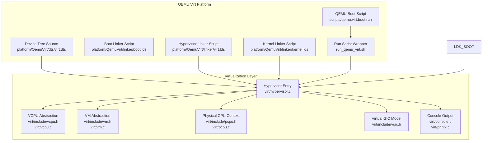
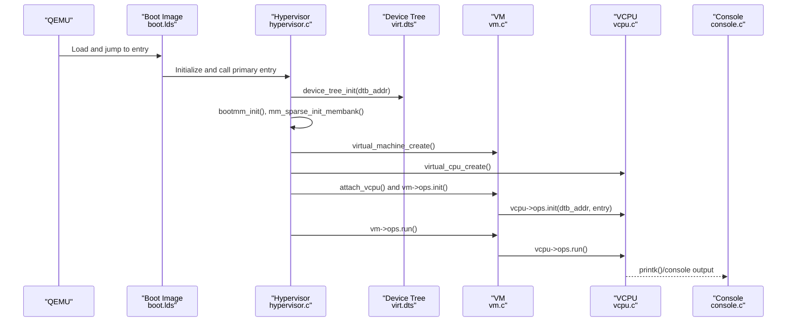
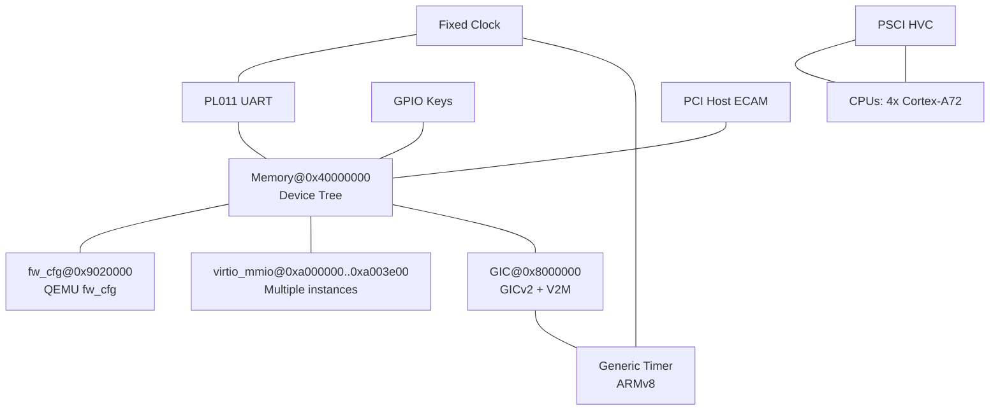
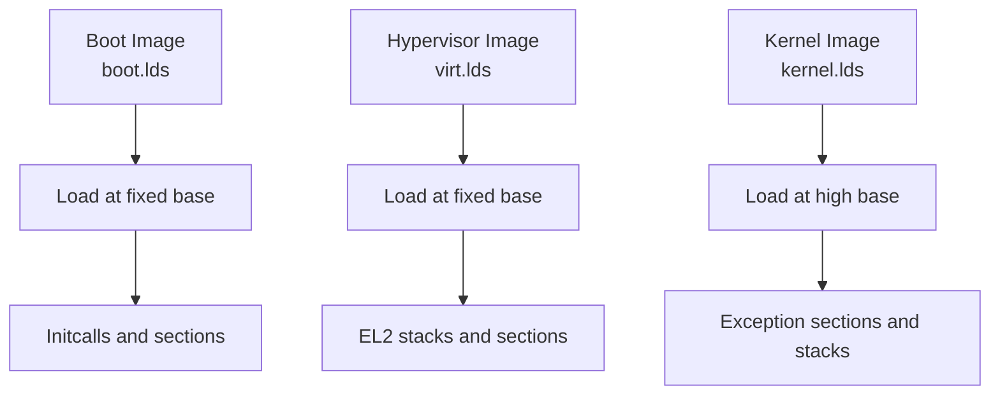
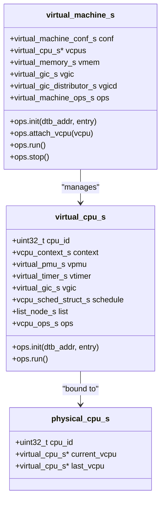
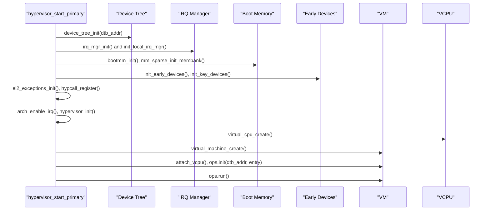
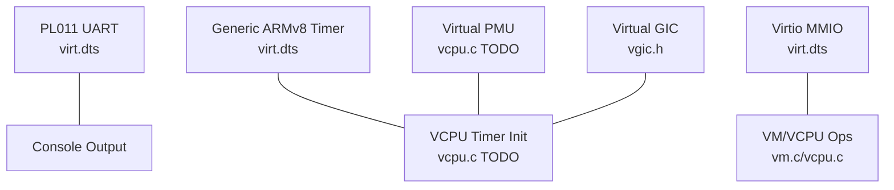
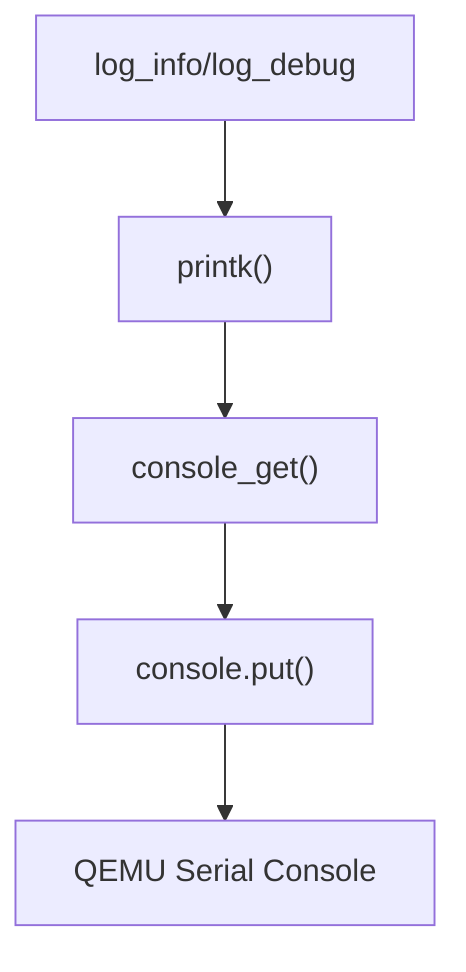
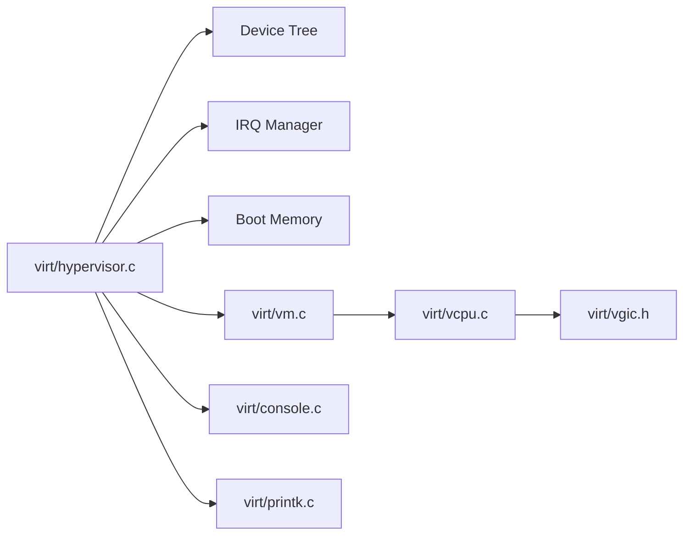

# QEMU Virtual Platform

<cite>
**Referenced Files in This Document**
- [virt.dts](file://platform/QemuVirt/dts/virt.dts)
- [boot.lds](file://platform/QemuVirt/linker/boot.lds)
- [kernel.lds](file://platform/QemuVirt/linker/kernel.lds)
- [virt.lds](file://platform/QemuVirt/linker/virt.lds)
- [qemu.virt.boot.run](file://scripts/qemu.virt.boot.run)
- [run_qemu_virt.sh](file://run_qemu_virt.sh)
- [vcpu.h](file://virt/include/vcpu.h)
- [vm.h](file://virt/include/vm.h)
- [vgic.h](file://virt/include/vgic.h)
- [pcpu.h](file://virt/include/pcpu.h)
- [vcpu.c](file://virt/vcpu.c)
- [vm.c](file://virt/vm.c)
- [pcpu.c](file://virt/pcpu.c)
- [hypervisor.c](file://virt/hypervisor.c)
- [console.c](file://virt/console.c)
- [printk.c](file://virt/printk.c)
</cite>

## Table of Contents
1. [Introduction](#introduction)
2. [Project Structure](#project-structure)
3. [Core Components](#core-components)
4. [Architecture Overview](#architecture-overview)
5. [Detailed Component Analysis](#detailed-component-analysis)
6. [Dependency Analysis](#dependency-analysis)
7. [Performance Considerations](#performance-considerations)
8. [Troubleshooting Guide](#troubleshooting-guide)
9. [Conclusion](#conclusion)
10. [Appendices](#appendices)

## Introduction
This document explains how TranquilOS supports the QEMU virtual platform. It covers the virtual hardware configuration via the device tree, memory layout, virtual CPU and VM abstractions, interrupt controller virtualization, timing mechanisms, and debugging facilities. It also documents QEMU-specific launch parameters, optimizations, development workflows, limitations, and testing procedures. The goal is to help developers configure, extend, and debug the QEMU virtual platform reliably.

## Project Structure
The QEMU virtual platform is organized under the platform and virt directories:
- Device Tree Source: describes virtual hardware and memory layout for QEMU
- Linker Scripts: define load addresses and memory sections for boot, hypervisor, and kernel images
- QEMU Launch Script: defines machine, CPU, SMP, memory, and devices
- Hypervisor and Virtual Machine Abstractions: model VCPU, VM, and GIC virtualization

**Diagram sources**
- [virt.dts](file://platform/QemuVirt/dts/virt.dts#L1-L468)
- [boot.lds](file://platform/QemuVirt/linker/boot.lds#L1-L76)
- [virt.lds](file://platform/QemuVirt/linker/virt.lds#L1-L70)
- [kernel.lds](file://platform/QemuVirt/linker/kernel.lds#L1-L73)
- [qemu.virt.boot.run](file://scripts/qemu.virt.boot.run#L1-L19)
- [run_qemu_virt.sh](file://run_qemu_virt.sh#L1-L5)
- [hypervisor.c](file://virt/hypervisor.c#L1-L149)
- [vcpu.h](file://virt/include/vcpu.h#L1-L49)
- [vcpu.c](file://virt/vcpu.c#L1-L66)
- [vm.h](file://virt/include/vm.h#L1-L39)
- [vm.c](file://virt/vm.c#L1-L59)
- [pcpu.h](file://virt/include/pcpu.h#L1-L18)
- [pcpu.c](file://virt/pcpu.c#L1-L22)
- [vgic.h](file://virt/include/vgic.h#L1-L66)
- [console.c](file://virt/console.c#L1-L27)
- [printk.c](file://virt/printk.c#L1-L16)

**Section sources**
- [virt.dts](file://platform/QemuVirt/dts/virt.dts#L1-L468)
- [boot.lds](file://platform/QemuVirt/linker/boot.lds#L1-L76)
- [virt.lds](file://platform/QemuVirt/linker/virt.lds#L1-L70)
- [kernel.lds](file://platform/QemuVirt/linker/kernel.lds#L1-L73)
- [qemu.virt.boot.run](file://scripts/qemu.virt.boot.run#L1-L19)
- [run_qemu_virt.sh](file://run_qemu_virt.sh#L1-L5)

## Core Components
- Device Tree: Declares memory banks, PSCI, GIC, PL011 UART, GPIO keys, PCIe ECAM host, flash, and CPU topology for QEMU virt machine.
- Linker Scripts: Define base load addresses and section placement for boot, hypervisor, and kernel images.
- Hypervisor Entry: Initializes device tree, early devices, boot memory, IRQ manager, and starts the VM lifecycle.
- Virtual Machine and VCPU: Provide VM abstraction and per-VCPU context initialization and scheduling hooks.
- Virtual GIC: Models GIC distributor and CPU interface structures for virtual interrupts.
- Console and Debugging: Minimal console registration and printk forwarding to the active console.

**Section sources**
- [virt.dts](file://platform/QemuVirt/dts/virt.dts#L60-L467)
- [boot.lds](file://platform/QemuVirt/linker/boot.lds#L1-L76)
- [virt.lds](file://platform/QemuVirt/linker/virt.lds#L1-L70)
- [kernel.lds](file://platform/QemuVirt/linker/kernel.lds#L1-L73)
- [hypervisor.c](file://virt/hypervisor.c#L101-L145)
- [vm.h](file://virt/include/vm.h#L1-L39)
- [vcpu.h](file://virt/include/vcpu.h#L1-L49)
- [vgic.h](file://virt/include/vgic.h#L1-L66)
- [console.c](file://virt/console.c#L1-L27)
- [printk.c](file://virt/printk.c#L1-L16)

## Architecture Overview
The QEMU virtual platform boots the hypervisor, which initializes the device tree and early subsystems, then creates a VM and VCPU(s) and transfers control to the guest kernel image.

**Diagram sources**
- [qemu.virt.boot.run](file://scripts/qemu.virt.boot.run#L2-L14)
- [boot.lds](file://platform/QemuVirt/linker/boot.lds#L1-L76)
- [hypervisor.c](file://virt/hypervisor.c#L101-L145)
- [vm.c](file://virt/vm.c#L35-L53)
- [vcpu.c](file://virt/vcpu.c#L47-L65)
- [console.c](file://virt/console.c#L1-L27)

## Detailed Component Analysis

### Device Tree Setup (QEMU virt)
- Memory layout: One contiguous RAM region declared for the OS.
- Firmware configuration: fw_cfg MMIO region for QEMU firmware configuration.
- Virtio MMIO: Multiple virtio MMIO devices with distinct interrupts.
- Interrupt controller: GICv2 compatible with V2M frame for MSI.
- Timers: Generic ARMv8 timers with multiple interrupts.
- Clocks: Fixed clock for APB peripherals.
- PSCI: PSCI method set to HVC with migrate/cpu_on/cpu_off/suspend methods.
- CPUs: Four Cortex-A72 CPUs with PSCI enable-method.
- PL011 UART: Standard serial console.
- GPIO Keys: Poweroff key mapped to GPIO.
- PCIe ECAM: PCI host with ranges and MSI parent.

**Diagram sources**
- [virt.dts](file://platform/QemuVirt/dts/virt.dts#L60-L467)

**Section sources**
- [virt.dts](file://platform/QemuVirt/dts/virt.dts#L60-L467)

### Memory Layout and Linker Scripts
- Boot image: Loaded at a fixed address and contains early boot and initcalls.
- Hypervisor: Loaded at a fixed address with its own stack regions.
- Kernel: Loaded at a high address with exception sections and stacks.
- Stacks: Separate stacks for EL1, EL2, and EL3 in boot and hypervisor images.

**Diagram sources**
- [boot.lds](file://platform/QemuVirt/linker/boot.lds#L1-L76)
- [virt.lds](file://platform/QemuVirt/linker/virt.lds#L1-L70)
- [kernel.lds](file://platform/QemuVirt/linker/kernel.lds#L1-L73)

**Section sources**
- [boot.lds](file://platform/QemuVirt/linker/boot.lds#L1-L76)
- [virt.lds](file://platform/QemuVirt/linker/virt.lds#L1-L70)
- [kernel.lds](file://platform/QemuVirt/linker/kernel.lds#L1-L73)

### Virtual CPU and VM Abstractions
- Virtual CPU: Holds execute context, system registers, PMU, timers, GIC, scheduling list, and operation hooks.
- Virtual Machine: Holds configuration, VCPU list, virtual memory, and GIC structures; provides init/run/attach/stop operations.
- Physical CPU: Tracks current and last VCPU per physical core.

**Diagram sources**
- [vcpu.h](file://virt/include/vcpu.h#L1-L49)
- [vm.h](file://virt/include/vm.h#L1-L39)
- [pcpu.h](file://virt/include/pcpu.h#L1-L18)

**Section sources**
- [vcpu.h](file://virt/include/vcpu.h#L1-L49)
- [vm.h](file://virt/include/vm.h#L1-L39)
- [pcpu.h](file://virt/include/pcpu.h#L1-L18)

### Hypervisor Initialization and Control Flow
- Entry: Reads device tree, disables interrupts, initializes IRQ manager, boot memory, and early devices.
- Console: Resets and registers console output.
- Exceptions: Initializes EL2 exception handling and registers hypcall handler.
- HCR_EL2: Configures virtualization controls; currently sets RW and routing bits.
- VM Lifecycle: Creates VCPU and VM, attaches VCPU, initializes with DTB and entry, then runs.

**Diagram sources**
- [hypervisor.c](file://virt/hypervisor.c#L101-L145)

**Section sources**
- [hypervisor.c](file://virt/hypervisor.c#L47-L145)

### Virtual Device Implementations
- UART: PL011 UART is present in the device tree and used for console output.
- GIC: Virtual GIC structures are defined; VCPU/GIC wiring is marked as TODO in VCPU init.
- Timers: Generic ARMv8 timers are defined; timer init is marked as TODO in VCPU.
- PMU: Virtual PMU structure exists; init is marked as TODO in VCPU.
- Virtio: Multiple virtio MMIO devices are defined; device drivers are not shown here but are referenced in the device tree.

**Diagram sources**
- [virt.dts](file://platform/QemuVirt/dts/virt.dts#L350-L356)
- [vgic.h](file://virt/include/vgic.h#L1-L66)
- [vcpu.c](file://virt/vcpu.c#L35-L45)
- [vm.c](file://virt/vm.c#L21-L33)

**Section sources**
- [virt.dts](file://platform/QemuVirt/dts/virt.dts#L350-L356)
- [vgic.h](file://virt/include/vgic.h#L1-L66)
- [vcpu.c](file://virt/vcpu.c#L35-L45)
- [vm.c](file://virt/vm.c#L21-L33)

### Timing Mechanisms
- Generic ARMv8 timers are defined in the device tree with multiple interrupts.
- VCPU timer initialization is a TODO in the VCPU implementation.
- The hypervisor does not explicitly configure timer frequency or mode; this is deferred to the guest kernel.

**Section sources**
- [virt.dts](file://platform/QemuVirt/dts/virt.dts#L449-L453)
- [vcpu.c](file://virt/vcpu.c#L39-L41)

### Debugging Capabilities
- Console: Minimal console registration and a dummy put function; printk forwards to the active console.
- Early logging: Hypervisor prints splash and initialization info.
- Serial output: QEMU serial console is enabled in the boot script.

**Diagram sources**
- [hypervisor.c](file://virt/hypervisor.c#L28-L33)
- [printk.c](file://virt/printk.c#L1-L16)
- [console.c](file://virt/console.c#L1-L27)
- [qemu.virt.boot.run](file://scripts/qemu.virt.boot.run#L10-L11)

**Section sources**
- [printk.c](file://virt/printk.c#L1-L16)
- [console.c](file://virt/console.c#L1-L27)
- [hypervisor.c](file://virt/hypervisor.c#L28-L33)
- [qemu.virt.boot.run](file://scripts/qemu.virt.boot.run#L10-L11)

## Dependency Analysis
- Hypervisor depends on device tree parsing, IRQ manager, boot memory, and VM/VCPU abstractions.
- VM orchestrates VCPU initialization and execution.
- VCPU holds per-CPU state and references GIC, timers, and PMU structures.
- Console is a leaf dependency used by hypervisor logging.

**Diagram sources**
- [hypervisor.c](file://virt/hypervisor.c#L1-L149)
- [vm.c](file://virt/vm.c#L1-L59)
- [vcpu.c](file://virt/vcpu.c#L1-L66)
- [vgic.h](file://virt/include/vgic.h#L1-L66)
- [console.c](file://virt/console.c#L1-L27)
- [printk.c](file://virt/printk.c#L1-L16)

**Section sources**
- [hypervisor.c](file://virt/hypervisor.c#L1-L149)
- [vm.c](file://virt/vm.c#L1-L59)
- [vcpu.c](file://virt/vcpu.c#L1-L66)
- [vgic.h](file://virt/include/vgic.h#L1-L66)
- [console.c](file://virt/console.c#L1-L27)
- [printk.c](file://virt/printk.c#L1-L16)

## Performance Considerations
- Virtualization Controls: HCR_EL2 is configured to route physical IRQ/FIQ/SError and to use AArch64 for EL1. This avoids unnecessary traps and reduces overhead.
- Stage 2 Translation: Currently disabled in HCR_EL2, simplifying memory mapping but preventing guest-stage-2 isolation.
- Virtio MMIO: Multiple virtio MMIO instances are defined; ensure the guest driver stack is optimized to avoid contention.
- Console: Minimal console implementation avoids heavy buffering; consider batching output for performance.

[No sources needed since this section provides general guidance]

## Troubleshooting Guide
- No VCPU Attached: VM initialization logs a message when no VCPU is attached; ensure attach_vcpu is called before init.
- Page Allocator Not Initialized: VCPU context init checks for a valid page allocator; ensure boot memory is initialized before VCPU creation.
- Console Output Missing: If console is not registered, output goes to a dummy put; ensure console registration occurs after hypervisor initialization.
- QEMU Launch Issues: Verify machine type, CPU, SMP, memory, kernel image, and DTB paths in the boot script.

**Section sources**
- [vm.c](file://virt/vm.c#L5-L19)
- [vcpu.c](file://virt/vcpu.c#L24-L27)
- [console.c](file://virt/console.c#L11-L22)
- [qemu.virt.boot.run](file://scripts/qemu.virt.boot.run#L2-L14)

## Conclusion
The QEMU virtual platform in TranquilOS is structured around a clear separation of concerns: a device tree describing virtual hardware, dedicated linker scripts for load addresses, and a hypervisor that initializes early subsystems and drives VM/VCPU execution. While several virtual device features (GIC, timers, PMU) are modeled, their runtime wiring remains a TODO. The console and logging pathways are minimal but functional. Extending the platform involves filling in the remaining virtual device implementations, enabling stage 2 translation, and optimizing virtio and console performance.

[No sources needed since this section summarizes without analyzing specific files]

## Appendices

### QEMU Configuration Examples
- Machine: QEMU virt with GICv2 and virtualization off
- CPU: Cortex-A72 with SMP cores
- Memory: 2 GB RAM
- Kernel: Boot image with DTB
- Display: Cocoa with zoom; optional GPU device commented out
- Serial: stdio; optional remote debugging flags commented out

**Section sources**
- [qemu.virt.boot.run](file://scripts/qemu.virt.boot.run#L2-L16)

### Development Workflow
- Build artifacts: Use the wrapper script to build and package images, then launch QEMU.
- Entry Point: Hypervisor entry initializes device tree, boot memory, IRQ manager, and VM lifecycle.
- Testing: Observe console output and ensure VM runs without errors.

**Section sources**
- [run_qemu_virt.sh](file://run_qemu_virt.sh#L1-L5)
- [hypervisor.c](file://virt/hypervisor.c#L101-L145)

### Relationship Between Physical Hardware and Emulation
- Timing: Generic ARMv8 timers are exposed; guest timing relies on emulated timer interrupts.
- Interrupts: GICv2 with V2M MSI frame; virtualization routes physical IRQ/FIQ/SError per HCR_EL2 configuration.
- Device Behavior: UART, virtio MMIO, and GPIO keys mirror real hardware; device tree compatibility ensures consistent behavior across platforms.

**Section sources**
- [virt.dts](file://platform/QemuVirt/dts/virt.dts#L363-L379)
- [virt.dts](file://platform/QemuVirt/dts/virt.dts#L449-L453)
- [hypervisor.c](file://virt/hypervisor.c#L47-L76)