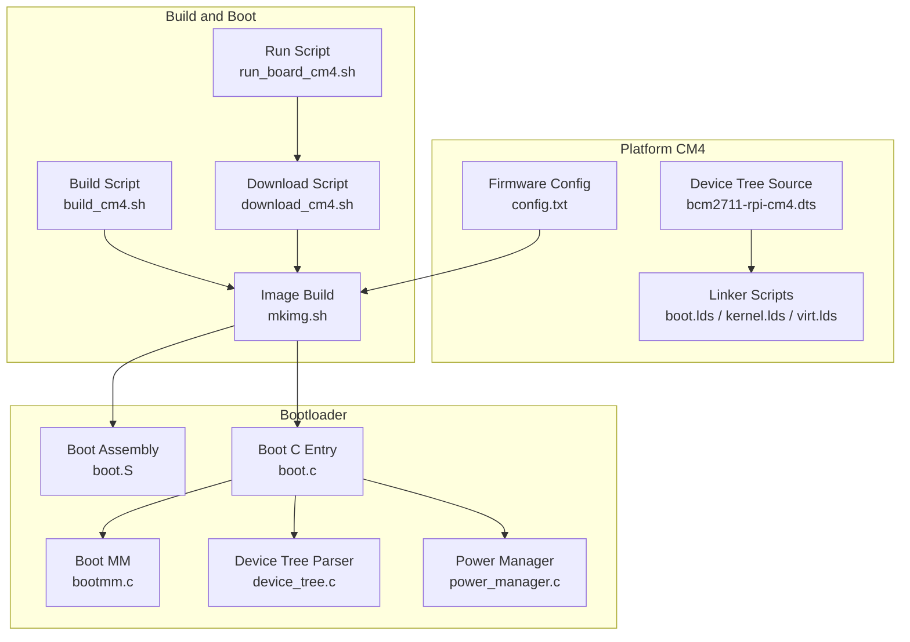
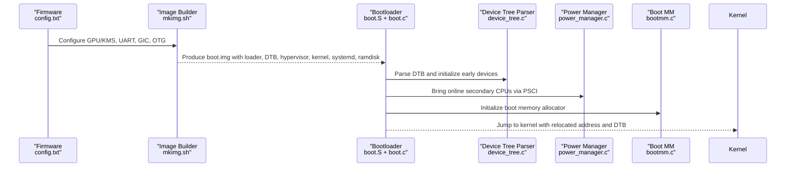
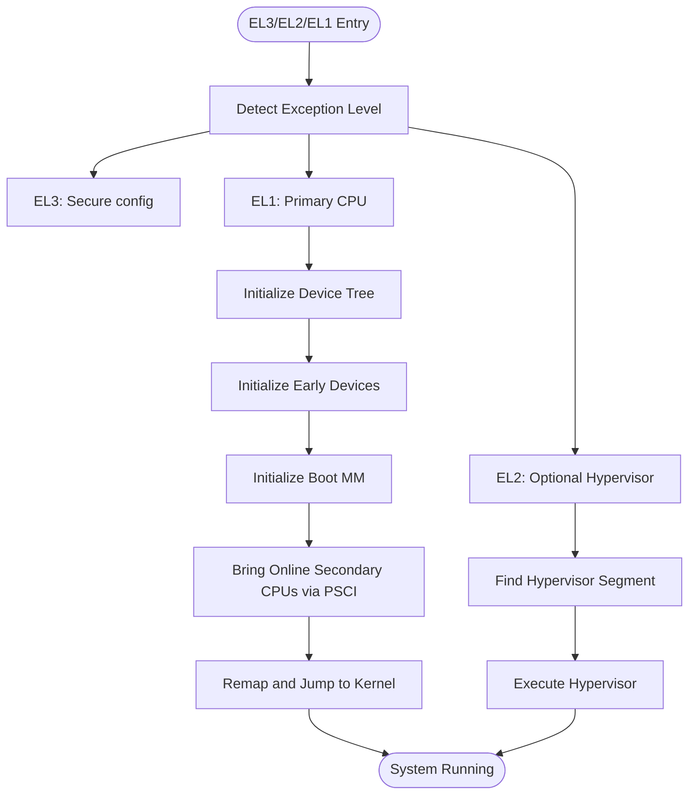
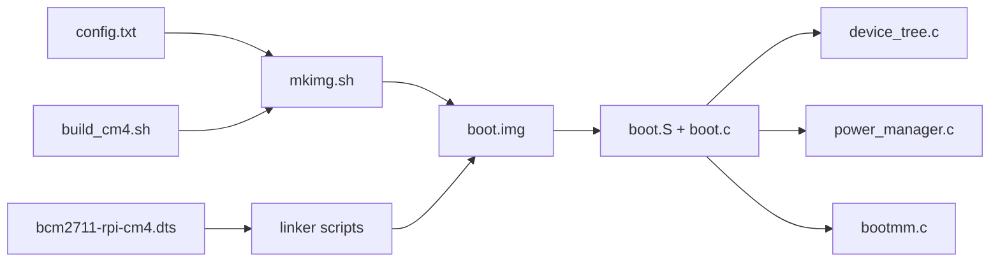

# Compute Module 4 Platform

<cite>
**Referenced Files in This Document**
- [bcm2711-rpi-cm4.dts](file://platform/CM4/dts/bcm2711-rpi-cm4.dts)
- [config.txt](file://platform/CM4/firmware/config.txt)
- [build_cm4.sh](file://scripts/build_cm4.sh)
- [run_board_cm4.sh](file://run_board_cm4.sh)
- [download_cm4.sh](file://scripts/download_cm4.sh)
- [mkimg.sh](file://scripts/mkimg.sh)
- [boot.lds](file://platform/CM4/linker/boot.lds)
- [kernel.lds](file://platform/CM4/linker/kernel.lds)
- [virt.lds](file://platform/CM4/linker/virt.lds)
- [boot.S](file://boot/arch/arm64/boot.S)
- [boot.c](file://boot/boot.c)
- [bootmm.c](file://boot/mm/bootmm.c)
- [device_tree.c](file://kernel/device/device_tree.c)
- [power_manager.c](file://boot/power_manager.c)
</cite>

## Table of Contents
1. [Introduction](#introduction)
2. [Project Structure](#project-structure)
3. [Core Components](#core-components)
4. [Architecture Overview](#architecture-overview)
5. [Detailed Component Analysis](#detailed-component-analysis)
6. [Dependency Analysis](#dependency-analysis)
7. [Performance Considerations](#performance-considerations)
8. [Troubleshooting Guide](#troubleshooting-guide)
9. [Conclusion](#conclusion)
10. [Appendices](#appendices)

## Introduction
This document describes the Raspberry Pi Compute Module 4 (CM4) platform support in TranquilOS. It explains the device tree configuration tailored for the CM4 form factor, memory layout and reservations, firmware and boot process adaptations, and platform-specific hardware mappings. It also covers PCIe, USB-C power delivery considerations, and modular expansion capabilities. Deployment guidance for embedded and industrial applications is included.

## Project Structure
The CM4 platform support is organized under a dedicated folder with three primary areas:
- Device Tree Source: Defines the SoC interconnect, memory reservations, peripheral nodes, and aliases.
- Firmware configuration: Bootloader and GPU/KMS configuration for the CM4.
- Linker scripts: Memory layout for the bootloader, hypervisor, kernel, and virtualization stages.

**Diagram sources**
- [bcm2711-rpi-cm4.dts](file://platform/CM4/dts/bcm2711-rpi-cm4.dts#L1-L2622)
- [config.txt](file://platform/CM4/firmware/config.txt#L1-L14)
- [boot.lds](file://platform/CM4/linker/boot.lds#L1-L73)
- [kernel.lds](file://platform/CM4/linker/kernel.lds#L1-L73)
- [virt.lds](file://platform/CM4/linker/virt.lds#L1-L70)
- [build_cm4.sh](file://scripts/build_cm4.sh#L1-L6)
- [run_board_cm4.sh](file://run_board_cm4.sh#L1-L5)
- [mkimg.sh](file://scripts/mkimg.sh#L1-L38)
- [download_cm4.sh](file://scripts/download_cm4.sh#L1-L27)
- [boot.S](file://boot/arch/arm64/boot.S#L1-L115)
- [boot.c](file://boot/boot.c#L1-L176)
- [bootmm.c](file://boot/mm/bootmm.c#L1-L29)
- [device_tree.c](file://kernel/device/device_tree.c#L1-L95)
- [power_manager.c](file://boot/power_manager.c#L1-L27)

**Section sources**
- [bcm2711-rpi-cm4.dts](file://platform/CM4/dts/bcm2711-rpi-cm4.dts#L1-L2622)
- [config.txt](file://platform/CM4/firmware/config.txt#L1-L14)
- [boot.lds](file://platform/CM4/linker/boot.lds#L1-L73)
- [kernel.lds](file://platform/CM4/linker/kernel.lds#L1-L73)
- [virt.lds](file://platform/CM4/linker/virt.lds#L1-L70)
- [build_cm4.sh](file://scripts/build_cm4.sh#L1-L6)
- [run_board_cm4.sh](file://run_board_cm4.sh#L1-L5)
- [mkimg.sh](file://scripts/mkimg.sh#L1-L38)
- [download_cm4.sh](file://scripts/download_cm4.sh#L1-L27)
- [boot.S](file://boot/arch/arm64/boot.S#L1-L115)
- [boot.c](file://boot/boot.c#L1-L176)
- [bootmm.c](file://boot/mm/bootmm.c#L1-L29)
- [device_tree.c](file://kernel/device/device_tree.c#L1-L95)
- [power_manager.c](file://boot/power_manager.c#L1-L27)

## Core Components
- Device Tree Source (CM4): Defines memory reservations, aliases, clocks, power domains, and periphery nodes optimized for the CM4’s connector and expansion layout.
- Firmware configuration: Enables 64-bit ARM, UART, GIC, and GPU/KMS overlay for HDMI/CRTC.
- Linker scripts: Establish stage-specific load and runtime addresses for boot, hypervisor, and kernel.
- Bootloader: Multi-stage entry (EL3/EL2/EL1), device tree parsing, early device initialization, and CPU bringup via PSCI.
- Image builder: Produces a single boot image containing loader, DTB, hypervisor, kernel, systemd, and ramdisk.

Key CM4-specific elements:
- Aliases for serial, I2C/SPI/I2S, MMC/eMMC, PCIe, Ethernet, audio, GPIO, DMA, watchdog, RNG, mailbox, LEDs, framebuffer, thermal, AXI performance monitor, and more.
- Reserved memory with Linux CMA region and NVRAM area.
- SoC bus ranges and DMA ranges aligned with BCM2711 memory map.
- PCIe controller with MSI and ranges configured for downstream devices.
- Ethernet (GENET) with RGMII PHY and MDIO.
- eMMC2 bus for onboard eMMC.
- USB OTG mode enabled for CM4.
- HDMI and DSI subsystems with multiple instances and I2C bridges.
- GPIO pin control groups for DPI, eMMC, JTAG, PCM, SPI variants, UARTs, and more.

**Section sources**
- [bcm2711-rpi-cm4.dts](file://platform/CM4/dts/bcm2711-rpi-cm4.dts#L36-L111)
- [bcm2711-rpi-cm4.dts](file://platform/CM4/dts/bcm2711-rpi-cm4.dts#L124-L2399)
- [config.txt](file://platform/CM4/firmware/config.txt#L10-L14)
- [boot.c](file://boot/boot.c#L34-L56)
- [device_tree.c](file://kernel/device/device_tree.c#L10-L23)

## Architecture Overview
The CM4 platform boot and runtime architecture integrates firmware, bootloader, and kernel with explicit memory and device mappings.

**Diagram sources**
- [config.txt](file://platform/CM4/firmware/config.txt#L1-L14)
- [mkimg.sh](file://scripts/mkimg.sh#L1-L38)
- [boot.S](file://boot/arch/arm64/boot.S#L1-L115)
- [boot.c](file://boot/boot.c#L1-L176)
- [device_tree.c](file://kernel/device/device_tree.c#L1-L95)
- [power_manager.c](file://boot/power_manager.c#L1-L27)
- [bootmm.c](file://boot/mm/bootmm.c#L1-L29)

## Detailed Component Analysis

### Device Tree Structure and Memory Layout
- Root properties define compatibility and model, plus address/size cells and interrupt parent.
- Memory reservations:
  - Early boot reservation.
  - Linux CMA region for DMA buffers.
  - NVRAM area for bootloader configuration.
- Aliases provide canonical names for serial, I2C, SPI, I2S, MMC/eMMC, PCIe, Ethernet, audio, GPIO, DMA, watchdog, RNG, mailbox, LEDs, framebuffer, thermal, AXI performance monitor, and more.
- Chosen node sets boot arguments including coherent pool and ALSA compatibility flags.
- SoC bus ranges and DMA ranges reflect BCM2711 memory map and DMA aperture.
- Reserved memory phandles align with CMA and NVRAM nodes.

Memory layout highlights:
- Boot segment at a fixed base.
- Hypervisor segment at a fixed base.
- Kernel segment at a fixed base.
- System Daemon and ramdisk segments at fixed bases.
- CMA region allocated from low memory and mapped for DMA.

**Section sources**
- [bcm2711-rpi-cm4.dts](file://platform/CM4/dts/bcm2711-rpi-cm4.dts#L1-L111)
- [bcm2711-rpi-cm4.dts](file://platform/CM4/dts/bcm2711-rpi-cm4.dts#L124-L131)
- [bcm2711-rpi-cm4.dts](file://platform/CM4/dts/bcm2711-rpi-cm4.dts#L87-L111)

### PCIe Interface Support
- PCIe controller node defines device type, address/size cells, interrupts, MSI controller, ranges, and DMA ranges.
- Interrupt map and mapping mask configure downstream IRQs.
- Enablement of spread-spectrum and L1 subsumption features.
- Downstream PCI node present for device enumeration.

Practical implications:
- Enables external PCIe devices (NIC, NVMe, capture cards).
- MSI interrupts supported for device-to-host signaling.
- DMA ranges allow device access to system memory.

**Section sources**
- [bcm2711-rpi-cm4.dts](file://platform/CM4/dts/bcm2711-rpi-cm4.dts#L2125-L2151)

### USB-C Power Delivery and OTG Mode
- Firmware enables OTG mode for CM4, allowing USB Type-C PD and host/peripheral switching.
- USB controller node includes OTG clock and PHY references.
- XHCI host controller node present but disabled by default.

Deployment note:
- Use OTG mode for PD-enabled carriers or when requiring dual-role USB.
- Disable/enable USB nodes depending on role and use-case.

**Section sources**
- [config.txt](file://platform/CM4/firmware/config.txt#L10-L14)
- [bcm2711-rpi-cm4.dts](file://platform/CM4/dts/bcm2711-rpi-cm4.dts#L1446-L1460)
- [bcm2711-rpi-cm4.dts](file://platform/CM4/dts/bcm2711-rpi-cm4.dts#L2190-L2197)

### Modular Expansion Capabilities
- eMMC2 bus exposes onboard eMMC with voltage regulators and bus width.
- Multiple I2C, SPI, UART, and GPIO pin groups for modular peripherals.
- HDMI and DSI subsystems for displays and cameras.
- PCIe for high-bandwidth expansion.
- Ethernet GENET with MDIO for networking.

Integration guidance:
- Carrier board designs can leverage eMMC2, PCIe, and multiple I2C/SPI buses.
- Use HDMI/DSI for media applications; configure appropriate regulators and clocks.

**Section sources**
- [bcm2711-rpi-cm4.dts](file://platform/CM4/dts/bcm2711-rpi-cm4.dts#L2002-L2023)
- [bcm2711-rpi-cm4.dts](file://platform/CM4/dts/bcm2711-rpi-cm4.dts#L1732-L1784)
- [bcm2711-rpi-cm4.dts](file://platform/CM4/dts/bcm2711-rpi-cm4.dts#L1898-L1926)
- [bcm2711-rpi-cm4.dts](file://platform/CM4/dts/bcm2711-rpi-cm4.dts#L2153-L2178)

### Firmware Configuration Requirements
- Enable 64-bit ARM, UART, second-stage UART, GIC, and set boot delays.
- CM4-specific settings: OTG mode, VC4 KMS overlay, max framebuffers, and kernel selection.

Impact:
- Ensures proper firmware handoff, GPU/KMS availability, and console output.
- Selects the correct kernel image for CM4.

**Section sources**
- [config.txt](file://platform/CM4/firmware/config.txt#L1-L14)

### Boot Process Adaptations
- Multi-stage entry supports EL3, EL2, and EL1.
- Primary CPU initializes device tree, early devices, boot memory, and powers on secondary CPUs via PSCI.
- Secondary CPUs jump to kernel after primary CPU completes setup.
- Device tree parser locates kernel and hypervisor segments by compatible strings.

**Diagram sources**
- [boot.S](file://boot/arch/arm64/boot.S#L1-L115)
- [boot.c](file://boot/boot.c#L82-L107)
- [boot.c](file://boot/boot.c#L114-L136)
- [device_tree.c](file://kernel/device/device_tree.c#L10-L23)
- [power_manager.c](file://boot/power_manager.c#L12-L21)

**Section sources**
- [boot.S](file://boot/arch/arm64/boot.S#L1-L115)
- [boot.c](file://boot/boot.c#L1-L176)
- [device_tree.c](file://kernel/device/device_tree.c#L1-L95)
- [power_manager.c](file://boot/power_manager.c#L1-L27)

### Hardware Initialization Differences Compared to Standard Pi Boards
- CM4 device tree includes more GPIO pin control groups and alternate function mappings suited for the compute module’s connector layout.
- Additional I2C/SPI/UART groups and pinmux configurations for modular peripherals.
- PCIe and Ethernet nodes present for expansion and networking.
- Firmware enables OTG mode for CM4.

These differences enable richer peripheral connectivity and higher bandwidth expansion on CM4-based systems.

**Section sources**
- [bcm2711-rpi-cm4.dts](file://platform/CM4/dts/bcm2711-rpi-cm4.dts#L166-L2399)
- [config.txt](file://platform/CM4/firmware/config.txt#L10-L14)

### Platform-Specific Memory Reservations and Device Aliases
- Memory reservations include early boot, Linux CMA, and NVRAM.
- Aliases provide standardized references for serial, I2C, SPI, I2S, MMC/eMMC, PCIe, Ethernet, audio, GPIO, DMA, watchdog, RNG, mailbox, LEDs, framebuffer, thermal, AXI performance monitor, and more.

Usage:
- Drivers reference aliases to bind to the correct hardware nodes.
- CMA reserved region ensures DMA-capable allocations.

**Section sources**
- [bcm2711-rpi-cm4.dts](file://platform/CM4/dts/bcm2711-rpi-cm4.dts#L3-L111)
- [bcm2711-rpi-cm4.dts](file://platform/CM4/dts/bcm2711-rpi-cm4.dts#L36-L81)

### Hardware Feature Mappings
- Clocks: Fixed oscillators and USB clocks.
- PHY: USB NOP transceiver.
- GPU: VC5 node present but disabled.
- Timer: Generic ARMv8 timers.
- PMU: Cortex-A72 PMU with affinity interrupts.
- HDMI/DSI: Multiple instances with I2C bridges and audio DMA.
- CSI: Unicam nodes for camera interfaces.
- AXI Perf: Performance monitoring nodes.

**Section sources**
- [bcm2711-rpi-cm4.dts](file://platform/CM4/dts/bcm2711-rpi-cm4.dts#L1954-L2035)
- [bcm2711-rpi-cm4.dts](file://platform/CM4/dts/bcm2711-rpi-cm4.dts#L1973-L1977)
- [bcm2711-rpi-cm4.dts](file://platform/CM4/dts/bcm2711-rpi-cm4.dts#L1979-L1984)
- [bcm2711-rpi-cm4.dts](file://platform/CM4/dts/bcm2711-rpi-cm4.dts#L2357-L2377)

### Deployment Considerations
- Embedded and industrial use:
  - Use PCIe for high-throughput I/O and Ethernet for networking.
  - Enable OTG mode for PD-enabled carriers or dual-role USB.
  - Utilize HDMI/DSI for media applications; configure regulators and clocks accordingly.
- Custom carrier board integration:
  - Connect external PCIe devices to the PCIe controller.
  - Use eMMC2 bus for onboard storage.
  - Leverage multiple I2C/SPI/UART groups for sensors, displays, and modems.
  - Ensure firmware settings match the intended role (OTG vs host/peripheral).

**Section sources**
- [config.txt](file://platform/CM4/firmware/config.txt#L10-L14)
- [bcm2711-rpi-cm4.dts](file://platform/CM4/dts/bcm2711-rpi-cm4.dts#L2125-L2151)
- [bcm2711-rpi-cm4.dts](file://platform/CM4/dts/bcm2711-rpi-cm4.dts#L2153-L2178)
- [bcm2711-rpi-cm4.dts](file://platform/CM4/dts/bcm2711-rpi-cm4.dts#L2002-L2023)

## Dependency Analysis
The CM4 platform relies on coordinated firmware, linker scripts, and bootloader components.

**Diagram sources**
- [config.txt](file://platform/CM4/firmware/config.txt#L1-L14)
- [build_cm4.sh](file://scripts/build_cm4.sh#L1-L6)
- [mkimg.sh](file://scripts/mkimg.sh#L1-L38)
- [boot.S](file://boot/arch/arm64/boot.S#L1-L115)
- [boot.c](file://boot/boot.c#L1-L176)
- [device_tree.c](file://kernel/device/device_tree.c#L1-L95)
- [power_manager.c](file://boot/power_manager.c#L1-L27)
- [bootmm.c](file://boot/mm/bootmm.c#L1-L29)
- [bcm2711-rpi-cm4.dts](file://platform/CM4/dts/bcm2711-rpi-cm4.dts#L1-L2622)
- [boot.lds](file://platform/CM4/linker/boot.lds#L1-L73)
- [kernel.lds](file://platform/CM4/linker/kernel.lds#L1-L73)
- [virt.lds](file://platform/CM4/linker/virt.lds#L1-L70)

**Section sources**
- [config.txt](file://platform/CM4/firmware/config.txt#L1-L14)
- [build_cm4.sh](file://scripts/build_cm4.sh#L1-L6)
- [mkimg.sh](file://scripts/mkimg.sh#L1-L38)
- [boot.S](file://boot/arch/arm64/boot.S#L1-L115)
- [boot.c](file://boot/boot.c#L1-L176)
- [device_tree.c](file://kernel/device/device_tree.c#L1-L95)
- [power_manager.c](file://boot/power_manager.c#L1-L27)
- [bootmm.c](file://boot/mm/bootmm.c#L1-L29)
- [bcm2711-rpi-cm4.dts](file://platform/CM4/dts/bcm2711-rpi-cm4.dts#L1-L2622)
- [boot.lds](file://platform/CM4/linker/boot.lds#L1-L73)
- [kernel.lds](file://platform/CM4/linker/kernel.lds#L1-L73)
- [virt.lds](file://platform/CM4/linker/virt.lds#L1-L70)

## Performance Considerations
- Use the Linux CMA reserved region for DMA allocations to avoid fragmentation.
- Keep coherent_pool setting aligned with driver requirements to minimize cache bounce.
- Prefer PCIe for high-throughput devices; ensure DMA ranges and MSI are properly configured.
- Utilize HDMI/DSI with appropriate clocks and regulators to avoid thermal throttling.
- Monitor AXI performance counters for bandwidth bottlenecks.

[No sources needed since this section provides general guidance]

## Troubleshooting Guide
Common issues and remedies:
- Kernel not found by bootloader:
  - Verify the kernel segment compatible string exists in the device tree and that the bootloader can locate it.
- No console output:
  - Confirm UART is enabled in firmware and the correct UART node is used by the console driver.
- PCIe device not detected:
  - Ensure PCIe controller is enabled and downstream device is compatible; check MSI and ranges.
- Secondary CPUs not coming online:
  - Verify PSCI enable method and that power manager is registered and functional.
- RAM disk or systemd missing:
  - Confirm image build script includes all required components and offsets are correct.

**Section sources**
- [boot.c](file://boot/boot.c#L34-L56)
- [device_tree.c](file://kernel/device/device_tree.c#L25-L37)
- [config.txt](file://platform/CM4/firmware/config.txt#L3-L6)
- [bcm2711-rpi-cm4.dts](file://platform/CM4/dts/bcm2711-rpi-cm4.dts#L2125-L2151)
- [power_manager.c](file://boot/power_manager.c#L12-L21)
- [mkimg.sh](file://scripts/mkimg.sh#L13-L38)

## Conclusion
The CM4 platform support in TranquilOS leverages a tailored device tree, firmware configuration, and multi-stage bootloader to deliver robust boot and runtime behavior. The device tree accommodates CM4-specific layouts, PCIe and Ethernet expansion, and rich peripheral sets. Firmware settings enable OTG mode and GPU/KMS for modern display and media workloads. The linker scripts and image builder produce a unified boot image suitable for embedded and industrial deployments, while the bootloader ensures reliable CPU bringup and device initialization.

[No sources needed since this section summarizes without analyzing specific files]

## Appendices

### Build and Run Workflow
- Build CM4 images with the dedicated script.
- Create the boot image with the image builder.
- Download to the CM4 via rpiboot and SD card.

**Section sources**
- [build_cm4.sh](file://scripts/build_cm4.sh#L1-L6)
- [run_board_cm4.sh](file://run_board_cm4.sh#L1-L5)
- [download_cm4.sh](file://scripts/download_cm4.sh#L1-L27)
- [mkimg.sh](file://scripts/mkimg.sh#L1-L38)

### Linker Scripts and Memory Layout
- Boot linker script sets entry and sections for the bootloader stage.
- Kernel linker script defines the kernel load and runtime address.
- Virtualization linker script sets the hypervisor load and stack regions.

**Section sources**
- [boot.lds](file://platform/CM4/linker/boot.lds#L1-L73)
- [kernel.lds](file://platform/CM4/linker/kernel.lds#L1-L73)
- [virt.lds](file://platform/CM4/linker/virt.lds#L1-L70)