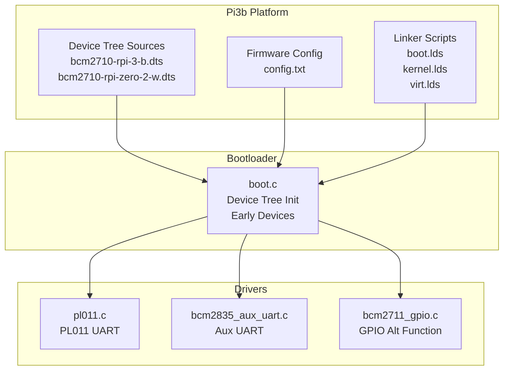
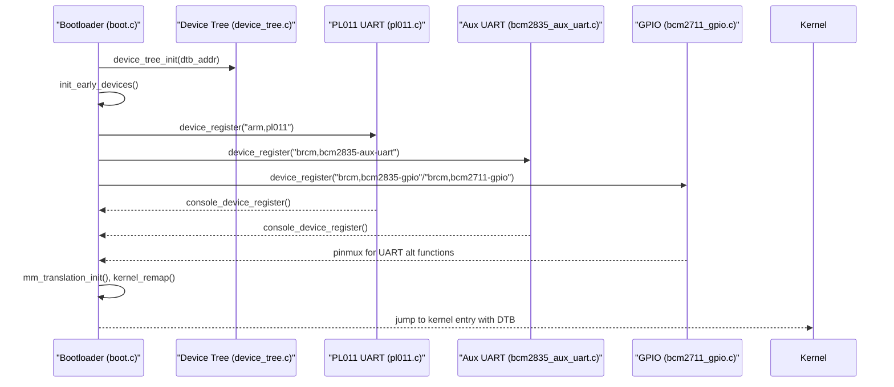
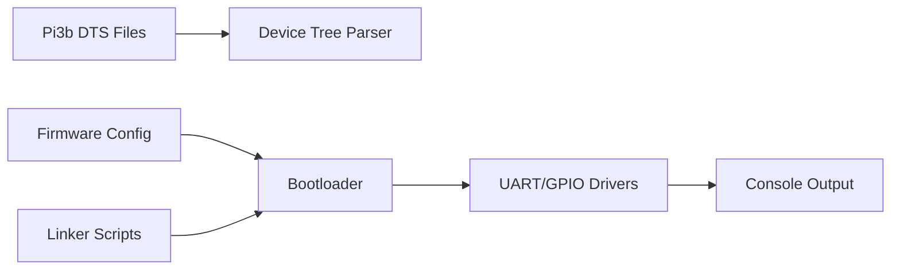

# Raspberry Pi 3B Platform

<cite>
**Referenced Files in This Document**
- [bcm2710-rpi-3-b.dts](file://platform/Pi3b/dts/bcm2710-rpi-3-b.dts)
- [bcm2710-rpi-zero-2-w.dts](file://platform/Pi3b/dts/bcm2710-rpi-zero-2-w.dts)
- [config.txt](file://platform/Pi3b/firmware/config.txt)
- [boot.lds](file://platform/Pi3b/linker/boot.lds)
- [kernel.lds](file://platform/Pi3b/linker/kernel.lds)
- [virt.lds](file://platform/Pi3b/linker/virt.lds)
- [boot.c](file://boot/boot.c)
- [device_tree.c](file://kernel/device/device_tree.c)
- [pl011.c](file://boot/drivers/arm-uart/pl011.c)
- [bcm2835_aux_uart.c](file://boot/drivers/rpi/bcm2835-aux-uart/bcm2835_aux_uart.c)
- [bcm2711_gpio.c](file://boot/drivers/rpi/bcm2711-gpio/bcm2711_gpio.c)
- [build_pi3b.sh](file://scripts/build_pi3b.sh)
</cite>

## Table of Contents
1. [Introduction](#introduction)
2. [Project Structure](#project-structure)
3. [Core Components](#core-components)
4. [Architecture Overview](#architecture-overview)
5. [Detailed Component Analysis](#detailed-component-analysis)
6. [Dependency Analysis](#dependency-analysis)
7. [Performance Considerations](#performance-considerations)
8. [Troubleshooting Guide](#troubleshooting-guide)
9. [Conclusion](#conclusion)

## Introduction
This document explains the Raspberry Pi 3B and Pi Zero 2W platform support in TranquilOS. It focuses on the BCM2710-based hardware configuration differences between these two models, the device tree structures, memory layouts, and hardware initialization sequences. It also covers shared SoC peripherals, memory configurations, hardware abstraction differences, device tree overlays, GPIO configurations, serial interfaces, peripheral mappings, performance characteristics, power management features, platform-specific optimizations, compatibility considerations, memory limitations, and troubleshooting guidance.

## Project Structure
The Pi 3B platform support is organized under the Pi3b platform directory with three major areas:
- Device Tree Sources (DTS): Define hardware layout, memory reservations, aliases, and peripheral nodes for Pi 3B and Pi Zero 2W.
- Firmware configuration: Controls bootloader and early GPU/firmware behavior.
- Linker scripts: Establish load and virtual address layouts for Boot, Hypervisor (EL2), and Kernel (EL1) images.

**Diagram sources**
- [bcm2710-rpi-3-b.dts](file://platform/Pi3b/dts/bcm2710-rpi-3-b.dts#L1-L1590)
- [bcm2710-rpi-zero-2-w.dts](file://platform/Pi3b/dts/bcm2710-rpi-zero-2-w.dts#L1-L1540)
- [config.txt](file://platform/Pi3b/firmware/config.txt#L1-L14)
- [boot.lds](file://platform/Pi3b/linker/boot.lds#L1-L77)
- [kernel.lds](file://platform/Pi3b/linker/kernel.lds#L1-L73)
- [virt.lds](file://platform/Pi3b/linker/virt.lds#L1-L70)
- [boot.c](file://boot/boot.c#L1-L176)
- [pl011.c](file://boot/drivers/arm-uart/pl011.c#L1-L95)
- [bcm2835_aux_uart.c](file://boot/drivers/rpi/bcm2835-aux-uart/bcm2835_aux_uart.c#L1-L37)
- [bcm2711_gpio.c](file://boot/drivers/rpi/bcm2711-gpio/bcm2711_gpio.c#L1-L67)

**Section sources**
- [bcm2710-rpi-3-b.dts](file://platform/Pi3b/dts/bcm2710-rpi-3-b.dts#L1-L1590)
- [bcm2710-rpi-zero-2-w.dts](file://platform/Pi3b/dts/bcm2710-rpi-zero-2-w.dts#L1-L1540)
- [config.txt](file://platform/Pi3b/firmware/config.txt#L1-L14)
- [boot.lds](file://platform/Pi3b/linker/boot.lds#L1-L77)
- [kernel.lds](file://platform/Pi3b/linker/kernel.lds#L1-L73)
- [virt.lds](file://platform/Pi3b/linker/virt.lds#L1-L70)

## Core Components
- Device Tree Sources define the hardware topology, memory reservations, DMA ranges, and peripheral nodes for both Pi 3B and Pi Zero 2W. They include aliases for serial ports, GPIO, I2C, SPI, and USB, and set stdout-path and bootargs.
- Firmware configuration enables ARM 64-bit, UART, GIC, and optional GPU overlays for specific models.
- Linker scripts establish fixed load addresses and stack placements for Boot, Hypervisor, and Kernel stages.
- Bootloader initializes device tree, early devices, boots memory manager, powers on secondary CPUs via PSCI, and jumps to the kernel mapped at a virtual base.

Key implementation references:
- Device tree parsing and traversal in the kernel.
- Bootloader entrypoints and EL1/EL2/EL3 transitions.
- Early UART and GPIO initialization for console and serial communication.

**Section sources**
- [device_tree.c](file://kernel/device/device_tree.c#L1-L95)
- [boot.c](file://boot/boot.c#L1-L176)

## Architecture Overview
The platform architecture integrates device tree-driven hardware discovery with early boot initialization and driver probing. The bootloader reads the DTB, initializes MMU translation, remaps kernel images, and transfers control to the kernel. Drivers probe based on compatible strings defined in the DTS.

**Diagram sources**
- [boot.c](file://boot/boot.c#L82-L107)
- [device_tree.c](file://kernel/device/device_tree.c#L10-L23)
- [pl011.c](file://boot/drivers/arm-uart/pl011.c#L90-L95)
- [bcm2835_aux_uart.c](file://boot/drivers/rpi/bcm2835-aux-uart/bcm2835_aux_uart.c#L31-L37)
- [bcm2711_gpio.c](file://boot/drivers/rpi/bcm2711-gpio/bcm2711_gpio.c#L49-L67)

## Detailed Component Analysis

### Device Tree Structures: Pi 3B vs Pi Zero 2W
- Both models share the BCM2710 family and use the same SoC peripherals, but differ in:
  - Memory layout and reserved regions.
  - Aliases and enabled peripherals.
  - GPIO pin definitions and alternate function assignments.
  - Optional HDMI/DSI peripherals availability.

Key differences observed:
- Reserved memory and CMA pool are defined consistently for both models.
- Aliases for serial0/serial1 and GPIO are present; Pi Zero 2W defines BT/UART pin groups differently.
- Peripheral nodes (UART, I2C, SPI, MMC) are defined similarly, with different pinctrl defaults and optional status.
- Pi Zero 2W includes additional DSI1 and audio pin entries in GPIO line names.

Memory and alias mappings:
- Both define ranges and dma-ranges for SOC bus.
- Aliases include serial0/serial1, GPIO, I2C, SPI, MMC, USB, and thermal sensors.

**Section sources**
- [bcm2710-rpi-3-b.dts](file://platform/Pi3b/dts/bcm2710-rpi-3-b.dts#L96-L134)
- [bcm2710-rpi-3-b.dts](file://platform/Pi3b/dts/bcm2710-rpi-3-b.dts#L53-L88)
- [bcm2710-rpi-3-b.dts](file://platform/Pi3b/dts/bcm2710-rpi-3-b.dts#L118-L134)
- [bcm2710-rpi-zero-2-w.dts](file://platform/Pi3b/dts/bcm2710-rpi-zero-2-w.dts#L78-L116)
- [bcm2710-rpi-zero-2-w.dts](file://platform/Pi3b/dts/bcm2710-rpi-zero-2-w.dts#L36-L70)
- [bcm2710-rpi-zero-2-w.dts](file://platform/Pi3b/dts/bcm2710-rpi-zero-2-w.dts#L118-L134)

### Memory Layouts and Load Addresses
- Boot stage loads at a fixed physical address and uses linker script sections to organize text, rodata, data, bss, and stacks.
- Kernel stage uses a fixed virtual load address and linker script to place code and stacks.
- Hypervisor stage (EL2) is optional and loaded at a fixed address per DTS; the bootloader can transfer control to it if present.

Linker scripts:
- Boot linker script defines entrypoint and sections for initcalls and stacks.
- Kernel linker script defines a fixed virtual base address for the kernel image.
- Virtual linker script defines EL2 placement.

**Section sources**
- [boot.lds](file://platform/Pi3b/linker/boot.lds#L1-L77)
- [kernel.lds](file://platform/Pi3b/linker/kernel.lds#L1-L73)
- [virt.lds](file://platform/Pi3b/linker/virt.lds#L1-L70)

### Hardware Initialization Sequences
Bootloader initialization sequence:
- Initialize console device, device tree, disable IRQs, initialize early devices, boot memory manager, enumerate CPUs via PSCI, remap kernel, and jump to kernel with DTB.

Driver initialization:
- PL011 UART driver probes the node, sets baud rate divisors, enables TX/RX, and registers a console device.
- Auxiliary UART driver enables mini UART, configures line control, and registers a console device.
- GPIO driver selects alternate function for UART pins on the SoC.

**Section sources**
- [boot.c](file://boot/boot.c#L82-L107)
- [pl011.c](file://boot/drivers/arm-uart/pl011.c#L51-L83)
- [bcm2835_aux_uart.c](file://boot/drivers/rpi/bcm2835-aux-uart/bcm2835_aux_uart.c#L19-L23)
- [bcm2711_gpio.c](file://boot/drivers/rpi/bcm2711-gpio/bcm2711_gpio.c#L49-L53)

### Shared SoC Peripherals and Abstraction
- Both models expose the same SoC bus ranges and DMA ranges.
- UARTs: PL011 (primary) and auxiliary UART (secondary) are defined; both models enable one or both depending on configuration.
- GPIO: Both models define extensive pin groups and alternate function mappings; Pi Zero 2W adds BT/UART pin groups.
- I2C/SPI/MMC: Defined similarly; optional status allows enabling/disabling.
- Clocks and interrupts: CPRMAN and GIC are present; interrupts are wired to the GIC.

**Section sources**
- [bcm2710-rpi-3-b.dts](file://platform/Pi3b/dts/bcm2710-rpi-3-b.dts#L136-L142)
- [bcm2710-rpi-3-b.dts](file://platform/Pi3b/dts/bcm2710-rpi-3-b.dts#L593-L616)
- [bcm2710-rpi-3-b.dts](file://platform/Pi3b/dts/bcm2710-rpi-3-b.dts#L718-L746)
- [bcm2710-rpi-3-b.dts](file://platform/Pi3b/dts/bcm2710-rpi-3-b.dts#L160-L190)
- [bcm2710-rpi-zero-2-w.dts](file://platform/Pi3b/dts/bcm2710-rpi-zero-2-w.dts#L118-L124)
- [bcm2710-rpi-zero-2-w.dts](file://platform/Pi3b/dts/bcm2710-rpi-zero-2-w.dts#L574-L597)
- [bcm2710-rpi-zero-2-w.dts](file://platform/Pi3b/dts/bcm2710-rpi-zero-2-w.dts#L707-L727)
- [bcm2710-rpi-zero-2-w.dts](file://platform/Pi3b/dts/bcm2710-rpi-zero-2-w.dts#L160-L171)

### Device Tree Overlays, GPIO Configurations, Serial Interfaces, and Peripheral Mappings
- Overlays: The firmware config enables optional GPU overlays for specific models; Pi Zero 2W does not include overlay directives in the provided snippet.
- GPIO: Both models define extensive pin groups and alternate function mappings; Pi Zero 2W includes BT/UART pin groups and additional audio pin entries.
- Serial: PL011 and auxiliary UART nodes are defined; stdout-path is configured in chosen; both models enable UART via firmware config.
- Peripherals: I2C, SPI, MMC, PWM, and HDMI/DSI nodes are defined; optional status allows enabling/disabling.

**Section sources**
- [config.txt](file://platform/Pi3b/firmware/config.txt#L1-L14)
- [bcm2710-rpi-3-b.dts](file://platform/Pi3b/dts/bcm2710-rpi-3-b.dts#L90-L94)
- [bcm2710-rpi-3-b.dts](file://platform/Pi3b/dts/bcm2710-rpi-3-b.dts#L178-L591)
- [bcm2710-rpi-zero-2-w.dts](file://platform/Pi3b/dts/bcm2710-rpi-zero-2-w.dts#L72-L76)
- [bcm2710-rpi-zero-2-w.dts](file://platform/Pi3b/dts/bcm2710-rpi-zero-2-w.dts#L160-L572)

### Performance Characteristics and Power Management Features
- CPU power-on: Secondary CPUs are powered on via PSCI method discovered from device tree.
- Clocks and timers: CPRMAN and system timer nodes are defined; timers are disabled by default.
- Console throughput: PL011 driver configures baud rate divisors for standard serial speed.
- DMA: Several peripherals declare DMA channels and names for RX/TX.

**Section sources**
- [boot.c](file://boot/boot.c#L68-L80)
- [bcm2710-rpi-3-b.dts](file://platform/Pi3b/dts/bcm2710-rpi-3-b.dts#L161-L168)
- [bcm2710-rpi-3-b.dts](file://platform/Pi3b/dts/bcm2710-rpi-3-b.dts#L144-L151)
- [pl011.c](file://boot/drivers/arm-uart/pl011.c#L64-L69)

### Platform-Specific Optimizations
- Fixed load addresses and linker scripts ensure predictable memory layout for Boot, Hypervisor, and Kernel.
- Early device registration and console initialization enable immediate logging and diagnostics.
- Optional Hypervisor stage can be included; if absent, the bootloader falls back to EL1.

**Section sources**
- [boot.lds](file://platform/Pi3b/linker/boot.lds#L1-L77)
- [kernel.lds](file://platform/Pi3b/linker/kernel.lds#L1-L73)
- [virt.lds](file://platform/Pi3b/linker/virt.lds#L1-L70)
- [boot.c](file://boot/boot.c#L124-L136)

## Dependency Analysis
The platform relies on:
- Device Tree for hardware discovery and runtime configuration.
- Bootloader for early initialization and control transfer.
- Drivers for UART, GPIO, and peripherals registered via device tree compatible strings.
- Linker scripts for deterministic memory layout.

**Diagram sources**
- [bcm2710-rpi-3-b.dts](file://platform/Pi3b/dts/bcm2710-rpi-3-b.dts#L1-L1590)
- [bcm2710-rpi-zero-2-w.dts](file://platform/Pi3b/dts/bcm2710-rpi-zero-2-w.dts#L1-L1540)
- [config.txt](file://platform/Pi3b/firmware/config.txt#L1-L14)
- [boot.lds](file://platform/Pi3b/linker/boot.lds#L1-L77)
- [kernel.lds](file://platform/Pi3b/linker/kernel.lds#L1-L73)
- [virt.lds](file://platform/Pi3b/linker/virt.lds#L1-L70)
- [boot.c](file://boot/boot.c#L1-L176)
- [pl011.c](file://boot/drivers/arm-uart/pl011.c#L1-L95)
- [bcm2835_aux_uart.c](file://boot/drivers/rpi/bcm2835-aux-uart/bcm2835_aux_uart.c#L1-L37)
- [bcm2711_gpio.c](file://boot/drivers/rpi/bcm2711-gpio/bcm2711_gpio.c#L1-L67)

**Section sources**
- [device_tree.c](file://kernel/device/device_tree.c#L1-L95)
- [boot.c](file://boot/boot.c#L1-L176)

## Performance Considerations
- UART baud rate configuration ensures reliable serial communication at standard speeds.
- DMA-enabled peripherals can offload data transfer; ensure DMA channels are properly allocated.
- CMA pool is reserved for coherent allocations; tune size according to workload needs.
- Early boot stages minimize overhead by deferring non-essential initialization until later.

[No sources needed since this section provides general guidance]

## Troubleshooting Guide
Common issues and remedies:
- Kernel not found by DTB: Ensure the DTB contains a node with compatible "tranquil,kernel" and a valid reg address.
- No console output: Verify PL011 or auxiliary UART nodes are enabled and console device registration succeeds.
- UART errors: Confirm baud rate divisors and clock configuration; check GPIO alternate function selection for UART pins.
- CPU bring-up failures: Confirm PSCI enable-method and CPU node presence; ensure secondary CPUs are powered on via PSCI.
- Hypervisor missing: If DTB lacks "tranquil,hypervisor", the bootloader will fall back to EL1; confirm intended execution level.

**Section sources**
- [boot.c](file://boot/boot.c#L34-L45)
- [pl011.c](file://boot/drivers/arm-uart/pl011.c#L51-L83)
- [bcm2835_aux_uart.c](file://boot/drivers/rpi/bcm2835-aux-uart/bcm2835_aux_uart.c#L19-L23)
- [bcm2711_gpio.c](file://boot/drivers/rpi/bcm2711-gpio/bcm2711_gpio.c#L49-L53)

## Conclusion
TranquilOS supports both Raspberry Pi 3B and Pi Zero 2W through a unified device tree abstraction and consistent early boot flow. While both models share the same BCM2710 SoC and most peripherals, subtle differences in GPIO pin groups, optional HDMI/DSI availability, and firmware configuration require careful device tree selection and validation. The linker scripts, bootloader, and driver framework provide a robust foundation for reliable operation, with clear extension points for overlays and platform-specific optimizations.